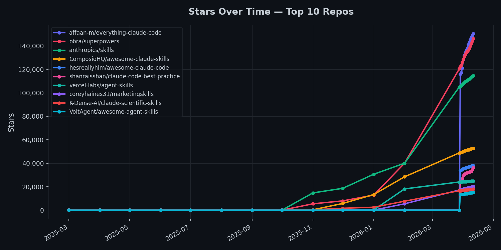
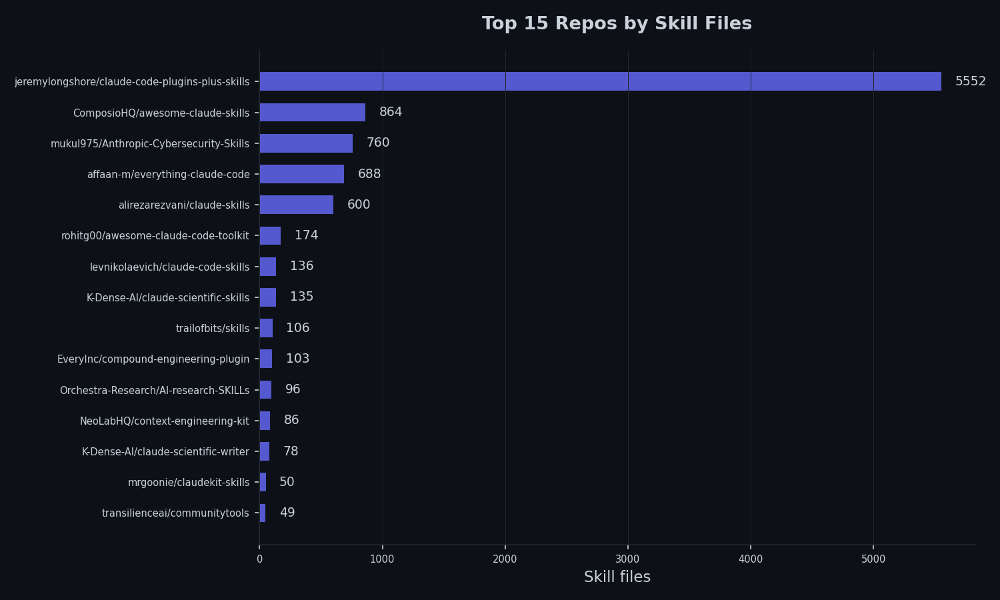
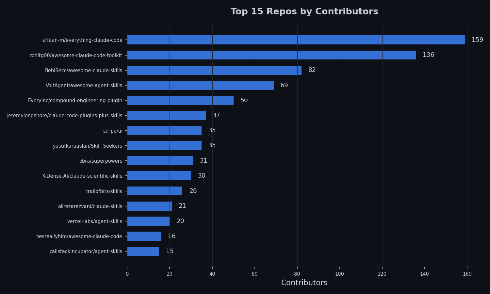
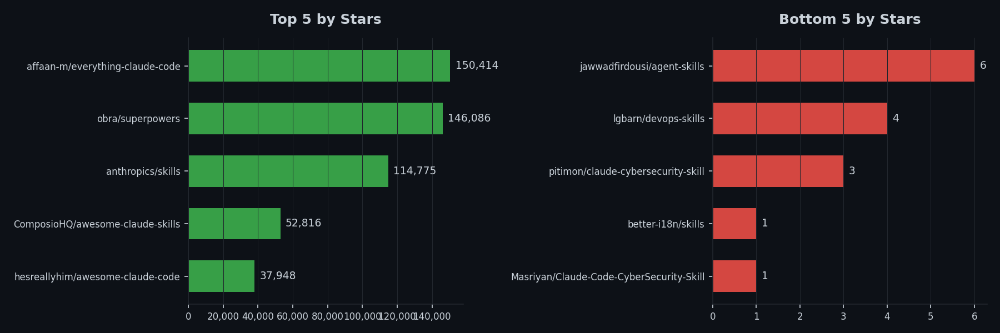

# Skills Collection

A curated collection of Claude Code skills repos, automatically synced daily.

## Stats

| Metric | Value |
|--------|-------|
| **Total repos** | 100 |
| **SKILL.md files** | 10286 (+35) |
| **Markdown files** | 26,041 |
| **Total size** | 719.6 MB |
| **Last synced** | 2026-04-11 06:18 UTC |
| **API fetch** | 21s |
| **Sync time** | 10s |
| **Analysis time** | 12s |

## GitHub Activity

| Metric | Value |
|--------|-------|
| **Total commits** | 14,457 |
| **Total PRs merged** | 3,180 |
| **PRs open** | 1,830 |
| **PRs closed** | 2,733 |
| **Issues open** | 1,094 |
| **Issues closed** | 2,708 |
| **Total forks** | 83,946 |
| **Total contributors** | 1,071 |

## Content Analysis

| Metric | Value |
|--------|-------|
| **Total skill lines** | 2,023,198 |
| **Total skill words** | 8,740,696 |
| **Avg lines per skill** | 280 |
| **Avg words per skill** | 1381 |
| **Total code blocks** | 52,860 |
| **Reference files** | 7,894 |
| **Repos with evals** | 6 |
| **Repos with tests** | 60 |
| **Repos with license** | 73 |
| **Repos with CLAUDE.md** | 43 |
| **Code languages** | 108 (alloy, apache, astro, bash, bat, bibtex, bicep, c, caddy, caddyfile, cedar, cmake, cmd, colang, conf, ...) |
## Charts

### Stars Over Time

### Top Repos by Skill Files

### Top Repos by Contributors

### Top & Bottom Repos by Stars

## Repos

| Repo | Description | Skills | Stars | Contributors | Size | Last Commit | Last Commit Date | Message |
|------|-------------|--------|-------|--------------|------|-------------|------------------|---------|
| [slavingia--skills](https://github.com/slavingia/skills) | Claude Code skills by Sahil Lavingia | 10 | 7659 (+57) | 5 | 0.0 MB | `7b75546` | 2026-04-11 | fix: add skills array to plugin.json for explicit skill registration (#19) |
| [zarazhangrui--codebase-to-course](https://github.com/zarazhangrui/codebase-to-course) | Turn any codebase into a structured course | 1 | 3349 (+48) | 3 | 0.1 MB | `ff8837e` | 2026-03-30 | Remove internal specs/plans from repo, add to .gitignore |
| [samber--cc-skills-golang](https://github.com/samber/cc-skills-golang) | Claude Code skills for Go development | 35 | 1121 (+22) | 6 | 2.7 MB | `9dfc70f` | 2026-04-08 | Add _test suffix (#15) |
| [realkimbarrett--advertising-skills](https://github.com/realkimbarrett/advertising-skills) | Advertising skills | 12 | 545 (+2) | 1 | 0.0 MB | `45f4a4a` | 2026-03-26 | Add files via upload |
| [ComposioHQ--awesome-claude-skills](https://github.com/ComposioHQ/awesome-claude-skills) | A curated list of awesome Claude Skills, resources, and tools for customizing Claude AI workflows  | 864 | 52816 (+249) | 13 | 11.1 MB | `2790447` | 2026-02-19 | reorganize: move composio automation skills to composio-skills/, restore original curated skills at root |
| [anthropics--skills](https://github.com/anthropics/skills) |  Public repository for Agent Skills  | 18 | 114775 (+620) | 11 | 9.7 MB | `12ab35c` | 2026-04-09 | Add proper front-matter to SKILL.md for claude-api (#897) |
| [1NickPappas--move-code-quality-skill](https://github.com/1NickPappas/move-code-quality-skill) | Claude Code skill for analyzing Move packages against the official Move Book Code Quality Checklist | 1 | 19 | 1 | 0.0 MB | `6813ac5` | 2025-10-21 | fix: improve output formatting with proper line breaks |
| [ARPeeketi--claude-resume-kit](https://github.com/ARPeeketi/claude-resume-kit) | Extract your papers once, generate tailored LaTeX resumes for every JD. Anti-fabrication controls, multi-perspective critique, AI fingerprint avoidance. | 0 | 40 | 1 | 0.5 MB | `69930e9` | 2026-03-10 | fix: use consistent 'skills' terminology in DOCS.md |
| [AgriciDaniel--claude-blog](https://github.com/AgriciDaniel/claude-blog) | Claude Code skill ecosystem for blog content creation, optimization, and management. Dual-optimized for Google rankings and AI citations. | 26 | 449 (+11) | 2 | 2.7 MB | `408433b` | 2026-04-10 | Add Rankenstein link, author section, and community links |
| [AgriciDaniel--claude-email](https://github.com/AgriciDaniel/claude-email) | AI-powered email management and marketing skill for Claude Code. Inbox triage, composition, quality review, deliverability audit, automation sequences, and marketing strategy. | 11 | 21 (+1) | 1 | 1.0 MB | `182270a` | 2026-04-10 | Add author section, community links, and backlinks |
| [ClickHouse--agent-skills](https://github.com/ClickHouse/agent-skills) | The official Agent Skills for ClickHouse and ClickHouse Cloud | 3 | 393 (+1) | 6 | 0.2 MB | `7d0c488` | 2026-04-09 | clickhousectl cloud deploy: OAuth is now read-only, API key needed for mutations (#21) |
| [Digidai--product-manager-skills](https://github.com/Digidai/product-manager-skills) | PM skill for Claude Code, Codex, Cursor, and Windsurf: diagnose SaaS metrics, critique PRDs, plan roadmaps, run discovery, and coach PM career transitions. | 1 | 52 (+1) | 1 | 0.2 MB | `d8565a4` | 2026-03-29 | Merge pull request #4 from Digidai/feat/v0.4-coaching-protocol |
| [EveryInc--compound-engineering-plugin](https://github.com/EveryInc/compound-engineering-plugin) | Office Compound Engineering plugin for Claude Code, Codex, and more | 103 (-4) | 13974 (+111) | 50 | 3.6 MB | `9aa65c1` | 2026-04-11 | docs(ce-setup): add getting started sections to READMEs (#548) |
| [Eyadkelleh--awesome-claude-skills-security](https://github.com/Eyadkelleh/awesome-claude-skills-security) | Security testing toolkit for Claude Code: curated SecLists wordlists, injection payloads, and expert agents for authorized pentesting, CTFs, and bug bounties | 15 | 147 (+2) | 3 | 2.7 MB | `86d2316` | 2026-03-21 | Merge pull request #2 from kriptoburak/add-xquik |
| [HeshamFS--materials-simulation-skills](https://github.com/HeshamFS/materials-simulation-skills) | Agent Skills for computational materials science -- numerical stability, solvers, meshing,   convergence, and simulation workflows. | 17 | 29 | 1 | 1.6 MB | `f4a4e7d` | 2026-03-26 | Add changelogs and evaluation suites for ontology and simulation workflow skills |
| [Imbad0202--academic-research-skills](https://github.com/Imbad0202/academic-research-skills) | Academic Research Skills for Claude Code: research → write → review → revise → finalize | 4 | 2506 (+70) | 1 | 4.1 MB | `a38cc26` | 2026-04-09 | fix: simplify review — trim governance files, fix inconsistencies |
| [K-Dense-AI--claude-scientific-skills](https://github.com/K-Dense-AI/claude-scientific-skills) | A set of ready to use Agent Skills for research, science, engineering, analysis, finance and writing. | 135 (+1) | 18069 (+196) | 30 | 39.5 MB | `086de41` | 2026-04-10 | Merge pull request #131 from pors/add-paperzilla-skill |
| [K-Dense-AI--claude-scientific-writer](https://github.com/K-Dense-AI/claude-scientific-writer) | A general purpose scientific writer | 78 | 1458 (+14) | 5 | 21.8 MB | `2f80d2a` | 2026-03-09 | Bump version to 2.12.1 for PyPI release |
| [NeoLabHQ--context-engineering-kit](https://github.com/NeoLabHQ/context-engineering-kit) | Hand-crafted Claude Code Skills focused on improving agent results quality. Compatible with OpenCode, Cursor, Antigravity, Gemini CLI, and others. | 86 | 788 (+5) | 5 | 3.5 MB | `8b92f50` | 2026-04-06 | Merge pull request #74 from NeoLabHQ/fix/vg/sadd/optimise-do-and-judge-usage-and-context-building |
| [Orchestra-Research--AI-research-SKILLs](https://github.com/Orchestra-Research/AI-research-SKILLs) | Comprehensive open-source library of AI research and engineering skills for any AI model. Package the skills and your claude code/codex/gemini agent will be an AI research agent with full horsepower. Maintained by Orchestra Research. | 96 (+1) | 6558 (+67) | 14 | 23.3 MB | `05f1958` | 2026-04-10 | Merge pull request #47 from Gitsamshi/main |
| [Paramchoudhary--ResumeSkills](https://github.com/Paramchoudhary/ResumeSkills) | A collection of AI agent skills focused on resume optimization, job applications, and career development. Built for job seekers, career changers, and professionals who want Claude Code to help with resume writing, ATS optimization, interview prep, and strategic job search. | 27 | 253 (+4) | 1 | 0.3 MB | `921c9be` | 2026-01-30 | Update README with correct installation commands |
| [Valian--linear-cli-skill](https://github.com/Valian/linear-cli-skill) | linear-cli-skill | 1 | 13 | 1 | 0.1 MB | `9d9c972` | 2025-10-26 | Add development guide for Linear CLI (#2) |
| [ahmedasmar--devops-claude-skills](https://github.com/ahmedasmar/devops-claude-skills) | A Claude Code Skills Marketplace for DevOps workflows | 6 | 118 | 1 | 1.0 MB | `b06435d` | 2025-11-01 | Merge pull request #4 from ahmedasmar/rename-aws-cost-finops-to-optimization |
| [airowe--claude-a11y-skill](https://github.com/airowe/claude-a11y-skill) | Claude Code skill for running comprehensive accessibility audits (axe-core + jsx-a11y) | 0 | 7 | 1 | 0.0 MB | `48aa052` | 2026-01-24 | feat: initial accessibility audit skill for Claude Code |
| [akin-ozer--cc-devops-skills](https://github.com/akin-ozer/cc-devops-skills) | A practical skill pack for DevOps work in Claude Code and Codex. | 31 | 173 (+3) | 1 | 4.1 MB | `2073d65` | 2026-03-27 | Add Codex plugin manifest and installation docs |
| [alonw0--web-asset-generator](https://github.com/alonw0/web-asset-generator) | Claude skill to generate favicons, app icons, and social media images from logos, text, or emojis. Supports emoji suggestions, validation, and framework auto-integration. | 1 | 302 (+3) | 2 | 15.4 MB | `c6d56dc` | 2026-01-28 | Merge pull request #3 from sliver2er/fix/plugin-skills-path |
| [antonbabenko--terraform-skill](https://github.com/antonbabenko/terraform-skill) | The Claude Agent Skill for Terraform and OpenTofu - testing, modules, CI/CD, and production patterns | 1 | 1512 (+5) | 3 | 0.2 MB | `5a68694` | 2026-02-02 | chore(release): v1.6.0 [skip ci] |
| [avifenesh--agentsys](https://github.com/avifenesh/agentsys) | AI writes code. This automates everything else · 19 plugins, 47 agents, and 39 skills · for Claude Code, OpenCode, Codex, Cursor, Kiro. | 33 | 710 (+1) | 6 | 3.9 MB | `235c033` | 2026-04-11 | 5.8.3 |
| [better-auth--skills](https://github.com/better-auth/skills) | skills | 5 | 171 | 6 | 0.1 MB | `6a16369` | 2026-03-02 | docs: improve skill descriptions and content quality (#8) |
| [better-i18n--skills](https://github.com/better-i18n/skills) | Official AI agent skills for Better i18n — best practices for i18n implementation, translation workflows, and localization automation with Claude, GPT, and other AI assistants | 2 | 1 | 2 | 0.2 MB | `ef3df0b` | 2026-03-29 | chore: add skills/better-i18n/ for Open Plugins standard compatibility |
| [brunoasm--my_claude_skills](https://github.com/brunoasm/my_claude_skills) | Claude Skill to prevent automatic confirmatory answers | 6 | 9 | 2 | 7.2 MB | `6e94e42` | 2026-04-02 | Improve accounting skill with pattern learning and proactive file reading |
| [callstackincubator--agent-skills](https://github.com/callstackincubator/agent-skills) | A collection of agent-optimized React Native skills for AI coding assistants. | 11 | 1226 (+6) | 15 | 9.2 MB | `ace14e4` | 2026-04-09 | fix(cursor): add importable .mdc rules for GitHub import (#56) |
| [chrisvoncsefalvay--claude-d3js-skill](https://github.com/chrisvoncsefalvay/claude-d3js-skill) | A Claude skill for d3.js. | 1 | 153 (+1) | 1 | 0.1 MB | `e198c87` | 2025-10-18 | Initial commit. |
| [cloudflare--skills](https://github.com/cloudflare/skills) | Skills for teaching agents how to build on Cloudflare. | 9 | 814 (+7) | 12 | 1.5 MB | `5ec03da` | 2026-04-06 | fix: standardize AIChatAgent and useAgentChat import paths (#38) |
| [coffeefuelbump--csv-data-summarizer-claude-skill](https://github.com/coffeefuelbump/csv-data-summarizer-claude-skill) | A Claude Skill that automatically analyzes uploaded CSV files — generating summary statistics, detecting missing data, and creating quick visualizations using Python and pandas. | 1 | 334 (+2) | 1 | 0.0 MB | `9b3affd` | 2025-10-16 | leave a like & subscribe if this was helpful :) |
| [conorbronsdon--avoid-ai-writing](https://github.com/conorbronsdon/avoid-ai-writing) | Claude Code & OpenClaw skill that audits and rewrites content to remove AI writing patterns | 1 | 879 (+26) | 1 | 0.1 MB | `f20b9b7` | 2026-04-07 | Merge pull request #7 from conorbronsdon/add-hit-differently-tier1 |
| [conorluddy--ios-simulator-skill](https://github.com/conorluddy/ios-simulator-skill) | An IOS Simulator Skill for ClaudeCode. Use it to optimise Claude's ability to build, run and interact with your apps, without using up any of the available token/context budget. | 1 | 771 (+14) | 2 | 0.4 MB | `c9e021e` | 2026-03-12 | Add badge for Ask DeepWiki to README |
| [coreyhaines31--marketingskills](https://github.com/coreyhaines31/marketingskills) | Marketing skills for Claude Code and AI agents. CRO, copywriting, SEO, analytics, and growth engineering. | 35 | 20218 (+205) | 8 | 1.8 MB | `2c7c108` | 2026-04-06 | chore: sync skills with marketplace.json and README |
| [dreamiurg--claude-mountaineering-skills](https://github.com/dreamiurg/claude-mountaineering-skills) | Automates mountain route research for North American peaks. Aggregates data from 10+ mountaineering sources to generate detailed route beta reports with weather, avalanche conditions, and trip reports. | 4 | 24 | 3 | 4.4 MB | `f448402` | 2026-03-29 | chore(deps): bump conventional-changelog-conventionalcommits (#70) |
| [emaynard--claude-family-history-research-skill](https://github.com/emaynard/claude-family-history-research-skill) | A Claude Skill to assist with family history and genealogy research planning. | 1 | 54 | 2 | 0.1 MB | `7334d3d` | 2025-12-07 | Add Ko-fi username for funding support |
| [expo--skills](https://github.com/expo/skills) | A collection of AI agent skills for working with Expo projects and Expo Application Services | 12 | 1662 (+10) | 13 | 0.2 MB | `8f26555` | 2026-04-10 | fix: quote backticks in SKILL.md descriptions to fix YAML parsing (#35) |
| [firecrawl--cli](https://github.com/firecrawl/cli) | CLI and Agent Skill for Firecrawl - Add scrape, search, and browsing capabilities to your AI agents | 10 | 270 (+4) | 8 | 0.6 MB | `42da890` | 2026-04-10 | Merge pull request #93 from firecrawl/firecrawl-build-skills |
| [hashicorp--agent-skills](https://github.com/hashicorp/agent-skills) | A collection of Agent skills and Claude Code plugins for HashiCorp products. | 16 | 534 (+1) | 11 | 0.3 MB | `75a9aed` | 2026-04-01 | feat: add terraform provider-docs agent skill (#26) |
| [jananthan30--Resume-Builder](https://github.com/jananthan30/Resume-Builder) | AI-powered resume & cover letter generator with dual ATS + HR scoring. Works for any profession. Claude Code plugin. | 0 | 23 | 1 | 1.3 MB | `5df7636` | 2026-03-26 | Scrub all PII from public repo — remove personal names, emails, phone, addresses |
| [javiera-vasquez--claude-code-job-tailor](https://github.com/javiera-vasquez/claude-code-job-tailor) | AI resume optimization system for Claude Code. Analyzes job postings, ranks requirements by priority, and automatically selects your most relevant achievements. Write your experience once in YAML, generate unlimited tailored PDFs in 60 less than seconds using Tailor | 3 | 114 | 1 | 34.3 MB | `8ae1bda` | 2025-10-28 | Merge pull request #28 from javiera-vasquez/chore/demo-v3 |
| [jawwadfirdousi--agent-skills](https://github.com/jawwadfirdousi/agent-skills) | agent-skills | 4 | 6 | 1 | 0.1 MB | `dd50000` | 2026-03-08 | Merge pull request #8 from jawwadfirdousi/prompt-wizard-1 |
| [jthack--ffuf_claude_skill](https://github.com/jthack/ffuf_claude_skill) | This is a "skill" for claude to use FFUF. | 1 | 136 (+2) | 1 | 0.0 MB | `50fd4af` | 2025-10-16 | Update installation instructions for Claude Code skills directory |
| [lackeyjb--playwright-skill](https://github.com/lackeyjb/playwright-skill) | Claude Code Skill for browser automation with Playwright. Model-invoked - Claude autonomously writes and executes custom automation for testing and validation. | 1 | 2374 (+12) | 2 | 0.1 MB | `bb7e920` | 2025-12-19 | docs: relocate API reference and align with Agent Skills spec (#22) |
| [livelabs-ventures--nano-skills](https://github.com/livelabs-ventures/nano-skills) | Creating images with Nano Banana Pro | 1 | 8 | 1 | 0.0 MB | `66494ee` | 2025-11-28 | fix: always use correct file extension for actual image format |
| [mhattingpete--claude-skills-marketplace](https://github.com/mhattingpete/claude-skills-marketplace) | Claude Code Skills for software engineering workflows - Git automation, testing, and code review | 20 | 543 | 1 | 1.5 MB | `3fa16a9` | 2026-03-06 | Add shields.io badges and cross-link section to README |
| [michalparkola--tapestry-skills-for-claude-code](https://github.com/michalparkola/tapestry-skills-for-claude-code) | Claude Code skills to download sources (articles, PDFs, YouTube video transcripts) | 7 | 334 (+2) | 2 | 0.1 MB | `80e1dc5` | 2026-03-11 | fix username |
| [neondatabase--agent-skills](https://github.com/neondatabase/agent-skills) | Agent Skills for Neon Severless Postgres | 6 | 49 (+1) | 7 | 0.7 MB | `1304e29` | 2026-03-17 | Merge pull request #17 from neondatabase/add-egress-optimizer-plugin |
| [netlify--context-and-tools](https://github.com/netlify/context-and-tools) | context-and-tools | 27 | 13 (+1) | 8 | 0.3 MB | `3995c32` | 2026-04-07 | Update README with Codex CLI instructions |
| [obra--superpowers](https://github.com/obra/superpowers) | An agentic skills framework & software development methodology that works. | 15 | 146086 (+1804) | 31 | 0.7 MB | `917e5f5` | 2026-04-06 | Fix Discord invite link |
| [obra--superpowers-skills](https://github.com/obra/superpowers-skills) | Community-editable skills for Claude Code's superpowers plugin | 31 | 607 | 5 | 0.4 MB | `cdcd624` | 2025-10-14 | Use flexible remote detection in pulling-updates skill (#11) |
| [omkamal--pypict-claude-skill](https://github.com/omkamal/pypict-claude-skill) | A claude skill that generate test cases using N-wise test cases using the pypict library | 1 | 68 | 2 | 0.1 MB | `fbda212` | 2026-03-22 | Merge pull request #1 from ThinkPeace/patch-1 |
| [proficientlyjobs--proficiently-claude-skills](https://github.com/proficientlyjobs/proficiently-claude-skills) | Claude Code skills for AI-powered job search, resume tailoring, and cover letter writing | 7 | 95 (+2) | 2 | 0.1 MB | `9bc1f6f` | 2026-03-12 | Merge pull request #5 from proficientlyjobs/add-jobsearch-telegram |
| [remotion-dev--skills](https://github.com/remotion-dev/skills) | Agent Skills | 39 (+1) | 2690 (+23) | 1 | 0.1 MB | `41a3b06` | 2026-04-10 | Update template |
| [replicate--skills](https://github.com/replicate/skills) | A collection of Agent Skills for building AI-powered apps with Replicate | 1 | 29 | 1 | 0.0 MB | `8c871d6` | 2026-02-19 | Merge pull request #3 from replicate/improve-schema-validation-guidance |
| [robertguss--claude-skills](https://github.com/robertguss/claude-skills) | A collection of custom skills that extend Claude's capabilities with specialized workflows, methods, and domain knowledge. | 39 | 66 | 2 | 2.2 MB | `c31f3be` | 2026-03-22 | Overhaul app-store-opportunity-research: iOS-only focus, major improvements |
| [ryanbbrown--revealjs-skill](https://github.com/ryanbbrown/revealjs-skill) | Claude Code skill for making reveal.js presentations | 1 | 254 (+1) | 1 | 2.1 MB | `188e0dc` | 2026-02-16 | refactor: remove predefined callout/box styles, let model generate its own |
| [sanity-io--agent-toolkit](https://github.com/sanity-io/agent-toolkit) | Collection of resources to help AI agents build better with Sanity. | 8 | 114 | 11 | 0.3 MB | `9800010` | 2026-04-09 | Merge pull request #35 from sanity-io/sanity-functions-skill |
| [sanjay3290--ai-skills](https://github.com/sanjay3290/ai-skills) | Collection of agent skills for AI coding assistants | 20 | 201 | 1 | 0.8 MB | `e4c0b94` | 2026-03-03 | feat(atlassian): add unified Jira + Confluence skill with dual-backend support |
| [smerchek--claude-epub-skill](https://github.com/smerchek/claude-epub-skill) | A Claude Skill for converting markdown documents, chat summaries, or research reports into a downloadable epub file that can be sent to kindle | 1 | 104 | 1 | 0.1 MB | `7c07230` | 2025-10-18 | fix: improve changelog extraction in release workflow |
| [squirrelscan--skills](https://github.com/squirrelscan/skills) | Agent skills for squirrelscan website audit tool | 1 | 72 | 1 | 0.0 MB | `91e0dfb` | 2026-02-09 | fix(skills): scope allowed-tools, remove remaining VT flags |
| [stripe--ai](https://github.com/stripe/ai) | One-stop shop for building AI-powered products and businesses with Stripe. | 10 | 1456 (+7) | 35 | 22.2 MB | `fd91269` | 2026-04-10 | Update & pin rack dependency in ruby environment + solutions (#366) |
| [supabase--agent-skills](https://github.com/supabase/agent-skills) | Agent Skills to help developers using AI agents with Supabase | 2 | 1908 (+30) | 7 | 0.2 MB | `05a8f1a` | 2026-04-09 | fix install claude code plugin command (#62) |
| [tinybirdco--tinybird-agent-skills](https://github.com/tinybirdco/tinybird-agent-skills) | tinybird-agent-skills | 4 | 14 | 6 | 0.1 MB | `a33c7fb` | 2026-03-23 | Merge pull request #15 from tinybirdco/docs/add-python-sdk-to-readme |
| [trailofbits--skills](https://github.com/trailofbits/skills) | Trail of Bits Claude Code skills for security research, vulnerability detection, and audit workflows | 106 | 4467 (+39) | 26 | 3.9 MB | `d7f76b5` | 2026-04-01 | Cosmos improve (#127) |
| [typefully--agent-skills](https://github.com/typefully/agent-skills) | AI agent skills for drafting and scheduling social media posts via Typefully | 1 | 41 | 2 | 0.2 MB | `a57a932` | 2026-03-17 | Add X post analytics support to the Typefully skill, including reply filtering (#12) |
| [varunr89--resume-tailoring-skill](https://github.com/varunr89/resume-tailoring-skill) | AI-powered resume tailoring skill for Claude Code | 1 | 267 (+7) | 2 | 0.2 MB | `9a4a0f2` | 2026-03-01 | feat: add plugin.json and move SKILL.md to skills/ for marketplace compatibility |
| [vercel-labs--agent-skills](https://github.com/vercel-labs/agent-skills) | Vercel's official collection of agent skills | 7 | 24865 (+55) | 20 | 0.8 MB | `73140fc` | 2026-04-02 | Refine react-view-transition skill |
| [vercel-labs--next-skills](https://github.com/vercel-labs/next-skills) | next-skills | 3 | 810 (+1) | 2 | 0.1 MB | `038954e` | 2026-02-16 | mirgate unstable_cache to cc api (#5) |
| [wrsmith108--linear-claude-skill](https://github.com/wrsmith108/linear-claude-skill) | Agent skill for managing Linear issues, projects, and teams. MCP tools, SDK automation, GraphQL API patterns. | 1 | 82 (+2) | 3 | 0.5 MB | `d25e4c3` | 2026-04-08 | docs: update README, SKILL.md, CLAUDE.md, labels.md for run.sh and npm run |
| [wrsmith108--varlock-claude-skill](https://github.com/wrsmith108/varlock-claude-skill) | Claude Code skill for secure environment variable management with Varlock. Never expose secrets in Claude sessions. | 1 | 17 | 1 | 0.0 MB | `348a435` | 2026-03-04 | feat: add Claude plugin marketplace metadata |
| [zarazhangrui--frontend-slides](https://github.com/zarazhangrui/frontend-slides) | Create beautiful slides on the web using Claude's frontend skills | 2 | 13773 (+125) | 7 | 0.1 MB | `8dca834` | 2026-04-08 | Merge pull request #48 from zarazhangrui/fix/navdots-and-export-state |
| [zxkane--aws-skills](https://github.com/zxkane/aws-skills) | Claude Agent Skills for AWS | 5 | 237 (+2) | 1 | 0.3 MB | `fea9455` | 2026-03-06 | fix(plugins): security harden scripts and improve skill quality |
| [travisvn--awesome-claude-skills](https://github.com/travisvn/awesome-claude-skills) | A curated list of awesome Claude Skills, resources, and tools for customizing Claude AI workflows | 0 | 10988 (+58) | 2 | 0.0 MB | `b05169a` | 2026-03-16 | Add shadcn/ui to skills list |
| [obra--superpowers-lab](https://github.com/obra/superpowers-lab) | Experimental skills for Claude Code Superpowers - new techniques and tools | 5 | 274 | 2 | 0.1 MB | `59389b1` | 2026-03-23 | Add windows-vm skill for headless Windows 11 in Docker |
| [asklokesh--claudeskill-loki-mode](https://github.com/asklokesh/claudeskill-loki-mode) | Multi-agent provider agnostic autonomous system and framework | 4 | 828 (+2) | 5 | 39.5 MB | `2080e3b` | 2026-04-08 | docs: alilxxey signed the CLA in #$pullRequestNo |
| [yusufkaraaslan--Skill_Seekers](https://github.com/yusufkaraaslan/Skill_Seekers) | Convert documentation websites, GitHub repos, and PDFs into Claude AI skills | 3 | 12628 (+35) | 35 | 35.4 MB | `d86cfcb` | 2026-04-09 | feat: enable all content extraction features by default |
| [mukul975--Anthropic-Cybersecurity-Skills](https://github.com/mukul975/Anthropic-Cybersecurity-Skills) | 753+ structured cybersecurity skills for AI agents · MITRE ATT&CK mapped · agentskills.io open standard · Works with Claude Code, GitHub Copilot, OpenAI Codex CLI, Cursor, Gemini CLI & 20+ platforms · Penetration testing, DFIR, threat intel, cloud security & more · Apache 2.0 | 760 | 4241 (+42) | 3 | 28.1 MB | `c715f0b` | 2026-04-10 | Revise README for improved clarity and structure |
| [eth0izzle--security-skills](https://github.com/eth0izzle/security-skills) | A collection of Claude Code skills that help security teams stay secure | 1 | 35 (+1) | 1 | 2.0 MB | `6add339` | 2026-02-17 | Pluralize skill name + restructure filesystem |
| [Masriyan--Claude-Code-CyberSecurity-Skill](https://github.com/Masriyan/Claude-Code-CyberSecurity-Skill) | A comprehensive collection of 15 Claude Code Skills for cybersecurity professionals — covering offensive security, defensive operations, reverse engineering, threat hunting, CSOC automation, and more | 15 | 1 | 1 | 0.3 MB | `b10c1cc` | 2026-02-27 | Add files via upload |
| [pitimon--claude-cybersecurity-skill](https://github.com/pitimon/claude-cybersecurity-skill) | Claude Code plugin — 18 cybersecurity domains: IR, DFIR, DevSecOps, SOC, Code Security, Container, Compliance, Cloud/CSPM, Zero Trust, AI/ML, API, Vulnerability Mgmt, Threat Intel, OT/ICS, Governance. Bilingual Thai+English. | 1 | 3 | 1 | 1.2 MB | `752e075` | 2026-03-01 | feat: deepen Thai Context for D20, D21, D22 |
| [transilienceai--communitytools](https://github.com/transilienceai/communitytools) | Open-source Claude Code skills, agents, and slash commands for AI-powered penetration testing, bug bounty hunting, and security research | 49 | 150 (+3) | 6 | 6.8 MB | `99cbfac` | 2026-03-27 | Merge pull request #15 from transilienceai/docs/issue-pr-templates |
| [alirezarezvani--claude-skills](https://github.com/alirezarezvani/claude-skills) | +192 Claude Code skills & agent plugins for Claude Code, Codex, Gemini CLI, Cursor, and 8 more coding agents — engineering, marketing, product, compliance, C-level advisory. | 600 (+30) | 10417 (+170) | 21 | 21.3 MB | `554fcd9` | 2026-04-11 | Merge pull request #515 from alirezarezvani/dev |
| [VoltAgent--awesome-agent-skills](https://github.com/VoltAgent/awesome-agent-skills) | Claude Code Skills and 1000+ agent skills from official dev teams and the community, compatible with Codex, Antigravity, Gemini CLI, Cursor and others. | 0 | 15115 (+124) | 69 | 0.1 MB | `8f3d366` | 2026-04-10 | Merge pull request #409 from VoltAgent/update-readme-toc |
| [BehiSecc--awesome-claude-skills](https://github.com/BehiSecc/awesome-claude-skills) | A curated list of Claude Skills. | 0 | 8340 (+26) | 82 | 0.0 MB | `36c9335` | 2026-04-01 | Merge pull request #169 from TomGranot/add-hubspot-admin-skills |
| [levnikolaevich--claude-code-skills](https://github.com/levnikolaevich/claude-code-skills) | Plugin suite + bundled MCP servers for Claude Code. Full delivery lifecycle: Agile pipeline with multi-model AI review, project bootstrap, documentation generation, codebase audits, performance optimization, community workflows. Includes hex-line (hash-verified editing), hex-graph (code knowledge graph), and hex-ssh (remote SSH) MCP servers. | 136 (+6) | 372 (+1) | 1 | 16.2 MB | `24a09cf` | 2026-04-10 | release: @levnikolaevich/hex-line-mcp v1.17.0, @levnikolaevich/hex-graph-mcp v0.13.0 |
| [jeremylongshore--claude-code-plugins-plus-skills](https://github.com/jeremylongshore/claude-code-plugins-plus-skills) | 340 plugins + 1367 agent skills for Claude Code. Open-source marketplace with CCPI package manager, interactive tutorials, and production orchestration patterns. | 5552 (-1) | 1899 (+11) | 37 | 208.8 MB | `c8a915c` | 2026-04-09 | feat(blog): add Apr 6-8 posts to tonsofskills.com/blog |
| [rohitg00--awesome-claude-code-toolkit](https://github.com/rohitg00/awesome-claude-code-toolkit) | The most comprehensive toolkit for Claude Code -- 135 agents, 35 curated skills (+400,000 via SkillKit), 42 commands, 150+ plugins, 19 hooks, 15 rules, 7 templates, 8 MCP configs, and more. | 174 | 1177 (+12) | 136 | 1.5 MB | `b1253bc` | 2026-04-10 | Merge pull request #248 from GeiserX/add-cc-aws-keepalive |
| [daymade--claude-code-skills](https://github.com/daymade/claude-code-skills) | Professional Claude Code skills marketplace featuring production-ready skills for enhanced development workflows. | 48 | 817 (+10) | 2 | 12.3 MB | `6bb8d7f` | 2026-04-10 | fix(pdf-creator): extend CJK coverage + handle pandoc-highlighted code blocks |
| [lgbarn--devops-skills](https://github.com/lgbarn/devops-skills) | DevOps skills for Claude Code: Terraform/OpenTofu workflows, AWS infrastructure management, safety-first IaC practices | 27 | 4 | 15 | 0.6 MB | `8a37cc3` | 2026-01-23 | refactor: complete namespace migration from superpowers to devops-skills |
| [affaan-m--everything-claude-code](https://github.com/affaan-m/everything-claude-code) | The agent harness performance optimization system. Skills, instincts, memory, security, and research-first development for Claude Code, Codex, Opencode, Cursor and beyond. | 688 | 150414 (+1317) | 159 | 33.6 MB | `125d5e6` | 2026-04-10 | feat: add ecc2 legacy plugin migration import |
| [glebis--claude-skills](https://github.com/glebis/claude-skills) | Collection of Claude Code skills for enhanced AI workflows | 35 (+1) | 102 (+3) | 7 | 6.0 MB | `68da632` | 2026-04-10 | feat: add GWS (Google Workspace CLI) skill |
| [shanraisshan--claude-code-best-practice](https://github.com/shanraisshan/claude-code-best-practice) | practice made claude perfect | 28 | 36103 (+1479) | 4 | 33.0 MB | `defaf33` | 2026-04-09 | append concepts changelog — v2.1.97 adds Agent SDK row, env vars inline link |
| [mrgoonie--claudekit-skills](https://github.com/mrgoonie/claudekit-skills) | All powerful skills of ClaudeKit.cc! | 50 | 1964 (+5) | 6 | 11.2 MB | `80113d8` | 2026-04-03 | Merge pull request #19 from mrgoonie/feat/bunny-skill |
| [hesreallyhim--awesome-claude-code](https://github.com/hesreallyhim/awesome-claude-code) | A curated list of awesome skills, hooks, slash-commands, agent orchestrators, applications, and plugins for Claude Code by Anthropic | 2 | 37948 (+175) | 16 | 8.1 MB | `9a3c0eb` | 2026-04-11 | chore: update repo ticker data and SVGs [skip ci] |
| [jqueryscript--awesome-claude-code](https://github.com/jqueryscript/awesome-claude-code) | A curated list of awesome tools, IDE integrations, frameworks, and other resources for developers working with Anthropic's Claude Code. | 0 | 256 (+2) | 1 | 0.1 MB | `e2b7803` | 2026-04-09 | Update README.md |

> **[View full skills index (SKILLS.md)](SKILLS.md)** — all named skills with descriptions, versions, licenses, and direct links.

## How it works

A GitHub Actions workflow runs daily to:

1. Clone or pull all skill repos into `skills/`
2. Run `generate_readme.py` to regenerate this README with fresh stats and charts
3. Commit and push any changes

---

*Auto-generated by `generate_readme.py` on 2026-04-11 06:18 UTC*
