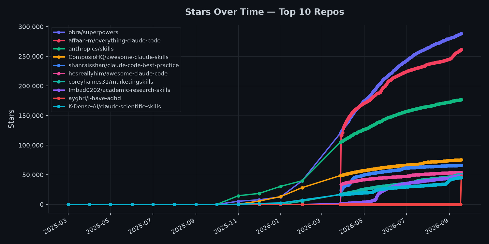
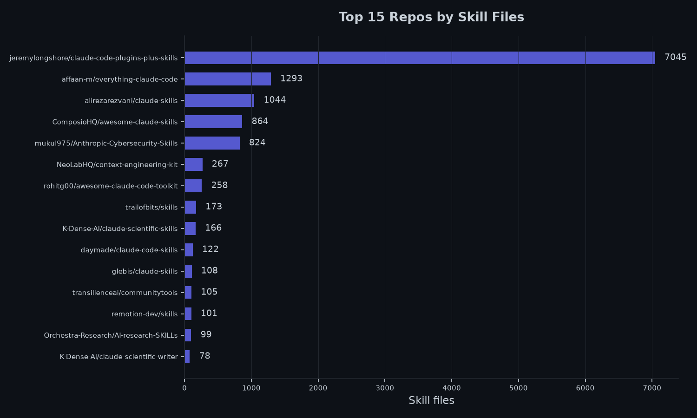
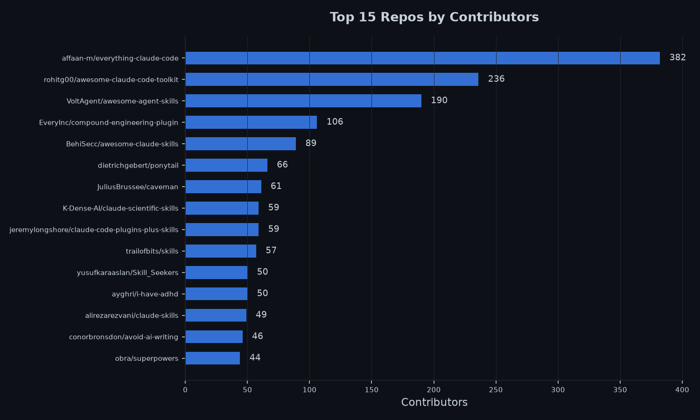
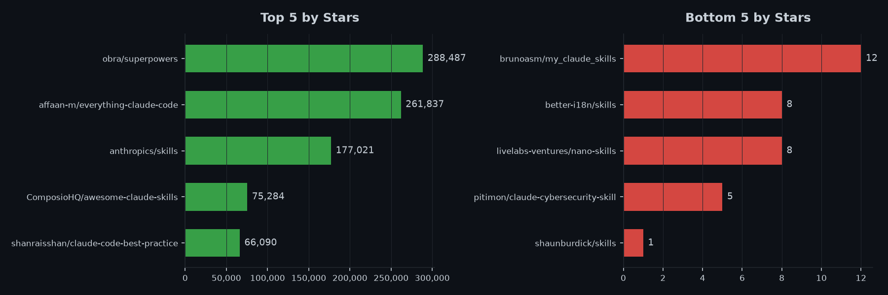
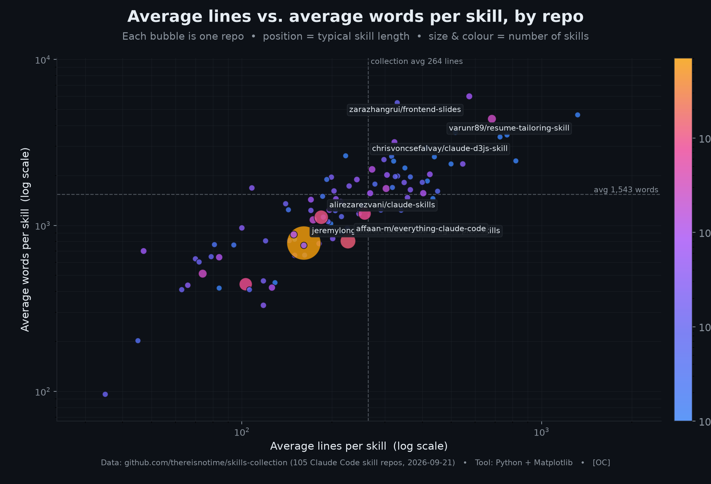
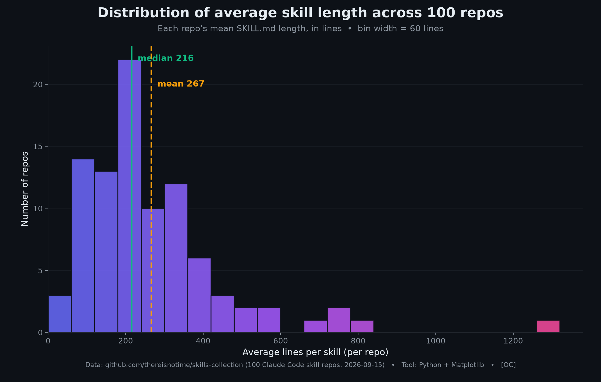
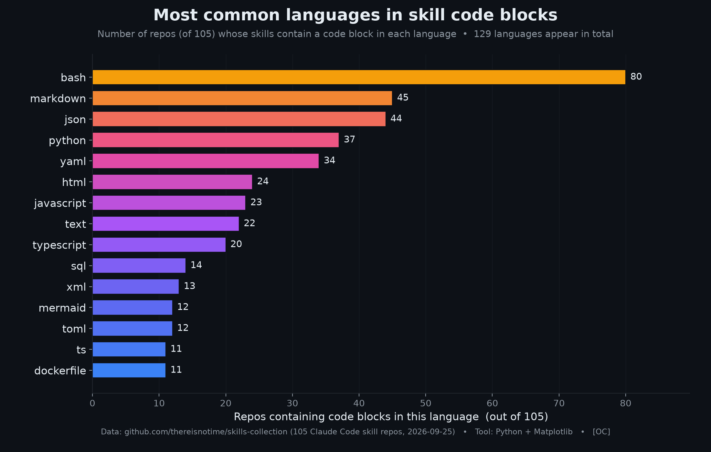
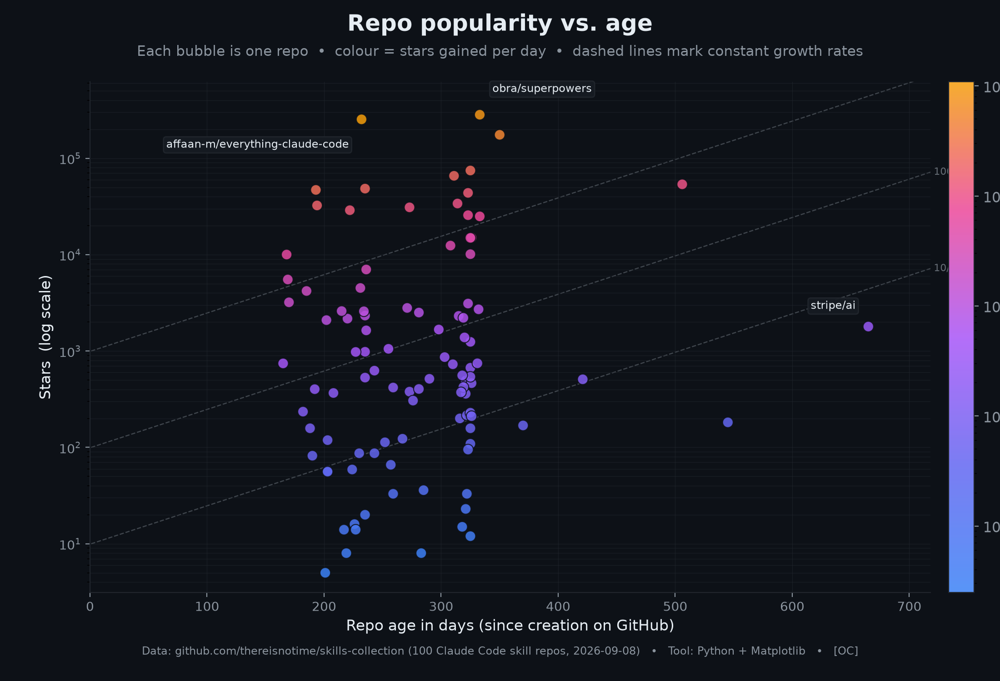

# Skills Collection

A curated collection of Claude Code skills repos, automatically synced daily.

## Interesting Projects

- [Awesome AI Skills](https://awesome-ai-skills.yourtech.stream/) — an expanded, interactive view of this data.

## Stats

| Metric | Value |
|--------|-------|
| **Total repos** | 100 |
| **SKILL.md files** | 12879 (+22) |
| **Markdown files** | 36,222 |
| **Total size** | 1183.8 MB |
| **Last synced** | 2026-08-04 08:13 UTC |
| **API fetch** | 32s |
| **Sync time** | 29s |
| **Analysis time** | 17s |

## GitHub Activity

| Metric | Value |
|--------|-------|
| **Total commits** | 24,613 |
| **Total PRs merged** | 6,738 |
| **PRs open** | 4,137 |
| **PRs closed** | 5,184 |
| **Issues open** | 2,212 |
| **Issues closed** | 4,669 |
| **Total forks** | 143,836 |
| **Total contributors** | 1,708 |

## Content Analysis

| Metric | Value |
|--------|-------|
| **Total skill lines** | 2,567,503 |
| **Total skill words** | 12,284,714 |
| **Avg lines per skill** | 275 |
| **Avg words per skill** | 1640 |
| **Total code blocks** | 64,293 |
| **Reference files** | 12,963 |
| **Repos with evals** | 10 |
| **Repos with tests** | 65 |
| **Repos with license** | 74 |
| **Repos with CLAUDE.md** | 44 |
| **Code languages** | 121 (alloy, apache, astro, bash, bat, batch, bibtex, bicep, blade, c, caddy, caddyfile, cedar, cmake, cmd, ...) |
## Charts

### Stars Over Time

### Top Repos by Skill Files

### Top Repos by Contributors

### Top & Bottom Repos by Stars

### Average Lines vs. Words per Skill

### Distribution of Average Skill Length

### Most Common Languages in Skill Code Blocks

### Repo Popularity vs. Age

## Repos

| Repo | Description | Skills | Stars | Contributors | Size | Last Commit | Last Commit Date | Message |
|------|-------------|--------|-------|--------------|------|-------------|------------------|---------|
| [slavingia--skills](https://github.com/slavingia/skills) | Claude Code skills by Sahil Lavingia | 10 | 9746 (+28) | 6 | 0.0 MB | `eb9f57f` | 2026-04-14 | fix: remove invalid 'skills' array from plugin.json (#21) |
| [zarazhangrui--codebase-to-course](https://github.com/zarazhangrui/codebase-to-course) | Turn any codebase into a structured course | 1 | 5325 (+9) | 3 | 0.1 MB | `ff8837e` | 2026-03-30 | Remove internal specs/plans from repo, add to .gitignore |
| [samber--cc-skills-golang](https://github.com/samber/cc-skills-golang) | Claude Code skills for Go development | 46 | 2844 (+22) | 11 | 3.5 MB | `3a82362` | 2026-08-01 | chore(deps): bump DavidAnson/markdownlint-cli2-action from 23 to 24 (#87) |
| [realkimbarrett--advertising-skills](https://github.com/realkimbarrett/advertising-skills) | Advertising skills | 12 | 721 (-1) | 1 | 0.0 MB | `45f4a4a` | 2026-03-26 | Add files via upload |
| [ComposioHQ--awesome-claude-skills](https://github.com/ComposioHQ/awesome-claude-skills) | A curated list of awesome Claude Skills, resources, and tools for customizing Claude AI workflows  | 864 | 71728 (+148) | 29 | 11.1 MB | `be2a406` | 2026-07-24 | Update README.md |
| [anthropics--skills](https://github.com/anthropics/skills) |  Public repository for Agent Skills  | 18 | 166126 (+432) | 14 | 10.1 MB | `b29e7cf` | 2026-07-24 | Update claude-api skill: Claude Opus 5 (#1476) |
| [1NickPappas--move-code-quality-skill](https://github.com/1NickPappas/move-code-quality-skill) | Claude Code skill for analyzing Move packages against the official Move Book Code Quality Checklist | 1 | 23 | 1 | 0.0 MB | `6813ac5` | 2025-10-21 | fix: improve output formatting with proper line breaks |
| [ARPeeketi--claude-resume-kit](https://github.com/ARPeeketi/claude-resume-kit) | Extract your papers once, generate tailored LaTeX resumes for every JD. Anti-fabrication controls, multi-perspective critique, AI fingerprint avoidance. | 0 | 205 (+1) | 1 | 0.5 MB | `69930e9` | 2026-03-10 | fix: use consistent 'skills' terminology in DOCS.md |
| [AgriciDaniel--claude-blog](https://github.com/AgriciDaniel/claude-blog) | Claude Code skill ecosystem for blog content creation, optimization, and management. Dual-optimized for Google rankings and AI citations. | 52 | 1563 (+19) | 2 | 6.1 MB | `aec971a` | 2026-07-23 | Merge pull request #50 from AgriciDaniel/codex/public-v2.1.1-ci-gate |
| [AgriciDaniel--claude-email](https://github.com/AgriciDaniel/claude-email) | AI-powered email management and marketing skill for Claude Code. Inbox triage, composition, quality review, deliverability audit, automation sequences, and marketing strategy. | 11 | 99 | 1 | 1.0 MB | `182270a` | 2026-04-10 | Add author section, community links, and backlinks |
| [ClickHouse--agent-skills](https://github.com/ClickHouse/agent-skills) | The official Agent Skills for ClickHouse and ClickHouse Cloud | 11 | 508 (+2) | 17 | 1.2 MB | `6e5458d` | 2026-07-27 | Add infra-postgres and infra-clickhouse skills (#43) |
| [Digidai--product-manager-skills](https://github.com/Digidai/product-manager-skills) | PM skill for Claude Code, Codex, Cursor, and Windsurf: diagnose SaaS metrics, critique PRDs, plan roadmaps, run discovery, and coach PM career transitions. | 1 | 136 (+4) | 1 | 0.2 MB | `ab7a406` | 2026-04-12 | chore: release v0.5.4 |
| [EveryInc--compound-engineering-plugin](https://github.com/EveryInc/compound-engineering-plugin) | Office Compound Engineering plugin for Claude Code, Codex, and more | 46 | 23747 (+56) | 87 | 11.5 MB | `6a2a0f9` | 2026-08-04 | chore: release main (#1295) |
| [Eyadkelleh--awesome-claude-skills-security](https://github.com/Eyadkelleh/awesome-claude-skills-security) | Security testing toolkit for Claude Code: curated SecLists wordlists, injection payloads, and expert agents for authorized pentesting, CTFs, and bug bounties | 7 | 352 (+2) | 3 | 2.4 MB | `ae26985` | 2026-06-08 | Remove Claude plugin setup and focus on skills.sh only. |
| [HeshamFS--materials-simulation-skills](https://github.com/HeshamFS/materials-simulation-skills) | Agent Skills for computational materials science -- numerical stability, solvers, meshing,   convergence, and simulation workflows. | 24 | 61 (+1) | 1 | 2.5 MB | `fa1ce8d` | 2026-06-25 | fix: remove unused `assume` import from property tests |
| [Imbad0202--academic-research-skills](https://github.com/Imbad0202/academic-research-skills) | Academic Research Skills for Claude Code: research → write → review → revise → finalize | 62 (+16) | 40793 (+301) | 13 | 24.5 MB | `112a869` | 2026-08-04 | test(evals): promote the 2026-08-03 #610 v0.2 baseline-attempt cohort (#637) (#639) |
| [K-Dense-AI--claude-scientific-skills](https://github.com/K-Dense-AI/claude-scientific-skills) | A set of ready to use Agent Skills for research, science, engineering, analysis, finance and writing. | 158 | 32573 (+211) | 47 | 258.6 MB | `d767725` | 2026-08-03 | chore: update security scan report [skip ci] |
| [K-Dense-AI--claude-scientific-writer](https://github.com/K-Dense-AI/claude-scientific-writer) | A general purpose scientific writer | 78 | 2167 (+11) | 10 | 26.0 MB | `43aaecd` | 2026-07-29 | ci: create the GitHub release from CHANGELOG.md on tag push |
| [NeoLabHQ--context-engineering-kit](https://github.com/NeoLabHQ/context-engineering-kit) | Hand-crafted Claude Code Skills focused on improving agent results quality. Compatible with OpenCode, Cursor, Antigravity, Gemini CLI, and others. | 91 | 1297 (+5) | 8 | 8.8 MB | `4f38b96` | 2026-08-03 | Merge pull request #100 from NeoLabHQ/feature/vg/add-logic-to-avoid-iterating-on-nitpicks |
| [Orchestra-Research--AI-research-SKILLs](https://github.com/Orchestra-Research/AI-research-SKILLs) | Comprehensive open-source library of AI research and engineering skills for any AI model. Package the skills and your claude code/codex/gemini agent will be an AI research agent with full horsepower. Maintained by Orchestra Research. | 99 | 11381 (+68) | 17 | 23.5 MB | `773a529` | 2026-06-16 | release: v1.7.2 — ship Qoder agent auto-detection to npm |
| [Paramchoudhary--ResumeSkills](https://github.com/Paramchoudhary/ResumeSkills) | A collection of AI agent skills focused on resume optimization, job applications, and career development. Built for job seekers, career changers, and professionals who want Claude Code to help with resume writing, ATS optimization, interview prep, and strategic job search. | 29 | 1411 (+32) | 3 | 0.3 MB | `74ae19e` | 2026-06-19 | Merge pull request #2 from Vswaroop04/add-cold-email-and-form-filler-skills |
| [Valian--linear-cli-skill](https://github.com/Valian/linear-cli-skill) | linear-cli-skill | 1 | 14 | 1 | 0.1 MB | `9d9c972` | 2025-10-26 | Add development guide for Linear CLI (#2) |
| [ahmedasmar--devops-claude-skills](https://github.com/ahmedasmar/devops-claude-skills) | A Claude Code Skills Marketplace for DevOps workflows | 6 | 190 | 1 | 0.8 MB | `1489c33` | 2026-04-11 | Standardize directory structure: move all SKILL.md into skills/ subdirectory (#8) |
| [airowe--claude-a11y-skill](https://github.com/airowe/claude-a11y-skill) | Claude Code skill for running comprehensive accessibility audits (axe-core + jsx-a11y) | 0 | 14 | 1 | 0.0 MB | `48aa052` | 2026-01-24 | feat: initial accessibility audit skill for Claude Code |
| [akin-ozer--cc-devops-skills](https://github.com/akin-ozer/cc-devops-skills) | A practical skill pack for DevOps work in Claude Code and Codex. | 31 | 285 (+1) | 1 | 4.1 MB | `276af75` | 2026-07-11 | Merge pull request #9 from akin-ozer/ATL-3 |
| [alonw0--web-asset-generator](https://github.com/alonw0/web-asset-generator) | Claude skill to generate favicons, app icons, and social media images from logos, text, or emojis. Supports emoji suggestions, validation, and framework auto-integration. | 1 | 479 (+2) | 2 | 15.4 MB | `c6d56dc` | 2026-01-28 | Merge pull request #3 from sliver2er/fix/plugin-skills-path |
| [antonbabenko--terraform-skill](https://github.com/antonbabenko/terraform-skill) | The Claude Agent Skill for Terraform and OpenTofu - testing, modules, CI/CD, and production patterns | 2 | 2238 (+5) | 8 | 0.4 MB | `0a3a4a6` | 2026-07-03 | docs: add Autohand Code install notes (#51) |
| [avifenesh--agentsys](https://github.com/avifenesh/agentsys) | AI writes code. This automates everything else · 19 plugins, 47 agents, and 39 skills · for Claude Code, OpenCode, Codex, Cursor, Kiro. | 31 | 915 (+1) | 7 | 4.1 MB | `ea77fa1` | 2026-07-26 | security: bump brace-expansion to 1.1.16 (high, ReDoS) (#383) |
| [better-auth--skills](https://github.com/better-auth/skills) | skills | 6 | 206 | 7 | 0.1 MB | `17dfe3a` | 2026-07-11 | chore: improve Drizzle/Postgres coverage in create-auth skill (#10) |
| [better-i18n--skills](https://github.com/better-i18n/skills) | Official AI agent skills for Better i18n — best practices for i18n implementation, translation workflows, and localization automation with Claude, GPT, and other AI assistants | 2 | 8 | 2 | 0.2 MB | `cb212f7` | 2026-05-21 | chore: ignore .claude/ to block Shai-Hulud hook drops |
| [brunoasm--my_claude_skills](https://github.com/brunoasm/my_claude_skills) | Claude Skill to prevent automatic confirmatory answers | 7 | 12 | 2 | 7.3 MB | `d69f3ce` | 2026-06-05 | Merge remote-tracking branch 'origin/claude/skill-creator-bWeia' |
| [callstackincubator--agent-skills](https://github.com/callstackincubator/agent-skills) | A collection of agent-optimized React Native skills for AI coding assistants. | 15 | 1576 (+2) | 16 | 9.4 MB | `f6b87e3` | 2026-07-10 | feat: add React Native migration assessment skill (#72) |
| [chrisvoncsefalvay--claude-d3js-skill](https://github.com/chrisvoncsefalvay/claude-d3js-skill) | A Claude skill for d3.js. | 1 | 217 | 1 | 0.1 MB | `e198c87` | 2025-10-18 | Initial commit. |
| [cloudflare--skills](https://github.com/cloudflare/skills) | Skills for teaching agents how to build on Cloudflare. | 11 | 2537 (+15) | 26 | 1.7 MB | `30553f8` | 2026-07-24 | turnstile-spin: canonical skill refresh with independent-review hardening (#83) |
| [coffeefuelbump--csv-data-summarizer-claude-skill](https://github.com/coffeefuelbump/csv-data-summarizer-claude-skill) | A Claude Skill that automatically analyzes uploaded CSV files — generating summary statistics, detecting missing data, and creating quick visualizations using Python and pandas. | 1 | 442 (+3) | 1 | 0.0 MB | `9b3affd` | 2025-10-16 | leave a like & subscribe if this was helpful :) |
| [conorbronsdon--avoid-ai-writing](https://github.com/conorbronsdon/avoid-ai-writing) | Claude Code & OpenClaw skill that audits and rewrites content to remove AI writing patterns | 2 | 2787 (+43) | 9 | 0.9 MB | `cf60f76` | 2026-08-04 | docs: refresh repository guidance (#106) |
| [conorluddy--ios-simulator-skill](https://github.com/conorluddy/ios-simulator-skill) | An IOS Simulator Skill for ClaudeCode. Use it to optimise Claude's ability to build, run and interact with your apps, without using up any of the available token/context budget. | 1 | 1198 (+3) | 2 | 0.7 MB | `e0ee87a` | 2026-06-18 | Update README with MCP and XC-MCP information |
| [coreyhaines31--marketingskills](https://github.com/coreyhaines31/marketingskills) | Marketing skills for Claude Code and AI agents. CRO, copywriting, SEO, analytics, and growth engineering. | 49 | 42926 (+253) | 23 | 3.2 MB | `7868cb9` | 2026-07-27 | chore: sync skills with marketplace.json, plugin.json, and README |
| [dreamiurg--claude-mountaineering-skills](https://github.com/dreamiurg/claude-mountaineering-skills) | Automates mountain route research for North American peaks. Aggregates data from 10+ mountaineering sources to generate detailed route beta reports with weather, avalanche conditions, and trip reports. | 4 | 33 | 3 | 4.5 MB | `4dd512b` | 2026-07-09 | fix(route-researcher): harden source retrieval (#85, #86, #87, #89) (#90) |
| [emaynard--claude-family-history-research-skill](https://github.com/emaynard/claude-family-history-research-skill) | A Claude Skill to assist with family history and genealogy research planning. | 1 | 97 | 2 | 0.1 MB | `7334d3d` | 2025-12-07 | Add Ko-fi username for funding support |
| [expo--skills](https://github.com/expo/skills) | A collection of AI agent skills for working with Expo projects and Expo Application Services | 23 | 2355 (+7) | 24 | 3.1 MB | `db6dcfa` | 2026-08-01 | [eas-simulator] always pass --name to simulator:start (#125) |
| [firecrawl--cli](https://github.com/firecrawl/cli) | CLI and Agent Skill for Firecrawl - Add scrape, search, and browsing capabilities to your AI agents | 12 | 560 (+6) | 14 | 0.8 MB | `2073405` | 2026-08-03 | chore: bump CLI package to 1.19.28 (#179) |
| [hashicorp--agent-skills](https://github.com/hashicorp/agent-skills) | A collection of Agent skills and Claude Code plugins for HashiCorp products. | 20 | 776 (+6) | 19 | 0.7 MB | `1d09fac` | 2026-07-29 | update readme to note npx skill installation support for IBM Bob (#91) |
| [jananthan30--Resume-Builder](https://github.com/jananthan30/Resume-Builder) | AI-powered resume & cover letter generator with dual ATS + HR scoring. Works for any profession. Claude Code plugin. | 9 (+9) | 70 (+2) | 3 | 2.1 MB | `6ed10a7` | 2026-08-04 | Ignore docs/superpowers/ — product specs stay out of the public repo |
| [javiera-vasquez--claude-code-job-tailor](https://github.com/javiera-vasquez/claude-code-job-tailor) | AI resume optimization system for Claude Code. Analyzes job postings, ranks requirements by priority, and automatically selects your most relevant achievements. Write your experience once in YAML, generate unlimited tailored PDFs in 60 less than seconds using Tailor | 3 | 166 | 1 | 34.3 MB | `8ae1bda` | 2025-10-28 | Merge pull request #28 from javiera-vasquez/chore/demo-v3 |
| [jawwadfirdousi--agent-skills](https://github.com/jawwadfirdousi/agent-skills) | agent-skills | 8 | 13 | 2 | 0.3 MB | `75e71e4` | 2026-07-17 | chore: bump plugin versions [skip ci] |
| [jthack--ffuf_claude_skill](https://github.com/jthack/ffuf_claude_skill) | This is a "skill" for claude to use FFUF. | 1 | 204 (+2) | 1 | 0.0 MB | `50fd4af` | 2025-10-16 | Update installation instructions for Claude Code skills directory |
| [lackeyjb--playwright-skill](https://github.com/lackeyjb/playwright-skill) | Claude Code Skill for browser automation with Playwright. Model-invoked - Claude autonomously writes and executes custom automation for testing and validation. | 1 | 2971 (+2) | 2 | 0.1 MB | `bb7e920` | 2025-12-19 | docs: relocate API reference and align with Agent Skills spec (#22) |
| [livelabs-ventures--nano-skills](https://github.com/livelabs-ventures/nano-skills) | Creating images with Nano Banana Pro | 1 | 8 | 1 | 0.0 MB | `66494ee` | 2025-11-28 | fix: always use correct file extension for actual image format |
| [mhattingpete--claude-skills-marketplace](https://github.com/mhattingpete/claude-skills-marketplace) | Claude Code Skills for software engineering workflows - Git automation, testing, and code review | 20 | 656 | 2 | 1.5 MB | `b5b34bc` | 2026-07-25 | Add Smithery badge (#20) |
| [michalparkola--tapestry-skills-for-claude-code](https://github.com/michalparkola/tapestry-skills-for-claude-code) | Claude Code skills to download sources (articles, PDFs, YouTube video transcripts) | 7 | 511 (+2) | 2 | 0.1 MB | `80e1dc5` | 2026-03-11 | fix username |
| [neondatabase--agent-skills](https://github.com/neondatabase/agent-skills) | Agent Skills for Neon Severless Postgres | 19 | 82 | 10 | 1.0 MB | `69f205a` | 2026-08-03 | docs(neon-functions): NEON_BRANCH holds the branch name, not the ID |
| [netlify--context-and-tools](https://github.com/netlify/context-and-tools) | context-and-tools | 32 | 31 | 10 | 1.5 MB | `a0a9492` | 2026-07-27 | chore(main): release 1.2.1 (#101) |
| [obra--superpowers](https://github.com/obra/superpowers) | An agentic skills framework & software development methodology that works. | 14 | 265946 (+1061) | 44 | 1.5 MB | `44c9b2d` | 2026-07-28 | docs: remove the "We're Hiring" section from the README |
| [obra--superpowers-skills](https://github.com/obra/superpowers-skills) | Community-editable skills for Claude Code's superpowers plugin | 31 | 736 | 5 | 0.4 MB | `cdcd624` | 2025-10-14 | Use flexible remote detection in pulling-updates skill (#11) |
| [omkamal--pypict-claude-skill](https://github.com/omkamal/pypict-claude-skill) | A claude skill that generate test cases using N-wise test cases using the pypict library | 1 | 91 | 2 | 0.1 MB | `fbda212` | 2026-03-22 | Merge pull request #1 from ThinkPeace/patch-1 |
| [proficientlyjobs--proficiently-claude-skills](https://github.com/proficientlyjobs/proficiently-claude-skills) | Claude Code skills for AI-powered job search, resume tailoring, and cover letter writing | 7 | 306 (+1) | 2 | 0.1 MB | `9bc1f6f` | 2026-03-12 | Merge pull request #5 from proficientlyjobs/add-jobsearch-telegram |
| [remotion-dev--skills](https://github.com/remotion-dev/skills) | Agent Skills | 99 | 4200 (+26) | 1 | 2.2 MB | `f94c1e1` | 2026-08-03 | Update template |
| [replicate--skills](https://github.com/replicate/skills) | A collection of Agent Skills for building AI-powered apps with Replicate | 7 | 53 | 2 | 0.1 MB | `2f36e41` | 2026-06-04 | Merge pull request #10 from replicate/docs/readme-all-skills |
| [robertguss--claude-skills](https://github.com/robertguss/claude-skills) | A collection of custom skills that extend Claude's capabilities with specialized workflows, methods, and domain knowledge. | 39 | 102 | 2 | 2.2 MB | `11b3ebc` | 2026-07-18 | Add app store research skill links |
| [ryanbbrown--revealjs-skill](https://github.com/ryanbbrown/revealjs-skill) | Claude Code skill for making reveal.js presentations | 1 | 380 (+1) | 1 | 2.1 MB | `d0ccd34` | 2026-05-02 | docs: update README metadata |
| [sanity-io--agent-toolkit](https://github.com/sanity-io/agent-toolkit) | Collection of resources to help AI agents build better with Sanity. | 11 | 171 | 15 | 0.4 MB | `dfcdd28` | 2026-07-29 | docs: fix schema.md icon examples for @sanity/icons v5 subpath imports (#66) |
| [sanjay3290--ai-skills](https://github.com/sanjay3290/ai-skills) | Collection of agent skills for AI coding assistants | 24 | 363 (+1) | 2 | 1.0 MB | `3619692` | 2026-07-09 | docs: add Claude Code plugin marketplace install path, fix skill count |
| [smerchek--claude-epub-skill](https://github.com/smerchek/claude-epub-skill) | A Claude Skill for converting markdown documents, chat summaries, or research reports into a downloadable epub file that can be sent to kindle | 1 | 147 | 1 | 0.1 MB | `7c07230` | 2025-10-18 | fix: improve changelog extraction in release workflow |
| [squirrelscan--skills](https://github.com/squirrelscan/skills) | Agent skills for squirrelscan website audit tool | 2 | 85 | 1 | 0.0 MB | `2d6678c` | 2026-07-18 | chore(mcp): add server.json for MCP registry (com.squirrelscan) |
| [stripe--ai](https://github.com/stripe/ai) | One-stop shop for building AI-powered products and businesses with Stripe. | 33 | 1717 (+2) | 40 | 22.9 MB | `70de14e` | 2026-08-04 | sync skills |
| [supabase--agent-skills](https://github.com/supabase/agent-skills) | Agent Skills to help developers using AI agents with Supabase | 2 | 2470 (+7) | 10 | 0.2 MB | `1207767` | 2026-07-30 | chore: release main (#216) |
| [tinybirdco--tinybird-agent-skills](https://github.com/tinybirdco/tinybird-agent-skills) | tinybird-agent-skills | 4 | 20 | 8 | 0.1 MB | `19a3ec1` | 2026-07-29 | skills: add TTL and partition key alignment guidance (#21) |
| [trailofbits--skills](https://github.com/trailofbits/skills) | Trail of Bits Claude Code skills for security research, vulnerability detection, and audit workflows | 225 (-3) | 6421 (+34) | 45 | 5.4 MB | `9ea55c5` | 2026-08-03 | Fix constant-time analyzer backends and trim the skill (#220) |
| [typefully--agent-skills](https://github.com/typefully/agent-skills) | AI agent skills for drafting and scheduling social media posts via Typefully | 1 | 57 (+1) | 3 | 0.3 MB | `8ab1e74` | 2026-07-29 | feat(typefully): add Substack Notes platform support (#31) |
| [varunr89--resume-tailoring-skill](https://github.com/varunr89/resume-tailoring-skill) | AI-powered resume tailoring skill for Claude Code | 1 | 631 (+2) | 2 | 0.2 MB | `9a4a0f2` | 2026-03-01 | feat: add plugin.json and move SKILL.md to skills/ for marketplace compatibility |
| [vercel-labs--agent-skills](https://github.com/vercel-labs/agent-skills) | Vercel's official collection of agent skills | 9 | 29727 (+43) | 25 | 7.3 MB | `7c180d9` | 2026-07-24 | Merge pull request #310 from vercel-labs/fix-install-command |
| [vercel-labs--next-skills](https://github.com/vercel-labs/next-skills) | next-skills | 0 | 964 (+2) | 5 | 0.0 MB | `b76d687` | 2026-06-23 | Merge pull request #23 from vercel-labs/chore/older-version-agents-md-pointer |
| [wrsmith108--linear-claude-skill](https://github.com/wrsmith108/linear-claude-skill) | Agent skill for managing Linear issues, projects, and teams. MCP tools, SDK automation, GraphQL API patterns. | 1 | 119 (+1) | 4 | 0.7 MB | `d61cd9a` | 2026-07-17 | chore(release): 3.4.1 [skip ci] |
| [wrsmith108--varlock-claude-skill](https://github.com/wrsmith108/varlock-claude-skill) | Claude Code skill for secure environment variable management with Varlock. Never expose secrets in Claude sessions. | 1 | 30 | 1 | 0.0 MB | `348a435` | 2026-03-04 | feat: add Claude plugin marketplace metadata |
| [zarazhangrui--frontend-slides](https://github.com/zarazhangrui/frontend-slides) | Create beautiful slides on the web using Claude's frontend skills | 70 | 26869 (+129) | 9 | 3.4 MB | `9906a34` | 2026-06-23 | docs: add beginner-friendly walkthrough & tutorial video to README |
| [zxkane--aws-skills](https://github.com/zxkane/aws-skills) | Claude Agent Skills for AWS | 6 | 342 (+1) | 4 | 0.6 MB | `68530c6` | 2026-06-15 | ci: add marketplace + skill structure validation workflow (#8) |
| [travisvn--awesome-claude-skills](https://github.com/travisvn/awesome-claude-skills) | A curated list of awesome Claude Skills, resources, and tools for customizing Claude AI workflows | 0 | 14496 (+31) | 2 | 0.0 MB | `1da55aa` | 2026-04-28 | Add get-shit-done project to skills list |
| [obra--superpowers-lab](https://github.com/obra/superpowers-lab) | Experimental skills for Claude Code Superpowers - new techniques and tools | 4 | 407 (+4) | 2 | 0.1 MB | `51111f7` | 2026-06-01 | Release v0.5.0: remove slack-messaging skill (superseded by slackline using-slack) |
| [asklokesh--claudeskill-loki-mode](https://github.com/asklokesh/claudeskill-loki-mode) | Multi-agent provider agnostic autonomous system and framework | 4 | 1028 | 6 | 79.5 MB | `a5593ce` | 2026-08-04 | docs: two of three trigger gaps were my grep, not the code |
| [yusufkaraaslan--Skill_Seekers](https://github.com/yusufkaraaslan/Skill_Seekers) | Convert documentation websites, GitHub repos, and PDFs into Claude AI skills | 27 | 14692 (+16) | 46 | 36.4 MB | `68dec62` | 2026-08-03 | chore: open the 3.10.0 dev cycle (#449) |
| [mukul975--Anthropic-Cybersecurity-Skills](https://github.com/mukul975/Anthropic-Cybersecurity-Skills) | 753+ structured cybersecurity skills for AI agents · MITRE ATT&CK mapped · agentskills.io open standard · Works with Claude Code, GitHub Copilot, OpenAI Codex CLI, Cursor, Gemini CLI & 20+ platforms · Penetration testing, DFIR, threat intel, cloud security & more · Apache 2.0 | 823 | 27252 (+126) | 10 | 30.4 MB | `e612f49` | 2026-08-02 | chore: auto-update index.json and skill count |
| [eth0izzle--security-skills](https://github.com/eth0izzle/security-skills) | A collection of Claude Code skills that help security teams stay secure | 2 | 51 | 2 | 2.1 MB | `fee3c90` | 2026-04-27 | Merge pull request #2 from CrowdStrike/main |
| [Masriyan--Claude-Code-CyberSecurity-Skill](https://github.com/Masriyan/Claude-Code-CyberSecurity-Skill) | A comprehensive collection of 15 Claude Code Skills for cybersecurity professionals — covering offensive security, defensive operations, reverse engineering, threat hunting, CSOC automation, and more | 19 | 257 (+13) | 2 | 2.2 MB | `ce0c629` | 2026-07-18 | Merge pull request #9 from farhan6667/fix/12-log-parser-anomaly-detector-field-mismatch |
| [pitimon--claude-cybersecurity-skill](https://github.com/pitimon/claude-cybersecurity-skill) | Claude Code plugin — 18 cybersecurity domains: IR, DFIR, DevSecOps, SOC, Code Security, Container, Compliance, Cloud/CSPM, Zero Trust, AI/ML, API, Vulnerability Mgmt, Threat Intel, OT/ICS, Governance. Bilingual Thai+English. | 1 | 4 | 2 | 1.2 MB | `6a1df52` | 2026-05-11 | chore: bump version to 4.0.3, reconcile manifest with tag history (#11) |
| [transilienceai--communitytools](https://github.com/transilienceai/communitytools) | Open-source Claude Code skills, agents, and slash commands for AI-powered penetration testing, bug bounty hunting, and security research | 105 | 452 (+2) | 9 | 15.4 MB | `95fdc12` | 2026-07-29 | refactor: share one tool-gate scaffold so the skill-base guard stops running unarmed (#57) |
| [alirezarezvani--claude-skills](https://github.com/alirezarezvani/claude-skills) | +192 Claude Code skills & agent plugins for Claude Code, Codex, Gemini CLI, Cursor, and 8 more coding agents — engineering, marketing, product, compliance, C-level advisory. | 957 | 23764 (+129) | 40 | 32.3 MB | `aa8d778` | 2026-07-17 | Merge pull request #922 from alirezarezvani/dev |
| [VoltAgent--awesome-agent-skills](https://github.com/VoltAgent/awesome-agent-skills) | Claude Code Skills and 1000+ agent skills from official dev teams and the community, compatible with Codex, Antigravity, Gemini CLI, Cursor and others. | 0 | 29529 (+119) | 116 | 0.2 MB | `5241ad9` | 2026-08-03 | Merge pull request #777 from ohad6k/add-ditto |
| [BehiSecc--awesome-claude-skills](https://github.com/BehiSecc/awesome-claude-skills) | A curated list of Claude Skills. | 0 | 9889 (+21) | 90 | 0.0 MB | `e3d2916` | 2026-08-02 | Add skill directories and marketplaces to Collections |
| [levnikolaevich--claude-code-skills](https://github.com/levnikolaevich/claude-code-skills) | Plugin suite + bundled MCP servers for Claude Code. Full delivery lifecycle: Agile pipeline with multi-model AI review, project bootstrap, documentation generation, codebase audits, performance optimization, community workflows. Includes hex-line (hash-verified editing), hex-graph (code knowledge graph), and hex-ssh (remote SSH) MCP servers. | 24 | 527 (+1) | 2 | 0.7 MB | `78028e6` | 2026-08-01 | fix: bound review subagent rounds |
| [jeremylongshore--claude-code-plugins-plus-skills](https://github.com/jeremylongshore/claude-code-plugins-plus-skills) | 340 plugins + 1367 agent skills for Claude Code. Open-source marketplace with CCPI package manager, interactive tutorials, and production orchestration patterns. | 6524 | 2595 (+9) | 57 | 255.1 MB | `74dc14e` | 2026-08-04 | content(blog): dual-publish the-check-that-only-confirmed-a-name to tonsofskills.com/blog |
| [rohitg00--awesome-claude-code-toolkit](https://github.com/rohitg00/awesome-claude-code-toolkit) | The most comprehensive toolkit for Claude Code -- 135 agents, 35 curated skills (+400,000 via SkillKit), 42 commands, 150+ plugins, 19 hooks, 15 rules, 7 templates, 8 MCP configs, and more. | 258 | 2438 (+6) | 237 | 1.5 MB | `ebdf1d5` | 2026-05-12 | Merge PR #387: Add llm-prices MCP config |
| [daymade--claude-code-skills](https://github.com/daymade/claude-code-skills) | Professional Claude Code skills marketplace featuring production-ready skills for enhanced development workflows. | 93 | 1315 (+5) | 11 | 17.3 MB | `50b07e5` | 2026-08-04 | fix(skill-creator): degenerate-harness guard for the description optimization loop (#249) |
| [lgbarn--devops-skills](https://github.com/lgbarn/devops-skills) | DevOps skills for Claude Code: Terraform/OpenTofu workflows, AWS infrastructure management, safety-first IaC practices | 27 | 14 | 15 | 0.6 MB | `8a37cc3` | 2026-01-23 | refactor: complete namespace migration from superpowers to devops-skills |
| [affaan-m--everything-claude-code](https://github.com/affaan-m/everything-claude-code) | The agent harness performance optimization system. Skills, instincts, memory, security, and research-first development for Claude Code, Codex, Opencode, Cursor and beyond. | 1283 | 237440 (+553) | 306 | 48.0 MB | `ff15079` | 2026-08-04 | test(lib): extract shared mini test runner for coordination tests (#2663) |
| [glebis--claude-skills](https://github.com/glebis/claude-skills) | Collection of Claude Code skills for enhanced AI workflows | 109 | 340 (+3) | 9 | 30.7 MB | `93677f4` | 2026-07-29 | Add MIT LICENSE file |
| [shanraisshan--claude-code-best-practice](https://github.com/shanraisshan/claude-code-best-practice) | practice made claude perfect | 30 | 63966 (+93) | 5 | 73.8 MB | `6392703` | 2026-08-03 | Merge pull request #171 from shanraisshan/settings-drift/2026-08-02 |
| [mrgoonie--claudekit-skills](https://github.com/mrgoonie/claudekit-skills) | All powerful skills of ClaudeKit.cc! | 50 | 2188 | 6 | 11.2 MB | `80113d8` | 2026-04-03 | Merge pull request #19 from mrgoonie/feat/bunny-skill |
| [hesreallyhim--awesome-claude-code](https://github.com/hesreallyhim/awesome-claude-code) | A curated list of awesome skills, hooks, slash-commands, agent orchestrators, applications, and plugins for Claude Code by Anthropic | 0 | 51618 (+128) | 16 | 3.1 MB | `5ffcff0` | 2026-08-04 | chore: update repo ticker data and SVGs [skip ci] |
| [jqueryscript--awesome-claude-code](https://github.com/jqueryscript/awesome-claude-code) | A curated list of awesome tools, IDE integrations, frameworks, and other resources for developers working with Anthropic's Claude Code. | 0 | 487 (+3) | 1 | 0.2 MB | `432151c` | 2026-07-27 | Add Claude Code resources |

> **[View full skills index (SKILLS.md)](SKILLS.md)** — all named skills with descriptions, versions, licenses, and direct links.

## How it works

A GitHub Actions workflow runs daily to:

1. Clone or pull all skill repos into `skills/`
2. Run `generate_readme.py` to regenerate this README with fresh stats and charts
3. Commit and push any changes

---

*Auto-generated by `generate_readme.py` on 2026-08-04 08:13 UTC*
