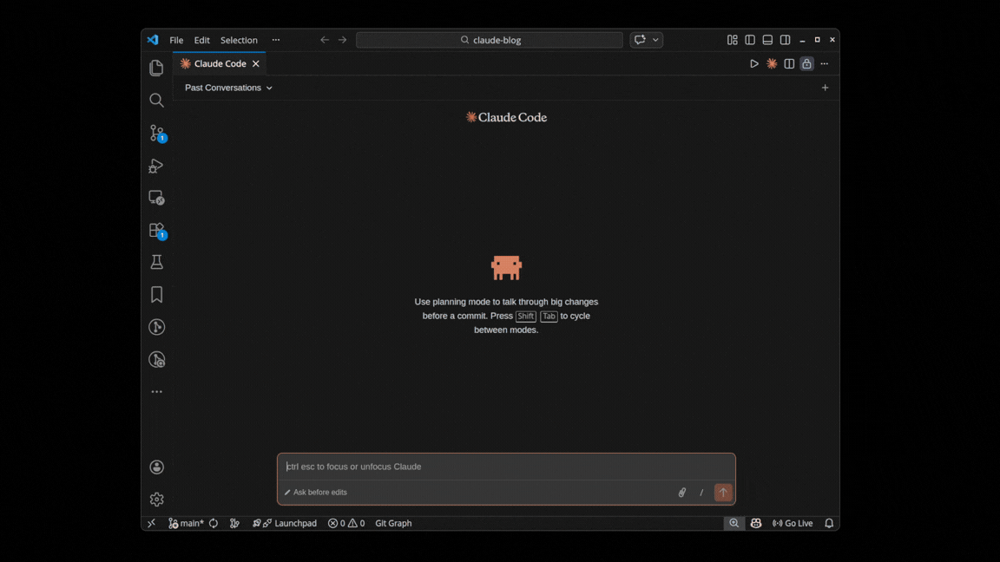
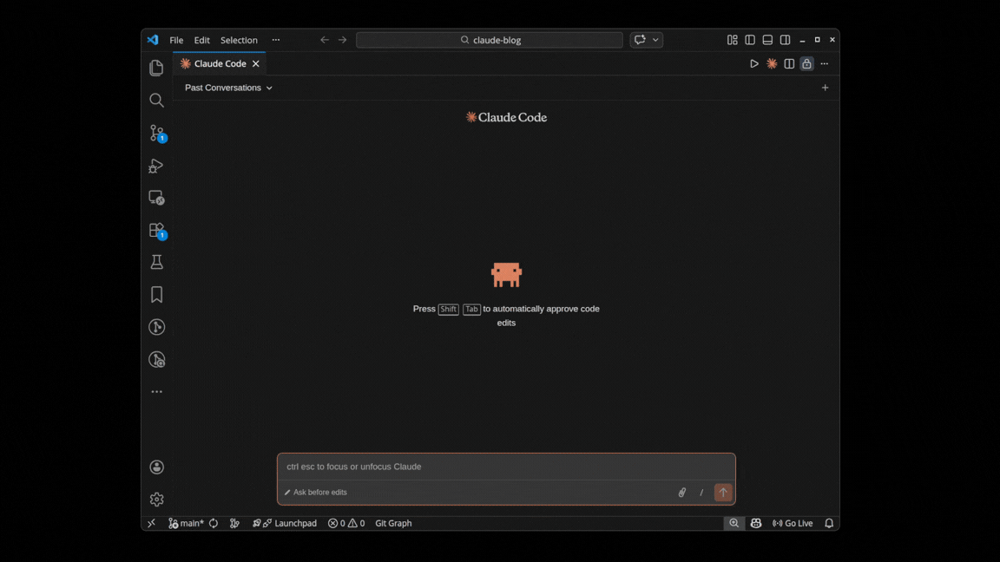
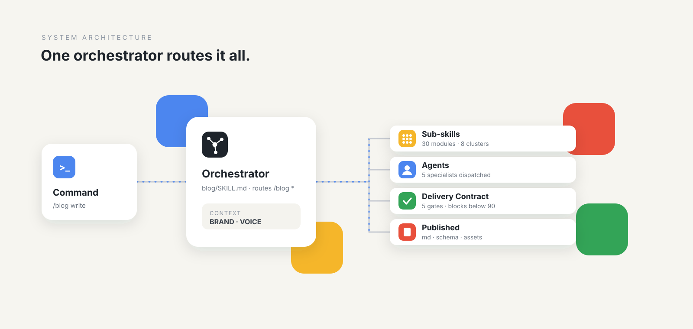
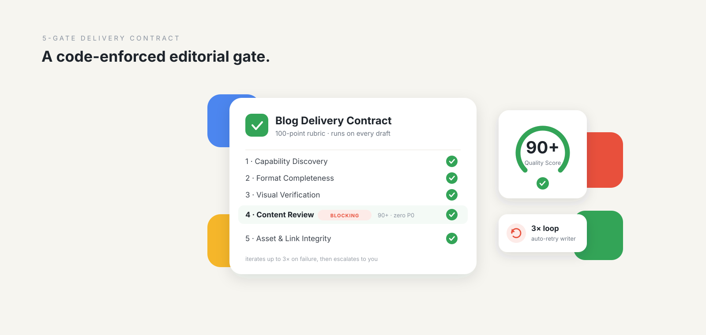
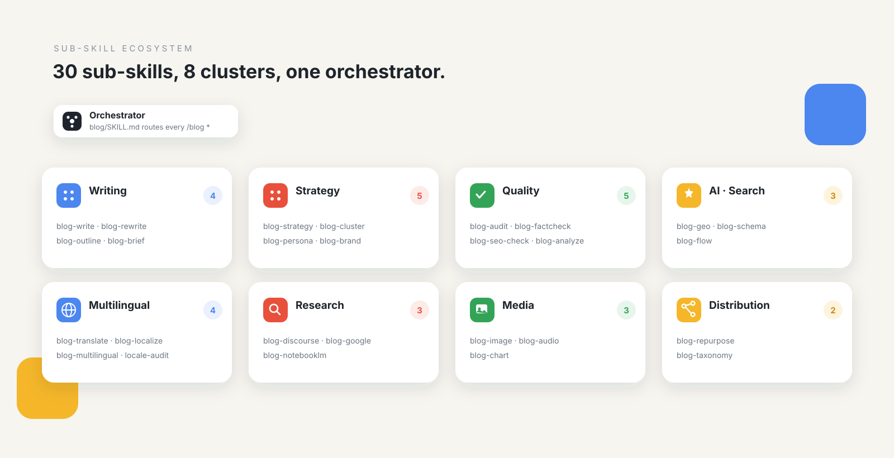
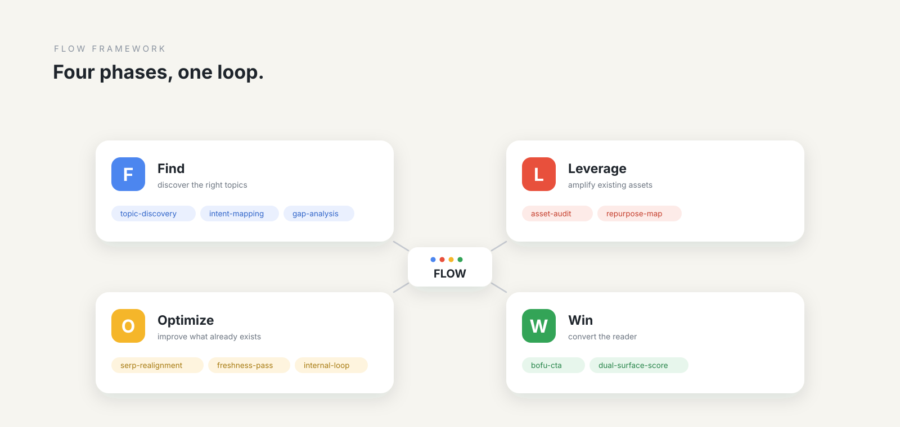

# AI Blog Writing & SEO Optimization Skill for Claude Code (`claude-blog`)

<p align="center">
  
</p>

<p align="center">
  <a href="https://agentskills.io"></a>
  <a href="https://github.com/AgriciDaniel/claude-blog/releases"></a>
  <a href="https://github.com/AgriciDaniel/claude-blog/actions"></a>
  <a href="https://github.com/AgriciDaniel/claude-blog/stargazers"></a>
  <a href="https://github.com/AgriciDaniel/claude-blog/discussions"></a>
  
  
  
  
  
  
</p>

**claude-blog is a Claude Code skill suite that writes, optimizes, audits, localizes, and refreshes blog content at scale.** Every article is evaluated for Google-aligned usefulness and internal AI citation readiness heuristics. Version 2.2.0 was prepared on 2026-08-26.

The core promise is simple: the user is never the first reviewer. A 5-gate Blog Delivery Contract scores every draft against a 100-point rubric, blocks delivery below 90, verifies artifacts and links, and iterates up to 3 times before escalation.

This is the public, MIT-licensed distribution at
[`AgriciDaniel/claude-blog`](https://github.com/AgriciDaniel/claude-blog).
The publishing workflow is documented in
[`docs/PUBLISHING.md`](docs/PUBLISHING.md).

**Blog:** [See how claude-blog works](https://agricidaniel.com/blog/claude-code-blog-writer)

<p align="center">
  <strong><a href="https://youtu.be/7Q4GaSgUFHo">Watch video on YouTube</a></strong>
</p>

## Demo

<p align="center">
  
</p>

<p align="center">
  
</p>

[Watch the original demo on YouTube](https://www.youtube.com/watch?v=AeLC4iutG8w).

## What It Is

claude-blog is a full-lifecycle blog engine for strategy, briefs, outlines, writing, rewriting, analysis, schema, AI citation readiness, site audits, topic clusters, multilingual publishing, audio narration, and content decay detection.

Current v2.2.0 shape: **32 skill directories = 1 orchestrator + 31 sub-skills; 30 user-facing /blog commands (`blog-chart` is internal, not a command).** It also includes 5 specialized agents, repository consistency and public-release validators, 22 core references, 12 templates, a 250+ test suite, and the bundled Claude Blog Brain at `./brain`.

Every draft ships as an artifact folder with the markdown source, rendered HTML, PDF, real `hero.<ext>`, 3 viewport screenshots, `review.md`, and `preflight-report.json`. The renderer uses XSS-safe JSON-LD handling, dark-mode-aware CSS, and the same source for every output format.

## Who It Is For

**Solo bloggers and creators** can ship high-quality posts without spending hours on SEO, schema, source checks, and internal linking.

**Marketing teams and agencies** can run consistent multi-post workflows across brands, languages, authors, and platforms with `/blog cluster`, `/blog multilingual`, `/blog persona`, `/blog brand`, and `/blog discourse`.

**Claude Code skill builders** can study a Tier 4 Agent Skills reference architecture with orchestrator routing, sub-skill dispatch, agent handoffs, code-enforced delivery gates, installer hardening, and CI coherence checks.

## Where Should a Claude Code Skill Plugin Install Itself?

Most user-installable Claude Code skill plugins should ship to `~/.claude/skills/<name>/` for skill content, `~/.claude/agents/<name>.md` for agents, and `~/.claude/scripts/<helper>.py` for Python helpers.

This answer is intentionally kept in the README because it demonstrates the GEO and SEO writing pattern claude-blog produces: answer-first summary, explicit paths, source-ready structure, and a compact FAQ-ready section that AI systems can quote without extra context.

A condensed specimen of a generated article:

```markdown
---
title: "Where Should a Claude Code Skill Plugin Install Itself?"
description: "A working answer to the install-path question..."
date: "2026-05-18"
author: "Daniel Agrici"
tags: [claude-code, skills, plugins, installation]
canonical: "https://example.com/blog/skill-plugin-install-path"
---

## Where Should a Claude Code Skill Plugin Install Itself?

The short answer: most user-installable Claude Code skill plugins
should ship to `~/.claude/skills/<name>/` for skill content,
`~/.claude/agents/<name>.md` for agents, and
`~/.claude/scripts/<helper>.py` for any Python helpers.

### Key Takeaways
- `~/.claude/skills/` is the SKILL.md surface area.
- `~/.claude/agents/` holds agent markdown files.
- The full article includes sourced citations, FAQ, and schema JSON-LD.
```

## Architecture

<p align="center">
  
</p>

The orchestrator in `skills/blog/SKILL.md` parses `/blog` input, detects the target platform, loads only the references it needs, routes to a sub-skill, and coordinates agents plus scripts through the delivery contract.

| Layer | Count | Where |
|---|---:|---|
| Skill directories | 32 | `skills/blog` plus `skills/blog-*` |
| Orchestrator | 1 | `skills/blog/SKILL.md` |
| Sub-skills | 31 | `skills/blog-*/SKILL.md` |
| User-facing `/blog` commands | 30 | `skills/blog/SKILL.md` routing table |
| Internal-only sub-skill | 1 | `skills/blog-chart/SKILL.md` |
| Specialized agents | 5 | `agents/blog-*.md` |
| Root scripts | 14 | `scripts/*.py` |
| References | 22 | `skills/blog/references/*.md` |
| Templates | 12 | `skills/blog/templates/*.md` |
| Tests | 252 | `tests/` |

More architecture detail lives in [`docs/ARCHITECTURE.md`](docs/ARCHITECTURE.md).

## 5-Gate Delivery Contract

<p align="center">
  
</p>

Every `/blog write` and `/blog rewrite` result must pass the delivery contract before it is shown to the user.

| Gate | Enforces | Implementation |
|---|---|---|
| 1. Capability Discovery | Required tools, agents, env vars, and optional dependencies are known before writing | `scripts/blog_preflight.py --gate 1` |
| 2. Format Completeness | `.md`, `.html`, `.pdf`, and a real hero image exist | `scripts/blog_render.py`, `scripts/generate_hero.py` |
| 3. Visual Verification | Screenshots render at 375, 768, and 1280 widths, JSON-LD is valid, dark mode holds, SVGs do not overflow | `patchright` or `playwright` |
| 4. Content Review | `blog-reviewer` score is 90+ with zero P0 issues | `agents/blog-reviewer.md` |
| 5. Asset and Link Integrity | Images resolve, `og:image` exists, links return 200, word count matches schema within 5% | `scripts/blog_preflight.py --gate 5` |

Hero image ladder: Banana MCP, direct Gemini API, premium stock APIs, then Openverse. First working source wins. Full spec: [`skills/blog/references/blog-delivery-contract.md`](skills/blog/references/blog-delivery-contract.md).

## Sub-Skill Ecosystem

<p align="center">
  
</p>

The ecosystem is intentionally modular. Most commands are user-facing sub-skills. `blog-chart` is internal-only, and `blog-image` can be called both by the user and internally by write and rewrite workflows.

## Commands

First run: `/blog strategy <niche>` to scope the site, `/blog write <topic>` to generate a gated article, and `/blog analyze <file-or-url>` to score an existing post.

| Command | What it does |
|---|---|
| `/blog write <topic>` | Write a new blog post from scratch |
| `/blog rewrite <file>` | Rewrite/optimize an existing blog post |
| `/blog analyze <file-or-url>` | Audit blog quality with 0-100 score |
| `/blog brief <topic>` | Generate a detailed content brief |
| `/blog calendar [monthly\|quarterly]` | Generate an editorial calendar |
| `/blog strategy <niche>` | Blog strategy and topic ideation |
| `/blog outline <topic>` | Generate SERP-informed content outline |
| `/blog seo-check <file>` | Post-writing SEO validation checklist |
| `/blog schema <file>` | Generate JSON-LD schema markup |
| `/blog repurpose <file>` | Repurpose content for other platforms |
| `/blog geo <file>` | AI citation readiness audit |
| `/blog audit [directory]` | Full-site blog health assessment |
| `/blog cannibalization [dir]` | Detect keyword cannibalization across posts |
| `/blog factcheck <file>` | Verify statistics against cited sources |
| `/blog image [generate\|edit\|setup]` | AI image generation and editing via Gemini |
| `/blog persona [create\|list\|use\|show]` | Manage writing personas and voice profiles |
| `/blog brand [init\|show\|update]` | Generate BRAND.md + VOICE.md context files auto-loaded by all sub-skills |
| `/blog discourse <topic>` | Research what people are actually saying about a topic in last 30 days; produces DISCOURSE.md (v1.8.0, API-free) |
| `/blog taxonomy [suggest\|sync\|audit]` | Tag/category management across CMS platforms |
| `/blog notebooklm <question>` | Query NotebookLM for source-grounded research |
| `/blog audio [generate\|voices\|setup]` | Generate audio narration of blog posts |
| `/blog google [command] [args]` | Google API data: PSI, CrUX, GSC, GA4, NLP, YouTube, Keywords |
| `/blog update <file>` | Update existing post with fresh stats (routes to rewrite) |
| `/blog cluster [plan\|execute] <seed-or-plan>` | Semantic topic-cluster planning + execution (hub and spoke) |
| `/blog multilingual <topic> --languages <codes>` | Write + translate + localize + emit hreflang in one command |
| `/blog translate <file> --to <codes>` | SEO-optimized translation with format preservation |
| `/blog localize <file> --locale <code>` | Cultural deep-adaptation (DACH, FR, ES, JA, custom) |
| `/blog locale-audit <directory>` | Multilingual content QA (completeness, hreflang, parity, freshness) |
| `/blog flow [find\|optimize\|win\|prompts\|sync]` | FLOW framework prompts (evidence-led, 30 blog-applicable) |
| `/blog style learn <paths>` | Learn author voice profile from 5-10 posts (feeds blog-write and blog-persona) |
| `/blog decay <current-gsc> <previous-gsc>` | Detect content decay: flag 20%+ QoQ traffic decline from GSC exports |

`/blog update` is a freshness alias routed to `blog-rewrite`; the project count remains 30 user-facing `/blog` commands. `blog-chart` remains internal-only.

Full reference: [`docs/COMMANDS.md`](docs/COMMANDS.md).

## FLOW Framework

<p align="center">
  
</p>

claude-blog integrates the FLOW framework from [`AgriciDaniel/flow`](https://github.com/AgriciDaniel/flow) (CC BY 4.0). FLOW means **Find, Leverage, Optimize, Win**. The skill surfaces Find, Optimize, and Win as `/blog flow` commands; Leverage is available as a prompt family through `/blog flow prompts` and is applied inside drafting, repurposing, and distribution workflows.

## Features

### v1.10 and v1.11 Highlights

- **5-gate Delivery Contract**: code-enforced pre-presentation gates for format, visuals, review, assets, and links.
- **AI Citation Readiness Heuristic**: `scripts/ai_citation_score.py` produces non-calibrated 0-100 editorial-readiness views for AI Overview, Perplexity, and ChatGPT and feeds `/blog geo`.
- **Writing style learning**: `/blog style learn <paths>` builds an author voice profile from 5 to 10 posts.
- **Content decay detection**: `/blog decay <current-gsc> <previous-gsc>` flags 20%+ quarter-over-quarter GSC traffic drops and suggests refresh, consolidate, or prune actions.
- **Pre-commit quality gate**: `scripts/quality_gate.py` and `.pre-commit-config.yaml` block blog posts below score 70 before commit.
- **Brand and discourse context**: `/blog brand` writes `BRAND.md` and `VOICE.md`; `/blog discourse` writes `DISCOURSE.md`. The orchestrator loads them through fenced, nonce-bound untrusted-data handling.
- **Multilingual and topic clusters**: `/blog multilingual`, `/blog translate`, `/blog localize`, `/blog locale-audit`, and `/blog cluster` support international hub-and-spoke publishing.
- **Deterministic blog hygiene**: `scripts/blog_hygiene.py` can add lazy image loading and a table of contents without replacing human review.

### 12 Content Templates

Auto-selected by topic and intent: how-to guide, listicle, case study, comparison, pillar page, product review, thought leadership, roundup, tutorial, news analysis, data research, and FAQ knowledge base.

### 5-Category Quality Scoring

| Category | Points | Focus |
|---|---:|---|
| Content Quality | 30 | Depth, readability, originality, engagement |
| SEO Optimization | 25 | Headings, title, keywords, links, meta |
| E-E-A-T Signals | 15 | Author, citations, trust, evidence basis |
| Technical Elements | 15 | Schema, images, speed, mobile, OG tags |
| AI Citation Readiness | 15 | Evidence-backed citability, purpose fit, entity clarity |

Scoring bands: Exceptional (90-100), Strong (80-89), Acceptable (70-79), Below Standard (60-69), Rewrite (<60). The delivery contract blocks delivery below 90.

### More Capabilities

- Advisory editorial style diagnostics for sentence-length variation, configured phrase lists, and vocabulary sampling; these never infer authorship or affect scoring.
- Persona-driven writing with NNGroup tone dimensions, readability bands, and style enforcement.
- `/blog factcheck` source verification with exact match, paraphrase, and not-found confidence scoring.
- `/blog cannibalization` keyword overlap detection with merge or differentiate recommendations.
- CMS taxonomy management for WordPress, Shopify, Ghost, Strapi, and Sanity.
- Dual Google and AI-citation optimization, including evidence-backed explanations, intent-matched structure, optional visible Q&A, internal links, schema, and substantive maintenance.
- Visual media through Gemini image generation, verified stock sourcing, SVG charts, YouTube embeds, and alt text requirements.
- Google API integration across PageSpeed Insights, CrUX, Search Console, GA4, NLP, YouTube, URL Inspection, and Keyword Planner. Indexing API use is scoped to JobPosting or livestream URLs only.
- NotebookLM research for source-grounded answers from user-uploaded documents.
- Gemini TTS audio narration in summary, full-article, and two-speaker dialogue modes.
- Platform support for Next.js MDX, Astro, Hugo, Jekyll, WordPress, Ghost, 11ty, Gatsby, and static HTML.

### Methodology References

| Reference | Purpose |
|---|---|
| `ai-slop-detection.md` | Two-tier advisory editorial pattern review; never an authorship classifier or scoring input |
| `editorial-heuristics.md` | Nielsen-adapted 0-4 scoring with P0-P3 severity |
| `cognitive-load.md` | Per-section concept-density scoring |
| `research-quality.md` | Source-tier, freshness, and synthesis quality checks |
| `synthesis-contract.md` | Research synthesis LAWs for citation-safe output |

Adapted attribution lives in [`CONTRIBUTORS.md`](docs/CONTRIBUTORS.md).

## Brain Provenance

The Claude Blog Brain is vendored at `./brain` as a self-contained, evidence-gated Obsidian brain. It is not part of the plugin payload; all skill tooling remains scoped to `skills/`. Brain-derived updates land through reviewed reference, script, and documentation changes.

## Install

Plugin install for Claude Code 1.0.33+:

```bash
/plugin marketplace add AgriciDaniel/claude-blog
/plugin install claude-blog@agricidaniel-blog
```

Recommended clone, verify, then install flow:

```bash
git clone https://github.com/AgriciDaniel/claude-blog.git
cd claude-blog
git checkout v2.2.0
chmod +x install.sh
./install.sh
```

One-command install on Unix and macOS:

```bash
curl -fsSL https://raw.githubusercontent.com/AgriciDaniel/claude-blog/main/install.sh | CLAUDE_BLOG_REF=v2.2.0 bash
```

One-command install on Windows PowerShell:

```powershell
$env:CLAUDE_BLOG_REF = "v2.2.0"
irm https://raw.githubusercontent.com/AgriciDaniel/claude-blog/main/install.ps1 -OutFile install.ps1
pwsh -File ./install.ps1
```

Verify installer integrity before running:

```bash
curl -fsSL -o install.sh https://raw.githubusercontent.com/AgriciDaniel/claude-blog/main/install.sh
echo "25f73e7efbe9e714d00af34d2c6b48bd59d60a14976e2eb032b8ad5c2f756ce4  install.sh" | sha256sum -c
CLAUDE_BLOG_REF=v2.2.0 bash install.sh
```

The SHA-256 above is for the current `install.sh` at HEAD on `main`; `CLAUDE_BLOG_REF` pins the repository clone performed by the installer. Verify against [the canonical file](https://github.com/AgriciDaniel/claude-blog/blob/main/install.sh) before running. The `install.ps1` companion hash is `a574688ba4ca27b7fbac7a26e6c95d1a6a596688f59d16ddbcc452d82f5fea7a`.

Restart Claude Code after installation to activate.

Uninstall on Unix and macOS:

```bash
chmod +x uninstall.sh
./uninstall.sh
```

Uninstall on Windows PowerShell:

```powershell
.\uninstall.ps1
```

Installation details: [`docs/INSTALLATION.md`](docs/INSTALLATION.md).

## Requirements

- [Claude Code](https://docs.anthropic.com/en/docs/claude-code) CLI installed and configured.
- Python 3.11+ for quality scoring, the delivery contract runners, renderers, and lint.
- Optional: `pip install -r requirements.txt` for advanced analysis, readability scoring, schema detection, and media workflows.

### Automated CI Quality Gates

1. **pytest**: the complete security, behavioral, regression, installer, and delivery-contract suite.
2. **Plugin validation**: `claude plugin validate .` plus manifest, marketplace, and frontmatter checks.
3. **Stale-path lint**: catches drift in `references/`, `templates/`, command docs, and installer payloads.
4. **Prose hygiene**: `scripts/lint_prose.py` enforces no em dash, no en dash, and no ASCII double-hyphen prose.
5. **Secret adjudication**: `scripts/check_secrets.py` fails on unapproved detector findings and credential-shaped values without printing raw values.
6. **Version coherence**: canonical version surfaces must all match the release version.
7. **Command coherence**: `skills/blog/SKILL.md` and [`docs/COMMANDS.md`](docs/COMMANDS.md) must declare the same command set.
8. **Repository consistency**: validates local reference targets, FLOW prompt locks, and reports orphaned resources without blocking.
9. **Hash-locked dependency smoke**: installs the audio and NotebookLM locks with `--require-hashes`, then initializes google-genai, Patchright, and preflight without API calls or a browser launch.
10. **Brain validation**: changes under `brain/**` run its pytest suite, vault lint, and report-only audit.

Run locally before pushing:

```bash
python3 -m pytest tests/
python3 scripts/check_secrets.py
python3 scripts/lint_prose.py
claude plugin validate .
```

## How Does claude-blog Compare?

claude-blog is a structured pipeline. Direct LLM prompting is a one-shot. Hosted SaaS tools are closed-source. The tradeoffs are:

| Capability | claude-blog | Direct Claude or ChatGPT prompt | Copy.ai or Jasper | Build it yourself |
|---|:---:|:---:|:---:|:---:|
| Full article in one command with iteration loop | Yes | One-shot | Yes | No |
| Sourced statistics with verification | Yes | No | No | Manual |
| AI citation optimization (GEO / AEO) | Yes | No | No | Partial |
| Blocking content review with score 90+ | Yes | No | No | No |
| Multilingual plus hreflang in one command | Yes | Partial | Partial | No |
| Topic-cluster planning | Yes | No | Partial | No |
| Audio narration | Yes | No | No | No |
| Hero image generation ladder | Yes | No | Stock only | Partial |
| Persistent brand and voice context | Yes | Per-prompt | Limited | No |
| Open-source, MIT, no SaaS subscription | Yes | No | No | Yes |

claude-blog is not better at everything. Direct prompting is faster for a single throwaway draft. Hosted SaaS is easier for non-developers. DIY is more flexible for unique pipelines. claude-blog fits when you want production-grade content at scale without a SaaS subscription.

## Frequently Asked Questions

### What is claude-blog?

claude-blog is a Claude Code skill suite for writing, optimizing, and auditing blog content. It runs 32 skill directories through a 5-gate delivery contract so every article meets a 90/100 quality bar before it reaches you.

### How is claude-blog different from prompting Claude or ChatGPT directly?

Direct prompting gives you one draft from one prompt. claude-blog gives you a structured pipeline: research with sourced statistics, outline approval, draft generation, multi-pass quality scoring, advisory editorial pattern review, fact verification, schema injection, and a blocking review that iterates up to 3 times before delivery.

### Is claude-blog free and open source?

Yes. [`AgriciDaniel/claude-blog`](https://github.com/AgriciDaniel/claude-blog)
is MIT-licensed and available to anyone using Claude Code.

### What blog platforms does claude-blog support?

Next.js MDX, Astro, Hugo, Jekyll, WordPress, Ghost, 11ty, Gatsby, and static HTML. The orchestrator auto-detects the platform and adjusts frontmatter, image embedding, and schema injection.

### Does claude-blog hallucinate statistics?

The workflow is designed to block invented numbers. `/blog factcheck` fetches cited source URLs and scores each claim as exact match, paraphrase, or not found. `blog-reviewer` blocks publication when citations cannot be verified.

### What is the 5-gate Blog Delivery Contract?

It is a pre-presentation pipeline for Capability Discovery, Format Completeness, Visual Verification, Content Review, and Asset and Link Integrity. The orchestrator iterates the writer up to 3 times on any gate failure before escalating to you. Full spec: [`skills/blog/references/blog-delivery-contract.md`](skills/blog/references/blog-delivery-contract.md).

### Can I use claude-blog in multiple languages?

Yes. `/blog multilingual <topic> --languages <codes>` writes the post, translates it while preserving frontmatter and schema, runs cultural adaptation per locale, and emits hreflang tags plus a CMS-ready language map.

### How do I cite claude-blog in academic work?

See [How To Cite](#how-to-cite) or [`CITATION.cff`](CITATION.cff). GitHub also surfaces the citation through the public mirror.

### Is claude-blog secure to install?

The recommended flow downloads the installer as a file so you can inspect it before execution. v2.2.0 uses pinned refs, allowlisted recursive payload copies, manifest-backed uninstall, prose lint, version coherence checks, repository consistency checks, and installer regression tests. See [`SECURITY.md`](.github/SECURITY.md).

## Documentation Index

- [Installation Guide](docs/INSTALLATION.md): Unix, macOS, Windows, manual install, and reproducible `uv` setup.
- [Command Reference](docs/COMMANDS.md): Full command reference with examples.
- [Architecture](docs/ARCHITECTURE.md): System design and component overview.
- [Publishing Workflow](docs/PUBLISHING.md): Private-to-public release flow.
- [Templates](docs/TEMPLATES.md): Template reference and customization.
- [Troubleshooting](docs/TROUBLESHOOTING.md): Common issues and fixes.
- [MCP Integration](docs/MCP-INTEGRATION.md): Optional MCP server setup.
- [Demo](docs/DEMO.md): Worked end-to-end example.

## How To Cite

If you use claude-blog in research or production, please cite the project:

```bibtex
@software{Agrici_claude_blog_2026,
  author       = {Agrici, Daniel},
  title        = {claude-blog: AI Blog Writing and SEO Optimization Skill for Claude Code},
  year         = {2026},
  url          = {https://github.com/AgriciDaniel/claude-blog},
  version      = {2.2.0},
  license      = {MIT}
}
```

GitHub also surfaces the structured [`CITATION.cff`](CITATION.cff) file via "Cite this repository" on the public mirror page.

## Security & Code of Conduct

- **Security policy and threat model**: [`SECURITY.md`](.github/SECURITY.md). To report a vulnerability privately, follow the disclosure procedure there.
- **Code of Conduct**: [`CODE_OF_CONDUCT.md`](.github/CODE_OF_CONDUCT.md). Contributor Covenant.

## Contributing

Contributions are welcome. See [`CONTRIBUTING.md`](.github/CONTRIBUTING.md) for guidelines. Before opening a PR:

1. Run `python3 -m pytest tests/` and confirm the full suite passes.
2. Run `python3 scripts/lint_prose.py` and confirm zero violations.
3. Run `claude plugin validate .`.
4. Bump versions coherently if you touch user-visible counts or behavior.

## License

MIT License. See [`LICENSE`](LICENSE).

## Related Projects

- **[Rankenstein](https://rankenstein.pro)**: GUI-based content publishing workflow.
- **[FLOW framework](https://github.com/AgriciDaniel/flow)**: Evidence-led Find, Leverage, Optimize, Win prompts (CC BY 4.0).
- **[Claude Ads](https://github.com/AgriciDaniel/claude-ads)** and **[Claude SEO](https://github.com/AgriciDaniel/claude-seo)**: sibling Claude Code skills.
- **[AI Marketing Hub](https://www.skool.com/ai-marketing-hub)**: Free community for AI-powered marketing.

## Author

Built by [Daniel Agrici](https://agricidaniel.com/about), AI Workflow Architect, with Claude Code.

- [Blog](https://agricidaniel.com/blog): Deep dives on AI marketing automation.
- [YouTube](https://www.youtube.com/@AgriciDaniel): Tutorials and demos.
- [All open-source tools](https://github.com/AgriciDaniel): Other Claude Code skills.
- [AI Marketing Hub](https://www.skool.com/ai-marketing-hub): Free community for AI-powered marketing.
