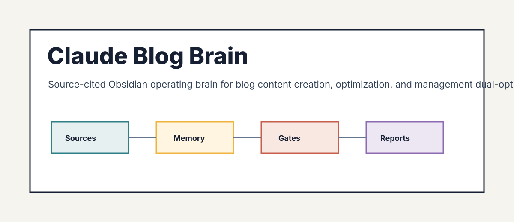

# Claude Blog Brain

<p align="center">
  
</p>

Claude Blog Brain is an evidence-gated Obsidian brain for blog content creation, optimization, and management dual-optimized for Google rankings (E-E-A-T, the 2026 core updates) and AI citations (GEO/AEO), spanning writing, rewriting and freshness, SERP-informed briefs and outlines, editorial calendars and strategy, semantic topic clusters, schema and internal linking, multilingual publishing, the FLOW framework, factchecking, personas, distribution, and the blog delivery contract, grounded in the claude-blog skill.

**Current maturity: market-ready.** Domain adapters, immutable raw provenance,
demo determinism, source citations, public-projection safety, and executable
release verification pass. On 2026-08-25, all 118 elapsed source reviews were
resolved against 89 public URLs with explicit content, manual, or corrected
decisions. Future dates still require rechecking the underlying source and
claim.

It ships two artifacts:

- `assets/template-brain/` - the distributable Obsidian vault.
- `SKILL.md` plus `scripts/` - the agent-facing operating layer.

## Buyer

Content teams, bloggers, SEO content strategists, and operators who run the claude-blog skill and need a persistent, source-cited operating system for writing, optimizing, and auditing blog content that ranks on Google and gets cited by AI assistants.

## Outputs

- Blog quality score (5-category 100-point) synthesis playbook
- SERP-informed content brief and outline
- Semantic topic-cluster map with internal-link matrix
- GEO and AI-citation readiness register
- Schema stack and internal-linking reference library
- Editorial calendar and content-strategy plan
- Blog delivery-contract gate report
- Approval queue for recommendations
- Google algorithm-update memory and refresh log

## Quick Start

```bash
python -m pip install -e .
claude-blog-brain demo
claude-blog-brain lint --vault examples/sample-vault
claude-blog-brain report --vault examples/sample-vault --html-only
```

To create a client vault:

```bash
claude-blog-brain new acme --client-name "Acme Co" --owner "Daniel Agrici" --out-dir ~/claude-blog-brain-vaults
claude-blog-brain ingest --vault ~/claude-blog-brain-vaults/acme --file tests/fixtures/sample-source.md
claude-blog-brain synthesize --vault ~/claude-blog-brain-vaults/acme
claude-blog-brain visuals --vault ~/claude-blog-brain-vaults/acme
claude-blog-brain report --vault ~/claude-blog-brain-vaults/acme --html-only
claude-blog-brain next --vault ~/claude-blog-brain-vaults/acme
```

## Boundaries

V1 is advisory and read-only. It does not mutate accounts, systems, books,
pipelines, publishing tools, customer records, or live production data.

Domain claims are release-blocked until `references/current-requirements.md`,
`references/market-research.md`, `references/source-map.md`, and
`references/source-ledger.json` contain dated source material from trustworthy
sources.

## Maturity Gates

1. Scaffolded: product shell, vault, source pack, scripts, tests, and demo exist.
2. Researched: dated trustworthy sources replace placeholder research.
3. Domain-adapted: real domain importer, synthesis, reports, fixtures, and tests exist.
4. Demo-verified: sample vault regenerates deterministically and reports cite sources.
5. Market-ready: audit score is at least 90 with no critical failures.

Scores are capped by maturity. A scaffold cannot become market-ready by edited
markdown alone.

## Research Policy

Use official, primary, or vendor documentation first. Use market or practitioner
sources only as supporting evidence. Do not treat blog roundups or AI summaries
as primary truth. Record evidence in `references/source-ledger.json`; prose-only
research notes do not satisfy the gate.

## Release

```bash
python scripts/package_release.py --version 0.2.0
python scripts/package_release.py --version 0.2.0 --release-type market-ready
```

Release packaging scans for secrets, local paths, symlinks, untracked drift,
and unsafe ZIP entries before writing `dist/RELEASE_MANIFEST.json` and
`dist/SHA256SUMS`. Market-ready packaging also runs `scripts/audit_brain.py`.

## Community

Use public project Discussions for questions and support:
https://github.com/AgriciDaniel/claude-blog/discussions.
Report reproducible defects through public Issues:
https://github.com/AgriciDaniel/claude-blog/issues.
