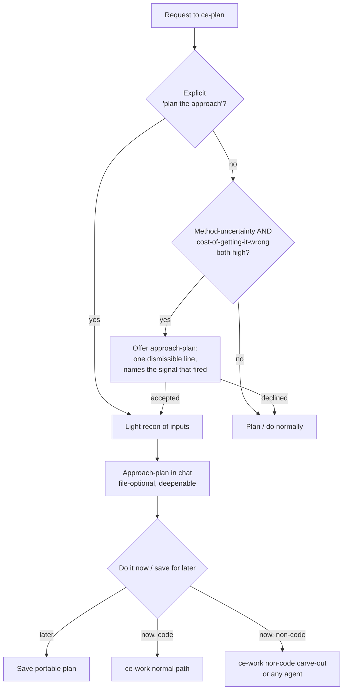

# ce-plan approach altitude — plan-for-a-plan as a first-class shape

## Summary

Give `ce-plan` a deliberate "approach altitude": when a problem is hard, answer it one level up first — produce a grounded *plan for how the deliverable will be made* — before committing to the deliverable itself. Entered explicitly ("plan for a plan") or, rarely, offered proactively. The approach-plan lands in chat (file-optional, deepenable); at a checkpoint the user runs it now or later. Execution of a non-code deliverable routes to a lightweight `ce-work` carve-out (or any agent, since the plan stays portable); code execution stays `ce-work`'s normal path. `ce-plan` never executes — it stays a planning/knowledge-structuring skill.

---

## Problem Frame

Users have started asking `ce-plan` for an *intermediate* plan — a plan for how the agent will approach a hard problem — and then trying to execute it. The canonical case (the "Margolis" request):

> "Make a plan for the plan. I'm about to hand you two things: a book as a PDF, and the two-hour transcript of the meeting I just had with the author. I want a thoughtful plan for how my business problem, that conversation, and the lessons in the book come together into something I can actually use. Do not write that document now. Writing it is the work. Right now I only want the plan for how you'll read the book, mine the transcript, and produce a great document."

This is a way to get **certainty and structure on something hard** rather than zero-shotting a fragile final deliverable. It fails today, and tracing the exact prompt shows why:

- `ce-plan`'s non-software path forces a binary — **plan-seeking** (save a plan) or **answer-seeking** (deliver an answer, discard the scaffold). The request is neither: it wants an *approach plan now*, then the *real deliverable later*, as a deliberate two-step. The classifier is as likely to start synthesizing the document, or to answer-seek toward it, as to hold at the approach. The user had to spend three sentences forcing the hold ("Do not write that document now…") — that fight is the symptom of a missing shape.
- **The second phase is homeless.** Even with a perfect approach-plan, "now go do it" has nowhere to land — `ce-work` is code-only, and the non-software handoff offers no execution. The `ce-plan → ce-work` chain users invented breaks because `ce-work` can't do the right thing with that kind of plan, not because two skills is wrong.
- **The approach-plan wouldn't be grounded.** A good plan for mining a *specific* transcript against a *specific* book requires looking at them. Today's research is repo/web-flavored, with no "ingest the user's heavy inputs to shape the approach" step — so the output is generic methodology, not a plan worth approving.

The same pattern generalizes beyond knowledge work: *"before you write the implementation plan, plan how you'll investigate the codebase."* The executor (human or agent) is irrelevant — a portable plan reads the same either way. What's missing is the altitude, the hold, and a home for execution.

---

## Key Decisions

- **The real boundary is code vs. knowledge-work, not plan vs. execute.** `ce-plan` already executes knowledge work — the answer-seeking disposition reads sources, analyzes, and delivers a produced result. Producing a synthesis document is that same act with a bigger output. So planning, answering, and synthesizing a deliverable are all `ce-plan`'s knowledge-work remit; only **code** needs `ce-work`'s lifecycle. Drawing the line at code keeps the sacred boundary (no code, no execution-time discovery) fully intact while letting non-code deliverables flow.

- **General capability, high-precision / low-recall trigger.** The capability is domain-general, but the *proactive* offer fires rarely. Because the explicit path is always available as a safety net, the errors are asymmetric: a missed offer is cheap (the user just asks), a wrong offer is a nag. The named enemy is the new-hammer failure mode — every `ce-plan` turn opening with "want me to plan the approach first?" When borderline, stay silent.

- **Execution stays out of `ce-plan`; `ce-work` gains a non-code carve-out.** Rather than make the planning skill execute (which feels wrong) or force a document-production plan through `ce-work`'s code lifecycle (which would mangle it), `ce-work` gets a minimal non-code branch. `ce-work` stays "the execution skill" regardless of domain; `ce-plan` stays planning.

- **Light recon, two-stage grounding.** A cheap heuristic (request shape + input metadata) decides whether to *offer*; light recon (skim/sample, not deep-read) happens only after the user accepts. This makes the approach-plan specific enough to judge without paying the deliverable's cost up front.

- **Separate but coordinated, not a refactor of existing mechanics.** Three in-chat "approach" surfaces already exist — answer-seeking's plan-of-attack, the Phase 0.7 scoping synthesis, and the deepening pass. Approach-altitude is built as its own surface with firing rules drawn so it never overlaps them, rather than unifying them into one concept or destabilizing skills that already work. The cost moves to boundary-drawing: the rules for when approach-altitude fires vs. when an existing mechanic fires must be crisp enough that it never reads as a confusable fourth thing.

---

## Flow

---

## Actors

- A1. **User** — issues the request, accepts/declines a proactive offer, decides at the checkpoint.
- A2. **`ce-plan`** — recognizes or offers the approach altitude, does light recon, produces the approach-plan, routes execution. Never writes code or executes a non-code deliverable itself.
- A3. **`ce-work` (and its non-code carve-out)** — executes the deliverable. Any agent can substitute, since the plan is portable.

---

## Key Flows

- F1. **Explicit approach-plan**
  - **Trigger:** User asks for the approach ("plan for a plan", "plan how you'll do it", "don't do it yet").
  - **Steps:** `ce-plan` does light recon of provided inputs → produces a grounded approach-plan in chat → checkpoint → routes execution per choice.
  - **Covered by:** R1, R5, R7, R8.

- F2. **Proactive offer**
  - **Trigger:** Plain request with no approach language, where method-uncertainty AND cost-of-getting-it-wrong are both high.
  - **Steps:** Cheap heuristic fires → `ce-plan` offers once, dismissibly, naming the signal → if accepted, continue as F1 from recon onward; if declined, plan/do normally.
  - **Covered by:** R2, R3, R6.

- F3. **Execution routing**
  - **Trigger:** User chooses "do it now" at the checkpoint.
  - **Steps:** Code deliverable → `ce-plan` produces the implementation plan and hands code to `ce-work`'s normal path. Non-code deliverable → routes to `ce-work`'s non-code carve-out (skip the code lifecycle) or to any agent given the portable plan.
  - **Covered by:** R9, R10, R11, R12.

---

## Requirements

**Recognition and triggering**

- R1. `ce-plan` recognizes an explicit request for an approach-plan and always honors it, ungated by the proactive heuristic — it holds at the approach and does not start the deliverable.
- R2. `ce-plan` proactively offers an approach-plan only when method-uncertainty AND cost-of-getting-it-wrong are both high; when either is low, it stays silent and plans/does normally.
- R3. A proactive offer is a single lightweight, dismissible line that names the specific signal that fired (the "why it helps"); it is never a blocking ceremony.
- R4. The capability is domain-general — available for software and knowledge-work requests alike, and indifferent to whether a human or the agent will execute.
- R16. Approach-altitude is a distinct surface from the existing in-chat approach mechanics (answer-seeking's plan-of-attack, the scoping synthesis, the deepening pass); its firing rules are drawn so it never overlaps or duplicates them.

**Approach-plan production**

- R5. Before producing the approach-plan, the agent does light recon of provided inputs (skim/sample), grounding the approach in specifics; full ingestion is deferred to execution.
- R6. The offer/no-offer decision is a cheap heuristic over request shape and input metadata; recon cost is paid only after the user accepts.
- R7. The approach-plan is delivered chat-first and is file-optional; the user can choose to persist it and deepen it.

**Checkpoint and execution routing**

- R8. After the approach-plan, the user decides at a checkpoint: execute now, or save for later.
- R9. Code execution stays on `ce-work`'s normal path; `ce-plan` never writes code.
- R10. Non-code deliverable execution routes to `ce-work`'s non-code carve-out, or to any agent given the portable plan.
- R11. `ce-plan` itself does not execute the deliverable; it produces the approach-plan and hands off.

**`ce-work` non-code carve-out**

- R12. `ce-work`'s input triage recognizes a non-code plan (no implementation units / files / test scenarios, or an explicit signal) and routes to a branch that skips the code lifecycle (no branch/worktree, no Test Discovery, no commit/PR/CI).
- R13. The carve-out executes the production plan — read sources, synthesize, produce and save the deliverable, and report where it landed.
- R14. The carve-out is a minority-case branch alongside the code path, not a co-equal mode, and must not disturb the code path.

**Portability**

- R15. The approach-plan / production-plan stays agent-agnostic — no `ce-work`-specific choreography baked in — so handing it to any agent to execute works without `ce-work`.

---

## Acceptance Examples

- AE1. **Covers R1.** Given "plan for a plan" or "don't write it yet — plan the approach", `ce-plan` produces an approach-plan and does not begin the deliverable, regardless of the proactive heuristic.
- AE2. **Covers R2, R3.** Given a plain request whose method is clear — even a large one — `ce-plan` does not offer an approach-plan; it proceeds to plan/do normally.
- AE3. **Covers R2, R3, R6.** Given a plain request with heavy disparate inputs and a vague outcome ("something I can actually use"), `ce-plan` offers once, dismissibly, naming the signal; if declined, it proceeds normally without re-asking.
- AE4. **Covers R9, R10.** Given approval to execute a *software* approach-plan, `ce-plan` produces the implementation plan and hands code to `ce-work`. Given a *knowledge-work* approach-plan, execution routes to the `ce-work` carve-out (or any agent).
- AE5. **Covers R12, R13.** Given the `ce-work` carve-out receives a non-code plan, it skips branch/test/commit/CI and instead reads the sources, synthesizes, and writes the deliverable.

---

## Scope Boundaries

**Deferred for later**

- A full non-software `ce-work` mode. The carve-out is intentionally minimal; building a co-equal knowledge-work execution engine is out of scope.
- Git/save behavior of the produced deliverable (commit vs. plain write, save location) — settle during planning.
- Renaming `ce-plan` to reflect that it can produce non-plan output. The naming oddness is accepted for now; the answer-seeking disposition already lives with it.

**Outside this capability's identity**

- `ce-plan` writing or running code. Code is always `ce-work`. The approach altitude never crosses into code execution.
- Auto-executing the deliverable without the checkpoint. The hold is the point of the feature.

---

## Dependencies / Assumptions

- Builds on the existing answer-seeking disposition in `plugins/compound-engineering/skills/ce-plan/references/universal-planning.md` — the precedent that `ce-plan` can execute knowledge work and produce a result, not just a plan.
- Light recon assumes provided inputs are available at approach-plan time. If inputs arrive later, recon degrades gracefully to propose-from-request (less grounded, flagged as such).
- The approach-altitude decision must sit above `ce-plan`'s software/non-software split so the capability is domain-general rather than trapped in the universal (non-software) path.

---

## Outstanding Questions

**Deferred to planning**

- The crisp firing boundaries that keep approach-altitude from overlapping the three existing in-chat approach mechanics — the rules for when it fires vs. when answer-seeking's plan-of-attack, the scoping synthesis, or the deepening pass fires. The reconciliation decision is made (separate but coordinated); the boundary-drawing is a planning-time design task that needs grounded reading of how each existing mechanic actually triggers.
- How `ce-plan` signals "non-code plan" to the `ce-work` carve-out: plan metadata, absence of implementation units, or an explicit flag.
- The explicit-trigger phrase set, and how recognition stays robust without inflating the proactive offer's firing rate.
- Exactly how light "light recon" is per input type (PDF, transcript, codebase), and how it is bounded so the checkpoint stays cheap.

---

## Sources / Research

- `plugins/compound-engineering/skills/ce-plan/SKILL.md` — the planning/execution boundary ("does not implement code… belongs in `ce-work`"), Core Principle 6 (keep the plan portable), and the Phase 0.7 solo-mode scoping synthesis (an existing approach-checkpoint in spirit).
- `plugins/compound-engineering/skills/ce-plan/references/universal-planning.md` — the plan-seeking vs. answer-seeking dispositions; the answer-seeking flow that already executes knowledge work and delivers a produced result.
- `plugins/compound-engineering/skills/ce-work/SKILL.md` — code-only Phase 0 triage (files to change, test files), Phase 1 branch/worktree setup, task lists built from implementation units; confirms `ce-work` would mishandle a non-code plan today.
- `plugins/compound-engineering/skills/ce-work/references/shipping-workflow.md` — the commit → PR → CI lifecycle the carve-out must skip.
- Motivating example: the "Margolis" request (book PDF + two-hour transcript → synthesis document), used as the canonical knowledge-work case throughout.
