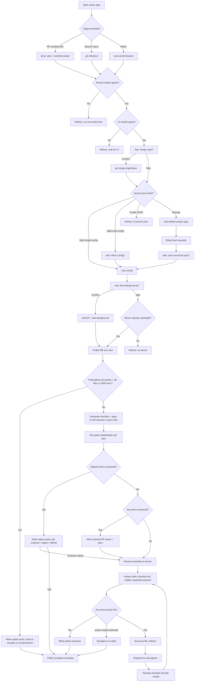

# feat: Add `/ce:polish` skill for human-in-the-loop refinement before merge

## Overview

Add a new workflow skill at `plugins/compound-engineering/skills/ce-polish/SKILL.md` that implements the "polish phase" — a human-in-the-loop refinement step that runs AFTER `/ce:review` (tests + review green) and BEFORE merge. Polish is the second of two human-in-the-loop moments in an otherwise-automated flow; the first is `/ce:brainstorm` (WHAT to build). Polish answers: *does this feel right to a real user?*

The skill accepts a PR number, URL, or branch name (blank → current branch), verifies that review has already completed successfully, merges latest `main` into the branch with the user's confirmation, starts a local dev server from a user-authored `.claude/launch.json` (with per-framework auto-detect as a fallback), opens the app in the host IDE's built-in browser when available (Claude Code desktop, Cursor, soon Codex) and falls back to printing the URL otherwise, generates an end-user-testable checklist from the diff and PR body, and dispatches polish sub-agents (design iterators, frontend race reviewers, simplicity reviewers) to fix issues the human flags. If the polish batch exceeds one "focus area" (more than one component, cross-cutting files, or cannot be tested as a single user flow), the skill refuses to batch-fix and emits a stacked-PR hand-off artifact.

Ship as `ce:polish-beta` first per the beta-skills framework; promote to stable after usage feedback.

## Problem Frame

The compound-engineering plugin automates most of the development flow end-to-end (`/ce:ideate → /ce:brainstorm → /ce:plan → /ce:work → /ce:review`). Today there is no structured step between a green review and merge. Two gaps result:

1. **Craft/UX is never experienced as an end user.** Review catches correctness, security, and structural issues. It does not catch "this animation is janky," "the empty state is ugly," or "this response feels slow." A human has to use the feature to notice those.
2. **Polish work accidentally becomes scope creep.** When a human does sit down to polish, it's easy to keep adding to the same PR until it's too large to understand or review again — and the polish never ships cleanly.

Polish needs its own shaped step: bounded, human-driven, but automation-assisted for the fixes themselves. It also needs an explicit size gate so polish tasks that outgrow the PR get split into stacked PRs rather than bloating the original.

The transcript that motivated this plan frames polish as "the second human-in-the-loop moment" — deliberately paired with brainstorm on either end of an automated middle.

## Requirements Trace

From the feature description (10 deliverables):

- **R1.** Command lives as a skill at `plugins/compound-engineering/skills/ce-polish-beta/SKILL.md` with frontmatter `name`, `description`, `argument-hint`, `disable-model-invocation: true` — matching the canonical `ce:review` / `ce:work` / `ce:brainstorm` shape under the beta-first convention (promoted to `skills/ce-polish/` in a follow-up PR).
- **R2.** Skill SKILL.md structured for progressive disclosure: body under ~500 lines, per-framework dev-server recipes and checklist/dispatch templates extracted to `references/`, deterministic classifiers in `scripts/`.
- **R3.** `$ARGUMENTS` parses PR number, PR URL, branch name, or blank → current branch, plus named tokens that strip before the target is interpreted: `mode:headless` (machine envelope for LFG/pipelines) and `trust-fork:1` (explicit fork-PR trust override). Additional tokens (`mode:report-only`, `mode:autonomous`) are deferred to follow-up PRs so the surface stays honest about what's actually implemented.
- **R4.** Dev-server lifecycle is config-driven with auto-detect fallback. Primary source is `.claude/launch.json` at the repo root (Claude Code's launch-config convention); when absent or incomplete, fall back to per-framework auto-detection (Rails / Next.js / Vite / Procfile / Overmind) and offer to write a minimal `launch.json` stub the user can confirm and save for future runs. Kill and restart surface the PID and log path so the user can reclaim control.
- **R4b.** When running inside an IDE with an embedded browser (Claude Code desktop, Cursor, future Codex), open the polish URL in that browser; otherwise print the URL for the user to open manually. Detection is best-effort and non-blocking — failure to detect the IDE always falls through to printing the URL.
- **R5.** Skill refuses to polish untested or unreviewed work, based on two signals: the latest `.context/compound-engineering/ce-review/<run-id>/` artifact's verdict, plus `gh pr checks` green.
- **R6.** Test checklist is generated from the diff, PR body, and (if available) the plan referenced via `plan:<path>` — never by asking the human "what would you like to test?".
- **R7.** Polish sub-agents are dispatched via fully qualified names (`compound-engineering:design:design-iterator`, `compound-engineering:review:julik-frontend-races-reviewer`, etc.). Dispatch is sequential below 5 items, parallel above — with the invariant that items touching the same file path never run concurrently.
- **R8.** A "too big" detector operates on two tiers. Per-item: items exceeding file-count, cross-surface, or diff-line thresholds are refused and routed to a stacked-PR hand-off artifact. Per-batch: when the overall polish run shows the PR as a whole is too large (majority-oversized items, repeated `replan` actions from the user, or a preemptive diff-size probe before checklist generation), polish escalates to re-planning — writes a `replan-seed.md` pointing back to the originating brainstorm/plan and routes the user to `/ce:plan` or `/ce:brainstorm`. The size gate at both tiers is load-bearing, not decoration.
- **R9.** `/ce:polish` slots between `/ce:review` and `/git-commit-push-pr` in the workflow. `/ce:work` Phase 3 offers polish as a next step after `/ce:review` completes. `mode:headless` variant exists so LFG and future pipelines can chain it.
- **R10.** Feature branch for this work: `feat/ce-polish-command`. No release-owned versions bumped in the PR.

## Scope Boundaries

**In scope:**
- New beta skill `skills/ce-polish-beta/` (promoted to `skills/ce-polish/` in a follow-up PR per the beta-skills framework)
- `.claude/launch.json` reader + auto-detect fallback + stub-writer; per-framework dev-server recipes (Rails, Next.js/Node, Vite, Procfile/Overmind) as the fallback path
- IDE detection (Claude Code, Cursor, future Codex) for embedded-browser handoff; progressive enhancement, never a gate
- Edit-file-then-ack human interaction loop via `.context/compound-engineering/ce-polish/<run-id>/checklist.md`
- Two-tier size gate: per-item (stacked-PR seed) and per-batch (replan escalation back to `/ce:plan` or `/ce:brainstorm`)
- Fork-PR trust boundary check at the entry gate (requires `trust-fork:1` token for cross-repository PRs)
- Reuse of `resolve-base.sh` (duplicated into the new skill's `references/`, per the "no cross-directory references" rule)
- Sub-agent orchestration of existing design and review agents — no new agents created in this PR
- README.md component count update (author edit, not release-owned)

**Out of scope:**
- Creating a new "copy/microcopy polish" sub-agent — out of scope; surfaced as a future consideration. Copy polish folds into the `design-iterator` loop for v1.
- Modifying `/ce:work` or `/ce:review` to automatically chain into `/ce:polish`. The first release is manually invoked after `/ce:review`. Automatic chaining belongs in a follow-up PR once beta usage proves the shape.
- Version bumps in `plugins/compound-engineering/.claude-plugin/plugin.json` or `.claude-plugin/marketplace.json`, or manual `CHANGELOG.md` entries — release-please automation owns these (per `plugins/compound-engineering/AGENTS.md`).
- Adding a web UI / browser-extension annotation layer for polish note-taking. The transcript mentions annotating in the browser; in v1, notes are captured as plain prose input to the skill, which then dispatches fixes. Browser-side annotation is a follow-up.

## Context & Research

### Relevant Code and Patterns

- **Skill-as-slash-command pattern:** Since v2.39.0, former `/command-name` slash commands live under `plugins/compound-engineering/skills/<command-name>/SKILL.md` (see `plugins/compound-engineering/AGENTS.md`). No `commands/` directory exists. Polish follows this pattern.
- **Argument parsing (token-based):** `plugins/compound-engineering/skills/ce-review/SKILL.md:19-33` defines the canonical `mode:*`, `base:*`, `plan:*` token-stripping pattern. Polish adopts it verbatim for future extensibility.
- **Frontmatter for interactively-invocable workflow skills:** `plugins/compound-engineering/skills/ce-review/SKILL.md:1-5` and `plugins/compound-engineering/skills/ce-work/SKILL.md:1-5` — `name: ce:<verb>`, description with natural-language trigger phrases, `argument-hint`, no `disable-model-invocation` for stable workflow skills.
- **Beta-first convention:** `plugins/compound-engineering/skills/ce-work-beta/` shows the beta pattern. Frontmatter: `name: ce:<verb>-beta`, description prefixed `[BETA]`, `disable-model-invocation: true`. Convention documented in `docs/solutions/skill-design/beta-skills-framework.md`.
- **Branch / PR acquisition:** `plugins/compound-engineering/skills/ce-review/SKILL.md:184-267` — clean-worktree check via `git status --porcelain`, then `gh pr checkout <n>` for PRs, `git checkout <branch>` for branches, shared `resolve-base.sh` helper for base-branch resolution.
- **Port detection cascade:** `plugins/compound-engineering/skills/test-browser/SKILL.md:97-143` — CLI flag → `AGENTS.md`/`CLAUDE.md` → `package.json` dev-script → `.env*` → default `3000`. Polish reuses this cascade as-is.
- **Review artifact location and envelope:** `plugins/compound-engineering/skills/ce-review/SKILL.md:509-516` (headless envelope exposes `Artifact: .context/compound-engineering/ce-review/<run-id>/`) and `SKILL.md:675-680` (what's written). Polish reads this to gate entry.
- **Scratch space convention:** `.context/compound-engineering/<workflow>/<run-id>/` with `RUN_ID=$(date +%Y%m%d-%H%M%S)-$(head -c4 /dev/urandom | od -An -tx1 | tr -d ' ')`. Used by ce-review, ce-optimize, ce-plan-deepening.
- **Sub-agent dispatch:** `plugins/compound-engineering/skills/resolve-pr-feedback/SKILL.md:135-164` is the canonical parallel-dispatch pattern. `plugins/compound-engineering/skills/ce-review/references/subagent-template.md` is the canonical sub-agent prompt shape. Fully qualified names mandatory; omit `mode` on tool calls to honor user permission settings.
- **Polish-relevant existing agents:** `agents/design/design-iterator.md`, `agents/design/design-implementation-reviewer.md`, `agents/design/figma-design-sync.md`, `agents/review/code-simplicity-reviewer.md`, `agents/review/maintainability-reviewer.md`, `agents/review/julik-frontend-races-reviewer.md`. All referenced via fully qualified `compound-engineering:<category>:<name>`.
- **Complexity / focus-area heuristic:** `plugins/compound-engineering/skills/ce-work/SKILL.md:36-42` (Trivial / Small / Large matrix) and `plugins/compound-engineering/skills/ce-work/references/shipping-workflow.md:25-30, 108-112` (Tier 1 single-concern criteria). Polish's "too big" detector extends these.
- **Mode detection and headless envelope:** `plugins/compound-engineering/skills/ce-review/SKILL.md:36-72` — the mode table, the headless rules, and the terminal `Review complete` signal. Polish mirrors this shape with `Polish complete`.

### Institutional Learnings

- **`docs/solutions/skill-design/git-workflow-skills-need-explicit-state-machines-2026-03-27.md`** — Branch/PR-switching skills must be modeled as explicit state machines and re-probe at each transition. Polish re-reads `git branch --show-current`, server PID, and PR number after every checkout or kill. Never carries earlier values forward in prose.
- **`docs/solutions/skill-design/compound-refresh-skill-improvements.md`** — Question-before-evidence is an anti-pattern. Polish generates the test checklist *before* asking the human what to test; the human edits the generated list rather than authoring it from scratch. All confirmations include concrete command/port/PID so the human can judge without a follow-up.
- **`docs/solutions/skill-design/pass-paths-not-content-to-subagents-2026-03-26.md`** — Orchestrator hands paths to sub-agents; sub-agents do their own reads. Polish passes the diff file list, the review artifact path, and the PR number — never inlined diff content.
- **`docs/solutions/best-practices/codex-delegation-best-practices-2026-04-01.md`** — ~5-7 unit crossover for parallel dispatch; "never split units that share files." Polish goes sequential below 5 items, parallel above, with the same-file collision guard.
- **`docs/solutions/skill-design/script-first-skill-architecture.md`** — Deterministic classification (project-type, file-to-surface mapping, oversize detection) belongs in bundled scripts, not the model. 60-75% token reduction.
- **`docs/solutions/workflow/todo-status-lifecycle.md`** — Status fields only have value when a downstream consumer branches on them. Polish's `status: {manageable | oversized}` per-item field is load-bearing — the dispatcher branches on it (`manageable` → fix, `oversized` → stacked-PR seed).
- **`docs/solutions/developer-experience/branch-based-plugin-install-and-testing-2026-03-26.md`** — Shared checkout can't serve two branches. If the user is already on a worktree for the target PR, attach; do not silently re-checkout the primary.
- **`docs/solutions/skill-design/beta-skills-framework.md`** + `.../ce-work-beta-promotion-checklist-2026-03-31.md` — New workflow skills ship first as `-beta` with `disable-model-invocation: true`. Promotion later requires updating every caller in the same PR.

### External References

None required. Repo patterns and institutional learnings cover every decision; no external framework behavior is in dispute. (For cross-platform "kill process by port," `lsof -i :$PORT -t | xargs -r kill` is portable across macOS/Linux; documented inline in the dev-server reference file.)

## Key Technical Decisions

- **Ship as beta first (`skills/ce-polish-beta/`, `name: ce:polish-beta`).** Polish is a new human-in-the-loop workflow skill with multiple novel patterns (dev-server lifecycle, CI-check verification, checklist generation, stacked-PR hand-off). Per `beta-skills-framework.md`, new workflow skills ship beta first with `disable-model-invocation: true`. Promote to `ce:polish` in a follow-up PR once real usage validates the shape. *Rationale: every novel pattern listed below could miss on first design; beta contains blast radius and signals "this shape is not final yet."*
- **Follow `ce:review`'s token-based argument parsing, not `ce:work`'s `<input_document>` wrapper.** Polish needs structured flags (`mode:*`, eventually `focus:*`, `skip-server-restart`) combined with a free-form target (PR/branch/blank). `ce:review`'s table-based token stripping is the right pattern. *Rationale: pattern already proven in the plugin's most-flag-rich skill.*
- **Config-first dev-server, `.claude/launch.json` as primary source.** Polish reads `.claude/launch.json` at the repo root first. Schema: VS Code-compatible `version` + `configurations[]` array, each entry with `name`, `runtimeExecutable`, `runtimeArgs`, `port`, `cwd`, `env`. If multiple configurations exist, ask the user to pick. If no `launch.json` exists, fall back to per-framework auto-detect. If auto-detect succeeds, offer to write a minimal `launch.json` stub back to disk so future runs are deterministic. *Rationale: user-authored config is a cleaner trust boundary than auto-executing `bin/dev` from a checked-out branch, piggybacks on a standard Claude Code / VS Code / Cursor users are already adopting, and eliminates detection ambiguity on monorepos or unusual project layouts. Standard is not fully unified across IDEs yet — we lead with `.claude/launch.json` because it's the Claude Code native path; users on other IDEs can still author it.*
- **Reuse `test-browser`'s port-detection cascade as the auto-detect fallback.** When `launch.json` is absent, cascade: CLI flag → `AGENTS.md`/`CLAUDE.md` → `package.json` dev-script → `.env*` → default `3000`. Do not invent a new cascade. *Rationale: consistency across the plugin, and the cascade already handles the long tail of project conventions when the user hasn't authored explicit config.*
- **IDE-aware browser handoff.** After the server is reachable, probe for the host IDE via environment variables (`CLAUDE_CODE`, `CURSOR_TRACE_ID`, `TERM_PROGRAM=vscode`, future Codex signals). If running inside an IDE with an embedded browser, emit an open-in-browser instruction the IDE understands; otherwise print `http://localhost:<port>` in the interactive summary. Detection failure is silent — always fall through to printing the URL. *Rationale: polish is inherently iterative, and a built-in browser keeps the loop inside the editor. But IDE detection is a moving target across tools, so treat it as progressive enhancement, never a gate.*
- **Kill-by-port uses `lsof -i :$PORT -t | xargs -r kill`, gated behind user confirmation.** Portable across macOS/Linux. The confirmation step is mandatory — the plugin's posture everywhere else is "ask the user to do environment setup" (see `test-browser` which tells the user to start the server manually rather than starting it itself). Polish breaks this posture only with explicit consent, and only for the kill step; the start step also asks before executing. *Rationale: destructive action on user's local processes; user consent is non-negotiable.*
- **Start dev server via background task with PID + log-path reported.** Use the platform's `run_in_background` + Monitor equivalent (in Claude Code: `Bash(..., run_in_background=true)`), capture PID, and print the log tail file path so the user can `tail -f` it themselves. *Rationale: dev servers outlive the polish run; the user must be able to reclaim control.*
- **Entry gate reads the latest `ce-review` artifact, not CI alone.** Polish looks at `.context/compound-engineering/ce-review/*/` sorted by mtime; requires verdict `Ready to merge` or `Ready with fixes`. *Additionally* runs `gh pr checks <pr> --json bucket,state` for CI green signal. If either gate fails, refuse with clear routing message ("run `/ce:review` first" or "wait for CI"). *Rationale: the review artifact is the canonical "review done" signal in the plugin; CI green is the canonical "tests passed" signal. Both are required.*
- **Merge `main` back into the branch with user confirmation, not rebase.** `git fetch origin && git merge origin/<base>` after clean-worktree check. Merge, not rebase, because polish operates on a PR that may already have external review comments tied to commits — rebasing orphans those. *Rationale: preserve review-thread anchoring.*
- **Test checklist generation happens in the model with a bundled prompt template; classification (file → surface, item → oversized) happens in scripts.** The checklist is a judgment artifact (what's worth experiencing as a user); classification is deterministic. Split accordingly per `script-first-skill-architecture.md`.
- **Sub-agent selection via deterministic rules + diff signal.** Script inspects the diff and emits a proposed agent set: design agents if `.erb`/`.tsx`/`.vue`/`.svelte`/`.css`/`.scss` files changed; frontend-races reviewer if `stimulus`/`turbo`/`hotwire` or async JS patterns detected; simplicity/maintainability reviewer for all polish runs as a sanity pass. *Rationale: agents-as-personas pattern matches `ce:review`; the orchestrator doesn't guess.*
- **Size gate is load-bearing.** Each checklist item carries `status: {manageable | oversized}`. The dispatcher branches: `manageable` → dispatch a fix sub-agent; `oversized` → refuse to fix, write a stacked-PR seed to `.context/compound-engineering/ce-polish/<run-id>/stacked-pr-<n>.md`, and emit guidance to the user with a proposed branch name. *Rationale: without branching consumption, size gates rot into decoration (per `todo-status-lifecycle.md`).*
- **Worktree-aware checkout.** Before `gh pr checkout`, probe `git worktree list --porcelain` for the PR branch. If found, attach (cd into the worktree) rather than switching the user's primary checkout. *Rationale: silent branch switches on a running server + shared checkout are one of the more painful ways this could misbehave (per `branch-based-plugin-install-and-testing`).*
- **`mode:headless` support from v1.** Emit structured completion envelope with `Polish complete` terminal signal, artifact path, and pending-stacked-PR list — mirroring `ce:review` headless. *Rationale: LFG and future pipelines need a machine-consumable completion shape; retrofitting later is harder than building it in.*

## Open Questions

### Resolved During Planning

- *Should polish ship as stable or beta first?* **Beta (`ce:polish-beta`).** Resolved via `beta-skills-framework.md` learning — multiple novel patterns warrant beta containment. Promotion follow-up PR will flip the name and update callers.
- *Where does polish verify "review done"?* Latest `.context/compound-engineering/ce-review/<run-id>/` artifact verdict + `gh pr checks`. Both must pass.
- *Does polish itself manage the dev server, or ask the user to?* Polish manages it (kill + restart) with user confirmation at each step. This is a deliberate posture break from `test-browser`, justified because polish is inherently a tight iterate-and-see loop where manual server juggling is the thing polish exists to eliminate.
- *Rebase or merge when pulling latest main?* Merge. Rebasing would orphan existing PR review-thread anchors.
- *What agents does polish dispatch?* Existing design and review agents (`design-iterator`, `design-implementation-reviewer`, `figma-design-sync`, `code-simplicity-reviewer`, `maintainability-reviewer`, `julik-frontend-races-reviewer`). No new agents in this PR.
- *When sub-agents run in parallel, how are file-collision-prone items handled?* Items touching overlapping file paths always run sequentially regardless of total count. The dispatcher groups items by file-path intersection before deciding parallel vs sequential.

### Deferred to Implementation

- *Exact file-count / line-count thresholds for "oversized."* The classifier script should start conservative (e.g., >5 distinct file paths, or >2 distinct surface categories, or >300 diff lines for a single polish item) and be tuned after first beta runs. Don't pretend the thresholds are precisely right at plan time.
- *Exact format of the stacked-PR seed artifact.* Minimum: target branch name suggestion, description seed, file list, references to the review artifact. Detailed schema belongs in implementation once the downstream consumer (a future `/ce:stack-pr`?) is clearer.
- *Which log-tail strategy on each platform.* Rails `bin/dev` writes to stdout; Next.js `npm run dev` to stdout; Procfile/Overmind to overmind socket. Specific tail capture belongs in per-framework `references/dev-server-*.md`.
- *Whether `/ce:work` should auto-chain into `/ce:polish` after review completes.* Deferred to a follow-up PR. First release is manually invoked; chain integration after beta usage signals the shape is right.
- *What happens if the user is in a git worktree but the PR is not checked out in any worktree.* Recommended behavior is "offer `git worktree add`" but the UX needs to be designed during implementation with an actual worktree scenario to trigger against.

## High-Level Technical Design

> *This illustrates the intended approach and is directional guidance for review, not implementation specification. The implementing agent should treat it as context, not code to reproduce.*

### State machine



### Skill directory shape

```
skills/ce-polish-beta/
├── SKILL.md                              # <500 lines, orchestrator logic
├── references/
│   ├── resolve-base.sh                   # duplicated from ce-review per no-cross-dir rule
│   ├── launch-json-schema.md             # .claude/launch.json schema + stub template
│   ├── ide-detection.md                  # env-var probe table for Claude/Cursor/Codex
│   ├── dev-server-detection.md           # port cascade (duplicated from test-browser)
│   ├── dev-server-rails.md               # bin/dev, Procfile.dev, port conventions (fallback)
│   ├── dev-server-next.md                # npm run dev, turbopack flags (fallback)
│   ├── dev-server-vite.md                # vite dev, --host, --port (fallback)
│   ├── dev-server-procfile.md            # overmind, foreman, socket handling (fallback)
│   ├── checklist-template.md             # prompt scaffold for checklist generation
│   ├── subagent-dispatch-matrix.md       # file-pattern -> agent-type rules
│   ├── stacked-pr-seed-template.md       # format for oversized-item hand-offs
│   └── replan-seed-template.md           # format for batch-level replan escalation
├── scripts/
│   ├── detect-project-type.sh            # signature-file glob -> type string
│   ├── read-launch-json.sh               # .claude/launch.json parser w/ sentinels
│   ├── extract-surfaces.sh               # diff -> file:surface JSON
│   ├── classify-oversized.sh             # per-item -> {manageable|oversized}
│   └── parse-checklist.sh                # edited checklist.md -> action JSON
```

### Headless completion envelope (mirrors ce:review)

```
Polish complete (headless mode).

Scope: <pr-or-branch>
Review artifact: <path-to-ce-review-run-dir>
Dev server: <pid> on :<port> (logs: <path>)
IDE browser: <opened-in:claude-code|cursor|none>
Checklist items: <n> total (<k> fixed, <m> skipped, <j> stacked, <r> replan)
Stacked PRs: <list-or-none>
Replan seed: <path-or-none>
Escalation: <none|replan-suggested|replan-required>
Artifact: .context/compound-engineering/ce-polish/<run-id>/

Polish complete
```

## Implementation Units

- [ ] **Unit 1: Skill skeleton, frontmatter, and argument parsing**

  **Goal:** Create `skills/ce-polish-beta/SKILL.md` with frontmatter, argument-parsing table, mode detection, and input-triage phase that lands at the entry gate without attempting any state changes.

  **Requirements:** R1, R2, R3, R10

  **Dependencies:** None

  **Files:**
  - Create: `plugins/compound-engineering/skills/ce-polish-beta/SKILL.md`
  - Test: `tests/fixtures/sample-plugin/skills/ce-polish-beta/SKILL.md` (fixture for converter tests) and converter coverage in `tests/converter.test.ts`

  **Approach:**
  - Frontmatter: `name: ce:polish-beta`, description starts `[BETA] ...`, `argument-hint: "[PR number, PR URL, branch name, or blank for current branch]"`, `disable-model-invocation: true`.
  - Parse `$ARGUMENTS` via `ce:review`-style token table: `mode:headless`, `trust-fork:1`. Strip tokens, interpret remainder as PR number / URL / branch / blank. (`mode:report-only` and `mode:autonomous` are deferred — add in a follow-up PR once a downstream consumer needs them.)
  - Conflicting mode token detection — stop and emit an envelope mirror of `ce:review` Stage 6.
  - Phase 0 (Input Triage) only for this unit; later units extend with behavior.

  **Patterns to follow:**
  - Frontmatter: `plugins/compound-engineering/skills/ce-review/SKILL.md:1-5`
  - Argument table: `plugins/compound-engineering/skills/ce-review/SKILL.md:19-33`
  - Beta skill posture: `plugins/compound-engineering/skills/ce-work-beta/SKILL.md` frontmatter
  - Cross-platform tool-selection rules: `plugins/compound-engineering/AGENTS.md` section on tool selection

  **Test scenarios:**
  - Happy path: `$ARGUMENTS="123"` → parsed as PR number 123, no mode flags.
  - Happy path: `$ARGUMENTS=""` → parsed as "use current branch".
  - Happy path: `$ARGUMENTS="mode:headless 123"` → headless mode, PR 123.
  - Happy path: `$ARGUMENTS="https://github.com/foo/bar/pull/42"` → parsed as PR URL 42.
  - Edge case: `$ARGUMENTS="feat/my-branch"` → parsed as branch name.
  - Happy path: `$ARGUMENTS="trust-fork:1 123"` → trust-fork flag set, PR 123; fork-PR check in Unit 3 will honor it.
  - Error path: `$ARGUMENTS="mode:headless mode:autonomous"` → unknown-mode-token envelope (only `mode:headless` is implemented in v1), no further dispatch.
  - Integration: converter test confirms the skill is discovered and YAML frontmatter parses under `install --to opencode` and `install --to codex` without the colon-unquoting bug (see `plugin.compound-engineering/AGENTS.md` YAML rule).

  **Verification:** Invoking `/ce:polish-beta` with no arguments prints the parsed target and exits cleanly at end of Phase 0 without attempting checkout, server work, or sub-agent dispatch.

- [ ] **Unit 2: Branch / PR acquisition with worktree awareness**

  **Goal:** Check out the requested PR or branch safely. Probe for an existing worktree; attach rather than re-checkout when possible. Refuse with a clear message when the working tree is dirty.

  **Requirements:** R3, R4

  **Dependencies:** Unit 1

  **Files:**
  - Modify: `plugins/compound-engineering/skills/ce-polish-beta/SKILL.md` (new phase)
  - Create: `plugins/compound-engineering/skills/ce-polish-beta/references/resolve-base.sh` (copied from `plugins/compound-engineering/skills/ce-review/references/resolve-base.sh` verbatim)
  - Test: extend `tests/converter.test.ts` to confirm the duplicated script is included in the skill's output tree on conversion.

  **Approach:**
  - Clean-worktree probe via `git status --porcelain`. Non-empty → emit the same message `ce-review` uses; do not proceed.
  - For PR number/URL: `gh pr view <n> --json url,headRefName,baseRefName,headRepositoryOwner,state,mergeable`, then `git worktree list --porcelain` and grep for the head branch. If present in a worktree, cd into that worktree's path and announce the attach. Otherwise `gh pr checkout <n>`.
  - For branch name: same worktree probe, then `git checkout <branch>` if not in a worktree.
  - For blank: use current branch, run `resolve-base.sh` to find the base.
  - Re-read `git branch --show-current` after any checkout (state-machine discipline from `git-workflow-skills-need-explicit-state-machines`).

  **Patterns to follow:**
  - Branch/PR acquisition block: `plugins/compound-engineering/skills/ce-review/SKILL.md:184-267`
  - State-machine discipline: `docs/solutions/skill-design/git-workflow-skills-need-explicit-state-machines-2026-03-27.md`

  **Test scenarios:**
  - Happy path: clean worktree, PR number provided, PR not in any worktree → `gh pr checkout` executes, branch matches `headRefName`.
  - Happy path: clean worktree, PR number provided, PR already in a worktree at `../polish-pr-123` → attach (print worktree path), no `gh pr checkout`.
  - Edge case: dirty worktree → emit uncommitted-changes message, exit without checkout.
  - Edge case: PR state is `MERGED` or `CLOSED` → emit "PR not open, nothing to polish" and exit.
  - Error path: `gh pr view` fails because `gh` is not authenticated → surface the actual error to the user; do not swallow (per AGENTS.md "no error suppression" rule).
  - Integration: running the skill on a PR branch already checked out via `gh pr checkout` earlier should re-confirm via `git branch --show-current` and proceed without re-checkout.

  **Verification:** The skill never silently switches a user's primary checkout when a worktree for the PR exists, and never proceeds past Phase 1 with a dirty working tree.

- [ ] **Unit 3: Entry gate — fork-PR trust check + review artifact + CI check + merge-main**

  **Goal:** Verify the work is actually ready (and safe) to polish before taking any further action. Refuse cleanly if the PR is from a fork without explicit trust, if review is not green, or if CI is failing. Offer to merge latest `main` in with user confirmation.

  **Requirements:** R5, R10

  **Dependencies:** Unit 2

  **Files:**
  - Modify: `plugins/compound-engineering/skills/ce-polish-beta/SKILL.md` (new phase)
  - Modify: `plugins/compound-engineering/skills/ce-review/SKILL.md` — single additive step in the finalize phase: write `metadata.json` alongside the existing synthesized-findings file containing `{branch, head_sha, created_at}`. No other ce-review behavior changes. This is the writer counterpart to polish's SHA-binding reader.
  - Test: fixture under `tests/fixtures/sample-plugin/.context/compound-engineering/ce-review/20260415-120000-abcd/` with both a "ready to merge" and a "not ready" synthesized-findings file, each with a matching `metadata.json`, to exercise both gate outcomes and the SHA-binding paths. Also include one fixture artifact without `metadata.json` to exercise the pre-metadata.json fallback.

  **Approach:**
  - **Fork-PR trust check (first, before anything else in this phase):** For PR-number and PR-URL targets, run `gh pr view <n> --json isCrossRepository,headRepositoryOwner,author`. If `isCrossRepository=true`, refuse unless `$ARGUMENTS` contains the explicit token `trust-fork:1`. Refusal message prints the PR author, head repo, and instructions to re-invoke with the trust-fork token. For branch-name and blank targets, skip this check (the user already has the code on disk; they are the trust boundary).
  - **Branch + SHA binding (before reading the artifact's verdict):** Compute `current_branch = git branch --show-current` and `current_sha = git rev-parse HEAD`. The entry gate must verify that the ce-review artifact it is about to read was produced against **this branch** at **this SHA** or an ancestor SHA. Binding logic:
    - Read `.context/compound-engineering/ce-review/*/metadata.json` sorted by mtime; pick the newest whose `branch` matches `current_branch`. If none match, emit "No review artifact found for branch `<current_branch>` — run `/ce:review` first." and exit.
    - If the matching artifact's `head_sha` equals `current_sha`, bind succeeds.
    - If `current_sha` is a descendant of the artifact's `head_sha` (test: `git merge-base --is-ancestor <artifact_head_sha> <current_sha>`), warn "review covers `<artifact_head_sha>`; you have N additional commits — re-run /ce:review to cover them" and, unless `$ARGUMENTS` contains `accept-stale-review:1`, refuse. Never silently accept a partial-coverage artifact.
    - If `current_sha` is neither equal to nor a descendant of the artifact's `head_sha` (different branch lineage, force-push, or reset), refuse unconditionally with "review artifact is not an ancestor of HEAD; re-run /ce:review."
    - `metadata.json` is a small additive file ce-review writes alongside its existing artifact (see Unchanged Invariants — ce-review gains one small additive field, no behavior change). If a pre-metadata.json artifact is the only match, fall back to the mtime-vs-HEAD-commit-time heuristic: if any commit on `current_branch` is newer than the artifact mtime, warn and require `accept-stale-review:1`. The fallback exists for backwards-compatibility during the rollout window and is documented as such — it is not the preferred path.
  - Read the matching artifact. Parse verdict. Accept `Ready to merge` and `Ready with fixes`; reject `Not ready`.
  - Run `gh pr checks <pr-or-branch> --json bucket,state --jq '.[] | select(.state != "SUCCESS" and .state != "SKIPPED")'`. Non-empty → "CI not green" and exit (headless mode emits structured failure envelope; interactive offers to wait-and-retry).
  - Offer "Merge latest `main` into this branch?" via the platform's blocking question tool (`AskUserQuestion` in Claude Code, `request_user_input` in Codex, `ask_user` in Gemini) with a numbered-options fallback. On confirm: `git fetch origin && git merge origin/<base>` where `<base>` is from `resolve-base.sh`.
  - Merge conflict → stop, do not attempt resolution; tell the user to resolve manually and re-invoke.

  **Patterns to follow:**
  - Artifact reading: `plugins/compound-engineering/skills/ce-review/SKILL.md:509-516, 675-680`
  - Question-tool pattern: `plugins/compound-engineering/AGENTS.md` Cross-Platform User Interaction rules
  - State-machine: re-read branch after merge.

  **Test scenarios:**
  - Happy path (fork + trust): PR is from a fork, `trust-fork:1` token present → fork check passes, proceed to review-artifact gate.
  - Error path (fork without trust): PR is from a fork, no `trust-fork:1` token → refusal message prints PR author + head repo, exits before any server command runs.
  - Happy path (same-repo): PR is from the same repo (`isCrossRepository=false`) → fork check is a no-op, proceed.
  - Happy path (SHA binding exact match): artifact's `metadata.json` has `branch: feat/x`, `head_sha: abc123`; current branch `feat/x`, current SHA `abc123` → bind succeeds, proceed to verdict parse.
  - Happy path (SHA binding ancestor-with-warning-accepted): artifact at `abc123`, current SHA `def456` is a descendant of `abc123`, `accept-stale-review:1` token present → warn "2 commits newer than review," proceed.
  - Error path (SHA binding ancestor-without-accept): same scenario, no `accept-stale-review:1` → refuse with "re-run /ce:review to cover N additional commits."
  - Error path (SHA binding diverged): artifact at `abc123`, current SHA `zzz999` on a different lineage (force-push or different branch) → refuse unconditionally.
  - Error path (branch mismatch): artifact's metadata shows `branch: feat/a`, current branch is `feat/b` → refuse with "no review artifact found for branch `feat/b`."
  - Happy path (pre-metadata.json fallback): artifact has no `metadata.json` (produced by an older ce-review), artifact mtime is newer than the HEAD commit time → warn but proceed.
  - Edge case (pre-metadata.json fallback, stale): artifact has no `metadata.json`, HEAD commit is newer than artifact mtime → require `accept-stale-review:1` or refuse.
  - Happy path: latest artifact says "Ready to merge", `gh pr checks` all `SUCCESS`, user confirms merge → merges cleanly and proceeds.
  - Happy path: user skips merge-main → proceeds without merging.
  - Edge case: no review artifact on disk → refuse with routing message.
  - Edge case: latest review artifact is older than the latest commit on the branch → warn "review may be stale; re-run /ce:review" (don't hard-refuse — the user may have made only polish-intent commits, but flag it).
  - Error path: `gh pr checks` shows a failing job → refuse with the job name in the error message.
  - Error path: `git merge origin/<base>` produces a conflict → surface conflict file list, exit without attempting resolution.
  - Integration: gate messages flow through headless envelope correctly when `mode:headless` is set.

  **Verification:** Running `/ce:polish-beta` on a branch with no review artifact, or with failing CI, exits before touching the dev server or generating any checklist.

- [ ] **Unit 4: Dev-server lifecycle (launch.json-first, auto-detect fallback, IDE browser handoff)**

  **Goal:** Resolve the dev-server start command from `.claude/launch.json` when present; fall back to per-framework auto-detect when absent and offer to write a `launch.json` stub; optionally kill any existing listener on the target port; start the server in the background; detect the host IDE and open the polish URL in its embedded browser when available, otherwise print the URL.

  **Requirements:** R4, R4b

  **Dependencies:** Unit 3

  **Files:**
  - Modify: `plugins/compound-engineering/skills/ce-polish-beta/SKILL.md` (new phase)
  - Create: `plugins/compound-engineering/skills/ce-polish-beta/scripts/detect-project-type.sh`
  - Create: `plugins/compound-engineering/skills/ce-polish-beta/scripts/read-launch-json.sh` — parses `.claude/launch.json`, emits selected configuration as JSON on stdout, or `__NO_LAUNCH_JSON__` / `__INVALID_LAUNCH_JSON__` sentinel on failure
  - Create: `plugins/compound-engineering/skills/ce-polish-beta/references/launch-json-schema.md` — documents the schema polish reads, the stub template written on fallback, and worked examples for Rails / Next / Vite / Procfile
  - Create: `plugins/compound-engineering/skills/ce-polish-beta/references/ide-detection.md` — env-var probe table (`CLAUDE_CODE`, `CURSOR_TRACE_ID`, `TERM_PROGRAM`, future Codex signals) and browser-open command per IDE
  - Create: `plugins/compound-engineering/skills/ce-polish-beta/references/dev-server-detection.md`
  - Create: `plugins/compound-engineering/skills/ce-polish-beta/references/dev-server-rails.md`
  - Create: `plugins/compound-engineering/skills/ce-polish-beta/references/dev-server-next.md`
  - Create: `plugins/compound-engineering/skills/ce-polish-beta/references/dev-server-vite.md`
  - Create: `plugins/compound-engineering/skills/ce-polish-beta/references/dev-server-procfile.md`
  - Test: `tests/skills/ce-polish-beta-dev-server.test.ts` — unit tests for `read-launch-json.sh` (valid single-config, valid multi-config, missing file, invalid JSON) and `detect-project-type.sh` (signature tree per framework plus `unknown`).

  **Approach:**
  - **Step 1 — Resolve the start command, config-first:**
    - Run `read-launch-json.sh` at the repo root. If it returns a valid configuration object, use it: `runtimeExecutable` + `runtimeArgs` + `port` + `cwd` + `env`. If multiple configurations are defined, ask the user to pick via the platform's blocking question tool.
    - If it returns `__NO_LAUNCH_JSON__`, fall through to Step 2 (auto-detect).
    - If it returns `__INVALID_LAUNCH_JSON__`, stop with a clear parse-error message pointing at the file — do not silently fall back; a broken config should be fixed, not worked around.
  - **Step 2 — Auto-detect fallback when launch.json is absent:**
    - Script `detect-project-type.sh` inspects signature files: `bin/dev` and `Gemfile` → `rails`; `next.config.js`/`next.config.mjs` → `next`; `vite.config.*` → `vite`; `Procfile` / `Procfile.dev` → `procfile`; otherwise `unknown`.
    - Port detection: reuse the `test-browser` cascade verbatim (CLI flag → `AGENTS.md`/`CLAUDE.md` → `package.json` dev-script → `.env*` → default `3000`). Duplicate the relevant prose into `references/dev-server-detection.md` (no cross-skill references).
    - For multi-signature (monorepo-ish): ask the user to disambiguate. For `unknown`: ask the user for the start command explicitly; do not guess.
  - **Step 3 — Offer to persist launch.json stub (fallback path only):**
    - Once auto-detect (or user prompt) has produced a working command + port, ask the user: "Save this as `.claude/launch.json` for future runs?" via the platform's blocking question tool. On confirm: render `references/launch-json-schema.md` stub template with the resolved values and write to the repo root. On decline: proceed without writing; future runs will auto-detect again.
  - **Step 4 — Kill any existing listener on the target port (with consent):**
    - Ask: "Kill existing listener on port `<port>` (PID `<pid>`, command `<name>`)?" with `AskUserQuestion` / numbered-options fallback. On confirm: `lsof -i :$PORT -t | xargs -r kill`; re-probe after 1s; if still listening, `kill -9` with a second confirmation.
  - **Step 5 — Start server in the background:**
    - Start via the platform's background-command primitive (`Bash(..., run_in_background=true)` in Claude Code; equivalent elsewhere). For platforms without a background primitive (Codex currently), fall back to asking the user to start the server in another terminal and paste back PID + port.
    - Redirect stdout+stderr to `.context/compound-engineering/ce-polish/<run-id>/server.log`.
    - Probe reachability: `curl -sfI http://localhost:<port>` for up to 30s. Print PID, log path.
  - **Step 6 — Host IDE detection and browser handoff:**
    - Load `references/ide-detection.md`. Probe env vars in order: `CLAUDE_CODE` (Claude Code desktop), `CURSOR_TRACE_ID` (Cursor), future Codex signal, `TERM_PROGRAM=vscode` (plain VS Code). On a positive match, emit the IDE's open-in-browser instruction for `http://localhost:<port>`. On no match, print the URL in the interactive summary. Detection failure is never fatal.

  **Patterns to follow:**
  - Port cascade: `plugins/compound-engineering/skills/test-browser/SKILL.md:97-143`
  - Script-first architecture: `docs/solutions/skill-design/script-first-skill-architecture.md`
  - Pre-resolution sentinel pattern (for `read-launch-json.sh`): `plugins/compound-engineering/AGENTS.md` pre-resolution exception rule
  - No error suppression / no shell chaining in SKILL.md bodies (per `plugins/compound-engineering/AGENTS.md`)

  **Test scenarios:**
  - Happy path (launch.json, single config): `.claude/launch.json` with one Rails configuration → `read-launch-json.sh` returns it, skill uses it verbatim, auto-detect not invoked.
  - Happy path (launch.json, multi-config): `.claude/launch.json` with `web` + `worker` configurations → skill prompts user to pick before proceeding.
  - Happy path (no launch.json, Rails auto-detect): fixture with `bin/dev` + `Gemfile`, no `.claude/launch.json` → auto-detect returns `rails`, skill offers to write stub.
  - Happy path (stub accepted): auto-detect succeeds, user says yes to "save launch.json?" → file written at `.claude/launch.json` with correct schema, subsequent run uses it without re-prompting.
  - Happy path (Next.js auto-detect): fixture with `next.config.mjs`, no launch.json → `next` detected.
  - Happy path (Procfile/Overmind auto-detect): fixture with `Procfile.dev`, no launch.json → `procfile`.
  - Happy path (IDE detect — Claude Code): `CLAUDE_CODE` env var set → browser-open instruction emitted.
  - Happy path (IDE detect — Cursor): `CURSOR_TRACE_ID` env var set → Cursor browser-open instruction emitted.
  - Happy path (IDE detect — terminal): no IDE env vars set → URL printed, no browser-open attempt.
  - Edge case (invalid launch.json): `.claude/launch.json` exists but is malformed JSON → skill stops with parse-error pointing at file, does not fall back silently.
  - Edge case (multi-signature auto-detect): `bin/dev` + `next.config.mjs` (monorepo-ish) → skill asks the user to disambiguate.
  - Edge case (unknown auto-detect): no signatures, no launch.json → skill prompts user for start command.
  - Error path: port in use, user declines to kill → skill exits cleanly with "cannot continue without dev server."
  - Error path: kill succeeds but server fails to start within 30s → exit with the log tail printed.
  - Error path (no background primitive): Codex or other platform without background-command support → skill asks user to start the server manually and paste PID + port.
  - Integration: server PID/log path propagated into the run artifact so the user can tail logs after the polish run ends; `launch.json` written during a first run is consumed by the next run without re-prompting.

  **Verification:** `launch.json` is the first source checked; auto-detect runs only when it is missing; a user who accepts the stub offer gets a durable config that makes subsequent runs deterministic. For each supported project type, the skill starts a reachable dev server on the correct port and reports PID + log path. When running inside Claude Code / Cursor, the polish URL opens in the embedded browser; elsewhere the URL is printed.

- [ ] **Unit 5: Checklist generation, size gate, and sub-agent dispatch**

  **Goal:** Generate an end-user-testable checklist from the diff + PR body + (optional) plan, classify each item as `manageable` or `oversized`, route `oversized` items to stacked-PR seed files, dispatch polish sub-agents for `manageable` items with file-collision-safe grouping.

  **Requirements:** R6, R7, R8

  **Dependencies:** Unit 4

  **Files:**
  - Modify: `plugins/compound-engineering/skills/ce-polish-beta/SKILL.md` (new phase — the core of polish)
  - Create: `plugins/compound-engineering/skills/ce-polish-beta/scripts/extract-surfaces.sh`
  - Create: `plugins/compound-engineering/skills/ce-polish-beta/scripts/classify-oversized.sh`
  - Create: `plugins/compound-engineering/skills/ce-polish-beta/scripts/parse-checklist.sh` — parses the edited `checklist.md`, emits JSON array of `{id, action, files, surface, status, notes}`; surfaces parse errors with line numbers on stderr
  - Create: `plugins/compound-engineering/skills/ce-polish-beta/references/checklist-template.md` — markdown scaffold with per-item schema, field descriptions, and allowed-action list
  - Create: `plugins/compound-engineering/skills/ce-polish-beta/references/subagent-dispatch-matrix.md`
  - Create: `plugins/compound-engineering/skills/ce-polish-beta/references/stacked-pr-seed-template.md`
  - Test: `tests/skills/ce-polish-beta-size-gate.test.ts` — unit tests on `classify-oversized.sh` (manageable + oversized fixture items), on `parse-checklist.sh` (well-formed + malformed files + unknown actions), and on dispatcher branching by action.

  **Approach:**
  - `extract-surfaces.sh` reads `git diff --name-only <base>...HEAD` and emits JSON mapping each file to one of `{view, controller, model, api, config, asset, test, other}` based on path heuristics (matches `app/views/`, `app/controllers/`, etc. for Rails; `pages/`/`app/` for Next; `src/components/` for Vite).
  - Model synthesizes the checklist using `references/checklist-template.md` as a scaffold: diff + PR body + plan → list of per-item markdown sections. Each item is a top-level `## Item N — <title>` block with YAML-ish fields: `action:` (default `keep`), `files:`, `surface:`, `status:` (from `classify-oversized.sh`), `notes:` (block scalar). The template explains the allowed `action` values and documents that editing `action` is the only input channel.
  - `classify-oversized.sh` reads each checklist item's file-path list and returns `status: manageable` or `status: oversized` based on:
    - >5 distinct file paths, OR
    - >2 distinct surface categories, OR
    - >300 lines of diff spanned (sum of `git diff --numstat <base>...HEAD` for the item's files).
  - Thresholds are explicitly conservative starting points; revisit after beta runs.
  - For each `oversized` item: write `.context/compound-engineering/ce-polish/<run-id>/stacked-pr-<n>.md` using `references/stacked-pr-seed-template.md`. In the checklist file, oversized items are included but marked `status: oversized` and `action: stacked` (immutable — user editing `action` on an oversized item is rejected on re-read with a pointer to the stacked seed).
  - **Human interaction loop (edit-file-then-ack):**
    1. Polish writes `.context/compound-engineering/ce-polish/<run-id>/checklist.md` with all items in their default state (`action: keep` except oversized which are pinned `action: stacked`).
    2. Polish announces the file path, a short summary of item count and stacked count, the dev-server URL (and whether it was opened in the IDE browser), and exits to the user prompt with one instruction: *"Test the app, edit `action:` on each item to `keep` / `skip` / `fix` / `note`, add prose under `notes:` as needed, then reply `ready` to dispatch or `done` to finish."*
    3. User edits the file in their editor of choice (the IDE that's open anyway). They may also **add new `## Item N — ...` sections** for anything the generated checklist missed — polish re-runs size classification on added items during the next parse.
    4. On user reply `ready`: `parse-checklist.sh` reads the file. Unknown action values, malformed YAML-ish fields, or edits to pinned `status: oversized / action: stacked` items produce a structured error — polish prints the error with line number and asks the user to fix the file, does not dispatch.
    5. On a clean parse, polish dispatches per-action:
       - `keep` → record in `dispatch-log.json`, no sub-agent
       - `skip` → record in `dispatch-log.json`, no sub-agent
       - `fix` → dispatch sub-agent using the item's `notes:` block as the fix directive (per the dispatch matrix rules below)
       - `note` → record in `dispatch-log.json`, no sub-agent
       - `stacked` → already handled at classification; never dispatched
       - `replan` → escalate: this item is bigger than polish can handle. Polish writes `.context/compound-engineering/ce-polish/<run-id>/replan-seed.md` capturing the item's `notes:`, file list, and originating brainstorm/plan path (from `plan:<path>` argument if provided, else `docs/plans/` most recent match). The run halts with a routing message recommending `/ce:plan <path>` to revise the plan or `/ce:brainstorm` to rethink scope.
  - **Escalation thresholds (batch-level replan):** in addition to the per-item `replan` action, polish auto-suggests (does not auto-execute) batch-level replan when any of these fire:
    - More than half the generated items are classified `oversized` (the PR as a whole is too large, not just individual items)
    - More than 3 items are marked `replan` by the user in a single round
    - The initial diff against base exceeds >30 files or >1000 lines before checklist generation — polish preempts the loop entirely and emits the escalation message before writing `checklist.md`, so the user does not do exploratory testing on a scope that should not have reached polish
    When any threshold fires, polish writes `replan-seed.md`, pauses the loop, and asks the user via the platform's blocking question tool: (a) continue polishing the subset that is manageable, (b) halt and re-plan via `/ce:plan`, (c) halt and rethink via `/ce:brainstorm`. The user's answer is durable — polish records it in the artifact so later runs do not re-prompt.
    6. After dispatch, polish rewrites `checklist.md` in place: each previously-`fix` item now shows `result: {fixed | failed}`, a one-line summary, and (for fixed items) a link to the commit SHA or pending diff. All other items retain their prior state. Polish announces the updated file and awaits the next reply.
    7. On user reply `done`: polish stops the loop, proceeds to Unit 6 (envelope + artifact write).
    8. On user reply `cancel`: polish stops without dispatching remaining actions, records the partial state in the artifact, proceeds to Unit 6.
  - Dispatch rules (from `references/subagent-dispatch-matrix.md`):
    - `asset`/`view` files → `compound-engineering:design:design-iterator`
    - If a Figma link is in the PR body → also `compound-engineering:design:design-implementation-reviewer`
    - Async JS / `stimulus_*` / `turbo_*` files → `compound-engineering:review:julik-frontend-races-reviewer`
    - Every polish run → `compound-engineering:review:code-simplicity-reviewer` + `compound-engineering:review:maintainability-reviewer` as a sanity pass on dispatched items (not a blanket run — only over touched files).
  - Group `fix`-action items by file-path intersection. Items sharing any file run sequentially in a single agent invocation; disjoint items may run in parallel.
  - Parallelize only when the number of disjoint `fix` groups is >=5 (crossover rule from `codex-delegation-best-practices`). Below 5, run sequentially — overhead isn't worth it.
  - **Headless mode behavior:** `mode:headless` cannot use the edit-file-then-ack loop (no human to edit the file). In headless mode, polish generates `checklist.md`, emits the structured envelope with item list and stacked seeds, and exits with `Polish complete` — it does NOT wait for user edits or dispatch fixes. A downstream caller can re-invoke interactively to complete the loop. Document this in Unit 6.

  **Patterns to follow:**
  - Parallel dispatch: `plugins/compound-engineering/skills/resolve-pr-feedback/SKILL.md:135-164`
  - Sub-agent template: `plugins/compound-engineering/skills/ce-review/references/subagent-template.md`
  - Fully qualified agent names: `plugins/compound-engineering/AGENTS.md`
  - Pass paths not content: `docs/solutions/skill-design/pass-paths-not-content-to-subagents-2026-03-26.md`
  - Load-bearing status fields: `docs/solutions/workflow/todo-status-lifecycle.md`

  **Test scenarios:**
  - Happy path (manageable): 3 items, 4 total files across 2 surfaces → all `manageable`, user marks 2 `fix` + 1 `keep`, dispatch sequential (below 5-group crossover).
  - Happy path (oversized): 1 item touching 8 files across 4 surfaces → `oversized`, stacked-PR seed written, item pinned in checklist.md, user cannot change its action.
  - Happy path (parallel): 6 disjoint items all marked `fix` → parallel dispatch.
  - Happy path (edit-ack round-trip): polish writes checklist.md, user changes 2 items to `fix`, replies `ready`, polish dispatches, rewrites checklist.md with results, user replies `done` → clean exit.
  - Edge case (file collision): 5 items with 2 sharing a file, all `fix` → first 4 run parallel, those 2 serialize into one sub-agent.
  - Edge case (human-added item oversized): human adds a free-form `## Item N` section that spans many files → size gate re-runs on next parse, item becomes `oversized`, pinned; polish warns.
  - Edge case (replan action on one item): user marks 1 item `replan` → polish writes replan-seed.md, halts, routes to `/ce:plan`, does not dispatch remaining `fix` items from the same round.
  - Edge case (batch-level preemptive replan): diff touches 45 files / 1500 lines → polish preempts before checklist generation, writes replan-seed.md, asks continue-subset / halt-for-replan / halt-for-brainstorm.
  - Edge case (majority-oversized): 5 of 8 generated items classified `oversized` → polish writes replan-seed.md and prompts user for continue-subset / halt.
  - Edge case (3+ replan actions in one round): user marks 4 items `replan` in one round → polish escalates even though no preemptive signal fired.
  - Error path (malformed checklist): user introduces an unknown `action:` value or breaks the item header format → parse-checklist.sh reports line number, polish asks user to fix file, does not dispatch.
  - Error path (editing pinned oversized item): user changes a `status: oversized` item's action to `fix` → parse rejects the edit with pointer to the stacked-PR seed file.
  - Error path (sub-agent fails): sub-agent fails to produce a fix → recorded as `result: failed` in updated checklist.md, dispatch-log.json captures full error, polish does not retry automatically.
  - Error path (diff empty): polish invoked with no changes vs base → refuse with "nothing to polish."
  - Error path (cancel mid-loop): user replies `cancel` after round 1 with fixes in flight → polish stops dispatch, records partial state, proceeds to envelope with partial summary.
  - Headless: `mode:headless` generates checklist.md, emits envelope with item list + stacked seeds + replan flag if any, exits with `Polish complete` — never waits for user ack, never dispatches.
  - Integration: checklist + dispatch + artifact writing round-trips through the run artifact; later `/ce:polish` runs on the same PR can see prior run's output.

  **Verification:** For a PR with 4 polish items (1 oversized, 3 manageable sharing one file), the skill writes 1 stacked-PR seed, pins the oversized item in `checklist.md`, the user edits two of the three manageable items to `fix`, polish dispatches them via a single sequential sub-agent invocation (file collision), rewrites `checklist.md` with results, and the user replies `done` — producing a summary record with `fixed: 2`, `kept: 1`, `stacked: 1`, `replanned: 0`. For a PR diff of 50 files touching 5 surfaces, polish preempts before checklist generation and routes the user to `/ce:plan`.

- [ ] **Unit 6: Headless envelope, run artifact, and workflow stitching**

  **Goal:** Emit structured completion envelopes (interactive + headless), write the canonical run artifact, and document where `/ce:polish` slots in the overall workflow.

  **Requirements:** R9

  **Dependencies:** Unit 5

  **Files:**
  - Modify: `plugins/compound-engineering/skills/ce-polish-beta/SKILL.md` (final phase + workflow-integration prose)
  - Modify: `plugins/compound-engineering/README.md` — add `ce:polish-beta` to the Skills table; update skill count (note: this is a substantive doc update, not a release-owned count change — it reflects a genuine new file, not a release version bump).
  - Test: `tests/skills/ce-polish-beta-envelope.test.ts` — snapshot tests for both interactive and headless completion output.

  **Approach:**
  - Write per-run artifact at `.context/compound-engineering/ce-polish/<run-id>/` with: `checklist.md` (evolves in place across rounds), `dispatch-log.json` (agent assignments + outcomes + classifier decisions for threshold tuning), `stacked-pr-<n>.md` files, `replan-seed.md` (present only when escalation fired), `server.log` (from Unit 4), `summary.md`.
  - Interactive mode: print a human-readable summary and, if any stacked-PR seeds exist, offer to create them via `gh pr create` in a new branch — or stop and let the user run `/git-commit-push-pr` themselves.
  - Headless mode: emit the envelope shape from the High-Level Technical Design section, terminal signal `Polish complete`.
  - Skill prose includes a "Where this fits" section linking to `/ce:review` upstream and `/git-commit-push-pr` downstream. Uses semantic wording ("load the `git-commit-push-pr` skill") per the cross-platform reference rules.

  **Patterns to follow:**
  - Headless envelope: `plugins/compound-engineering/skills/ce-review/SKILL.md:509-516`
  - Run artifact shape: `plugins/compound-engineering/skills/ce-review/SKILL.md:675-680`
  - Cross-platform reference wording: `plugins/compound-engineering/AGENTS.md` Cross-Platform Reference Rules

  **Test scenarios:**
  - Happy path (interactive): successful polish run ending with 2 fixes and 1 stacked → summary prints correctly, user prompted about stacked PR creation.
  - Happy path (headless): same scenario in `mode:headless` → envelope matches the documented shape byte-for-byte, `Polish complete` is the last line.
  - Edge case (0 items fixed): skill exits cleanly, envelope reports `Checklist items: 0 fixed`.
  - Edge case (only oversized items): skill reports all items stacked, no fixes dispatched, server still started.
  - Integration: `bun run release:validate` after this unit still passes (no release-owned file changes).
  - Integration: README skill table includes `ce:polish-beta` with the correct description; `bun test` converter tests pass.

  **Verification:** A consumer of `mode:headless` (e.g., a future LFG chain) can parse the envelope, detect `Polish complete`, and read the artifact path reliably. `README.md` reflects the new skill. `bun run release:validate` passes without release-owned version changes.

## System-Wide Impact

- **Interaction graph:** `/ce:polish-beta` invokes six existing agents (design-iterator, design-implementation-reviewer, figma-design-sync, code-simplicity-reviewer, maintainability-reviewer, julik-frontend-races-reviewer) via sub-agent dispatch. It reads from `/ce:review`'s run-artifact directory and writes to its own. It does not modify any existing skill's behavior; integration with `/ce:work` (auto-chain) is deliberately deferred.
- **Error propagation:** Gate failures (no review artifact, failing CI, dirty worktree, merge conflict, no dev server) all exit cleanly at the phase boundary with an actionable message. No silent skipping. Sub-agent failures are recorded in the artifact and surfaced to the user; polish never proceeds as if a failed fix succeeded.
- **State lifecycle risks:** The dev server outlives the polish run. PID + log path must be in the artifact and the final summary. Otherwise the user has no clean way to reclaim or kill the server after the session ends. Worktree state must be re-probed after every checkout (state-machine discipline).
- **API surface parity:** `mode:headless` envelope shape mirrors `ce:review` so downstream consumers can parse both with the same logic. Future `/ce:polish` (stable) promotion must preserve the envelope exactly.
- **Integration coverage:** Unit tests alone will not cover the cross-layer behavior of "review artifact + CI check + merge-main + server lifecycle + sub-agent dispatch" as a single flow. Beta usage on a real PR is the integration test for v1.
- **Unchanged invariants:**
  - `/ce:review`'s synthesis, finding taxonomy, and headless envelope are unchanged.
  - `/ce:work`'s shipping workflow is unchanged.
  - `/git-commit-push-pr` is unchanged.
  - No existing agents are modified.
  - No release-owned files (`.claude-plugin/plugin.json`, `.claude-plugin/marketplace.json`, root `CHANGELOG.md`) are touched.
- **Additive change to `/ce:review` artifact shape:** `/ce:review` gains a small, additive `metadata.json` file per run artifact containing `{branch, head_sha, created_at}`. This is required by Unit 3's SHA-binding entry gate so polish can refuse stale review artifacts. The change is purely additive — existing artifact consumers are unaffected, the written files otherwise keep their current shape, and a fallback path handles pre-metadata.json artifacts via mtime comparison against the HEAD commit time. The `/ce:review` skill edit is scoped to a single write step in its finalize phase and does not alter finding synthesis or envelope output.

## Risks & Dependencies

| Risk | Mitigation |
|------|------------|
| Dev-server lifecycle is novel ground; the per-framework recipes will miss edge cases (monorepos, custom scripts, non-standard ports). | Lead with user-authored `.claude/launch.json` — sidesteps detection entirely for users who opt in. Auto-detect remains as fallback. Ship as beta (`ce:polish-beta`) with `disable-model-invocation: true`. `unknown` project type always falls back to asking the user for the start command. Revisit thresholds and recipes after first beta runs. |
| `.claude/launch.json` is not a fully standardized format across Claude Code / Cursor / VS Code / Codex. Leading with it may surprise users on other IDEs who expect `.vscode/launch.json` or `tasks.json`. | Document the schema polish reads in `references/launch-json-schema.md` with worked examples. On absence, auto-detect still covers most cases. Revisit after beta if a clear cross-IDE standard emerges — the config format can be swapped without touching the rest of the skill. |
| IDE detection (Claude Code / Cursor / future Codex) is a moving target; env-var signals shift between releases. | Treat IDE detection as progressive enhancement. Detection failure never blocks — always falls through to printing the URL. Encode the env-var table in `references/ide-detection.md` so updates are a single-file change. |
| A fork PR's checked-out `.claude/launch.json` is attacker-controlled; auto-executing its `runtimeExecutable` + `runtimeArgs` inside the maintainer's shell is arbitrary code execution. | Entry gate probes `gh pr view --json isCrossRepository,headRepositoryOwner`. For fork PRs, refuse by default and require an explicit `trust-fork:1` argument token plus printing the PR author + repo before any server command runs. Document this in Unit 3's entry gate alongside the review-artifact and CI check. |
| `lsof` kill on a port may terminate a server the user cares about (not the expected dev server). | Always confirm the kill with the user by printing the PID and process name before asking. Never kill without consent. Never use `kill -9` without a second confirmation after a graceful kill fails. |
| `git merge origin/<base>` may conflict, leaving the branch in a half-merged state. | Exit cleanly on conflict with the conflict file list; do not attempt resolution. User resolves manually and re-invokes. |
| Silent primary-checkout switches during an active `bin/dev` / `npm run dev` can serve the wrong branch's assets. | Worktree probe before `gh pr checkout`: if PR is already checked out in a worktree, attach. Dev server is always killed+restarted after any checkout before the checklist is presented. |
| The "oversized" classifier thresholds (>5 files, >2 surfaces, >300 diff lines for per-item; >30 files / >1000 lines for batch preempt) are guesses. Over-triggering creates friction; under-triggering defeats the guard. | Thresholds configurable via the classifier script. Ship conservative defaults; document as "revisit after beta runs." The size gate is load-bearing in the dispatcher, so incorrect thresholds produce visible friction the user will report. The run artifact must record every classifier decision (item file count, surface count, diff-line count, classification result, user override if any) so thresholds can be tuned empirically. |
| Polish escalates to re-planning (writing `replan-seed.md` and routing to `/ce:plan` or `/ce:brainstorm`) but cannot itself invoke those skills. A user who dismisses the escalation and continues anyway produces work the stacked-PR path cannot safely absorb. | Replan escalation is presented via the platform's blocking question tool with a durable recorded answer. `continue subset` is explicitly offered so the user can proceed on the part that fits polish while acknowledging the replan-seed. The seed file persists and the summary flags it so a later reviewer sees that the user consciously deferred a replan. |
| Sub-agents running in parallel may collide on file writes. | Dispatcher groups items by file-path intersection; colliding items serialize. No item is ever dispatched to two agents simultaneously. |
| The skill assumes `.context/compound-engineering/ce-review/` exists. On a fresh clone or a new branch where `/ce:review` has never run, the gate will fail with "no review artifact." | Gate's refusal message explicitly routes the user to `/ce:review` first. No silent fallback. |
| `gh pr checks` may not return results for a brand-new PR where CI hasn't started yet. | Interactive mode: offer to wait-and-retry with a 30s interval; user can cancel. Headless mode: treat as non-green and emit failure envelope. |
| Promotion from beta to stable requires updating every orchestration caller in the same PR; missing one leaves stale references. | Implementation Unit 6 catalogs the integration points (`README.md`, future `/ce:work` auto-chain, potential LFG integration). Promotion PR follows the `ce-work-beta-promotion-checklist` precedent. |
| The human-in-the-loop step pauses automation indefinitely in headless mode if the caller doesn't expect it. | `mode:headless` never prompts interactively; if human judgment is required (oversized items, ambiguous project type, kill confirmation), headless fails fast with a structured "human input required" envelope and does not hang. |

## Security Considerations

`/ce:polish-beta` runs attacker-influenced code (the checked-out branch's dev server, `launch.json`, and diff) inside the maintainer's shell and on a local network port. The individual guardrails are distributed across Units 3-5; this section consolidates the threat model so the boundaries stay explicit as the skill evolves.

| Concern | Trust boundary | Control | Unit |
|---------|---------------|---------|------|
| Fork-PR `launch.json` is attacker-authored — its `runtimeExecutable` + `runtimeArgs` run in the maintainer's shell. | Cross-repo PR code is untrusted by default. | Entry gate probes `gh pr view --json isCrossRepository,headRepositoryOwner`. Fork PRs refuse unconditionally unless `trust-fork:1` is passed; the PR author + source repo are printed before any server command runs. Headless mode never auto-trusts a fork. | Unit 3 |
| `launch.json` from a same-repo branch can still be malicious if the branch was written by a compromised contributor. | User-authored config on a trusted repo is the trust boundary. The user who invokes `/ce:polish-beta` must trust their own repo's branches. | Document the trust model in `references/launch-json-schema.md`. No separate guard — this matches the trust model of any IDE that executes `.vscode/launch.json`. | Unit 4 |
| Killing a process bound to the project's dev-server port may terminate an unrelated server the user cares about. | User explicit consent required per kill. | Print PID + process name, ask via the platform's blocking question tool; never kill without confirmation; never use `kill -9` without a second confirmation after graceful kill fails; headless mode refuses to kill unless `allow-port-kill:1` is passed. | Unit 4 |
| Dev server bound to `0.0.0.0` exposes attacker-influenced code to the network. | Dev server should be localhost-only. | All framework recipes and the `launch.json` schema document default to `localhost`/`127.0.0.1` host binding. Reject a configured host of `0.0.0.0` unless the user explicitly overrides. | Unit 4 |
| Reusing a stale `/ce:review` artifact across branches (e.g., the user ran review on branch A, then checked out branch B and invoked polish) would gate polish on the wrong verdict. | Review artifact is trusted only for the exact SHA it was computed against (and descendants the user acknowledges). | SHA-binding check: `metadata.json` must match current branch and SHA, or be an ancestor with `accept-stale-review:1`, else refuse. Pre-metadata.json fallback uses mtime-vs-commit-time with the same accept-token. | Unit 3 |
| Artifact files written to `.context/compound-engineering/ce-polish/<run-id>/` may be read by other skills or committed by accident. | Artifacts are local-only, never committed. | `.context/` is already gitignored at repo root; polish never writes outside it. Run IDs are per-run so concurrent invocations cannot interleave. | Unit 6 |
| Sub-agent dispatch passes user-supplied `notes:` text as fix directives. Malicious notes could attempt prompt injection against the sub-agent. | The user authoring `notes:` is the same user who invoked polish; notes are not an external input. | No separate guard — same trust level as any user-typed directive to the agent. Document that `notes:` is interpreted as a directive in `references/checklist-template.md`. | Unit 5 |

The table is the full surface area: there are no other untrusted inputs into polish beyond (a) fork-PR contents, (b) same-repo branch contents, (c) the port-binding process table, (d) the review artifact on disk, and (e) user-typed notes.

## Documentation / Operational Notes

- `README.md` skill table gains one row for `ce:polish-beta`. Count update is a substantive doc edit, not a release-owned version bump.
- No `CHANGELOG.md` entry in this PR; release-please composes it from the conventional commit (`feat(ce-polish): add /ce:polish-beta skill for human-in-the-loop refinement`).
- Feature branch name: `feat/ce-polish-command`.
- After the beta PR merges, monitor usage feedback for ~2 weeks of active use before opening a promotion PR. Promotion criteria: no P0/P1 issues in beta usage, `unknown` fall-back rate <20% of runs, stacked-PR-seed path exercised at least once.
- Beta-to-stable promotion PR checklist lives in `docs/solutions/skill-design/ce-work-beta-promotion-checklist-2026-03-31.md` — apply it by analogy.

## Sources & References

- Motivating transcript: user-provided polish-phase description (attached to `/modify-plugin` invocation, this planning run).
- Research agents consulted this planning run:
  - `compound-engineering:research:repo-research-analyst` — patterns, architecture, directory layout, frontmatter conventions, existing agent inventory.
  - `compound-engineering:research:learnings-researcher` — institutional findings across `docs/solutions/`.
- Related code (all repo-relative):
  - `plugins/compound-engineering/skills/ce-review/SKILL.md` (argument table, branch/PR acquisition, headless envelope)
  - `plugins/compound-engineering/skills/ce-work/SKILL.md` (complexity matrix, phase structure)
  - `plugins/compound-engineering/skills/ce-brainstorm/SKILL.md` (interactive posture baseline)
  - `plugins/compound-engineering/skills/test-browser/SKILL.md` (port detection cascade, framework-agnostic probing)
  - `plugins/compound-engineering/skills/resolve-pr-feedback/SKILL.md` (parallel sub-agent dispatch pattern)
  - `plugins/compound-engineering/skills/ce-work-beta/SKILL.md` (beta posture)
  - `plugins/compound-engineering/skills/ce-review/references/resolve-base.sh` (base-branch resolver — duplicated, not referenced)
  - `plugins/compound-engineering/skills/ce-review/references/subagent-template.md` (sub-agent prompt shape)
  - `plugins/compound-engineering/agents/design/design-iterator.md`
  - `plugins/compound-engineering/agents/design/design-implementation-reviewer.md`
  - `plugins/compound-engineering/agents/design/figma-design-sync.md`
  - `plugins/compound-engineering/agents/review/code-simplicity-reviewer.md`
  - `plugins/compound-engineering/agents/review/maintainability-reviewer.md`
  - `plugins/compound-engineering/agents/review/julik-frontend-races-reviewer.md`
- Institutional learnings:
  - `docs/solutions/skill-design/git-workflow-skills-need-explicit-state-machines-2026-03-27.md`
  - `docs/solutions/skill-design/compound-refresh-skill-improvements.md`
  - `docs/solutions/skill-design/research-agent-pipeline-separation-2026-04-05.md`
  - `docs/solutions/skill-design/pass-paths-not-content-to-subagents-2026-03-26.md`
  - `docs/solutions/best-practices/codex-delegation-best-practices-2026-04-01.md`
  - `docs/solutions/developer-experience/branch-based-plugin-install-and-testing-2026-03-26.md`
  - `docs/solutions/best-practices/conditional-visual-aids-in-generated-documents-2026-03-29.md`
  - `docs/solutions/workflow/todo-status-lifecycle.md`
  - `docs/solutions/skill-design/script-first-skill-architecture.md`
  - `docs/solutions/skill-design/beta-skills-framework.md`
  - `docs/solutions/skill-design/ce-work-beta-promotion-checklist-2026-03-31.md`
- Project AGENTS.md rules applied throughout:
  - `AGENTS.md` (repo root) — branching, commit conventions, release versioning, file reference rules
  - `plugins/compound-engineering/AGENTS.md` — skill compliance checklist, cross-platform rules, reference file inclusion, tool selection
