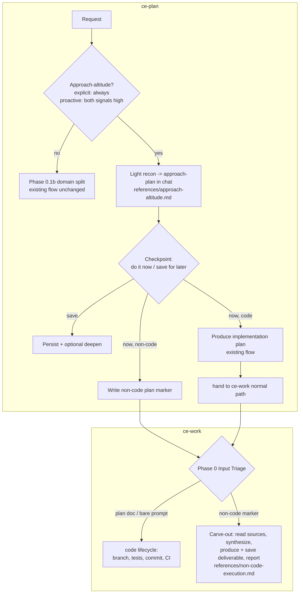

# feat: ce-plan approach altitude — plan-for-a-plan as a first-class shape

## Summary

Add an "approach altitude" capability to the `ce-plan` skill: answer a hard problem one level up by producing a grounded *plan for how the deliverable will be made* before committing to the deliverable. Entered explicitly ("plan for a plan", always honored) or rarely offered proactively (only when method-uncertainty AND cost-of-getting-it-wrong are both high). The approach-plan lands chat-first (file-optional, deepenable); at a checkpoint the user runs it now or saves for later. Non-code execution routes to a new lightweight `ce-work` carve-out that skips the code lifecycle; code execution stays `ce-work`'s normal path. All three pieces ship to stable (no beta); the conservative trigger is the sole safety mechanism and is validated by a dedicated `skill-creator` eval.

---

## Problem Frame

Users ask `ce-plan` for an *intermediate* plan — a plan for how the agent will approach a hard problem — then try to execute it. The canonical case (origin: "Margolis"): hand over a book PDF + a two-hour transcript and ask for "a thoughtful plan for how you'll read the book, mine the transcript, and produce a great document — do not write that document now." Today this fails: `ce-plan`'s non-software path forces a binary (plan-seeking vs. answer-seeking) with no slot for an *approach plan now → deliverable later*; the second phase is homeless (`ce-work` is code-only); and the approach-plan isn't grounded in the user's inputs. See origin Problem Frame for the full trace. The fix is one new altitude in `ce-plan` plus a minimal non-code execution home in `ce-work`.

---

## Requirements

Carried from origin (`origin: R1–R16`), grouped by concern. These are the contracts code review verifies against.

**Recognition and triggering**

- R1. `ce-plan` recognizes an explicit approach-plan request and always honors it, ungated by the proactive heuristic — it holds at the approach and does not start the deliverable. (origin R1)
- R2. `ce-plan` proactively offers an approach-plan only when method-uncertainty AND cost-of-getting-it-wrong are both high; if either is low, it stays silent and plans/does normally. (origin R2)
- R3. A proactive offer is a single lightweight, dismissible line naming the signal that fired — never a blocking ceremony. (origin R3)
- R4. The capability is domain-general — available for software and knowledge-work alike, indifferent to whether a human or the agent executes. (origin R4)
- R16. Approach-altitude is a distinct surface from the three existing in-chat approach mechanics (answer-seeking's plan-of-attack, the scoping synthesis, the deepening pass); its firing rules never overlap or duplicate them. (origin R16)

**Approach-plan production**

- R5. Before producing the approach-plan, the agent does light recon of provided inputs (skim/sample, not deep-read); full ingestion is deferred to execution. (origin R5)
- R6. The offer/no-offer decision is a cheap heuristic over request shape and input metadata; recon cost is paid only after the user accepts. (origin R6)
- R7. The approach-plan is delivered chat-first and is file-optional; the user can persist it and deepen it. (origin R7)

**Checkpoint and execution routing**

- R8. After the approach-plan, the user decides at a checkpoint: execute now, or save for later. (origin R8)
- R9. Code execution stays on `ce-work`'s normal path; `ce-plan` never writes code. (origin R9)
- R10. Non-code deliverable execution routes to `ce-work`'s non-code carve-out, or to any agent given the portable plan. (origin R10)
- R11. `ce-plan` itself does not execute the deliverable; it produces the approach-plan and hands off. (origin R11)

**`ce-work` non-code carve-out**

- R12. `ce-work`'s input triage recognizes a non-code plan and routes to a branch that skips the code lifecycle (no branch/worktree, no Test Discovery, no commit/PR/CI). (origin R12)
- R13. The carve-out executes the production plan — read sources, synthesize, produce and save the deliverable, report where it landed. (origin R13)
- R14. The carve-out is a minority-case branch alongside the code path and must not disturb the code path. (origin R14)

**Portability**

- R15. The approach-plan / production-plan stays agent-agnostic — no `ce-work`-specific choreography baked in — so any agent can execute it without `ce-work`. (origin R15)

---

## Key Technical Decisions

- **KTD1 — The approach-altitude gate sits between Phase 0.1 and Phase 0.1b.** Recognition must fire before `ce-plan`'s software/non-software split (`SKILL.md` lines 110-118) so the capability is domain-general (R4) — but *after* Phase 0.1's resume and deepen fast paths (lines 85-108), so a "deepen the plan" request or a resume-existing-plan short-circuits first and is never intercepted by the gate. An answer-seeking request with no approach-language and not-both-signals-high must pass through the gate untouched and reach the domain split (where answer-seeking's plan-of-attack fires) — the gate's earlier sequence position is exactly why R16 disjointness needs an explicit non-interception guard (see U3), verified as a U6 disjointness case. A code-domain-only or non-software-only placement would violate R4.

- **KTD2 — Distinct signal word + mechanical two-part proactive test; no vocabulary reuse.** Explicit recognition keys on approach-language ("plan for a plan", "plan the approach", "don't do it yet — plan how you'll do it") that does NOT reuse "deepen" / "strengthen" / scope-synthesis vocabulary already claimed by other mechanics. The proactive offer fires on a crisp two-part test (method-uncertainty AND cost-of-getting-it-wrong both high), expressed as a mechanical test, not example prompts that overfit wording. Prior art: the documented "deepen" signal-word tightening that fixed exactly this conflation class (`docs/solutions/best-practices/ce-pipeline-end-to-end-learnings.md`, item 6). Satisfies R2, R16.

- **KTD3 — Conditional/late-sequence body → a new reference; load-bearing recognition + routing stay inline.** The recon, approach-plan composition, and checkpoint sub-flow are conditional (only when approach-altitude is entered) and late-sequence → they live in a new `references/approach-altitude.md` with a 1-3 line stub in `SKILL.md` (extraction rule, `AGENTS.md` lines 158-160). The recognition gate (R1/R2) and the bare checkpoint routing that *fires the next skill* (R8/R10) are load-bearing and MUST stay inline in `SKILL.md`, since references can be skipped (`docs/solutions/skill-design/post-menu-routing-belongs-inline.md`). Backtick path, never `@`.

- **KTD4 — Non-code hand-off via an explicit plan marker that travels with the plan.** `ce-plan` marks an approach/production plan with an explicit metadata marker (a plan-kind frontmatter field) that `ce-work`'s triage reads. The marker is written **whenever the plan is persisted** — both the "save for later" branch and the "do it now / non-code" branch — so a plan saved now and handed to `ce-work` later still routes correctly; it cannot live only on the now-execution branch. Because the marker needs a file to live in, the "do it now / non-code" route **persists the marked plan to `docs/plans/` and passes that path to `ce-work`** (R7's file-optional governs the user keeping a chat-only copy; non-code *execution* forces a persist so the marker can travel). Structural inference ("no implementation units/files") is rejected as fragile — it would misclassify thin code plans — so R15 portability means "any agent can run the *marked* plan", not "`ce-work` infers intent from an unmarked one"; an unmarked non-code plan is not auto-detected. The field name + value vocabulary is **pinned in U2 and imported verbatim by U4** (U4 has a blocking contract dependency on U2, not merely ordering). The explicit token also gives contract tests something structural to assert (`ce-pipeline-end-to-end-learnings.md`, item 7). Satisfies R12; resolves origin Outstanding Question.

- **KTD5 — The carve-out is a routing fork inside the "Plan document" path, not a literal third top-level branch.** Detecting a frontmatter marker requires first having a file and reading it, which is downstream of `ce-work`'s "Plan document" vs "Bare prompt" input-shape fork (`SKILL.md` lines 21-43). So the carve-out lives *inside* plan-document handling: after the plan file is identified and its frontmatter read, a marked non-code plan routes to the knowledge-work execution path; an unmarked plan continues to the existing code path; "Bare prompt" is untouched. The knowledge-work path skips branch/worktree (Phase 1 Step 2), task-list-from-units, Test Discovery, and the entire `shipping-workflow.md`. The carve-out is scoped to **zero-code deliverables** — if a knowledge-work production legitimately needs to emit code (a script, a config snippet), that sub-step routes back to the code path rather than silently skipping its safeguards. Minority-case; the existing code path is untouched (R14).

- **KTD6 — The conservative gate is the sole safety mechanism, so it is validated by a `skill-creator` eval.** With no beta (user's rollout choice), gate quality is the risk control. The eval runs the gate as a calibrated borderline classifier: textbook-offer, textbook-silent, a negative control that must never fire (AE2), and genuinely-ambiguous cases at N≥3 measuring *variance*, not rate-shift (`docs/solutions/skill-design/safe-auto-rubric-calibration.md`, `ce-doc-review-calibration-patterns.md`). Behavioral skill changes cannot be validated in the authoring session (SKILL.md caches at session start) — the eval runs in a fresh session via `skill-creator`.

- **KTD7 — No process exhaust in the approach-plan or recon output.** The chat-first approach-plan surfaces as value, not as a narrated audit of recon steps ("I skimmed the PDF, then sampled the transcript…"). Follows the established Veil-of-value / no-process-exhaust rule (`references/universal-planning.md`, `references/plan-sections.md`). Satisfies R7's "reads as value" intent.

---

## High-Level Technical Design

Where the new pieces slot into the two existing skill spines, and the marker contract between them. Boxes labeled with a reference path are the new conditional bodies; everything else is existing flow.

**Testing model (applies to all prose units).** U1–U5 change skill *prose* (Markdown), which has no per-function unit tests. Behavioral validation is the `skill-creator` eval matrix in U6 (the real test surface); mechanical guards are `tests/frontmatter.test.ts` and `bun run release:validate`. Each prose unit's Test scenarios below enumerate the behaviors it must satisfy (mapped to origin Acceptance Examples); U6 is where those behaviors are actually exercised.

---

## Implementation Units

### U1. Approach-altitude recognition gate (inline, above the domain split)

- **Goal:** Add the load-bearing recognition gate to `ce-plan` `SKILL.md` so approach-altitude is entered explicitly (always) or proactively (rarely), before the domain split.
- **Requirements:** R1, R2, R3, R4, R16 (partial)
- **Dependencies:** none
- **Files:** `plugins/compound-engineering/skills/ce-plan/SKILL.md`
- **Approach:** Insert a new Phase 0 step *before* Phase 0.1b (KTD1). Two entries: (a) explicit recognition on distinct approach-language, ungated, always holds at the approach (KTD2); (b) a proactive offer fired only by the mechanical two-part test (method-uncertainty AND cost-of-getting-it-wrong both high), rendered as a single dismissible line of contextual prose naming the signal — NOT a blocking menu (R3; `AGENTS.md` interaction rules favor contextual prose for a dismissible nudge). On entry, hand to the conditional body via a backtick stub to `references/approach-altitude.md` (KTD3). State the named-bad-outcome (the new-hammer nag) inline so the conservatism is anchored.
- **Patterns to follow:** the load-bearing-inline pattern in `post-menu-routing-belongs-inline.md`; the explicit-signal-word tightening in `ce-pipeline-end-to-end-learnings.md` (item 6); existing Phase 0 step prose in `SKILL.md`.
- **Test scenarios:**
  - Covers AE1. Explicit "plan for a plan" / "don't write it yet — plan the approach" → enters approach-altitude, holds, does not start the deliverable, regardless of the proactive heuristic.
  - Covers AE2. Plain request with a clear method (even if large) → no offer; proceeds to normal flow. (Negative control — must not fire.)
  - Covers AE3. Plain request with heavy disparate inputs + vague outcome → exactly one dismissible offer naming the signal; declined → proceeds normally without re-asking.
  - Validated via the U6 eval matrix.
- **Verification:** The three behaviors above hold in the U6 `skill-creator` eval; the gate text sits above Phase 0.1b and is fully contained in `SKILL.md` (not only a reference).

### U2. `references/approach-altitude.md` — recon, approach-plan, checkpoint, routing

- **Goal:** Author the conditional body: two-stage grounding, chat-first approach-plan, file-optional persist + deepen, the checkpoint, and execution routing — including the write side of the non-code marker.
- **Requirements:** R5, R6, R7, R8, R9, R10, R11, R15
- **Dependencies:** U1
- **Files:** `plugins/compound-engineering/skills/ce-plan/references/approach-altitude.md` (new); `plugins/compound-engineering/skills/ce-plan/SKILL.md` (stub only)
- **Approach:** Light recon skims/samples provided inputs to ground the approach in specifics (R5), explicitly bounded to NOT be the full read (deferred to execution); give a directional per-input bound (e.g., PDF: section headers + first/last pages; transcript: sampled spans + topic shifts) so the checkpoint stays cheap (R6). When inputs are absent or arrive later, recon degrades gracefully to propose-from-request and the approach-plan is flagged ungrounded/provisional — never blocking, never emitting generic methodology. The approach-plan is composed chat-first, file-optional, deepenable (R7), and free of process exhaust (KTD7). The checkpoint is a genuine blocking decision → use the platform's blocking question tool (`AskUserQuestion` + `ToolSearch select:AskUserQuestion`, with the named cross-platform equivalents and numbered fallback per `AGENTS.md`): "do it now" vs "save for later" (R8); sequence orthogonal axes (now-vs-later first, then code-vs-non-code) rather than one multi-axis menu, per the AGENTS.md "split orthogonal decisions" rule and the 4-option cap. Routing (R9/R10/R11): code → produce the implementation plan via the existing flow, then hand to `ce-work` normal; non-code → write the explicit plan marker, persist the plan to `docs/plans/`, and fire the `ce-work` carve-out passing the path (load-bearing route, mirrored inline in `SKILL.md` per KTD3/KTD4). Both the save-for-later and now paths write the marker, so a later `ce-work` invocation on the saved plan routes correctly. Both keep the plan portable (R15) — no `ce-work`-specific choreography in the plan body. The "do it now" route must fire the skill, not merely announce it.
- **Patterns to follow:** the answer-seeking flow's structure in `references/universal-planning.md` (state approach → execute), but distinct per R16 (see U3); blocking-question and sub-agent-dispatch conventions in `AGENTS.md`; portability Core Principle 6 in `SKILL.md` line 40.
- **Test scenarios:**
  - Covers AE4. "Do it now" on a software approach-plan → produces the implementation plan and hands code to `ce-work`; on a knowledge-work approach-plan → routes to the `ce-work` carve-out (or any agent).
  - Recon produces input-grounded specifics (not generic methodology); recon is bounded (does not deep-read).
  - Approach-plan output contains no process-exhaust narration of recon steps.
  - "Save for later" persists a portable plan with no `ce-work`-specific choreography.
  - Validated via the U6 eval matrix.
- **Verification:** `SKILL.md` stub loads this reference on entry; the four behaviors hold in the U6 eval; the non-code marker write is defined here and matches what U4 reads.

### U3. Non-overlap boundaries with the three existing approach mechanics (R16)

- **Goal:** Draw crisp firing boundaries so approach-altitude never blurs into answer-seeking's plan-of-attack, the Phase 0.7 / 5.1.5 scoping synthesis, or the deepening pass.
- **Requirements:** R16
- **Dependencies:** U1, U2
- **Files:** `plugins/compound-engineering/skills/ce-plan/SKILL.md` (gate guard clauses — primary); `plugins/compound-engineering/skills/ce-plan/references/approach-altitude.md` (boundary note); `plugins/compound-engineering/skills/ce-plan/references/universal-planning.md` (only if the answer-seeking distinction cannot be expressed inline — touching a shared reference widens blast radius to flows outside this change, so prefer inline guards)
- **Approach:** Add explicit guards keyed on each mechanic's distinguishing property: answer-seeking's plan-of-attack is *non-blocking and discards the scaffold* and lives only in the non-software answer-seeking branch — approach-altitude is domain-general, *holds at a checkpoint*, and *persists/deepens*; the scoping synthesis (0.7/5.1.5) is a *scope* checkpoint for an already-committed deliverable — approach-altitude is an *altitude* checkpoint deciding whether to commit to the deliverable at all; deepening operates on an *existing artifact* — approach-altitude operates *before any artifact exists*, and its "deepen" affordance is the user enriching the approach-plan, not the Phase 5.3 confidence pass. Trace each firing condition across phases to prove disjointness (method from `docs/solutions/skill-design/compound-refresh-skill-improvements.md`, anti-pattern: no contradictory cross-phase rules).
- **Patterns to follow:** the "deepen" signal-word tightening (`ce-pipeline-end-to-end-learnings.md` item 6); the trace-each-action-across-phases checklist (`compound-refresh-skill-improvements.md`).
- **Test scenarios:**
  - A non-software answer-seeking question still routes to answer-seeking's plan-of-attack, NOT approach-altitude.
  - A normal software plan request with clear method still flows through the scoping synthesis, NOT approach-altitude.
  - A "deepen the plan" request still triggers the deepening fast path, NOT approach-altitude.
  - Approach-altitude entry does not also trip any of the three.
  - An answer-seeking request (multi-step retrieval/synthesis, no approach-language, not both-signals-high) reaches the domain split and answer-seeking's plan-of-attack — the earlier-sequenced gate does NOT intercept it.
  - Validated via the U6 eval matrix (disjointness cases).
- **Verification:** The disjointness cases hold in the U6 eval; each mechanic's guard names its distinguishing property in the source.

### U4. `ce-work` non-code carve-out (read marker + knowledge-work execution path)

- **Goal:** Add the third Phase 0 triage branch that detects the non-code marker and executes the production plan while skipping the code lifecycle.
- **Requirements:** R12, R13, R14
- **Dependencies:** U2 (marker field name — blocking contract dependency, imported verbatim)
- **Files:** `plugins/compound-engineering/skills/ce-work/SKILL.md` (Phase 0 in-branch marker detection + load-bearing route + stub); `plugins/compound-engineering/skills/ce-work/references/non-code-execution.md` (new)
- **Approach:** In Phase 0 Input Triage (`SKILL.md` lines 21-43), add marker detection *inside* the "Plan document" path — after the file is identified and its frontmatter read (per KTD5; not a literal third top-level branch, since marker detection requires already having a file). A marked non-code plan routes to the knowledge-work execution path; an unmarked plan continues to the existing code path; "Bare prompt" is untouched (R14). The detection + route are load-bearing → inline in `SKILL.md`; the execution body (read sources, synthesize, produce + save the deliverable, report where it landed — R13) lives in the new `references/non-code-execution.md` (conditional/late-sequence → extraction rule). Define a default deliverable save target + naming convention (e.g., a `docs/` subpath, or a path the user names at the checkpoint) so R13/AE5 have a concrete "where it landed" to assert — distinct from the deferred git-vs-plain-write decision. Import the marker field name verbatim from U2. The carve-out skips branch/worktree (Phase 1 Step 2), task-list-from-units, Test Discovery, and `shipping-workflow.md` (R12).
- **Patterns to follow:** the existing two-branch triage shape in `ce-work` `SKILL.md`; load-bearing-inline routing (`post-menu-routing-belongs-inline.md`); the carve-out must not import the shipping lifecycle from `references/shipping-workflow.md`.
- **Test scenarios:**
  - Covers AE5. A non-code marked plan → carve-out skips branch/test/commit/CI and instead reads sources, synthesizes, writes + locates the deliverable.
  - A normal code plan / bare prompt → unchanged behavior (the existing two branches still fire; carve-out does not).
  - Marker the carve-out reads matches the marker U2 writes.
  - Validated via the U6 eval matrix.
- **Verification:** Code-path behavior is unchanged in the eval; the carve-out produces and locates a deliverable for a marked plan; detection + route are inline in `SKILL.md`.

### U5. Parallel-surface sync — `ce-work-beta` propagation + skill-doc updates

- **Goal:** Keep parallel surfaces consistent: propagate the carve-out into `ce-work-beta` (confirmed), and correct the skill docs that the change makes inaccurate.
- **Requirements:** R12, R13, R14 (parity); documentation accuracy
- **Dependencies:** U4
- **Files:** `plugins/compound-engineering/skills/ce-work-beta/SKILL.md`; `docs/skills/ce-plan.md`; `docs/skills/ce-work.md`
- **Approach:** Propagate the U4 carve-out into `ce-work-beta` (shares the execution body; avoids the two-diverging-surfaces failure mode in `docs/solutions/skill-design/ce-work-beta-promotion-checklist.md`); preserve the beta's Codex-delegation delta untouched. Update `docs/skills/ce-work.md`, which currently states `ce-work` is software-only (the carve-out directly contradicts the "When to Reach For It" framing and the FAQ "Does ce-work support non-software plans? Not directly"). Update `docs/skills/ce-plan.md` for the framing shift (a new top-level capability + a "What Makes It Novel" entry). State the stable/beta-sync and skill-doc-sync decisions explicitly in the commit per `AGENTS.md`.
- **Patterns to follow:** `ce-work-beta-promotion-checklist.md`; the existing `docs/skills/*.md` structure and "What Makes It Novel" sections; `AGENTS.md` stable/beta-sync and skill-doc-sync conventions.
- **Test scenarios:** Mostly documentation + parity; the one verifiable check is that `docs/skills/ce-work.md` no longer contains software-only claims after the edit — grep both updated docs for residual `software-only` / `Not directly` phrasing. Behavioral parity of the beta carve-out is covered by the U6 eval running against both surfaces.
- **Verification:** `docs/skills/ce-work.md` no longer claims software-only; `docs/skills/ce-plan.md` describes approach-altitude; `ce-work-beta` carve-out matches stable `ce-work`.

### U6. Validation — mechanical checks + `skill-creator` trigger eval

- **Goal:** Validate the change — mechanical guards plus the behavioral eval that is the gate's safety net.
- **Requirements:** validates R1–R16, with focus on the R2/R3 trigger
- **Dependencies:** U1, U2, U3, U4, U5
- **Files:** `tests/frontmatter.test.ts` (run, not necessarily edit); `package.json` `release:validate` script (run); eval fixtures are scratch (OS temp / `skill-creator` workspace), not repo-tracked
- **Approach:** Run `bun test tests/frontmatter.test.ts` and `bun run release:validate` (new reference files don't change skill counts, but confirm parity/frontmatter). Then run the behavioral eval via the `skill-creator` skill in a fresh session (SKILL.md caches at session start, so the eval cannot run in the authoring session). The eval matrix: (a) textbook "should offer", (b) textbook "should stay silent", (c) a negative control that must NEVER offer (AE2), (d) genuinely-ambiguous borderline cases at N≥3 measuring *variance* not rate-shift, plus (e) AE1/AE4/AE5 and the U3 disjointness behaviors. Treat a single bad run as noise; act on variance.
- **Execution note:** Behavioral skill changes cannot be validated in the authoring session — run the `skill-creator` eval in a fresh session.
- **Patterns to follow:** the eval-harness workspace pattern in `docs/solutions/skill-design/safe-auto-rubric-calibration.md`; the N≥3 variance discipline in `ce-doc-review-calibration-patterns.md`; the repo's skill-testing guidance in `AGENTS.md` ("Validating Agent and Skill Changes").
- **Test scenarios:**
  - `bun test tests/frontmatter.test.ts` passes (name/prefix, description length, no raw angle brackets).
  - `bun run release:validate` passes (manifest/count parity).
  - Trigger eval: negative control never offers across N≥3; textbook cases classify correctly; borderline variance is acceptably low; AE1/AE2/AE3/AE4/AE5 and disjointness behaviors hold.
- **Verification:** Mechanical checks green; eval shows the negative control never fires and borderline variance is low enough to ship the gate to stable.

---

## Scope Boundaries

**Deferred to Follow-Up Work**

- Tuning the proactive trigger's calibration after real-world use (the eval validates pre-ship; live data may warrant adjustment).
- Promoting any of this behind a config flag if the conservative gate proves too eager in practice.
- Git/save behavior of the carve-out's produced deliverable beyond "write + report location" (commit vs. plain write) — resolve if a concrete need appears.

**Outside this change's identity**

- `ce-plan` writing or running code. Code is always `ce-work`; the approach altitude never crosses into code execution (R9/R11).
- A full non-software `ce-work` mode. The carve-out is intentionally minimal (R14), not a co-equal knowledge-work execution engine.
- Auto-executing the deliverable without the checkpoint — the hold is the point (the "do it now" checkpoint is not a single-keystroke rubber-stamp; `ce-pipeline-end-to-end-learnings.md` item 3).
- Renaming `ce-plan` to reflect non-plan output — accepted naming oddness; answer-seeking already lives with it.

---

## Risks & Dependencies

- **New-hammer over-firing (top risk).** No beta safety net — the conservative gate is the only guard. Mitigation: KTD2 mechanical test + KTD6 eval with a negative control at N≥3 measuring variance (this is why U6 is a first-class unit). Residual: a self-authored eval samples the authors' anticipated distribution, so it cannot fully falsify over-firing on input shapes they didn't foresee — seed the borderline set from real prior `ce-plan` transcripts where possible. The config kill-switch is deferred (Scope Boundaries), so disabling an over-firing gate would need a release cycle — an accepted exposure given the no-beta rollout choice.
- **R16 boundary drift.** Four in-chat "approach" surfaces coexisting is the top destabilization risk. Mitigation: U3's per-mechanic guards + distinct signal word + cross-phase firing trace.
- **SKILL.md caching.** Load-bearing recognition (R1/R2) and the checkpoint route (R8/R10) must be inline, or they silently won't fire. Mitigation: KTD3 keeps them in `SKILL.md`; references carry only the conditional body.
- **Carve-out disturbing the code path.** Mitigation: explicit marker (KTD4) + isolated third branch (KTD5); U4/U6 verify the code path is unchanged.
- **In-session validation is impossible** for prose behavior (caching). Dependency: the U6 eval runs via `skill-creator` in a fresh session. The `skill-creator` skill is the named prerequisite.
- **`ce-work-beta` drift.** Mitigation: U5 propagates the carve-out for parity (confirmed); the promotion-checklist learning warns against two diverging surfaces.

---

## Open Questions

**Deferred to implementation**

- The exact frontmatter field name and value vocabulary for the non-code plan marker — chosen in U2 and imported verbatim by U4 (a blocking contract per KTD4, not an independent decision on each side); only the literal string is an implementation detail.
- The precise bound on "light recon" per input type (PDF, transcript, codebase) so the checkpoint stays cheap (R5/R6) — calibrate during U2, validate in U6.
- The exact placement label/number for the new pre-0.1b gate step (renumbering vs. inserting a 0.0x step) — a `SKILL.md` editing detail for U1.

---

## Sources / Research

- `plugins/compound-engineering/skills/ce-plan/SKILL.md` — boundary statements (lines 15, 524), Core Principles 6/8 (40, 42), Phase 0.1b domain split (110-118), Phase 0.7 scoping synthesis (211-258), Phase 5.1.5 (615-665), Phase 5.3 deepening (693-768).
- `plugins/compound-engineering/skills/ce-plan/references/universal-planning.md` — plan-seeking vs answer-seeking disposition (17-27), answer-seeking plan-of-attack flow (30-66), Veil-of-value / process-exhaust rule.
- `plugins/compound-engineering/skills/ce-work/SKILL.md` — Phase 0 Input Triage (21-43), code-assuming Phase 1 branch/worktree (63-115), Phase 2 Test Discovery / commits (192-321).
- `plugins/compound-engineering/skills/ce-work/references/shipping-workflow.md` — the commit → PR → CI lifecycle the carve-out skips.
- `plugins/compound-engineering/skills/ce-work-beta/SKILL.md` — beta-sync target (Codex-delegation delta preserved).
- `plugins/compound-engineering/AGENTS.md` — SKILL.md caching + extraction rule (109-160), blocking-question + interaction rules (174-195), beta skills (321-329), stable/beta + skill-doc sync conventions, "Validating Agent and Skill Changes".
- `docs/solutions/best-practices/ce-pipeline-end-to-end-learnings.md` — flag-conflation / distinct-signal-word (item 6), rubber-stamp single-keystroke (item 3), contract-tests-assert-structure (item 7).
- `docs/solutions/skill-design/post-menu-routing-belongs-inline.md` — load-bearing routing must be inline + fire the skill.
- `docs/solutions/skill-design/safe-auto-rubric-calibration.md` and `ce-doc-review-calibration-patterns.md` — borderline-classifier eval; variance over rate-shift; N≥3.
- `docs/solutions/skill-design/compound-refresh-skill-improvements.md` — explicit opt-in over auto-detect; conservative-at-boundary; no contradictory cross-phase rules.
- `docs/solutions/skill-design/beta-skills-framework.md`, `beta-promotion-orchestration-contract.md`, `ce-work-beta-promotion-checklist.md` — beta/parity considerations (rollout chose stable; parity propagation applies).
- `docs/skills/ce-plan.md`, `docs/skills/ce-work.md` — skill-doc sync targets (ce-work.md currently states software-only).
- Origin requirements: `docs/brainstorms/2026-06-04-ce-plan-approach-altitude-requirements.md`.
