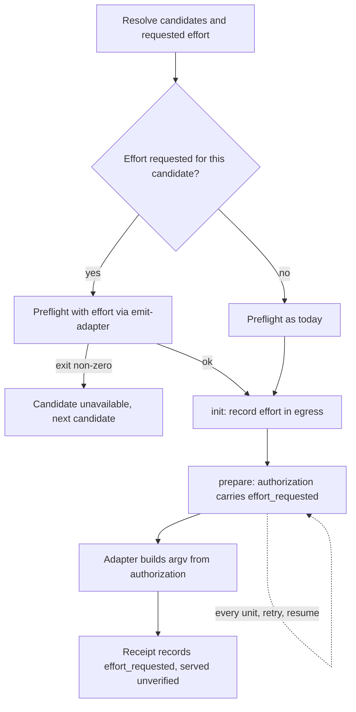

# Work Engine Effort - Plan

## Goal Capsule

- **Objective:** A person who sends `ce-work` implementation to an external harness can choose the reasoning effort that worker runs at from CE config, and can see which effort each run requested.
- **Means:** A per-harness `work_engine_effort` map, carried to the worker through the controller's recorded egress and the attempt authorization (KTD1, KTD2).
- **Authority:** Product Contract requirements, then Key Technical Decisions, then unit detail. The repository's active instructions outrank this plan on conventions.
- **Execution profile:** code change across `skills/ce-work`, `skills/ce-setup`, `docs/guides` and `tests/skills`. It includes skill instruction changes, so it needs a behavioral eval as well as `bun run test`.
- **Stop conditions:** stop and report if any exact-key reader of the attempt authorization exists beyond `skills/ce-work/scripts/cross-model-work.sh`, or if carrying effort would require changing the four-field engine carrier or the `lfg` skill.
- **Finishing:** whoever runs `ce-work` owns simplify, review, commit and PR as usual.

---

## Product Contract

### Summary

Add an optional `work_engine_effort` key to CE config: a map from harness to the effort that harness's worker should run at.  The run records the requested effort once and reuses it for every unit, retry and resume.

### Problem Frame

`ce-work` runs external Codex, Claude and Grok workers at a fixed `high` effort. `skills/ce-work/scripts/cross-model-work.sh` already accepts a `CROSS_MODEL_EFFORT_OVERRIDE` environment variable and validates it per route, but nothing in `ce-work` sets it, so config cannot reach it. The Codex adapter runs with `--ignore-user-config`, so a user's own Codex effort setting is dropped too. `ce-code-review` and `ce-doc-review` already expose `cross_model_effort`, and users have asked for the same control over implementation.

### Key Decisions

- **Effort is expressed per harness, not as one value for the whole list.** (session-settled: user-directed — chosen over a single strict scalar: effort levels differ per harness, and one value would skip every Cursor entry and change the recipient.) Governs R1, R4.
- **Config is the only way to set effort; an effort stated in the prompt is not a supported override.** (session-settled: user-directed — chosen over a one-sentence prompt override: it removes the routed and unrouted cases, the effort source field, and their tests.) Governs R1.
- **A one-off effort is not carried through the `lfg` engine carrier.** (session-settled: user-directed — chosen over adding an effort field to the carrier: `lfg` is meant to run autonomously and the case is rare.) Governs R6.

### Requirements

**Setting effort**

- R1. A user can set the external worker's effort per harness in CE config, in `config.yaml` or `config.local.yaml`, under the ordinary layering rule for map keys.
- R2. With no effort configured, each route keeps its documented default: Codex, Claude and the native Grok CLI run at `high`, OpenCode passes no variant, and Cursor routes pass no effort.

**Honoring effort**

- R4. A candidate that cannot honor the effort requested for it is unavailable before any work is sent, and traversal continues to the next candidate. The worker never runs at a different effort than the one requested.
- R5. A harness with no requested effort is unaffected by efforts requested for other harnesses.
- R6. Config effort applies when `lfg` invokes `ce-work`, with or without an engine carrier, and needs no change to `lfg` or the carrier.
- R7. The effort resolved when a run starts applies to every unit, retry and resume of that run. A later config change does not alter a run in progress.

**Visibility**

- R8. The pre-dispatch disclosure, the run record and the return summary name the requested effort. Served effort is reported as `unverified`.
- R9. When a candidate collapses to native execution, the run says that the configured effort was not applied.
- R10. The `ce-setup` health check warns about a malformed `work_engine_effort` value and never marks the work engine unavailable because of it.

### Acceptance Examples

- AE1. Covers R4, R5.
  - **Given:** preferences are Cursor with Composer, then Codex, then Claude, and the map is `codex: xhigh`, `claude: max`.
  - **When:** `cursor-agent` is installed.
  - **Then:** Composer receives the work with no effort argument.
- AE2. Covers R4.
  - **Given:** the same list with the map `codex: max`.
  - **When:** Composer is unavailable.
  - **Then:** Codex is unavailable with a reason naming the effort, and traversal continues to Claude.
- AE3. Covers R6, R4.
  - **Given:** `lfg` passes a carrier for Codex with no model, and the map is `codex: xhigh`.
  - **When:** `ce-work` starts.
  - **Then:** Codex runs at `xhigh`, even with `work_engine_mode: off`.
- AE4. Covers R7.
  - **Given:** a three-unit run started with Codex at `xhigh`.
  - **When:** the map changes to `codex: low` after unit 1.
  - **Then:** units 2 and 3 still run at `xhigh`.
- AE5. Covers R9.
  - **Given:** a Claude Code host and a Claude candidate with no distinct model, with the map `claude: max`.
  - **When:** the candidate collapses to native.
  - **Then:** the run discloses that `max` was not applied.

### Scope Boundaries

- An effort stated in the prompt is not a supported way to set effort. The instructions neither define nor forbid it.
- Cursor, Composer and Grok-through-Cursor routes gain no effort setting.
- Worker timeouts stay at 600 seconds idle and 7200 seconds hard.
- `cross_model_effort` keeps its meaning as the review peer's effort.
- Same-harness entries cannot carry different efforts. Effort is per harness.

#### Deferred to Follow-Up Work

- Measuring quiet intervals at `xhigh` and `max` and revisiting the idle cap.
- A served-effort receipt, if any harness starts reporting one.

---

## Planning Contract

### Key Technical Decisions

- KTD1. **Config shape is a top-level map, `work_engine_effort`, keyed by the config harness vocabulary.** Values are exact tokens from that harness's own levels, with no mapping between harnesses. It instantiates the per-harness Key Decision (session-settled: user-directed — chosen over a single strict scalar: effort levels differ per harness, and one value would skip every Cursor entry and change the recipient) and governs R1, R4, R5. A top-level key leaves the `work_engine_preferences` entry grammar untouched, so older plugin versions still parse the list. Per-entry `effort` was rejected for three reasons. The current health-check parser errors on any entry key other than `harness` and `model`. A local override would have to restate the whole team list. A carrier would need an entry-matching rule. Reusing `cross_model_effort` was rejected because review effort is tuned separately.
- KTD2. **Effort travels through recorded controller state, not the environment.** The host adds the requested effort to the egress object at `init`. `attempt_authorization` copies it into the authorization as `effort_requested`. The adapter builds argv from that field and ignores an ambient `CROSS_MODEL_EFFORT_OVERRIDE` on production starts. This satisfies R7: egress is already compared on resume, and each authorization is already built from recorded state, so the host never retypes the value per unit. It also keeps the existing rule in `skills/ce-work/references/cross-model-execution.md` that pins come only from the authorized projection.
- KTD3. **`effort_requested` is present only when an effort was requested.** An unset run keeps today's 13-key authorization, so existing fixtures and runs started before this change stay valid (R2). The adapter accepts the current key set, or that set plus `effort_requested`.
- KTD4. **Preflight uses the adapter's existing introspection mode.** For a candidate with a requested effort, the host runs the `--emit-adapter` check with the effort set. A non-zero exit makes the candidate unavailable with the script's message as the reason (R4). The production check after the authorization handshake stays as a backstop. `validate_effort_override` remains the only allowlist; skill instructions and the health check list no levels.
- KTD5. **One condition decides every effort case.** Config requests an effort for candidates of a harness, and a candidate that cannot honor its requested effort is unavailable. The same condition covers a carrier whose harness has a configured effort. Under an `lfg` requirement-strength carrier, an incompatible config value therefore stops the pipeline through `lfg`'s existing requested-versus-actual check.
- KTD6. **Effort does not make a candidate distinct.** The same-host collapse rule is unchanged. A collapsed candidate's effort is disclosed as not applied (R9).
- KTD7. **Receipts carry `effort_requested`; served effort stays `unverified`.** The adapter writes it, and the controller's receipt projection and authorization comparison include it. The worker-authored result schema does not change. This follows `docs/solutions/skill-design/requested-vs-verified-model-identity.md`.
- KTD8. **The health check validates shape only.** It warns when `work_engine_effort` is not a map, names an unknown harness, or names `cursor`. It does not check levels, because skills ship as isolated units and `ce-setup` cannot call `ce-work`'s validator (R10).
- KTD9. **A `work_engine_effort` value that is not a harness map requests nothing.** `ce-work` says once that it ignored the value, and each route keeps its default (R2). This is a fallback direction in the instructions, not a parser.

### High-Level Technical Design

### Assumptions

- Released older plugin versions ignore unknown top-level config keys. This was confirmed for the current `skills/ce-setup/scripts/check-health` parser only.
- The adapter's allowlist reflects what each CLI accepts. Preflight checks the allowlist, not the provider.

### Risks

| Risk | Mitigation |
|---|---|
| A host misreads or drops the map when resolving effort | Behavioral eval on Claude and Codex graded on the authorization file and job-log argv (U5) |
| `xhigh` or `max` turns exceed the 600-second idle cap | Documented in the guides; measurement deferred |
| An ambient `CROSS_MODEL_EFFORT_OVERRIDE` stops affecting production runs | Intended; stated in the PR description and `docs/guides/ce-work.md` |
| A run started on the new version and resumed on an older adapter fails authorization | Fails closed; documented as unsupported |

### Sources

- `skills/ce-work/scripts/cross-model-work.sh`: `validate_effort_override`, `adapter_argv`, the `--emit-adapter` branch, the exact-key authorization check, receipt writers.
- `skills/ce-work/scripts/unit_workspace_state.py`: `fixed_route_contract`, `attempt_authorization`, the egress equality check on resume.
- `skills/ce-work/scripts/unit_workspace_jobs.py`: `HOST_RECEIPT_FIELDS`, the requested-model comparison.
- `skills/ce-code-review/references/cross-model-review.md`: the existing effort disclosure wording.
- `docs/solutions/skill-design/prose-cannot-validate-caller-control-data-byte-for-byte.md`
- `docs/plans/2026-08-12-002-fix-repo-config-cascade-plan.md`: map and list replacement across config layers.

---

## Implementation Units

### U1. Carry effort through controller state to the adapter

- **Goal:** A requested effort recorded at `init` reaches argv and receipts for every attempt of the run.
- **Requirements:** R2, R4, R7, R8; KTD2, KTD3, KTD7.
- **Dependencies:** none.
- **Files:** `skills/ce-work/scripts/unit_workspace_state.py`, `skills/ce-work/scripts/unit_workspace_jobs.py`, `skills/ce-work/scripts/cross-model-work.sh`, `tests/skills/ce-work-unit-workspace-init.test.ts`, `tests/skills/ce-work-unit-workspace-retries.test.ts`, `tests/skills/ce-work-cross-model-routes.test.ts`, `tests/skills/ce-work-cross-model-integration.test.ts`.
- **Approach:**
  1. `fixed_route_contract` accepts an optional egress effort and checks only that it is a short plain token.
  2. `attempt_authorization` adds `effort_requested` when egress has an effort.
  3. The adapter accepts the two key sets in KTD3, takes effort from the authorization, and ignores the ambient variable on production starts.
  4. Receipts and the controller's receipt projection carry `effort_requested`, and the controller compares it with the authorization.
- **Execution note:** Start with failing tests for the two authorization key sets and the unset-argv equivalence.
- **Patterns to follow:** how `model_requested` moves from binding to authorization to receipt.
- **Test scenarios:**
  - An authorization without `effort_requested` yields argv identical to today's for each route.
  - An authorization with `effort_requested: xhigh` on Codex yields the `xhigh` effort argument.
  - An authorization with any other extra key is rejected.
  - A production start with an ambient override and no authorized effort runs at the default.
  - `init` with an egress effort, then a second `init` with a different effort, is blocked.
  - Two `prepare` calls in one run produce the same `effort_requested`.
  - A retried attempt keeps the recorded effort after the config file changes.
  - A run initialized with one effort and resumed after the config file changes keeps the original effort in its egress, authorization, argv and receipt.
  - An authorized effort the route cannot honor publishes an unavailable receipt.
  - A receipt whose `effort_requested` differs from the authorization is rejected.
- **Verification:** the listed test files pass, and no existing authorization fixture needed editing.

### U2. Resolve, preflight and disclose effort in `ce-work`'s instructions

- **Goal:** `ce-work` resolves effort per KTD5, checks it at preflight, records it at `init`, and discloses it.
- **Requirements:** R1, R4, R5, R6, R8, R9; KTD1, KTD4, KTD5, KTD6, KTD9.
- **Dependencies:** U1.
- **Files:** `skills/ce-work/references/execution-engines.md`, `skills/ce-work/references/cross-model-execution.md`, `skills/ce-work/references/return-to-caller.md`, `tests/skills/ce-work-outcome-spine.test.ts`.
- **Approach:**
  1. Invoke the repo-local `ce-skill-work` skill before editing.
  2. Add the map to the per-checkout configuration section of `execution-engines.md`, outside the marked config-layers block.
  3. State KTD5's condition once, with the safe failure direction, and KTD9's fallback. Give the agent the goal and what to do when effort cannot be honored; do not write a resolution procedure, a precedence table, or a list of levels or cases.
  4. In `cross-model-execution.md`, add effort to the sanction disclosure, the egress passed to `init`, and the run-record fields, and extend the ambient-override sentence to effort.
  5. State that after `init` the host takes effort from the recorded run for every unit, retry and resume, and never resolves it again from config.
  6. Add the requested effort to `return-to-caller.md` as an additive field.
  7. `skills/ce-work/SKILL.md` does not change; it has under 100 bytes of headroom.
- **Patterns to follow:** the effort disclosure wording in `skills/ce-code-review/references/cross-model-review.md`.
- **Test scenarios:**
  - `execution-engines.md` names `work_engine_effort`.
  - The existing pins for `harness`, optional `model` and "configured default" still pass.
- **Verification:** the pin test passes, and the prose states one condition for effort rather than a list of cases.

### U3. Health check, config template and setup repair

- **Goal:** `ce-setup` documents the key and warns about a malformed value.
- **Requirements:** R10; KTD8.
- **Dependencies:** none.
- **Files:** `skills/ce-setup/scripts/check-health`, `skills/ce-setup/references/config-template.yaml`, `.compound-engineering/config.example.yaml`, `skills/ce-setup/SKILL.md`, `skills/ce-setup/references/repo-fixes.md`, `tests/skills/ce-setup-check-health.test.ts`.
- **Approach:**
  1. Read `work_engine_effort` under the map layering rule and emit the three warnings in KTD8.
  2. Add a commented example to the template's work engine block, and keep the example copy byte-identical.
  3. Extend the repair step to fix a malformed map in the layer that supplied it.
- **Test scenarios:**
  - A valid map produces no warning and leaves the engine status unchanged.
  - A scalar value warns, and a valid enabled engine stays available.
  - An unknown harness key warns, and a valid enabled engine stays available.
  - A `cursor` key warns, and a valid enabled engine stays available.
  - A local map replaces the team map.
  - An `effort:` line inside a preferences entry still reports an unsupported entry.
  - The template and example remain byte-identical.
- **Verification:** the health-check test file passes.

### U4. Guides

- **Goal:** Users can find the key, its levels per harness, and its limits.
- **Requirements:** R1, R2.
- **Dependencies:** U2, U3.
- **Files:** `docs/guides/configuration.md`, `docs/guides/ce-work.md`, `docs/guides/lfg.md`.
- **Approach:** Add the key to the configuration table and the implementation routing section, with the levels each harness accepts. State that OpenCode's unset means no variant, that Cursor routes take no effort, that an exported `CROSS_MODEL_EFFORT_OVERRIDE` no longer affects runs, and that `xhigh` and `max` can hit the idle cap. In `lfg.md`, say config effort applies. State in `ce-work.md` that effort is set in config only.
- **Test scenarios:** Test expectation: none -- documentation only; existing doc pins in `tests/skills/ce-setup-check-health.test.ts` must still pass.
- **Verification:** the three guides agree with `execution-engines.md`.

### U5. Behavioral eval

- **Goal:** Evidence that hosts read the map and dispatch at the requested effort.
- **Requirements:** R1, R4, R5, R6, R7, R9.
- **Dependencies:** U1, U2.
- **Files:** `skills/ce-work/references/cross-model-work-eval.md`, `tests/skill-eval-cell/scenarios.md`.
- **Approach:** Add eval rows and run them with the on-disk skill injected into fresh agents on Claude and Codex, with real dispatch, comparing the pre-change skill with the current tree. Grade on the authorization file and job-log argv, never on the announcement.
- **Test scenarios:**
  - Covers AE1. Cursor-first list with a Codex and Claude map: Composer is dispatched with no effort.
  - Covers AE2. `codex: max` skips Codex at preflight and sends no work to it.
  - Covers AE3. An `lfg` carrier for Codex receives the map's effort with standing mode off.
  - Covers AE4. Units 1 and 3 of a three-unit run carry the same effort after a mid-run config change.
  - Covers AE5. A same-host collapse discloses the unapplied effort.
  - Map set for Codex: the authorization carries `effort_requested`.
  - No map: no effort is invented, and the authorization has no `effort_requested`.
  - A run resumed in a fresh session after the map changes continues at the recorded effort.
- **Verification:** results for both hosts are attached to the PR, with any host-specific failure named.

---

## Verification Contract

| Check | Applies to | Signal |
|---|---|---|
| `bun run test` | U1, U2, U3 | passes |
| `bun run release:validate` | U2, U3 | passes |
| `bun run test:skill-eval-pack -- --skill ce-work --arm ab` on Claude and Codex | U5 | rows graded on artifacts; both failure directions covered |
| `tests/codex-skill-prompt-budget.test.ts` | U2, U3 | `ce-work` and `ce-setup` stay under the cap |

## Definition of Done

- Every requirement has a passing mechanical test or an eval row that exercises it.
- An unset run produces the same authorization and argv as before the change.
- The config template, its example copy, `docs/guides/configuration.md` and the consumer docs changed together.
- Eval evidence from Claude and Codex is attached to the PR.
- The PR description states the ambient-override behavior change.
- Code from abandoned approaches is removed from the diff.
