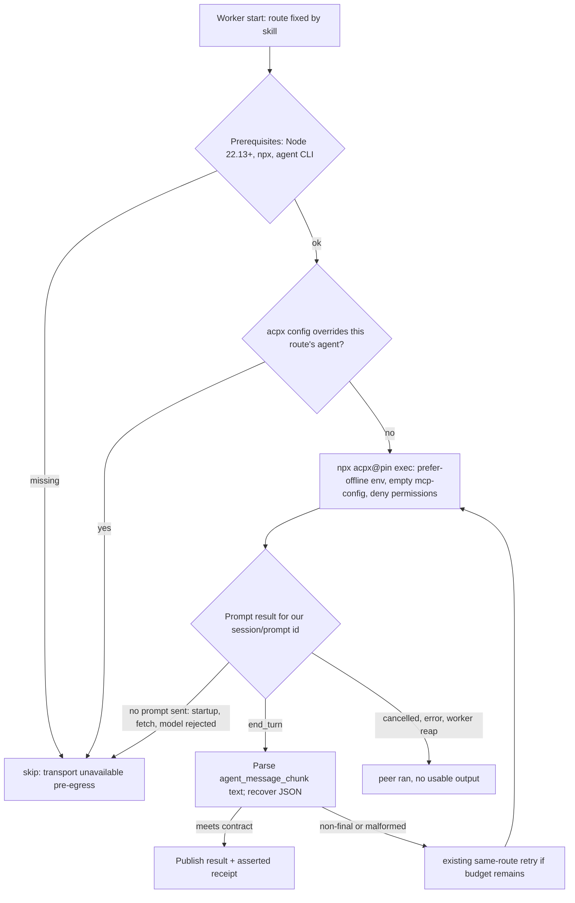

# acpx Cross-Model Transport - Plan

## Goal Capsule

- **Objective:** Cross-model peers in `ce-pov`, `ce-doc-review`, `ce-code-review`, and `ce-work` keep working as the agent CLIs they drive change, without maintainers patching per-CLI output handling.
- **Means:** acpx, pinned exactly and run through npx, becomes the only transport in all four workers, migrated one worker at a time (KTD1, KTD2, KTD3).
- **Authority:** The user's decisions in this session (Key Decisions and labeled KTDs), then the repository rules in `AGENTS.md`: skill directories stay self-contained, bash 3.2 compatibility, `skills/**` edits go through the repo-local `ce-skill-work` skill, and behavior changes to delegating skills need live evaluation on at least two harnesses.
- **Stop conditions:** acpx changes its `--format json` contract in a way the contract suite cannot pin. Any of these stops the affected worker's migration and returns to the user.
- **Execution profile:** A stack of PRs, one per worker (ce-pov first), plus PRs for ce-setup, the canary workflow, and Windows CI. Each worker's native adapter code is deleted in the same PR that migrates it, gated on that worker's parity tests and live evals.
- **Finish and ship:** `ce-work` implements unit by unit; `ce-commit-push-pr` opens each PR and `ce-babysit-pr` watches it.

---

## Product Contract

### Summary

Replace the hand-built per-CLI adapters in the four cross-model worker scripts with one acpx invocation per run. acpx is fetched through npx at one exact version and reuses cached copies. A fail-closed guard checks acpx config before every launch. Success is read from the ACP prompt result rather than exit codes. ce-setup checks the Node prerequisite and offers to warm the npm cache. A weekly canary tests the newest acpx and opens the pin-bump PR.

### Problem Frame

Each worker script builds argv and parses output separately for `codex`, `claude`, the `grok` CLI, `cursor-agent` (grok-cursor, composer, cursor auto), and `opencode`. That is roughly 230-260 of 982 lines in `cross-model-pov.sh`, 380-430 of 1304 in `cross-model-adversarial-review.sh`, 340-400 of 1283 in `cross-model-doc-review.sh`, and 120-160 of 1002 in `cross-model-work.sh`. Maintainers estimate about a third of past cross-model fixes were per-CLI output quirks. Every new CLI release can break a parser, and the fix has to land in up to four copies.

acpx (github.com/openclaw/acpx) speaks the Agent Client Protocol to each agent through an adapter and prints the raw ACP JSON-RPC stream, so one parser covers every route. A 2026-09-27 spike ran all seven routes end-to-end through acpx in `ce-pov`. Research on 2026-09-28 found costs the spike did not handle: acpx reads launch configuration from the working directory, the Claude adapter loads the reviewed repository's project settings, the codex and claude adapters float within version ranges, `--timeout` applies per phase, and exit codes alone do not decide success. A three-model panel (ce-pov host, Codex, Grok) recommended a ce-pov-only trial with native adapters kept. The user chose a full migration instead, done one worker at a time with each worker gated on its own parity tests and live evals.

### Key Decisions

- **acpx is required; native adapters are deleted.** Each worker loses its per-CLI code in the PR that migrates it; there is no long-lived opt-in switch and no native fallback. (session-settled: user-directed — chosen over a ce-pov-only opt-in trial with native adapters kept, which all three panel voices recommended: the user judged the trial too cautious and wants the quirk-chasing gone.) Governs R1, R16.
- **Native Windows is tested, not special-cased.** acpx runs on Windows too; routes that cannot work there are reported unavailable and skills degrade to no peer. (session-settled: user-directed — chosen over keeping the native adapters on Windows: keeping them would keep the code this work removes.) Governs R15.
- **Read-only peer posture is nice-to-have, not a gate.** (session-settled: user-directed — chosen over gating adoption on read-only enforcement: peers work in the same worktree and the risk is low.) Review workers still pass deny-permission flags, but write denial is best effort. Governs R6, R13.
- **A hostile checkout is out of scope.** Peers run in a checkout the user already trusts: the host agent loads its project settings and hooks, and ordinary review work runs its code. Guarding peers against a malicious repository adds little, so the plan keeps only the checks that preserve today's peer behavior. (session-settled: user-directed — chosen over keeping the full guard set from review, including npm-config guards and prove-or-drop route gating: the risk is theoretical for nearly all use, and untrusted-PR review needs isolation at another layer.) Governs R5, R7.
- **grok-cursor runs at Cursor's high/fast ACP preset and composer at fast.** (session-settled: user-directed — chosen over keeping `grok-4.7-xhigh` through native `cursor-agent`: Cursor's ACP server rejects effort variants.) Governs R12.

### Requirements

**Transport**

- R1. Each of the four workers reaches other model families only through acpx, and its per-CLI argv construction, output parsing, and receipt code is removed in the PR that migrates it.
- R2. Every worker and ce-setup invokes the same exact acpx version, and a test fails when any copy differs.
- R3. acpx and its adapters start from the npm cache when a matching copy is cached, and a missing package fails fast instead of waiting out a timeout.

**Safety**

- R4. Before any provider contact, a worker confirms its prerequisites (Node 22.13 or newer, npx, and the route's agent CLI). A failure skips the peer as not-run with nothing sent. A failure shared by every route uses no replacement route; a failure specific to one route still allows the skill's one replacement.
- R5. A route always runs the agent it names: a worker skips the route when `~/.acpx/config.json` or `<cwd>/.acpxrc.json` overrides that agent's launch, and it always passes an empty MCP server list.
- R6. A review worker (`ce-pov`, `ce-doc-review`, `ce-code-review`) asks every route to deny write attempts; write denial is best effort and does not by itself make a route unavailable.
- R7. Claude and opencode peers keep today's independence from the reviewed repository's project settings (Claude `--safe-mode`, opencode's project-config disable), so repository settings cannot change or break a review.

**Outcomes and receipts**

- R8. A run succeeds only when the result of the worker's own `session/prompt` request has `stopReason` `end_turn` and the output meets the skill's contract. Exit 5 after `end_turn` is success; a cancelled prompt is not.
- R9. The worker and job runner own the total deadline; acpx's per-phase `--timeout` never extends a run past the skill's existing hard cap.
- R10. Model identity from ACP `_meta` is recorded as adapter-asserted, never as a verified receipt, and independence stays a comparison of route families.
- R11. Failure evidence stays bounded and never includes the outbound prompt that acpx echoes into its stream.

**Per-worker contracts**

- R12. `ce-work` accepts Cursor's ACP preset model ids, keeps its peer write-capable, and records `restriction_posture` and intermediaries that are true for the acpx adapters.
- R13. `ce-doc-review` peers keep zero tool access on every route where the adapter honors deny-all; any route that cannot is disclosed as read-capable in the reference.
- R14. `ce-code-review`'s large-diff mode still delivers the staged diff to every route.

**Platform, setup, and upkeep**

- R15. On native Windows, each route either runs through acpx or reports a specific unavailable reason; `opencode` is reported unavailable there.
- R16. ce-setup reports whether the Node prerequisite is met and offers, with approval, to warm the npm cache for the pinned acpx and its adapters.
- R17. A weekly job tests the newest acpx against the contract suite and opens or updates a pin-bump PR that runs CI; a red run opens or updates a tracking issue.
- R18. Skill references, guides, and the configuration docs describe acpx as the transport, its prerequisites, and the real trust boundary for each worker.

### Success Criteria

- A new CLI release that changes its native output format needs no change in any worker.
- Live A/B evals on Claude and Codex hosts show each migrated worker returns usable peer output at least as often as before migration.

### Scope Boundaries

- Cursor's own native subagents and host-native cross-family features are unchanged.
- Peer model choices change only where Key Decisions say so.
- `peer-job-runner.py` keeps owning detach, wait, and reap; its behavior changes only where a unit names it.
- Isolating peers from a hostile checkout (see the Key Decision on hostile checkouts).
- `elevation-dispatch.sh` in `ce-plan` and `ce-brainstorm` stays on the native Claude CLI.

#### Deferred to Follow-Up Work

- Moving the duplicated transport code into a generated or synced shared file (each skill keeps its own copy under a parity test for now).
- Generalizing peer cost telemetry from `adversarial-codex-usage.json` to ACP `_meta` usage for every route.
- A live-adapter smoke in the canary, which needs provider credentials in CI.

---

## Planning Contract

### Key Technical Decisions

- KTD1. **Invoke acpx as `npx acpx@<pin>` with npm set to prefer cached copies and fail fetches fast.** The child environment carries `npm_config_prefer_offline=true` and `npm_config_fetch_retries=0`; the codex and claude adapters follow acpx's own version ranges. (session-settled: user-directed — chosen over a private exact-version install of acpx and both adapters: that install is an installer the plugin would own and chase, and acpx's maintainers test the adapter ranges it pins.) Research confirmed the npm setting reaches acpx's adapter launches and overrides npm's registry check for ranges (`npm_config_offline` launched a cached adapter in about 1 s). Governs R2, R3.
- KTD2. **Pin acpx exactly and let a weekly canary propose bumps.** (session-settled: user-directed — chosen over floating on `acpx@latest` and over manual bumps: acpx is pre-1.0 and has shipped breaking changes in patch releases, while a canary keeps upgrades cheap.) The pin is one string repeated in each worker and ce-setup, tied by a parity test. Governs R2, R17.
- KTD3. **Migrate one worker at a time, ce-pov first, deleting each worker's native code in its own PR.** Order: ce-pov, ce-doc-review, ce-code-review, ce-work. (session-settled: user-directed — chosen over a ce-pov-only trial: the user rejected the trial and chose staged full migration with per-worker gates.) Governs R1.
- KTD4. **Keep a shared transport block, byte-identical across the three review workers.** It holds the pin, prerequisite checks, the config guard, argv construction, the ACP stream parser, outcome classification, and the adapter-asserted receipt. It lands in all three review workers in U2 so the existing receipt and heartbeat parity tests stay meaningful during the migration; unmigrated workers carry it inert until their own unit. `ce-work` carries its own variant because its permissions, environment, and result schema differ; the pin line alone is parity-tested there.
- KTD5. **Read success from the prompt result, not the exit code.** The parser follows `session/update` messages and the `result` whose `id` matches the outbound `session/prompt` line (that id shifts when `--model` is set). Exit 0 with `stopReason` `cancelled` is interrupted; exit 5 after `end_turn` is success; exit 1 before any prompt is a pre-egress failure. Governs R8.
- KTD6. **Classify every failure before the prompt is sent as pre-egress transport-unavailable, split by scope.** Every such failure exits through the worker's existing `skip()` path with a `transport unavailable (pre-egress)` evidence line that names its scope, and the skill references map it to not-run, nothing sent, and one availability line naming the remedy.
  - Shared (Node too old, npx missing, npm fetch failure): no replacement route, since every route would fail the same way.
  - Route-specific (agent CLI missing, a config entry overriding this agent, adapter start failure, rejected model): the skill's one replacement route is still allowed.

  Governs R4.
- KTD7. **Check acpx config for agent overrides before launch.** The worker reads `~/.acpx/config.json` and `<cwd>/.acpxrc.json` with Python and skips a route whose agent either file overrides, so a config file cannot silently swap which agent runs. It always passes `--mcp-config` pointing at a private file containing an empty server list, and runs `npx acpx@<pin>` from its own private directory. This works on every platform because it does not depend on `--agent`, which acpx rejects as a raw string on Windows. Governs R5.
- KTD8. **Carry over today's settings isolation for Claude and opencode.** The opencode route keeps `OPENCODE_DISABLE_PROJECT_CONFIG=1` and the deny-policy `OPENCODE_CONFIG_CONTENT`, set on the acpx child, whose environment reaches the agent. acpx 0.19.3 always sends Claude `settingSources` of project and local with no override, so `CLAUDE_CODE_EXECUTABLE` points at a small wrapper that runs the installed `claude` with `--safe-mode`. If the wrapper cannot achieve that, the Claude route runs with project settings and the reference says so. U2 records each route's write-denial and project-settings behavior in the reference as information, not as a gate. Governs R6, R7.
- KTD9. **acpx `--timeout` is set to the remaining hard budget, and the worker keeps its own wall clock.** acpx applies `--timeout` per phase and spends up to 8 s on cleanup, so the worker's existing reap loop stays authoritative and the runner window keeps its current derivation. Governs R9.
- KTD10. **Record `_meta` model ids as adapter-asserted.** The shared receipt block stores the served id with an `asserted` source, and `independence_verified` keeps coming from route families. acpx's docs state `_meta` is not proof of model identity. Governs R10.
- KTD11. **ce-work accepts ACP preset ids as the honest requested model.** Its validators widen to allow the bracketed preset form for Cursor routes, and its served-model check compares the base model id before `[`. Translating a plain token into a preset inside the adapter was rejected because the stored token (`grok-4.7-xhigh`) would misstate the effort actually requested. Governs R12.
- KTD12. **ce-setup warms the cache only with approval.** The pin block lists acpx's version and the adapter specs that version launches; ce-setup's warm step fetches exactly those. The canary refreshes the adapter specs from the new acpx version's agent registry when it bumps the pin. Governs R16.
- KTD13. **The canary tests untrusted code without credentials, then opens the PR in a separate job and dispatches CI.** The job that runs `acpx@latest` has read-only permissions and no secrets. A second job, which runs only after the first succeeds and never executes acpx, uses `GITHUB_TOKEN` with contents and pull-request write to open or update the bump PR, then runs `ci.yml` on the bump branch with `workflow_dispatch`. A PR opened with `GITHUB_TOKEN` triggers no workflow on its own, but a `workflow_dispatch` does, so no GitHub App is needed. Governs R17.

### High-Level Technical Design

One run of a migrated review worker:

Outcome mapping the references adopt (KTD5, KTD6):

| Terminal state | Worker exit | Evidence line | Skill recovery bucket |
|---|---|---|---|
| Shared prerequisite, shared config, or npm fetch failure | `skip()` exit 0 | `transport unavailable (pre-egress, shared): <reason>` | not run, nothing sent, no replacement |
| Route-specific guard hit or adapter start failure | `skip()` exit 0 | `transport unavailable (pre-egress, route): <reason>` | not run, nothing sent, one replacement allowed |
| Model rejected before prompt | `skip()` exit 0 | route-scoped line plus acpx's `Available models:` list | not run, nothing sent, one replacement allowed |
| Prompt sent, `end_turn`, valid output | publish | none | usable peer |
| Prompt sent, `end_turn`, exit 5 | publish | none | usable peer |
| Prompt sent, cancelled or error or reaped | `skip()` exit 0 | `peer skip evidence:` bounded, prompt echo removed | peer ran, no usable output |

### Assumptions

- The pin starts at acpx 0.19.4 (2026-10-01), which updates the built-in Claude adapter for current models; 0.19.3 behavior research below still applies unless U1's contract suite shows otherwise.
- acpx's `--approve-reads` covers read requests for paths outside `--cwd`, which U4's large-diff mode relies on. U4 verifies this and falls back to inlining the diff up to the existing size cap.

### System-Wide Impact

- **Calling skills' recovery prose.** Each skill's reference decides what a skip means. Until a worker migrates, its reference keeps today's wording; the pre-egress bucket is added in the same PR as the worker (U2-U5), never ahead of it.
- **Mixed migration state.** Between U2 and U5, `ce-pov` runs on acpx while the other workers run native. The shared `cross_model_effort` config key maps to ACP `--config-option` values in migrated workers and to CLI flags in unmigrated ones; `docs/guides/configuration.md` lists effort levels per route per worker until U5 lands.
- **User prerequisites.** Cross-model peers newly need Node 22.13 or newer. Users without it get a pre-egress line naming the remedy, and ce-setup reports it.
- **Job runner.** `peer-job-runner.py` is unchanged, but its process-group and Windows Job Object teardown now has to reach npx, node, acpx, and the adapter; U2 and U8 test that nothing survives a reap.
- **Evals and fixtures.** `tests/skill-eval-cell/packs/*-cross-model.md` and the receipt fixtures change with each worker, so eval baselines are recaptured per migration PR.

### Sequencing

U1 first. U2 migrates ce-pov and lands the shared block. U3, U4, and U5 follow in order, each after the previous worker's PR merges. U6 and U7 can start after U2. U8 follows U2. U9 lands with each worker's unit for that worker's docs, and finishes after U5.

---

## Implementation Units

### U1. ACP stub agent and acpx contract suite

**Goal:** Give every later unit a stub ACP agent and a contract suite that pins the acpx behavior the workers depend on.

**Requirements:** R2, R8, R17

**Dependencies:** none

**Files:**
- `tests/fixtures/acp-stub-agent.mjs` (new): scripted ACP agent (modes: end_turn with text, permission request, error, hang, cancel-aware, model list)
- `tests/fixtures/acp-stub-npx.sh` (new): PATH-shadowing `npx` stub for worker tests that prints canned ACP NDJSON and records argv
- `tests/acpx-contract.test.ts` (new): runs the real pinned acpx against the stub agent
- `package.json`: `test:acpx-contract` script
- `.github/workflows/ci.yml`: contract job on ubuntu

**Approach:**
- The contract suite runs real acpx with `--agent "node tests/fixtures/acp-stub-agent.mjs"` (Unix only) and reads the acpx version from an environment variable that defaults to the pin, so U7 can point it at `latest`.
- It is separate from `bun run test` because it fetches acpx from the npm registry; worker tests never run real npx.

**Patterns to follow:** PATH-sandbox stub binaries in `tests/skills/ce-pov-cross-model-routes.test.ts` (`sandbox()`); the stub records argv to a file.

**Test scenarios:**
- `acpx --version` equals the pinned version.
- Stub replies with text and `end_turn`: exit 0, one `agent_message_chunk`, a prompt result with `end_turn`.
- Stub makes one permission request under `--non-interactive-permissions deny` and then ends the turn: exit 5 with an `end_turn` result.
- Stub returns a JSON-RPC error: exit 1 with an error envelope carrying `data.acpxCode`.
- Stub hangs past `--timeout 2`: exit 3 within about 12 s.
- Stub receives SIGTERM while cancel-aware: `stopReason` `cancelled`.
- Unknown `--model`: exit 1 before any `session/prompt`, output contains `Available models:`.
- `--model` shifts the `session/prompt` id: the suite finds the result by id, not position.
- A `.acpxrc.json` in `--cwd` replacing the agent's argv is honored by acpx (pins the behavior R5 guards against).

**Verification:** The contract suite passes against the pin locally and in CI; each scenario fails when its assertion is inverted.

### U2. Migrate ce-pov and land the shared transport block

**Goal:** `cross-model-pov.sh` runs every route through acpx, and its native adapter code is gone.

**Requirements:** R1, R2, R3, R4, R5, R6, R7, R8, R9, R10, R11

**Dependencies:** U1

**Files:**
- `skills/ce-pov/scripts/cross-model-pov.sh`
- `skills/ce-doc-review/scripts/cross-model-doc-review.sh`, `skills/ce-code-review/scripts/cross-model-adversarial-review.sh` (shared block only, inert)
- `skills/ce-pov/references/cross-model-panel.md`
- `tests/skills/ce-pov-cross-model-routes.test.ts`
- `tests/cross-model-receipt-parity.test.ts`, `tests/peer-job-runner-parity.test.ts`, `tests/review-skill-contract.test.ts`, `tests/pov-skill-contract.test.ts`
- `tests/acpx-transport-parity.test.ts` (new): shared block byte-identical across the three review workers; pin identical across all copies

**Approach:**
1. Author the shared block (KTD4): pin, prerequisite checks, config guard (KTD7), argv per route, ACP parser (KTD5), outcome classification (KTD6), asserted receipt (KTD10).
2. Route argv: `codex`, `claude`, `grok-build` (grok-cli), `cursor` with the Key Decisions preset (grok-cursor, composer, cursor auto), and `opencode` via `--agent` with the installed binary on Unix. Pass `CODEX_PATH` and `CLAUDE_CODE_EXECUTABLE` pointing at installed CLIs, and effort through `--config-option`. The opencode route keeps its project-config and deny-policy environment variables (KTD8).
3. Replace `run_codex_cmd` and `run_timeout_cmd` routing with one idle-guarded runner. Keep the function name the heartbeat parity anchor expects, or move the anchor in the same change. Drop the grok-cli hard-only case, since every acpx route streams.
4. Build the Claude `--safe-mode` wrapper and carry over opencode's settings isolation (KTD8), then record each route's write-denial and project-settings behavior in the reference.
5. Strip the echoed outbound prompt from failure evidence (R11).
6. Delete `adapter_argv`'s native branches, `parse_structured`'s per-CLI probes, `parse_opencode_events`, and the claude-only receipt path; keep `recover_pov_json`, the non-final retry, and `--emit-adapter` (now printing acpx argv).

**Execution note:** Start with the U1 stub-npx tests for the outcome table in High-Level Technical Design, then migrate.

**Patterns to follow:** The spike patch (`~/.cache/compound-engineering/acpx-spike-cross-model-pov.patch` on the author's machine) for argv and the `agent_message_chunk` parser; `bounded_failure_evidence` from #1785.

**Test scenarios:**
- `--emit-adapter` for each of the seven routes prints `npx acpx@<pin>` argv with `--format json`, `--mcp-config`, deny permission flags, and the route's agent, model, and effort.
- Stub `end_turn` with valid POV JSON: the result is published with `model_actual` recorded as asserted.
- Stub exit 5 after `end_turn`: published.
- Stub `cancelled` with exit 0: skipped as ran-no-output.
- Node 20 on PATH: `transport unavailable (pre-egress)`, and the stub npx records no invocation.
- `.acpxrc.json` in the read root defining `codex`: skipped pre-egress, npx never invoked.
- opencode route: the launched environment carries the project-config disable flag and the deny policy.
- Read root with a `.claude/settings.json` hook that writes a marker file: the Claude route runs through the `--safe-mode` wrapper and the marker is not created.
- npm fetch failure from the stub (exit 1, `npm error` before initialize): pre-egress with the bounded npm error.
- Unknown model: pre-egress with the available-models list.
- Non-final POV then final on retry: published after one retry.
- Failure evidence from a stream whose first line echoes a 50 KB prompt: evidence is bounded and contains no prompt text.
- Hard cap reached while the stub hangs: the worker reaps the process group and nothing survives (use the zombie-aware `alive()` helper).
- Parity: the shared block matches byte-for-byte across the three review workers; the pin string matches in every copy.

**Verification:** Route tests and parity tests pass; `bun run test` passes; the macOS bash 3.2 job passes; live A/B panel evals of `ce-pov` on Claude and Codex hosts show usable peers. On a real native Windows machine, each route either completes a run or has a specific unavailable reason recorded in the reference before this PR merges.

### U3. Migrate ce-doc-review

**Goal:** `cross-model-doc-review.sh` runs through acpx with its native code removed and its zero-tool posture kept where the adapters allow.

**Requirements:** R1, R6, R13, R18

**Dependencies:** U2 merged

**Files:**
- `skills/ce-doc-review/scripts/cross-model-doc-review.sh`
- `skills/ce-doc-review/references/cross-model-review.md`
- `tests/skills/ce-doc-review-cross-model-routes.test.ts`
- `tests/cross-model-recover-findings-parity.test.ts`

**Approach:**
1. Activate the shared block; run with `--deny-all` from the existing empty per-peer workspace.
2. Spike per route whether `--deny-all` stops file reads; record read-capable routes in the trust-boundary section (R13).
3. Map ACP errors into `classify_provider_outcome`; the 529 same-route retry fires only if an ACP overload form is found, otherwise it is removed and the reference says so.
4. Delete per-CLI argv, envelope probes, and effort validation lists.

**Test scenarios:**
- Each route's argv carries `--deny-all` and the empty workspace as `--cwd`.
- Findings JSON in agent text: parsed through `recover_findings_json` and published.
- Stub error envelope: classified `failed` with bounded evidence.
- A shared pre-egress failure: reported not-run with no replacement spent.
- A route-specific pre-egress failure: reported not-run, and the replacement route is allowed.
- `CROSS_MODEL_EFFORT_OVERRIDE` with an unsupported level for a route: rejected before launch.

**Verification:** Route and parity tests pass; live A/B doc-review evals on Claude and Codex hosts. When this PR changes the shared transport block, it also reruns the live A/B evals for `ce-pov` and records them.

### U4. Migrate ce-code-review

**Goal:** `cross-model-adversarial-review.sh` runs through acpx, including large-diff mode, with native code removed.

**Requirements:** R1, R6, R7, R14, R18

**Dependencies:** U3 merged

**Files:**
- `skills/ce-code-review/scripts/cross-model-adversarial-review.sh`
- `skills/ce-code-review/references/cross-model-review.md`, `skills/ce-code-review/references/cross-model-recovery.md`
- `tests/skills/ce-code-review-cross-model-routes.test.ts`, `tests/ce-code-review-run-log.test.ts`

**Approach:**
1. Activate the shared block with the repository as `--cwd` and `--max-turns` carrying the existing turn limits.
2. Large-diff mode: the prompt names the private diff file's absolute path and relies on `--approve-reads` for reads outside `--cwd`. Verify per route; where reads outside `--cwd` are refused, inline the diff up to the existing payload cap. Drop the codex `git diff` prompt variant.
3. Update the recovery reference so a pre-egress line never counts as egress, a shared one spends no replacement, and a route-specific one still allows the one replacement (KTD6).
4. Keep `adversarial-codex-usage.json` working for the codex route from ACP `_meta` usage, or drop it with the run-log test updated.

**Test scenarios:**
- Small diff: argv and prompt embed the diff; findings published.
- Large diff: prompt names the diff path; the stub reads it through a permission request and the run is published.
- Large diff on a route that refuses outside reads: the diff is inlined up to the cap, with truncation disclosed.
- Shared pre-egress failure (Node too old): recovery reports not-run and starts no replacement route.
- Route-specific pre-egress failure (rejected model): recovery reports not-run, nothing sent, and starts the one replacement route.
- Claude route: launched through the `--safe-mode` wrapper, so the reviewed repository's project settings do not apply.

**Verification:** Route and run-log tests pass; live A/B code-review evals on Claude and Codex hosts against a large-diff fixture. When this PR changes the shared transport block, it also reruns the live A/B evals for `ce-pov` and `ce-doc-review` and records them.

### U5. Migrate ce-work

**Goal:** `cross-model-work.sh` runs its write-capable peer through acpx, with truthful posture records and Cursor preset ids accepted.

**Requirements:** R1, R12, R18

**Dependencies:** U4 merged

**Files:**
- `skills/ce-work/scripts/cross-model-work.sh`
- `skills/ce-work/scripts/unit_workspace_state.py`
- `skills/ce-work/references/cross-model-execution.md`
- `tests/skills/ce-work-cross-model-routes.test.ts`, `tests/skills/ce-work-cross-model-integration.test.ts`

**Approach:**
0. Since #1837, route and config resolution live in `references/cross-model-execution.md` (not `execution-engines.md`); trim that reference to invariants as part of this unit.
1. Run with `--approve-all` inside the prepared workspace.
2. Widen `ROUTE_CONTRACTS` / `route_model_allowed` and the script's validator for Cursor preset ids; compare served ids on the base model before `[` (KTD11).
3. Re-derive `restriction_posture` per adapter (does codex-acp keep `workspace-write`? does Cursor ACP keep its sandbox?) and record only what is shown; `CE_WORK_REQUIRE_ENFORCED_CONFINEMENT=1` refuses routes that cannot show enforcement.
4. Extend the `env -i` allowlist with Node on PATH, `npm_config_cache`, `npm_config_registry`, `NPM_CONFIG_USERCONFIG` (a path), `CODEX_PATH`, and `CLAUDE_CODE_EXECUTABLE`; never pass npm auth token values.
5. Every route becomes `incremental` for activity posture; confirm the 10 MiB raw cap against measured ACP log volume on the largest fixture, since acpx echoes the outbound prompt and file contents the peer reads.
6. Apply `CE_WORK_REDACT_FILE` redaction to the ACP stream before it reaches `adapter.log` or failure evidence.
7. Record the requested preset ids for grok-cursor and composer per the Key Decisions.

**Test scenarios:**
- grok-cursor with `grok-4.7[context=256k,reasoning_effort=high,fast=true]`: accepted by the controller; a served label `grok-4.7` matches.
- composer served as a different family: recorded mismatch and BLOCKED as today.
- `env -i` child sees `npm_config_cache` and not `NPM_TOKEN` or `npm_config__authToken`.
- A redaction pattern present in the packet: absent from `adapter.log` and failure evidence even though acpx echoes the prompt.
- Worker result object in agent text: parsed and published with the adapter-asserted served model.
- `CE_WORK_REQUIRE_ENFORCED_CONFINEMENT=1` with a cooperative-posture route: refused before launch.

**Verification:** ce-work route and integration tests pass; live ce-work runs on Claude and Codex hosts complete a unit on codex and one Cursor route in a disposable repo.

### U6. ce-setup prerequisite check and cache warm

**Goal:** Users see whether cross-model peers can run and can warm the cache with one approved step.

**Requirements:** R3, R16

**Dependencies:** U2

**Files:**
- `skills/ce-setup/scripts/check-health`
- `skills/ce-setup/SKILL.md`
- `tests/skills/ce-setup-check-health.test.ts`

**Approach:**
1. Add a Node row (22.13 or newer, npx present) with the capability "cross-model peers".
2. Add an offered warm step that fetches the pin block's acpx and adapter specs (KTD12) with network, only after user approval, matching ce-setup's approve-each-change stance.
3. Keep `check-health` bash 3.2 and Git Bash safe.

**Test scenarios:**
- Node 24 with npx: row green.
- Node 20: row yellow with the upgrade remedy.
- No npx: row yellow.
- Warm step declined: nothing fetched.
- Pin in ce-setup differs from the workers: parity test fails.

**Verification:** check-health tests pass under bash 3.2 in the macOS job.

### U7. Weekly acpx canary

**Goal:** New acpx versions are tested automatically and proposed as a bump PR.

**Requirements:** R17

**Dependencies:** U1, U2

**Files:**
- `.github/workflows/acpx-canary.yml` (new)
- `scripts/bump-acpx-pin.ts` (new): rewrites every pin copy and the adapter specs
- `tests/bump-acpx-pin.test.ts` (new)

**Approach:**
1. Weekly schedule plus `workflow_dispatch`: resolve `acpx@latest`; stop quietly when it equals the pin.
2. Run the contract suite against it in a job with read-only permissions and no secrets (KTD13).
3. On green, a second job runs the bump script, opens or updates one PR titled `fix(cross-model): bump acpx to <version>`, and dispatches `ci.yml` on that branch.
4. On red, open or update one tracking issue with the failing scenarios.
5. The PR body lists the adapter specs the new version launches and asks the maintainer to run a local live smoke for each adapter whose spec changed before merging.

**Test scenarios:**
- Bump script on a fixture tree updates every copy and the adapter specs, and leaves unrelated lines untouched.
- Bump script run twice: second run is a no-op.
- A pin copy with unexpected formatting: the script fails loudly instead of skipping it.

**Verification:** A manual `workflow_dispatch` run against the current pin exits quietly; a dry run against a newer version opens a PR whose CI runs.

### U8. Windows coverage

**Goal:** Windows behavior is tested, not assumed.

**Requirements:** R15

**Dependencies:** U2

**Files:**
- `.github/workflows/ci.yml` (`windows-native` job)
- `tests/windows/acpx-worker-smoke.ps1` or a Git Bash test under `tests/` (new)
- `skills/ce-pov/scripts/cross-model-pov.sh` (Windows route availability)

**Approach:**
1. Add a Git Bash smoke that runs `cross-model-pov.sh` with a stub `npx` through `peer-job-runner.py` and checks a published result and a full teardown.
2. Confirm the worker's idle and hard guards fire under Git Bash, where `ps -o` is not available; fix `peer_alive` if they do not.
3. Report `opencode` unavailable on native Windows.

**Test scenarios:**
- Git Bash smoke: result published, no surviving processes.
- Idle guard under Git Bash: a hanging stub is reaped at the idle window.
- `opencode` on Windows: pre-egress unavailable with the reason.

**Verification:** `windows-native` passes with the new smoke.

### U9. Documentation

**Goal:** Users and maintainers read an accurate description of the transport, prerequisites, and trust boundary.

**Requirements:** R18

**Dependencies:** lands per worker with U2-U5; finishes after U5

**Files:**
- `docs/guides/ce-pov.md`, `docs/guides/ce-doc-review.md`, `docs/guides/ce-code-review.md`, `docs/guides/configuration.md`
- `skills/ce-setup/references/config-template.yaml` and `.compound-engineering/config.example.yaml` (byte-identical), where effort-level lists change
- `tests/skill-eval-cell/packs/*-cross-model.md`, `tests/skill-eval-cell/fixtures/pov-panel-receipts/`

**Approach:**
1. State the Node 22.13 prerequisite and the ce-setup warm step.
2. Rewrite trust-boundary text: peers run in a checkout the user already trusts, the agent-override check, Claude and opencode settings parity, and each route's recorded write and read behavior.
3. Update effort-level lists for ACP config options.

**Test expectation:** none -- documentation; the existing config-template parity and release-metadata tests cover the mechanical parts.

**Verification:** `bun run release:validate` passes; config template and example stay byte-identical.

---

## Verification Contract

| Gate | Applies to | Command or check |
|---|---|---|
| Unit and route tests | every unit | `bun run test` |
| acpx contract | U1, U2, U7 | `bun run test:acpx-contract` |
| Plugin consistency | U2-U6, U9 | `bun run release:validate`, `bun run plugin:validate` |
| bash 3.2 | U2-U6 | CI `macos-bash32` job, extended to the new worker code paths |
| Windows | U8 | CI `windows-native` job |
| Live skill evals | U2, U3, U4, U5 | `bun run test:skill-eval-pack -- --skill <name> --arm ab` on Claude and Codex hosts, graded on artifacts |
| Skill prose | U2-U5, U9 edits under `skills/**` | the repo-local `ce-skill-work` skill |

---

## Definition of Done

- Every worker runs through acpx only, and its native adapter code is gone (U2-U5).
- The outcome mapping table holds in each worker's tests and each skill's recovery prose.
- The pin appears identically in every copy, and the parity test guards it.
- The canary has run at least once by `workflow_dispatch`.
- Live A/B evals for each migrated skill are recorded in its PR.
- No experimental or abandoned code from spikes remains in the diff.

---

## Risks & Dependencies

| Risk | Mitigation |
|---|---|
| An adapter applies edits without a permission request, so deny policies do nothing | Accepted per the read-only Key Decision; the reference records each route's write behavior (R6) |
| A hostile checkout runs its own code through a peer's config, npm settings, or hooks | Accepted per the hostile-checkout Key Decision; the references state the peer runs in a checkout the user trusts |
| Adapter drift inside acpx's ranges changes output or `_meta` | Contract suite pins the ACP shapes the parser reads; receipts are asserted only (KTD10) |
| A pin bump causes a cold-cache fetch that fails in a sandbox | Pre-egress evidence names "run ce-setup to warm the acpx cache" |
| Idle windows tuned for native CLIs misfire on ACP streams | U2 measures quiet intervals on the largest fixtures before keeping or changing idle defaults |
| Windows acpx launch bug #830 affects codex and claude adapters | U8's real Windows run decides; failures report unavailable per the Windows Key Decision |

---

## Sources & Research

- Spike: all seven routes through acpx 0.19.3 in `ce-pov` (2026-09-27); invocation shape and `agent_message_chunk` parsing carried into U2.
- acpx 0.19.3 behavior (dist code and probes, 2026-09-28): adapter launches through `npm exec --yes` with ranges; project config precedence and argv replacement; per-phase `--timeout` with an 8 s cleanup budget; exit-code table including exit 5 after `end_turn`; `_meta` described as adapter-defined in `docs/output-formats.md`; raw `--agent` rejected on Windows since 0.13.0; issue #830; Node 22.13 minimum.
- Panel (ce-pov host, Codex requesting `gpt-6-sol`, Grok requesting `grok-4.7`), 2026-09-28: all three converged on a ce-pov-only trial with native adapters kept; the user overrode that. Grok's review raised the config-guard and Claude settings concerns; the user then accepted hostile-checkout risk and kept only behavior parity.
- Repository touchpoints: `skills/ce-pov/scripts/cross-model-pov.sh` (`adapter_argv`, `run_codex_cmd`, `extract_model_receipt`, `attempt_route`); `skills/ce-work/scripts/unit_workspace_state.py` (`ROUTE_CONTRACTS`, `route_model_allowed`); `tests/cross-model-receipt-parity.test.ts`; `tests/peer-job-runner-parity.test.ts` (heartbeat anchor on `run_codex_cmd()`); `skills/ce-setup/scripts/check-health` (`deps` rows).
- Learnings: CONCEPTS.md "Model identity receipt" and "Cross-model pass"; `docs/solutions/developer-experience/bun-parallel-worker-loses-subprocess-exit.md` (process-tree teardown under bun 1.4).
