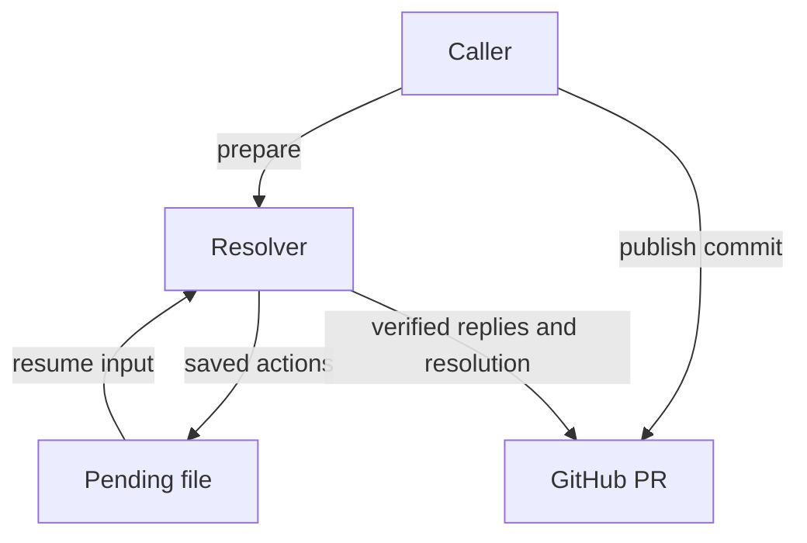
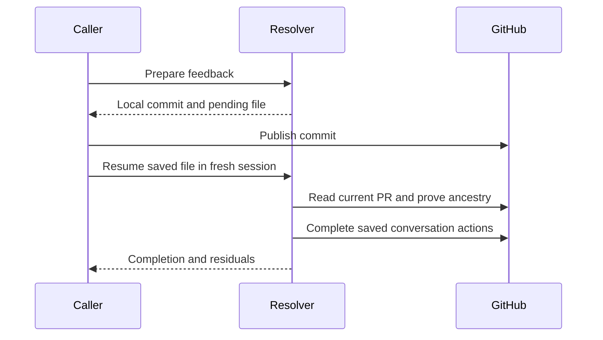
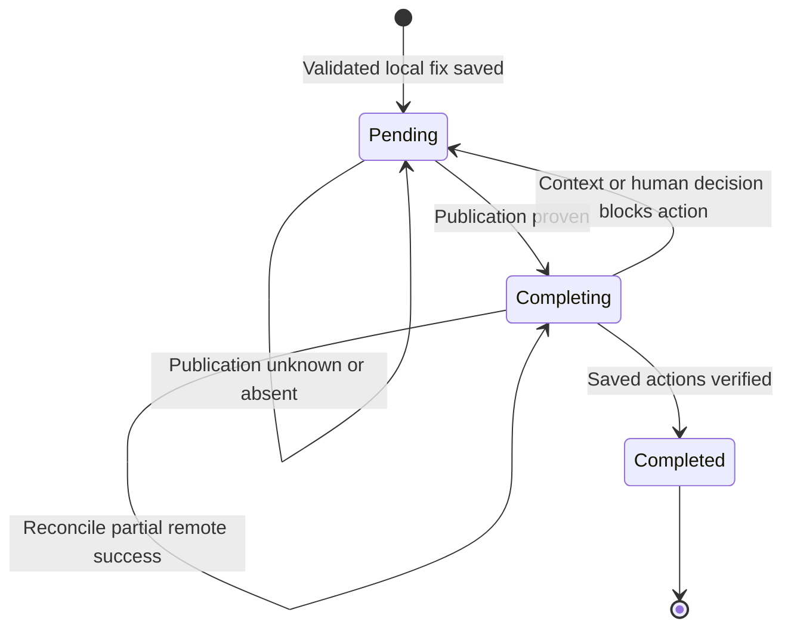
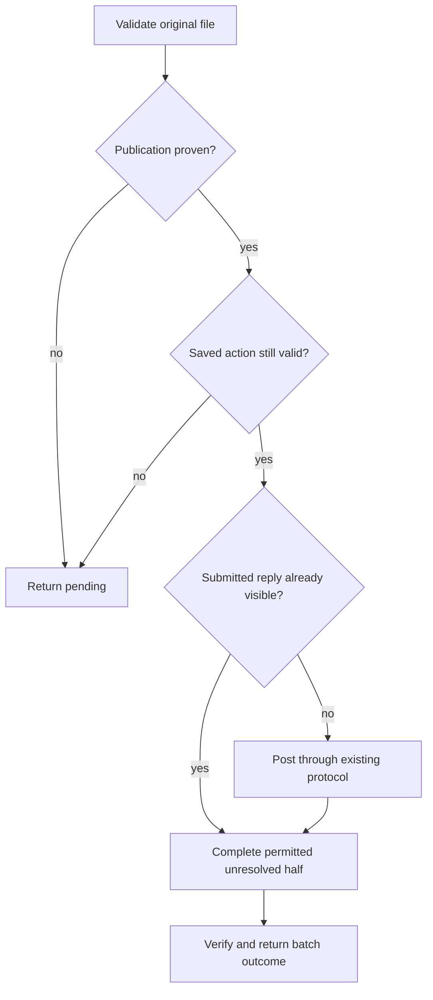

# Resolver Caller-Owned Publication - Plan

## Goal Capsule

- **Objective:** Orchestrators that publish fixes after the agent session can still finish the PR's review conversations accurately.
- **Means:** Add a local preparation handoff and a saved-batch completion invocation to `ce-resolve-pr-feedback` (KTD1).
- **Authority:** Product behavior belongs to the R-IDs; technical mechanisms belong to the KTDs. The repository's active instructions and the user's directions take precedence.
- **Execution profile:** Three sequential units on the current feature branch. Track execution outside this document.
- **Stop conditions:** Surface evidence that contradicts the publication or completion contract; do not claim completion from an unknown remote state.
- **Finishing and landing:** Implement and verify the scoped fix. Repository conventions govern any subsequent commit or PR; publication of this repository change is separate from the resolver's publication handoff.

---

## Product Contract

### Summary

Add `mode:return-to-caller` to prepare validated local fixes and return saved feedback actions without pushing.
After the caller publishes, `mode:resume` completes those actions through the resolver's existing GitHub protocol.
A batch requiring no new code changes can finish its conversation immediately.

### Problem Frame

[Issue #1809](https://github.com/EveryInc/compound-engineering-plugin/issues/1809) describes an orchestrator whose post-session hook owns publication.
The resolver currently owns commit, push, reply, and resolution, so failed publication stops the conversation tail.
That ordering protects reviewers from completion claims about unpublished fixes; the missing capability is transferring publication ownership while retaining a usable completion path.
A push-only hook needs a subsequent resolver invocation to finish the conversation.

### Key Decisions

- **Separate publication from conversation completion.** Preserve the intentional publication prerequisite. Governs R1, R2, R4. (session-settled: user-approved — chosen over replying and resolving after a local commit: reviewers must be able to inspect the fix)
- **Keep conversation completion inside the resolver.** The caller schedules the stages and publishes the commit. Governs R3, R5. (session-settled: user-approved — chosen over exporting a GitHub protocol for each caller to implement: the resolver already owns visibility, draft-review, and resolution safeguards)

### Requirements

**Preparation and ownership**

- R1. `mode:return-to-caller` runs unattended under the caller's existing authority, validates and commits fix-owned changes, and never pushes.
- R2. A batch that creates a fix defers all of its completion-dependent GitHub writes, including replies, resolutions, and PR findings-checklist ticks, until publication is verified.
- R3. The preparation result provides a persistent pending file and structured caller result sufficient for a fresh resolver to finish the judged batch without the original transcript.

**Completion and recovery**

- R4. Resume may finish a fix batch only when fresh remote evidence proves its recorded commit is reachable from the current head of the recorded PR; absent or uncertain proof leaves the batch pending without completion writes.
- R5. Resume completes only saved actions using the existing visible-submitted-reply and authoritative-resolution protocol, without repeating judgment, edits, validation, commits, or pushes.
- R6. Retry reconciles authoritative remote state before repeating a write; human decisions and feedback whose changed context invalidates the saved action remain open and are returned to the caller.

**Compatibility**

- R7. Ordinary and pipeline execution retain their current ownership and behavior, both full and targeted scopes remain available, and no-change batches retain immediate conversation completion.

### Acceptance Examples

| ID | Scenario | Expected outcome | Covers |
|---|---|---|---|
| AE1 | A mixed fix, reply-only, and needs-human batch runs with push unavailable | Local commit and saved batch; no push or completion writes; typed human residuals returned | R1-R3, R6 |
| AE2 | A fresh resolver receives the saved file before the fix is published | Pending result; no conversation mutation | R3-R4 |
| AE3 | The caller publishes the recorded fix and then an additional commit | Resume completes the saved actions without editing or committing | R4-R5 |
| AE4 | A process exits after a submitted reply reaches GitHub but before its checkpoint is saved | Retry adopts the visible reply and completes the unresolved half without another POST | R5-R6 |
| AE5 | New unrelated feedback arrives between preparation and completion | Resume reports it for a separate pass and completes only its saved batch | R5 |
| AE6 | Targeted feedback needs only an explanation | Immediate existing reply/resolve behavior and a structured completed result | R7 |

### Scope Boundaries

This change is confined to the resolver's execution modes, saved record, documentation, and validation.
Existing `lfg` and babysitter pipeline consumers require no migration.

**Considered and not built:**

- Automatic commit translation after rebase or squash: the recorded SHA must remain published; absent ancestry is visible and recoverable by preparing a new batch.
- Concurrent consumers, locks, and leases: one coordinator owns each record; there is no current concurrent-writer requirement.
- A general orchestration framework or shared return-envelope migration: the resolver's saved conversation tail is the specific missing contract.
- An automatic watcher or third-party hook integration: callers already own scheduling; this feature supplies the resumable stage they can schedule.

Ordinary failed-push recovery is adjacent work and is not a prerequisite for this mode.

---

## Planning Contract

### Key Technical Decisions

- KTD1. **Separate execution mode from feedback scope.** Add `mode:return-to-caller [PR reference] [handoff:<path>]` and `mode:resume handoff:<path>`; resume derives its PR from the saved record. Invalid or conflicting mode arguments stop before work. This implements R1, R3, R5, R7 and inherits the two session-settled decisions above.
- KTD2. **Use a versioned JSON file passed by path.** A caller-supplied path is checked before preparation and created without overwriting an existing record; otherwise allocate a private OS scratch file and preserve it for caller retention. Preparation is complete only after the saved record is readable; a failed save reports the actual local commit and incomplete handoff. The structured result names its exact location, outcome, recorded commit, verification, and residuals. This implements R3 and follows `docs/solutions/skill-design/prose-cannot-validate-caller-control-data-byte-for-byte.md`.
- KTD3. **Keep deterministic record and publication mechanics in one bundled Python helper.** The helper reads the original file bytes, validates control fields, and performs read-only GitHub inspection. Use fresh PR metadata and compare the saved SHA against the actual head repository's current SHA; require a positive ancestor result. It never posts or resolves. This implements R3-R4 and follows the official [GitHub compare contract](https://docs.github.com/en/rest/commits/commits#compare-two-commits), which supports SHAs and fork networks.
- KTD4. **Reuse the existing resolver-owned remote tail.** Resume routes saved actions through the full-mode reply/resolve protocol instead of copying its commands into a second reference. It bypasses the new-feedback fix loop and reconciles visible replies independently of resolution. This implements R5-R6 and follows `docs/solutions/skill-design/skill-gates-state-conditions-not-prescribed-git-commands.md`.
- KTD5. **Save exact action content and stable source identity.** The record carries PR host/base identity, actual head repository/ref, combined fix SHA, validation outcome, each covered source's kind/ID/URL and original body fingerprint, root/thread identity where applicable, verdict, reply body, resolution intent, human residuals/invariant keys, intended checklist closeout, and optional observed reply IDs/progress. Remote evidence overrides local progress. This implements R3, R5-R6; class fixes retain every covered feedback ID.
- KTD6. **Keep semantic judgment in the resolver.** Fresh source context that makes an old reply or resolution invalid becomes pending caller work, rather than a new fix pass. Missing permissions, unavailable publication evidence, and pending human drafts retain the existing safe failure direction. This implements R4-R6; schema validation is not a substitute for fresh context.

JSON is a narrow implementation choice for the saved contract, not an unsettled architectural alternative requiring a bake-off.
Helper subcommands and optional checkpoint field names can be chosen during implementation while preserving these decisions.

### High-Level Technical Design

**Component ownership (R1, R3, R5):**

**Protocol across sessions (R2-R5):**

**Batch lifecycle (R4-R6):**

**Resume decisions (R4-R6):**

**Mode and scope interface (KTD1):**

| Execution | Feedback scope | Fix stage | Completion stage |
|---|---|---|---|
| Ordinary | Full or targeted | Existing commit and push | Existing immediate tail |
| Pipeline | Full or targeted | Existing unattended commit and push | Existing unattended tail |
| Return-to-caller, with fixes | Full or targeted | Local validation and commit | Saved for caller publication and resume |
| Return-to-caller, no changes | Full or targeted | No commit | Existing immediate tail |
| Resume | Saved batch only | None | Publication proof and saved tail |

### Risks and Dependencies

The new mode depends on a caller retaining the pending file and scheduling completion after publication.
Temporary storage is not a promise of indefinite retention; a caller that spans machine lifetimes supplies or copies to its own persistent location.

GitHub can acknowledge a reply before a local checkpoint is updated.
KTD4's reconciliation must handle that interruption, including non-thread feedback, rather than equating an absent local reply ID with an absent remote reply.
Single-coordinator ownership is assumed; current helpers do not make a multi-write remote sequence atomic.

A descendant head proves the recorded commit was published, not that later code preserved its meaning.
If fresh feedback or PR context invalidates the saved response, R6 governs; this change adds no automatic revalidation or commit-rewrite inference.

---

## Implementation Units

### U1. Prepare and preserve a caller-owned batch

**Goal:** Provide the local preparation mode and a replayable saved contract.
**Requirements:** R1-R3, R7; KTD1-KTD2, KTD5.
**Dependencies:** None.
**Files:** `skills/ce-resolve-pr-feedback/SKILL.md`, `references/full-mode.md`, `references/targeted-mode.md`, new `references/return-to-caller.md` and `scripts/pending-feedback.py` beneath that skill; new `tests/skills/ce-resolve-pr-feedback-pending.test.ts`.
**Approach:**

1. Update the entrypoint's argument contract, mode routing, authority, and mode-specific done condition.
2. Bring touched commit/publication and checklist-transition blocks to the authoring standard, preserving their existing ordinary/pipeline paths.
3. Define the KTD5 record and implement original-byte validation plus safe record creation/checkpointing at the owning helper.
4. Return machine-readable pending/completed outcomes and caller retention/completion responsibilities through the new reference.

**Patterns:** `ce-debug`'s local committed return, the resolver's flatten-safe script anchoring, and existing Python atomic-state helpers.
**Test scenarios:**

- Covers AE1. A code batch produces one combined local commit and a validated saved record with no push or completion writes.
- Class feedback spanning multiple IDs and mixed source kinds round-trips exact multiline replies and human payloads.
- Malformed JSON, unsupported schema, invalid control fields, and an existing supplied destination fail before their associated work or writes.
- Covers AE6. Full/targeted no-change paths finish immediately; ordinary/pipeline retain their existing shipping ownership.

**Verification:** The helper tests exercise actual bundled code; fresh-agent evidence verifies preparation restraint and usable artifacts.

### U2. Complete the saved batch after verified publication

**Goal:** Make a fresh resolver finish saved actions safely and retryably.
**Requirements:** R3-R6; KTD3-KTD6.
**Dependencies:** U1.
**Files:** New `skills/ce-resolve-pr-feedback/references/resume.md`; the skill's entrypoint, full-mode reference and pending helper from U1; `tests/skills/ce-resolve-pr-feedback-pending.test.ts`, existing script-dir and reply-newlines tests.
**Approach:**

1. Add helper publication inspection against the saved PR and fresh actual head metadata, preserving host and fork identity.
2. Route resume into the owning tail with saved verdicts/actions, authoritative identity lookup, and remote reconciliation.
3. Persist verified progress and return completed, pending, or human-decision residuals; expose newly observed feedback without entering the fix loop.

**Execution note:** Characterize failed/partial remote operations with fake `gh` before modifying the fragile conversation seam.
**Test scenarios:**

- Covers AE2-AE3. An absent or diverged SHA refuses completion; identical and descendant heads permit it, including fork and Enterprise identities.
- API failure or unavailable ancestry proof remains pending with no completion writes.
- Covers AE4. Retry after POST success before checkpoint, and after reply success before resolve, sends no duplicate reply.
- Submitted-vs-pending visibility, authoritative thread mapping, needs-human records, and non-thread replies preserve current safeguards.
- Covers AE5. New unrelated feedback is returned for a separate pass; an unchanged root receiving a new related objection that invalidates the saved response stays pending.

**Verification:** Publication tests reject uncertainty; fresh-session resume logs show only the saved remote tail and verified completion.

### U3. Document and prove the complete handoff

**Goal:** Make the new interface discoverable and demonstrate the intended behavior across hosts.
**Requirements:** R1-R7.
**Dependencies:** U1, U2.
**Files:** `docs/guides/ce-resolve-pr-feedback.md`, its catalog description if needed, relevant resolver coverage in `tests/skill-eval-cell/catalog.ts`, and a disposable fixture under `tests/skill-eval-cell/fixtures/`.
**Approach:** Document preparation, caller publication, resolver resume, retention, and stage-specific completion. Add focused scenarios that exercise real bundled scripts and saved artifacts, then run fresh Claude/Codex injections.
**Test scenarios:**

- Covers AE1-AE3. Preparation and completion run in separate sessions; the consumer gets the saved record rather than the producer's transcript.
- Covers AE4-AE5. Interruption recovery and newly arriving feedback preserve saved scope.
- Covers AE6. No-change, targeted, ordinary, and pipeline controls retain existing behavior.
- A paired baseline/current preparation scenario discriminates the formerly absent mode rather than instructing both versions to comply.

**Verification:** Report actual mutation/artifact evidence and separate mechanical results from behavioral outcomes.

---

## Verification Contract

- Iterate with affected `bun test` files, including existing resolver pagination, script-directory, and reply-newline coverage plus the pending helper test.
- Run `bun run test` and `bun run release:validate` after implementation; run `bun run plugin:validate` when the installed validator is available.
- Run fresh on-disk skill injection on Claude and Codex through `bun run test:skill-eval-cell` or named `test:skill-eval-pack` rows. Use disposable repositories and fake `gh` fixtures; assert surviving files and mutation logs.
- At least one paired pre/current scenario must show that the new mode changes behavior. Two passing answer-only responses do not establish the fix.
- Apply repo-local `ce-skill-work` throughout skill authoring. Run `ce-simplify-code` at the required implementation checkpoint before the first review; apply the repository's normal review process to the final diff.

---

## Definition of Done

- U1 exposes preparation, preserves fix ownership, and returns a validated usable record.
- U2 proves publication and finishes or accurately returns pending saved actions with retry evidence.
- U3 documents the public interface and supplies fresh two-session evidence on both required hosts, or names a precise unavailable-route limitation.
- R1-R7 are covered by mechanical and behavioral evidence appropriate to their owning layer.
- Required mechanical gates pass; any unrelated failure is identified independently.
- Existing modes, reply visibility, human draft protection, and authoritative thread resolution remain intact.
- The diff contains no abandoned experiments, generated eval output, release-owned version changes, or unrelated cleanup.
