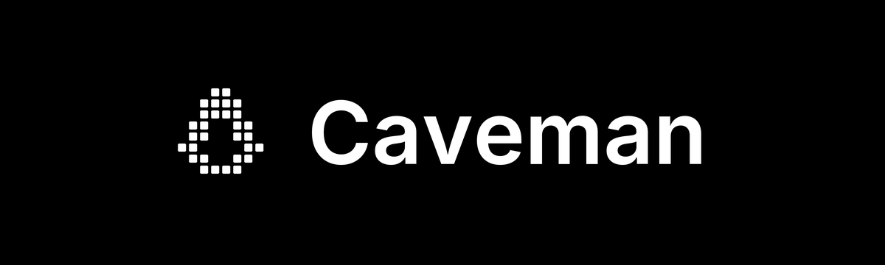
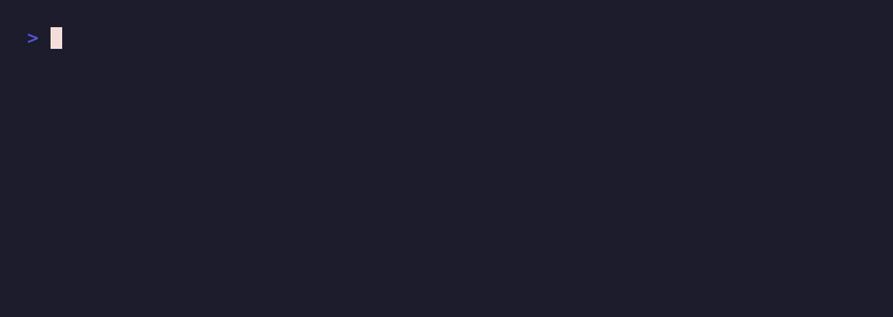
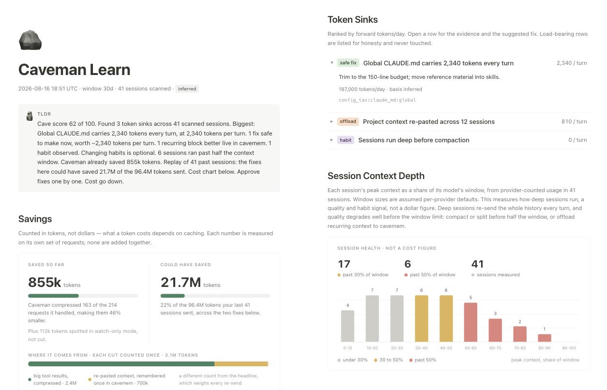

<div align="center">



# why use many token when few do trick

**Your AI coding agent bills by the word and writes like it knows that. Caveman make it stop.**

<a href="https://www.youtube.com/watch?v=L29q2LRiMRc">
  
</a>

▶️ **[ThePrimeagen reacts: "No way this actually works"](https://www.youtube.com/watch?v=L29q2LRiMRc)**

<a href="https://github.com/JuliusBrussee/caveman/stargazers"></a>
<a href="https://www.npmjs.com/package/@caveman-ai/cli"></a>
<a href="https://www.npmjs.com/package/@caveman-ai/middleware"></a>
<a href="https://pypi.org/project/caveman-middleware/"></a>
<a href="./INSTALL.md"></a>
<a href="#wrap-any-agent"></a>
<a href="#-license"></a>
<a href="https://skills.sh/JuliusBrussee/caveman"></a>

🏆 **#1 on GitHub Trending · July 2026** &nbsp;·&nbsp; 🥇 **#1 Repository of the Day on [Trendshift](https://trendshift.io/repositories/25391) · April 2026**

**[#1 on Hacker News](https://news.ycombinator.com/item?id=47647455)** · 904 points · 366 comments &nbsp;·&nbsp; **[#8 Product of the Day](https://www.producthunt.com/products/caveman)** on Product Hunt

📄 Cited in **[CAVEWOMAN](https://arxiv.org/abs/2606.24083)**, an Adobe Research paper that measured caveman-style output cutting cost **1.4 to 2.4×, up to 3×** &nbsp;·&nbsp; 🧪 Tested by **[JetBrains](https://blog.jetbrains.com/ai/2026/07/speak-to-ai-agents-like-cavemen-tosave-tokens/)** on 86 real coding tasks: *"costs you nothing measurable in quality"*

<a href="https://www.producthunt.com/products/caveman?embed=true&amp;utm_source=badge-featured&amp;utm_medium=badge&amp;utm_campaign=badge-caveman-2" target="_blank" rel="noopener noreferrer"></a>
<a href="https://trendshift.io/repositories/25391?utm_source=repository-badge&amp;utm_medium=badge&amp;utm_campaign=badge-repository-25391" target="_blank" rel="noopener noreferrer"></a>

⚡ **One command, no account, no API key.** `npx skills add JuliusBrussee/caveman -g` **[→ Quick Start](#-quick-start)**

</div>

---

<div align="center">

**[See it](#-see-it) · [Quick Start](#-quick-start) · [The Numbers](#-the-numbers) · [How it compares](#-how-it-compares) · [In the Wild](#-in-the-wild) · [The Skill](#-the-skill-unpacked) · [The Proxy](#-the-proxy-unpacked) · [Wrap](#wrap-any-agent) · [Your own app](#-caveman-in-your-own-app) · [When to Skip](#-when-to-use--when-to-skip) · [Docs](./docs/README.md)**

</div>

---

## 🪨 See it

<table>
<tr>
<th width="50%">🗣️ Normal agent · 69 tokens</th>
<th width="50%"> Caveman agent · 19 tokens</th>
</tr>
<tr>
<td valign="top">

> The reason your React component is re-rendering is likely because you're creating a new object reference on each render cycle. When you pass an inline object as a prop, React's shallow comparison sees it as a different object every time, which triggers a re-render. I'd recommend using useMemo to memoize the object.

</td>
<td valign="top">

> New object ref each render. Inline object prop = new ref = re-render. Wrap in `useMemo`.

</td>
</tr>
</table>

Same diagnosis. Same fix. Same `useMemo`. The only thing that died was the throat-clearing.

Code, commands, file paths, and exact error messages never get cavemanned. Only the prose around them does. Security warnings and "are you sure?" confirmations come back in full sentences on their own, then caveman resumes.

Caveman no make brain smaller. Caveman make *mouth* smaller.

> Half the fun is that your agent talks like it just discovered fire. The other half is that it is still right.

---

## 🌍 Why this exists

A token is what AI billing counts, roughly three quarters of a word. Your agent pays for every token it **writes** and every token it **reads**. Most agents write like a cover letter and read like a firehose.

Caveman attacks both ends, in the agent you run and in the one you build:

- **The skill** shrinks what the agent *says*. One rule file. Free forever. Works in 30+ agents.
- **The proxy** shrinks what the agent *reads*: logs, test output, JSON, diffs, search results. Runs on your machine. Every squeezed byte gets a backup, so the agent can always pull the original back.
- **The middleware** does the same inside *your own code*: one wrapper around the LangChain, Vercel AI SDK, OpenAI, or Anthropic call you already make. Tool results get shrunk before the model sees them, the original stays in your history, and the model can fetch it back.

Started as a joke on a Friday in April 2026. Hit 4,000 stars in a week. Now past 100,000, with a research paper, a JetBrains lab test, and a Primeagen reaction video. The joke got serious. The voice did not.

---

## ⚡ Quick Start

Caveman come in two sizes. Start small.

### Small rock: the skill

A rule file that makes your agent answer in caveman. MIT, free forever, works in [30+ agents](./INSTALL.md) (Claude Code, Codex, Gemini, Cursor, Windsurf, Cline, Copilot, more). One command:

```bash
npx skills add JuliusBrussee/caveman -g
```

Type `/caveman` if your agent doesn't wake up on its own. That the whole install. One rock.

### Big rock: the proxy

Runs on your machine, between your agent and the AI provider, and shrinks what the agent *reads* before every call. MIT CLI, BSL-1.1 runtime:

```bash
npm install -g @caveman-ai/cli && caveman setup --install
caveman claude        # or codex · gemini · aider · kilo · qwen · opencode · hermes · openclaw · pi
```

### Your own app: the middleware

Building an agent in code instead of running one in a terminal? Same shrinking, one wrapper around the call you already make. MIT client, alpha today:

```bash
npm install @caveman-ai/middleware @caveman-ai/sdk        # TypeScript, plus your framework (ai, openai, …)
pip install 'caveman-middleware[langchain]' caveman-sdk   # Python 3.13+, swap the extra for your framework
```

Six lines of code and a local runtime. [Full walkthrough below](#-caveman-in-your-own-app).

They stack. Most people start with the small rock and graduate.

<details>
<summary><strong>More doors into the cave</strong> · full installer, Windows, single agents, uninstall</summary>

<br>

The full installer wires up Claude Code hooks and the statusline badge, finds every supported agent on your machine, and skips agents you no have. Safe to re-run. Needs Node.js 22.13+.

```bash
curl -fsSL https://raw.githubusercontent.com/JuliusBrussee/caveman/v2.7.0/install.sh | bash
```

Windows, PowerShell 5.1+:

```powershell
irm https://raw.githubusercontent.com/JuliusBrussee/caveman/v2.7.0/install.ps1 | iex
```

Just one agent:

```bash
# Claude Code
claude plugin marketplace add JuliusBrussee/caveman && claude plugin install caveman@caveman

# Gemini CLI
gemini extensions install https://github.com/JuliusBrussee/caveman

# Oh My Pi (OMP)
npx -y github:JuliusBrussee/caveman -- --only omp

# Qwen Code CLI, then its Caveman wrapper
npm i -g @qwen-code/qwen-code
caveman qwen

# Codex, Cursor, Windsurf, Cline, and other skills-compatible agents
npx skills add JuliusBrussee/caveman --skill '*' -a codex --yes -g  # replace codex with your agent profile
```

**Install broke?** Open your agent in this repo and say: *"Read CLAUDE.md and INSTALL.md, install caveman for me."* Agent read repo, agent fix own brain. Snake eat tail.

Changed your mind: `npx -y github:JuliusBrussee/caveman -- --uninstall`

</details>

The full 30+ agent matrix, dry runs, flags, and verification live in [INSTALL.md](./INSTALL.md).

### 🕐 The first five minutes

**Small rock.** The skill, right after `npx skills add`:

1. **Ask it something.** Any coding question. Watch the preamble vanish and the answer stay.
2. **Turn the dial.** `/caveman lite` for tight-but-polite. `/caveman ultra` for grunts. `/caveman wenyan` for classical Chinese, because someone asked.
3. **Commit like a caveman.** `/caveman-commit` writes a Conventional Commit in one line.
4. **Review like a caveman.** `/caveman-review` gives one finding per line: `L42: 🔴 null deref. Guard it.`
5. **Shrink your memory files.** `/caveman-compress CLAUDE.md` cuts the prose, keeps every heading, path, and command, and backs up the original.
6. **Come home.** Say `stop caveman`. Normal prose returns. No hard feelings.

**Big rock.** The proxy, right after `npm install -g @caveman-ai/cli`:

1. **Find out where your tokens go.** `caveman learn` reads months of agent history already on your disk, locally, and ranks your token sinks worst-first with a one-line fix behind each. Do this before anything else. It is the most useful five minutes in this README.
2. **Let it fix them.** `caveman learn implement` hands each fix to Claude Code or Codex one diff at a time, applied only on your yes, and reverts anything that did not lower tokens per turn.
3. **Wrap your agent.** `caveman claude` (or `codex`, `gemini`, `aider`, `opencode`, `pi`, …) puts the proxy in front of it. Logs, test output, JSON, and diffs get shrunk before the provider sees them. Originals stay on disk, and the agent can pull any of them back.
4. **Shrink the noisy stuff.** `caveman shrink -- pnpm test` compresses command output. `caveman browse <url>` gives the agent a compressed view of a web page instead of a 15,000-token accessibility dump.
5. **Prove it on your own work.** `caveman trial -- claude` runs a real session with and without caveman, then `caveman trial report` shows the difference. That A/B outranks every number on this page. A trial needs its own proxy, so if you already did step 3 it will tell you to run `caveman disable claude` first, and `caveman enable claude` after. Caveman rather say "cannot measure this" than hand you a report full of zeros.
6. **Shrink caveman itself.** `caveman convert --dry-run` shows which installed skills get cheaper as PNG pages the model reads as an image. Convert the profitable ones, revert byte-for-byte any time.
7. **Watch the bill.** `caveman stats` for history and estimates. `/caveman-stats` inside Claude Code for that session.

---

## 📊 The Numbers

Every number below is either from a committed run in this repo or from a named third party. Nothing rounded up. Where a number is small, it says so. Where a row is red, it stays red.

### What the skill saves (writing less)

| Who measured | What they measured | Result |
|---|---|---|
| **[Adobe Research](https://arxiv.org/abs/2606.24083)** (CAVEWOMAN, arXiv 2606.24083) | Eight models, five datasets, five compression levels | Output-side caveman style cuts realized cost **1.4 to 2.4× per model, up to 3×** in the best case |
| **[JetBrains](https://blog.jetbrains.com/ai/2026/07/speak-to-ai-agents-like-cavemen-tosave-tokens/)** | 86 real coding tasks, paired A/B, Claude Code 2.1.200. **Skill only, no proxy** (July 2026, before the proxy existed) | **8.5% fewer output tokens**, about 10% cost. **No detectable quality change** (sign test p = 0.82) |
| **This repo** ([committed eval snapshot](./evals/README.md)) | Ten dev questions, skill vs a plain `Answer concisely.` control, claude-opus-4-6 | **50% fewer output tokens at the median** on top of the terse control. Length only, not correctness |

Read those three together and you get the honest picture. Chat-style Q&A: big cut. Agentic coding sessions, where most tokens are code and tool calls that the skill never touches: high single digits on output, quality flat.

**The JetBrains number is why the proxy exists.** They measured the skill alone, in July 2026, before the proxy shipped. Their finding was that an agent's bill is mostly *reading*, not writing, and no talking style fixes that. So we built the thing that shrinks the reading. The table below is what that changed.

The Adobe paper's other finding matters too: compressing the *human's* prompt into caveman-speak makes models answer longer and worse. Caveman never rewrites your prompts. Only the agent's mouth.

The rules add input tokens on every call, and whether shorter output pays for them depends on your agent, caching, and billing. Full accounting: [docs/HONEST-NUMBERS.md](./docs/HONEST-NUMBERS.md).

<!-- BENCHMARK-TABLE-START -->
No reviewed API benchmark result is published here yet. Run
`uv run python benchmarks/run.py` to generate a new result, then review its raw
response pairs and quality before publishing the generated table.
<!-- BENCHMARK-TABLE-END -->

### What the proxy saves (reading less)

Your agent rereads logs, test output, diffs, and half your repo all day. The proxy shrinks that stream before it reaches the provider. Pinned 54-run Claude Code benchmark, provider-reported input tokens, three runs per case, every answer checked against an exact oracle:

| Case                   | Direct Claude Code | Through caveman | Change     |
| ---------------------- | -----------------: | --------------: | ---------: |
| CSV outlier hunt       | 165,823            | 74,484          | -55.1%     |
| Log needle in haystack | 148,807            | 74,068          | -50.2%     |
| YAML config drift      | 132,124            | 71,027          | -46.2%     |
| Test output failure    | 150,377            | 108,514         | -27.8%     |
| Deployment JSON drift  | 147,975            | 108,939         | -26.4%     |
| Dashboard HTML alert   | 140,687            | 154,641         | **+9.9%**  |
| **Total**              | **885,793**        | **591,673**     | **-33.2%** |

**18 of 18 answer checks passed.** Case-clustered 95% interval: 14.6% to 48.5%. In the same suite, Headroom's wrap saved 6.7% and failed 3 of 18 checks. Method, provenance hashes, and limits: [docs/WRAP-BENCHMARK.md](./docs/WRAP-BENCHMARK.md). Raw harness artifacts are not in this checkout, so treat it as a pinned report, not a public reproduction.

> **Maintainer note.** The HTML row is red and it stays red. That case had no compression transform, so caveman paid its own overhead and won nothing back. The day I hide a red row is the day you should stop trusting the green ones.

### Everything else caveman shrinks

| Surface | Measured | Number |
|---|---|---|
| **Browser pages** | Focused question against a 200-row table, vs the Playwright ARIA snapshot | **121 tokens vs 15,704. 129.8× smaller.** Tiny forms lose 2.3×; the [benchmark](./browse/BENCHMARK.md) says so |
| **Memory files** (`/caveman-compress`) | Five real `CLAUDE.md`-style fixtures | **46% smaller on average**, headings, code, paths, and URLs verified intact |
| **The skill itself** (pixel mode) | Rendered to PNG pages the model reads as an image | **1,069 to 415 estimated tokens, a 61% cut** |
| **Your harness prefix** (`subagent-tax`) | What every subagent re-sends before doing any work | On one real machine, **219k of a 267k-char request was tool schemas**. Run it on yours |

---

## 🧮 How it compares

Many tool in valley promise small token. They work at different layers, so first what each one touches, then what got measured. Every quote below is from that tool's own README or GitHub page on 2026-09-19.

### What each one touches

| Tool | What it shrinks | Get the original back? | Phones home |
|---|---|---|---|
| **Caveman** | What the agent **says** (skill) and what it **reads**: tool output, logs, JSON, diffs, test output, web pages (proxy) | **Always.** Byte-exact original in local SQLite, one recovery handle | CLI: anonymous counts on by default, `caveman telemetry off`. Skill and hooks: never |
| **[RTK](https://github.com/rtk-ai/rtk)** | Shell command output only: `ls`, `cat`, `grep`, `git`, test runners. `Read` and `Grep` tool calls bypass it | When a command fails or gets cut short, or opt-in for successful runs | Off by default, opt-in |
| **[Headroom](https://github.com/headroomlabs-ai/headroom)** | Tool output, logs, files, and history, through a local proxy | Yes, reversible cache | On by default, `HEADROOM_BEACON=off` |
| **[context-mode](https://github.com/mksglu/context-mode)** | Tool output, run in a sandbox so raw data never enters context | Matching sections from a searchable index, not the whole thing back | Never |
| **[pxpipe](https://github.com/teamchong/pxpipe)** | Text context, re-rendered as images the model reads | **No.** "It is lossy." Misses are silent | Local log only |

### What the tin says, and who checked

| Tool | Says on the tin | Who checked, on what | Found |
|---|---|---|---|
| **Caveman** | Only what this page measures | This repo, pinned 54-run Claude Code suite, every answer checked against a known-right answer | **33.2% fewer input tokens, 18/18 answers right** |
| **Caveman**, skill only | | JetBrains, 86 real coding tasks, paired A/B | **8.5% fewer output tokens, quality flat** (sign test p = 0.82) |
| **RTK** | "cuts up to 90% of the bash output your agent reads". Their README adds: "it is not the same as cutting your bill by 90%" | JetBrains, same lab, same method, 86 tasks, 425 billed trials | **+7.6% median cost per task** at low reasoning effort (p = 0.004), +0.1% at high. Quality tie |
| **Headroom** | "20% fewer tokens for coding agents, 60-95% fewer tokens for JSON" | This repo, same 54-run suite as above | **6.7% fewer input tokens, 15/18 answers right** |
| **context-mode** | "315 KB becomes 5.4 KB. 98% reduction." | Own size numbers only. No quality check published | — |
| **pxpipe** | "~59–70% lower end-to-end bill" | Own SWE-bench runs | Lite 10/10 both arms. Pro 14/19 with, 15/19 without, and their rerun of the one split says run-to-run variance |

### Same suite, same model, same questions

The one place two of these tools ran side by side against the same known-right answers. Claude Code 2.1.223, claude-sonnet-5, Headroom 0.33.0, six agent-shaped workloads, three runs each, provider-reported input tokens:

| Arm | Answers right | Provider input tokens | vs direct | 95% interval |
|---|---:|---:|---:|---:|
| Direct Claude Code | 18/18 | 885,793 | baseline | |
| **Caveman wrap + skill** | **18/18** | **591,673** | **-33.2%** | **14.6% to 48.5%** |
| Headroom wrap | 15/18 | 703,202 on its 15 correct runs | -6.7% on those 15 | -0.7% to 17.9% |

Caveman used fewer tokens in 15 of the 18 paired runs. Headroom's 703,202 covers only the 15 runs it answered right, so its 6.7% is against those same 15 direct runs, not against the 885,793 total. Its three failed YAML runs stay in the table and count for nothing. Caveman's one red row, HTML at +9.9%, is in the per-case table above and stays red too. We ran this ourselves, and the raw harness artifacts are not published yet, so it is a pinned report, not something you can re-run from this repo. Method and hashes: [docs/WRAP-BENCHMARK.md](./docs/WRAP-BENCHMARK.md).

RTK, context-mode, and pxpipe were not in that run. RTK rewrites shell output, and this suite hands the agent its data through a tool call, not the shell, so RTK would have sat idle. Different layer, different test. Fair is fair on the rest: RTK's telemetry is opt-in and ours is opt-out, context-mode sends nothing anywhere, and pxpipe ran SWE-bench where we have not. Stack them if you like. Headroom's own README lists caveman as something it happily runs behind.

---

## 📣 In the Wild

<table>
<tr>
<td width="50%" valign="top">

**ThePrimeagen** · *"No way this actually works"*<br>
[Full reaction on The PrimeTime →](https://www.youtube.com/watch?v=L29q2LRiMRc)

**Adobe Research** · [CAVEWOMAN: How Large Language Models Behave Under Linguistic Input and Output Compression](https://arxiv.org/abs/2606.24083)<br>
Adeyemi, Rossi, Dernoncourt · arXiv, June 2026 · cites this repo. The style is now a benchmarked register.

**JetBrains** · [Speaking to AI Agents like Cavemen Saves 65% of Tokens. We Test.](https://blog.jetbrains.com/ai/2026/07/speak-to-ai-agents-like-cavemen-tosave-tokens/)<br>
The most rigorous outside A/B so far, run on the skill alone before the proxy existed. Their verdict: *"Use it if you like it. It is fun, and it costs you nothing measurable in quality."* Their 8.5% is the number that made us build the proxy.

</td>
<td width="50%" valign="top">

**Hacker News** · [#1, 904 points, 366 comments](https://news.ycombinator.com/item?id=47647455)

**The New Stack** · [Getting Claude Code to grunt in Caveman-speak might not save as many tokens as you think](https://thenewstack.io/caveman-mode-token-savings/)<br>
Fair headline. We link it anyway. See [The Numbers](#-the-numbers).

**GitHub Trending** · #1 overall, July 2026<br>
**Trendshift** · #1 Repository of the Day (April 2026) · #1 JavaScript repo of the month (April) · #1 Go repo of the month (July)

**Product Hunt** · #8 Product of the Day

</td>
</tr>
</table>

[](https://star-history.com/#JuliusBrussee/caveman&Date)

---

## 💬 The skill, unpacked

One rule file, one talking style, plus a small toolbox. `/caveman lite|full|ultra|wenyan-lite|wenyan-full|wenyan-ultra` sets intensity. `/caveman off` or `normal mode` turns it off.

| Level | Same question: "Why does my React component re-render?" |
|---|---|
| **lite** | Your component re-renders because you create a new object reference each render. Wrap it in `useMemo`. |
| **full** *(default)* | New object ref each render. Inline object prop = new ref = re-render. Wrap in `useMemo`. |
| **ultra** | Inline obj prop, new ref, re-render. `useMemo`. |
| **wenyan-full** | 每繪新生對象參照，故重繪；以 useMemo 包之則免。 |

Three things the skill will never do: shorten your code, paraphrase an error message, or grunt through a security warning. It drops to full sentences for anything irreversible, then picks the club back up.

<details>
<summary><strong>Everything in the box</strong> · commit messages, reviews, subagents, work patterns</summary>

<br>

| Tool / command                                                                                                                                  | What you get                                                                                                                |
| ----------------------------------------------------------------------------------------------------------------------------------------------- | --------------------------------------------------------------------------------------------------------------------------- |
| `/caveman [lite\|full\|ultra\|wenyan-lite\|wenyan-full\|wenyan-ultra\|off]`                                                                     | Shorter replies at the intensity you choose.                                                                                |
| `cavecrew-investigator`, `cavecrew-builder`, `cavecrew-reviewer`                                                                                | Compressed subagent presets for locating, editing, and reviewing code.                                                      |
| `/caveman-commit`                                                                                                                               | Terse Conventional Commit messages.                                                                                         |
| `/caveman-review`                                                                                                                               | One-line, actionable review findings.                                                                                       |
| `/caveman-compress <file>`                                                                                                                      | Smaller Markdown memory files, with the original backed up.                                                                 |
| `/caveman-stats`                                                                                                                                | Recorded Claude Code token usage; savings unknown without a measured comparison.                                            |
| `/caveman-help`                                                                                                                                 | One-screen reminder of every mode and command.                                                                              |
| `investigate-first`, `lean-build`, `surgical-patch`, `safe-refactor`, `migration`, `verify-and-stop`                                            | Work patterns that write less code, so the agent bills fewer tokens. Your agent picks these up on its own when a task fits. |
| `/caveman-setup`, `/caveman-discover`, `/caveman-learn`, `/caveman-manage`, `/caveman-optimize`, `/caveman-explore`, `/caveman-evidence-review` | Drive the caveman engine and proxy: set it up, find where tokens go, act on what it finds.                                  |

</details>

---

## 🔧 The proxy, unpacked

One local process. Your agent talks to it, it talks to your provider. No Caveman server in the path, and your Claude Pro/Max login passes through to Anthropic untouched. Originals of everything it compresses sit in a SQLite file on your machine with a recovery handle, so the agent can always ask for the full version back.

```
 Your agent  (Claude Code · Codex · Gemini · Aider · opencode · Pi · …)
      │   tool output · logs · JSON · diffs · search results
      ▼
 ┌────────────────────────────────────────────────────┐
 │  caveman proxy   (your machine, your keys)          │
 │  detect() → json · log · code · diff · search · text│
 │  originals → local SQLite, recovery handle returned │
 └────────────────────────────────────────────────────┘
      │   smaller prompt, same answer
      ▼
 Your provider  (Anthropic · OpenAI · Google · Bedrock · Vertex · Azure · OpenRouter)
```

**Whole team? One container.** Same proxy in your VPC, one shared token, keys stay on server. [Deploy it →](docs/technical/deploy.md)

<p align="center">
  
</p>

<details>
<summary><strong>What the engine keeps, by payload type</strong> · and the wrap stack diagram</summary>

<br>

<p align="center">
  
</p>

`detect()` types each payload and routes it to a compressor that keeps what answers depend on:

| Detected type   | Keeps                                                                  | Target savings |
| --------------- | ---------------------------------------------------------------------- | -------------- |
| `json`          | keys, structure, error/message subtrees; collapses repetitive arrays   | 70-90%         |
| `log`           | errors, stack traces, first/last lines; drops INFO and progress noise  | 85-95%         |
| `code`          | imports, signatures, types; elides function bodies, syntax stays valid | 40-70%         |
| `diff`          | file/hunk headers and changed lines; elides repeated context           | 60-80%         |
| `search-result` | top/bottom hits plus diagnostic/security hits                          | 80-95%         |
| `text` / HTML   | headings, opening/closing context, important sections                  | 50-80%         |

`contextwindow.Pack()` additionally fits candidate context into a token budget by BM25 relevance, recency, and error signal, returned in original order so chronology survives.

Any MCP host gets the same powers through five tools: `caveman_compress`, `caveman_retrieve`, `caveman_stats`, `caveman_toon_encode`, `caveman_toon_decode`.

</details>

### Where your tokens go

Months of your agent history already sit on your disk. `caveman learn` reads it, locally, read-only, no account, and ranks your token sinks worst-first with a one-line fix behind each.

```bash
caveman learn             # Claude Code + Codex + Gemini CLI + opencode; aider via CAVEMAN_AIDER_ROOT
caveman learn implement   # hand the fixes to Claude Code or Codex, one diff at a time, applied only on your yes
```

<p align="center">
  
</p>

`implement` re-measures after every change and reverts anything that didn't lower tokens per turn. Caveman never makes your agent dumber to make it cheaper.

### More verbs

```bash
caveman explore install         # read-only FastContext subagent: finds code as path:line
caveman shrink -- pnpm test     # compress noisy command output, byte-exact recoverable
caveman browse <url>            # local Chrome over a compressed a11y tree
caveman mem remember|recall     # durable memory; `mem recover <handle>` = original bytes
caveman trial -- claude         # A/B a real session, then `trial report` (needs `disable` first)
caveman toon encode|decode      # the TOON re-encoder, standalone
caveman stats                   # token history, API estimates, subscription equivalents
```

### Pixel mode

Caveman eating its own tail. Every skill you install is prompt text your agent reloads on every call. `caveman convert` renders the skill body to PNG pages in place, and the model reads it as an image. On the caveman skill itself: **1,069 to 415 estimated tokens, a 61% cut**.

```bash
caveman convert --dry-run        # every installed skill, with the token math, no writes
caveman convert --agent claude   # convert the profitable ones
caveman convert --revert         # byte-identical restore from SKILL.orig.md
```

Convert only fires when pages beat the text. Any failure leaves the skill byte-identical and names the gate that said no.

### Wrap any agent

`caveman <agent>` turns the proxy on for good and launches the agent. `caveman wrap <agent>` runs one session and leaves nothing behind. It never edits your config files.

| Agent                | Vendor           | How it's wrapped                                             |
| -------------------- | ---------------- | ------------------------------------------------------------ |
| **Claude Code**      | Anthropic        | env vars                                                     |
| **OpenAI Codex CLI** | OpenAI           | env vars (API key) · ephemeral `CODEX_HOME` (ChatGPT login)  |
| **Gemini CLI**       | Google           | env vars                                                     |
| **Aider**            | OpenAI/Anthropic | env vars                                                     |
| **Kilo Code**        | Kilo Code        | `KILO_CONFIG_CONTENT`, your `kilo.json` untouched            |
| **Qwen Code**        | QwenLM           | ephemeral system-settings overlay, source settings untouched |
| **opencode**         | sst              | inline config via env, your `opencode.json` untouched        |
| **Hermes Agent**     | Nous Research    | `--provider custom` + env                                    |
| **OpenClaw**         | OpenClaw         | ephemeral merged config, your config read-only               |
| **Pi**               | pi.dev           | bundled native extension, your `~/.pi` config untouched      |

<details>
<summary><strong>Fine print</strong> · tested versions, default loadout, SDK recipes</summary>

<br>

Tested against real sessions on **Hermes v0.18.0**, **OpenClaw 2026.6.11**, **Pi 0.84.2**, **Kilo Code 7.5.6** (the CLI, not the editor extension), and **Qwen Code 0.22.3**. Persistent shortcuts are journaled and reversible with `caveman disable <agent>`.

OpenClaw, for the record, is a lobster. Lobster claw still sharp. Lobster mouth now small.

The default wrap hands the agent the five MCP tools, the browse server when Chrome resolves, command-output shrink on Claude, opencode, Gemini, Hermes, and OpenClaw, and pixel mode on new skill installs. Codex skips the shrink hook because its runtime rejects the rewrite ([openai/codex#18491](https://github.com/openai/codex/issues/18491)). Turn pieces off in `~/.caveman-cloud/config.json`.

Agent not on the list, or building your own? Wrap one call natively with the [middleware](#-caveman-in-your-own-app), or point any provider SDK or framework (Vercel AI SDK, LangChain, LiteLLM, OpenAI Agents, CrewAI, PydanticAI) at the local proxy with a `baseURL` swap: [`integrations/recipes/`](./integrations/recipes/). New native agent is usually one JSON profile in [`agents/profiles/`](./agents/profiles/).

</details>

---

## 🧩 Caveman in your own app

The proxy shrinks what a coding agent reads. The middleware does the same thing for the agent *you* are building, in the framework you already use. One wrapper around one call. Before each provider request it swaps big tool results for a shorter copy and hands the model a `caveman_retrieve` tool, so the model can read the original back whenever the short copy is not enough. Your conversation history keeps every original byte. Your provider, your client, your retries, your streaming: untouched.

**TypeScript** (Vercel AI SDK shown):

```diff
+import { createMiddlewareRuntime } from "@caveman-ai/sdk/middleware";
+import { withCaveman } from "@caveman-ai/middleware/ai-sdk";
+
+const runtime = createMiddlewareRuntime({ endpoint: "http://127.0.0.1:8787", mode: "compress" });
+const scope = { namespace: "support", session_id: conversationId, branch_id: "main", cache_epoch: "0" };
+
-const result = streamText(options);
+const result = streamText(withCaveman(options, { runtime, scope }));
```

**Python** (LangChain shown):

```diff
+from caveman_cloud.middleware import MiddlewareRuntime, Scope
+from caveman_middleware.langchain import with_caveman_agent
+
+runtime = MiddlewareRuntime(endpoint="http://127.0.0.1:8787", mode="compress")
+scope = Scope("support", conversation_id, "main", "0")
+
-agent = create_agent(model=model, tools=tools)
+agent = create_agent(**with_caveman_agent({"model": model, "tools": tools}, runtime=runtime, scope=scope))
```

The runtime is the same local proxy from the big rock, started once beside your app:

```bash
npm install -g @caveman-ai/cli && caveman setup --install
CAVEMAN_MODE=compress caveman start     # binds 127.0.0.1:8787; plain `caveman start` only records
```

| | Frameworks with a native adapter |
|---|---|
| **TypeScript** `@caveman-ai/middleware` | Vercel AI SDK · OpenAI · Anthropic · Google GenAI · LangChain · Strands · Mastra · MCP |
| **Python** `caveman-middleware` | OpenAI · Anthropic · Google GenAI · LangChain + LangGraph · LiteLLM · Strands · Agno · CrewAI · PydanticAI · AutoGen · LlamaIndex · FastAPI · MCP |

Straight talk on the alpha: a runtime left in record mode measures and changes nothing, whichever mode the client asks for, so set both. Decision reports say what was replaced and why, and carry no token counters; provider usage is the only savings number that counts. Runtime unreachable means your original request goes through untouched, unless you opt into strict mode.

Docs: [middleware overview](https://docs.caveman.so/docs/sdk/middleware) · [Vercel AI SDK guide](https://docs.caveman.so/docs/sdk/middleware/vercel-ai-sdk) · [Python guide](https://docs.caveman.so/docs/sdk/middleware/python) · [every framework and version](https://docs.caveman.so/docs/sdk/middleware/frameworks) · [deploy beside your app](https://docs.caveman.so/docs/sdk/middleware/deployment) · package READMEs for [TypeScript](./packages/middleware/typescript/README.md) and [Python](./packages/middleware/python/README.md).

Rather not touch code? Point any SDK at the proxy with a `baseURL` swap instead: [`integrations/recipes/`](./integrations/recipes/).

---

## 🧭 When to use · when to skip

**Good fit if you** read your agent's answers more than you paste them somewhere, run long sessions full of logs and test output, or pay per token and want the reading side shrunk without changing your code.

**Skip it if you** are billed per request rather than per token (GitHub Copilot premium requests, for one: a shorter answer is the same request), or your workload is pure code generation with almost no prose to cut. The ruleset rides along as input tokens on every call (about 1,000 estimated for the full skill), and on terse one-liner Q&A that can cost more than it saves.

**Measure it yourself.** Run the same task with and without caveman and compare the provider's billing page. That A/B outranks every number on this page. If caveman loses on your workload, turn it off. Full list of where it loses: [docs/HONEST-NUMBERS.md](./docs/HONEST-NUMBERS.md).

---

## 🏔 The whole cave

One idea everywhere: **agent do more with less.**

| Repo                                                                  | What it shrinks                                          | Status            |
| --------------------------------------------------------------------- | -------------------------------------------------------- | ----------------- |
| **[caveman](https://github.com/JuliusBrussee/caveman)** *(you here)*  | What the agent **says** (skill), **reads** (proxy), and what **your own app** sends (middleware) | live |
| **[caveman-browse](https://github.com/JuliusBrussee/caveman-browse)** | What the agent **sees in the browser**                   | live              |
| **caveman-agent-sdk**                                                 | What your production agent **loads, calls, and spends**  | own repo · in dev |
| **[cavegemma](https://github.com/JuliusBrussee/cavegemma)**           | The compression **baked into weights** (Gemma fine-tune) | labs              |
| **[caveman-code](https://github.com/JuliusBrussee/caveman-code)**     | The **whole agent**, end to end                          | frozen            |
| **[cavemem](https://github.com/JuliusBrussee/cavemem)**               | What the agent **remembers**, across sessions            | frozen            |
| **[cavekit](https://github.com/JuliusBrussee/cavekit)**               | The **build loop**, spec-driven                          | frozen            |

Frozen ones still install and work. Their best ideas moved in here.

**Caveman make token small. Caveman Cloud make it *provable*.** Local numbers are `inferred`, pinned benchmarks `benchmark_counterfactual`, neither is an invoice. Live traffic behind eval gates with signed receipts earns `verified`. That's Cloud. **[Waitlist at caveman.so](https://caveman.so)**

---

## 🔒 Privacy, and a small favor

Your agent still talks to the provider you chose. The skill and hooks run entirely on your machine, and nothing here needs an account.

The `caveman` CLI does send anonymous usage stats by default, and here's the honest why: caveman is free, one person maintains it, and those stats are how I find out which commands people actually use and which optimizations run in real workflows. That's what keeps this thing free and pointed in the right direction. Fair trade, we think.

What it sends: which commands ran, plus token counts through and cut. What it never sends: your prompts, your code, your file paths, or anything that could identify you. It tells you all this the first time you run it.

Not into it? One command and it's off forever, no hard feelings:

```bash
caveman telemetry off      # or set DO_NOT_TRACK=1
```

Exact network, telemetry, and storage boundaries: [SECURITY.md](./SECURITY.md).

---

## 📜 License

Split license. Skill and adoption surfaces are [MIT](./LICENSE). Engine-linked runtime is BSL-1.1 source-available, not OSI Open Source before Change Date.

**MIT:** the skill, Agent SDK and initializer, the CLI, both client SDKs, contracts, provider catalog, extension shell, and the thin cavemem clients. Free like mammoth on open plain.

**BSL-1.1:** Engine, Proxy, Cache Engine, rewriter, Browse, MCP server, `shrink`, cavemem Go core, and shared Go platform. New Engine-linked runtime modules default to BSL-1.1. Read it, fork it, self-host it for your own first-party traffic free, production included. Each version converts to **Apache-2.0** on the earlier of `2030-06-21` or four years after it ships. Hosting it for third parties needs a commercial license.

`engine/pixel` embeds [pxpipe](https://github.com/teamchong/pxpipe) (MIT) plus glyph atlases derived from Spleen 5×8 (BSD-2-Clause) and GNU Unifont (dual OFL-1.1 / GPLv2-with-font-exception); its `NOTICE` travels with that source.

"Caveman" and the rock logo are trademarks of Julius Brussee. "Powered by Caveman" is fine when true.

## 📚 Cite

If caveman shows up in your paper, the way it showed up in Adobe's:

```bibtex
@software{brussee2026caveman,
  author = {Brussee, Julius},
  title  = {Caveman: why use many token when few do trick},
  year   = {2026},
  url    = {https://github.com/JuliusBrussee/caveman}
}
```

## ⭐ Star this repo

Caveman save you token, save you money. Star cost zero. Fair trade. ⭐

---

<sub>
<strong>Docs:</strong>
<a href="./docs/README.md">Technical manual</a> ·
<a href="./INSTALL.md">Install matrix</a> ·
<a href="./docs/HONEST-NUMBERS.md">Honest numbers</a> ·
<a href="./docs/WRAP-BENCHMARK.md">Wrap benchmark</a> ·
<a href="./LICENSE">License</a> ·
<a href="./CONTRIBUTING.md">Contributing</a> ·
<a href="./CLAUDE.md">Maintainer guide</a> ·
<a href="https://github.com/JuliusBrussee/caveman/issues">Issues</a>
<br>
MIT skill · BSL-1.1 engine. Few token. No lie.
</sub>
