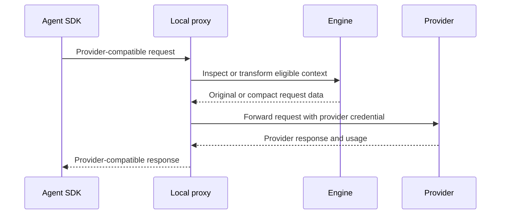

# Local proxy and providers

Local proxy presents provider-compatible HTTP routes on loopback, applies
configured local transforms, forwards requests to provider endpoints, and
records local usage. By default it is a single-operator developer tool with no
inbound authentication. Setting `CAVEMAN_AUTH_TOKEN` turns it into a shared,
token-gated service that may bind beyond loopback — see
[Deploy the proxy for a team](deploy.md).

Start it with:

```bash
caveman start
```

Default address is `127.0.0.1:8787`.

## Request path



Provider credentials are preserved from inbound requests. Supported environment
fallbacks apply only when an integration does not send a credential.

Native SSE, Gemini streamed JSON arrays, and AWS EventStream responses are
forwarded as they arrive. HTTP error status, response headers, and body bytes
are preserved. Provider error events inside an HTTP 200 stream remain HTTP 200
on the wire, as required after the headers have been sent; the local request
record carries `provider_stream_error`. Error detection stores only that code,
not the provider's error message. Complete billed usage remains distinct from
successful generation, and an error-bearing call claims no savings.

The protocol regression uses local HTTP servers and the wire envelopes accepted
by the [Anthropic SDK](https://github.com/anthropics/anthropic-sdk-python/blob/main/src/anthropic/_streaming.py),
[OpenAI SDK](https://github.com/openai/openai-python/blob/main/src/openai/_streaming.py),
[Google SDK](https://github.com/googleapis/python-genai/blob/main/google/genai/_api_client.py),
and [Botocore EventStream parser](https://github.com/boto/botocore/blob/develop/botocore/eventstream.py).
It checks first-event delivery before upstream completion, exact bytes, final
usage, HTTP errors, and stream errors. AWS Converse frame shapes were also
checked with Botocore 1.43.89. This is local protocol evidence; it does not
certify every provider endpoint, model, entitlement, or live account.

## Routes

### Anthropic

```text
/anthropic/v1/messages
/anthropic/v1/messages/count_tokens
/v1/messages
```

### OpenAI

```text
/openai/v1/chat/completions
/openai/v1/responses
/openai/v1/responses/input_tokens
/openai/v1/embeddings
/v1/chat/completions
/v1/responses
/v1/responses/input_tokens
/v1/embeddings
```

### Google Gemini

```text
/gemini/v1beta/models/{model}:generateContent
/gemini/v1beta/models/{model}:streamGenerateContent
/gemini/v1beta/models/{model}:countTokens
```

Both `v1beta` and stable `v1` are accepted for these three methods. Equivalent
bare Gemini paths are also accepted where profile configuration uses them.
See [Google's API versions](https://ai.google.dev/gemini-api/docs/api-versions).

### Amazon Bedrock

```text
/bedrock/model/{model}/invoke
/bedrock/model/{model}/invoke-with-response-stream
/bedrock/model/{model}/converse
/bedrock/model/{model}/converse-stream
/bedrock/model/{model}/count-tokens
```

Optional Mantle compatibility route:

```text
/bedrock/anthropic/v1/messages
```

Bedrock's OpenAI-compatible Chat Completions and Responses APIs on Runtime and
Mantle are separate protocols and are not implemented by this Bedrock mount.
Paths under `/bedrock/openai/v1/...` or `/bedrock/v1/...` return 404 before
forwarding. Enabling the Anthropic Mantle route does not enable them. AWS and
the OpenAI SDK distinguish their endpoint roots and IAM signing services; see
the [AWS endpoint comparison](https://docs.aws.amazon.com/bedrock/latest/userguide/endpoints.html)
and [OpenAI Bedrock provider](https://github.com/openai/openai-python/blob/main/bedrock.md).

### Azure OpenAI and Vertex AI

Azure mounts under `/azure/...` after its base URL is configured. Vertex mounts
under `/vertex/v1/projects/...` and supports public Google and Anthropic
publisher route forms implemented by adapter. Both are opt-in because endpoint
and identity configuration are installation-specific.

Vertex Express also accepts Google's projectless
`/vertex/v1/publishers/google/models/{model}:generateContent` route and the
corresponding `:streamGenerateContent` and `:countTokens` methods. Caller API
keys use Google's native header; query keys normalize to that header. See
[provider authentication](provider-authentication.md) for credential conflicts
and the existing OAuth path.

Vertex's Google publisher routes also accept `:countTokens`. Token-count
requests retain their request and response bytes in every proxy mode; counts
are not recorded as generated model usage or spend. These routes follow the
[OpenAI SDK](https://github.com/openai/openai-python/blob/main/src/openai/resources/responses/input_tokens.py),
[AWS Runtime reference](https://docs.aws.amazon.com/bedrock/latest/APIReference/API_runtime_CountTokens.html),
and [Vertex REST reference](https://docs.cloud.google.com/vertex-ai/generative-ai/docs/reference/rest/v1/projects.locations.publishers.models/countTokens).

### OpenAI-compatible providers

Named compatibility mounts use:

```text
/compat/{name}/...
```

Each mount declares `base_url` and an environment-variable name containing its
credential. Compatibility means HTTP shape, not guaranteed support for every
provider extension.

One mount is built in. The proxy registers `/compat/opencode-go/` with the
upstream `https://opencode.ai/zen/go` and the credential variable
`OPENCODE_API_KEY`. A `compat` entry with the name `opencode-go` in
`caveman.yaml` replaces the built-in mount and can set another endpoint.

Pi and local OpenClaw wrappers compare the full request URL their host SDK
would send with the URL the running proxy would forward. Scheme, host, port,
tenant path, and API version must match. Named mounts use the host's original
provider name; native routes use the listener's published native endpoint.
Unknown or credential-bearing base URLs remain direct with a notice. A
same-host path mismatch is not a verified route.

The proxy publishes credential-free endpoint identities in its run-state file
and returns its instance identity on the local health route. Wrappers require
that live identity before trusting the file, so a stale process record plus an
unrelated listener cannot open the routing gate. Older proxies without endpoint
or identity proof leave these host configurations direct. Existing OpenClaw
provider identities, model catalogs, fallback settings, and auth profiles remain
owned by OpenClaw. Existing managed OpenClaw configurations stay direct until
the gateway can establish the same endpoint proof; fresh managed setup still
uses its configured Caveman gateway.

Endpoint equality is necessary but does not cover host-derived payload policy.
Pi preserves supported public compatibility defaults; native OpenAI Chat cache
policy and unresolved endpoint-specific attribution can still require direct
transport. OpenClaw 2026.8.2 keeps OpenAI Chat, native Responses and native
Anthropic routes direct because its public config overlay cannot preserve all
private cache, replay, attribution and stream-validation decisions. Supported
custom routes also require compatible transport settings and headers. The
wrapper reports when proxy compression is off; keeping a host operational on
direct transport is not a claim that its traffic was compressed. See the
[compatibility audit](provider-compatibility-audit.md) and
[Pi extension contract](../../packages/pi-extension/README.md).

A mount pointing at a loopback relay (litellm, ollama, llama.cpp) also needs a
`CAVE_SSRF_ALLOWLIST` entry; see [Security and privacy](security-and-privacy.md).

```yaml
compat:
  myprovider:
    base_url: http://127.0.0.1:4000
    api_key_env: MYPROVIDER_API_KEY
```

A named mount can serve two wire protocols from one upstream. The credential
header follows the request path. A request to `/compat/{name}/v1/messages`
(Anthropic protocol) carries the key in `x-api-key`. Every other path carries
the key in `Authorization: Bearer`. A real inbound Bearer token keeps its header
on every path. OpenCode Go rejects a Bearer header on its Anthropic path, so
this rule is necessary for the `anthropic-messages` models.

The header is the only thing the path decides on its own. If the upstream
answers the Anthropic Messages protocol, also declare `wire_dialect: anthropic`
on the mount, or its usage blocks are parsed with OpenAI cache semantics and
every cache-warm response is recorded as malformed usage — which drops the
request from token accounting and from compression eligibility. See
[Configuration](configuration.md).

## Modes

| Mode | Request behavior |
|---|---|
| `record` | Forward model-visible bytes unchanged |
| `compress` | Apply eligible Engine transforms with recovery |
| `pixel` | Allow configured text-to-image context transport |
| `recommend` | Produce local recommendations without active transform |
| `shadow` | Evaluate eligible changes without serving them |
| `canary` | Apply configured experimental behavior to selected traffic |
| `active` | Apply enabled optimizer behavior |

Unknown mode becomes `record`. Standard local CLI workflows expose record,
compress, and pixel; other modes support controlled evaluation paths.

## Streaming

Proxy preserves provider streaming protocols and status behavior. Request
transforms finish before upstream dispatch; streaming response stays streaming.

## Credentials

API keys stay outside YAML. Anthropic, OpenAI, Gemini, and Azure use their named
environment variables; Bedrock uses supported AWS or bearer-token identity paths.

Never log authorization headers. Local telemetry should store usage and bounded
metadata, not raw secrets.

## Endpoint security

Proxy rejects a non-loopback listen address unless `CAVEMAN_AUTH_TOKEN` is set.
With that token every request must present it in `x-cave-api-key` or
`Authorization: Bearer`; the proxy consumes the header before resolving a
provider credential, so it never reaches a provider. Health and metrics
endpoints stay unauthenticated. Outbound Server-Side Request Forgery protection
checks configured endpoints and redirects. Private, link-local, and loopback
upstreams are blocked unless explicitly included in `CAVE_SSRF_ALLOWLIST` for a
self-hosted setup; link-local and metadata addresses have no allowlist escape.

See [Security and privacy](security-and-privacy.md) before allowing a local
model endpoint.

## Pricing and usage

Provider catalog supplies dated public list prices. Unknown provider or model
prices resolve to zero with an `unpriced` marker rather than a guessed cost.
Provider-reported token counts remain distinct from Engine estimates.

Displayed provider cost is a list-price subtotal, not a provider invoice. See
[Accounting and evidence](accounting-and-evidence.md).

## Troubleshooting

- A `404` often means agent uses wrong provider mount or bare route.
- Authentication failures should be checked at inbound header and provider
  credential source without printing secret values.
- A blocked custom base URL usually needs a precise `CAVE_SSRF_ALLOWLIST` entry.
- Unexpected unchanged context is valid when mode is record or a transform
  fails parse, size, policy, or recovery gates.
- For behavior comparison, repeat request in record mode and compare provider
  request and response classes, not secret-bearing raw logs.
