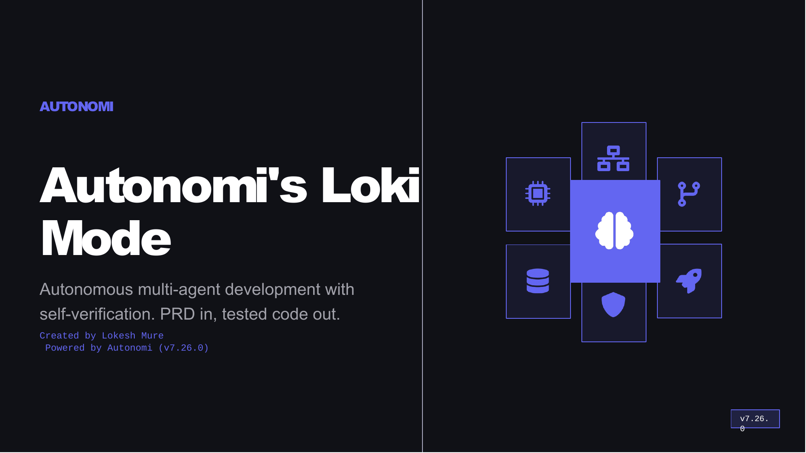

<div align="center">

# Loki Mode

### The spec-driven autonomous builder with verified completion.

**Hand it a spec. It does not accept "done" on an empty diff or failing tests.**

[](https://www.npmjs.com/package/loki-mode)
[](https://www.npmjs.com/package/loki-mode)
[](https://github.com/asklokesh/loki-mode)
[](https://hub.docker.com/r/asklokesh/loki-mode)
[](LICENSE)

[Website](https://www.autonomi.dev/) | [Documentation](wiki/Home.md) | [Installation](docs/INSTALLATION.md) | [Changelog](CHANGELOG.md) | [Purple Lab Web UI](#purple-lab)

</div>

---

> **How it works:** Drop a spec -- a PRD, GitHub issue, OpenAPI/JSON/YAML, or one-line brief. Loki Mode classifies complexity (`run.sh:detect_complexity()`), assembles an agent team from 41 specialized agent roles across 8 domains - prompt-defined specifications the orchestrator adopts per phase, with parallel review (blind council) and optional worktree streams on Claude Code, sequential on other providers - and runs autonomous RARV cycles (Reason - Act - Reflect - Verify, see `run.sh:run_autonomous()`) with 11 quality gates (see `skills/quality-gates.md`). Code is not "done" until it passes automated verification. Output is a Git repo with source, tests, configs, and audit logs.

---

## Why Loki Mode?

- **Spec-driven, autonomous, with a built-in trust layer** -- Hand Loki a spec, walk away, come back to working code with tests. The full RARV-C closure loop (Reason - Act - Reflect - Verify - Close) runs until the work is actually done, not just attempted. The verified-completion evidence gate (`skills/quality-gates.md`) refuses any "done" claim on an empty git diff against the run-start commit, and blocks completion when tests run red, so "complete" means proven, not promised.
- **Production quality built in** -- 11 quality gates (`skills/quality-gates.md`), blind 3-reviewer code review (`run.sh:run_code_review()`), anti-sycophancy checks
- **Standalone verification: `loki verify`** -- Run Loki's deterministic gates (build, tests, static analysis, secret scan, dependency audit) against any branch or PR diff, including code written by other agents or humans. CI-ready exit codes (0 VERIFIED, 1 CONCERNS, 2 BLOCKED), machine-readable evidence at `.loki/verify/evidence.json`. Inconclusive evidence is never reported as VERIFIED (v7.27.0).
- **Living spec and pre-build interrogation** -- `loki spec` locks a spec and detects drift deterministically (`spec.lock`, `drift-report.json`, and a `SPEC_DRIFT` finding in `loki verify` with CI exit codes), so you can tell when the build diverges from what was agreed. `loki grill` runs a Devil's-Advocate interrogation of the spec before you build, surfacing gaps and contradictions early (v7.28.0).
- **Mid-flight model switching + Claude Fable tier** -- switch the model a live run uses from the dashboard (applies at the next iteration, current run only), with Claude Fable available as a premium tier at its published $10/$50 per MTok (2x Opus). For every model lever (session pin to Fable, mid-flight override, architect pass) and every `LOKI_MAX_TIER` path, the `loki plan` quote, the dashboard's reported model, and the actual dispatched model agree, with the ceiling enforced (v7.31.0).
- **A calmer CLI** -- the help surface is ~20 grouped workflow entries instead of a 70-command wall; merged commands live on as aliases that forward byte-identically with a one-line stderr pointer, so no script breaks (v7.31.0).
- **Guided first build: `loki quickstart`** -- four quick questions (setup check, one-line idea, template pick, plan review) and your build starts; pressing Enter through every step builds the sample Todo app. The plan step quotes the real cost/time estimate before anything is spent, and `loki demo` now confirms its estimate the same way. If no AI provider CLI is installed, Loki offers to install Claude Code (consent-gated, interactive terminals only) (v7.29.0).
- **Live App Preview** -- The dashboard embeds the locally-running app in an iframe so you can interact with it immediately during a build. Use `loki preview` (alias `loki open`) to print the URL and open it in your browser. Local-first: no hosted service, no vendor lock (v7.24.0).
- **Compose-first fullstack** -- When a spec needs more than one service (web + database + cache) Loki generates a 12-factor `docker-compose.yml` with healthchecks, `depends_on` wiring, env-var config, and a `.env.example`. The Live App Preview surfaces the web service URL (not a database port), and health reflects the web service's Docker healthcheck so a crashed app shows as crashed even when the database stays up. Single-service apps stay on a plain run command. All local-first, no hosted service (v7.26.0).
- **Intelligent `loki start`** -- For interactive foreground runs the dashboard auto-opens in the browser (cross-platform; skipped in CI, SSH-without-TTY, and piped runs; opt out with `LOKI_NO_AUTO_OPEN=1`). The completion summary shows "Your app is live at <url>" so you know exactly where to try what Loki just built. The autonomous loop passes Claude Code's `--effort`, `--max-budget-usd`, and `--fallback-model` on every iteration (each gated on CLI support and individual opt-out env vars) for better long-run unattended execution (v7.25.0).
- **Cross-project memory** -- Episodic/semantic/procedural memory with vector search; knowledge learned on one project surfaces on the next (v5.15.0+, see `memory/engine.py`)
- **Self-hosted and private** -- Your keys, your infrastructure, no data leaves your network
- **Legacy system healing** -- `loki heal` archaeology/stabilize/isolate/modernize/validate phases (v6.67.0, see `skills/healing.md`)
- **MCP server** -- 34 tools (including ChromaDB code search) plus 3 resources and 2 prompts (`mcp/server.py`, with magic tools registered from `mcp/magic_tools.py` and the managed-memory tool from `mcp/managed_tools.py`). Of the 34, 33 are always available; `loki_memory_redact` is registered but only succeeds when `LOKI_MANAGED_AGENTS=true` and `LOKI_MANAGED_MEMORY=true`. Launch with `loki mcp` (bootstraps the Python MCP SDK on first run).
- **Full-stack output** -- Source code, tests, Docker Compose stacks (multi-service with healthchecks), CI/CD pipelines, audit logs
- **Provider-agnostic** -- runs on Claude, Codex, Cline, or Aider with automatic failover (`loki-ts/src/runner/providers.ts`); no vendor lock-in. Gemini CLI deprecated v7.5.18; Antigravity CLI coming soon.
- **Open source** -- Free for personal, internal, and academic use.

---

## Get Started in 30 Seconds

```bash
bun install -g loki-mode                       # install (npm/brew/Docker also work, see below)
loki init my-app --template simple-todo-app    # scaffold a starter PRD
cd my-app && loki start prd.md                 # autonomous build from the spec
```

That is the happy path. One thing to know first: Loki drives a separate coding-agent CLI (Claude Code is the recommended one) and needs it plus a couple of common tools on your PATH. Run `loki doctor` any time and it tells you exactly what is present and what is missing, with a copy-pasteable install command for each gap.

```bash
loki doctor                                    # check your setup before the first build
```

<details>
<summary><strong>What Loki needs (and what loki doctor checks)</strong></summary>

Required:

- An agent provider CLI: [Claude Code](https://docs.claude.com/en/docs/claude-code) (`claude`, Tier 1, recommended and E2E-verified - the provider Loki Mode is built for). Codex, Cline, and Aider are supported as experimental providers (wiring in place; not yet E2E-verified by us). Loki cannot run a build without one of these installed and authenticated.
- Python 3.10+ (`python3`) for the dashboard, memory system, and orchestration helpers.
- Git 2.x (`git`) for checkpoints and worktrees.
- `curl` for installation and network calls.

Recommended:

- Bun 1.3.0+ (`bun`) for the fast runtime (the recommended install path above installs it).
- Node.js 18+ and npm if you install via npm instead of Bun.
- `jq` for nicer JSON handling in shell flows.
- Docker if you want Loki's App Runner to run containerized projects, or to run Loki itself from the published image.

You also need credentials for whichever provider you use (for Claude Code, an authenticated `claude` login or `ANTHROPIC_API_KEY`). `loki doctor` flags a missing or unauthenticated provider as the first thing to fix.

</details>

If you do not have Bun yet:

```bash
curl -fsSL https://bun.sh/install | bash       # macOS / Linux (or: brew install oven-sh/bun/bun)
```

Other spec sources work the same way:

```bash
loki start owner/repo#123                       # a GitHub issue
loki start ./openapi.yaml                        # an OpenAPI/YAML spec
```

Or skip scaffolding and go straight to a quick task:

```bash
loki quick "build a landing page with a signup form"
```

**Other install methods (all work, all keep working):**

| Method | Command | Notes |
|--------|---------|-------|
| **Bun (recommended)** | `bun install -g loki-mode` | Fastest startup for CLI commands. |
| **Homebrew** | `brew tap asklokesh/tap && brew install loki-mode` | Auto-installs Bun as a dep |
| **Docker** | `docker pull asklokesh/loki-mode:7.31.0 && docker run --rm asklokesh/loki-mode:7.31.0 start prd.md` | Bun pre-installed in image |
| **npm (compat)** | `npm install -g loki-mode` | Works without Bun (bash fallback). Migrate any time with `loki self-update --to bun`. |

**Upgrading:**

```bash
loki self-update                  # upgrade in place via current manager
loki self-update --to bun         # switch from npm/brew to Bun
loki self-update --check          # show current install path + manager
```

`loki self-update` auto-detects which package manager installed loki and runs the right upgrade. If you installed via npm and want to switch to Bun (recommended for v8.0.0 forward-compat), `loki self-update --to bun` does the migration in one command (installs via Bun first, then uninstalls the npm copy).

See the [Installation Guide](docs/INSTALLATION.md) for the long form.

---

## Runtime Architecture

Loki Mode runs a dual runtime by deliberate design: the battle-tested Bash engine is the stable core (the autonomous loop, quality gates, and completion council stay on it; it receives bug fixes and hardening), and new product surfaces are built TypeScript/Bun-first as modules that wrap the engine rather than reimplement it. An earlier plan to make v8 Bun-only has been superseded by this stable-engine approach: rewriting the verified trust layer would risk the exact guarantees this product exists to provide, for no capability gain. Bash support is not going away.

**What ships today:**

- Commands routed to the Bun runtime when `bun` is on `PATH` (the router lives in `bin/loki`): `version`, `--version`, `-v`, `status`, `stats`, `doctor`, `provider` (covers `provider show` and `provider list`), `memory` (covers `memory list` and `memory index`), `rollback`, `kpis`, and `internal`.
- Every other command continues to execute on the existing Bash CLI (`autonomy/loki`), including the autonomous `loki start` / `loki run` loop which remains the Bash orchestrator (`autonomy/run.sh`).
- If `bun` is not on `PATH`, the shim falls through to Bash silently. Existing users without Bun installed see no behavior change.

**Rollback flag:**

Force every command to take the legacy Bash path:

```bash
LOKI_LEGACY_BASH=1 loki <cmd>
```

This is the documented escape hatch for any user who hits a regression on the Bun route. The Bash path remains the source of truth through Phase 5.

**Phase 6 (planned, calendar TBD):**

The next major release sunsets the Bash runtime entirely. There is no firm calendar date. Users who need to stay on the Bash route should pin the last v7.x release.

**Cost:**

- Adds a Bun runtime dependency (Bun 1.3.0 or newer recommended; the shim works as long as `bun` resolves).
- Adds a Bun toolchain to the system (Bun itself is roughly 50 MB installed via `brew install` or the official curl installer). The published `loki-ts/dist/loki.js` bundle inside the npm tarball is approximately 152 KB.
- Speedup on the ported commands is measured in `.loki/metrics/migration_bench_soak.jsonl` and analysed in [ADR-001](docs/architecture/ADR-001-runtime-migration.md). Recorded soak results show roughly 3x to 5x faster execution on the ported commands (per-command range 2.9x to 5.0x); treat as indicative, not contractual.

**More:**

- [UPGRADING.md](UPGRADING.md) -- per-version upgrade and rollback guidance.
- [ADR-001: Runtime Migration](docs/architecture/ADR-001-runtime-migration.md) -- design rationale and phase definitions.

---

<details>
<summary><strong>Other install methods</strong></summary>

| Method | Command |
|--------|---------|
| **Homebrew** | `brew tap asklokesh/tap && brew install loki-mode` |
| **Docker** | `docker pull asklokesh/loki-mode:7.31.0` |
| **Inside Claude Code** | `claude --dangerously-skip-permissions` then type "Loki Mode" |
| **Git clone** | `git clone https://github.com/asklokesh/loki-mode.git` |

See the full [Installation Guide](docs/INSTALLATION.md).

</details>

<details>
<summary><strong>Supported spec formats</strong></summary>

A "spec" is whatever you hand `loki start`. Loki auto-detects the format and normalises it before the RARV loop. A Markdown PRD is one form of spec; the table below lists every input the CLI accepts.

| Format | Example | Notes |
|--------|---------|-------|
| Markdown PRD | `loki start ./prd.md` | Canonical form. Headings become section anchors. |
| JSON spec | `loki start ./spec.json` | Free-form JSON; keys surfaced to agents. |
| YAML spec | `loki start ./openapi.yaml` | OpenAPI / AsyncAPI / plain YAML all accepted. |
| Plain text brief | `loki start ./brief.txt` | One-paragraph briefs work; complexity auto-detects to "simple". |
| GitHub issue URL | `loki start https://github.com/owner/repo/issues/42` | Title + body + labels become the spec. |
| GitHub shorthand | `loki start owner/repo#42` | Same as above, shorter. |
| Jira ticket key | `loki start PROJ-456` | Requires `JIRA_BASE_URL` + `JIRA_TOKEN` env vars. |
| GitLab / Azure DevOps URL | `loki start https://gitlab.com/group/proj/-/issues/7` | GitLab and Azure DevOps issue URLs both supported. |
| Bare issue number | `loki start #123` or `loki start 123` | Resolved against the current repo's `origin` remote. |
| OpenSpec change directory | `loki start --openspec ./openspec/change-001` | Reads OpenSpec change manifest + delta files. |
| Auto-detect (no input) | `loki start` | Picks up `./prd.md`, `./spec.{json,yaml,yml}`, or `./SPEC.md` from cwd. |

All formats land in the same RARV pipeline and pass the same 11 quality gates (`skills/quality-gates.md`).

</details>

---

## What You Can Build

| Project | Build Time | Complexity |
|---------|:----------:|:----------:|
| Landing page with signup form | ~10 min | Simple |
| REST API with JWT auth | ~20 min | Simple |
| Portfolio with animations | ~15 min | Simple |
| SaaS dashboard with analytics | ~25 min | Standard |
| E-commerce store with Stripe | ~45 min | Standard |
| Task manager with kanban board | ~25 min | Standard |
| Chat app with WebSocket | ~30 min | Standard |
| Blog platform with MDX | ~30 min | Standard |
| Microservice architecture | ~2 hours | Complex |
| ML pipeline with monitoring | ~3 hours | Complex |

---

## What To Expect

| | Simple | Standard | Complex |
|---|---|---|---|
| **Examples** | Landing page, todo app, single API | CRUD + auth, REST API + React | Microservices, real-time, ML pipelines |
| **Duration** | 5-30 min | 30-90 min | 2+ hours |
| **Autonomy** | Completes independently | May need guidance on complex parts | Use as accelerator with human review |

---

## Architecture

<div align="center">

</div>

<table>
<tr>
<td width="33%" valign="top">

### RARV Cycle
Every iteration: **Reason** (read state) - **Act** (execute, commit) - **Reflect** (update context) - **Verify** (run tests, check spec). Failures trigger self-correction.

[Core Workflow](references/core-workflow.md)

</td>
<td width="33%" valign="top">

### 41 Agent Roles
8 domains: engineering, operations, business, data, product, growth, review, orchestration. These are prompt-defined role specifications the orchestrator adopts per phase, auto-composed by PRD complexity; parallelism comes from the blind review council, the adversarial reviewer, and optional git-worktree streams on Claude Code, sequential on other providers.

[Agent Types](references/agent-types.md)

</td>
<td width="33%" valign="top">

### 11 Quality Gates
Blind review, anti-sycophancy, severity blocking, mock/mutation detection, backward compatibility (gate 10, v6.67.0), documentation coverage (gate 11, v7.5.0). Code does not ship until all gates pass.

[Quality Gates](skills/quality-gates.md)

</td>
</tr>
<tr>
<td width="33%" valign="top">

### Memory System
3-tier architecture: episodic (interaction traces), semantic (generalized patterns), procedural (learned skills). Vector search optional.

[Memory Architecture](references/memory-system.md)

</td>
<td width="33%" valign="top">

### Dashboard
Real-time monitoring, agent status, task queue, WebSocket streaming, and Live App Preview (embedded iframe of the running app with Refresh/Open/Restart toolbar). Auto-starts at `localhost:57374`.

[Dashboard Guide](docs/dashboard-guide.md)

</td>
<td width="33%" valign="top">

### Enterprise Layer
TLS, OIDC/SSO, RBAC, OTEL tracing, policy engine, audit trails. Activated via env vars.

[Enterprise Guide](docs/enterprise/architecture.md)

</td>
</tr>
</table>

---

## Purple Lab

The hosted development platform. A Replit-like web UI for visual PRD-to-code workflow with AI chat for iterative development.

```bash
loki web                           # launches at http://localhost:57375
```

<table>
<tr>
<td width="50%" valign="top">

**Platform Pages**
- Home -- One-line prompt to start building instantly
- Projects -- Browse, search, filter past builds
- Templates -- 20+ starter PRDs by category
- Showcase -- Gallery of example projects to build
- Compare -- Feature comparison vs competitors

</td>
<td width="50%" valign="top">

**IDE Workspace**
- Monaco editor with tabs, Cmd+P quick open
- AI chat panel for iterative development
- Activity panel: build log, agents, quality gates
- Live preview with URL bar navigation
- Right-click context menu: Review, Test, Explain

</td>
</tr>
</table>

---

## Loki Mode vs. Alternatives

| Feature | Loki Mode | bolt.new | Replit | Lovable |
|---------|:---------:|:--------:|:------:|:-------:|
| Self-hosted / your keys | Yes | No | No | No |
| 5 AI provider failover | Yes | No | No | No |
| 11 quality gates | Yes | No | No | No |
| Blind code review | Yes | No | No | No |
| Enterprise auth (SSO/RBAC) | Yes | No | Yes | No |
| Air-gapped deployment | Yes | No | No | No |
| Docker + CI/CD generation | Yes | No | Yes | No |
| Open source | Yes | No | No | No |
| Free tier | Open source | Yes | Yes | Yes |

Loki Mode is the only platform that is fully self-hosted, open source, and includes automated quality verification. Your code, your keys, your infrastructure.

---

## Provider-Agnostic Runtime

Loki's autonomy and quality loop are the product; the underlying coding CLI is swappable. Loki runs on any of the providers below so you are never locked to one vendor.

| Provider | Status | Autonomous Flag | Parallel Agents | Install |
|----------|--------|:-:|:-:|---------|
| **Claude Code** | Active (Tier 1, E2E-verified) | `--dangerously-skip-permissions` | Yes (10+) | `npm i -g @anthropic-ai/claude-code` |
| **Codex CLI** | Experimental (Tier 3) | `--full-auto --skip-git-repo-check` | Sequential | `npm i -g @openai/codex` |
| **Cline CLI** | Experimental (Tier 2) | `-y` | Sequential | `npm i -g @anthropic-ai/cline` |
| **Aider** | Experimental (Tier 3) | `--yes-always` | Sequential | `pip install aider-chat` |
| **Google Gemini CLI** | DEPRECATED v7.5.18 | -- | -- | Upstream deprecated; runtime removed. `LOKI_PROVIDER=gemini` exits with migration message. |
| **Anthropic Antigravity CLI** | Coming soon | -- | -- | Integration planned. |

Status legend: "E2E-verified" means we run real spec-to-code builds on it ourselves. Claude Code is the primary, fully supported provider and the one Loki Mode is built for; it gets full features (subagents, parallelization, MCP, Task tool). "Experimental" means the wiring is in place but we have not produced an end-to-end verified build ourselves; treat as community-tested. Experimental providers run sequentially. Auto-failover switches providers when rate-limited. See [Provider Guide](skills/providers.md).

---

## CLI Reference

<details>
<summary><strong>All commands</strong></summary>

| Command | Description |
|---------|-------------|
| `loki start [PRD]` | Start with optional PRD file (also accepts an issue ref; replaces deprecated `loki run`). Auto-opens the dashboard in the browser for interactive runs and passes native `--effort`/`--max-budget-usd`/`--fallback-model` for resilience (v7.25.0) |
| `loki stop` | Stop execution |
| `loki heal <path>` | Legacy system healing (archaeology, stabilize, isolate, modernize, validate -- v6.67.0) |
| `loki pause` / `resume` | Pause/resume after current session |
| `loki status` | Show current status |
| `loki dashboard` | Open web dashboard |
| `loki preview` / `loki open` | Print running app URL and open in browser (Live App Preview, v7.24.0) |
| `loki web` | Launch Purple Lab web UI |
| `loki doctor` | Check environment and dependencies |
| `loki plan [PRD]` | Pre-execution analysis: complexity, cost, iterations |
| `loki review [--staged\|--diff]` | AI-powered code review with severity filtering |
| `loki test [--file\|--dir\|--changed]` | AI test generation (8 languages, 9 frameworks) |
| `loki onboard [path]` | Project analysis and CLAUDE.md generation |
| `loki import` | Import GitHub issues as tasks |
| `loki ci` | CI/CD quality gate integration |
| `loki failover` | Cross-provider auto-failover management |
| `loki memory <cmd>` | Memory system: index, timeline, search, consolidate |
| `loki enterprise` | Enterprise feature management |
| `loki version` | Show version |

</details>

Run `loki --help` for all options. Full reference: [CLI Reference](wiki/CLI-Reference.md) | Config: [config.example.yaml](autonomy/config.example.yaml)

---

<details>
<summary><strong>BMAD Method Integration</strong></summary>

Loki Mode integrates with the [BMAD Method](https://github.com/bmad-code-org/BMAD-METHOD), a structured AI-driven agile methodology. If your project uses BMAD for requirements elicitation, Loki Mode can consume those artifacts directly:

```bash
loki start --bmad-project ./my-project
```

The adapter handles BMAD's frontmatter conventions, FR-format functional requirements, Given/When/Then acceptance criteria, and artifact chain validation. Non-BMAD projects are unaffected -- the integration is opt-in via `--bmad-project`.

See [BMAD Integration Validation](docs/architecture/bmad-integration-validation.md).

</details>

<details>
<summary><strong>Enterprise Features</strong></summary>

Enterprise features are included but require env var activation. Self-audit: 35/45 capabilities working, 0 broken, 1,314 tests passing.

```bash
export LOKI_TLS_ENABLED=true
export LOKI_OIDC_PROVIDER=google
export LOKI_AUDIT_ENABLED=true
loki enterprise status
```

[Enterprise Architecture](docs/enterprise/architecture.md) | [Security](docs/enterprise/security.md) | [Authentication](docs/authentication.md) | [Authorization](docs/authorization.md) | [Metrics](docs/metrics.md) | [Audit Logging](docs/audit-logging.md)

</details>

<details>
<summary><strong>Benchmarks</strong></summary>

Self-reported results from the included test harness. Verification scripts included for reproduction.

| Benchmark | Result | Notes |
|-----------|--------|-------|
| HumanEval | 162/164 (98.78%) | Self-reported; harness + results JSON in `benchmarks/results/humaneval-loki-results.json`. Max 3 retries, RARV self-verification. |
| SWE-bench | Not yet measured | Harness exists and generates patches, but the official SWE-bench evaluator has not been run, so there is no pass-rate to report. Run it yourself: `./benchmarks/run-benchmarks.sh swebench --execute` |

See [benchmarks/](benchmarks/) for methodology.

</details>

<details>
<summary><strong>Presentation</strong></summary>



*11 slides: Problem, Solution, 41 Agents, RARV Cycle, 9 Quality Gates (HumanEval 98.78%), Multi-Provider, Enterprise Hardening (Live App Preview), Full Lifecycle*

**[Download PPTX](docs/loki-mode-presentation.pptx)**

</details>

---

## Limitations

| Area | What Works | What Doesn't (Yet) |
|------|-----------|---------------------|
| **Code Gen** | Full-stack apps from PRDs | Complex domain logic may need human review |
| **Deploy** | Generates configs, Dockerfiles, CI/CD | Does not deploy -- human runs deploy commands |
| **Testing** | 11 automated quality gates | Test quality depends on AI assertions |
| **Providers** | 5 providers with auto-failover | Non-Claude providers lack parallel agents |
| **Dashboard** | Real-time single-machine monitoring | No multi-node clustering |

> **What "autonomous" means:** The system runs RARV cycles without prompting. It does NOT access your cloud accounts, payment systems, or external services unless you provide credentials. Human oversight is expected for deployment, API keys, and critical decisions.

---

## Research Foundation

<details>
<summary><strong>Papers and sources</strong></summary>

| Source | What We Use |
|--------|-------------|
| [Anthropic: Building Effective Agents](https://www.anthropic.com/research/building-effective-agents) | Evaluator-optimizer, parallelization |
| [Anthropic: Constitutional AI](https://www.anthropic.com/research/constitutional-ai-harmlessness-from-ai-feedback) | Self-critique against quality principles |
| [DeepMind: Scalable Oversight via Debate](https://deepmind.google/research/publications/34920/) | Debate-based verification in council review |
| [DeepMind: SIMA 2](https://deepmind.google/blog/sima-2-an-agent-that-plays-reasons-and-learns-with-you-in-virtual-3d-worlds/) | Self-improvement loop design |
| [OpenAI: Agents SDK](https://openai.github.io/openai-agents-python/) | Guardrails, tripwires, tracing |
| [NVIDIA ToolOrchestra](https://github.com/NVlabs/ToolOrchestra) | Efficiency metrics, reward signals |
| [CONSENSAGENT (ACL 2025)](https://aclanthology.org/2025.findings-acl.1141/) | Anti-sycophancy in blind review |
| [GoalAct](https://arxiv.org/abs/2504.16563) | Hierarchical planning for complex PRDs |

**Practitioner insights:** Boris Cherny, Simon Willison, [HN Community](https://news.ycombinator.com/item?id=44623207)

**[Full Acknowledgements](docs/ACKNOWLEDGEMENTS.md)** -- 50+ papers and resources

</details>

---

## Contributing

```bash
git clone https://github.com/asklokesh/loki-mode.git && cd loki-mode
npm install && npm test              # 683 tests
python3 -m pytest                    # 631 tests
```

See [CONTRIBUTING.md](CONTRIBUTING.md) for guidelines.

## License

[Business Source License 1.1](LICENSE) -- Free for personal, internal, academic, and non-commercial use. Converts to Apache 2.0 on March 19, 2030. Contact founder@autonomi.dev for commercial licensing.

---

<div align="center">

**[Autonomi](https://www.autonomi.dev/)** | **[Documentation](wiki/Home.md)** | **[Changelog](CHANGELOG.md)** | **[Comparisons](references/competitive-analysis.md)**

</div>
