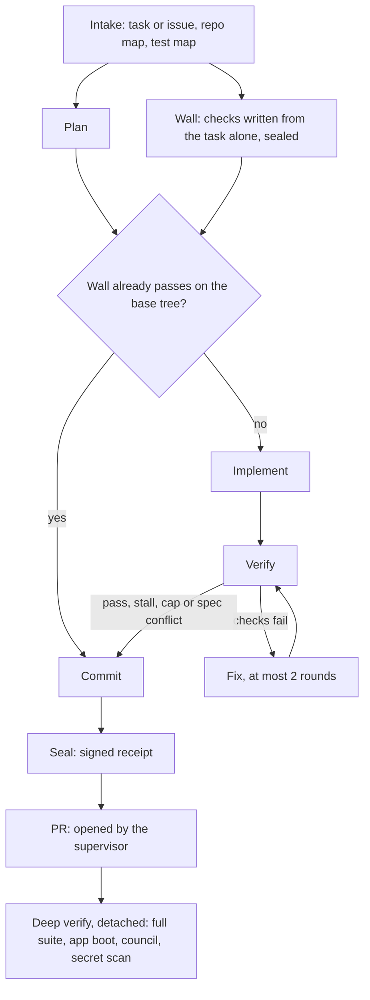
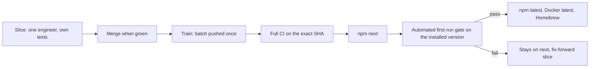

Your agent says done. Loki proves it.

An autonomous software factory that knows what it is supposed to deliver, and proves it did.

[](https://www.npmjs.com/package/loki-mode)
[](https://www.npmjs.com/package/loki-mode)
[](https://hub.docker.com/r/asklokesh/loki-mode)
[](LICENSE)

[Website](https://www.autonomi.dev/) | [Documentation](wiki/Home.md) | [Installation](docs/INSTALLATION.md) | [Changelog](CHANGELOG.md)

Loki Mode is a free, source-available autonomous coding agent by [Autonomi](https://www.autonomi.dev/). Hand it a PRD, GitHub issue, OpenAPI doc or one-line brief. It derives a delivery contract (the acceptance criteria), builds against it, and ends with a signed Evidence Receipt that states what was proven and what was not. If the contract cannot be derived, it stops and asks one question instead of guessing.

Before a build counts as done, a review council selects reviewers from a specialist pool (`agents/types.json`, scored by `run.sh:FOCUS_KEYWORDS`). The bundled MCP server exposes 36 tools over stdio (`mcp/server.py`).

## Contents

- [Install](#install)
- [Loki 10 engine](#loki-10-engine)
- [Outcomes and exit codes](#outcomes-and-exit-codes)
- [Signed receipts and loki verify](#signed-receipts-and-loki-verify)
- [Quiet output](#quiet-output)
- [Release channels: next and latest](#release-channels-next-and-latest)
- [loki doctor](#loki-doctor)
- [Modernization: status of loki modernize](#modernization-status-of-loki-modernize)
- [Providers](#providers)
- [Legacy engine reference](#legacy-engine-reference) (the engine `loki` runs by default today)

## Install

```bash
bun install -g loki-mode          # recommended (npm, Homebrew, Docker below)
loki doctor                       # checks your setup, names any blocker
```

| Method | Command | Notes |
|--------|---------|-------|
| **Bun (recommended)** | `bun install -g loki-mode` | Fastest startup for CLI commands. |
| **npm** | `npm install -g loki-mode` | Works without Bun (bash fallback). Migrate any time with `loki self-update --to bun`. |
| **Homebrew** | `brew tap asklokesh/tap && brew install loki-mode` | Auto-installs Bun as a dependency. |
| **Docker** | `docker pull asklokesh/loki-mode:latest` | Bun and the Claude CLI pre-installed. See [DOCKER_README.md](DOCKER_README.md). |
| **No install** | `npx loki-mode tour` | Prints a real Evidence Receipt from a past build. No key, no spend, no network. |

Upgrade with `loki self-update`. Long form: [Installation Guide](docs/INSTALLATION.md). `npm install -g loki-mode` installs the `latest` dist-tag; see [Release channels](#release-channels-next-and-latest) for `next`.

**Loki needs a model to drive.** An `ANTHROPIC_API_KEY` alone is enough (the Claude Agent SDK ships inside Loki; on the default engine this path needs Bun and `LOKI_SDK_MODE=full`, see Setup details below), or point it at Claude Code, Cline, Codex, Aider or opencode. `loki doctor` tells you exactly what is missing.

```bash
export ANTHROPIC_API_KEY=sk-...
loki doctor
loki quick "fix the login bug"   # one small task on the Loki 10 engine
```

<details>
<summary>Claude Code plugin (adds /loki-grill, /loki-spec-status, /loki-verify)</summary>

```bash
claude plugin marketplace add asklokesh/loki-mode
claude plugin install loki-mode@loki-mode
```

Adds three slash commands and the Loki MCP server (memory, task queue, code search, build management) to Claude Code. It calls the CLI rather than bundling it, so install `loki-mode` above first. Verify with `claude plugin list`: a healthy install reports `Status: enabled`.

</details>

loki-seal is a Claude Code Stop hook that runs your repo's real test suite when the agent tries to finish and refuses "done" if tests newly fail or tests or CI config were deleted, skipped or weakened (details: [packages/loki-seal/README.md](packages/loki-seal/README.md)). Install it from the repository's plugin marketplace:

```
/plugin marketplace add asklokesh/loki-mode
/plugin install loki-seal@loki-mode
```

## Loki 10 engine

Default: Loki 10 engine for `loki "<task>"`, `loki owner/repo#N` and `loki quick "<task>"`. Set LOKI_ENGINE=legacy or run `loki legacy <args>` for the previous engine. <!-- loki10-default -->

Loki 10 is the rewritten engine and the default for tasks, issue mode and `quick`; `status`, `verify` and `dashboard` use it when `LOKI_ENGINE=v10` is set. Guide, provider table and summary format: [docs/v10/GUIDE.md](docs/v10/GUIDE.md).

```
LOKI_ENGINE=v10 loki "fix the login redirect loop" --no-pr
```

```
LOKI_ENGINE=v10 loki owner/repo#123
```

The router sends a quoted multi-word task, a GitHub, GitLab or Jira issue reference, and the `status`, `verify` and `dashboard` subcommands to the v10 engine. A one-word argument that is not an issue ref, or any first argument starting with `-`, stays on the legacy CLI. Flags (`loki-ts/src/engine10/cli.ts` USAGE): `--no-pr` builds and verifies without opening a pull request, `--deep` requests the deep verify pass and a longer implement budget, `--provider <name>` picks the coding provider (`--json` and `--verbose` are also parsed by the supervisor, see [Quiet output](#quiet-output)). The v10 engine needs Bun; without it the command exits 1 with a message.

### The state machine

Every run starts from an explicit delivery contract and is judged only against it. The stage table lives in `loki-ts/src/engine10/machine.ts` (`FLOW`), the stages in `loki-ts/src/engine10/stages/`.


```mermaid
flowchart TD
    A[Intake: task or issue, repo map, test map] --> P[Plan]
    A --> W[Wall: checks written from the task alone, sealed]
    P --> G{Wall already passes on the base tree?}
    W --> G
    G -- yes --> C[Commit]
    G -- no --> I[Implement]
    I --> V[Verify]
    V -- checks fail --> F[Fix, at most 2 rounds]
    F --> V
    V -- pass, stall, cap or spec conflict --> C
    C --> S[Seal: signed receipt]
    S --> R[PR: opened by the supervisor]
    R --> D[Deep verify, detached: full suite, app boot, council, secret scan]
```

| Stage | What it does |
|-------|--------------|
| intake | Reads the task or issue, builds the repo map and the test map. |
| plan and wall | Run in parallel. Plan decides the approach. The Wall author sees only the task and the repo map, never the code, and writes `loki_wall_*` tests that are sealed (sha256) before implement. If they already pass on the untouched base tree, the run ends early as ALREADY_SATISFIED. |
| implement | A provider session makes the change, under a time budget (480s default, 1800s with `--deep`). |
| verify and fix | Runs the checks. Failures feed up to 2 fix rounds (`MAX_FIX_ROUNDS`). The same failures three verifies running end the run as STALLED. |
| commit and seal | Commits the diff, then writes `.loki/runs/<run-id>/receipt.json` and `receipt.md`, signed by default. |
| pr | Opened by the supervisor, not the worker (the worker never holds a GitHub token). A non-VERIFIED run opens a draft PR. |
| deep verify | Detached, started after the PR opens (so not with `--no-pr`): full suite, app-boot probe, council, secret scan. A check that is refused or unavailable is reported as NOT PROVEN, never as red. `--deep` is a separate flag that raises the implement and run budgets. |

The run cap is 900s (2700s with `--deep`, `DEFAULT_CAP_S` and `DEEP_CAP_S` in `types.ts`); commit, seal and pr still run after the cap fires. A run whose cap fired and which did not verify exits BUDGET_STOP.

A finished run prints a short summary (see [Quiet output](#quiet-output), which also shows an example) whose `NOT PROVEN` line is never empty by omission: deep checks deferred to the deep-verify pass are always listed there.

`loki status [run-id]`, `loki verify [run-id]` and `loki dashboard` are built on the v10 path. Slack notifications are not part of the v10 engine surface yet.

## Outcomes and exit codes

A v10 run ends in exactly one outcome. The mapping is `EXIT` in `loki-ts/src/engine10/output.ts`.

| Exit | Outcome | Meaning |
|------|---------|---------|
| 0 | VERIFIED | The contract's checks ran and passed. |
| 0 | ALREADY_SATISFIED | The work was already done; evidence is recorded. |
| 1 | FAILED | A check failed, the stage failed, or the event log was modified outside the engine. |
| 2 | (usage) | No task given, not inside a git repository, or a preflight refusal. Nothing ran. |
| 3 | BUDGET_STOP | The cost or time cap fired before the work finished. |
| 4 | BLOCKED | Spec conflict: the contract cannot be satisfied as written. The summary names the conflict (`spec conflict: <reason>`); the run never guesses and calls it done. |
| 5 | STALLED | The same failures three verifies in a row. |

Severity rises with the code, so `[ $rc -ge 2 ]` always means worse than FAILED. The full table for other commands (`loki verify`, `loki proof verify`, `loki ci`, `loki doctor`, `loki start`) is in [docs/exit-codes.md](docs/exit-codes.md); that page does not yet list the v10 run ladder above, which is read from the code.

Known gap: the legacy `loki verify` exit table in `docs/exit-codes.md` lists four inputs that do not yet return the documented target. They are tracked as pending moat cases.

## Signed receipts and loki verify

Every sealed v10 run writes a receipt to `.loki/runs/<run-id>/receipt.json`. `receipt_sha256` hashes the canonical JSON without the `verification` block, so verifying never trusts the receipt's own signature field to compute the hash it checks.

Receipts are signed by default. On the first run Loki generates an Ed25519 key at `~/.loki/keys/receipt-ed25519.pem` (mode 0600, directory 0700), or you supply your own with `LOKI_RECEIPT_SIGNING_KEY` or `LOKI_RECEIPT_SIGNING_KEY_FILE`. See [docs/SIGNED-RECEIPTS.md](docs/SIGNED-RECEIPTS.md).

```
LOKI_ENGINE=v10 loki verify
```

`loki verify [run-id]` (latest run by default) re-hashes the receipt, checks the signature against your local key (and retired keys listed in `LOKI_RECEIPT_RETIRED_PUBKEYS`), and checks the receipt against the event log. Verdicts and exit codes on the v10 path (`loki-ts/src/engine10/verify_cmd.ts`):

| Verdict | Exit | Meaning |
|---------|------|---------|
| VERIFIED | 0 | Hash and signature check out. |
| UNSIGNED | 3 | The receipt carries no signature, so its integrity is not attested and `loki verify` refuses it. Pass `--allow-unsigned` (or set `LOKI_VERIFY_ALLOW_UNSIGNED=1`) to accept it and exit 0; the output still says UNSIGNED. A receipt whose body was edited and whose signature was stripped reads UNSIGNED. |
| TAMPERED | 1 | The hash, the signature, or the event log does not match. |
| UNCHECKED | 2 | The signature cannot be checked here, for example the signing key is on another machine. |
| (no runs) | 66 | No receipt to verify. |

A verified receipt is bound to the run's event log, so a receipt lifted out of its run, or a log edited after sealing, does not verify. Signing proves the receipt came from the key holder; it does not prove the generated code is bug-free. A receipt only claims what its checks ran, and states what they did not.

On the legacy engine, receipts live under `.loki/proofs/<run_id>/` and are inspected with `loki proof list`, `loki proof show <id>` and `loki proof verify <id>` (exit 0 clean, 1 on tamper or drift, 2 could not check).

## Quiet output

The v10 run is quiet by default: no stage chatter, only the final summary. `--verbose` tails the event stream live (one line per finished stage and a heartbeat with elapsed time and the running diff size). `--json` prints one JSON object (`ok`, `outcome`, `stop`, `run_id`, `receipt_sha256`) instead of text.

The summary is one outcome line, an optional reason on a non-VERIFIED run, then the PR, the receipt, what was NOT PROVEN, the cost and the time (`formatSummary` in `output.ts`):

```
Outcome:    VERIFIED
PR:         https://github.com/owner/repo/pull/1
Receipt:    sha256:2f9a41c7e0b3...
NOT PROVEN: full suite, app boot, council, security scan
Cost:       $0.42 (claude, 212k tokens)
Time:       4m12s (intake 11s, plan 20s, implement 3m10s, verify 31s)
```

Cost is the provider-reported figure. When a provider does not report cost the line reads `not measured`, never `$0.00`. The legacy `loki quick` is also quiet by default; `--verbose` or `LOKI_VERBOSE=1` shows setup and progress.

## Release channels: next and latest

Releases are built in slices and shipped in trains: green slices merge, one train is pushed, and the release workflow publishes the exact tested tree to the npm `next` dist-tag. `latest` moves only through the promote workflow (`.github/workflows/promote.yml`), which installs that exact version from npm, runs the first-run gate on it (`scripts/first-run-gate.sh --installed`), and only then moves `latest`, Docker `:latest` and the Homebrew formula. A version whose commit is not an ancestor of main can never become `latest`.

The first-run gate runs the README's default entry point for a new user on a throwaway repo with a throwaway HOME and a stub provider, and asserts the run is honest: the exit code matches the result, tests are green, only the fix file changed, the printed digest equals what `loki verify` checks, the receipt is signed, output stays short, and a run that skips the target test does not end VERIFIED.

Policy (D49): every green release is promoted to `latest` after the automated first-run gate. The promote workflow runs automatically after Post-Release Smoke succeeds; a failed smoke or gate leaves the version on `next`. `workflow_dispatch` remains for manual runs of an exact version.


```mermaid
flowchart LR
    S[Slice: one engineer, own tests] --> M[Merge when green]
    M --> T[Train: batch pushed once]
    T --> CI[Full CI on the exact SHA]
    CI --> N[npm next]
    N --> G[Automated first-run gate on the installed version]
    G -- pass --> L[npm latest, Docker latest, Homebrew]
    G -- fail --> X[Stays on next, fix-forward slice]
```

## loki doctor

```bash
loki doctor            # human-readable check of prerequisites and providers
loki doctor --json     # machine-readable; JSON is emitted in full even on failure
loki doctor --airgap   # audit network egress and how to disable each
```

Exit 0 when every required check passes; optional warnings (an absent provider CLI) do not fail it. It checks the required tools, the provider CLIs and your login, and says what to install for each gap. The same contract holds for `--json`, so it is usable as an init-container or CI preflight gate.

## Modernization: status of loki modernize

There are two different things behind the name today.

- `loki modernize heal <path>` and `loki modernize migrate <path>` are the shipped legacy commands (agent-driven phases). `loki modernize heal <path> --assess` is read-only. See [Already have a codebase](#already-have-a-codebase-start-read-only).
- `loki modernize <repo> --to <target>` is the new v10 command with behavior-captured equivalence. It is routed to the v10 engine whatever `LOKI_ENGINE` says, but it is not finished: only the `--dry-run` estimate works (inventory, dependency graph, unit clustering, cost, time and risk estimate, no model spend). A real run stops after the estimate and prints `modernize: oracle capture and execution are not built yet; use --dry-run`. Targets `python3` and `java21` exist; the Java dependency graph is not wired in yet. Nothing in v10 modernize claims a unit is proven equivalent today. Design: [docs/v10/MODERNIZE.md](docs/v10/MODERNIZE.md), user summary: [docs/v10/GUIDE-MODERNIZE.md](docs/v10/GUIDE-MODERNIZE.md).

## Providers

Loki's autonomy and quality loop are the product; the coding CLI is swappable. With `LOKI_PROVIDER` unset, Loki auto-detects the first installed provider in this order (`providers/loader.sh`): claude, cline, codex, aider, opencode. An explicit choice always wins and is never silently substituted. Gemini CLI is deprecated: `LOKI_PROVIDER=gemini` exits with a migration message.

| Provider | Tier | Autonomous flag | Parallel | v10 engine cost and kill-blocking | Install |
|----------|------|-----------------|:--------:|:---------------------------------:|---------|
| **Claude Code** | 1, full support | `--dangerously-skip-permissions` | Yes | measured, enforced | `npm i -g @anthropic-ai/claude-code` |
| **Cline CLI** | 2, reduced | `-y` | Sequential | not measured, not enforced | `npm install -g cline` |
| **Codex CLI** | 3, degraded | `exec --sandbox workspace-write --skip-git-repo-check` | Limited (2) | not measured, not enforced | `npm i -g @openai/codex` |
| **Aider** | 3, degraded | `--yes-always` | Sequential | not measured, not enforced | `pip install aider-chat` |
| **opencode** | model-agnostic | `--auto` | Sequential | not supported by the v10 engine | `npm install -g opencode-ai` |

Claude Code is the provider Loki is built for and the one that is run end to end by us. The others are wired in but are experimental. On a non-Claude provider the v10 summary says so: the Cost line reads `not measured` and NOT PROVEN adds `kill blocking not enforced`. See [Provider Guide](skills/providers.md).

---

# Legacy engine reference

Everything below describes the legacy engine, which `loki` still runs by default (and which stays reachable when Loki 10 is made the default). The long-form commands, `loki start`, `loki quick`, `loki quickstart` and `loki proof` all live here.

## Use it

```bash
loki quickstart                   # guided first build: asks a few questions, quotes cost, builds
```

That is the whole happy path. It asks for a one-line idea, picks a template,
shows the real cost and time estimate before spending anything, then builds.
Press Enter through every step and you get a sample Todo app.

One command, no prompts (CI, scripts, containers, any shell without a terminal):

```bash
loki quickstart "a todo app with user accounts" --yes
```

Both halves are required with no terminal: an idea (or a path to a PRD file)
and an explicit `--yes`. Given both, Loki picks the top-ranked template
automatically, prints the same honest cost and time estimate, and starts the
build without asking anything. Missing either half exits 2 with the
needs-a-terminal message and writes nothing, so an ambient `LOKI_AUTO_CONFIRM`
or a stray argument in CI can never start a paid build on its own. Existing
files are never overwritten: if `prd.md` is present the PRD lands at
`prd-quickstart.md`, then numbered suffixes as needed.

Choose an exact shipped starter when the top-ranked match is not the one you
want:

```bash
loki quickstart --list-templates
loki quickstart --list-templates --json       # schema-v1 automation output
loki quickstart "an internal reporting workspace" --template dashboard --yes
```

Template discovery works without a terminal or provider and lists every shipped
starter's stable name and purpose in catalog order. It returns before estimation,
consent, PRD writes, or build execution. Positional input and execution/preview
flags are intentionally incompatible; `--json` is the only optional modifier.

`--template` accepts an exact template name for idea inputs and works the same
way with interactive use or `--dry-run` (including JSON preview). Unknown
templates, duplicate flags, and combinations with a PRD path refuse before
provider discovery, estimation, writes, or build execution.

Preview the same deterministic template choice and estimator-backed plan with
zero writes or execution:

```bash
loki quickstart "a todo app with user accounts" --dry-run
```

Preview requires an idea or readable PRD path, works without a terminal or AI
provider, and exits before creating a PRD or starting a build. `--dry-run` and
`--yes` are mutually exclusive so execution intent is never ambiguous.

For scripts and local dashboards, add `--json` to receive one versioned JSON
object instead of terminal text:

```bash
loki quickstart "a todo app with user accounts" --dry-run --json > preview.json
loki quickstart --verify-preview preview.json --json
loki quickstart --from-preview preview.json --yes
```

The object contains the input kind, deterministic selected template (or `null`
for an existing PRD), the exact estimator response under `plan`, and a bounded
continuation containing the exact idea/template or the PRD path and SHA-256.
`--verify-preview` validates the same bounded duplicate-key-rejecting schema and
requires either a currently shipped idea template or the unchanged digest-bound
PRD, while emitting no idea or PRD path. It accepts a file or piped stdin and
returns before provider discovery, estimation, writes, or build execution.
`--from-preview` requires explicit argv `--yes`, rejects malformed, conflicting,
symlinked, or changed inputs before provider and build boundaries, then uses the
existing no-clobber quickstart path. The saved plan is evidence rather than
execution authority: Loki recomputes and displays the current estimate before
starting. `--json` requires `--dry-run`; invalid input or estimator failure
writes no JSON, and preview still exits before provider discovery, file writes,
or build execution.

Or go straight at it:

```bash
loki quick "build a landing page with a signup form"     # one-shot task
loki start prd.md                                        # build from a spec you wrote
loki modernize heal ./your-repo --assess                 # existing codebase, read-only
```


## Try it first, without installing

```bash
npx loki-mode tour                # no install, no API key, no spend, no network
```

Prints a real Evidence Receipt from a past build, headline and all:

```
Headline: VERIFIED WITH GAPS

| Fact          | Value                                    |
| Files changed | 8                                        |
| Diff sha256   | c2be6fff3e774c387f276277b25fc424f07b667… |
| Tests         | verified (node-test)                     |
| Build         | not_run                                  |
| Security      | findings                                 |
| Cost          | $10.3218                                 |
```

**"WITH GAPS" is the point.** Build was not run, security has findings, and the
receipt says so on its own front page. Recompute the diff hash yourself and
check it matches -- you are not asked to trust the agent's self-report.

## How the legacy engine works

Drop a spec: a PRD, GitHub issue, OpenAPI/JSON/YAML, or a one-line brief. Loki Mode classifies complexity (`run.sh:detect_complexity()`), selects reviewers from a specialist pool (`agents/types.json` ships the role definitions; 10 are keyword-scored by the review selector at `run.sh:FOCUS_KEYWORDS`, alongside the mandatory reviewers, and the rest are role descriptions in `references/agents.md` that the orchestrator adopts per phase rather than separate processes), with a blind review council and optional git-worktree streams on Claude Code, sequential on most other providers, and runs autonomous RARV cycles (Reason, Act, Reflect, Verify; see `run.sh:run_autonomous()`) with 8 quality gates (see `skills/quality-gates.md`). Code is not "done" until it passes automated verification. Output is a Git repo with source, tests, configs and audit logs.

**Why verified completion matters.** Self-reported completion is the failure users actually hit: the agent says it is done and the work is not. Loki treats "done" as a claim to be checked. [docs/EVALUATING.md](docs/EVALUATING.md) puts a runnable command next to every claim we make, and states plainly what we do not have (no enterprise case studies, no independent benchmark placement, and generation is not air-gapped). `bash tests/test-competitor-verify-surface.sh` reruns our check of which local agent CLIs expose a command that verifies their own output.

## Already have a codebase? Start read-only.

Most agents are built to create new apps. The harder, more valuable problem is
the ten-year-old repo that pays the bills. Loki works on both, and on an
existing codebase it starts by **changing nothing**:

```bash
loki modernize heal ./your-repo --assess          # read-only. no writes, no commits.
loki modernize heal ./your-repo --assess --json   # same, machine-readable
```

You get a modernization readiness report: language mix, a 4-level maturity
rating, technical-debt signals (test coverage, TODO density, oversized files,
dependency staleness), and a **ranked list of where to start** -- ordered by
blast radius, so the first change is the one least likely to break something.

Then, if you want it to act:

```bash
loki modernize heal ./your-repo --strict          # block ALL behavioral change without approval
loki modernize heal ./your-repo --phase archaeology   # extract knowledge only
loki modernize heal ./your-repo --compliance healthcare   # preset flag: healthcare, fintech or government (not a certification)
```

The healing pipeline runs in phases -- archaeology, stabilize, isolate,
modernize, validate -- and the validate phase checks **behavioral equivalence
against the pre-change baseline**, not just that the tests are green. Friction
points (the weird code that exists for a reason nobody remembers) are cataloged
before anything touches them, because in a legacy system the strange code is
usually load-bearing.

## The Evidence Receipt: don't trust the agent, check it

Every coding agent tells you it finished. Loki hands you something you can
check yourself.

**We are not the only tool that checks its own work, and you should be
suspicious of anyone who claims to be.** Lovable runs a security scan on every
publish and can block the publish outright. Claude Code's review has a step that
checks findings against actual code behavior. Replit says its agent tests its
own work.

The difference is what you are left holding. Their output lives in their
dashboard: a findings count in a dialog, a check run that by design never blocks
a merge. Ours is a **file**. It is bound to a specific diff by `diff_sha256`, it
records what was NOT proven as prominently as what was, and someone who has
never installed Loki can re-verify it from the repository alone. Commit it,
attach it to the PR, hand it to an auditor.

Portable, diff-bound, and honest about its gaps -- that is the claim, and it is
the one worth checking.

Each run writes a receipt to `.loki/proofs/<run_id>/` that separates
**deterministic FACTS** (the git diff with base and head SHAs plus a
`diff_sha256`, the test command and its exit code, the build command and its
exit code, each gate verdict) from **AI ASSESSMENTS** (the council verdict,
labeled as judgment, never as proof). The headline is computed from the facts
alone:

| Headline | Means |
|---|---|
| VERIFIED | tests ran a real command and exited 0, diff non-empty, nothing skipped |
| VERIFIED WITH GAPS | each gap listed by name |
| NOT VERIFIED | a check ran and failed |

```bash
loki proof list            # every receipt from this project
loki proof show <id>       # the facts, the assessments, and the headline
loki proof verify <id>     # re-hash the receipt and re-derive the diff
```

`loki proof verify` exits 0 clean, 1 on tamper or drift, 2 when it could not check
(full table: [docs/exit-codes.md](docs/exit-codes.md)). Receipts are attached
to pull requests automatically (`LOKI_PROVEN_PR=0` to opt out), so a reviewer
sees the evidence next to the code.

**What the receipt does NOT claim.** On the unsigned path the generator is
trusted: someone who rewrites both the facts and the headline into a mutually
consistent lie and recomputes the hash will still pass verification. That is
defense-in-depth, not non-forgeability, and neutral non-forgeability needs the
signed record. We tested for exactly this and locked the limitation into the
suite (`tests/test-proof-forgery-defense.sh`), and in v7.111.0 we removed our
own earlier "non-forgeable" claim once we found it was false on that path. An
honest boundary you can verify beats a marketing claim you cannot.

To close that gap, receipts are signed automatically with an Ed25519 key
generated on first run (or your own via `LOKI_RECEIPT_SIGNING_KEY_FILE`; this needs the
Python `cryptography` package, otherwise the receipt stays unsigned). See [docs/SIGNED-RECEIPTS.md](docs/SIGNED-RECEIPTS.md).

## What the legacy engine guarantees

- **Verified completion** - the evidence gate (`skills/quality-gates.md`) refuses a "done" claim on an empty git diff against the run-start commit, blocks completion when tests run red, blocks when a serveable app is confirmed unhealthy (opt out `LOKI_EVIDENCE_BOOT_GATE=0`) or a credential is detected in the changed files (opt out `LOKI_EVIDENCE_SECRET_GATE=0`).
- **An honest checklist verifier** - each completion checklist item is checked deterministically before the completion council accepts "done". A check that cannot be established is reported as inconclusive (pending), never as a false pass or a false failure. `rc == 0` alone is not a pass: a test check goes green only on a real "N passed" signal from the runner.
- **Quality gates and review** - 8 quality gates (`skills/quality-gates.md`), blind 3-reviewer code review (`run.sh:run_code_review()`), anti-sycophancy checks.
- **Standalone verification: `loki verify`** - runs the deterministic gates (build, tests, static analysis, secret scan, dependency audit) against any branch or PR diff, including code written by other agents or humans. Exit codes 0 VERIFIED, 1 CONCERNS, 2 BLOCKED, 3 verifier error; machine-readable evidence at `.loki/verify/evidence.json`. Inconclusive evidence is reported as CONCERNS; see [docs/exit-codes.md](docs/exit-codes.md) for the known gaps, including `--fast`, which can exit 0 when nothing was scanned.
- **Living spec and pre-build interrogation** - `loki spec` locks a spec and detects drift; `loki grill` runs a Devil's-Advocate interrogation of the spec before you build.
- **Confidence is not evidence** - when the agent's self-reported confidence spikes to near-certainty, Loki forces an extra verification pass (opt out `LOKI_CONFIDENCE_SPIKE=0`).
- **Stops paying for failures that cannot succeed** - a positively identified permanent failure (bad credentials, unknown model, exhausted quota) exits instead of burning the retry budget; an unrecognized error still retries (opt out `LOKI_SMART_RETRY=0`).
- **Cross-project memory** - episodic, semantic and procedural memory with optional vector search (`memory/engine.py`).
- **Guided first build** - `loki quickstart` quotes the real cost and time estimate before anything is spent. `loki preview` prints the running app URL.
- **MCP server** - 36 tools plus 3 resources and 2 prompts (`mcp/server.py`, magic tools from `mcp/magic_tools.py`, the managed-memory tool from `mcp/managed_tools.py`). Of the 36, 35 are always available; `loki_memory_redact` only succeeds when `LOKI_MANAGED_AGENTS=true` and `LOKI_MANAGED_MEMORY=true`. Launch with `loki mcp`.
- **Legacy system healing** - `loki modernize heal` runs archaeology, stabilize, isolate, modernize and validate phases (`skills/healing.md`).
- **Self-hosted and source-available (BUSL-1.1)** - your keys, your infrastructure. Free for personal, internal and academic use.

---

## Loki does not lie about "done"

Most coding agents declare a task done by telling you so in a transcript. The
transcript is the agent's own narration; there is nothing to check. Loki Mode
takes a different stance: it does not call work done until the work is verified,
and every build produces an **Evidence Receipt** you can re-verify yourself.

The receipt separates two things most tools blur together:

- **Facts** -- deterministic, non-LLM, and re-derivable by anyone: the git diff
  (base/head SHAs, file/insertion/deletion counts, a `diff_sha256`), the test
  command that ran with its exit code, the build command with its exit code, and
  each quality-gate verdict. A skeptic can recompute every one of these from the
  same repo state.
- **Assessments** -- AI judgments such as the review council's verdict. These are
  labeled explicitly as judgment, not proof, and never make the headline green on
  their own.

The receipt's headline is computed only from the facts:

- **VERIFIED** -- tests recorded a real command, ran, and exited 0; the diff is
  non-empty; nothing was skipped.
- **VERIFIED WITH GAPS** -- some facts checked out, but something was not run or
  was inconclusive. Every gap is listed by name, so silence never reads as a pass.
- **NOT VERIFIED** -- a test, build, or gate ran and failed (or there was nothing
  to verify).

This is honesty-of-done, not a claim of perfection. The receipt proves the
completion claim is backed by deterministic evidence and is independently
re-checkable; it does not claim the generated code is bug-free.

<details>
<summary><strong>Verify a receipt yourself -- <code>loki proof</code> commands, tamper/drift checks, proven PRs (advanced)</strong></summary>

### Verify it yourself

Receipts are written to `.loki/proofs/<run_id>/` automatically at run completion
(opt out with `LOKI_PROOF=0`). Inspect and re-check them with `loki proof`
(aliased as `loki receipt`):

```bash
loki proof list              # every receipt: run id, time, council verdict, cost, files
loki proof show <id>         # the full proof.json (facts, assessments, honesty)
loki proof verify <id>       # re-check the receipt against the repo (exit 0 clean, 1 tamper/drift, 2 could not check)
```

`loki proof verify` does two independent checks and prints the result as JSON:

- **Tamper check** -- recomputes the receipt's integrity hash and compares it to
  the recorded one. If anyone edited the receipt after it was written, `hash_ok`
  is `false`.
- **Drift check** -- re-runs the diff from the recorded base SHA against the
  current repo and compares the file/insertion/deletion counts and `diff_sha256`
  to what the receipt recorded. If the repo no longer matches, `diff_drift` is
  `true`.

A clean receipt prints `"ok": true` and exits 0. A tampered or drifted receipt
exits 1. When a check cannot run (for example a receipt with no recorded base
SHA), the verifier reports it as unverifiable rather than passing it silently.

```json
{
  "hash_ok": true,
  "diff_drift": false,
  "gpg_ok": "n/a",
  "degraded": [],
  "reason": "",
  "ok": true
}
```

You can share a receipt as a self-contained HTML page (`loki proof open <id>`),
or publish it as a GitHub Gist with `loki proof share <id>` (opt-in; the page is
redacted before it leaves your machine). Receipts carry an Ed25519
attestation (`LOKI_RECEIPT_SIGNING_KEY_FILE` to use your own key).

### Proven PR

When Loki opens a pull request, the PR body includes the Evidence Receipt
summary, so a reviewer does not have to take the agent on faith. It shows the
honest verdict (VERIFIED / VERIFIED WITH GAPS / NOT VERIFIED), the key facts
(diff hash, tests, secure-gate, cost), and a "verify this yourself" line:
`loki proof verify <id>` against the recorded base SHA. A green claim appears
only when the receipt's own headline is VERIFIED. This is on by default whenever
Loki opens or advises a PR; opt out with `LOKI_PROVEN_PR=0`.

For a review-before-publish workflow, preparation and GitHub mutation are two
explicit steps:

```bash
loki start owner/repo#42 --prepare-pr  # builds and writes exact title/body locally
loki ship --publish                    # pushes that issue branch and opens the PR
```

The second command consumes `.loki/state/pr-title.txt` and
`.loki/state/pr-body.md` byte-for-byte. Plain `loki ship`, previews, and default
start paths remain non-publishing. A failed PR creation preserves both files and
prints the exact remote-branch rollback command.

An optional advisory status check (`loki: verified-completion`) maps the verdict
to a GitHub check-run. It is opt-in (`LOKI_PROVEN_PR_CHECK=1`) and can never block
a merge on its own. To make verified-completion blocking, add it as a required
status check in your repository's branch-protection settings.

</details>

<details>
<summary><b>Setup details: providers, other models, what loki doctor checks</b></summary>

Other spec sources work the same way:

```bash
loki init my-app --template simple-todo-app    # scaffold a starter PRD
loki start owner/repo#123                      # a GitHub issue
loki start ./openapi.yaml                      # an OpenAPI/YAML spec
loki demo --offline                            # replay a sample receipt, no key, no spend
```

Loki needs a model to drive. There are two ways to give it one.

**Without a separate CLI (v8).** The Claude Agent SDK ships inside Loki, so an API key alone is enough:

```bash
export ANTHROPIC_API_KEY=sk-...               # or ANTHROPIC_AUTH_TOKEN / ANTHROPIC_BASE_URL
LOKI_SDK_MODE=full loki start prd.md          # runs the loop and the judges through the bundled SDK
```

This needs Bun on your PATH (the SDK loop runs on the Bun runtime). `loki doctor` reports `Bundled Claude Agent SDK is usable -- no separate CLI needed` when that path is genuinely ready, and stays on the normal blocker otherwise: it checks that the SDK's platform binary is actually extracted, that credentials are present, and that the SDK loop is really the route your next run will take. It will not tell you that you are ready and then fail the build.

**With a coding-agent CLI.** The classic path, and still the default: Loki drives a separate CLI (Claude Code is the recommended one) plus a couple of common tools on your PATH.

**With a different model or provider.** Loki is not tied to Anthropic, but
*how* you reach another model depends on which API the endpoint speaks. There
are two routes, and picking the wrong one fails confusingly.

*Route 1 -- OpenAI-shaped endpoints (OpenRouter, and most hosted open models).*
Use a provider that speaks that API natively. `aider` and `cline` both do, and
Loki now defaults them to open-weight models rather than Claude:

```bash
loki provider set aider
export OPENROUTER_API_KEY=sk-or-...
loki start prd.md                          # defaults to deepseek-v3.2

export LOKI_AIDER_MODEL=openrouter/z-ai/glm-4.6   # or pick your own
```

OpenRouter serves **only** the OpenAI-shaped `/v1/chat/completions`; it has no
Anthropic `/v1/messages` endpoint. Pointing `ANTHROPIC_BASE_URL` at it does not
work, which earlier versions of this README incorrectly suggested.

[OrcaRouter](https://www.orcarouter.ai) is an OpenAI-compatible gateway that
also serves the Anthropic Messages API, so unlike OpenRouter the same key works
through Route 2 below as well as Route 1 here.

*Route 2 -- Anthropic-protocol gateways.* `ANTHROPIC_BASE_URL` routes Claude
Code itself, so the endpoint must speak the Anthropic Messages API. LiteLLM,
Bedrock proxies, and self-hosted gateways can:

```bash
# Ollama, fully local (no API key, no per-token cost)
export ANTHROPIC_BASE_URL=http://localhost:11434/v1
export LOKI_MODEL_OVERRIDE=<model you have pulled, e.g. the output of `ollama list`>
loki start prd.md

# LiteLLM / vLLM / any self-hosted gateway
export ANTHROPIC_BASE_URL=https://your-gateway.internal/v1
export ANTHROPIC_API_KEY=...
export LOKI_MODEL_OVERRIDE=<whatever your gateway calls the model>
loki start prd.md

# OrcaRouter (one key for both routes; model ids are namespaced by provider).
# The bare host is deliberate here: the Anthropic SDK appends /v1/messages
# itself, so adding /v1 would double it.
export ANTHROPIC_BASE_URL=https://api.orcarouter.ai
export ANTHROPIC_API_KEY=sk-orca-...
export LOKI_MODEL_OVERRIDE=<namespaced id, e.g. anthropic/claude-sonnet-5>
loki start prd.md
```

**Set both variables.** `LOKI_MODEL_OVERRIDE` is what makes the alt-provider
path work: without it Loki keeps asking for `opus` / `sonnet` / `haiku`, which
only Anthropic resolves, and most providers reject those names outright. A
proxy that maps the aliases for you (LiteLLM can) is the one exception.

Model IDs are not listed here on purpose -- OpenRouter's catalogue changes every
week, and a stale ID in a README is a failure you would hit at runtime. Take the
exact string from your provider's own model list.

Both routes honor these variables identically -- the bundled-SDK path and the
Claude Code CLI path -- and `loki doctor` reports the endpoint it detected plus a
warning if the model override is missing.

The quality gates, the completion council, and the Evidence Receipt do not care
which model produced the code. They check what was actually built.

Either way, run `loki doctor` any time and it tells you exactly what is present and what is missing, with a copy-pasteable install command for each gap.

**What Loki needs (and what `loki doctor` checks)**

Required:

- An agent provider CLI: [Claude Code](https://docs.claude.com/en/docs/claude-code) (`claude`, Tier 1, recommended and E2E-verified - the provider Loki Mode is built for). Cline, Codex, Aider, and opencode are supported as experimental providers (wiring in place; not yet E2E-verified by us). Loki cannot run a build without one of these installed and authenticated.
- Python 3.8+ (`python3`) for the dashboard, memory system, and orchestration helpers.
- Node.js 18+ (`node`) for the npm install path and the bundled runtime.
- `jq` for the JSON that the shell flows and the quality gates parse.
- Git 2.x (`git`) for checkpoints and worktrees.
- `curl` for installation and network calls.

Recommended:

- Bun 1.3.0+ (`bun`) for the fast runtime (the recommended install path above installs it).
- Docker if you want Loki's App Runner to run containerized projects, or to run Loki itself from the published image.

You also need credentials for whichever provider you use (for Claude Code, an authenticated `claude` login or `ANTHROPIC_API_KEY`). `loki doctor` flags a missing or unauthenticated provider as the first thing to fix.

If you do not have Bun yet:

```bash
curl -fsSL https://bun.sh/install | bash       # macOS / Linux (or: brew install oven-sh/bun/bun)
```

Docker without installing loki locally: `loki docker start prd.md` runs it in the
published image with zero config, bind-mounting the current folder so `.loki`
state and resume work exactly like local. See [DOCKER_README.md](DOCKER_README.md).

Upgrading: `loki self-update` auto-detects which package manager installed loki
and runs the right upgrade. `loki self-update --to bun` migrates an npm install
to Bun in one command. `loki self-update --check` shows the install path.

See the [Installation Guide](docs/INSTALLATION.md) for the long form.

</details>

---

<details>
<summary><strong>Runtime architecture: dual Bash/Bun runtime and the rollback flag</strong></summary>

Loki Mode runs a dual runtime by design: the Bash engine is the stable core (the autonomous loop, quality gates and completion council), and newer product surfaces are TypeScript/Bun modules that wrap it. Bash support is not going away.

- Commands routed to the Bun runtime when `bun` is on `PATH` (the router is `bin/loki`): `version`, `--version`, `-v`, `status`, `stats`, `doctor`, `provider`, `memory`, `rollback`, `kpis`, `trust`, `proof`, `receipt`, `wiki`, `crash`, `internal`, and `report kpis`. Every other command runs on the Bash CLI (`autonomy/loki`), including the autonomous `loki start` loop (`autonomy/run.sh`), unless `LOKI_SDK_LOOP` or `LOKI_SDK_MODE=full` selects the Bun loop.
- If `bun` is not on `PATH`, the shim falls through to Bash silently.
- Force every command onto the Bash path with `LOKI_LEGACY_BASH=1 loki <cmd>`. This is a rollback flag for the Bun route; it is not the same as the legacy engine switch.

See [UPGRADING.md](UPGRADING.md) and [ADR-001: Runtime Migration](docs/architecture/ADR-001-runtime-migration.md).

</details>

<details>
<summary><strong>Supported spec formats</strong></summary>

A "spec" is whatever you hand `loki start`. Loki auto-detects the format and normalises it before the RARV loop. A Markdown PRD is one form of spec; the table below lists every input the CLI accepts.

| Format | Example | Notes |
|--------|---------|-------|
| Markdown PRD | `loki start ./prd.md` | Canonical form. Headings become section anchors. |
| JSON spec | `loki start ./spec.json` | Free-form JSON; keys surfaced to agents. |
| YAML spec | `loki start ./openapi.yaml` | OpenAPI / AsyncAPI / plain YAML all accepted. An OpenAPI/GraphQL/Postman contract expands into a per-operation build checklist (one item per operationId/field/request) so no operation is lost to prompt truncation (v8.0.0). |
| Plain text brief | `loki start ./brief.txt` | One-paragraph briefs work; complexity auto-detects to "simple". |
| GitHub issue URL | `loki start https://github.com/owner/repo/issues/42` | Title + body + labels become the spec. |
| GitHub shorthand | `loki start owner/repo#42` | Same as above, shorter. |
| Jira ticket key | `loki start PROJ-456` | Requires `JIRA_BASE_URL` + `JIRA_TOKEN` env vars. |
| GitLab / Azure DevOps URL | `loki start https://gitlab.com/group/proj/-/issues/7` | GitLab and Azure DevOps issue URLs both supported. |
| Bare issue number | `loki start #123` or `loki start 123` | Resolved against the current repo's `origin` remote. |
| OpenSpec change directory | `loki start --openspec ./openspec/change-001` | Reads OpenSpec change manifest + delta files. |
| Auto-detect (no input) | `loki start` | Picks up `./prd.md`, `./spec.{json,yaml,yml}`, or `./SPEC.md` from cwd. |

All formats land in the same RARV pipeline and pass the same 8 quality gates (`skills/quality-gates.md`).

</details>

---

## Internal architecture (legacy engine)

- **RARV cycle** - every iteration: Reason (read state), Act (execute, commit), Reflect (update context), Verify (run tests, check spec). Failures trigger self-correction. [Core Workflow](references/core-workflow.md)
- **8 quality gates** - static analysis, test suite (pass/fail), blind 3-reviewer code review with severity blocking, anti-sycophancy Devil's Advocate, mock-integrity detection, test-mutation detection, documentation coverage, and Magic Modules debate. Backward compatibility is a conditional healing-mode auditor, not one of the 8. [Quality Gates](skills/quality-gates.md)
- **Memory** - episodic (interaction traces), semantic (generalized patterns), procedural (learned skills). Vector search optional. [Memory Architecture](references/memory-system.md)
- **Dashboard** - real-time monitoring, task queue, WebSocket streaming and a Live App Preview. Starts at `localhost:57374`. [Dashboard Guide](docs/dashboard-guide.md)
- **Enterprise layer** - TLS, OIDC bearer-token validation (the foundation for SSO; browser SAML login is roadmap), scoped RBAC, OTEL tracing and audit logs, activated via env vars. See [Enterprise Identity Roadmap](docs/ENTERPRISE-IDENTITY-ROADMAP.md) and [Enterprise Guide](docs/enterprise/architecture.md).

For how Loki compares with other tools, see [docs/COMPARISON.md](docs/COMPARISON.md) and [docs/EVALUATING.md](docs/EVALUATING.md).

---

## CLI Reference

<details>
<summary><strong>All commands</strong></summary>

| Command | Description |
|---------|-------------|
| `loki start [PRD]` | Start with optional PRD file (also accepts an issue ref; replaces deprecated `loki run`). Auto-opens the dashboard in the browser for interactive runs and passes native `--effort`/`--max-budget-usd`/`--fallback-model` for resilience (v7.25.0) |
| `loki stop` | Stop execution |
| `loki modernize heal <path>` | Legacy system healing (archaeology, stabilize, isolate, modernize, validate -- v6.67.0; was: `loki heal`) |
| `loki pause` / `resume` | Pause/resume after current session |
| `loki steer "<note>"` | Nudge a running build with a directive (writes `.loki/HUMAN_INPUT.md`; the loop reads it when `LOKI_PROMPT_INJECTION=1`) (v8.0.0) |
| `loki status` | Show current status |
| `loki why` | Explain the last outcome; on a stalled run names the real stall reason (proactive stuck-detector + convergence signal) and suggests `loki steer` (v8.0.0) |
| `loki cockpit` | Live multi-repo status as an inline terminal image (Kitty/iTerm2/WezTerm/Ghostty); text + dashboard fallback elsewhere (v7.126.0) |
| `loki dashboard` | Open web dashboard |
| `loki preview` | Print running app URL and open in browser (Live App Preview, v7.24.0; was: `loki open`) |
| `loki web` | Launch Purple Lab web UI [DEPRECATED in v7.44.0 -- use `loki start` which auto-opens the dashboard at http://localhost:57374; for the hosted platform see Autonomi Cloud] |
| `loki doctor` | Check environment and dependencies |
| `loki plan [PRD]` | Pre-execution analysis: complexity, cost, iterations |
| `loki review [--staged\|--diff]` | AI-powered code review with severity filtering |
| `loki test [--file\|--dir\|--changed]` | AI test generation |
| `loki analyze onboard [path]` | Project analysis and CLAUDE.md generation (was: `loki onboard`) |
| `loki import` | Import GitHub issues as tasks |
| `loki ci` | CI/CD quality gate integration |
| `loki failover` | Cross-provider auto-failover management |
| `loki memory <cmd>` | Memory system: index, timeline, search, consolidate |
| `loki enterprise` | Enterprise feature management |
| `loki version` | Show version |

</details>

Run `loki --help` for all options. Full reference: [CLI Reference](wiki/CLI-Reference.md) | Config: [config.example.yaml](autonomy/config.example.yaml)


Pass a config file to `loki start` with `--config <path>` (aliases `--env-file`, `--vars`), or set `LOKI_CONFIG_FILE`. The format is detected from the extension or content: `.yaml`/`.yml`, `.json`, or `.env` (flat `LOKI_*=value` lines). A CLI flag beats an ambient env var, which beats the `--config` file, which beats built-in defaults. Never inline a secret; reference an env var with `${VAR}`. Manage settings with `loki config show|init|edit|path|set|get`; a sample is in [autonomy/config.example.yaml](autonomy/config.example.yaml).

---

<details>
<summary><strong>Configuration env vars (intelligent defaults, opt-out knobs)</strong></summary>

Loki Mode's accuracy and autonomy behaviors are default-on. Each is an opt-out escape hatch, not a setting you have to discover. The most relevant knobs from the v7.41.x accuracy/autonomy hardening:

| Env var | Default | Effect |
|---------|---------|--------|
| `LOKI_REVIEW_INCONCLUSIVE_BLOCK` | `1` | Blocks completion when a code-review round returns zero usable verdicts (an all-empty review proves nothing). Set `0` to record the inconclusive result without blocking. |
| `LOKI_COMPLETION_TEST_CAPTURE` | `1` | Captures fresh test results before the verified-completion evidence gate evaluates. Set `0` to skip the pre-gate capture. |
| `LOKI_AUTO_DOCS` | `true` | Generates the `.loki/docs/` suite before the documentation gate scores it (bounded: once per run when docs are missing, and again only when >10 commits stale). Set `false` to opt out. |
| `LOKI_CAVEMAN` | `1` (on) | Output-token compressor for free-form generation only (never trust-gate subcalls). Set `0` to opt out. |
| `LOKI_CAVEMAN_LEVEL` | inferred | Compression level for the compressor. Auto-inferred per invocation from the run's RARV tier; set explicitly (`lite` / `full` / `ultra`) to override the inference. |
| `LOKI_CONFIDENCE_SPIKE` | `1` (on) | Forces one EXTRA verification pass when the agent's self-reported confidence spikes, instead of trusting the claim. Strictly additive -- it can never skip a gate. Set `0` to opt out; tune with `LOKI_CONFIDENCE_SPIKE_DELTA` (default `40`) and `LOKI_CONFIDENCE_SPIKE_MIN` (default `90`). |
| `LOKI_GOAL_SCORING` | `1` (on) | Flags a goal with no measurable success condition and asks for a threshold, metric, or concrete artifact. Advisory only -- never blocks a build or rewrites the goal. Set `0` to opt out. |
| `LOKI_SMART_RETRY` | `1` (on) | Stops early on a positively-identified permanent failure (bad credentials, unknown model, exhausted quota) rather than burning retries. Unrecognized errors and rate limits still retry as before. Set `0` to retry every failure. |
| `LOKI_SIMPLE` | `0` (off) | EXPERIMENTAL. Strips the coaching half of the system prompt -- the RARV cycle, SDLC phases and memory habits that a frontier model already does natively. Per-iteration state (which gate failed, self-heal output, checklist status) is never touched, because that is information the model cannot derive. Measured at -78% prompt size, ~1562 tokens per iteration, on both the bash and Bun routes. INERT on degraded providers (Codex, Aider): those take an earlier return path whose prompt is already minimal by design, so the flag has nothing to strip there -- a measured zero, not an untested case. Whether it changes build speed or quality is NOT yet measured, so treat it as an experiment, not a tuning knob: run `benchmarks/run-prompt-ablation.sh` on your own workload before adopting it. |

This is a subset. See the [wiki](wiki/Home.md) for the full env-var reference and the RARV-C closure knobs (`LOKI_INJECT_FINDINGS`, `LOKI_OVERRIDE_COUNCIL`, `LOKI_AUTO_LEARNINGS`, `LOKI_HANDOFF_MD`).

</details>

<details>
<summary><strong>BMAD Method Integration</strong></summary>

Loki Mode integrates with the [BMAD Method](https://github.com/bmad-code-org/BMAD-METHOD), a structured AI-driven agile methodology. If your project uses BMAD for requirements elicitation, Loki Mode can consume those artifacts directly:

```bash
loki start --bmad-project ./my-project
```

The adapter handles BMAD's frontmatter conventions, FR-format functional requirements, Given/When/Then acceptance criteria, and artifact chain validation. Non-BMAD projects are unaffected -- the integration is opt-in via `--bmad-project`.

See [BMAD Integration Validation](docs/architecture/bmad-integration-validation.md).

</details>

<details>
<summary><strong>Enterprise Features</strong></summary>

Enterprise features are included but require env var activation.

```bash
export LOKI_ENTERPRISE_AUTH=true                 # token auth (dashboard/auth.py)
export LOKI_OIDC_ISSUER=https://accounts.google.com
export LOKI_OIDC_CLIENT_ID=your-client-id        # OIDC needs issuer + client id
export LOKI_ENTERPRISE_AUDIT=true                # force audit logging on
export LOKI_TLS_CERT=/path/cert.pem              # HTTPS: set BOTH cert and key
export LOKI_TLS_KEY=/path/key.pem
loki enterprise status
```

[Enterprise Architecture](docs/enterprise/architecture.md) | [Security](docs/enterprise/security.md) | [Authentication](docs/authentication.md) | [Authorization](docs/authorization.md) | [Metrics](docs/metrics.md) | [Audit Logging](docs/audit-logging.md)

</details>


---

## Limitations

| Area | What Works | What Doesn't (Yet) |
|------|-----------|---------------------|
| **Code Gen** | Full-stack apps from PRDs | Complex domain logic may need human review |
| **Deploy** | Generates configs, Dockerfiles, CI/CD; `loki deploy` prints the exact deploy command | Does not deploy: a human runs the printed command (Loki never runs a cloud CLI or git push) |
| **Testing** | 8 automated quality gates | Test quality depends on AI assertions |
| **Providers** | Claude, Cline, Codex, Aider and opencode | Non-Claude providers are experimental and mostly sequential |
| **Dashboard** | Real-time single-machine monitoring | No multi-node clustering |
| **Loki 10** | The v10 run, `status`, `verify`, `dashboard` | Not the default yet; `loki modernize <repo> --to` runs `--dry-run` only; Slack is not wired in |

> **What "autonomous" means:** the system runs RARV cycles without prompting. It does NOT access your cloud accounts, payment systems or external services unless you provide credentials. Human oversight is expected for deployment, API keys and critical decisions.

---

## Research Foundation

<details>
<summary><strong>Papers and sources</strong></summary>

| Source | What We Use |
|--------|-------------|
| [Anthropic: Building Effective Agents](https://www.anthropic.com/research/building-effective-agents) | Evaluator-optimizer, parallelization |
| [Anthropic: Constitutional AI](https://www.anthropic.com/research/constitutional-ai-harmlessness-from-ai-feedback) | Self-critique against quality principles |
| [DeepMind: Scalable Oversight via Debate](https://deepmind.google/research/publications/34920/) | Debate-based verification in council review |
| [DeepMind: SIMA 2](https://deepmind.google/blog/sima-2-an-agent-that-plays-reasons-and-learns-with-you-in-virtual-3d-worlds/) | Self-improvement loop design |
| [OpenAI: Agents SDK](https://openai.github.io/openai-agents-python/) | Guardrails, tripwires, tracing |
| [NVIDIA ToolOrchestra](https://github.com/NVlabs/ToolOrchestra) | Efficiency metrics, reward signals |
| [CONSENSAGENT (ACL 2025)](https://aclanthology.org/2025.findings-acl.1141/) | Anti-sycophancy in blind review |
| [GoalAct](https://arxiv.org/abs/2504.16563) | Hierarchical planning for complex PRDs |

**Practitioner insights:** Boris Cherny, Simon Willison, [HN Community](https://news.ycombinator.com/item?id=44623207)

**[Full Acknowledgements](docs/ACKNOWLEDGEMENTS.md)** -- 50+ papers and resources

</details>

---

## Contributing

```bash
git clone https://github.com/asklokesh/loki-mode.git && cd loki-mode
npm install && npm test              # CLI + Node test suites
python3 -m pytest                    # Python test suite
```

See [CONTRIBUTING.md](CONTRIBUTING.md) for guidelines.

## License

[Business Source License 1.1](LICENSE) -- Free for personal, internal, academic, and non-commercial use. Converts to Apache 2.0 on March 19, 2030. Contact founder@autonomi.dev for commercial licensing.

---

<div align="center">

**[Autonomi](https://www.autonomi.dev/)** | **[Documentation](wiki/Home.md)** | **[Changelog](CHANGELOG.md)** | **[Comparisons](references/competitive-analysis.md)**

</div>
