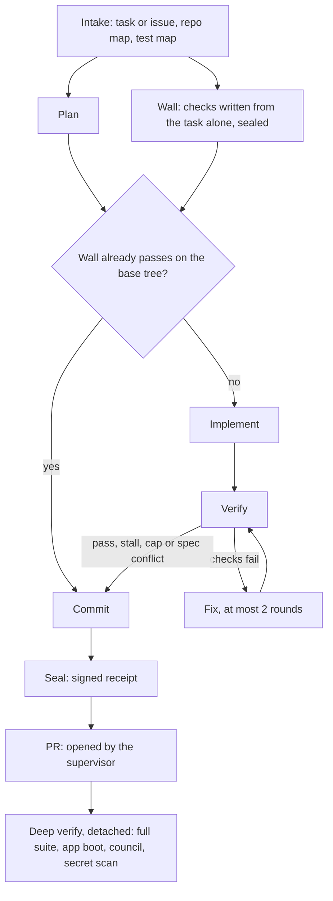

Your agent says done. Loki proves it.

An autonomous software factory that knows what it is supposed to deliver, and proves it did.

[](https://www.npmjs.com/package/loki-mode)
[](https://www.npmjs.com/package/loki-mode)
[](https://hub.docker.com/r/asklokesh/loki-mode)
[](LICENSE)

[Website](https://www.autonomi.dev/) | [Documentation](wiki/Home.md) | [Installation](docs/INSTALLATION.md) | [Changelog](CHANGELOG.md)

Loki Mode is a free, source-available autonomous coding agent by [Autonomi](https://www.autonomi.dev/). Hand it a PRD, GitHub issue, OpenAPI doc or one-line brief. It derives a delivery contract (the acceptance criteria), builds against it, and ends with a signed Evidence Receipt that states what was proven and what was not. If the contract cannot be derived, it stops and asks one question instead of guessing.

Before a build counts as done, a review council selects reviewers from a specialist pool (`agents/types.json`, scored by `run.sh:FOCUS_KEYWORDS`). The bundled MCP server exposes 39 tools over stdio (`mcp/server.py`), including `loki_v10_run`, `loki_v10_status` and `loki_v10_verify` to start a Loki 10 run in the background, read its phase, verdict and cost, and verify its receipt (`BLOCKED` runs report their question). Add it with `claude mcp add loki-mode -- python3 -m mcp.server` from the install directory.

## Contents

- [Install](#install)
- [Loki 10 engine](#loki-10-engine)
- [Outcomes and exit codes](#outcomes-and-exit-codes)
- [Signed receipts and loki verify](#signed-receipts-and-loki-verify)
- [Quiet output](#quiet-output)
- [Release channels: next and latest](#release-channels-next-and-latest)
- [loki doctor](#loki-doctor)
- [Modernization: status of loki modernize](#modernization-status-of-loki-modernize)
- [Providers](#providers)

## Install

```bash
bun install -g loki-mode          # recommended (npm, Homebrew, Docker below)
loki doctor                       # checks your setup, names any blocker
```

| Method | Command | Notes |
|--------|---------|-------|
| **Bun (recommended)** | `bun install -g loki-mode` | Fastest startup for CLI commands. |
| **npm** | `npm install -g loki-mode` | Works without Bun (bash fallback). Migrate any time with `loki self-update --to bun`. |
| **Homebrew** | `brew tap asklokesh/tap && brew install loki-mode` | Auto-installs Bun as a dependency. |
| **Docker** | `docker pull asklokesh/loki-mode:latest` | Bun and the Claude CLI pre-installed. See [DOCKER_README.md](DOCKER_README.md). |
| **No install** | `npx loki-mode tour` | Prints a real Evidence Receipt from a past build. No key, no spend, no network. |

Upgrade with `loki self-update`. Long form: [Installation Guide](docs/INSTALLATION.md). `npm install -g loki-mode` installs the `latest` dist-tag; see [Release channels](#release-channels-next-and-latest) for `next`.

**Loki needs a model to drive.** An `ANTHROPIC_API_KEY` alone is enough (the Claude Agent SDK ships inside Loki; on the legacy engine this path needs Bun and `LOKI_SDK_MODE=full`, see Setup details below), or point it at Claude Code, Cline, Codex, Aider or opencode. `loki doctor` tells you exactly what is missing.

```bash
export ANTHROPIC_API_KEY=sk-...
loki doctor
loki quick "fix the login bug"   # one small task on the Loki 10 engine, no PR
loki "fix the login redirect loop" --no-pr   # any task, Loki 10 engine
loki owner/repo#123              # one GitHub, GitLab or Jira issue to a pull request, Loki 10 engine
```

<details>
<summary>Claude Code plugin (adds /loki-grill, /loki-spec-status, /loki-verify)</summary>

```bash
claude plugin marketplace add asklokesh/loki-mode
claude plugin install loki-mode@loki-mode
```

Adds three slash commands and the Loki MCP server (memory, task queue, code search, build management) to Claude Code. It calls the CLI rather than bundling it, so install `loki-mode` above first. Verify with `claude plugin list`: a healthy install reports `Status: enabled`.

</details>

loki-seal is a Claude Code Stop hook that runs your repo's real test suite when the agent tries to finish and refuses "done" if tests newly fail or tests or CI config were deleted, skipped or weakened (details: [packages/loki-seal/README.md](packages/loki-seal/README.md)). Install it from the repository's plugin marketplace:

```
/plugin marketplace add asklokesh/loki-mode
/plugin install loki-seal@loki-mode
```

## Loki 10 engine

Loki 10 is the default engine for `loki "<task>"`, `loki owner/repo#N` and `loki quick "<task>"`. <!-- loki10-default -->

Guide, provider table and summary format: [docs/v10/GUIDE.md](docs/v10/GUIDE.md).

```
loki "fix the login redirect loop" --no-pr
```

```
loki owner/repo#123
```

The v10 engine accepts a quoted multi-word task, a GitHub, GitLab or Jira issue reference, `status`, `verify`, `dashboard`, and other subcommands. Flags (`loki-ts/src/engine10/cli.ts` USAGE): `--no-pr` builds and verifies without opening a pull request, `--deep` requests the deep verify pass and a longer implement budget, `--provider <name>` picks the coding provider, `--max-cost <usd>` sets the per-run cost cap (default $20.00, or `budgets.per_run` in `loki.yaml`; the flag wins; the start line prints it as `cap $20.00 (default)`; reaching it ends the run BUDGET_STOP, exit 3) (`--json` and `--verbose` are also parsed by the supervisor, see [Quiet output](#quiet-output)). The engine needs Bun; without it the command exits 1 with a message and installation instructions.

**Legacy engine (being removed).** The previous engine still ships in 10.6.6 and is reachable with `LOKI_ENGINE=legacy` or `loki legacy <args>`. `loki start owner/repo#N`, `loki start <issue URL>` and `loki start "<multi-word task>"` run on Loki 10, the same as `loki owner/repo#N` and `loki "<task>"`; `loki start ./prd.md`, a flag-first call and a one-word start stay on the legacy engine. For many issues use `loki backlog owner/repo --all|--label X|--issues N,N` (many issues, N in parallel, each on a `loki/backlog-N` worktree branch) instead. Legacy removal is planned and resumes on 2026-10-07; see [docs/v10/LEGACY-REMOVAL.md](docs/v10/LEGACY-REMOVAL.md). Sections below marked "legacy" describe features that run only on that engine.

### The state machine

Every run starts from an explicit delivery contract and is judged only against it. The stage table lives in `loki-ts/src/engine10/machine.ts` (`FLOW`), the stages in `loki-ts/src/engine10/stages/`.


```mermaid
flowchart TD
    A[Intake: task or issue, repo map, test map] --> P[Plan]
    A --> W[Wall: checks written from the task alone, sealed]
    P --> G{Wall already passes on the base tree?}
    W --> G
    G -- yes --> C[Commit]
    G -- no --> I[Implement]
    I --> V[Verify]
    V -- checks fail --> F[Fix, at most 2 rounds]
    F --> V
    V -- pass, stall, cap or spec conflict --> C
    C --> S[Seal: signed receipt]
    S --> R[PR: opened by the supervisor]
    R --> D[Deep verify, detached: full suite, app boot, council, secret scan]
```

| Stage | What it does |
|-------|--------------|
| intake | Reads the task or issue, builds the repo map and the test map. |
| plan and wall | Run in parallel. Plan decides the approach. The Wall author sees only the task and the repo map, never the code, and writes `loki_wall_*` tests that are sealed (sha256) before implement. If they already pass on the untouched base tree, the run ends early as ALREADY_SATISFIED. |
| implement | A provider session makes the change, under a time budget (480s default, 1800s with `--deep`). |
| verify and fix | Runs the checks. Failures feed up to 2 fix rounds (`MAX_FIX_ROUNDS`). The same failures three verifies running end the run as STALLED. |
| commit and seal | Commits the diff, then writes `.loki/runs/<run-id>/receipt.json` and `receipt.md`, signed by default. |
| pr | Opened by the supervisor, not the worker (the worker never holds a GitHub token). A non-VERIFIED run opens a draft PR. The body is written for a 60-second review: what the issue asked, what changed, how it was tested, NOT PROVEN, then the receipt digest and `loki verify`. Data the run did not record prints "not recorded". |
| deep verify | Detached, started after the PR opens (so not with `--no-pr`): full suite, app-boot probe, council, secret scan. A check that is refused or unavailable is reported as NOT PROVEN, never as red. `--deep` is a separate flag that raises the implement and run budgets. |

Warm start (experimental, `LOKI_SPEED=1`, off by default): `loki engine10 dashboard` also serves a unix socket at `~/.loki/run/engine.sock` (override with `LOKI_WARM_SOCK`) that keeps the repo map and test map in memory, keyed by the tree SHA plus a hash of dirty files, so an edit invalidates them. A run tries the socket for 50ms and prints `warm in Xs` when it answers; with no daemon it runs the cold path with identical events.

PR body sample (`loki-ts/src/e10ext/reviewer_body.ts`):

```
## What the issue asked
- handles empty input
- rejects bad tokens

## What changed and why
- Why: Fix the parser
- src/parser.ts
- tests/parser.test.ts

## How it was tested
- Verdict: VERIFIED
- Checks: 2 passed, 0 failed, 0 not run, 0 flaky (4 individual tests counted)
- Command: `bun test tests/parser.test.ts` -> pass
- Target tests (written before the fix): parser.test.ts
- Before the fix: 2 failing, 0 passing on base; after: pass

## NOT PROVEN
- none

## Receipt
- Digest: sha256:ab12... (signed)
- Verify: `loki verify run-1`
```

The run cap is 900s (2700s with `--deep`, `DEFAULT_CAP_S` and `DEEP_CAP_S` in `types.ts`); commit, seal and pr still run after the cap fires. A run whose cap fired and which did not verify exits BUDGET_STOP.

A finished run prints a short summary (see [Quiet output](#quiet-output), which also shows an example) whose `NOT PROVEN` line is never empty by omission: deep checks deferred to the deep-verify pass are always listed there.

`loki status [run-id]` and `loki verify [run-id]` are built on the v10 path (bare `loki verify` follows the newest run, v10 or legacy). `loki dashboard` and `loki status` reach the v10 commands with `LOKI_ENGINE=v10`. Two-way Slack (`loki slack serve`) is on by default and documented in [docs/slack.md](docs/slack.md); outbound notifications use `LOKI_SLACK_WEBHOOK_URL`.

## Run from Jira or Linear

Loki 10 can start from a Jira or Linear issue the same way it starts from a GitHub issue: same run, same receipt. The issue is fetched deterministically before any model runs and normalized into the same `issue.json`, with a `source` field of `jira` or `linear`.

```bash
loki jira:PROJ-123     # or https://<site>.atlassian.net/browse/PROJ-123
loki linear:ENG-42     # or a linear.app issue URL
```

- Jira needs `JIRA_EMAIL` and `JIRA_API_TOKEN`, plus `JIRA_BASE_URL` (for example `https://acme.atlassian.net`) unless you pass the full browse URL. The ADF description is converted to plain text.
- Linear needs `LINEAR_API_KEY`.
- A missing variable stops the run before any work with an error naming it (exit code 2, like other intake errors). GitHub refs are unchanged.
- Self-hosted Jira: `<JIRA_BASE_URL>/browse/KEY` is accepted when its origin matches `JIRA_BASE_URL`. `LOKI_TRACKER_INTAKE=0` turns tracker intake off. Intake only, no sync. Details: [docs/trackers.md](docs/trackers.md).

## Two-way Slack

Two-way Slack is on by default. With `SLACK_BOT_TOKEN` and `SLACK_SIGNING_SECRET` in the environment, `loki slack serve --port N` (127.0.0.1 by default) lets you mention `@loki <issue ref or task>` in a Slack thread to start a run, and a BLOCKED question is answered in the same thread. With either variable missing it prints one line naming both and exits 2 without binding a port. Set `LOKI_SLACK_INBOUND=0` to disable it. See [docs/slack.md](docs/slack.md) for the scopes.

## Spec to contract

On by default; set `LOKI_CONTRACT=0` to turn it off. It does nothing unless `.loki/contract.json` exists. `loki contract <spec.md>` parses a spec or PRD into numbered acceptance criteria (AC-1, AC-2, up to 50) from checklist items (`- [ ]`) and from bullets and numbered lists under headings such as "Acceptance criteria", "Requirements" or "Must", prints them, and writes `.loki/contract.json` at the repo root. When a run seals with a contract present, each criterion is matched to changed files and checks by keyword overlap and recorded in an optional `contract` field on the receipt (`keyword_match` or `no_match`). Unmatched criteria are listed under NOT PROVEN in the receipt and the PR body (advisory only, the verdict is unchanged). Keyword overlap is a heuristic: `keyword_match` means a changed file plausibly relates to the criterion, not that the criterion is proven. The legacy PRD path is unchanged.

## Triggers without a cloud

Both run on your own GitHub Actions minutes; there is no hosted service.

- Issue to PR: copy `.github/workflows/loki-issue-to-pr.yml` into your repository. Label an issue `loki`, or comment `/loki` as an owner, member or collaborator, and it runs `loki owner/repo#N` (the Loki 10 engine) and opens a pull request with an evidence receipt. The agent job holds a read-only token; a separate publish job opens the PR. Set `ANTHROPIC_API_KEY` in repository secrets.
- Nightly backlog: copy `examples/loki-nightly-backlog.yml` into `.github/workflows/`. Its `schedule:` trigger runs `loki backlog owner/repo --label loki`, one Loki 10 run per labeled open issue:

```yaml
on:
  schedule:
    - cron: '17 3 * * *'   # nightly, 03:17 UTC
# ...
      - run: loki backlog "${GITHUB_REPOSITORY}" --label loki --concurrency 2
```

`loki backlog` also takes `--all`, `--issues 1,2,3` and `--dry-run`. The nightly job runs the agent and a write token together, so label only issues you trust.

## Outcomes and exit codes

A v10 run ends in exactly one outcome. The mapping is `EXIT` in `loki-ts/src/engine10/output.ts`.

| Exit | Outcome | Meaning |
|------|---------|---------|
| 0 | VERIFIED | The contract's checks ran and passed. |
| 0 | ALREADY_SATISFIED | The work was already done; evidence is recorded. |
| 1 | FAILED | A check failed, the stage failed, or the event log was modified outside the engine. |
| 2 | (usage) | No task given, not inside a git repository, or a preflight refusal. Nothing ran. |
| 3 | BUDGET_STOP | The cost cap (`--max-cost`, `budgets.per_run`, default $20.00) or the time cap fired before the work finished. |
| 4 | BLOCKED | Spec conflict: the contract cannot be satisfied as written. The summary names the conflict (`spec conflict: <reason>`); the run never guesses and calls it done. |
| 5 | STALLED | The same failures three verifies in a row. |

Severity rises with the code, so `[ $rc -ge 2 ]` always means worse than FAILED. The full table for other commands (`loki verify`, `loki proof verify`, `loki ci`, `loki doctor`, `loki start`) is in [docs/exit-codes.md](docs/exit-codes.md); that page does not yet list the v10 run ladder above, which is read from the code.

Known gap: the legacy `loki verify` exit table in `docs/exit-codes.md` lists four inputs that do not yet return the documented target. They are tracked as pending moat cases.

## Signed receipts and loki verify

Every sealed v10 run writes a receipt to `.loki/runs/<run-id>/receipt.json`. `receipt_sha256` hashes the canonical JSON without the `verification` block, so verifying never trusts the receipt's own signature field to compute the hash it checks.

Receipts are signed by default. On the first run Loki generates an Ed25519 key at `~/.loki/keys/receipt-ed25519.pem` (mode 0600, directory 0700), or you supply your own with `LOKI_RECEIPT_SIGNING_KEY` or `LOKI_RECEIPT_SIGNING_KEY_FILE`. See [docs/SIGNED-RECEIPTS.md](docs/SIGNED-RECEIPTS.md).

```
loki verify
```

`loki verify [run-id]` (latest run by default) re-hashes the receipt, checks the signature against your local key (and retired keys listed in `LOKI_RECEIPT_RETIRED_PUBKEYS`), and checks the receipt against the event log. Verdicts and exit codes (`loki-ts/src/engine10/verify_cmd.ts`):

| Verdict | Exit | Meaning |
|---------|------|---------|
| VERIFIED | 0 | Hash and signature check out. |
| UNSIGNED | 3 | The receipt carries no signature, so its integrity is not attested and `loki verify` refuses it. Pass `--allow-unsigned` (or set `LOKI_VERIFY_ALLOW_UNSIGNED=1`) to accept it and exit 0; the output still says UNSIGNED. A receipt whose body was edited and whose signature was stripped reads UNSIGNED. |
| TAMPERED | 1 | The hash, the signature, or the event log does not match. |
| UNCHECKED | 2 | The signature cannot be checked here, for example the signing key is on another machine. |
| (no runs) | 66 | No receipt to verify. |

A verified receipt is bound to the run's event log, so a receipt lifted out of its run, or a log edited after sealing, does not verify. Signing proves the receipt came from the key holder; it does not prove the generated code is bug-free. A receipt only claims what its checks ran, and states what they did not.

### Visual evidence (opt-in)

With `LOKI_VISUAL_EVIDENCE=1`, a v10 run that changed web page files (html, jsx, tsx, vue, svelte under app/, pages/, src/ or public/) starts the repo's dev, preview or start script and screenshots each changed route with the repo's own Playwright (nothing is downloaded) into a fresh per-run directory `.loki/runs/<run_id>/evidence/<random>/` (at most 5 routes, total capture budget 25s, aborted with the seal stage). API-only repos with an openapi file get an HTTP transcript at `.loki/runs/<run_id>/evidence/<random>/http.json` (not hashed into the receipt). Each screenshot's sha256 is recorded in the receipt as `evidence_screens`, the PR body gets an Evidence section, and `loki verify` reports TAMPERED if a recorded screenshot is altered, missing or a symlink. Capture never fails the run; a skip is listed in NOT PROVEN. Off by default.

## Quiet output

The v10 run is quiet by default: no stage chatter, only the final summary. `--verbose` tails the event stream live (one line per finished stage and a heartbeat with elapsed time and the running diff size). `--json` prints one JSON object (`ok`, `outcome`, `stop`, `run_id`, `receipt_sha256`) instead of text.

The summary is one outcome line, an optional reason on a non-VERIFIED run, then the PR, the receipt, what was NOT PROVEN, the cost and the time (`formatSummary` in `output.ts`):

```
Outcome:    VERIFIED
PR:         https://github.com/owner/repo/pull/1
Receipt:    sha256:2f9a41c7e0b3...
NOT PROVEN: full suite, app boot, council, security scan
Cost:       $0.42 (claude, 212k tokens)
Time:       4m12s (intake 11s, plan 20s, implement 3m10s, verify 31s)
```

Cost is the provider-reported figure. When a provider does not report cost the line reads `not measured`, never `$0.00`. The legacy `loki quick` is also quiet by default; `--verbose` or `LOKI_VERBOSE=1` shows setup and progress.

## Release channels: next and latest

Releases are built in slices and shipped in trains: green slices merge, one train is pushed, and the release workflow publishes the exact tested tree to the npm `next` dist-tag. `latest` moves only through the promote workflow (`.github/workflows/promote.yml`), which installs that exact version from npm, runs the first-run gate on it (`scripts/first-run-gate.sh --installed`), and only then moves `latest`, Docker `:latest` and the Homebrew formula. A version whose commit is not an ancestor of main can never become `latest`.

The first-run gate runs the README's default entry point for a new user on a throwaway repo with a throwaway HOME and a stub provider, and asserts the run is honest: the exit code matches the result, tests are green, only the fix file changed, the printed digest equals what `loki verify` checks, the receipt is signed, output stays short, and a run that skips the target test does not end VERIFIED.

Policy (D49): every green release is promoted to `latest` after the automated first-run gate. The promote workflow runs automatically after Post-Release Smoke succeeds; a failed smoke or gate leaves the version on `next`. `workflow_dispatch` remains for manual runs of an exact version.

## loki doctor

```bash
loki doctor            # human-readable check of prerequisites and providers
loki doctor --json     # machine-readable; JSON is emitted in full even on failure
loki doctor --airgap   # audit network egress and how to disable each
```

Exit 0 when every required check passes; optional warnings (an absent provider CLI) do not fail it. It checks the required tools, the provider CLIs and your login, and says what to install for each gap. The same contract holds for `--json`, so it is usable as an init-container or CI preflight gate.

## Modernization: status of loki modernize

Migration: `loki modernize heal <repo> --assess` was a legacy command for read-only analysis. The v10 path `loki modernize <repo> --to <target>` is not yet finished: only `--dry-run` works (inventory, dependency graph, unit clustering, cost, time and risk estimate). A real run stops after the estimate and prints `modernize: oracle capture and execution are not built yet; use --dry-run`. Targets `python3` and `java21` exist; the Java dependency graph is not wired in yet. Design: [docs/v10/MODERNIZE.md](docs/v10/MODERNIZE.md), user summary: [docs/v10/GUIDE-MODERNIZE.md](docs/v10/GUIDE-MODERNIZE.md).

## Control Plane v0

A local control plane and UI for many runs, on by default. Turn it off with `LOKI_CONTROL=0`:

```bash
loki control serve                       # 127.0.0.1, default port 47821 (--port N, --db PATH)
loki control backfill .                  # ship ./.loki/runs to the control plane
loki control status                      # reachable? how many runs held?
```

The URL comes from `LOKI_CONTROL_URL`, else `http://127.0.0.1:${LOKI_CONTROL_PORT:-47821}`. While `loki control serve` is running, runs on this machine ship to it automatically (it publishes `~/.loki/control/instance.json`, mode 0600, removed on exit); a run never starts the server. Set `LOKI_CONTROL_URL` to ship elsewhere. See [docs/v10/CONTROL-PLANE.md](docs/v10/CONTROL-PLANE.md).

Answering a BLOCKED run: when a run stops on a spec conflict, its run page shows the question and an answer box. Submitting posts to `POST /v1/runs/<source>/<run>/answer` (JSON `{"answer": "..."}`, up to 4000 characters, loopback only) and writes `~/.loki/control/answers/<source>/<run>.answer.txt` (override the directory with `LOKI_CONTROL_ANSWER_DIR`). The page prints the resume command, `loki answer <run>`, which starts a fresh run carrying the task, the question and that file's text (or pass `--text "..."` yourself; with no run id it picks the newest BLOCKED run). A run that is not BLOCKED exits 2.

Set `LOKI_CONTROL_DEFAULT=1` (off by default) to make `loki dashboard`, `loki dashboard start` and `loki dashboard open` start the Control Plane instead of the old dashboard. The old dashboard is unchanged when the flag is unset.

Container, Helm and ECS deployment: [docs/control-plane-container.md](docs/control-plane-container.md).

## Providers

Loki's autonomy and quality loop are the product; the coding CLI is swappable. With `LOKI_PROVIDER` unset, Loki auto-detects the first installed provider in this order (`providers/loader.sh`): claude, cline, codex, aider, opencode. An explicit choice always wins and is never silently substituted. Gemini CLI is deprecated: `LOKI_PROVIDER=gemini` exits with a migration message.

| Provider | Tier | Autonomous flag | Parallel | v10 engine cost and kill-blocking | Install |
|----------|------|-----------------|:--------:|:---------------------------------:|---------|
| **Claude Code** | 1, full support | `--dangerously-skip-permissions` | Yes | measured, enforced | `npm i -g @anthropic-ai/claude-code` |
| **Cline CLI** | 2, reduced | `-y` | Sequential | not measured, not enforced | `npm install -g cline` |
| **Codex CLI** | 3, degraded | `exec --sandbox workspace-write --skip-git-repo-check` | Limited (2) | not measured, not enforced | `npm i -g @openai/codex` |
| **Aider** | 3, degraded | `--yes-always` | Sequential | not measured, not enforced | `pip install aider-chat` |
| **opencode** | model-agnostic | `--auto` | Sequential | not supported by the v10 engine | `npm install -g opencode-ai` |

Claude Code is the provider Loki is built for and the one that is run end to end by us. The others are wired in but are experimental. On a non-Claude provider the v10 summary says so: the Cost line reads `not measured` and NOT PROVEN adds `kill blocking not enforced`. See [Provider Guide](skills/providers.md).

---

## Try it first, without installing

```bash
npx loki-mode tour                # no install, no API key, no spend, no network
```

Prints a real Evidence Receipt from a past build, headline and all:

```
Headline: VERIFIED WITH GAPS

| Fact          | Value                                    |
| Files changed | 8                                        |
| Diff sha256   | c2be6fff3e774c387f276277b25fc424f07b667… |
| Tests         | verified (node-test)                     |
| Build         | not_run                                  |
| Security      | findings                                 |
| Cost          | $10.3218                                 |
```

**"WITH GAPS" is the point.** Build was not run, security has findings, and the receipt says so on its own front page. Recompute the diff hash yourself and check it matches.

## Loki does not lie about "done"

Most coding agents declare a task done by telling you so in a transcript. The
transcript is the agent's own narration; there is nothing to check. Loki Mode
takes a different stance: it does not call work done until the work is verified,
and every build produces an **Evidence Receipt** you can re-verify yourself.

The receipt separates two things most tools blur together:

- **Facts** -- deterministic, non-LLM, and re-derivable by anyone: the git diff
  (base/head SHAs, file/insertion/deletion counts, a `diff_sha256`), the test
  command that ran with its exit code, the build command with its exit code, and
  each quality-gate verdict. A skeptic can recompute every one of these from the
  same repo state.
- **Assessments** -- AI judgments such as the review council's verdict. These are
  labeled explicitly as judgment, not proof, and never make the headline green on
  their own.

The receipt's headline is computed only from the facts:

- **VERIFIED** -- tests recorded a real command, ran, and exited 0; the diff is
  non-empty; nothing was skipped.
- **VERIFIED WITH GAPS** -- some facts checked out, but something was not run or
  was inconclusive. Every gap is listed by name, so silence never reads as a pass.
- **NOT VERIFIED** -- a test, build, or gate ran and failed (or there was nothing
  to verify).

This is honesty-of-done, not a claim of perfection. The receipt proves the
completion claim is backed by deterministic evidence and is independently
re-checkable; it does not claim the generated code is bug-free.

<details>
<summary><b>Setup details: providers, other models, what loki doctor checks (PRD-file examples use the legacy `loki start`)</b></summary>

The `loki start <file>` examples below run on the legacy engine (being removed). A `loki start` call with an issue ref, an issue URL or a quoted multi-word task runs on Loki 10; the provider and model variables apply to both engines. Other spec sources on the legacy engine:

```bash
loki init my-app --template simple-todo-app    # scaffold a starter PRD
loki start owner/repo#123                      # a GitHub issue (Loki 10; same as: loki owner/repo#123)
loki start ./openapi.yaml                      # an OpenAPI/YAML spec
loki demo --offline                            # replay a sample receipt, no key, no spend
```

Loki needs a model to drive. There are two ways to give it one.

**Without a separate CLI (v8).** The Claude Agent SDK ships inside Loki, so an API key alone is enough:

```bash
export ANTHROPIC_API_KEY=sk-...               # or ANTHROPIC_AUTH_TOKEN / ANTHROPIC_BASE_URL
LOKI_SDK_MODE=full loki start prd.md          # runs the loop and the judges through the bundled SDK
```

This needs Bun on your PATH (the SDK loop runs on the Bun runtime). `loki doctor` reports `Bundled Claude Agent SDK is usable -- no separate CLI needed` when that path is genuinely ready, and stays on the normal blocker otherwise: it checks that the SDK's platform binary is actually extracted, that credentials are present, and that the SDK loop is really the route your next run will take. It will not tell you that you are ready and then fail the build.

**With a coding-agent CLI.** The classic path, and still the default: Loki drives a separate CLI (Claude Code is the recommended one) plus a couple of common tools on your PATH.

**With a different model or provider.** Loki is not tied to Anthropic, but
*how* you reach another model depends on which API the endpoint speaks. There
are two routes, and picking the wrong one fails confusingly.

*Route 1 -- OpenAI-shaped endpoints (OpenRouter, and most hosted open models).*
Use a provider that speaks that API natively. `aider` and `cline` both do, and
Loki now defaults them to open-weight models rather than Claude:

```bash
loki provider set aider
export OPENROUTER_API_KEY=sk-or-...
loki start prd.md                          # defaults to deepseek-v3.2

export LOKI_AIDER_MODEL=openrouter/z-ai/glm-4.6   # or pick your own
```

OpenRouter serves **only** the OpenAI-shaped `/v1/chat/completions`; it has no
Anthropic `/v1/messages` endpoint. Pointing `ANTHROPIC_BASE_URL` at it does not
work, which earlier versions of this README incorrectly suggested.

[OrcaRouter](https://www.orcarouter.ai) is an OpenAI-compatible gateway that
also serves the Anthropic Messages API, so unlike OpenRouter the same key works
through Route 2 below as well as Route 1 here.

*Route 2 -- Anthropic-protocol gateways.* `ANTHROPIC_BASE_URL` routes Claude
Code itself, so the endpoint must speak the Anthropic Messages API. LiteLLM,
Bedrock proxies, and self-hosted gateways can:

```bash
# Ollama, fully local (no API key, no per-token cost)
export ANTHROPIC_BASE_URL=http://localhost:11434/v1
export LOKI_MODEL_OVERRIDE=<model you have pulled, e.g. the output of `ollama list`>
loki start prd.md

# LiteLLM / vLLM / any self-hosted gateway
export ANTHROPIC_BASE_URL=https://your-gateway.internal/v1
export ANTHROPIC_API_KEY=...
export LOKI_MODEL_OVERRIDE=<whatever your gateway calls the model>
loki start prd.md

# OrcaRouter (one key for both routes; model ids are namespaced by provider).
# The bare host is deliberate here: the Anthropic SDK appends /v1/messages
# itself, so adding /v1 would double it.
export ANTHROPIC_BASE_URL=https://api.orcarouter.ai
export ANTHROPIC_API_KEY=sk-orca-...
export LOKI_MODEL_OVERRIDE=<namespaced id, e.g. anthropic/claude-sonnet-5>
loki start prd.md
```

**Set both variables.** `LOKI_MODEL_OVERRIDE` is what makes the alt-provider
path work: without it Loki keeps asking for `opus` / `sonnet` / `haiku`, which
only Anthropic resolves, and most providers reject those names outright. A
proxy that maps the aliases for you (LiteLLM can) is the one exception.

Model IDs are not listed here on purpose -- OpenRouter's catalogue changes every
week, and a stale ID in a README is a failure you would hit at runtime. Take the
exact string from your provider's own model list.

Both routes honor these variables identically -- the bundled-SDK path and the
Claude Code CLI path -- and `loki doctor` reports the endpoint it detected plus a
warning if the model override is missing.

The quality gates, the completion council, and the Evidence Receipt do not care
which model produced the code. They check what was actually built.

Either way, run `loki doctor` any time and it tells you exactly what is present and what is missing, with a copy-pasteable install command for each gap.

**What Loki needs (and what `loki doctor` checks)**

Required:

- An agent provider CLI: [Claude Code](https://docs.claude.com/en/docs/claude-code) (`claude`, Tier 1, recommended and E2E-verified - the provider Loki Mode is built for). Cline, Codex, Aider, and opencode are supported as experimental providers (wiring in place; not yet E2E-verified by us). Loki cannot run a build without one of these installed and authenticated.
- Python 3.8+ (`python3`) for the dashboard, memory system, and orchestration helpers.
- Node.js 20+ (`node`) for the npm install path and the bundled runtime.
- `jq` for the JSON that the shell flows and the quality gates parse.
- Git 2.x (`git`) for checkpoints and worktrees.
- `curl` for installation and network calls.

Recommended:

- Bun 1.3.0+ (`bun`) for the fast runtime (the recommended install path above installs it).
- Docker if you want Loki's App Runner to run containerized projects, or to run Loki itself from the published image.

You also need credentials for whichever provider you use (for Claude Code, an authenticated `claude` login or `ANTHROPIC_API_KEY`). `loki doctor` flags a missing or unauthenticated provider as the first thing to fix.

If you do not have Bun yet:

```bash
curl -fsSL https://bun.sh/install | bash       # macOS / Linux (or: brew install oven-sh/bun/bun)
```

Docker without installing loki locally: `loki docker start prd.md` runs it in the
published image with zero config, bind-mounting the current folder so `.loki`
state and resume work exactly like local. See [DOCKER_README.md](DOCKER_README.md).

Upgrading: `loki self-update` auto-detects which package manager installed loki
and runs the right upgrade. `loki self-update --to bun` migrates an npm install
to Bun in one command. `loki self-update --check` shows the install path.

See the [Installation Guide](docs/INSTALLATION.md) for the long form.

</details>

---

<details>
<summary><strong>Runtime architecture: dual Bash/Bun runtime</strong></summary>

The Loki 10 engine runs on the Bun runtime. The legacy engine is Bash (`autonomy/loki`) and is being removed.

- Commands that require Bun: `version`, `--version`, `-v`, `status`, `stats`, `doctor`, `provider`, `memory`, `rollback`, `kpis`, `trust`, `wiki`, `crash`, `internal`, and `report kpis`.
- If `bun` is not on `PATH`, commands exit 1 with installation instructions.
- For troubleshooting, force commands onto alternate paths with environment variables; see `loki doctor` for available options.

See [UPGRADING.md](UPGRADING.md) and [ADR-001: Runtime Migration](docs/architecture/ADR-001-runtime-migration.md).

</details>

<details>
<summary><strong>Supported spec formats (legacy engine, being removed)</strong></summary>

Loki 10 takes a quoted task or an issue reference (GitHub, GitLab or Jira), also through `loki start`. The table below describes the legacy `loki start`, which accepts files too; rows for an issue ref or an issue URL run on Loki 10. A "spec" is whatever you hand `loki start`. Loki auto-detects the format and normalises it before the RARV loop. A Markdown PRD is one form of spec; the table below lists every input the CLI accepts.

| Format | Example | Notes |
|--------|---------|-------|
| Markdown PRD | `loki start ./prd.md` | Canonical form. Headings become section anchors. |
| JSON spec | `loki start ./spec.json` | Free-form JSON; keys surfaced to agents. |
| YAML spec | `loki start ./openapi.yaml` | OpenAPI / AsyncAPI / plain YAML all accepted. An OpenAPI/GraphQL/Postman contract expands into a per-operation build checklist (one item per operationId/field/request) so no operation is lost to prompt truncation (v8.0.0). |
| Plain text brief | `loki start ./brief.txt` | One-paragraph briefs work; complexity auto-detects to "simple". |
| GitHub issue URL | `loki start https://github.com/owner/repo/issues/42` | Title + body + labels become the spec. |
| GitHub shorthand | `loki start owner/repo#42` | Same as above, shorter. |
| Jira ticket key | `loki start PROJ-456` | Requires `JIRA_BASE_URL` + `JIRA_TOKEN` env vars. |
| GitLab / Azure DevOps URL | `loki start https://gitlab.com/group/proj/-/issues/7` | GitLab and Azure DevOps issue URLs both supported. |
| Bare issue number | `loki start #123` or `loki start 123` | Resolved against the current repo's `origin` remote. |
| OpenSpec change directory | `loki start --openspec ./openspec/change-001` | Reads OpenSpec change manifest + delta files. |
| Auto-detect (no input) | `loki start` | Picks up `./prd.md`, `./spec.{json,yaml,yml}`, or `./SPEC.md` from cwd. |

All formats land in the same RARV pipeline and pass the same 8 quality gates (`skills/quality-gates.md`).

</details>

---

For how Loki compares with other tools, see [docs/COMPARISON.md](docs/COMPARISON.md) and [docs/EVALUATING.md](docs/EVALUATING.md).

---

## CLI Reference

<details>
<summary><strong>All commands</strong></summary>

Loki 10 engine:

| Command | Description |
|---------|-------------|
| `loki "<task>" [--no-pr] [--deep] [--provider NAME] [--max-cost USD]` | Build a task, verify it, seal a signed receipt, open a PR |
| `loki owner/repo#N` | Same, from a GitHub, GitLab or Jira issue |
| `loki quick "<task>"` | Small task, lean path, no PR |
| `loki backlog owner/repo --all\|--label X\|--issues N,N` | Run every matching open issue, N in parallel (`--concurrency N`, `--dry-run`) |
| `loki workspace list \| run <name> <ref>` | Experimental (`LOKI_WORKSPACES=1`): run one issue across the repos of a `loki.yaml` workspace; see [docs/WORKSPACES.md](docs/WORKSPACES.md) |
| `loki status [--json]` | Current status |
| `loki verify [run-id]` | Re-check a sealed receipt (exit codes above) |
| `loki doctor [--json] [--airgap]` | Check environment and providers |
| `loki control serve\|backfill\|status` | Control Plane server, ship existing runs, reachability check (on by default; `LOKI_CONTROL=0` turns it off) |
| `loki modernize <repo> --to <target> --dry-run` | Estimate only |
| `loki plan [PRD]` | Dry-run analysis: complexity, cost, execution plan |
| `loki version` | Show version |

Legacy engine, being removed (these run on the previous engine; `loki --help` still lists them):

| Command | Description |
|---------|-------------|
| `loki start [PRD\|ISSUE-REF\|"TASK"]` | An issue ref, an issue URL or a quoted multi-word task runs on Loki 10 (same as `loki owner/repo#N`); a PRD file, a flag-first call or a one-word start runs the legacy build |
| `loki stop`, `pause`, `resume` | Control a legacy run |
| `loki steer "<note>"` | Nudge a legacy run (needs `LOKI_PROMPT_INJECTION=1`) |
| `loki why`, `loki next` | Explain or continue a legacy run |
| `loki dashboard` | Operations UI server (`start\|stop\|status\|url\|open`) |
| `loki review`, `loki test`, `loki analyze`, `loki memory`, `loki failover`, `loki enterprise`, `loki import`, `loki ci` | Review, test generation, codebase analysis, memory, failover, enterprise, issue import, CI gate |
| `loki modernize heal <path>` | Legacy system healing |

</details>

Run `loki --help` for all options. Full reference: [CLI Reference](wiki/CLI-Reference.md) | Config: [config.example.yaml](autonomy/config.example.yaml)


Pass a config file to `loki start` with `--config <path>` (aliases `--env-file`, `--vars`), or set `LOKI_CONFIG_FILE`. The format is detected from the extension or content: `.yaml`/`.yml`, `.json`, or `.env` (flat `LOKI_*=value` lines). A CLI flag beats an ambient env var, which beats the `--config` file, which beats built-in defaults. Never inline a secret; reference an env var with `${VAR}`. Manage settings with `loki config show|init|edit|path|set|get`; a sample is in [autonomy/config.example.yaml](autonomy/config.example.yaml).

---

<details>
<summary><strong>Configuration env vars (legacy engine knobs, opt-out)</strong></summary>

Loki Mode's accuracy and autonomy behaviors are default-on. Each is an opt-out escape hatch, not a setting you have to discover. The most relevant knobs from the v7.41.x accuracy/autonomy hardening:

| Env var | Default | Effect |
|---------|---------|--------|
| `LOKI_REVIEW_INCONCLUSIVE_BLOCK` | `1` | Blocks completion when a code-review round returns zero usable verdicts (an all-empty review proves nothing). Set `0` to record the inconclusive result without blocking. |
| `LOKI_COMPLETION_TEST_CAPTURE` | `1` | Captures fresh test results before the verified-completion evidence gate evaluates. Set `0` to skip the pre-gate capture. |
| `LOKI_AUTO_DOCS` | `true` | Generates the `.loki/docs/` suite before the documentation gate scores it (bounded: once per run when docs are missing, and again only when >10 commits stale). Set `false` to opt out. |
| `LOKI_CAVEMAN` | `1` (on) | Output-token compressor for free-form generation only (never trust-gate subcalls). Set `0` to opt out. |
| `LOKI_CAVEMAN_LEVEL` | inferred | Compression level for the compressor. Auto-inferred per invocation from the run's RARV tier; set explicitly (`lite` / `full` / `ultra`) to override the inference. |
| `LOKI_CONFIDENCE_SPIKE` | `1` (on) | Forces one EXTRA verification pass when the agent's self-reported confidence spikes, instead of trusting the claim. Strictly additive -- it can never skip a gate. Set `0` to opt out; tune with `LOKI_CONFIDENCE_SPIKE_DELTA` (default `40`) and `LOKI_CONFIDENCE_SPIKE_MIN` (default `90`). |
| `LOKI_GOAL_SCORING` | `1` (on) | Flags a goal with no measurable success condition and asks for a threshold, metric, or concrete artifact. Advisory only -- never blocks a build or rewrites the goal. Set `0` to opt out. |
| `LOKI_SMART_RETRY` | `1` (on) | Stops early on a positively-identified permanent failure (bad credentials, unknown model, exhausted quota) rather than burning retries. Unrecognized errors and rate limits still retry as before. Set `0` to retry every failure. |
| `LOKI_SIMPLE` | `0` (off) | EXPERIMENTAL. Strips the coaching half of the system prompt -- the RARV cycle, SDLC phases and memory habits that a frontier model already does natively. Per-iteration state (which gate failed, self-heal output, checklist status) is never touched, because that is information the model cannot derive. Measured at -78% prompt size, ~1562 tokens per iteration, on both the bash and Bun routes. INERT on degraded providers (Codex, Aider): those take an earlier return path whose prompt is already minimal by design, so the flag has nothing to strip there -- a measured zero, not an untested case. Whether it changes build speed or quality is NOT yet measured, so treat it as an experiment, not a tuning knob: run `benchmarks/run-prompt-ablation.sh` on your own workload before adopting it. |

This is a subset. See the [wiki](wiki/Home.md) for the full env-var reference and the RARV-C closure knobs (`LOKI_INJECT_FINDINGS`, `LOKI_OVERRIDE_COUNCIL`, `LOKI_AUTO_LEARNINGS`, `LOKI_HANDOFF_MD`).

</details>

<details>
<summary><strong>BMAD Method Integration (legacy engine, being removed)</strong></summary>

Loki Mode integrates with the [BMAD Method](https://github.com/bmad-code-org/BMAD-METHOD), a structured AI-driven agile methodology. If your project uses BMAD for requirements elicitation, Loki Mode can consume those artifacts directly:

```bash
loki start --bmad-project ./my-project
```

The adapter handles BMAD's frontmatter conventions, FR-format functional requirements, Given/When/Then acceptance criteria, and artifact chain validation. Non-BMAD projects are unaffected -- the integration is opt-in via `--bmad-project`.

See [BMAD Integration Validation](docs/architecture/bmad-integration-validation.md).

</details>

<details>
<summary><strong>Enterprise Features</strong></summary>

Enterprise features are free, included, and need no license key. They are activated with env vars. (Legacy engine surface, being removed with it.)

```bash
export LOKI_ENTERPRISE_AUTH=true                 # token auth (dashboard/auth.py)
export LOKI_OIDC_ISSUER=https://accounts.google.com
export LOKI_OIDC_CLIENT_ID=your-client-id        # OIDC needs issuer + client id
export LOKI_ENTERPRISE_AUDIT=true                # force audit logging on
export LOKI_TLS_CERT=/path/cert.pem              # HTTPS: set BOTH cert and key
export LOKI_TLS_KEY=/path/key.pem
loki enterprise status
```

[Enterprise Architecture](docs/enterprise/architecture.md) | [Security](docs/enterprise/security.md) | [Authentication](docs/authentication.md) | [Authorization](docs/authorization.md) | [Metrics](docs/metrics.md) | [Audit Logging](docs/audit-logging.md)

</details>


---

## Limitations

| Area | What Works | What Doesn't (Yet) |
|------|-----------|---------------------|
| **Code Gen** | Full-stack apps from PRDs | Complex domain logic may need human review |
| **Deploy** | Generates configs, Dockerfiles, CI/CD; `loki deploy` prints the exact deploy command | Does not deploy: a human runs the printed command (Loki never runs a cloud CLI or git push) |
| **Testing** | 8 automated quality gates | Test quality depends on AI assertions |
| **Providers** | Claude, Cline, Codex, Aider and opencode | Non-Claude providers are experimental and mostly sequential |
| **Dashboard** | Real-time single-machine monitoring | No multi-node clustering |
| **Loki 10** | The v10 run (`loki "<task>"`, `loki owner/repo#N`, `loki quick`), `status`, `verify`, `backlog` | `loki start <issue ref|issue URL|"task">` runs Loki 10, `loki start <file>` stays legacy; `loki modernize <repo> --to` runs `--dry-run` only; two-way Slack is on by default (`loki slack serve`, `LOKI_SLACK_INBOUND=0` disables); Control Plane v0 is a preview |

> **What "autonomous" means:** the system runs RARV cycles without prompting. It does NOT access your cloud accounts, payment systems or external services unless you provide credentials. Human oversight is expected for deployment, API keys and critical decisions.

---

## Research Foundation

<details>
<summary><strong>Papers and sources</strong></summary>

| Source | What We Use |
|--------|-------------|
| [Anthropic: Building Effective Agents](https://www.anthropic.com/research/building-effective-agents) | Evaluator-optimizer, parallelization |
| [Anthropic: Constitutional AI](https://www.anthropic.com/research/constitutional-ai-harmlessness-from-ai-feedback) | Self-critique against quality principles |
| [DeepMind: Scalable Oversight via Debate](https://deepmind.google/research/publications/34920/) | Debate-based verification in council review |
| [DeepMind: SIMA 2](https://deepmind.google/blog/sima-2-an-agent-that-plays-reasons-and-learns-with-you-in-virtual-3d-worlds/) | Self-improvement loop design |
| [OpenAI: Agents SDK](https://openai.github.io/openai-agents-python/) | Guardrails, tripwires, tracing |
| [NVIDIA ToolOrchestra](https://github.com/NVlabs/ToolOrchestra) | Efficiency metrics, reward signals |
| [CONSENSAGENT (ACL 2025)](https://aclanthology.org/2025.findings-acl.1141/) | Anti-sycophancy in blind review |
| [GoalAct](https://arxiv.org/abs/2504.16563) | Hierarchical planning for complex PRDs |

**Practitioner insights:** Boris Cherny, Simon Willison, [HN Community](https://news.ycombinator.com/item?id=44623207)

**[Full Acknowledgements](docs/ACKNOWLEDGEMENTS.md)** -- 50+ papers and resources

</details>

---

## Contributing

```bash
git clone https://github.com/asklokesh/loki-mode.git && cd loki-mode
npm install && npm test              # CLI + Node test suites
python3 -m pytest                    # Python test suite
```

See [CONTRIBUTING.md](CONTRIBUTING.md) for guidelines.

## License

[Business Source License 1.1](LICENSE) -- Free for personal, internal, academic, and non-commercial use. Converts to Apache 2.0 on March 19, 2030. Contact founder@autonomi.dev for other licensing arrangements.

---

<div align="center">

**[Autonomi](https://www.autonomi.dev/)** | **[Documentation](wiki/Home.md)** | **[Changelog](CHANGELOG.md)** | **[Comparisons](references/competitive-analysis.md)**

</div>
