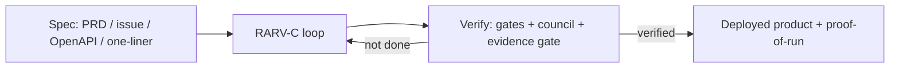
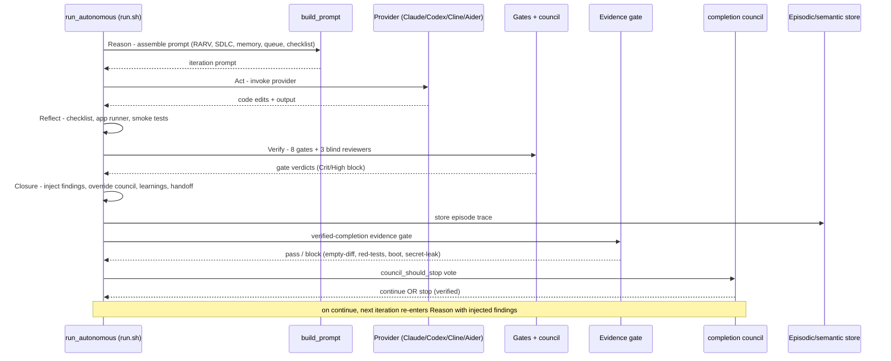

# Loki Mode - Architecture Overview

Spec in, verified product out. This document gives a SIMPLE view for a first read
and a FULL view for the whole machine, plus one RARV-C iteration as a sequence.

Every claim is verified against source (`autonomy/loki`, `autonomy/run.sh`,
`autonomy/completion-council.sh`, `skills/quality-gates.md`, `SKILL.md`). Line
numbers drift; function names are stable. See `CLAUDE.md` for the file map.

---

## SIMPLE flowchart (the whole product in five boxes)



Diagram type: flowchart. 4 nodes.

Reason, Act, Reflect, Verify, then Closure. The loop does not exit until the
verify stage clears; "done" is a verdict the machine has to earn, not a claim it
gets to make.

---

## USER view: how you run it and what you get

```bash
# One-time: launch Claude Code with autonomous permissions
claude --dangerously-skip-permissions

# Then either say "Loki Mode", or run the CLI directly:
loki start ./prd.md            # PRD-mode (a Markdown spec file)
loki start owner/repo#123      # issue-mode (a GitHub issue)
loki start                     # one-line brief, answer the prompt
```

What happens: `loki start` (`cmd_start` in `autonomy/loki`) execs the runner
(`autonomy/run.sh`). The `run_autonomous()` loop builds a prompt each iteration
(`build_prompt()`), invokes the provider, then runs checklist verification, an app
runner, smoke tests, and code review. It stops when the completion council votes
stop (`council_should_stop` in `autonomy/completion-council.sh`), a completion
promise is met, max iterations is hit, or (v8.0.0) a failure is positively
identified as non-retryable -- bad credentials, unknown model, exhausted quota --
where further retries would be guaranteed-identical failures
(`loki-ts/src/runner/retry_class.ts`, `LOKI_SMART_RETRY=0` to disable). An
unrecognized failure stays transient and retries as before, so the early exit
can never abandon a build that would have succeeded.

The council's own force-stop valves (stagnation, repeated done-claims) are
additionally delayed by one iteration when the agent's self-reported confidence
spikes, so a sudden claim of near-certainty is VERIFIED rather than trusted
(`loki-ts/src/runner/council.ts`, v8.0.0). That delay is strictly additive: it
can only add a verification pass, never skip one, and it never delays the
stagnation valve.

What you get:
- A runnable artifact (the built product in your working directory).
- A proof-of-run: `.loki/proofs/<id>/proof.json` plus an HTML report
  (`autonomy/lib/proof-generator.py`, `autonomy/lib/proof-template.html`).
- An honest verdict. The evidence gate blocks completion on an empty diff, red
  tests, an unhealthy serveable app (runtime-boot axis), or a leaked credential in
  the changed files (secret-leak axis) - v8.0.0, `SKILL.md`.

Provider-agnostic (stable since v5.0.0): Claude (Tier 1, full), Cline (Tier 2),
Codex and Aider (Tier 3, degraded, sequential). Gemini deprecated v7.5.18. See
`skills/providers.md`.

---

## FOUNDER view: the moat

The moat is not "an agent that writes code". It is the trust layer wrapped around
the loop.

- RARV-C rigor. Every iteration is Reason, Act, Reflect, Verify, then Closure
  (findings injection, override council, learnings, handoff). The closure knobs
  are default-on in the Bun runner: `LOKI_INJECT_FINDINGS`, `LOKI_OVERRIDE_COUNCIL`,
  `LOKI_AUTO_LEARNINGS`, `LOKI_HANDOFF_MD` (`CLAUDE.md`, `skills/quality-gates.md`).
- Verify, not vibes. 8 quality gates (`skills/quality-gates.md`), a blind
  3-reviewer council with severity blocking, an anti-sycophancy Devil's Advocate on
  unanimous PASS, and a verified-completion evidence gate that blocks on positive
  fabrication evidence. The system does not call work done until it is verified
  (`SKILL.md`).
- Tier routing. Opus for planning/architecture, Sonnet for development, Haiku for
  unit tests and simple parallel work (`CLAUDE.md` Model Selection;
  `get_rarv_tier()` in `autonomy/run.sh`, session-pinned via `LOKI_SESSION_MODEL`,
  default sonnet). Cost tracks the tier, not a flat premium.
- Model-equivalence thesis (founder framing). The rigor lives in the HARNESS (the
  loop, the gates, the council, the evidence gate), not in any one model. Because
  the harness is provider-agnostic with abstract model tiers and a degraded mode
  for non-Claude providers, the trust guarantee is not tied to a single vendor
  (`SKILL.md` provider-agnostic section; `providers/*.sh`). An optional Anthropic
  Agent SDK route exists behind `LOKI_SDK_MODE` (off by default, v8.0.0); unset is
  byte-identical to the claude-CLI route (`references/sdk-mode.md`).

---

## FULL flowchart (CLI dispatch to shipped proof)

```mermaid
flowchart TD
    subgraph CLI[autonomy/loki - CLI]
      START[loki start spec] --> DISPATCH[main dispatch]
      DISPATCH --> EXEC[exec run.sh]
    end

    subgraph RUNNER[autonomy/run.sh - orchestration]
      EXEC --> RA[run_autonomous loop]
      RA --> CPX[detect_complexity]
      CPX --> TIER[get_rarv_tier / LOKI_SESSION_MODEL]
      TIER --> BP[build_prompt: RARV + SDLC + memory + queue + checklist]
      BP --> INV[invoke provider]
      INV --> ACT[Act: agent edits code]
      ACT --> CHK[checklist verification]
      CHK --> APP[app runner + playwright smoke]
      APP --> CR[run_code_review: 3 blind reviewers]
    end

    subgraph GATES[Quality gates - skills/quality-gates.md]
      CR --> G1[1 static analysis]
      G1 --> G2[2 test suite red blocks]
      G2 --> G3[3 blind council Crit/High block]
      G3 --> G4[4 devils advocate on unanimous PASS]
      G4 --> G5[5 mock integrity HIGH blocks]
      G5 --> G6[6 test mutation HIGH blocks]
      G6 --> G7[7 doc coverage]
      G7 --> G8[8 magic modules debate BLOCK]
    end

    subgraph CLOSURE[RARV-C closure + memory]
      G8 --> FIND[inject findings]
      FIND --> OC[override council on BLOCK]
      OC --> LEARN[auto learnings]
      LEARN --> HAND[handoff md]
      HAND --> MEM[store_episode_trace: episodic/semantic]
    end

    subgraph VERDICT[Completion decision]
      MEM --> EG[evidence gate: empty-diff / red-tests / boot / secret-leak]
      EG --> CC[council_should_stop vote]
    end

    CC -- keep going --> RA
    CC -- stop / verified --> PROOF[proof-generator.py -> .loki/proofs/ID/proof.json + HTML]
    PROOF --> SHIP[deployed product + proof-of-run]
```



Diagram type: flowchart. 28 nodes across 6 subgraphs.

Verified anchors: `main` dispatch and `cmd_start` in `autonomy/loki`;
`run_autonomous()`, `build_prompt()`, `run_code_review()`, `detect_complexity()`,
`get_rarv_tier()` in `autonomy/run.sh`; the 8-gate table in
`skills/quality-gates.md`; closure env vars in `CLAUDE.md`; `council_should_stop()`
in `autonomy/completion-council.sh`; proof generation in
`autonomy/lib/proof-generator.py`. The evidence-gate axes are quoted from
`SKILL.md` (v8.0.0).

---

## One RARV-C iteration (sequenceDiagram)



Diagram type: sequenceDiagram. 7 participants, 14 messages.

Verified: the RARV cycle (Reason/Act/Reflect/Verify) is `SKILL.md` PRIORITY 2; the
Closure stage maps to the four default-on closure env vars in `CLAUDE.md`; the
evidence-gate axes and "does not call work done until verified" are `SKILL.md`
v8.0.0; the council vote is `council_should_stop` in `autonomy/completion-council.sh`.

---

## Where this connects

Loki Mode is the ENGINE. Its `proof.json` is the evidence that the neutral
Autonomi Verify signer stamps, and the Autonomi SaaS product is the hosted layer
that drives the engine for non-technical users. See `docs/AUTONOMI-ECOSYSTEM.md`
for the three-repo boundary map.
