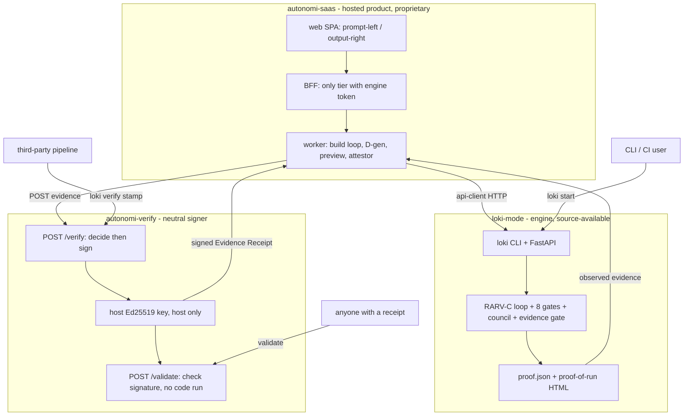

# The Autonomi Ecosystem

Three repos, three jobs, three clean boundaries. This is the map that ties them
together.

- loki-mode (this repo) - the ENGINE. Spec to verified product via the RARV-C
  loop, 8 quality gates, the completion council, and the evidence gate.
- autonomi-verify - the TRUST layer. A neutral signer that stamps observed evidence
  with a host-held key so a receipt is non-forgeable and independently checkable.
- autonomi-saas - the hosted PRODUCT. Plain-English builds for non-technical users,
  driving the engine and stamping every result with Verify.

Deep dives: `docs/ARCHITECTURE-OVERVIEW.md` (engine),
`../autonomi-verify/docs/INTEGRATION-DIAGRAMS.md` (trust layer),
`../autonomi-saas/docs/PRODUCT-ARCHITECTURE.md` (product).

---

## The ecosystem in one graph

Diagram type: graph. 14 nodes across 3 subgraphs plus 3 external actors.

Verified anchors: the BFF is the only tier holding the engine token
(`autonomi-saas/apps/bff/src/engine.ts`); the worker attestor POSTs evidence to the
signer and gets a signed receipt (`autonomi-saas/worker/src/adapters/attestor.ts`);
the signer decides then signs with a host-only Ed25519 key
(`autonomi-verify/src/api/index.ts`, `autonomi-verify/src/persistence/index.ts`);
`/validate` checks a signature without running code
(`autonomi-verify/src/api/validatePage.ts`); the engine produces `proof.json`
(`loki-mode/autonomy/lib/proof-generator.py`, `loki-ts/src/runner/proof.ts`).

---

## Where each boundary is

| Concern | loki-mode (engine) | autonomi-verify (trust) | autonomi-saas (product) |
|---|---|---|---|
| Runs the build | Yes | No | No (delegates to engine) |
| Decides the verdict | Yes (gates, council, evidence gate) | Yes (neutral re-decide on presented evidence) | No |
| Holds the signing key | No | Yes (host only) | No |
| Runs untrusted code | Yes (sandboxed) | No (never runs code) | Via engine + worker sandbox |
| Multi-tenant auth / billing | No | Per-tenant API key on /verify | Yes (product concern) |
| Hosted preview + UI | No | No | Yes |
| Design generation (D-gen) | Prompt-level, engine-agnostic | No | Yes (default-on directive) |
| Source posture | Source-available | Source-available | Proprietary hosted |

The three-way trust property: the engine can decide, but the PRODUCT that built the
app does not hold the key that signs the receipt. Only the neutral TRUST layer does.
That separation is what lets a skeptic believe a receipt without trusting the
builder. A competitor who self-signs their own success badge cannot offer that.

---

## The flow, end to end

1. A user describes an app in the SaaS, or a developer runs `loki start`, or a
   third-party pipeline runs `loki verify stamp`.
2. The engine runs the RARV-C loop until the gates, council, and evidence gate
   clear, producing `proof.json`.
3. The observed evidence (diff + test signal) is POSTed to the neutral signer,
   which applies one honest verdict rule and signs with the host-only key.
4. The signed Evidence Receipt comes back. Anyone can validate its signature at
   `/validate` without running code or trusting the builder.

Honesty invariants that hold across all three:
- `verified` means "no fabrication evidence", not "tests are green"
  (`autonomi-verify/src/verifier/verify.ts`).
- Block only on positive fabrication evidence; inconclusive is pass-through
  (`autonomi-verify/src/verifier/evidenceGate.ts`).
- The design/beauty layer never alters the VERIFIED verdict
  (`autonomi-saas/docs/AUTONOMI-BUILD-PLAN.md`).
- Signing happens after the verdict is decided, so signing cannot change it
  (`autonomi-verify/src/api/index.ts`).
