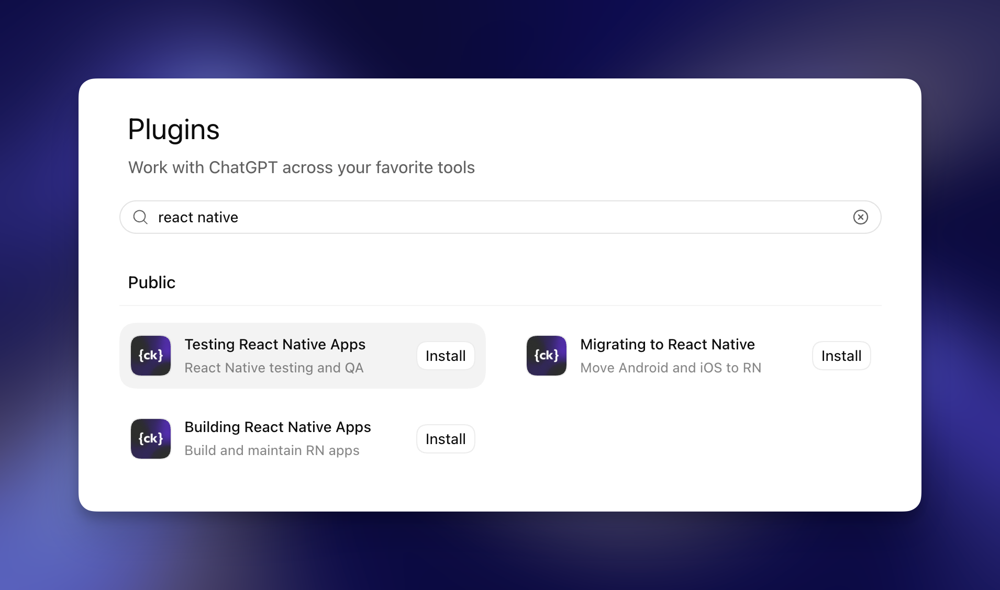

# Callstack Agent Skills

Callstack Agent Skills give AI coding assistants practical React Native knowledge drawn from our work on production apps.

## What's included

The skills are organized into three bundles.

| Plugin bundle | Use it for | Skills included |
| --- | --- | --- |
| [Building React Native Apps](./plugins/building-react-native-apps/) | Building, optimizing, navigating, upgrading, and extending React Native apps | [Performance](./skills/react-native-best-practices/), [navigation](./skills/react-navigation/), [TV](./skills/react-native-tv-best-practices/), [library creation](./skills/create-react-native-library/), and [upgrades](./skills/upgrading-react-native/) |
| [Testing React Native Apps](./plugins/testing-react-native-apps/) | Writing tests, producing CI artifacts, automating devices, and running exploratory QA | [GitHub Actions](./skills/github-actions/), [React Native Testing](https://skills.sh/callstack/react-native-testing-library/react-native-testing), [agent-device](https://skills.sh/callstackincubator/agent-device/agent-device), and [dogfood](https://skills.sh/callstackincubator/agent-device/dogfood) |
| [Migrating to React Native](./plugins/migrating-to-react-native/) | Assessing migration readiness and adopting React Native incrementally | [Migration assessment](./skills/assess-react-native-migration/) and [brownfield migration](./skills/react-native-brownfield-migration/) |


## Quick start

Choose your assistant:

| Assistant | Setup |
| --- | --- |
| OpenAI Codex | [Install from Plugins](#openai-codex) |
| All assistants | [Manual installation](#manual-installation) |

### OpenAI Codex

Open **Plugins**, search for `react native`, and install the bundle you need.



### Manual installation

For Claude Code, Cursor, GitHub Copilot, Gemini CLI, OpenCode, and other compatible assistants, install all Callstack-maintained skills with the [skills CLI](https://skills.sh/docs/cli):

```bash
npx skills@latest add callstackincubator/agent-skills --skill '*'
```

The CLI will ask which assistant and installation scope to use. To install only one skill, select it interactively or pass its name:

```bash
npx skills@latest add callstackincubator/agent-skills --skill react-native-best-practices
```

If your assistant does not support the skills CLI, see the [AI Assistant Integration Guide](./docs/ai-assistant-integration.md) for direct setup instructions.

## Try it

Once installed, ask your assistant naturally. It will select the relevant skill from the task context.

```text
Review this React Native screen for performance problems.
```

```text
Plan an upgrade from this project's React Native version to the latest supported release.
```

```text
Assess whether this native iOS and Android product should migrate incrementally.
```

```text
Build downloadable iOS simulator and Android emulator artifacts in GitHub Actions.
```

```text
Verify this checkout flow on iOS and capture evidence for any failures.
```

## Skills

Callstack-maintained skills live in this repository. The Testing React Native Apps bundle also includes the external skills linked below.

### Build and optimize

| Skill | Use it for |
| --- | --- |
| [react-native-best-practices](./skills/react-native-best-practices/) | Profiling and improving FPS, startup time, rendering, memory, bundle size, animations, and native integration |
| [react-navigation](./skills/react-navigation/) | Building React Navigation 7 stacks, tabs, drawers, headers, sheets, and safe-area behavior |
| [react-native-tv-best-practices](./skills/react-native-tv-best-practices/) | Building and reviewing TV focus, remote input, playback, performance, packaging, and accessibility |
| [create-react-native-library](./skills/create-react-native-library/) | Creating standalone libraries or local native modules and views with `create-react-native-library` |
| [upgrading-react-native](./skills/upgrading-react-native/) | Applying template diffs, updating dependencies and native projects, and verifying React Native upgrades |

### Test and verify

| Skill | Use it for |
| --- | --- |
| [github-actions](./skills/github-actions/) | Producing downloadable iOS simulator and Android emulator build artifacts in GitHub Actions |
| [react-native-testing](https://skills.sh/callstack/react-native-testing-library/react-native-testing) | Writing and maintaining user-focused React Native tests with React Native Testing Library |
| [agent-device](https://skills.sh/callstackincubator/agent-device/agent-device) | Automating iOS and Android app flows, input, screenshots, logs, performance checks, and UI inspection |
| [dogfood](https://skills.sh/callstackincubator/agent-device/dogfood) | Running exploratory QA, smoke checks, bug hunts, and structured app walkthroughs |

### Migrate and modernize

| Skill | Use it for |
| --- | --- |
| [assess-react-native-migration](./skills/assess-react-native-migration/) | Auditing a product and its codebases, choosing a migration path, and defining a representative checkpoint |
| [react-native-brownfield-migration](./skills/react-native-brownfield-migration/) | Packaging and integrating React Native or Expo into existing iOS and Android apps in phases |

## Guides and related resources

- [AI Assistant Integration Guide](./docs/ai-assistant-integration.md) explains setup for Cursor, GitHub Copilot, Claude API, ChatGPT, Windsurf, and other assistants.
- [The Ultimate Guide to React Native Optimization](https://www.callstack.com/ebooks/the-ultimate-guide-to-react-native-optimization) is the foundation for the performance skill.
- [AI-Supported Brownfield Migration to React Native](https://www.callstack.com/blog/ai-supported-brownfield-migration-to-react-native) explains the migration workflow behind the brownfield skills.
- [Bring React Native Into Your App, One Step at a Time](https://www.callstack.com/ebooks/incremental-react-native-adoption-in-native-apps) covers incremental adoption for native iOS and Android teams.
- [Optimization Best Practices](https://github.com/callstack/optimization-best-practices) contains runnable examples for React Compiler, dedicated React Native SDKs, and Android R8.

## Repository structure

```text
skills/    Standalone Callstack-maintained Agent Skills
plugins/   Claude Code and Codex plugin bundles
docs/      Integration and contributor guides
```

Each skill starts with a `SKILL.md` file and can include focused material under `references/`. Plugin manifests collect related skills into installable bundles.

## Contributing

Contributions should be actionable, easy for an agent to discover, and complete enough to use without hidden context.

When adding or editing a skill, follow the [Agent Skills specification](https://agentskills.io/specification), the repository's [skill conventions](./docs/skill-conventions.md), and the maintainer checklist in [AGENTS.md](./AGENTS.md).

## About Callstack

[Callstack](https://www.callstack.com/) is a team of React and React Native experts. These skills package practical workflows from our engineering work into reusable guidance for coding assistants.

The repository is available under the [MIT License](./LICENSE). Contact [hello@callstack.com](mailto:hello@callstack.com) if you need help with React Native or want to contribute.
