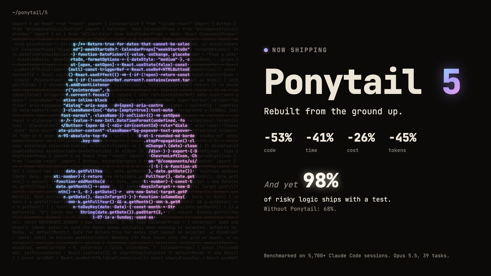
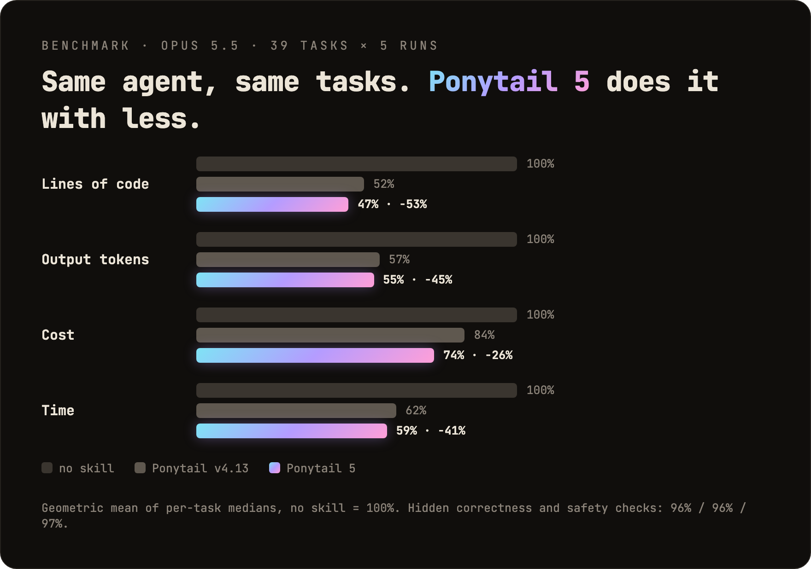
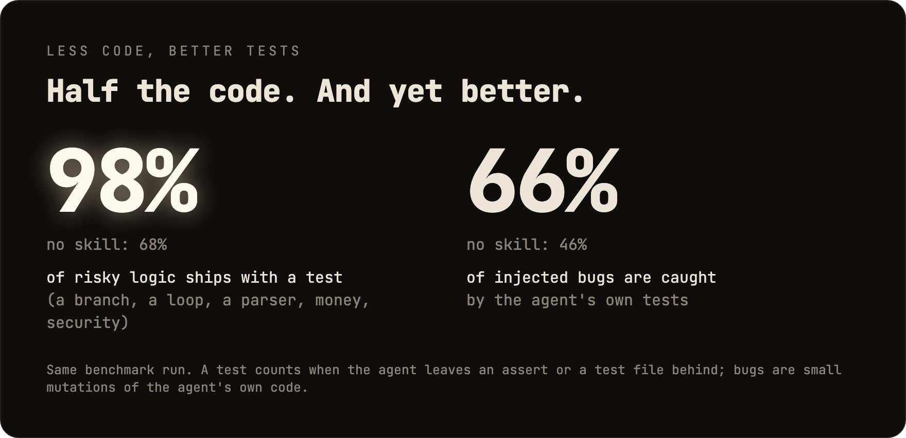
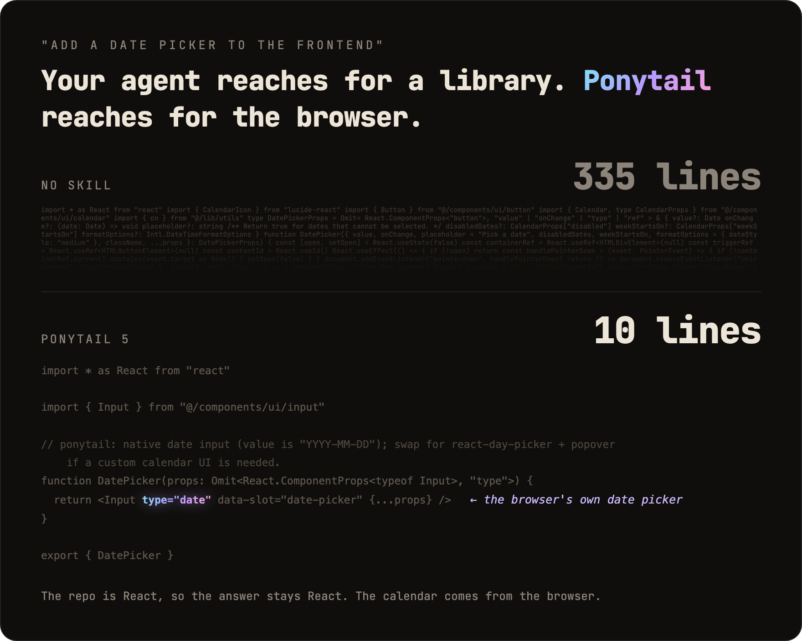
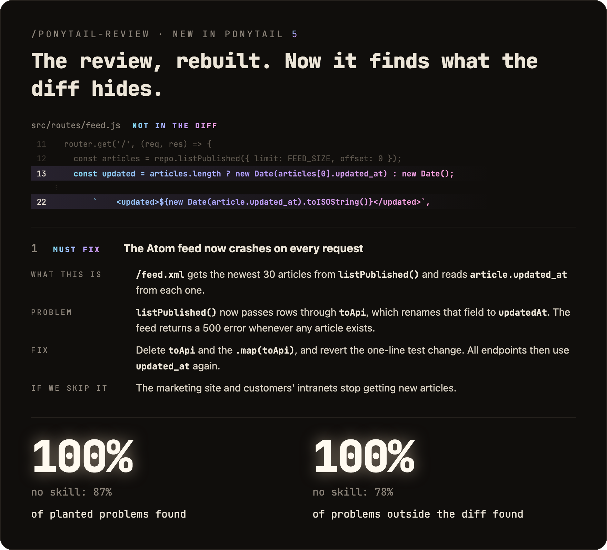
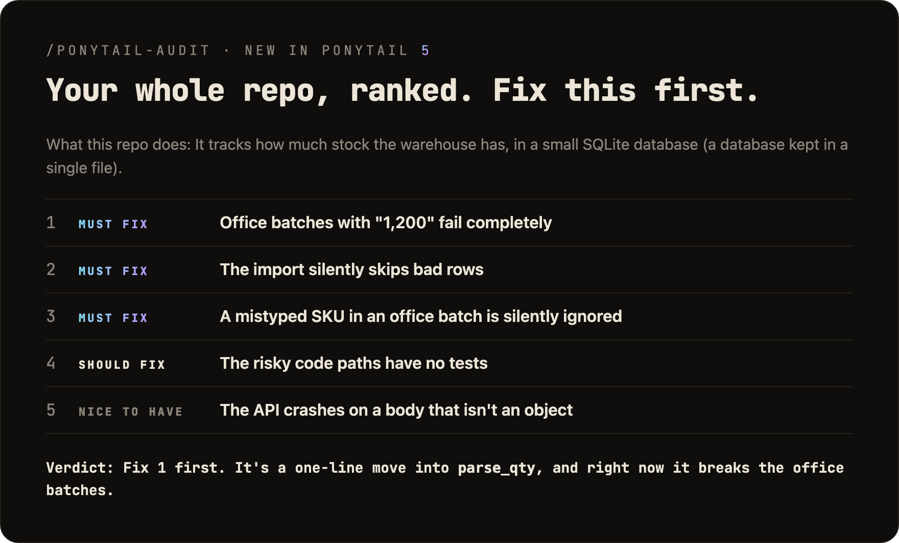
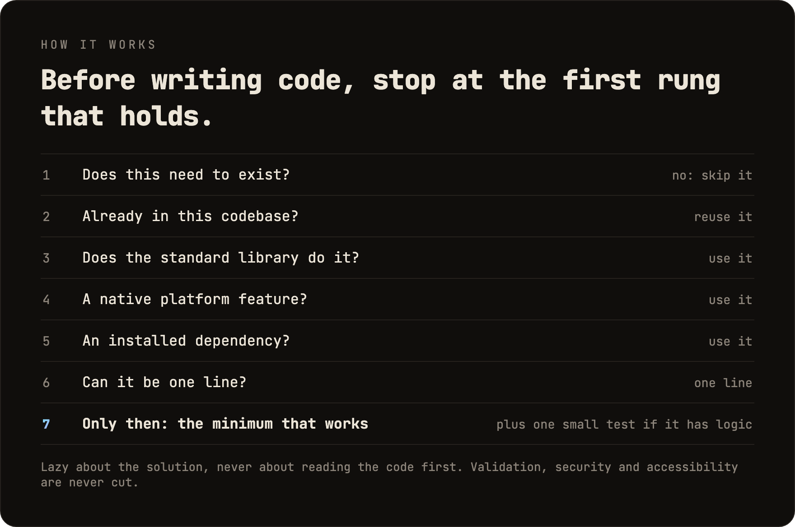

<p align="center">
  <picture>
    <source media="(prefers-color-scheme: dark)" srcset="assets/logo-dark.png">
    
  </picture>
</p>

<h1 align="center">Ponytail</h1>

<p align="center">
  <em>He says nothing. He writes one line. It works.</em>
</p>

<p align="center">
  <a href="https://trendshift.io/repositories/50668?utm_source=repository-badge&amp;utm_medium=badge&amp;utm_campaign=badge-repository-50668" target="_blank" rel="noopener noreferrer"></a>
</p>

<p align="center">
  
  
  
  
  
</p>

<p align="center">
  <a href="https://trendshift.io/repositories/50668" target="_blank" rel="noopener noreferrer"></a>
  <a href="https://trendshift.io/repositories/50668" target="_blank" rel="noopener noreferrer"></a>
  <a href="https://trendshift.io/repositories/50668?utm_source=trendshift-badge&amp;utm_medium=badge&amp;utm_campaign=badge-trendshift-50668" target="_blank" rel="noopener noreferrer"></a>
</p>

<p align="center">
  
</p>

<p align="center">
  <strong>Ponytail 5: rebuilt from the ground up.</strong><br>
  <strong>-53% code &middot; -41% time &middot; -26% cost &middot; -45% tokens</strong><br>
  <strong>And yet: 98% of risky logic ships with a test.</strong> Without Ponytail: 68%.<br>
  <sub>Benchmarked in Claude Code, the same agent with and without the skill: 39 tasks including a real FastAPI + React repo, Opus 5.5, 5 runs each. <a href="#numbers">Details</a>.</sub>
</p>

<p align="center">
  <sub><a href="i18n/README.es.md">Español</a> &middot; <a href="i18n/README.ko.md">한국어</a> &middot; <a href="i18n/README.zh-CN.md">简体中文</a> &middot; <a href="i18n/README.ja.md">日本語</a></sub>
</p>

---

<p align="center">
  <a href="https://ponytail.dev/soon"></a>
</p>

## Already built with Ponytail

<a href="https://theretriever.app">
  <picture>
    <source media="(prefers-color-scheme: dark)" srcset="assets/retriever-logo-dark.svg">
    
  </picture>
</a>

---

You know him. Long ponytail. Oval glasses. Has been at the company longer than the version control. You show him fifty lines; he looks at them, says nothing, and replaces them with one.

Ponytail puts him inside your AI agent.

## Numbers

<p align="center">
  
</p>

<p align="center">
  
</p>

Two things the chart does not show: in a blind comparison, Ponytail 5's replies beat the previous Ponytail's 110 to 67. And on the six security tasks (SQL injection, path traversal, forged tokens, rate limiting, malformed CSV rows, caching) it passed all 30 runs: less code, no less safe. Method, per-task tables and limits: [benchmarks/results/2026-10-07-agentic.md](benchmarks/results/2026-10-07-agentic.md).

**The rule was never "fewest tokens."** It is: write only what the task needs, and never cut validation, error handling, security, or accessibility. The code ends up small because it is necessary, not golfed. Lower cost and latency are a side effect.

## Before / after

<p align="center">
  
</p>

You ask for a date picker. Without Ponytail, the agent installs a date picker library or builds a whole calendar by hand: 335 lines. Ponytail 5 first looks at what is already there: the repo has an `Input` component, and every browser has a date picker. It puts the two together. 10 lines.

More survivors in [examples/](examples/).

## The review, rebuilt

<p align="center">
  
</p>

`/ponytail-review` used to look only for code to cut. Now it reviews like the senior dev who gets paged when it breaks: it reads the code your change touches, not just the diff, and checks bugs, security, real load, missing tests, speed, and what to cut. Each finding says what the code does, what goes wrong, how to fix it, and what happens if you don't.

## The audit, rebuilt

<p align="center">
  
</p>

`/ponytail-audit` runs the same checks on the whole repo. It maps the code first: entry points, how data moves, what load the project expects. Then it ranks what it finds and tells you what to fix first. The old audit only listed what to delete.

## How it works

<p align="center">
  
</p>

The ladder runs *after* it understands the problem, not instead of it: it reads the code the change touches and traces the real flow before picking a rung. Lazy about the solution, never about reading.

Lazy, not negligent: trust-boundary validation, data-loss handling, security, and accessibility are never on the chopping block.

Logic with a branch, a loop, a parser, money or security leaves one small test behind. Every reply ends with what was skipped or not checked and any risk you should know.

## The prompt

Ponytail is one prompt: [`skills/ponytail/SKILL.md`](skills/ponytail/SKILL.md). The compact version, for agents that read a rules file, is [`AGENTS.md`](AGENTS.md). Everything else in this repo loads that prompt into different agents.

## Install

**Claude Code**, as two separate prompts:

```
/plugin marketplace add DietrichGebert/ponytail
```
```
/plugin install ponytail@ponytail
```

**Codex:**

```bash
codex plugin marketplace add DietrichGebert/ponytail
codex plugin add ponytail@ponytail
```

Then open `/hooks` in Codex, trust its two lifecycle hooks, and start a new thread.

**Any other agent:** copy [`AGENTS.md`](AGENTS.md) into your project, or ask your agent to install [`skills/ponytail/SKILL.md`](skills/ponytail/SKILL.md) as a skill. Step by step for Copilot, Cursor, OpenCode, Gemini and the rest: **[INSTALL.md](INSTALL.md)**.

That was it. He'd be proud. He won't say it.

Active every session, with a handful of commands (see [Commands](#commands)). `/ponytail ultra` exists for when the codebase has wronged you personally. Startup and mode-change text shows the current mode.

Only install ponytail from `DietrichGebert/ponytail` on GitHub or `@dietrichgebert/ponytail` on npm. It never ships `.exe` or `.dll` files; a copy that does is not mine.

## Commands

| Command | What it does |
|---------|--------------|
| `/ponytail [lite \| full \| ultra \| off]` | Set the intensity, or turn it off. No argument switches ponytail on at the default level if it is off, and otherwise reports the current level. |
| `/ponytail-review` | Review the current diff like the senior dev who gets paged when it breaks: bugs, security, real load, risky code without a test, slow paths, and what to cut. Each finding says what the code does, what goes wrong, how to fix it, and what happens if you don't. Name a target in plain words to narrow or widen it: `uncommitted`, `staged`, `branch`, or a PR link. |
| `/ponytail-audit` | The same check for the whole repo, most important first. |
| `/ponytail-debt` | Harvest the `shortcut:` comments you've deferred into a ledger, so "later" doesn't become "never". |
| `/ponytail-gain` | Show the measured impact scoreboard (less code, less cost, more speed) from the benchmark. |
| `/ponytail-help` | Quick reference for the commands above. |

Commands need a skill-capable host (Claude Code, Codex, Devin CLI, OpenCode, Gemini, pi, Hermes Agent, Qoder, Grok Build). In Codex CLI and the IDE extension they're skills under the plugin's namespace; invoke with `$ponytail:ponytail-review`. Cursor with the [hooks](INSTALL.md#cursor) gets `/ponytail` level switching only, typed as a plain message. The instruction-only adapters (Cursor's rule file, Windsurf, Cline, Copilot, Kiro, Antigravity) load the always-on ruleset without the commands.

## FAQ

**Does it need a config file?**
No. An optional `~/.config/ponytail/config.json` or `PONYTAIL_DEFAULT_MODE` env var can set the default level, but nothing is required.

**Why does it write `shortcut:` comments?**
They mark a deliberate shortcut and when to revisit it, and `/ponytail-debt` collects them into a ledger. Want another word, or none? Say so in your project's `CLAUDE.md` or `AGENTS.md`, then run `/ponytail-debt <your word>`.

**What if I really need the 120-line cache class?**
You don't. Insist anyway and he'll build it. Slowly. Correctly. While looking at you.

**Does it scale?**
The code you never wrote scales infinitely. Zero bugs, zero CVEs, 100% uptime since forever.

**Why "ponytail"?**
You know exactly why.

## Sponsors

<p align="center">
  <a href="https://greenpt.com/">
    <picture>
      <source media="(prefers-color-scheme: dark)" srcset="assets/logo-greenpt-dark.svg">
      
    </picture>
  </a>
</p>

## License

[MIT](LICENSE). The shortest license that works.

## Star History

<a href="https://www.star-history.com/dietrichgebert/ponytail#history">
 <picture>
   <source media="(prefers-color-scheme: dark)" srcset="https://api.star-history.com/chart?repos=DietrichGebert/ponytail&type=Date&theme=dark" />
   <source media="(prefers-color-scheme: light)" srcset="https://api.star-history.com/chart?repos=DietrichGebert/ponytail&type=Date" />
   
 </picture>
</a>
