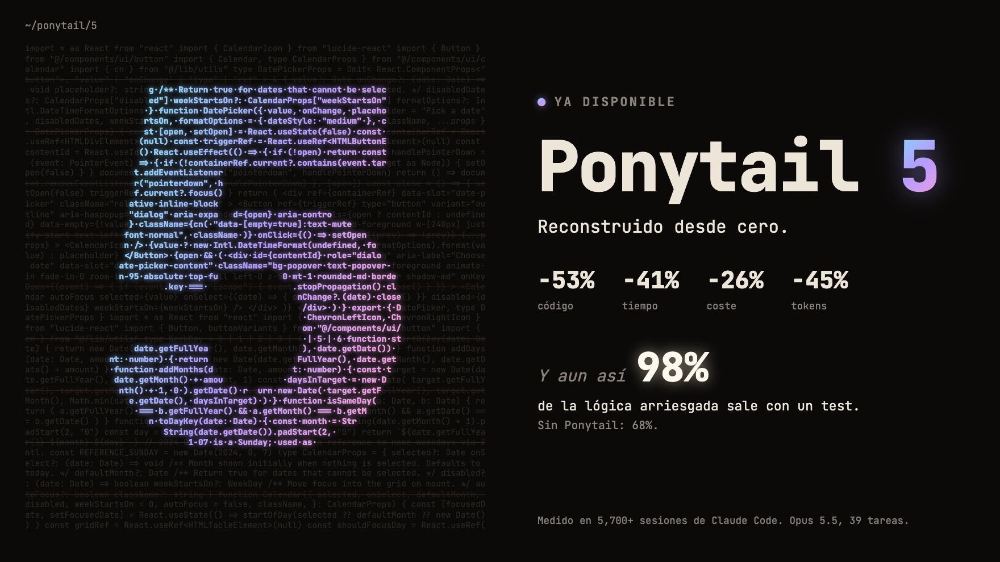
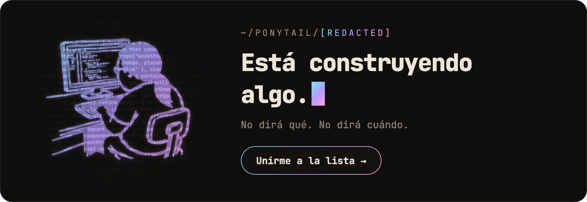
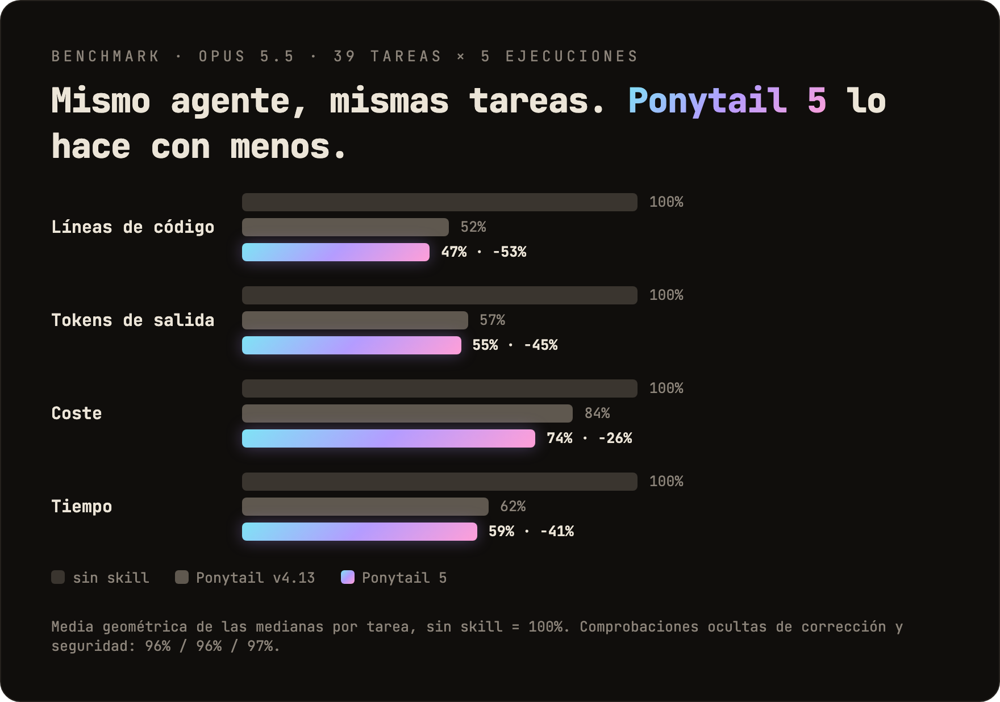
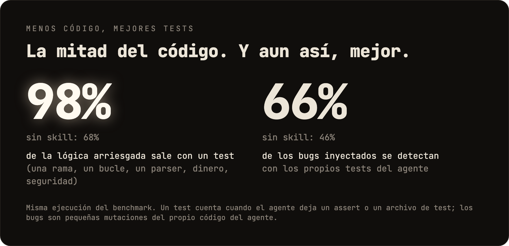
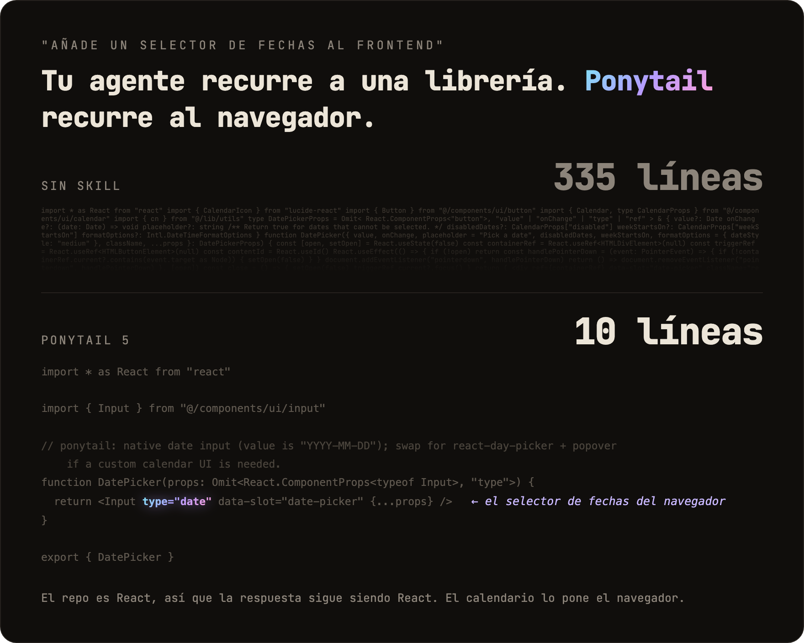
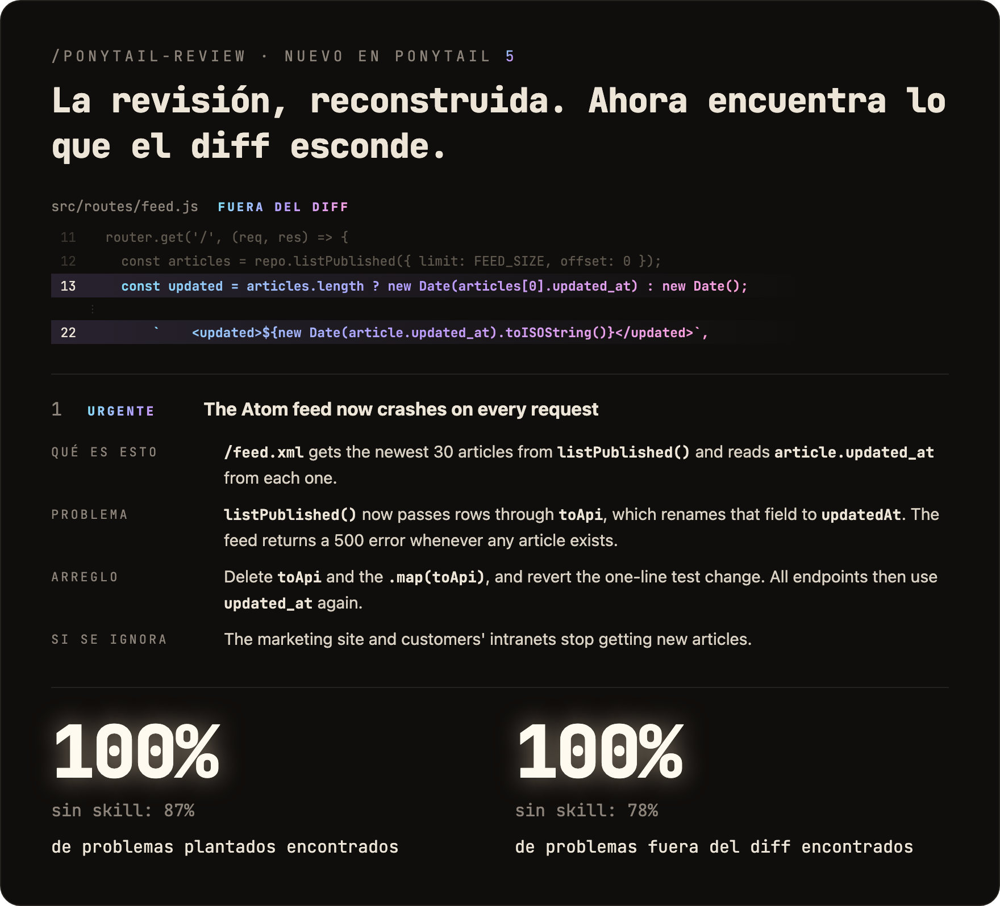
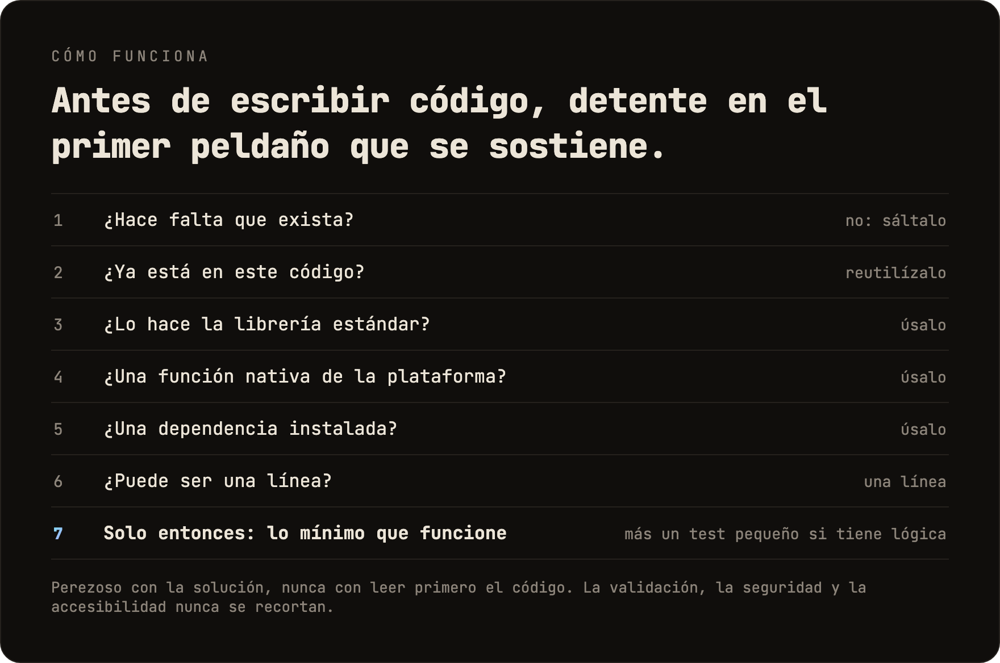

<p align="center">
  <picture>
    <source media="(prefers-color-scheme: dark)" srcset="../assets/logo-dark.png">
    
  </picture>
</p>

<h1 align="center">Ponytail</h1>

<p align="center">
  <em>No dice nada. Escribe una línea. Funciona.</em>
</p>

<p align="center">
  <a href="https://trendshift.io/repositories/50668?utm_source=repository-badge&amp;utm_medium=badge&amp;utm_campaign=badge-repository-50668" target="_blank" rel="noopener noreferrer"></a>
</p>

<p align="center">
  
  
  
  
  
</p>

<p align="center">
  <a href="https://trendshift.io/repositories/50668" target="_blank" rel="noopener noreferrer"></a>
  <a href="https://trendshift.io/repositories/50668" target="_blank" rel="noopener noreferrer"></a>
  <a href="https://trendshift.io/repositories/50668?utm_source=trendshift-badge&amp;utm_medium=badge&amp;utm_campaign=badge-trendshift-50668" target="_blank" rel="noopener noreferrer"></a>
</p>

<p align="center">
  
</p>

<p align="center">
  <strong>Ponytail 5: reconstruido desde cero.</strong><br>
  <strong>-53% código &middot; -41% tiempo &middot; -26% coste &middot; -45% tokens</strong><br>
  <strong>Y aun así: el 98% de la lógica arriesgada sale con un test.</strong> Sin Ponytail: 68%.<br>
  <sub>Medido en Claude Code, el mismo agente con y sin el skill: 39 tareas, entre ellas un repo real de FastAPI + React, Opus 5.5, 5 ejecuciones cada una. <a href="#numbers">Detalles</a>.</sub>
</p>

<p align="center">
  <sub><a href="../README.md">English</a> &middot; Español &middot; <a href="README.ko.md">한국어</a> &middot; <a href="README.zh-CN.md">简体中文</a> &middot; <a href="README.ja.md">日本語</a></sub><br>
  <sub>Traducción del README en inglés. Si algo no coincide, vale la <a href="../README.md">versión en inglés</a>.</sub>
</p>

---

<p align="center">
  <a href="https://ponytail.dev/soon"></a>
</p>

## Ya construido con Ponytail

<a href="https://theretriever.app">
  <picture>
    <source media="(prefers-color-scheme: dark)" srcset="../assets/retriever-logo-dark.svg">
    
  </picture>
</a>

---

Ya lo conoces. Coleta larga. Gafas ovaladas. Lleva en la empresa más tiempo que el control de versiones. Le enseñas cincuenta líneas; las mira, no dice nada y las cambia por una.

Ponytail lo mete dentro de tu agente de IA.

<a id="numbers"></a>
## Números

<p align="center">
  
</p>

<p align="center">
  
</p>

Dos cosas que el gráfico no muestra: en una comparación a ciegas, las respuestas de Ponytail 5 ganan a las del Ponytail anterior por 110 a 67. Y en las seis tareas de seguridad (inyección SQL, path traversal, tokens falsificados, limitación de peticiones, filas CSV mal formadas, caché) pasó las 30 ejecuciones: menos código, igual de seguro. Método, tablas por tarea y limitaciones: [benchmarks/results/2026-10-07-agentic.md](../benchmarks/results/2026-10-07-agentic.md).

**La regla nunca fue "la menor cantidad de tokens".** Es: escribe solo lo que la tarea necesita, y nunca recortes validación, manejo de errores, seguridad ni accesibilidad. El código acaba siendo pequeño porque es lo necesario, no porque esté comprimido a la fuerza. El menor coste y la menor latencia son un efecto secundario.

## Antes / después

<p align="center">
  
</p>

Pides un selector de fechas. Sin Ponytail, el agente instala una librería de selector de fechas o construye un calendario entero a mano: 335 líneas. Ponytail 5 primero mira lo que ya hay: el repo tiene un componente `Input`, y todos los navegadores traen un selector de fechas. Junta las dos cosas. 10 líneas.

Más supervivientes en [examples/](../examples/).

## La revisión, reconstruida

<p align="center">
  
</p>

`/ponytail-review` antes solo buscaba código que recortar. Ahora revisa como el dev senior al que llaman cuando algo se rompe: lee el código que toca tu cambio, no solo el diff, y revisa bugs, seguridad, carga real, tests que faltan, velocidad y lo que sobra. Cada hallazgo dice qué hace el código, qué falla, cómo arreglarlo y qué pasa si no lo arreglas.

## La auditoría, reconstruida

<p align="center">
  
</p>

`/ponytail-audit` hace las mismas comprobaciones en todo el repo. Primero hace un mapa del código: puntos de entrada, cómo se mueven los datos, qué carga espera el proyecto. Después ordena lo que encuentra por prioridad y te dice qué arreglar primero. La auditoría anterior solo listaba lo que había que borrar.

## Cómo funciona

<p align="center">
  
</p>

La escalera corre *después* de entender el problema, no en su lugar: lee el código que toca el cambio y sigue el flujo real antes de elegir un peldaño. Perezoso con la solución, nunca con la lectura.

Perezoso, no negligente: la validación en los límites de confianza, el manejo de pérdida de datos, la seguridad y la accesibilidad nunca se recortan.

La lógica con una rama, un bucle, un parser, dinero o seguridad deja un test pequeño. Cada respuesta termina con lo que se saltó o no se comprobó y cualquier riesgo que debas conocer.

## El prompt

Ponytail es un solo prompt: [`skills/ponytail/SKILL.md`](../skills/ponytail/SKILL.md). La versión compacta, para agentes que leen un archivo de reglas, es [`AGENTS.md`](../AGENTS.md). Todo lo demás en este repo sirve para cargar ese prompt en distintos agentes.

## Instalación

**Claude Code**, como dos prompts separados:

```
/plugin marketplace add DietrichGebert/ponytail
```
```
/plugin install ponytail@ponytail
```

**Codex:**

```bash
codex plugin marketplace add DietrichGebert/ponytail
codex plugin add ponytail@ponytail
```

Después abre `/hooks` en Codex, confía en sus dos hooks de ciclo de vida y empieza un hilo nuevo.

**Cualquier otro agente:** copia [`AGENTS.md`](../AGENTS.md) en tu proyecto, o pídele a tu agente que instale [`skills/ponytail/SKILL.md`](../skills/ponytail/SKILL.md) como skill. Paso a paso para Copilot, Cursor, OpenCode, Gemini y el resto (en inglés): **[INSTALL.md](../INSTALL.md)**.

Eso era todo. Estaría orgulloso. No lo va a decir.

Activo en cada sesión, con un puñado de comandos (ver [Comandos](#commands)). `/ponytail ultra` existe para cuando el código te ha ofendido personalmente. El texto de inicio y de cambio de modo muestra el modo actual.

Instala ponytail solo desde `DietrichGebert/ponytail` en GitHub o `@dietrichgebert/ponytail` en npm. Nunca incluye archivos `.exe` ni `.dll`; una copia que los incluya no es mía.

<a id="commands"></a>
## Comandos

| Comando | Qué hace |
|---------|----------|
| `/ponytail [lite \| full \| ultra \| off]` | Ajusta la intensidad o lo apaga. Sin argumento enciende ponytail en el nivel por defecto si está apagado; si no, muestra el nivel actual. |
| `/ponytail-review` | Revisa el diff actual como el dev senior al que llaman cuando algo se rompe: bugs, seguridad, carga real, código arriesgado sin test, partes lentas y lo que sobra. Cada hallazgo dice qué hace el código, qué falla, cómo arreglarlo y qué pasa si no se arregla. Indica un objetivo con palabras normales para acotarlo o ampliarlo: `uncommitted`, `staged`, `branch` o un enlace a un PR. |
| `/ponytail-audit` | La misma revisión para todo el repo, lo más importante primero. |
| `/ponytail-debt` | Reúne los atajos `ponytail:` que dejaste para después en un registro, para que "luego" no se convierta en "nunca". |
| `/ponytail-gain` | Muestra el marcador de impacto medido (menos código, menos coste, más velocidad) del benchmark. |
| `/ponytail-help` | Referencia rápida de los comandos anteriores. |

Los comandos necesitan un host con soporte de skills (Claude Code, Codex, Devin CLI, OpenCode, Gemini, pi, Hermes Agent, Qoder, Grok Build). En Codex CLI y en la extensión del IDE son skills dentro del espacio de nombres del plugin; se invocan con `$ponytail:ponytail-review`. Cursor con los [hooks](../INSTALL.md#cursor) solo tiene el cambio de nivel con `/ponytail`, escrito como mensaje normal. Los adaptadores de solo instrucciones (el archivo de reglas de Cursor, Windsurf, Cline, Copilot, Kiro, Antigravity) cargan las reglas siempre activas, sin los comandos.

## Preguntas frecuentes

**¿Necesita un archivo de configuración?**
No. Un `~/.config/ponytail/config.json` opcional o la variable de entorno `PONYTAIL_DEFAULT_MODE` pueden fijar el nivel por defecto, pero no hace falta nada.

**¿Y si de verdad necesito la clase de caché de 120 líneas?**
No la necesitas. Insiste de todos modos y te la construye. Despacio. Correctamente. Mirándote.

**¿Escala?**
El código que nunca escribiste escala hasta el infinito. Cero bugs, cero CVEs, 100% de disponibilidad desde siempre.

**¿Por qué "ponytail"?**
Sabes perfectamente por qué.

## Patrocinadores

<p align="center">
  <a href="https://greenpt.com/">
    <picture>
      <source media="(prefers-color-scheme: dark)" srcset="../assets/logo-greenpt-dark.svg">
      
    </picture>
  </a>
</p>

## Licencia

[MIT](../LICENSE). La licencia más corta que funciona.

## Historial de estrellas

<a href="https://www.star-history.com/dietrichgebert/ponytail#history">
 <picture>
   <source media="(prefers-color-scheme: dark)" srcset="https://api.star-history.com/chart?repos=DietrichGebert/ponytail&type=Date&theme=dark" />
   <source media="(prefers-color-scheme: light)" srcset="https://api.star-history.com/chart?repos=DietrichGebert/ponytail&type=Date" />
   
 </picture>
</a>
