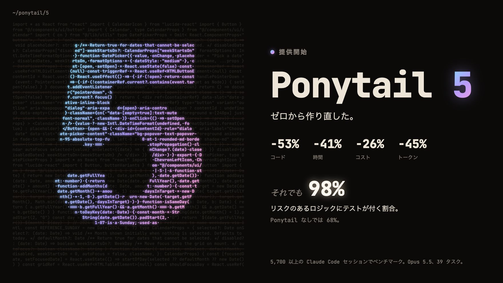
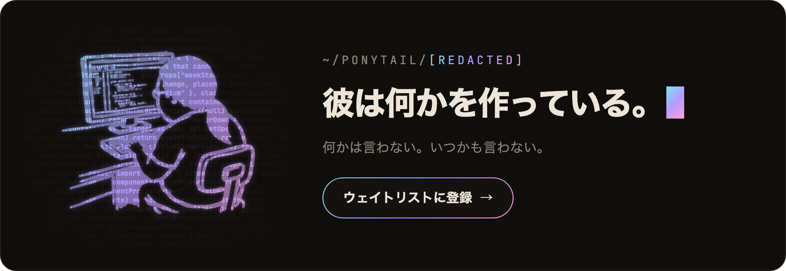
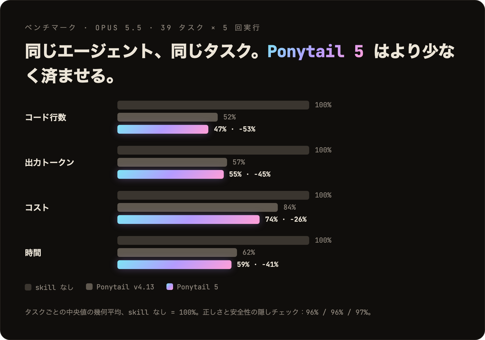
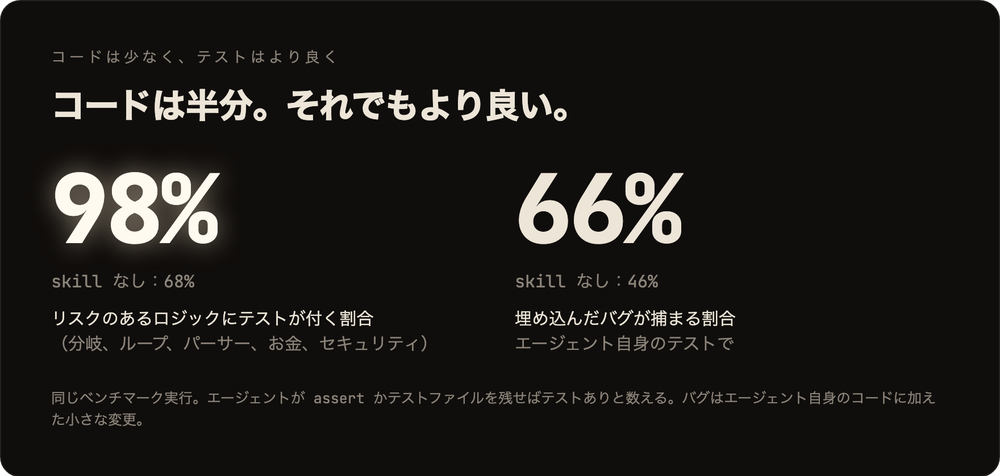
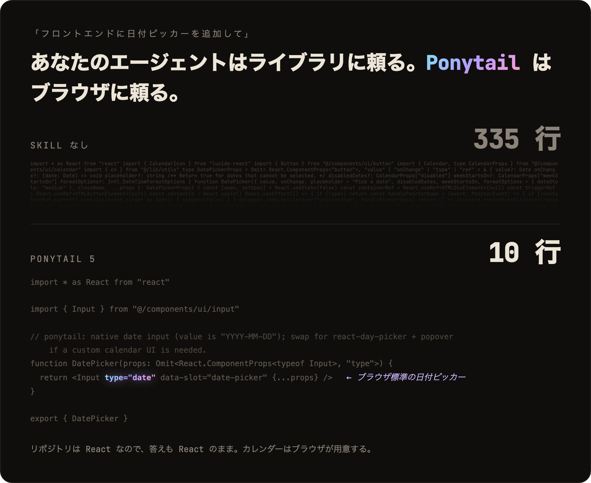
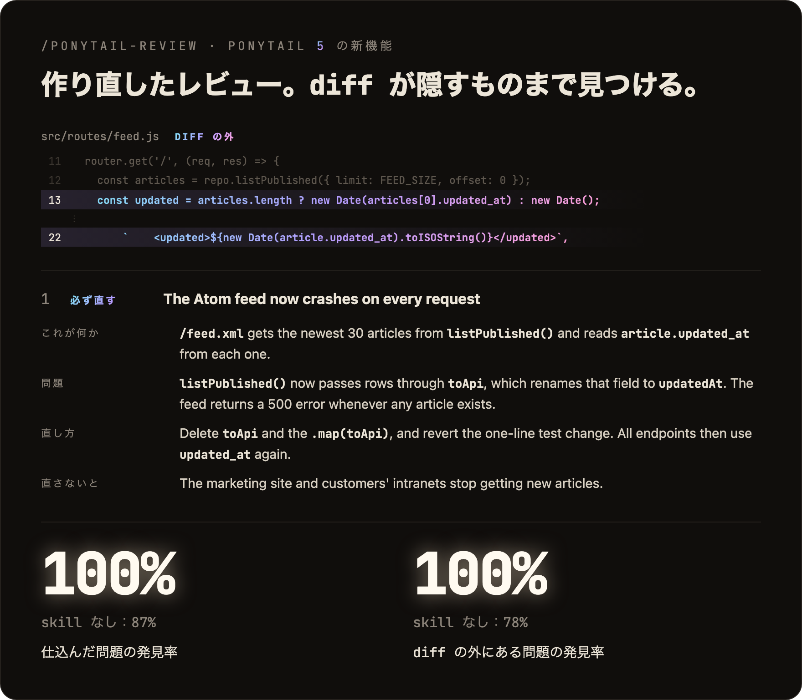
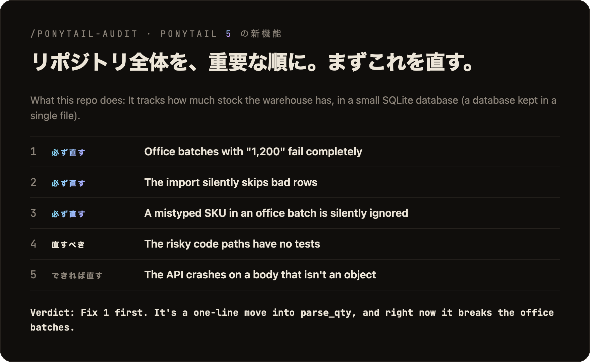
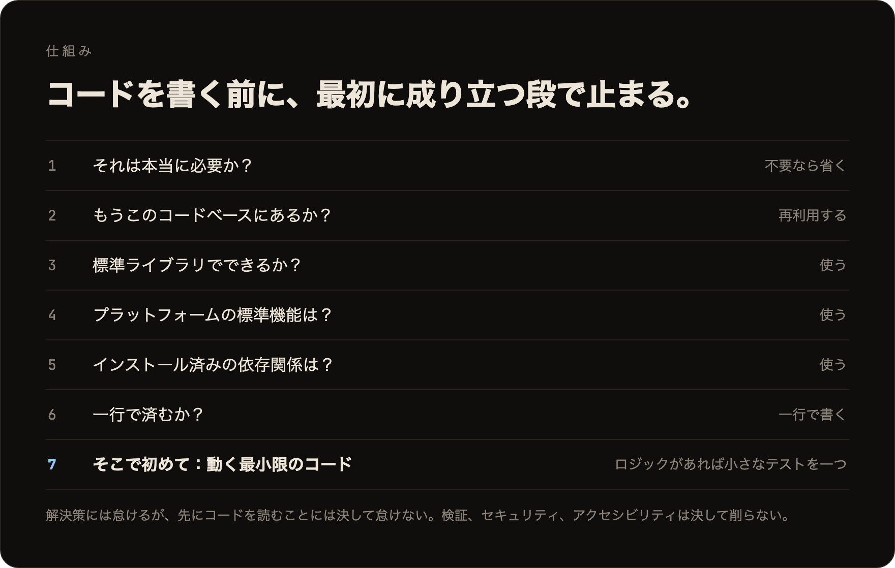

<p align="center">
  <picture>
    <source media="(prefers-color-scheme: dark)" srcset="../assets/logo-dark.png">
    
  </picture>
</p>

<h1 align="center">Ponytail</h1>

<p align="center">
  <em>彼は何も言わない。一行だけ書く。それで動く。</em>
</p>

<p align="center">
  <a href="https://trendshift.io/repositories/50668?utm_source=repository-badge&amp;utm_medium=badge&amp;utm_campaign=badge-repository-50668" target="_blank" rel="noopener noreferrer"></a>
</p>

<p align="center">
  
  
  
  
  
</p>

<p align="center">
  <a href="https://trendshift.io/repositories/50668" target="_blank" rel="noopener noreferrer"></a>
  <a href="https://trendshift.io/repositories/50668" target="_blank" rel="noopener noreferrer"></a>
  <a href="https://trendshift.io/repositories/50668?utm_source=trendshift-badge&amp;utm_medium=badge&amp;utm_campaign=badge-trendshift-50668" target="_blank" rel="noopener noreferrer"></a>
</p>

<p align="center">
  
</p>

<p align="center">
  <strong>Ponytail 5：ゼロから作り直した。</strong><br>
  <strong>コード -53% &middot; 時間 -41% &middot; コスト -26% &middot; トークン -45%</strong><br>
  <strong>それでも：リスクのあるロジックの 98% にテストが付く。</strong>Ponytail なしでは 68%。<br>
  <sub>Claude Code でベンチマーク。同じエージェントを skill あり・なしで比較：実際の FastAPI + React リポジトリを含む 39 タスク、Opus 5.5、各 5 回実行。<a href="#numbers">詳細</a>。</sub>
</p>

<p align="center">
  <sub><a href="../README.md">English</a> &middot; <a href="README.es.md">Español</a> &middot; <a href="README.ko.md">한국어</a> &middot; <a href="README.zh-CN.md">简体中文</a> &middot; 日本語</sub><br>
  <sub>英語の README からの翻訳です。内容が異なる場合は<a href="../README.md">英語版</a>が正です。</sub>
</p>

---

<p align="center">
  <a href="https://ponytail.dev/soon"></a>
</p>

## Ponytail で作られたもの

<a href="https://theretriever.app">
  <picture>
    <source media="(prefers-color-scheme: dark)" srcset="../assets/retriever-logo-dark.svg">
    
  </picture>
</a>

---

あの人を知っているはずだ。長いポニーテール。楕円の眼鏡。バージョン管理システムより長く会社にいる。五十行を見せると、黙って眺めて、それを一行に置き換える。

Ponytail は、その人をあなたの AI エージェントの中に入れる。

<a id="numbers"></a>
## 数字

<p align="center">
  
</p>

<p align="center">
  
</p>

グラフに表れないことが二つある。ブラインド比較では、Ponytail 5 の返答が前の Ponytail の返答に 110 対 67 で勝った。そしてセキュリティの 6 タスク（SQL インジェクション、パストラバーサル、偽造トークン、レート制限、不正な CSV 行、キャッシュ）では、全 30 回の実行に合格した。コードは少なく、安全性は落ちない。手法、タスクごとの表、制約：[benchmarks/results/2026-10-07-agentic.md](../benchmarks/results/2026-10-07-agentic.md)。

**ルールは一度も「トークンを最小に」ではなかった。**ルールはこうだ：タスクに必要なものだけを書き、検証、エラー処理、セキュリティ、アクセシビリティは決して削らない。コードが小さくなるのは必要な分だけだからであって、無理に詰めたからではない。コストとレイテンシの低下は副次的な効果だ。

## ビフォー / アフター

<p align="center">
  
</p>

日付ピッカーを頼む。Ponytail なしだと、エージェントは日付ピッカーのライブラリをインストールするか、カレンダーを丸ごと手で作る。335 行。Ponytail 5 はまず、すでにあるものを見る。リポジトリには `Input` コンポーネントがあり、どのブラウザにも日付ピッカーがある。その二つを組み合わせる。10 行。

生き残った例は [examples/](../examples/) にもっとある。

## 作り直したレビュー

<p align="center">
  
</p>

`/ponytail-review` は以前、削れるコードを探すだけだった。今は、壊れたときに呼び出されるシニア開発者のようにレビューする。diff だけでなく変更が触れるコードも読み、バグ、セキュリティ、実際の負荷、足りないテスト、速度、削れるものを確認する。各指摘には、そのコードが何をするか、何が問題か、直し方、直さないと何が起きるかが書かれる。

## 作り直した監査

<p align="center">
  
</p>

`/ponytail-audit` は同じチェックをリポジトリ全体に対して行う。まずコードの全体像をつかむ：エントリーポイント、データの流れ、プロジェクトが想定する負荷。それから見つけたものを重要な順に並べ、最初に何を直すべきかを教える。以前の監査は、削除するものを一覧にするだけだった。

## 仕組み

<p align="center">
  
</p>

このはしごは問題を理解した*あと*に動く。理解の代わりではない。変更が触れるコードを読み、実際の流れを追ってから段を選ぶ。解決策には怠けるが、読むことには決して怠けない。

怠け者だが、いい加減ではない。信頼境界での入力検証、データ損失への対処、セキュリティ、アクセシビリティは決して削らない。

分岐、ループ、パーサー、お金、セキュリティを含むロジックには、小さなテストを一つ残す。返答の最後には必ず、省いたことや確認していないこと、知っておくべきリスクが書かれる。

## プロンプト

Ponytail はひとつのプロンプトだ：[`skills/ponytail/SKILL.md`](../skills/ponytail/SKILL.md)。ルールファイルを読むエージェント向けの短縮版は [`AGENTS.md`](../AGENTS.md)。このリポジトリの残りは、すべてそのプロンプトをいろいろなエージェントに読み込ませるためのものだ。

## インストール

**Claude Code**、二つのプロンプトに分けて：

```
/plugin marketplace add DietrichGebert/ponytail
```
```
/plugin install ponytail@ponytail
```

**Codex：**

```bash
codex plugin marketplace add DietrichGebert/ponytail
codex plugin add ponytail@ponytail
```

そのあと Codex で `/hooks` を開き、二つのライフサイクルフックを信頼して、新しいスレッドを始める。

**その他のエージェント：**[`AGENTS.md`](../AGENTS.md) をプロジェクトにコピーするか、エージェントに [`skills/ponytail/SKILL.md`](../skills/ponytail/SKILL.md) を skill としてインストールするよう頼む。Copilot、Cursor、OpenCode、Gemini などの手順（英語）：**[INSTALL.md](../INSTALL.md)**。

これで終わり。彼なら満足するだろう。口には出さないが。

毎セッション有効で、いくつかのコマンドがある（[コマンド](#commands)を参照）。`/ponytail ultra` は、コードベースに個人的に腹が立ったとき用だ。起動時とモード切り替え時に、現在のモードが表示される。

ponytail は GitHub の `DietrichGebert/ponytail` か npm の `@dietrichgebert/ponytail` からだけインストールすること。`.exe` や `.dll` ファイルは決して含まれない。それを含むコピーは私のものではない。

<a id="commands"></a>
## コマンド

| コマンド | 内容 |
|----------|------|
| `/ponytail [lite \| full \| ultra \| off]` | 強度を設定するか、オフにする。引数なしの場合、オフならデフォルトのレベルでオンにし、オンなら現在のレベルを表示する。 |
| `/ponytail-review` | 壊れたときに呼び出されるシニア開発者のように、現在の diff をレビューする：バグ、セキュリティ、実際の負荷、テストのない危険なコード、遅い処理、削れるもの。各指摘には、そのコードが何をするか、何が問題か、直し方、直さないと何が起きるかが書かれる。範囲を狭めたり広げたりするには、対象を普通の言葉で書く：`uncommitted`、`staged`、`branch`、または PR のリンク。 |
| `/ponytail-audit` | 同じチェックをリポジトリ全体に対して行い、重要な順に並べる。 |
| `/ponytail-debt` | 後回しにした `shortcut:` の近道を一覧にまとめ、「あとで」が「永遠にやらない」にならないようにする。 |
| `/ponytail-gain` | ベンチマークで測定した効果（コード削減、コスト削減、速度向上）をスコアボードで表示する。 |
| `/ponytail-help` | 上記コマンドのクイックリファレンス。 |

コマンドには skill に対応したホストが必要だ（Claude Code、Codex、Devin CLI、OpenCode、Gemini、pi、Hermes Agent、Qoder、Grok Build）。Codex CLI と IDE 拡張では、プラグインの名前空間の下にある skill なので、`$ponytail:ponytail-review` のように呼び出す。[フック](../INSTALL.md#cursor)を使う Cursor では `/ponytail` のレベル切り替えだけが使え、普通のメッセージとして入力する。指示だけのアダプター（Cursor のルールファイル、Windsurf、Cline、Copilot、Kiro、Antigravity）は、コマンドなしで常時有効なルールだけを読み込む。

## よくある質問

**設定ファイルは必要？**
いらない。任意の `~/.config/ponytail/config.json` か環境変数 `PONYTAIL_DEFAULT_MODE` でデフォルトのレベルを設定できるが、必須のものはない。

**なぜ `shortcut:` コメントを書くの？**
意図的な近道と、いつ見直すかを示すため。`/ponytail-debt` がそれを一覧にまとめる。別の単語にしたい、あるいは書かせたくない？ プロジェクトの `CLAUDE.md` か `AGENTS.md` にそう書いて、`/ponytail-debt <好きな単語>` を実行すればいい。

**120 行のキャッシュクラスが本当に必要だったら？**
必要ない。それでも言い張れば作ってくれる。ゆっくり。正確に。あなたを見つめながら。

**スケールする？**
書かなかったコードは無限にスケールする。バグ 0、CVE 0、太古の昔から稼働率 100%。

**なぜ「ponytail」？**
理由はよくわかっているはずだ。

## スポンサー

<p align="center">
  <a href="https://greenpt.com/">
    <picture>
      <source media="(prefers-color-scheme: dark)" srcset="../assets/logo-greenpt-dark.svg">
      
    </picture>
  </a>
</p>

## ライセンス

[MIT](../LICENSE)。動く中でいちばん短いライセンス。

## スター履歴

<a href="https://www.star-history.com/dietrichgebert/ponytail#history">
 <picture>
   <source media="(prefers-color-scheme: dark)" srcset="https://api.star-history.com/chart?repos=DietrichGebert/ponytail&type=Date&theme=dark" />
   <source media="(prefers-color-scheme: light)" srcset="https://api.star-history.com/chart?repos=DietrichGebert/ponytail&type=Date" />
   
 </picture>
</a>
