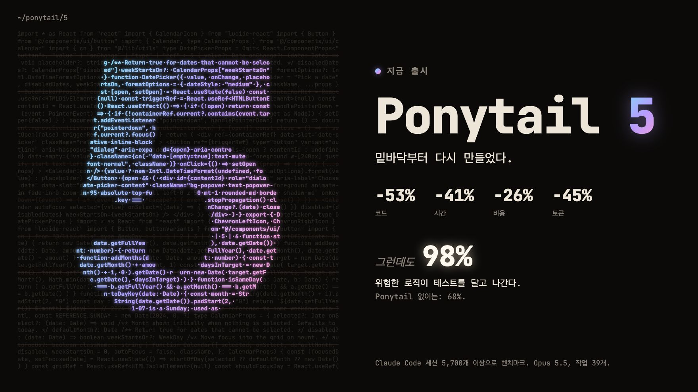
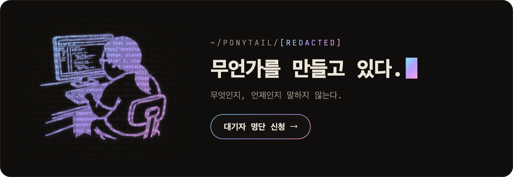
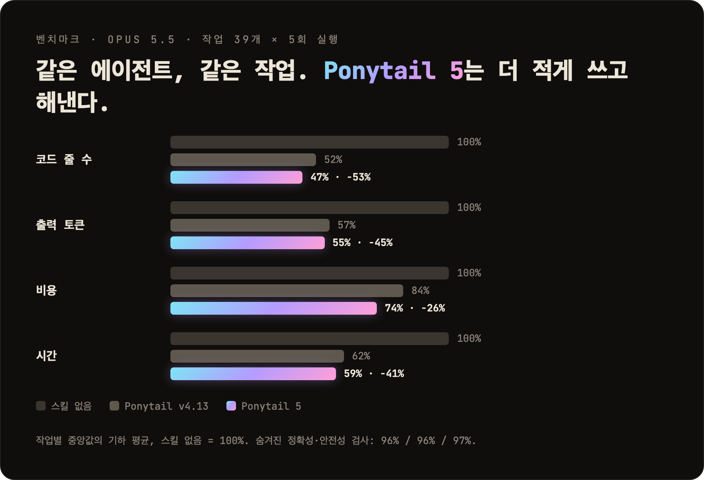
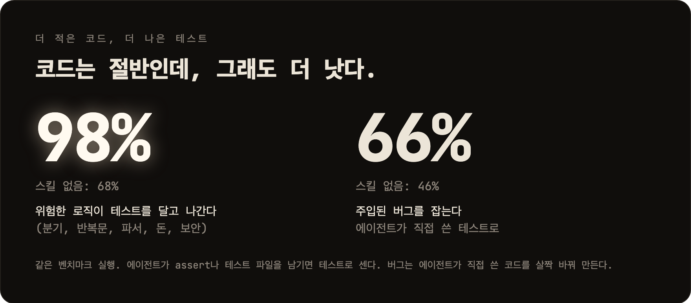
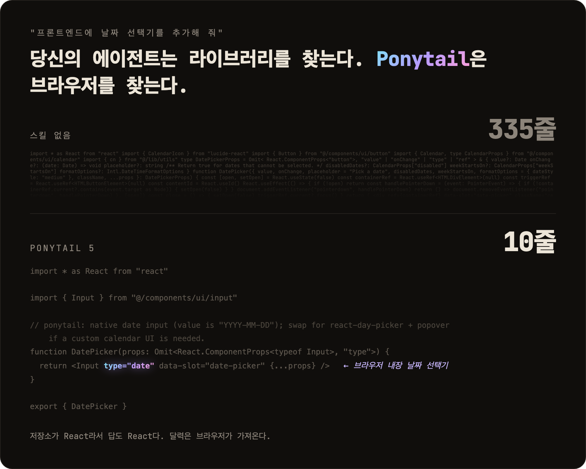
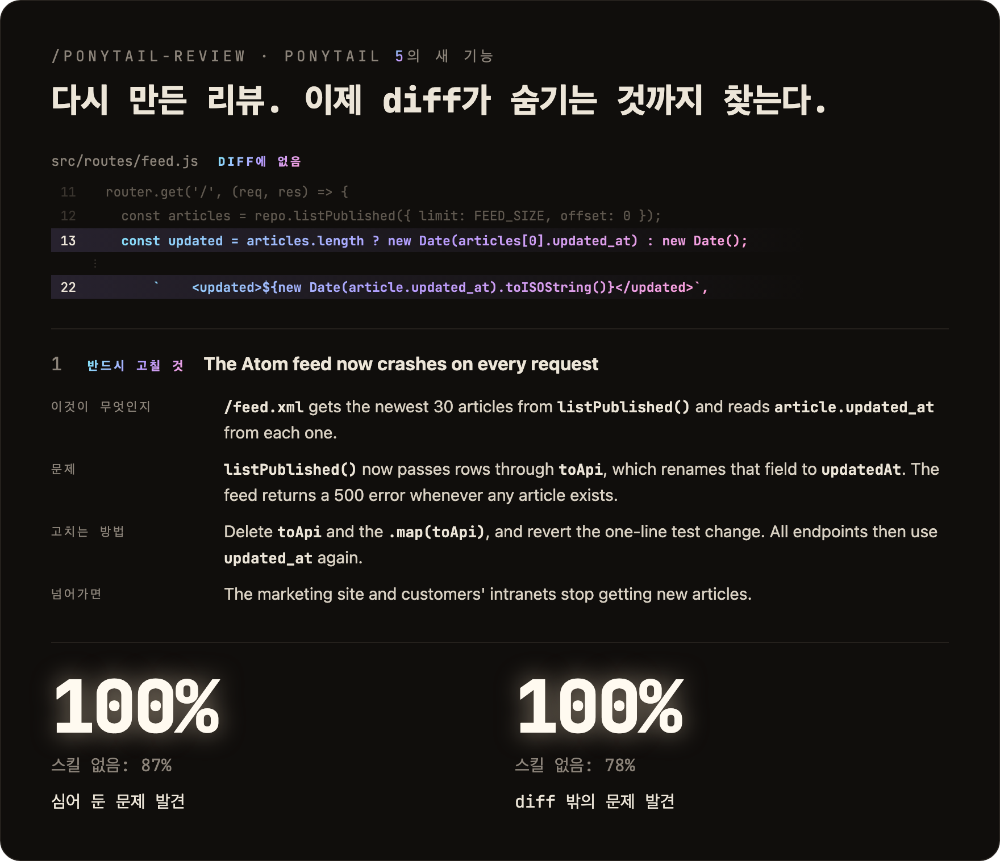
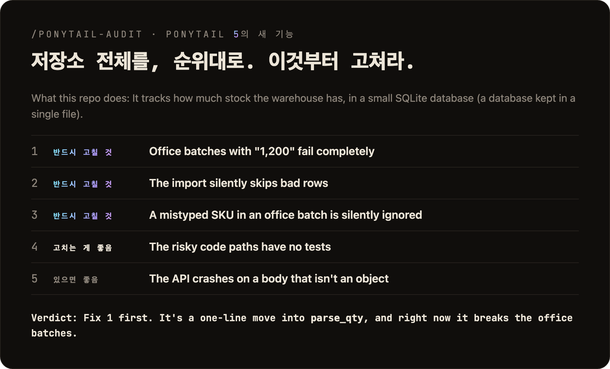
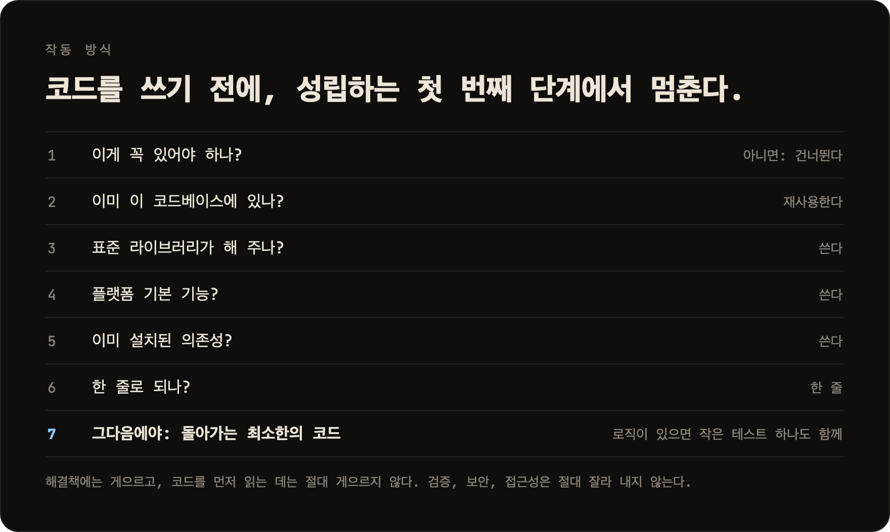

<p align="center">
  <picture>
    <source media="(prefers-color-scheme: dark)" srcset="../assets/logo-dark.png">
    
  </picture>
</p>

<h1 align="center">Ponytail</h1>

<p align="center">
  <em>아무 말도 안 한다. 한 줄 쓴다. 돌아간다.</em>
</p>

<p align="center">
  <a href="https://trendshift.io/repositories/50668?utm_source=repository-badge&amp;utm_medium=badge&amp;utm_campaign=badge-repository-50668" target="_blank" rel="noopener noreferrer"></a>
</p>

<p align="center">
  
  
  
  
  
</p>

<p align="center">
  <a href="https://trendshift.io/repositories/50668" target="_blank" rel="noopener noreferrer"></a>
  <a href="https://trendshift.io/repositories/50668" target="_blank" rel="noopener noreferrer"></a>
  <a href="https://trendshift.io/repositories/50668?utm_source=trendshift-badge&amp;utm_medium=badge&amp;utm_campaign=badge-trendshift-50668" target="_blank" rel="noopener noreferrer"></a>
</p>

<p align="center">
  
</p>

<p align="center">
  <strong>Ponytail 5: 밑바닥부터 다시 만들었다.</strong><br>
  <strong>코드 -53% &middot; 시간 -41% &middot; 비용 -26% &middot; 토큰 -45%</strong><br>
  <strong>그런데도: 위험한 로직의 98%가 테스트를 달고 나간다.</strong> Ponytail 없이는: 68%.<br>
  <sub>Claude Code에서 같은 에이전트를 스킬이 있을 때와 없을 때로 벤치마크했다: 실제 FastAPI + React 저장소를 포함한 작업 39개, Opus 5.5, 각 5회 실행. <a href="#numbers">자세히</a>.</sub>
</p>

<p align="center">
  <sub><a href="../README.md">English</a> &middot; <a href="README.es.md">Español</a> &middot; 한국어 &middot; <a href="README.zh-CN.md">简体中文</a> &middot; <a href="README.ja.md">日本語</a></sub><br>
  <sub>영어 README의 번역본이다. 내용이 다르면 <a href="../README.md">영어판</a>이 기준이다.</sub>
</p>

---

<p align="center">
  <a href="https://ponytail.dev/soon"></a>
</p>

## Ponytail로 이미 만든 것

<a href="https://theretriever.app">
  <picture>
    <source media="(prefers-color-scheme: dark)" srcset="../assets/retriever-logo-dark.svg">
    
  </picture>
</a>

---

누군지 알 것이다. 긴 포니테일. 타원형 안경. 버전 관리 시스템보다 회사에 오래 있었다. 쉰 줄을 보여 주면 가만히 보다가, 아무 말 없이 한 줄로 바꿔 놓는다.

Ponytail은 그 사람을 당신의 AI 에이전트 안에 넣는다.

<a id="numbers"></a>
## 수치

<p align="center">
  
</p>

<p align="center">
  
</p>

차트가 보여 주지 않는 것이 두 가지 있다. 블라인드 비교에서 Ponytail 5의 답변은 이전 Ponytail의 답변을 110 대 67로 이겼다. 그리고 보안 작업 6개(SQL 인젝션, 경로 탐색, 위조 토큰, 요청 속도 제한, 잘못된 CSV 행, 캐싱)에서 30회 실행을 모두 통과했다: 코드는 줄었지만, 안전성은 그대로다. 방법, 작업별 표, 한계: [benchmarks/results/2026-10-07-agentic.md](../benchmarks/results/2026-10-07-agentic.md).

**규칙은 처음부터 "토큰을 가장 적게"가 아니었다.** 규칙은 이것이다: 작업에 필요한 것만 쓰고, 검증, 오류 처리, 보안, 접근성은 절대 잘라 내지 않는다. 코드가 작아지는 것은 필요한 만큼이기 때문이지, 억지로 줄였기 때문이 아니다. 비용과 지연 시간이 줄어드는 것은 부수 효과다.

## 전 / 후

<p align="center">
  
</p>

날짜 선택기를 부탁한다. Ponytail이 없으면 에이전트는 날짜 선택기 라이브러리를 설치하거나, 달력 전체를 손으로 만든다: 335줄. Ponytail 5는 먼저 이미 있는 것을 본다: 저장소에는 `Input` 컴포넌트가 있고, 모든 브라우저에는 날짜 선택기가 있다. 그 둘을 합친다. 10줄.

살아남은 예제는 [examples/](../examples/)에 더 있다.

## 다시 만든 리뷰

<p align="center">
  
</p>

`/ponytail-review`는 원래 잘라 낼 코드만 찾았다. 이제는 장애가 나면 호출되는 시니어 개발자처럼 리뷰한다: diff만 보지 않고 변경이 닿는 코드까지 읽고, 버그, 보안, 실제 부하, 빠진 테스트, 속도, 잘라 낼 것을 확인한다. 지적마다 그 코드가 하는 일, 무엇이 잘못되는지, 고치는 방법, 고치지 않으면 생기는 일을 적는다.

## 다시 만든 감사

<p align="center">
  
</p>

`/ponytail-audit`는 같은 점검을 저장소 전체에 한다. 먼저 코드의 지도를 그린다: 진입점, 데이터가 흘러가는 길, 프로젝트가 예상하는 부하. 그다음 찾은 것에 순위를 매기고 무엇부터 고칠지 알려 준다. 예전 감사 기능은 지울 것만 나열했다.

## 작동 방식

<p align="center">
  
</p>

이 사다리는 문제를 이해한 *다음에* 돈다. 이해를 대신하지 않는다. 변경이 닿는 코드를 읽고 실제 흐름을 따라간 뒤에 단계를 고른다. 해결책에는 게으르고, 읽기에는 절대 게으르지 않다.

게으르지만 무책임하지는 않다. 신뢰 경계의 입력 검증, 데이터 손실 처리, 보안, 접근성은 절대 잘라 내지 않는다.

분기, 반복문, 파서, 돈이나 보안이 들어간 로직은 작은 테스트 하나를 남긴다. 모든 답변은 건너뛴 것이나 확인하지 않은 것, 그리고 알아야 할 위험으로 끝난다.

## 프롬프트

Ponytail은 프롬프트 하나다: [`skills/ponytail/SKILL.md`](../skills/ponytail/SKILL.md). 규칙 파일을 읽는 에이전트용 압축판은 [`AGENTS.md`](../AGENTS.md)다. 이 저장소의 나머지는 전부 그 프롬프트를 여러 에이전트에 넣기 위한 것이다.

## 설치

**Claude Code**, 프롬프트 두 개로 나눠서:

```
/plugin marketplace add DietrichGebert/ponytail
```
```
/plugin install ponytail@ponytail
```

**Codex:**

```bash
codex plugin marketplace add DietrichGebert/ponytail
codex plugin add ponytail@ponytail
```

그다음 Codex에서 `/hooks`를 열어 라이프사이클 훅 두 개를 신뢰하고, 새 스레드를 시작한다.

**그 밖의 에이전트:** [`AGENTS.md`](../AGENTS.md)를 프로젝트에 복사하거나, 에이전트에게 [`skills/ponytail/SKILL.md`](../skills/ponytail/SKILL.md)를 스킬로 설치해 달라고 하면 된다. Copilot, Cursor, OpenCode, Gemini 등의 단계별 설치 방법(영어): **[INSTALL.md](../INSTALL.md)**.

이게 다다. 그 사람이라면 뿌듯해할 것이다. 말은 안 하겠지만.

모든 세션에서 켜져 있고, 명령어가 몇 개 있다 ([명령어](#commands) 참고). `/ponytail ultra`는 코드베이스가 당신을 개인적으로 화나게 했을 때를 위한 것이다. 시작할 때와 모드를 바꿀 때 현재 모드가 표시된다.

ponytail은 GitHub의 `DietrichGebert/ponytail`이나 npm의 `@dietrichgebert/ponytail`에서만 설치한다. `.exe`나 `.dll` 파일은 절대 들어 있지 않다. 그런 파일이 들어 있는 사본은 내 것이 아니다.

<a id="commands"></a>
## 명령어

| 명령어 | 하는 일 |
|--------|---------|
| `/ponytail [lite \| full \| ultra \| off]` | 강도를 정하거나 끈다. 인자 없이 쓰면, 꺼져 있을 때는 기본 레벨로 켜고, 켜져 있을 때는 현재 레벨을 알려 준다. |
| `/ponytail-review` | 장애가 나면 호출되는 시니어 개발자처럼 현재 diff를 리뷰한다: 버그, 보안, 실제 부하, 테스트 없는 위험한 코드, 느린 부분, 지울 수 있는 것. 지적마다 그 코드가 하는 일, 무엇이 잘못되는지, 고치는 방법, 고치지 않으면 생기는 일을 적는다. 범위를 좁히거나 넓히려면 대상을 평범한 말로 적는다: `uncommitted`, `staged`, `branch`, 또는 PR 링크. |
| `/ponytail-audit` | 같은 점검을 저장소 전체에 하고, 중요한 것부터 보여 준다. |
| `/ponytail-debt` | 미뤄 둔 `ponytail:` 지름길을 목록으로 모아, "나중에"가 "절대 안 함"이 되지 않게 한다. |
| `/ponytail-gain` | 벤치마크에서 측정한 효과(코드 감소, 비용 감소, 속도 향상)를 점수판으로 보여 준다. |
| `/ponytail-help` | 위 명령어들의 빠른 참고. |

명령어는 스킬을 지원하는 호스트가 있어야 한다 (Claude Code, Codex, Devin CLI, OpenCode, Gemini, pi, Hermes Agent, Qoder, Grok Build). Codex CLI와 IDE 확장에서는 플러그인 네임스페이스 아래의 스킬이므로 `$ponytail:ponytail-review`처럼 부른다. [훅](../INSTALL.md#cursor)을 쓰는 Cursor는 `/ponytail` 레벨 전환만 되고, 일반 메시지로 입력한다. 지시문만 쓰는 어댑터(Cursor 규칙 파일, Windsurf, Cline, Copilot, Kiro, Antigravity)는 명령어 없이 항상 켜진 규칙만 불러온다.

## 자주 묻는 질문

**설정 파일이 필요한가?**
아니다. 선택 사항인 `~/.config/ponytail/config.json`이나 `PONYTAIL_DEFAULT_MODE` 환경 변수로 기본 레벨을 정할 수 있지만, 필요한 것은 없다.

**120줄짜리 캐시 클래스가 정말 필요하면?**
필요 없다. 그래도 고집하면 만들어 준다. 천천히. 정확하게. 당신을 쳐다보면서.

**확장성은?**
쓰지 않은 코드는 무한히 확장된다. 버그 0개, CVE 0개, 태초부터 가동률 100%.

**왜 "ponytail"인가?**
왜인지 정확히 알 것이다.

## 후원

<p align="center">
  <a href="https://greenpt.com/">
    <picture>
      <source media="(prefers-color-scheme: dark)" srcset="../assets/logo-greenpt-dark.svg">
      
    </picture>
  </a>
</p>

## 라이선스

[MIT](../LICENSE). 돌아가는 가장 짧은 라이선스.

## 스타 기록

<a href="https://www.star-history.com/dietrichgebert/ponytail#history">
 <picture>
   <source media="(prefers-color-scheme: dark)" srcset="https://api.star-history.com/chart?repos=DietrichGebert/ponytail&type=Date&theme=dark" />
   <source media="(prefers-color-scheme: light)" srcset="https://api.star-history.com/chart?repos=DietrichGebert/ponytail&type=Date" />
   
 </picture>
</a>
