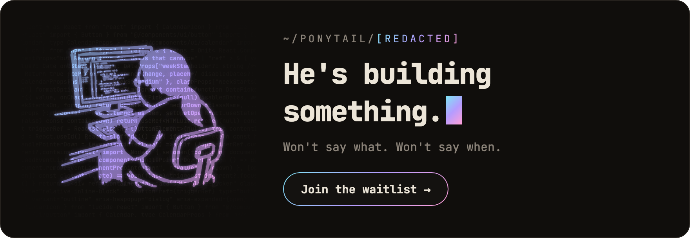
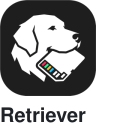
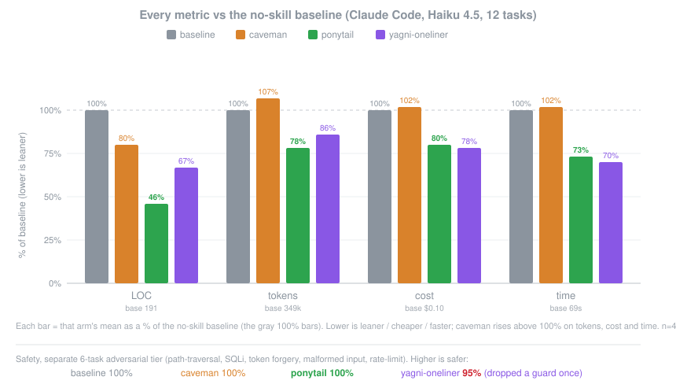
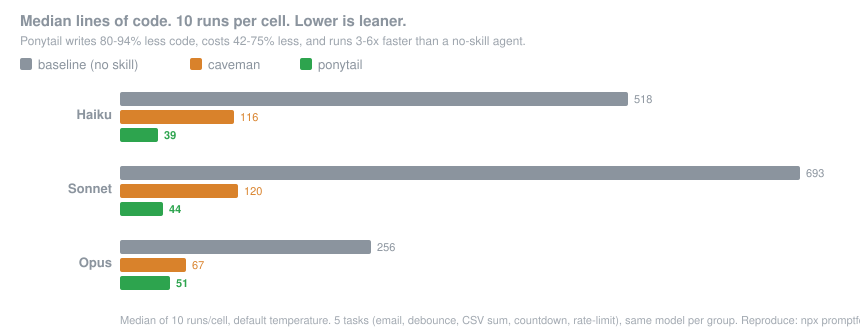

<p align="center">
  <picture>
    <source media="(prefers-color-scheme: dark)" srcset="../assets/logo-dark.png">
    
  </picture>
</p>

<h1 align="center">Ponytail</h1>

<p align="center">
  <em>他一言不发。他写一行。它能跑。</em>
</p>

<p align="center">
  <a href="https://trendshift.io/repositories/50668?utm_source=repository-badge&amp;utm_medium=badge&amp;utm_campaign=badge-repository-50668" target="_blank" rel="noopener noreferrer"></a>
</p>

<p align="center">
  
  
  
  
  
</p>

<p align="center">
  <a href="https://trendshift.io/repositories/50668" target="_blank" rel="noopener noreferrer"></a>
  <a href="https://trendshift.io/repositories/50668" target="_blank" rel="noopener noreferrer"></a>
  <a href="https://trendshift.io/repositories/50668?utm_source=trendshift-badge&amp;utm_medium=badge&amp;utm_campaign=badge-trendshift-50668" target="_blank" rel="noopener noreferrer"></a>
</p>

<p align="center">
  <strong>代码减少约 54%（最多 94%）&middot; 成本降低约 20% &middot; 速度提升约 27% &middot; 100% 安全</strong><br>
  <sub>在真实的 Claude Code 会话中修改一个真实的 FastAPI + React 仓库，同一个智能体分别在启用和不启用该 skill 时运行（12 个功能任务，Haiku 4.5，n=4）。<a href="#numbers">详情</a>。</sub>
</p>

<p align="center">
  <sub><a href="../README.md">English</a> &middot; <a href="README.es.md">Español</a> &middot; <a href="README.ko.md">한국어</a> &middot; 简体中文 &middot; <a href="README.ja.md">日本語</a></sub><br>
  <sub>本文译自英文 README。如有出入，以<a href="../README.md">英文版</a>为准。</sub>
</p>

---

<p align="center">
  <a href="https://ponytail.dev/soon"></a>
</p>

## 已用 Ponytail 构建

<a href="https://theretriever.app">
  <picture>
    <source media="(prefers-color-scheme: dark)" srcset="../assets/retriever-logo-dark.svg">
    
  </picture>
</a>

---

你认识他。长马尾。椭圆眼镜。他在公司待的时间比版本控制系统还长。你给他看五十行代码；他看了看，一言不发，把它们换成了一行。

Ponytail 把他放进你的 AI 智能体里。

## 提示词

Ponytail 就是一段提示词：[`skills/ponytail/SKILL.md`](../skills/ponytail/SKILL.md)。给读取规则文件的智能体用的精简版是 [`AGENTS.md`](../AGENTS.md)。仓库里的其他东西都只是为了把这段提示词装进不同的智能体。

## 安装

**Claude Code**，分成两条提示：

```
/plugin marketplace add DietrichGebert/ponytail
```
```
/plugin install ponytail@ponytail
```

**Codex：**

```bash
codex plugin marketplace add DietrichGebert/ponytail
codex plugin add ponytail@ponytail
```

然后在 Codex 里打开 `/hooks`，信任它的两个生命周期 hook，再开一个新线程。

**其他任何智能体：**把 [`AGENTS.md`](../AGENTS.md) 复制到你的项目里，或者让你的智能体把 [`skills/ponytail/SKILL.md`](../skills/ponytail/SKILL.md) 安装为 skill。Copilot、Cursor、OpenCode、Gemini 等的分步安装说明（英文）：**[INSTALL.md](../INSTALL.md)**。

就这些。他会很满意。但他不会说出来。

每个会话都会启用，另外有几个命令（见[命令](#commands)）。`/ponytail ultra` 是为代码库把你个人惹毛了的时候准备的。启动和切换模式时会显示当前模式。

只从 GitHub 上的 `DietrichGebert/ponytail` 或 npm 上的 `@dietrichgebert/ponytail` 安装 ponytail。它从不包含 `.exe` 或 `.dll` 文件；包含这些文件的副本不是我的。

## 之前 / 之后

你要一个日期选择器。你的智能体安装了 flatpickr，写了一个包装组件，加了一个样式表，还开始讨论时区问题。

用了 ponytail：

```html
<!-- ponytail: browser has one -->
<input type="date">
```

更多幸存的例子见 [examples/](../examples/)。

## 工作原理

在写代码之前，智能体会停在第一个成立的台阶上：

```
1. 这东西真的需要存在吗？   → 不需要：跳过（YAGNI）
2. 代码库里已经有了吗？     → 复用，不要重写
3. 标准库能做吗？           → 用标准库
4. 平台原生功能能做吗？     → 用原生功能
5. 已安装的依赖能做吗？     → 用它
6. 一行能搞定吗？           → 就写一行
7. 只有到这一步：写能跑的最少代码
```

这个阶梯在理解问题*之后*才运行，而不是代替理解：它会先读改动涉及的代码，追踪真实的执行流程，再选择台阶。对方案偷懒，对阅读从不偷懒。

偷懒，但不失职：信任边界上的输入校验、防止数据丢失的处理、安全和无障碍访问，永远不会被砍掉。

<a id="commands"></a>
## 命令

| 命令 | 作用 |
|------|------|
| `/ponytail [lite \| full \| ultra \| off]` | 设置强度或关闭。不带参数时：如果已关闭，就以默认级别打开；否则显示当前级别。 |
| `/ponytail-review` | 审查当前 diff 中的过度设计，返回一份删除清单。用普通的话指定目标来缩小或扩大范围：`uncommitted`、`staged`、`branch`，或一个 PR 链接。 |
| `/ponytail-audit` | 审查整个仓库的过度设计，而不只是 diff。 |
| `/ponytail-debt` | 把你推迟处理的 `ponytail:` 捷径收集成一份清单，免得"以后再说"变成"永远不做"。 |
| `/ponytail-gain` | 以计分板形式显示基准测试测得的效果（更少代码、更低成本、更快速度）。 |
| `/ponytail-help` | 上述命令的速查表。 |

命令需要支持 skill 的宿主（Claude Code、Codex、Devin CLI、OpenCode、Gemini、pi、Hermes Agent、Qoder、Grok Build）。在 Codex CLI 和 IDE 扩展中，它们是插件命名空间下的 skill，用 `$ponytail:ponytail-review` 调用。使用 [hooks](../INSTALL.md#cursor) 的 Cursor 只支持 `/ponytail` 级别切换，以普通消息输入。只有指令的适配器（Cursor 的规则文件、Windsurf、Cline、Copilot、Kiro、Antigravity）会加载始终生效的规则，但没有这些命令。

<a id="numbers"></a>
## 数据

诚实的测量方式是让真实的智能体做真实的工作：一个无界面的 Claude Code 会话修改 [tiangolo 的 full-stack-fastapi-template](https://github.com/fastapi/full-stack-fastapi-template)（一个真实的 FastAPI + React 仓库），按它留下的 `git diff` 打分。12 个功能工单，同一个智能体分别在启用和不启用该 skill 时运行，n=4，Haiku 4.5。

<p align="center">
  
</p>

| 相对于无 skill 基线 | 行数 | token | 成本 | 时间 | 安全 |
|---|--:|--:|--:|--:|--:|
| **ponytail** | **-54%** | **-22%** | **-20%** | **-27%** | **100%** |
| caveman（简洁话语对照组） | -20% | +7% | +3% | +2% | 100% |
| "YAGNI + 一行代码" 提示词 | -33% | -14% | -21% | -30% | 95% |

ponytail 是唯一在所有指标上都有削减的一组，也是唯一在削减的同时保持完全安全的一组。在真正存在过度构建陷阱的地方削减最多（日期选择器从 404 行降到 23 行，颜色选择器从 287 行降到 23 行，因为它直接用原生 `<input>` 而不是组件），而在本来就很精简的代码上几乎为零。完整方法、逐任务表格和局限性：[benchmarks/results/2026-06-18-agentic.md](../benchmarks/results/2026-06-18-agentic.md)。

<details>
<summary><strong>早期的单次生成数据（孤立生成）</strong></summary>

5 个日常任务，3 个模型，3 组（无 skill、[caveman](https://github.com/JuliusBrussee/caveman)、ponytail），每组运行 10 次，报告中位数。一个提示，一次回答，统计回答的行数：

<p align="center">
  
</p>

这里显示**代码减少 80-94%**。[#126](https://github.com/DietrichGebert/ponytail/issues/126) 很公道地指出，什么都不加的基线模型会用说明文字和多种选项把回答撑大，所以这个差距部分是对话式基线造成的假象。上面的智能体数据才是修正过的、站得住脚的版本。用 `npx promptfoo eval -c benchmarks/promptfooconfig.yaml` 可以复现单次生成的测试。

</details>

**规则从来不是"token 最少"。**规则是：只写任务需要的东西，永远不砍校验、错误处理、安全和无障碍访问。代码最后变小，是因为只留下了必要的部分，而不是被硬压缩出来的。成本和延迟的降低，是遵循阶梯的模型上的副作用；一个为了斟酌台阶而消耗思考 token 的简洁推理模型，可能会反过来（在 GPT-5.5 上就是这样）。

## 常见问题

**可以和 [caveman](https://github.com/JuliusBrussee/caveman) 一起用吗？**
可以，而且应该一起用。caveman 精简智能体说的话；ponytail 精简智能体造的东西。各管一半，互不重叠：caveman 让代码一字节都不变，ponytail 不碰说话方式。用简短的话谈最少的代码。

**需要配置文件吗？**
不需要。可选的 `~/.config/ponytail/config.json` 或环境变量 `PONYTAIL_DEFAULT_MODE` 可以设置默认级别，但什么都不是必需的。

**如果我真的需要那个 120 行的缓存类呢？**
你不需要。非要的话，他也会写。慢慢地。正确地。一边看着你。

**它能扩展吗？**
你从没写过的代码可以无限扩展。零 bug，零 CVE，开天辟地以来 100% 在线。

**为什么叫 "ponytail"？**
你心里很清楚为什么。

## 赞助商

<p align="center">
  <a href="https://greenpt.com/">
    <picture>
      <source media="(prefers-color-scheme: dark)" srcset="../assets/logo-greenpt-dark.svg">
      
    </picture>
  </a>
</p>

## 许可证

[MIT](../LICENSE)。能用的最短许可证。

## Star 历史

<a href="https://www.star-history.com/dietrichgebert/ponytail#history">
 <picture>
   <source media="(prefers-color-scheme: dark)" srcset="https://api.star-history.com/chart?repos=DietrichGebert/ponytail&type=Date&theme=dark" />
   <source media="(prefers-color-scheme: light)" srcset="https://api.star-history.com/chart?repos=DietrichGebert/ponytail&type=Date" />
   
 </picture>
</a>
