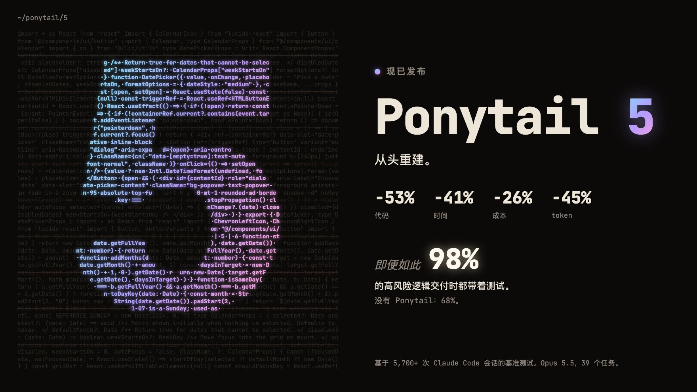
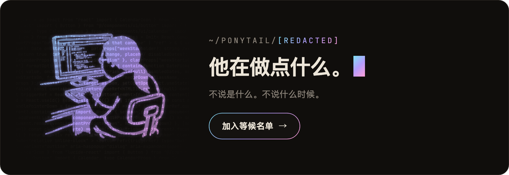
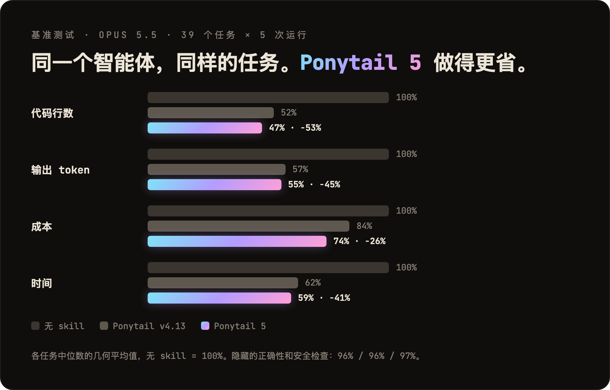
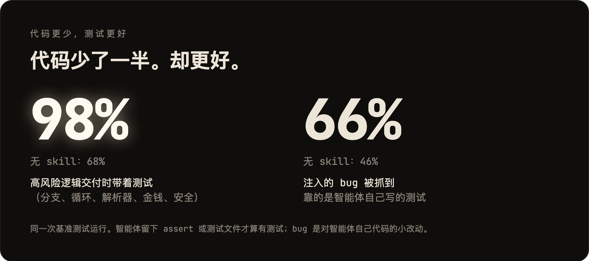
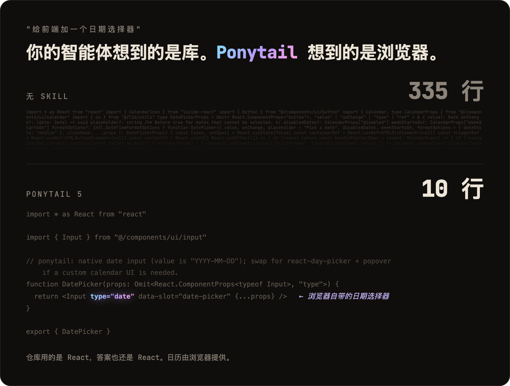
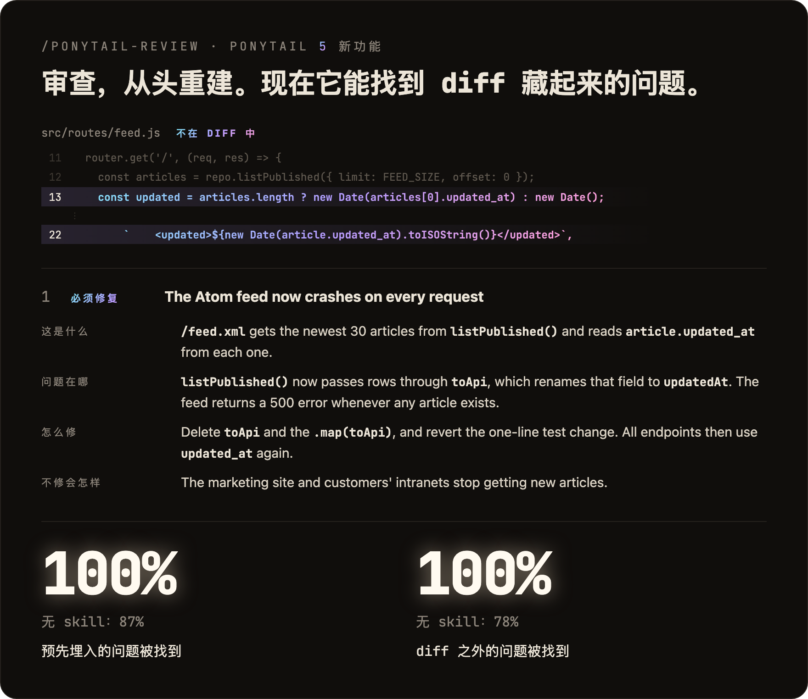
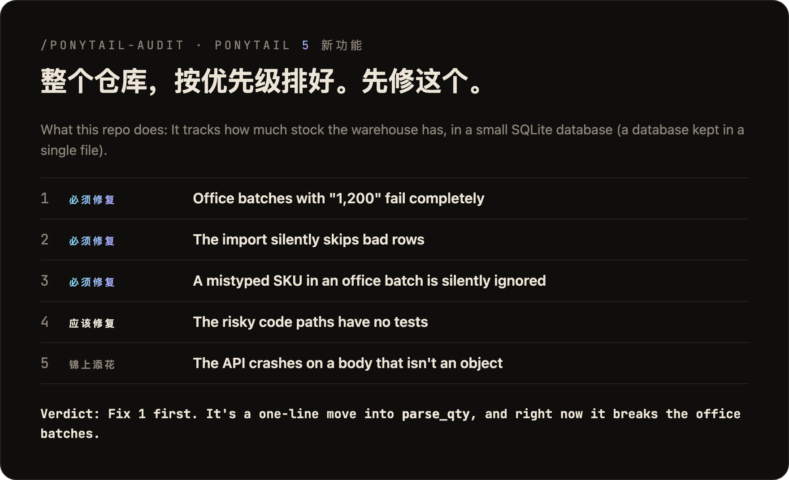
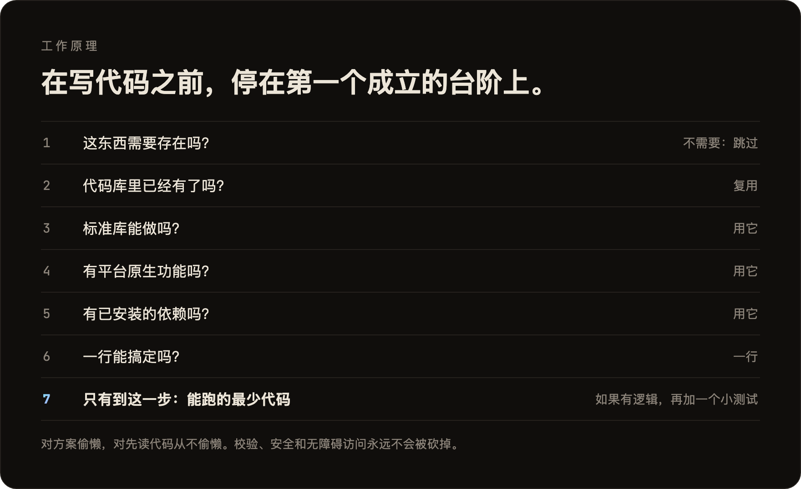

<p align="center">
  <picture>
    <source media="(prefers-color-scheme: dark)" srcset="../assets/logo-dark.png">
    
  </picture>
</p>

<h1 align="center">Ponytail</h1>

<p align="center">
  <em>他一言不发。他写一行。它能跑。</em>
</p>

<p align="center">
  <a href="https://trendshift.io/repositories/50668?utm_source=repository-badge&amp;utm_medium=badge&amp;utm_campaign=badge-repository-50668" target="_blank" rel="noopener noreferrer"></a>
</p>

<p align="center">
  
  
  
  
  
</p>

<p align="center">
  <a href="https://trendshift.io/repositories/50668" target="_blank" rel="noopener noreferrer"></a>
  <a href="https://trendshift.io/repositories/50668" target="_blank" rel="noopener noreferrer"></a>
  <a href="https://trendshift.io/repositories/50668?utm_source=trendshift-badge&amp;utm_medium=badge&amp;utm_campaign=badge-trendshift-50668" target="_blank" rel="noopener noreferrer"></a>
</p>

<p align="center">
  
</p>

<p align="center">
  <strong>Ponytail 5：从头重建。</strong><br>
  <strong>代码 -53% &middot; 时间 -41% &middot; 成本 -26% &middot; token -45%</strong><br>
  <strong>即便如此：98% 的高风险逻辑交付时都带着测试。</strong>没有 Ponytail：68%。<br>
  <sub>在 Claude Code 中测得，同一个智能体分别在启用和不启用该 skill 时运行：39 个任务，其中包括一个真实的 FastAPI + React 仓库，Opus 5.5，每个任务运行 5 次。<a href="#numbers">详情</a>。</sub>
</p>

<p align="center">
  <sub><a href="../README.md">English</a> &middot; <a href="README.es.md">Español</a> &middot; <a href="README.ko.md">한국어</a> &middot; 简体中文 &middot; <a href="README.ja.md">日本語</a></sub><br>
  <sub>本文译自英文 README。如有出入，以<a href="../README.md">英文版</a>为准。</sub>
</p>

---

<p align="center">
  <a href="https://ponytail.dev/soon"></a>
</p>

## 已用 Ponytail 构建

<a href="https://theretriever.app">
  <picture>
    <source media="(prefers-color-scheme: dark)" srcset="../assets/retriever-logo-dark.svg">
    
  </picture>
</a>

---

你认识他。长马尾。椭圆眼镜。他在公司待的时间比版本控制系统还长。你给他看五十行代码；他看了看，一言不发，把它们换成了一行。

Ponytail 把他放进你的 AI 智能体里。

<a id="numbers"></a>
## 数据

<p align="center">
  
</p>

<p align="center">
  
</p>

图表里没有体现的两点：在盲测对比中，Ponytail 5 的回复以 110 比 67 胜过上一版 Ponytail。另外，在 6 个安全任务上（SQL 注入、路径穿越、伪造 token、限流、格式错误的 CSV 行、缓存），它全部 30 次运行都通过了：代码更少，安全一点不少。方法、逐任务表格和局限性：[benchmarks/results/2026-10-07-agentic.md](../benchmarks/results/2026-10-07-agentic.md)。

**规则从来不是"token 最少"。**规则是：只写任务需要的东西，永远不砍校验、错误处理、安全和无障碍访问。代码最后变小，是因为只留下了必要的部分，而不是被硬压缩出来的。成本和延迟的降低只是副作用。

## 之前 / 之后

<p align="center">
  
</p>

你要一个日期选择器。没有 Ponytail，智能体会安装一个日期选择器库，或者干脆手写一整个日历：335 行。Ponytail 5 会先看看已经有什么：仓库里有一个 `Input` 组件，而每个浏览器都自带日期选择器。它把这两样组合起来。10 行。

更多幸存的例子见 [examples/](../examples/)。

## 审查，从头重建

<p align="center">
  
</p>

`/ponytail-review` 以前只找可以删掉的代码。现在它像出了故障会被叫醒的资深开发者那样审查：它会读你的改动涉及的代码，而不只是 diff，并检查 bug、安全、真实负载、缺失的测试、速度，以及可以删掉的东西。每条发现都写清这段代码做什么、哪里出错、怎么修、不修会怎样。

## 审计，从头重建

<p align="center">
  
</p>

`/ponytail-audit` 对整个仓库做同样的检查。它先摸清代码的全貌：入口在哪、数据怎么流动、项目预计要承受多大负载。然后给发现的问题排好优先级，告诉你先修哪个。旧版审计只会列出可以删掉的东西。

## 工作原理

<p align="center">
  
</p>

这个阶梯在理解问题*之后*才运行，而不是代替理解：它会先读改动涉及的代码，追踪真实的执行流程，再选择台阶。对方案偷懒，对阅读从不偷懒。

偷懒，但不失职：信任边界上的输入校验、防止数据丢失的处理、安全和无障碍访问，永远不会被砍掉。

带分支、循环、解析器，或涉及金钱、安全的逻辑，会留下一个小测试。每条回复结尾都会写明跳过了什么、没检查什么，以及你应该知道的风险。

## 提示词

Ponytail 就是一段提示词：[`skills/ponytail/SKILL.md`](../skills/ponytail/SKILL.md)。给读取规则文件的智能体用的精简版是 [`AGENTS.md`](../AGENTS.md)。仓库里的其他东西都只是为了把这段提示词装进不同的智能体。

## 安装

**Claude Code**，分成两条提示：

```
/plugin marketplace add DietrichGebert/ponytail
```
```
/plugin install ponytail@ponytail
```

**Codex：**

```bash
codex plugin marketplace add DietrichGebert/ponytail
codex plugin add ponytail@ponytail
```

然后在 Codex 里打开 `/hooks`，信任它的两个生命周期 hook，再开一个新线程。

**其他任何智能体：**把 [`AGENTS.md`](../AGENTS.md) 复制到你的项目里，或者让你的智能体把 [`skills/ponytail/SKILL.md`](../skills/ponytail/SKILL.md) 安装为 skill。Copilot、Cursor、OpenCode、Gemini 等的分步安装说明（英文）：**[INSTALL.md](../INSTALL.md)**。

就这些。他会很满意。但他不会说出来。

每个会话都会启用，另外有几个命令（见[命令](#commands)）。`/ponytail ultra` 是为代码库把你个人惹毛了的时候准备的。启动和切换模式时会显示当前模式。

只从 GitHub 上的 `DietrichGebert/ponytail` 或 npm 上的 `@dietrichgebert/ponytail` 安装 ponytail。它从不包含 `.exe` 或 `.dll` 文件；包含这些文件的副本不是我的。

<a id="commands"></a>
## 命令

| 命令 | 作用 |
|------|------|
| `/ponytail [lite \| full \| ultra \| off]` | 设置强度或关闭。不带参数时：如果已关闭，就以默认级别打开；否则显示当前级别。 |
| `/ponytail-review` | 像出了故障会被叫醒的资深开发者那样审查当前 diff：bug、安全、真实负载、没有测试的高风险代码、慢的地方，以及可以删掉的东西。每条发现都写清这段代码做什么、哪里出错、怎么修、不修会怎样。用普通的话指定目标来缩小或扩大范围：`uncommitted`、`staged`、`branch`，或一个 PR 链接。 |
| `/ponytail-audit` | 对整个仓库做同样的检查，最重要的排在前面。 |
| `/ponytail-debt` | 把你推迟处理的 `shortcut:` 捷径收集成一份清单，免得"以后再说"变成"永远不做"。 |
| `/ponytail-gain` | 以计分板形式显示基准测试测得的效果（更少代码、更低成本、更快速度）。 |
| `/ponytail-help` | 上述命令的速查表。 |

命令需要支持 skill 的宿主（Claude Code、Codex、Devin CLI、OpenCode、Gemini、pi、Hermes Agent、Qoder、Grok Build）。在 Codex CLI 和 IDE 扩展中，它们是插件命名空间下的 skill，用 `$ponytail:ponytail-review` 调用。使用 [hooks](../INSTALL.md#cursor) 的 Cursor 只支持 `/ponytail` 级别切换，以普通消息输入。只有指令的适配器（Cursor 的规则文件、Windsurf、Cline、Copilot、Kiro、Antigravity）会加载始终生效的规则，但没有这些命令。

## 常见问题

**需要配置文件吗？**
不需要。可选的 `~/.config/ponytail/config.json` 或环境变量 `PONYTAIL_DEFAULT_MODE` 可以设置默认级别，但什么都不是必需的。

**为什么它会写 `shortcut:` 注释？**
它标记一个有意的捷径以及何时该回头处理，`/ponytail-debt` 会把它们收集成一份清单。想换个词，或者完全不要？在项目的 `CLAUDE.md` 或 `AGENTS.md` 里写明，然后运行 `/ponytail-debt <你的词>`。

**如果我真的需要那个 120 行的缓存类呢？**
你不需要。非要的话，他也会写。慢慢地。正确地。一边看着你。

**它能扩展吗？**
你从没写过的代码可以无限扩展。零 bug，零 CVE，开天辟地以来 100% 在线。

**为什么叫 "ponytail"？**
你心里很清楚为什么。

## 赞助商

<p align="center">
  <a href="https://greenpt.com/">
    <picture>
      <source media="(prefers-color-scheme: dark)" srcset="../assets/logo-greenpt-dark.svg">
      
    </picture>
  </a>
</p>

## 许可证

[MIT](../LICENSE)。能用的最短许可证。

## Star 历史

<a href="https://www.star-history.com/dietrichgebert/ponytail#history">
 <picture>
   <source media="(prefers-color-scheme: dark)" srcset="https://api.star-history.com/chart?repos=DietrichGebert/ponytail&type=Date&theme=dark" />
   <source media="(prefers-color-scheme: light)" srcset="https://api.star-history.com/chart?repos=DietrichGebert/ponytail&type=Date" />
   
 </picture>
</a>
