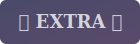
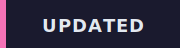
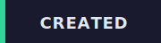
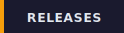
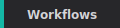
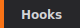
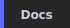

<!-- GENERATED FILE: do not edit directly -->
<!--lint disable remark-lint:awesome-badge-->

<h3 align="center">Pick Your Style:</h3>

# Awesome Claude Code (Flat)

A flat list view of all resources. Category: **Hooks** | Sorted: by latest release (30 days)

---

## Sort By:

  
  
  
  

<strong>Category:</strong>

  
  
  
  
  
  
  
  
  
  
  

<em>Currently viewing: **Hooks** sorted by latest release (30 days) (past 30 days)</em>

---

## Resources

> **Note:** Latest release data is pulled from GitHub Releases only. Projects without GitHub Releases will not show release info here. Please verify with the project directly.

<table>
<thead>
<tr>
<th>Resource</th>
<th>Version</th>
<th>Source</th>
<th>Release Date</th>
<th>Description</th>
</tr>
</thead>
<tbody>
<tr>
<td><a href="https://github.com/vaporif/parry"><b>parry</b></a> by <a href="https://github.com/vaporif">Dmytro Onypko</a></td>
<td>v0.1.0-alpha.2</td>
<td>GitHub</td>
<td>2026-03-14</td>
<td>Prompt injection scanner for Claude Code hooks. Scans tool inputs and outputs for injection attacks, secrets, and data exfiltration attempts. [NOTE: Early development phase but worth a look.]</td>
</tr>
<tr>
<td colspan="5">        </td>
</tr>
</tbody>
</table>

---

**Total Resources:** 1

**Last Generated:** 2026-04-11
