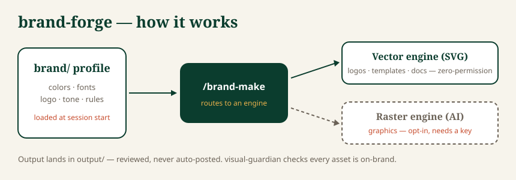

# brand-forge

> Generate on-brand logos, social templates, and marketing graphics for any brand.
> **Vector assets need no accounts or keys; AI imagery is opt-in.**

`brand-forge` stores a versioned **visual brand profile** (palette, type, logo, tone,
rules) and applies it to every asset it generates — so output is on-brand by default.
It is the visual counterpart to `content-multiplier`, sharing the same `brand/` folder.



## Installation

```
/plugin marketplace add localplugins/plugins
/plugin install brand-forge@localplugins
```

Requires Node.js. The vector engine needs nothing else; the opt-in AI-image engine needs a provider key (see [Trust](#trust)).

## Two engines

- **Vector (SVG) — zero-permission, the default.** Logos, social templates, doc/deck
  templates. Authored directly, scalable, editable. No network, no key.
- **Raster (AI image) — opt-in, off by default** *(Plan 4)*. Photographic/illustrative
  graphics via a swappable image API (`gemini` default, `openai` alternate). The one
  component that reaches the network; enable with `BRAND_FORGE_RASTER=1` + a provider
  key (`GEMINI_API_KEY`/`OPENAI_API_KEY`). Text is kept out of the raster and added as
  a crisp SVG overlay (`lib/composite.mjs`). Pipeline: `lib/raster.mjs` (prompt) →
  `lib/genimage.mjs` (the only networked module) → `lib/composite.mjs` (logo/caption).

## Quickstart

```
/brand-new                                  # create a visual profile (guided; optional import)
/brand-make wordmark logo                   # on-brand SVG logo variants → output/
/brand-make instagram post "We just raised our Series A"   # on-brand social template → output/
/brand-status                               # show the active kit any time
/brand-use <slug>                           # switch brands in a multi-brand repo
/brand-export northwind-wordmark.svg 1024   # export any SVG asset to PNG (optional)
```

At session start, the SessionStart hook loads the active kit into context, so a plain
request like `/brand-make instagram story` already knows your colors, fonts, and rules.

## What ships in the vector core (Plan 1)

- **Brand profiles** — `brand/color-system.json`, `typography.json`,
  `visual-identity.md`; multi-brand under `brands/<slug>/`, active via `brand/.active`.
- **SessionStart hook** — a thin dispatcher over reusable emitters in `lib/context/`
  (also used by `/brand-status`). Silent outside brand projects.
- **Logo generator** — wordmark, monogram, favicon as SVG (`lib/logo.mjs`).
- **Social templates** *(Plan 2)* — platform-sized SVGs with editable text zones
  (`instagram-square`/`-story`, `og-card`, `youtube-thumb`) via `lib/social.mjs` and
  the `generate-social` skill.
- **Doc/deck templates** *(Plan 3)* — `letterhead`, `slide`, `one-pager` as SVG with
  editable title/subtitle/body zones via `lib/doctpl.mjs` and the
  `generate-doc-template` skill.
- **Subagents** — `art-director` (plans the asset set) and `visual-guardian`
  (enforces palette/contrast/clear-space/type; read-only, no network).
- **Example** — a fully worked `examples/northwind/` brand (logos, a social template,
  a letterhead, a slide, and a raster **mockup**) for ideas. The `graphic-hero.svg`
  mockup uses a branded gradient in place of a real AI photo — it demonstrates the
  compositor without a live API call; the real pipeline stamps the overlay onto a
  generated PNG.

## Try the example

```bash
node --input-type=module -e '
import { loadProfile } from "./lib/brand.mjs";
import { buildLogos } from "./lib/logo.mjs";
const l = buildLogos(loadProfile("examples/northwind/brand"), { text: "Northwind" });
console.log(l.wordmark);'
```

## Trust

The vector core makes **no network calls** — a reviewer can confirm by inspection.
The only networked component is the opt-in raster engine, isolated in one script and
off unless you enable it. Nothing is ever auto-posted; output is local files you review.

## PNG export

Assets ship as SVG (scalable, editable, zero-permission). Export a PNG on demand with
`/brand-export` (or `node lib/rasterize.mjs <in.svg> <out.png> [width]`). It uses the
optional `sharp` dependency if installed; otherwise it points you at an OS-native tool
(`qlmanage` on macOS, headless Chrome, or `rsvg-convert`). No PNGs are stored in the
repo — they're produced when you need them.

## Development

```bash
node --test        # run the suite (zero required runtime dependencies)
```

`sharp` is an *optional* dependency used only for PNG export; the core runs and tests
without it (the rasterizer's backend is injected in tests).

## License

MIT
