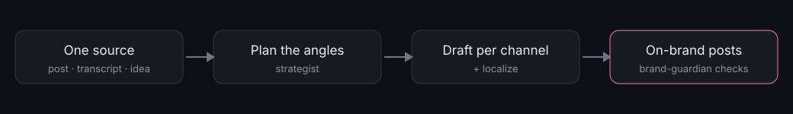

# Content Multiplier

[](https://www.claudepluginhub.com/plugins/localplugins-content-multiplier-content-multiplier?ref=badge)



**Turn one source — a post, a transcript, a rough idea — into a week of on-brand content across every channel and language.**

## What it does

You write something once. Content Multiplier turns it into ready-to-paste LinkedIn posts, X threads, newsletter sections, Instagram captions, YouTube descriptions, short-video scripts, and blog excerpts — each in the format that channel expects, all in your brand voice. Point it at other markets and it transcreates the set into those languages, honoring per-locale compliance rules.

It runs inside Claude Code. You teach it your brand once, then drive it with slash commands: `/multiply` for a single source, `/campaign` for a multi-week brief, `/localize` to reach new markets, and `/review` to QA anything before it ships. A content strategist and a brand guardian work behind the scenes so the output is planned, on-voice, and compliant — not generic AI filler.

## Requirements

Claude Code (CLI or desktop). Nothing else — no accounts, API keys, or network.

## Installation

Content Multiplier is a Claude Code plugin. You need **Claude Code** — the CLI or the desktop app. If you can open a Claude Code session and see a prompt, you're ready.

Run these at the Claude Code prompt:

```
/plugin marketplace add localplugins/plugins
/plugin install content-multiplier@localplugins
/reload-plugins
```

- The first command registers the marketplace this plugin ships in.
- The second installs Content Multiplier from that marketplace.
- `/reload-plugins` makes the new commands, agents, and skills available in your current session.

After that, type `/` and you'll see `/brand-setup`, `/multiply`, `/campaign`, `/localize`, and `/review` in the list. If they don't appear, see [FAQ / troubleshooting](#faq--troubleshooting).

## Usage examples

Everything below happens inside a Claude Code session. You type a `/command` at the prompt; Claude does the work, guided by the plugin, and writes files into your repo. Nothing is posted anywhere — you copy, paste, or schedule the output yourself.

### 1. Teach it your brand (do this first, once)

**Situation:** You just installed the plugin and want everything it writes to sound like your team, not like a generic assistant.

You type:

```
/brand-setup
```

Claude interviews you — target audience, three to five personality adjectives, tone, words you love and words to avoid, competitors, must-have disclaimers — a few questions at a time. It fills in four brand files under `content/brand/` (voice, messaging, style guide, compliance), then re-reads them and flags any gaps or contradictions for you to fix.

**Outcome:** A committed brand profile at `content/brand/`. Commit that folder and your whole team inherits the same voice. Every other command reads it automatically.

*Prefer to learn from examples?* Hand it a few of your best existing pieces:

```
/brand-setup ./samples/best-post.md ./samples/launch-email.md ./samples/blog.md
```

Claude reads them and infers your voice, vocabulary, rhythm, and recurring phrases instead of interviewing you.

### 2. Multiply one source into a channel set

**Situation:** You wrote a blog post and want it working across LinkedIn, X, and your newsletter by end of day.

You type:

```
/multiply ./posts/why-we-rebuilt-onboarding.md --channels linkedin,x-thread,newsletter
```

Claude loads your brand profile, then hands the source to the **strategist** subagent, which returns a derivative plan — a table of one row per asset showing the channel, angle, target persona, and key message. **It shows you the plan and waits** for you to approve, trim, or adjust before writing a single draft. Once you approve, it drafts each asset to that channel's format spec in your brand voice, runs everything past the **brand-guardian** subagent, applies any fixes, and writes the files.

**Outcome:** A folder at `content/output/<campaign-slug>/` with `linkedin.md`, `x-thread.md`, `newsletter.md`, and an `index.md` dashboard table (asset, channel, persona, character count, compliance status, notes). Copy-paste ready.

*Want other markets too?* Add locales and it transcreates the set after drafting:

```
/multiply ./posts/why-we-rebuilt-onboarding.md --channels linkedin,newsletter --locales de-DE,ja-JP
```

### 3. Plan a whole campaign from a brief

**Situation:** You have a product launch in three weeks and need a coordinated content calendar, not just one-off posts.

You type:

```
/campaign ./briefs/spring-launch.md --channels linkedin,x-thread,newsletter,instagram --weeks 3
```

Claude reads the brief (goal, audience, offer, dates), then the strategist turns it into a campaign arc — a theme per week and a plan of assets that reinforce your key messages across the run. After you confirm the plan, Claude drafts every asset, guards them, and writes the output folder plus a `calendar.md` that sequences each piece across the three weeks (date/slot, channel, asset, theme, status).

**Outcome:** A full campaign in `content/output/<campaign-slug>/`: per-asset files, an `index.md` dashboard, and a `calendar.md` you execute yourself by posting or scheduling each slot.

### 4. Review a draft before it ships

**Situation:** A teammate wrote a LinkedIn post and you want to know if it's on-brand and compliant before it goes out.

You type:

```
/review ./drafts/teammate-post.md
```

Claude loads your brand profile and hands the draft to the brand-guardian, which returns a **scorecard** (Voice / Style / Compliance, each marked pass or fix) and a **redline**: for every problem, the original text, which rule it breaks, and a corrected version inline. It finishes with an overall verdict and the top three things to fix first. It proposes changes — it does not silently rewrite your file.

**Outcome:** A clear pass/needs-work call and a line-by-line redline you can act on. Add `--locale de-DE` to review against a specific market's rules.

## Commands

| Command | What it does | Arguments |
| --- | --- | --- |
| `/brand-setup` | Create or update your brand profile — voice, messaging, style, compliance. Interviews you, or learns from example content you provide. | `[--brand <name>] [--locale <xx-XX>] [path-to-example-content ...]` |
| `/multiply` | The hero command. Turns one source into on-brand, channel-specific derivatives, optionally transcreated into other markets. | `<source-file-or-text> [--channels a,b,c] [--brand <name>] [--locales xx-XX,yy-YY]` |
| `/campaign` | Turns a campaign brief into a coordinated multi-channel content set plus a posting calendar spread across N weeks. | `<brief-file-or-text> [--channels a,b,c] [--weeks N] [--brand <name>] [--locales xx-XX,...]` |
| `/localize` | Transcreates existing content into one or more markets, honoring per-locale brand and compliance rules. Can emit back-translations for sign-off. | `<content-file-or-text> --locales xx-XX,yy-YY [--brand <name>] [--back-translation]` |
| `/review` | Audits existing or draft content against your brand and compliance rules. Returns a scorecard and a redline. | `<content-file-or-text> [--brand <name>] [--locale <xx-XX>]` |

**Default channels** (when `--channels` is omitted on `/multiply`): `linkedin`, `x-thread`, `newsletter`, `instagram`, `short-video`.

**Available channels:** `linkedin`, `x-thread`, `newsletter`, `instagram`, `youtube`, `short-video`, `blog`. Channel IDs double as output filenames.

## Agents & skills

Two subagents do the specialized work, and three skills carry the reusable know-how.

**Subagents**

- **strategist** — A content strategist that reads your source and brand profile, extracts the single core message, key points, quotable lines, and natural angles, then produces the derivative plan (channel × angle × persona × key message). It plans; it does not write final copy. `/multiply` and `/campaign` call it before drafting.
- **brand-guardian** — The last pass before delivery. It checks each asset on three dimensions — Voice, Style, Compliance — against your brand files, returns a pass/fix scorecard, and corrects violations. It enforces the rules you wrote; it doesn't rewrite for taste. `/review` uses it directly; `/multiply`, `/campaign`, and `/localize` run it as the final guard.

**Skills**

- **brand-voice** — How to find, load, and apply your four brand files so any content sounds like your team. Every command that writes or reviews content applies it.
- **channel-formats** — Per-channel specs (format, length, structure, do's, avoids) for LinkedIn, X threads, newsletters, Instagram, YouTube, short-video scripts, and blog posts. The container; brand-voice fills it.
- **transcreation** — How to adapt content into another language or market — reworking idioms, formality, units, and currency, respecting a do-not-translate glossary and per-locale compliance — rather than translating word for word. Used whenever `--locales` is set and by `/localize`.

## Configuration / brand profile

Your brand profile is four Markdown files. They live in your repo, you own them, and every command reads them.

**Location**

- Default brand: `content/brand/`
- Named brands (if you run more than one): `content/brands/<name>/`
- Per-market overrides: `content/brand/locales/<xx-XX>/` (or under a named brand). A locale file overrides the base file of the same name for that market only.

**The four files**

| File | Holds |
| --- | --- |
| `brand-voice.md` | Personality, tone by context, voice do's and don'ts, signature phrases, words to avoid. |
| `messaging.md` | Positioning, ranked value propositions, target personas, key messages, boilerplate. |
| `style-guide.md` | Formatting rules, terminology/glossary, product & trademark casing, banned words, inclusive-language rules. |
| `compliance.md` | Approved claims, prohibited terms, required disclaimers, regulated language. The brand-guardian enforces this on every asset. |

**How to set it up**

Run `/brand-setup`. It copies starter templates into the target directory (never overwriting an existing profile without asking), then either interviews you or learns from example content you pass on the command line. It fills in every section — no empty placeholders — then self-audits and reports gaps. When it's done, commit `content/brand/` so your whole team writes from the same profile.

To adjust later, edit the files directly or run `/brand-setup` again. To add a market, run `/brand-setup --locale de-DE` and fill in only the rules that differ for that market; the base profile covers the rest.

## How it works

Every command follows the same shape: **load → plan → draft → guard → write.**

1. **Load** your brand profile via the `brand-voice` skill.
2. **Plan** — for `/multiply` and `/campaign`, the `strategist` subagent turns your source into a derivative plan, which you approve before anything is drafted.
3. **Draft** each asset by applying that channel's spec from the `channel-formats` skill on top of your brand voice; if you asked for other markets, the `transcreation` skill adapts each asset.
4. **Guard** every draft through the `brand-guardian` subagent, applying its fixes and re-checking anything marked `fix`.
5. **Write** the results to `content/output/<campaign-slug>/` — one file per asset plus an `index.md` dashboard (and a `calendar.md` for campaigns). Output is copy-paste or schedule-ready.

The plugin reads only the source and brand files you point it at, and writes only into your repo. It never posts to a platform and never reaches the network.

## Uninstall

```
/plugin uninstall content-multiplier@localplugins
```

## FAQ / troubleshooting

**The slash commands don't show up after installing.**
Run `/reload-plugins`, then type `/` to check the list. If they're still missing, confirm the install succeeded with `/plugin` and that you added the `localplugins` marketplace first.

**I ran `/multiply` but it says there's no brand profile.**
You haven't set one up yet. Run `/brand-setup` first. If you want to proceed without one, Claude will offer sensible defaults for that run — but the output won't be tuned to your voice until you have a profile.

**It generated a plan but no content.**
That's by design. `/multiply` and `/campaign` show you the derivative plan and wait for your approval before drafting, so you can trim or redirect it. Approve the plan (or edit it) and Claude will draft the assets.

**Can it post to LinkedIn or schedule to my tools?**
No — and that's intentional. Every command stops at ready-to-paste files. The `calendar.md` a campaign produces is a plan you execute; the plugin never touches a real platform.

**How do I handle a second brand or a new market?**
Use flags. `--brand <name>` reads and writes under `content/brands/<name>/`. `--locales de-DE,ja-JP` transcreates into those markets, honoring any per-locale overrides you set with `/brand-setup --locale de-DE`. For a literal check on translated work, add `--back-translation` to `/localize`.

**A draft failed compliance — what now?**
The brand-guardian's scorecard marks the failing dimension `fix` and quotes the offending text with a corrected version and the rule it broke. On `/multiply` and `/campaign` those fixes are applied automatically before the files are written; on `/review` you get the redline to apply yourself.

---

Content Multiplier runs entirely inside your Claude Code session — no accounts, no API keys, no network calls.
