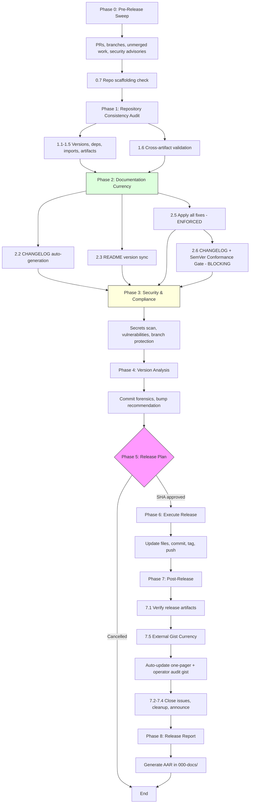

# Universal Release Engineering v2.3

## Overview

Full-ceremony release engineering: audits PRs, branches, scaffolding, versions, documentation, security, and dependencies before cutting a SemVer-compliant release with Keep a Changelog entries. Produces an After-Action Report (AAR) and auto-updates the public GitHub gist with one-pager, operator audit, and changelog.

## Prerequisites

- Git repository with remote origin configured
- GitHub CLI (`gh`) authenticated
- Write access to the repository

## Philosophy

- **This is the BIG ceremony** - run infrequently, be thorough
- **Use `/repo-sweep` for quick daily housekeeping** - merge PRs, clean branches
- **All documentation must reflect reality** - README, CHANGELOG, API docs
- **AI-assisted documentation currency** - leverage AI to update natural language docs
- **Security-first** - block on security issues, scan for secrets
- **Full audit trail** - record who approved what and when
- **Consistency across entire repo** - versions, deps, docs, code all aligned
- **Branch protection handled** - automatically bypasses and restores protection for pushes

## Release Workflow Overview



---

## Instructions

Execute each phase in order. **STOP and report if any phase has blocking issues.**

---

## PHASE 0: PRE-RELEASE SWEEP

**Goal**: Ensure all approved work is merged before releasing.

### 0.1 Environment Setup

```bash
echo "════════════════════════════════════════════════════════════════"
echo "  RELEASE CEREMONY - $(date '+%Y-%m-%d %H:%M:%S')"
echo "════════════════════════════════════════════════════════════════"
echo ""

# Capture start time for metrics
RELEASE_START=$(date +%s)

# Repository info
REPO_ROOT=$(git rev-parse --show-toplevel)
REPO_NAME=$(basename "$REPO_ROOT")
CURRENT_BRANCH=$(git branch --show-current)
REMOTE_URL=$(git remote get-url origin 2>/dev/null || echo "no-remote")

echo "Repository: $REPO_NAME"
echo "Branch: $CURRENT_BRANCH"
echo "Remote: $REMOTE_URL"
echo "Working Directory: $REPO_ROOT"
echo ""
```

### 0.2 Check Open Pull Requests

```bash
echo "────────────────────────────────────────────────────────────────"
echo "PHASE 0: PRE-RELEASE SWEEP"
echo "────────────────────────────────────────────────────────────────"
echo ""
echo "0.2 Checking Pull Requests..."
echo ""

# Get all open PRs with full details
gh pr list --state open --json number,title,headRefName,isDraft,mergeable,reviewDecision,statusCheckRollup,labels,author --jq '.[] | {
  number: .number,
  title: .title,
  branch: .headRefName,
  draft: .isDraft,
  mergeable: .mergeable,
  review: (.reviewDecision // "NONE"),
  checks: (if .statusCheckRollup then (.statusCheckRollup | map(.conclusion // "PENDING") | unique | join(",")) else "none" end),
  security: (if .labels then (.labels | map(.name) | map(select(test("security|vulnerability|cve"; "i"))) | length > 0) else false end),
  author: .author.login
}' 2>/dev/null || echo "[]"
```

**Analyze PR State:**

| PR State                               | Action                                            |
| -------------------------------------- | ------------------------------------------------- |
| Approved + Passing CI + Mergeable      | **BLOCK**: Must merge before release              |
| Approved + Passing CI + Security Label | **CRITICAL BLOCK**: Security fix must be included |
| Draft                                  | Note for awareness, don't block                   |
| Changes Requested                      | Note, author needs to address                     |
| Pending Review                         | Note, but don't block release                     |
| Merge Conflicts                        | Note, needs resolution                            |
| Failing CI                             | Note, investigate if critical                     |

### 0.3 Check Branches

```bash
echo ""
echo "0.3 Checking Branches..."
echo ""

DEFAULT_BRANCH=$(gh repo view --json defaultBranchRef --jq '.defaultBranchRef.name' 2>/dev/null || echo "main")
echo "Default branch: $DEFAULT_BRANCH"

# Fetch latest
git fetch --all --prune 2>/dev/null

echo ""
echo "Branches ahead of $DEFAULT_BRANCH:"
git for-each-ref --format='%(refname:short) %(upstream:track)' refs/heads | while read branch track; do
  if [ "$branch" != "$DEFAULT_BRANCH" ]; then
    AHEAD=$(git rev-list --count $DEFAULT_BRANCH..$branch 2>/dev/null || echo "0")
    if [ "$AHEAD" -gt 0 ]; then
      echo "  ⚠ $branch is $AHEAD commits ahead"
    fi
  fi
done

echo ""
echo "Remote branches not merged to $DEFAULT_BRANCH:"
git branch -r --no-merged origin/$DEFAULT_BRANCH 2>/dev/null | grep -v HEAD | head -10 || echo "  (none)"

echo ""
echo "Stale branches (>30 days, no activity):"
git for-each-ref --sort=-committerdate --format='%(refname:short) %(committerdate:short) %(committerdate:relative)' refs/heads | while read branch date relative; do
  if echo "$relative" | grep -qE '(month|year)'; then
    echo "  ⚠ $branch (last commit: $date)"
  fi
done | head -10
```

### 0.4 Check Uncommitted and Unpushed Work

```bash
echo ""
echo "0.4 Checking Local State..."
echo ""

# Uncommitted changes
echo "Uncommitted changes:"
if [ -n "$(git status --porcelain)" ]; then
  git status --short
  echo ""
  echo "  ⚠ BLOCKING: Working directory not clean"
  DIRTY_TREE=true
else
  echo "  ✓ Working directory clean"
  DIRTY_TREE=false
fi

# Unpushed commits
echo ""
echo "Unpushed commits:"
UNPUSHED=$(git log origin/$CURRENT_BRANCH..$CURRENT_BRANCH --oneline 2>/dev/null || echo "")
if [ -n "$UNPUSHED" ]; then
  echo "$UNPUSHED"
  echo ""
  echo "  ⚠ Must push before release"
else
  echo "  ✓ All commits pushed"
fi

# Stashes
echo ""
echo "Stashed work:"
STASH_COUNT=$(git stash list | wc -l)
if [ "$STASH_COUNT" -gt 0 ]; then
  git stash list
  echo "  ⚠ Review stashes - may contain unreleased work"
else
  echo "  ✓ No stashes"
fi
```

### 0.5 Security Advisories Check

```bash
echo ""
echo "0.5 Checking Security Advisories..."
echo ""

# Check for open security advisories
gh api repos/:owner/:repo/security-advisories --jq '.[] | select(.state == "draft" or .state == "published") | "  ⚠ \(.severity): \(.summary)"' 2>/dev/null || echo "  ✓ No open advisories (or not enabled)"

# Check for Dependabot alerts
echo ""
echo "Dependabot Alerts:"
gh api repos/:owner/:repo/dependabot/alerts --jq '[.[] | select(.state == "open")] | length' 2>/dev/null | xargs -I{} echo "  {} open alerts" || echo "  ✓ Not enabled or no alerts"
```

### 0.6 Beads Pre-Release Gate

```bash
echo ""
echo "0.6 Checking Beads Task Tracking..."
echo ""

# Check if beads is configured
if command -v bd &> /dev/null && [ -d .beads ]; then
  # Check for in-progress beads
  IN_PROGRESS=$(bd list --status in_progress 2>/dev/null)
  IN_PROGRESS_COUNT=$(echo "$IN_PROGRESS" | grep -c "." || echo "0")

  if [ "$IN_PROGRESS_COUNT" -gt 0 ]; then
    echo "  ⚠ WARNING: $IN_PROGRESS_COUNT beads still in_progress"
    echo ""
    echo "$IN_PROGRESS" | while read line; do
      echo "    $line"
    done
    echo ""
    echo "  Consider closing these before release:"
    echo "    bd close <id> -r \"Completed in release vX.Y.Z\""
  else
    echo "  ✓ No beads in_progress"
  fi

  # Check for open beads that might be stale
  OPEN_COUNT=$(bd list --status open 2>/dev/null | wc -l || echo "0")
  if [ "$OPEN_COUNT" -gt 20 ]; then
    echo ""
    echo "  ⚠ $OPEN_COUNT open beads - consider auditing for staleness"
    echo "    Run: bash scripts/audit-beads.sh"
  fi

  # Ensure beads sync is working
  bd sync 2>/dev/null && echo "  ✓ Beads synced" || echo "  ⚠ Beads sync failed"
else
  echo "  ○ Beads not configured in this repo"
fi
echo ""
```

### 0.7 Repository Scaffolding Check

```bash
echo ""
echo "0.7 Repository Scaffolding Check..."
echo ""

SCAFFOLDING_ISSUES=0
for FILE in CHANGELOG.md SECURITY.md CONTRIBUTING.md CODE_OF_CONDUCT.md .gitignore CLAUDE.md LICENSE; do
  if [ -f "$REPO_ROOT/$FILE" ]; then
    echo "  ✓ $FILE"
  else
    echo "  ⚠ MISSING: $FILE"
    SCAFFOLDING_ISSUES=$((SCAFFOLDING_ISSUES + 1))
  fi
done

if [ "$SCAFFOLDING_ISSUES" -gt 0 ]; then
  echo ""
  echo "  ⚠ WARNING: $SCAFFOLDING_ISSUES standard file(s) missing"
  echo "  Recommendation: Create missing files before release"
  echo "  CHANGELOG.md must follow Keep a Changelog (https://keepachangelog.com)"
  echo "  Versions must follow Semantic Versioning (https://semver.org)"
else
  echo ""
  echo "  ✓ All standard repository files present"
fi
echo ""
```

### 0.8 Phase 0 Summary

Create a structured summary:

```
╔══════════════════════════════════════════════════════════════════╗
║ PHASE 0 SUMMARY: PRE-RELEASE SWEEP                               ║
╠══════════════════════════════════════════════════════════════════╣
║ BLOCKING ISSUES (must resolve before release):                   ║
║   □ 2 approved PRs ready to merge (#42, #43)                     ║
║   □ 1 security PR pending (#45) - CRITICAL                       ║
║   □ Working directory has uncommitted changes                    ║
║                                                                  ║
║ WARNINGS (review but may proceed):                               ║
║   ⚠ Branch 'feature/new-api' is 5 commits ahead of main         ║
║   ⚠ 3 stashes found - review for unreleased work                 ║
║   ⚠ 2 Dependabot alerts open                                     ║
║                                                                  ║
║ INFO:                                                            ║
║   ○ 1 draft PR (#50) - WIP, not blocking                         ║
║   ○ 2 PRs pending review                                         ║
╚══════════════════════════════════════════════════════════════════╝
```

**If BLOCKING issues exist:**

- Use AskUserQuestion to ask: "Blocking issues found. Options: (1) Resolve now (merge PRs, commit changes), (2) Skip and proceed anyway (not recommended), (3) Abort release"

---

## PHASE 1: REPOSITORY CONSISTENCY AUDIT

**Goal**: Ensure all version references, dependencies, and configurations are consistent.

### 1.1 Version Consistency

Check that version is consistent across all sources:

```bash
echo "────────────────────────────────────────────────────────────────"
echo "PHASE 1: REPOSITORY CONSISTENCY AUDIT"
echo "────────────────────────────────────────────────────────────────"
echo ""
echo "1.1 Version Consistency..."
echo ""

# Collect versions from all sources
echo "Version Sources Found:"

# VERSION file
[ -f VERSION ] && echo "  VERSION file: $(cat VERSION)"

# package.json
[ -f package.json ] && echo "  package.json: $(jq -r '.version // "not set"' package.json)"

# pyproject.toml
[ -f pyproject.toml ] && echo "  pyproject.toml: $(grep -oP 'version\s*=\s*"\K[^"]+' pyproject.toml 2>/dev/null || echo "not found")"

# Cargo.toml
[ -f Cargo.toml ] && echo "  Cargo.toml: $(grep -oP '^version\s*=\s*"\K[^"]+' Cargo.toml 2>/dev/null || echo "not found")"

# setup.py
[ -f setup.py ] && echo "  setup.py: $(grep -oP "version\s*=\s*['\"]\\K[^'\"]+' setup.py 2>/dev/null || echo "not found")"

# Git tags
LATEST_TAG=$(git describe --tags --abbrev=0 2>/dev/null || echo "no tags")
echo "  Latest git tag: $LATEST_TAG"
```

**Analyze**: If versions don't match, flag as issue to fix.

**SemVer regex enforcement** — every collected version string must
match SemVer 2.0.0. Strings like `1.0.0-dev` (without proper
pre-release shape), `v1`, or `1.0` are flagged. The full regex per
https://semver.org/#is-there-a-suggested-regular-expression-regex-to-check-a-semver-string :

```bash
SEMVER_RE='^(0|[1-9][0-9]*)\.(0|[1-9][0-9]*)\.(0|[1-9][0-9]*)(-((0|[1-9][0-9]*|[0-9]*[a-zA-Z-][0-9a-zA-Z-]*)(\.(0|[1-9][0-9]*|[0-9]*[a-zA-Z-][0-9a-zA-Z-]*))*))?(\+([0-9a-zA-Z-]+(\.[0-9a-zA-Z-]+)*))?$'

# Apply to every collected version. Strip a leading 'v' if present
# (common in git tags) before matching — the spec defines the version
# string itself without the prefix.
for V in "$VERSION_TXT" "$ROOT_PKG_VER" "$LATEST_TAG"; do
  [ -n "$V" ] || continue
  STRIPPED="${V#v}"
  if ! echo "$STRIPPED" | grep -qE "$SEMVER_RE"; then
    echo "  ⚠ NOT SemVer 2.0.0: '$V'"
    SEMVER_VIOLATIONS=$((SEMVER_VIOLATIONS + 1))
  fi
done
[ "${SEMVER_VIOLATIONS:-0}" -eq 0 ] && echo "  ✓ All version strings are SemVer-conformant"
```

Workspace-style monorepos must run this check across `packages/*/package.json` too — every version that ships is operator-visible.

### 1.2 Dependency Consistency

```bash
echo ""
echo "1.2 Dependency Consistency..."
echo ""

# Check lockfile freshness
if [ -f package-lock.json ] && [ -f package.json ]; then
  if [ package.json -nt package-lock.json ]; then
    echo "  ⚠ package-lock.json may be stale (package.json is newer)"
  else
    echo "  ✓ package-lock.json up to date"
  fi
fi

if [ -f yarn.lock ] && [ -f package.json ]; then
  if [ package.json -nt yarn.lock ]; then
    echo "  ⚠ yarn.lock may be stale"
  else
    echo "  ✓ yarn.lock up to date"
  fi
fi

if [ -f poetry.lock ] && [ -f pyproject.toml ]; then
  if [ pyproject.toml -nt poetry.lock ]; then
    echo "  ⚠ poetry.lock may be stale"
  else
    echo "  ✓ poetry.lock up to date"
  fi
fi

if [ -f Cargo.lock ] && [ -f Cargo.toml ]; then
  if [ Cargo.toml -nt Cargo.lock ]; then
    echo "  ⚠ Cargo.lock may be stale"
  else
    echo "  ✓ Cargo.lock up to date"
  fi
fi
```

### 1.3 Build Artifact Consistency

```bash
echo ""
echo "1.3 Build Artifacts..."
echo ""

# Check if build is current
if [ -d dist ] || [ -d build ] || [ -d out ]; then
  echo "Build directories found. Checking freshness..."

  # Find newest source file
  NEWEST_SRC=$(find src lib app -type f -name "*.ts" -o -name "*.js" -o -name "*.py" -o -name "*.rs" 2>/dev/null | head -1)
  NEWEST_BUILD=$(find dist build out -type f 2>/dev/null | head -1)

  if [ -n "$NEWEST_SRC" ] && [ -n "$NEWEST_BUILD" ]; then
    if [ "$NEWEST_SRC" -nt "$NEWEST_BUILD" ]; then
      echo "  ⚠ Source files newer than build - rebuild recommended"
    else
      echo "  ✓ Build appears current"
    fi
  fi
else
  echo "  ○ No build directories found"
fi
```

### 1.4 Import/Export Consistency

```bash
echo ""
echo "1.4 Checking for orphaned exports..."
echo ""

# For TypeScript/JavaScript projects
if [ -f tsconfig.json ] || [ -f package.json ]; then
  # Check for unused exports in index files
  for idx in $(find . -name "index.ts" -o -name "index.js" 2>/dev/null | grep -v node_modules | head -5); do
    echo "  Checking $idx..."
  done
fi
```

### 1.5 Configuration Consistency

```bash
echo ""
echo "1.5 Configuration Files..."
echo ""

# Check for environment example consistency
if [ -f .env.example ]; then
  EXAMPLE_VARS=$(grep -oP '^[A-Z_]+=' .env.example | sort)
  echo "  .env.example defines $(echo "$EXAMPLE_VARS" | wc -l) variables"
fi

# Check for config schema
[ -f .release.yml ] && echo "  ✓ .release.yml found"
[ -f .github/workflows ] && echo "  ✓ GitHub Actions configured"
```

### 1.6 Cross-Artifact Consistency Validation

**Goal**: Verify all documentation artifacts are in sync before proceeding.

```bash
echo ""
echo "1.6 Cross-Artifact Consistency Validation..."
echo ""
```

**Primary method: Invoke `/validate-consistency` skill.**

The `/validate-consistency` skill performs a comprehensive, deterministic audit:

- Auto-detects project type (engineering, marketing, hybrid)
- Applies the correct source-of-truth hierarchy
- Runs 9 drift checks across 7 categories (status, API, capability, CI, planning-vs-implementation, cross-doc, index/reference)
- Produces a structured report with severity levels and file locations

Execute the full `/validate-consistency` protocol. Incorporate its report output into this release audit.

**Blocking Gate (applied to `/validate-consistency` results):**

- 🔴 **BLOCK** if any Critical findings exist (version mismatches, overclaimed features)
- 🟡 **WARNING** for Warning-level findings (stale language, CI drift, broken refs)
- 🟢 **INFO** for informational findings

If critical discrepancies found, use AskUserQuestion: "Critical consistency issues found. (1) Fix all now (recommended) (2) Proceed anyway (3) Abort release"

**CRITICAL:** If user selects "Fix all now", proceed to Phase 2 which will auto-fix all issues.

---

## PHASE 2: DOCUMENTATION CURRENCY

**Goal**: Ensure all natural language documentation accurately reflects current state.

### 2.1 README Analysis

Read the README and analyze for currency:

```bash
echo "────────────────────────────────────────────────────────────────"
echo "PHASE 2: DOCUMENTATION CURRENCY"
echo "────────────────────────────────────────────────────────────────"
echo ""
echo "2.1 README Analysis..."
echo ""
```

**AI Task: Analyze README for:**

1. **Version References**
   - Badge versions match release version
   - Install commands reference correct version
   - API version references are current

2. **Feature Documentation**
   - Features listed actually exist in code
   - No documented features that were removed
   - New features from commits are documented

3. **URL Validity**
   - GitHub URLs point to correct org/repo
   - Documentation links work
   - Badge URLs are valid

4. **Example Code**
   - Code examples actually work
   - Import paths are correct
   - API usage matches current implementation

5. **Roadmap Currency**
   - Completed items marked as done
   - Released features not still in "planned"
   - Timeline references not stale

6. **Installation Instructions**
   - Commands actually work
   - Dependencies are current
   - Platform support is accurate

**Output Format:**

```
README Currency Check:
├── Version References
│   ├── ✓ Badge: v1.2.0 (matches)
│   └── ⚠ Install command shows v1.1.0 (stale)
├── Feature Documentation
│   ├── ✓ 12 features documented, all exist
│   └── ⚠ Missing: "webhook support" added in abc123
├── URLs
│   └── ✓ All 8 URLs valid
├── Examples
│   └── ⚠ Example on line 45 uses deprecated API
└── Roadmap
    └── ⚠ "Dark mode" shipped in v1.1.0, still shows as planned
```

### 2.2 CHANGELOG Management (AUTO-FIX)

**Goal**: Ensure CHANGELOG exists, is properly formatted, and has all commits documented.

```bash
echo ""
echo "2.2 CHANGELOG Management (Auto-Fix)..."
echo ""

# ════════════════════════════════════════════════════════════════
# STEP 1: CREATE CHANGELOG IF MISSING
# ════════════════════════════════════════════════════════════════

if [ ! -f CHANGELOG.md ]; then
  echo "  Creating CHANGELOG.md..."
  cat > CHANGELOG.md << 'CHANGELOG_EOF'
# Changelog

All notable changes to this project will be documented in this file.

The format is based on [Keep a Changelog](https://keepachangelog.com/en/1.1.0/),
and this project adheres to [Semantic Versioning](https://semver.org/spec/v2.0.0.html).

## [Unreleased]

CHANGELOG_EOF
  echo "  ✓ CHANGELOG.md created with Keep a Changelog format"
  CHANGELOG_CREATED=true
else
  echo "  ✓ CHANGELOG.md exists"
  CHANGELOG_CREATED=false
fi

# ════════════════════════════════════════════════════════════════
# STEP 2: VERIFY FORMAT COMPLIANCE
# ════════════════════════════════════════════════════════════════

# Check for [Unreleased] section
if ! grep -q "## \[Unreleased\]" CHANGELOG.md; then
  echo "  ⚠ Missing [Unreleased] section - adding..."
  # Insert after first heading
  sed -i '/^# Changelog/a \\n## [Unreleased]\n' CHANGELOG.md
  echo "  ✓ Added [Unreleased] section"
fi

# Get last version entry
LAST_CHANGELOG_VER=$(grep -oP '## \[\K[0-9]+\.[0-9]+\.[0-9]+' CHANGELOG.md | head -1 || echo "0.0.0")
echo "  Last documented version: $LAST_CHANGELOG_VER"

# Count unreleased items
UNRELEASED_COUNT=$(sed -n '/## \[Unreleased\]/,/## \[/p' CHANGELOG.md 2>/dev/null | grep -c "^- " || echo "0")
echo "  Unreleased entries: $UNRELEASED_COUNT"
```

**AI Task: Generate and Apply CHANGELOG Entries (MANDATORY)**

This is NOT optional - the AI MUST:

1. **Parse commits since last release:**

   ```bash
   LAST_TAG=$(git describe --tags --abbrev=0 2>/dev/null || echo "")
   if [ -n "$LAST_TAG" ]; then
     COMMIT_RANGE="$LAST_TAG..HEAD"
   else
     COMMIT_RANGE="HEAD"
   fi
   ```

2. **Categorize by conventional commit type into Keep a Changelog sections:**
   - `feat:` → ### Added
   - `fix:` → ### Fixed
   - `docs:` → ### Changed
   - `refactor:` → ### Changed
   - `perf:` → ### Changed
   - `security:` → ### Security
   - `deprecate:` → ### Deprecated
   - `remove:` → ### Removed
   - Breaking changes (!) → ### Changed (with BREAKING prefix)

3. **Generate formatted entries (newest on top):**
   Each entry should be:
   - One line per commit
   - Link to PR/issue if referenced (e.g., `(#42)`)
   - Imperative mood, present tense

4. **Apply changes using Edit tool:**
   Insert new entries under `## [Unreleased]` section, OR create new version section if releasing.

5. **Verify changes applied:**
   Read CHANGELOG.md to confirm entries added.

**Example output:**

```markdown
## [Unreleased]

### Added

- Add health check endpoint for Cloud Run services (#54)
- Add Content-Security-Policy headers to Firebase Hosting (#55)

### Fixed

- Fix observability runbook webhook severity documentation (#56)
- Fix release process documentation for PR-based workflow (#58)

### Changed

- Refactor health check registration to DRY pattern (#54)
```

### 2.3 README Version Sync (AUTO-FIX)

**Goal**: Ensure all version references in README match the release version.

```bash
echo ""
echo "2.3 README Version Sync (Auto-Fix)..."
echo ""

# Get target version
CURRENT_VERSION=$(cat VERSION 2>/dev/null || jq -r '.version' package.json 2>/dev/null || echo "0.0.0")
echo "  Target version: $CURRENT_VERSION"

README_UPDATED=false

# ════════════════════════════════════════════════════════════════
# STEP 1: UPDATE VERSION BADGES (shields.io, badge.fury, etc.)
# ════════════════════════════════════════════════════════════════

if [ -f README.md ]; then
  # Count version badge patterns
  BADGE_COUNT=$(grep -cE "(shields\.io|badge\.fury|img\.shields|badgen\.net).*v?[0-9]+\.[0-9]+\.[0-9]+" README.md || echo "0")

  if [ "$BADGE_COUNT" -gt 0 ]; then
    echo "  Found $BADGE_COUNT version badges to update"
  fi
fi
```

**AI Task: Update README Version References (MANDATORY)**

1. **Read README.md** and identify all version references:
   - Shield.io badges: ``
   - npm badges: ``
   - Install commands: `npm install package@1.0.0`
   - Version mentions in text: "Currently at version 1.0.0"

2. **Generate Edit operations** to update each reference to new version

3. **Apply all edits using Edit tool** - NOT optional

4. **Verify changes:**
   - Read README.md after edits
   - Confirm all version references now match

**Example fixes:**

```diff
-
+

-npm install @gwi/cli@0.5.1
+npm install @gwi/cli@0.6.0
```

### 2.4 API Documentation Currency

If API docs exist (OpenAPI, JSDoc, etc.):

```bash
echo ""
echo "2.4 API Documentation..."
echo ""

# Check for API spec files
[ -f openapi.yaml ] || [ -f openapi.json ] || [ -f swagger.yaml ] && echo "  Found OpenAPI spec"
[ -d docs/api ] && echo "  Found docs/api/"

# Check for inline documentation
DOC_COMMENTS=$(find src lib -name "*.ts" -o -name "*.js" 2>/dev/null | xargs grep -l "^\s*\*\s*@" 2>/dev/null | wc -l)
echo "  Files with JSDoc/TSDoc: $DOC_COMMENTS"
```

**AI Task: If API docs exist, verify:**

- Endpoints documented match actual routes
- Request/response schemas are current
- Authentication requirements documented
- Rate limits documented if applicable

### 2.5 Apply All Documentation Updates (ENFORCED)

**CRITICAL:** This phase MUST modify files. All identified issues are fixed, not reported.

**Execution Workflow:**

1. **Collect all pending fixes from Phases 2.1-2.4:**
   - CHANGELOG entries to add
   - README version references to update
   - Stale content to refresh
   - Consistency issues from Phase 1.6

2. **Apply each fix using Edit tool:**
   - Each edit is atomic and targeted
   - Use exact string matching
   - Preserve formatting and structure

3. **Build verification checklist:**

   ```
   ╔══════════════════════════════════════════════════════════════════╗
   ║ DOCUMENTATION UPDATES APPLIED                                    ║
   ╠══════════════════════════════════════════════════════════════════╣
   ║ ✓ CHANGELOG.md: 5 entries added                                  ║
   ║ ✓ README.md: 3 version references updated                        ║
   ║ ✓ All version badges now show v0.6.0                             ║
   ║ ✓ Install commands updated                                       ║
   ╚══════════════════════════════════════════════════════════════════╝
   ```

4. **If any fix fails, BLOCK release:**
   - Report which fix failed and why
   - Use AskUserQuestion for guidance
   - Do NOT proceed with partial documentation

**Blocking Gate:** Release CANNOT proceed until:

- [x] CHANGELOG exists and has all commits documented
- [x] README version references match release version
- [x] No critical consistency issues remain

### 2.6 CHANGELOG + SemVer Conformance Gate (DETERMINISTIC)

**Goal**: Enforce — not just trust the AI — that the CHANGELOG entry
for THIS release conforms to Keep a Changelog 1.1.0, and that the
target version is valid SemVer 2.0.0 and moves monotonically forward.

The earlier Phase 2.2 categorisation is AI-driven. This gate is pure
shell + regex. It catches the failure modes Phase 2.2 trusts away:

- one-line conventional-commit dumps (no `### Added`/`### Changed`/etc.)
- non-SemVer version strings (`v1`, `1.0`, `1.0.0-dev` without proper pre-release)
- regressing to an earlier version
- CHANGELOG.md not actually shipped in the npm tarball

Every check below is BLOCKING — a failure halts the release.

```bash
echo ""
echo "2.6 CHANGELOG + SemVer Conformance Gate (deterministic)..."
echo ""

TARGET_VERSION="${VERSION:?VERSION must be set by Phase 4.3}"
TARGET_NO_V="${TARGET_VERSION#v}"

# ════════════════════════════════════════════════════════════════
# 2.6.1 — Target version is SemVer 2.0.0
# ════════════════════════════════════════════════════════════════
SEMVER_RE='^(0|[1-9][0-9]*)\.(0|[1-9][0-9]*)\.(0|[1-9][0-9]*)(-((0|[1-9][0-9]*|[0-9]*[a-zA-Z-][0-9a-zA-Z-]*)(\.(0|[1-9][0-9]*|[0-9]*[a-zA-Z-][0-9a-zA-Z-]*))*))?(\+([0-9a-zA-Z-]+(\.[0-9a-zA-Z-]+)*))?$'

if ! echo "$TARGET_NO_V" | grep -qE "$SEMVER_RE"; then
  echo "  ✗ BLOCK: Target version '$TARGET_VERSION' is not valid SemVer 2.0.0"
  echo "    See https://semver.org/#semantic-versioning-200"
  exit 1
fi
echo "  ✓ Target version $TARGET_VERSION is valid SemVer"

# ════════════════════════════════════════════════════════════════
# 2.6.2 — Monotonic forward bump (must be > previous git tag)
# ════════════════════════════════════════════════════════════════
LAST_TAG_RAW=$(git describe --tags --abbrev=0 2>/dev/null || echo "")
LAST_NO_V="${LAST_TAG_RAW#v}"

if [ -n "$LAST_NO_V" ]; then
  SORTED=$(printf '%s\n%s\n' "$LAST_NO_V" "$TARGET_NO_V" | sort -V)
  HIGHEST=$(echo "$SORTED" | tail -1)
  if [ "$HIGHEST" != "$TARGET_NO_V" ] || [ "$LAST_NO_V" = "$TARGET_NO_V" ]; then
    echo "  ✗ BLOCK: Target $TARGET_VERSION is not greater than previous tag $LAST_TAG_RAW"
    echo "    SemVer requires monotonic forward motion. Pick a higher version."
    exit 1
  fi
  echo "  ✓ Monotonic bump: $LAST_TAG_RAW → $TARGET_VERSION"
else
  echo "  ○ No previous tag — monotonic check skipped"
fi

# ════════════════════════════════════════════════════════════════
# 2.6.3 — CHANGELOG has a dated header for this release
# ════════════════════════════════════════════════════════════════
# Accept either '## [vX.Y.Z] - YYYY-MM-DD' or '## [X.Y.Z] - YYYY-MM-DD'.
ESCAPED_VER=$(echo "$TARGET_NO_V" | sed 's/\./\\./g')
HEADER_RE="^## \[v?${ESCAPED_VER}\] - [0-9]{4}-[0-9]{2}-[0-9]{2}$"

if ! grep -qE "$HEADER_RE" CHANGELOG.md; then
  echo "  ✗ BLOCK: CHANGELOG.md missing dated header for v$TARGET_NO_V"
  echo "    Expected: '## [v$TARGET_NO_V] - YYYY-MM-DD' or '## [$TARGET_NO_V] - YYYY-MM-DD'"
  echo "    See https://keepachangelog.com/en/1.1.0/"
  exit 1
fi
echo "  ✓ Dated section header present for v$TARGET_NO_V"

# ════════════════════════════════════════════════════════════════
# 2.6.4 — Section body uses a Keep-a-Changelog header
# ════════════════════════════════════════════════════════════════
# Extract just THIS release's section (between its header and the next
# '## ' or EOF), then look for any of the 6 standard subsection headers.
SECTION=$(awk -v ver="$TARGET_NO_V" '
  BEGIN { in_sec = 0 }
  /^## \[v?[^]]+\] - / {
    if (in_sec) exit;
    if ($0 ~ "## \\[v?" ver "\\]") { in_sec = 1; next }
  }
  in_sec { print }
' CHANGELOG.md)

if ! echo "$SECTION" | grep -qE "^### (Added|Changed|Deprecated|Removed|Fixed|Security)\b"; then
  echo "  ✗ BLOCK: CHANGELOG entry for v$TARGET_NO_V lacks any Keep-a-Changelog section"
  echo "    Required: at least one of '### Added', '### Changed', '### Deprecated',"
  echo "              '### Removed', '### Fixed', or '### Security'"
  echo "    Current entries appear to be one-line dumps — fix before releasing."
  echo "    Pre-1.0 historical entries are exempt; this check only blocks NEW releases."
  exit 1
fi
echo "  ✓ Keep-a-Changelog section header(s) present"

# ════════════════════════════════════════════════════════════════
# 2.6.5 — Each section has at least one bullet item
# ════════════════════════════════════════════════════════════════
# A section header with no body is a no-op (and probably a copy-paste
# mistake). Reject.
NONEMPTY=$(echo "$SECTION" | awk '
  /^### (Added|Changed|Deprecated|Removed|Fixed|Security)\b/ { header = $0; have = 0; next }
  /^- / && header != "" { have = 1 }
  /^## / { exit }
  END { if (header != "" && have == 0) print "EMPTY: " header }
')
if [ -n "$NONEMPTY" ]; then
  echo "  ✗ BLOCK: $NONEMPTY"
  echo "    Each Keep-a-Changelog section must contain at least one '- item'."
  exit 1
fi
echo "  ✓ All present sections contain bullet items"

# ════════════════════════════════════════════════════════════════
# 2.6.6 — CHANGELOG ships in npm tarball (if applicable)
# ════════════════════════════════════════════════════════════════
# Warning, not blocking — some repos legitimately don't ship the
# CHANGELOG (e.g., monorepos where the published package is one
# workspace and CHANGELOG lives at the root). Operator decides.
if [ -f package.json ] && jq -e '.files' package.json >/dev/null 2>&1; then
  if ! jq -e '.files | index("CHANGELOG.md")' package.json >/dev/null 2>&1; then
    echo "  ⚠ WARNING: CHANGELOG.md not in package.json files[] — won't ship in npm tarball"
    echo "    Add 'CHANGELOG.md' to the files array if you want users to see it"
    echo "    via 'npm install' (vs only via the GitHub repo)."
  else
    echo "  ✓ CHANGELOG.md declared in package.json files[]"
  fi
fi
```

**Blocking Gate** (Phase 2.6):

- [x] Target version matches SemVer 2.0.0 regex
- [x] Target version > previous git tag (monotonic forward)
- [x] CHANGELOG has dated `## [vX.Y.Z] - YYYY-MM-DD` header for the release
- [x] Section has at least one Keep-a-Changelog subsection (`### Added` etc.)
- [x] Each present subsection has at least one bullet item
- [ ] CHANGELOG.md ships in tarball (warning only — operator may opt out)

If any blocking gate fails, fix the CHANGELOG before retrying. The AI
categorisation in Phase 2.2 is the place to fix it — re-run that step
if Phase 2.6 blocks.

---

## PHASE 3: SECURITY & COMPLIANCE

**Goal**: Ensure release doesn't include secrets or known vulnerabilities.

### 3.1 Secrets Scanning

```bash
echo "────────────────────────────────────────────────────────────────"
echo "PHASE 3: SECURITY & COMPLIANCE"
echo "────────────────────────────────────────────────────────────────"
echo ""
echo "3.1 Secrets Scanning..."
echo ""

# Check for common secret patterns
echo "Scanning for potential secrets..."

# High-entropy strings, API keys, tokens
SECRETS_FOUND=0

# AWS
grep -rn "AKIA[0-9A-Z]\{16\}" --include="*.ts" --include="*.js" --include="*.py" --include="*.json" . 2>/dev/null && ((SECRETS_FOUND++))

# Generic API keys
grep -rn "api[_-]?key.*['\"][a-zA-Z0-9]\{20,\}['\"]" --include="*.ts" --include="*.js" --include="*.py" . 2>/dev/null && ((SECRETS_FOUND++))

# Private keys
grep -rln "BEGIN.*PRIVATE KEY" . 2>/dev/null | grep -v node_modules && ((SECRETS_FOUND++))

# .env files tracked
git ls-files | grep -E "^\.env$|\.env\.local$|\.env\.production$" && ((SECRETS_FOUND++))

if [ "$SECRETS_FOUND" -eq 0 ]; then
  echo "  ✓ No obvious secrets detected"
else
  echo "  ⚠ BLOCKING: Potential secrets found - review above"
fi
```

### 3.2 Dependency Vulnerabilities

```bash
echo ""
echo "3.2 Dependency Vulnerabilities..."
echo ""

# npm audit
if [ -f package.json ]; then
  echo "Running npm audit..."
  npm audit --json 2>/dev/null | jq '{
    critical: .metadata.vulnerabilities.critical,
    high: .metadata.vulnerabilities.high,
    moderate: .metadata.vulnerabilities.moderate
  }' || echo "  Could not run npm audit"
fi

# pip audit / safety
if [ -f requirements.txt ] || [ -f pyproject.toml ]; then
  echo "Python dependencies - run 'pip-audit' or 'safety check' manually"
fi

# cargo audit
if [ -f Cargo.toml ]; then
  cargo audit 2>/dev/null || echo "  Install cargo-audit: cargo install cargo-audit"
fi
```

### 3.3 Branch Protection Verification

```bash
echo ""
echo "3.3 Branch Protection..."
echo ""

gh api repos/:owner/:repo/branches/$DEFAULT_BRANCH/protection --jq '{
  required_reviews: .required_pull_request_reviews.required_approving_review_count,
  require_status_checks: .required_status_checks.strict,
  enforce_admins: .enforce_admins.enabled
}' 2>/dev/null || echo "  ⚠ Branch protection not configured or no access"
```

### 3.4 License Compliance

```bash
echo ""
echo "3.4 License Compliance..."
echo ""

[ -f LICENSE ] && echo "  ✓ LICENSE file exists: $(head -1 LICENSE)"
[ -f LICENSE.md ] && echo "  ✓ LICENSE.md exists"

# Check for license in package files
[ -f package.json ] && echo "  package.json license: $(jq -r '.license // "not specified"' package.json)"
```

---

## PHASE 4: VERSION ANALYSIS & DECISION

**Goal**: Analyze commits and determine appropriate version bump.

### 4.1 Commit Forensics

```bash
echo "────────────────────────────────────────────────────────────────"
echo "PHASE 4: VERSION ANALYSIS & DECISION"
echo "────────────────────────────────────────────────────────────────"
echo ""
echo "4.1 Commit Analysis Since Last Release..."
echo ""

# Get last release tag
LAST_TAG=$(git describe --tags --abbrev=0 2>/dev/null || echo "")

if [ -n "$LAST_TAG" ]; then
  echo "Last release: $LAST_TAG"
  COMMIT_RANGE="$LAST_TAG..HEAD"
else
  echo "No previous release tags found - analyzing all commits"
  COMMIT_RANGE="HEAD"
fi

echo ""
echo "Commits by type:"

# Conventional commit analysis
git log $COMMIT_RANGE --oneline --format="%s" 2>/dev/null | while read msg; do
  case "$msg" in
    feat!:*|*!:*) echo "  BREAKING: $msg" ;;
    feat:*|feat\(*) echo "  FEATURE: $msg" ;;
    fix:*|fix\(*) echo "  FIX: $msg" ;;
    perf:*) echo "  PERF: $msg" ;;
    security:*|sec:*) echo "  SECURITY: $msg" ;;
    docs:*) echo "  DOCS: $msg" ;;
    chore:*|ci:*|build:*) echo "  CHORE: $msg" ;;
    refactor:*) echo "  REFACTOR: $msg" ;;
    test:*) echo "  TEST: $msg" ;;
    *) echo "  OTHER: $msg" ;;
  esac
done
```

### 4.2 Change Statistics

```bash
echo ""
echo "4.2 Change Statistics..."
echo ""

if [ -n "$LAST_TAG" ]; then
  echo "Files changed: $(git diff --shortstat $LAST_TAG HEAD | grep -oP '\d+ file' || echo "0")"
  echo "Lines added: $(git diff --shortstat $LAST_TAG HEAD | grep -oP '\d+ insertion' || echo "0")"
  echo "Lines removed: $(git diff --shortstat $LAST_TAG HEAD | grep -oP '\d+ deletion' || echo "0")"
  echo ""
  echo "Contributors:"
  git log $LAST_TAG..HEAD --format="%an" | sort | uniq -c | sort -rn
fi
```

### 4.3 Bump Decision

**AI Task: Analyze commits and recommend bump level:**

| Signal                        | Bump Level            |
| ----------------------------- | --------------------- |
| Any "!" or "BREAKING CHANGE"  | **MAJOR**             |
| Any `security:` fix           | **MINOR** (expedited) |
| Any `feat:` commits           | **MINOR**             |
| Only `fix:` commits           | **PATCH**             |
| Only `docs:`, `chore:`, `ci:` | **No release needed** |

**Also consider:**

- Days since last release (>30 days = consider patch even for small changes)
- Number of accumulated changes
- User-facing vs internal changes

**Output:**

```
╔══════════════════════════════════════════════════════════════════╗
║ VERSION DECISION                                                 ║
╠══════════════════════════════════════════════════════════════════╣
║ Current Version: 1.2.0                                           ║
║ Recommended Bump: MINOR                                          ║
║ Next Version: 1.3.0                                              ║
║                                                                  ║
║ Rationale:                                                       ║
║ • 3 new features (feat: commits)                                 ║
║ • 5 bug fixes                                                    ║
║ • No breaking changes                                            ║
║ • 45 days since last release                                     ║
╚══════════════════════════════════════════════════════════════════╝
```

---

## PHASE 5: RELEASE PLAN

**Goal**: Present complete release plan for approval.

### 5.1 Compile All Changes

Create a comprehensive release plan showing:

1. **Files to Update:**
   - VERSION: X.Y.Z → A.B.C
   - package.json version (if exists)
   - CHANGELOG.md: Add release section
   - README.md: (list specific fixes)

2. **Git Operations:**
   - Commit message
   - Tag name and message
   - Push targets

3. **GitHub Operations:**
   - Release creation
   - Release notes content

### 5.2 Show Diffs

**AI Task:** Generate and display actual diffs for all file changes:

```diff
--- a/VERSION
+++ b/VERSION
@@ -1 +1 @@
-1.2.0
+1.3.0
```

```diff
--- a/CHANGELOG.md
+++ b/CHANGELOG.md
@@ -1,5 +1,20 @@
 # Changelog

+## [1.3.0] - 2026-01-08
+
+### Added
+- New webhook support (#42)
+- Dark mode toggle (#43)
+
+### Fixed
+- Memory leak in connection pool (#44)
+- Race condition in auth flow (#45)
+
+### Security
+- Updated dependencies for CVE-2026-1234
+
 ## [1.2.0] - 2025-12-01
```

### 5.3 Approval Gate

**Use AskUserQuestion with explicit SHA confirmation:**

```
RELEASE PLAN READY FOR APPROVAL

Version: 1.2.0 → 1.3.0
Commits included: 15
Files to modify: 4
Breaking changes: None

To approve this release, type the first 7 characters of HEAD:
Current HEAD: abc1234def5678...

Options:
1. Approve (type: abc1234)
2. Modify plan
3. Abort release
```

**CRITICAL: Do not proceed without explicit SHA confirmation.**

---

## PHASE 6: EXECUTE RELEASE

**Goal**: Apply all changes atomically.

### 6.1 Update Files

```bash
echo "────────────────────────────────────────────────────────────────"
echo "PHASE 6: EXECUTING RELEASE"
echo "────────────────────────────────────────────────────────────────"
echo ""

# Record approver and timestamp
APPROVER=$(whoami)
APPROVAL_TIME=$(date -u +"%Y-%m-%dT%H:%M:%SZ")
APPROVAL_SHA=$(git rev-parse --short HEAD)

echo "Approved by: $APPROVER"
echo "Approval time: $APPROVAL_TIME"
echo "Approval SHA: $APPROVAL_SHA"
echo ""
```

**AI Task:** Apply all planned file changes:

- Update VERSION
- Update package.json (if exists)
- Update CHANGELOG.md
- Update README.md (fixes identified in Phase 2)

### 6.2 Commit Changes

```bash
# Create release commit with audit trail
git add -A
git commit -m "chore(release): prepare v${VERSION}

Release prepared by: $APPROVER
Approval timestamp: $APPROVAL_TIME
Approval SHA: $APPROVAL_SHA

Changes in this release:
- [AI: Insert summary from changelog]

🤖 Generated with Claude Code release automation

Co-Authored-By: Claude <noreply@anthropic.com>"
```

### 6.3 Create Tag

```bash
# Create annotated tag (signed if GPG available)
if git config user.signingkey >/dev/null 2>&1; then
  echo "Creating signed tag..."
  git tag -s "v${VERSION}" -m "Release v${VERSION}

Released: $APPROVAL_TIME
Approved by: $APPROVER

[AI: Insert release summary]"
else
  echo "Creating annotated tag (unsigned)..."
  git tag -a "v${VERSION}" -m "Release v${VERSION}

Released: $APPROVAL_TIME
Approved by: $APPROVER

[AI: Insert release summary]"
fi
```

### 6.4 Push with Safety (Branch Protection Bypass)

```bash
# Verify we're still in sync (race condition protection)
git fetch origin $DEFAULT_BRANCH
LOCAL_HEAD=$(git rev-parse HEAD~1)  # Before our commit
REMOTE_HEAD=$(git rev-parse origin/$DEFAULT_BRANCH)

if [ "$LOCAL_HEAD" != "$REMOTE_HEAD" ]; then
  echo "⚠ Remote has changed since we started!"
  echo "Local base: $LOCAL_HEAD"
  echo "Remote HEAD: $REMOTE_HEAD"
  echo ""
  echo "Options:"
  echo "1. Abort and investigate"
  echo "2. Force proceed (not recommended)"
  exit 1
fi

# ════════════════════════════════════════════════════════════════
# BRANCH PROTECTION BYPASS
# ════════════════════════════════════════════════════════════════

echo "Checking branch protection..."
PROTECTION_BACKUP="/tmp/branch-protection-${DEFAULT_BRANCH}-$(date +%s).json"
PROTECTION_EXISTS=false

# Save current protection settings
if gh api repos/:owner/:repo/branches/$DEFAULT_BRANCH/protection > "$PROTECTION_BACKUP" 2>/dev/null; then
  PROTECTION_EXISTS=true
  echo "✓ Branch protection saved to $PROTECTION_BACKUP"

  # Show what we're temporarily disabling
  echo "Current protection:"
  cat "$PROTECTION_BACKUP" | jq '{
    required_reviews: .required_pull_request_reviews.required_approving_review_count,
    status_checks: .required_status_checks.contexts,
    enforce_admins: .enforce_admins.enabled
  }' 2>/dev/null || echo "  (could not parse)"

  # Temporarily disable protection
  echo ""
  echo "Temporarily disabling branch protection..."
  gh api -X DELETE repos/:owner/:repo/branches/$DEFAULT_BRANCH/protection

  if [ $? -eq 0 ]; then
    echo "✓ Protection disabled"
  else
    echo "⚠ Could not disable protection - push may fail"
  fi
else
  echo "○ No branch protection configured (or no access)"
fi

# ════════════════════════════════════════════════════════════════
# PUSH OPERATIONS
# ════════════════════════════════════════════════════════════════

echo ""
echo "Pushing to $DEFAULT_BRANCH..."
git push origin $DEFAULT_BRANCH
PUSH_RESULT=$?

echo "Pushing tag v${VERSION}..."
git push origin "v${VERSION}"
TAG_RESULT=$?

# ════════════════════════════════════════════════════════════════
# RESTORE BRANCH PROTECTION
# ════════════════════════════════════════════════════════════════

if [ "$PROTECTION_EXISTS" = true ]; then
  echo ""
  echo "Restoring branch protection..."

  # Extract and restore settings
  REQUIRED_REVIEWS=$(cat "$PROTECTION_BACKUP" | jq -r '.required_pull_request_reviews.required_approving_review_count // 0')
  DISMISS_STALE=$(cat "$PROTECTION_BACKUP" | jq -r '.required_pull_request_reviews.dismiss_stale_reviews // false')
  REQUIRE_CODEOWNERS=$(cat "$PROTECTION_BACKUP" | jq -r '.required_pull_request_reviews.require_code_owner_reviews // false')
  STRICT_CHECKS=$(cat "$PROTECTION_BACKUP" | jq -r '.required_status_checks.strict // false')
  STATUS_CONTEXTS=$(cat "$PROTECTION_BACKUP" | jq -c '.required_status_checks.contexts // []')
  ENFORCE_ADMINS=$(cat "$PROTECTION_BACKUP" | jq -r '.enforce_admins.enabled // false')

  # Restore protection
  if [ "$REQUIRED_REVIEWS" -gt 0 ] 2>/dev/null; then
    gh api -X PUT repos/:owner/:repo/branches/$DEFAULT_BRANCH/protection \
      -F "required_pull_request_reviews[required_approving_review_count]=$REQUIRED_REVIEWS" \
      -F "required_pull_request_reviews[dismiss_stale_reviews]=$DISMISS_STALE" \
      -F "required_pull_request_reviews[require_code_owner_reviews]=$REQUIRE_CODEOWNERS" \
      -F "required_status_checks[strict]=$STRICT_CHECKS" \
      --raw-field "required_status_checks[contexts]=$STATUS_CONTEXTS" \
      -F "enforce_admins=$ENFORCE_ADMINS" \
      -f "restrictions=null" \
      -F "allow_force_pushes=false" \
      -F "allow_deletions=false"
  else
    # Minimal protection (no PR reviews required)
    gh api -X PUT repos/:owner/:repo/branches/$DEFAULT_BRANCH/protection \
      -f required_pull_request_reviews='null' \
      -F "required_status_checks[strict]=$STRICT_CHECKS" \
      --raw-field "required_status_checks[contexts]=$STATUS_CONTEXTS" \
      -F "enforce_admins=$ENFORCE_ADMINS" \
      -f "restrictions=null"
  fi

  if [ $? -eq 0 ]; then
    echo "✓ Branch protection restored"
    rm "$PROTECTION_BACKUP"
  else
    echo "⚠ CRITICAL: Failed to restore protection!"
    echo "  Backup saved at: $PROTECTION_BACKUP"
    echo "  Restore manually with: gh api -X PUT repos/:owner/:repo/branches/$DEFAULT_BRANCH/protection --input $PROTECTION_BACKUP"
  fi
fi

# Check results
if [ $PUSH_RESULT -ne 0 ]; then
  echo "⚠ Push to $DEFAULT_BRANCH failed!"
  exit 1
fi

if [ $TAG_RESULT -ne 0 ]; then
  echo "⚠ Tag push failed!"
  exit 1
fi

echo "✓ All pushes successful"
```

### 6.5 Create GitHub Release

```bash
# Create release with generated notes
gh release create "v${VERSION}" \
  --title "v${VERSION}" \
  --notes "[AI: Insert formatted release notes]" \
  --verify-tag
```

---

## PHASE 7: POST-RELEASE

**Goal**: Verify success and clean up.

### 7.1 Verification Checklist

```bash
echo "────────────────────────────────────────────────────────────────"
echo "PHASE 7: POST-RELEASE VERIFICATION"
echo "────────────────────────────────────────────────────────────────"
echo ""

echo "Verification Checklist:"

# Tag exists locally
git tag -l "v${VERSION}" | grep -q . && echo "  ✓ Tag exists locally" || echo "  ✗ Tag missing locally"

# Tag exists on remote
git ls-remote --tags origin | grep -q "v${VERSION}" && echo "  ✓ Tag pushed to remote" || echo "  ✗ Tag not on remote"

# GitHub release exists
gh release view "v${VERSION}" >/dev/null 2>&1 && echo "  ✓ GitHub release created" || echo "  ✗ GitHub release missing"

# Version files updated
echo "  Version consistency:"
[ -f VERSION ] && echo "    VERSION: $(cat VERSION)"
[ -f package.json ] && echo "    package.json: $(jq -r '.version' package.json)"
```

### 7.5 External Gist Currency (AUTO-UPDATE)

**Goal**: Ensure the public GitHub gist (one-pager + operator audit) reflects the current release state.

#### 7.5.1 Detect Gist

```bash
echo ""
echo "7.5 External Gist Currency..."
echo ""

REPO_ROOT=$(git rev-parse --show-toplevel)
REPO_NAME=$(basename "$REPO_ROOT")
GIST_ID=""

# Primary: read .gist-id file
if [ -f "$REPO_ROOT/.gist-id" ]; then
  GIST_ID=$(cat "$REPO_ROOT/.gist-id" | tr -d '[:space:]')
  echo "  ✓ Gist ID from .gist-id: $GIST_ID"
fi

# Fallback: search by naming convention
if [ -z "$GIST_ID" ]; then
  echo "  Searching for gist by name..."
  GIST_ID=$(gh gist list --limit 50 2>/dev/null | grep "${REPO_NAME}-one-pager-and-operator-audit" | awk '{print $1}')
  if [ -n "$GIST_ID" ]; then
    echo "  ✓ Gist found via search: $GIST_ID"
  else
    echo "  ⚠ NEEDS GIST: No gist found for $REPO_NAME"
  fi
fi
```

#### 7.5.2 Check Staleness

```bash
if [ -n "$GIST_ID" ]; then
  GIST_UPDATED=$(gh api gists/$GIST_ID --jq '.updated_at' 2>/dev/null)
  HEAD_DATE=$(git log -1 --format=%cI HEAD)

  echo "  Gist updated: $GIST_UPDATED"
  echo "  HEAD date:    $HEAD_DATE"

  # Compare timestamps (gist is stale if updated before HEAD)
  GIST_EPOCH=$(date -d "$GIST_UPDATED" +%s 2>/dev/null || echo "0")
  HEAD_EPOCH=$(date -d "$HEAD_DATE" +%s 2>/dev/null || echo "0")

  if [ "$GIST_EPOCH" -ge "$HEAD_EPOCH" ]; then
    echo "  ✓ Gist is CURRENT"
    GIST_STATUS="CURRENT"
  else
    echo "  ⚠ Gist is STALE (older than HEAD)"
    GIST_STATUS="STALE"
  fi
else
  GIST_STATUS="MISSING"
fi
```

#### 7.5.3 Auto-Regenerate if Stale or Missing

**AI Task:** If `GIST_STATUS` is `STALE` or `MISSING`, compose a combined document with three sections:

**Section 1: One-Pager** — A pitch-style narrative covering:

- User journey and pain point
- Solution and positioning
- Who / What / Where / When / Why
- Stack positioning and differentiators
- Before/after code-block visualizations
- Pitch deck energy — compelling but not cheesy

**Section 2: Operator-Grade System Analysis** — Full `/appaudit` template covering:

- Executive summary
- Architecture overview with directory analysis
- Operational reference (commands, configs, environments)
- Security posture and compliance
- Cost and resource analysis
- Current state assessment
- Quick reference card
- Recommendations and appendices

**Section 3: Changelog** — Full CHANGELOG.md content from the repo:

- Must follow [Keep a Changelog](https://keepachangelog.com) format
- Versions must follow [Semantic Versioning](https://semver.org)
- Include all entries from CHANGELOG.md verbatim
- If CHANGELOG.md doesn't exist, note "No changelog found — create one following keepachangelog.com"

The gist filename: `0-{REPO_NAME}-one-pager-and-operator-audit.md`

Write the composed document to a properly-named temporary file (NOT `/tmp/gist-content.md` — `gh gist create` uses the file's basename as the gist filename):

```bash
# Check for repo-specific gist update script first
if [ -f "$REPO_ROOT/scripts/update-gist.sh" ]; then
  echo "  Found scripts/update-gist.sh — running repo-specific updater..."
  bash "$REPO_ROOT/scripts/update-gist.sh"
  echo "  ✓ Custom gist script completed"
else
  GIST_FILENAME="0-${REPO_NAME}-one-pager-and-operator-audit.md"
  GIST_TMPFILE="/tmp/${GIST_FILENAME}"

  # Write composed content to properly-named temp file
  cat > "$GIST_TMPFILE" << 'GIST_CONTENT_EOF'
  ... (AI: paste composed document here) ...
GIST_CONTENT_EOF

  # If STALE: update existing gist
  if [ "$GIST_STATUS" = "STALE" ]; then
    gh gist edit $GIST_ID -f "$GIST_FILENAME" "$GIST_TMPFILE"
    echo "  ✓ Gist updated"
  fi

  # If MISSING: create new gist and record ID
  if [ "$GIST_STATUS" = "MISSING" ]; then
    NEW_GIST_URL=$(gh gist create --public "$GIST_TMPFILE" 2>&1)
    NEW_GIST_ID=$(echo "$NEW_GIST_URL" | grep -oP '[a-f0-9]{32}')
    echo "$NEW_GIST_ID" > "$REPO_ROOT/.gist-id"
    git add "$REPO_ROOT/.gist-id"
    echo "  ✓ Gist created: $NEW_GIST_URL"
    echo "  ✓ .gist-id written and staged"
    GIST_ID="$NEW_GIST_ID"
  fi

  # Cleanup temp file
  rm -f "$GIST_TMPFILE"
fi
```

#### 7.5.4 Verify

```bash
if [ -n "$GIST_ID" ]; then
  VERIFY_DATE=$(gh api gists/$GIST_ID --jq '.updated_at' 2>/dev/null)
  echo "  Gist verified updated_at: $VERIFY_DATE"
  echo "  Gist URL: https://gist.github.com/$GIST_ID"
fi
```

### 7.2 Close Related Issues/PRs

```bash
echo ""
echo "7.2 Closing Released Issues..."
echo ""

# Find issues mentioned in release commits
git log $LAST_TAG..HEAD --oneline | grep -oP '#\d+' | sort -u | while read issue; do
  echo "  Issue $issue mentioned in release"
  # Optionally close with: gh issue close ${issue#\#} -c "Released in v${VERSION}"
done
```

### 7.3 Clean Up Merged Branches

```bash
echo ""
echo "7.3 Branch Cleanup..."
echo ""

# List branches merged into this release
MERGED_BRANCHES=$(git branch --merged HEAD | grep -v "^\*" | grep -v "$DEFAULT_BRANCH" | grep -v "release" | tr -d ' ')

if [ -n "$MERGED_BRANCHES" ]; then
  echo "Branches merged into this release:"
  echo "$MERGED_BRANCHES" | while read branch; do
    echo "  - $branch"
  done
  echo ""
  echo "Delete these branches? (will prompt)"
fi
```

**Use AskUserQuestion:** "Delete merged branches? (1) Yes, delete all (2) Let me choose (3) Keep all"

### 7.4 Optional: Post Announcement

If configured, generate announcement:

```
🚀 Released v${VERSION}!

Highlights:
• [Feature 1]
• [Feature 2]
• [Fix 1]

Full changelog: [URL]

#release #opensource
```

---

## PHASE 8: RELEASE REPORT

**Goal**: Generate comprehensive release AAR for documentation.

### 8.1 Calculate Metrics

```bash
RELEASE_END=$(date +%s)
RELEASE_DURATION=$((RELEASE_END - RELEASE_START))

echo "────────────────────────────────────────────────────────────────"
echo "PHASE 8: GENERATING RELEASE REPORT"
echo "────────────────────────────────────────────────────────────────"
echo ""
echo "Release Duration: ${RELEASE_DURATION}s"
```

### 8.2 Generate AAR Document

**AI Task:** Create `000-docs/NNN-RL-REPT-{repo}-release-v{version}.md` with:

```markdown
# Release Report: {repo} v{version}

## Executive Summary

- **Version**: {version}
- **Release Date**: {date}
- **Release Type**: {major|minor|patch}
- **Approved By**: {approver}
- **Duration**: {duration}

## Pre-Release State

### Pull Requests

- Merged before release: X
- Deferred: Y
- Blocked: Z

### Branch State

- Branches merged: X
- Branches cleaned: Y

### Security

- Vulnerabilities addressed: X
- Secrets scan: PASS
- Dependency audit: X critical, Y high

## Changes Included

### Features

- {list}

### Fixes

- {list}

### Breaking Changes

- {list or "None"}

## Documentation Updates

### README Changes

- {list of updates}

### CHANGELOG

- Entries added: X

## Metrics

| Metric                  | Value |
| ----------------------- | ----- |
| Commits                 | X     |
| Files Changed           | Y     |
| Lines Added             | +Z    |
| Lines Removed           | -W    |
| Contributors            | N     |
| Days Since Last Release | D     |

## External Artifacts

| Artifact        | Status                            | Details    |
| --------------- | --------------------------------- | ---------- |
| GitHub Gist     | {CURRENT/STALE/MISSING → UPDATED} | {gist URL} |
| Gist Updated At | {timestamp}                       |            |

## Quality Gates

| Gate                  | Status |
| --------------------- | ------ |
| Tests Passing         | ✓      |
| Secrets Scan          | ✓      |
| Dependency Audit      | ✓      |
| Branch Protection     | ✓      |
| Documentation Current | ✓      |
| Gist Current          | ✓      |

## Rollback Procedure

If issues discovered:

\`\`\`bash

# Remove release

git push origin --delete v{version}
git tag -d v{version}
gh release delete v{version} --yes

# Revert changes

git revert HEAD
git push origin {branch}
\`\`\`

## Post-Release Checklist

- [ ] Monitor error rates for 24h
- [ ] Check user feedback channels
- [ ] Update project board/roadmap
- [ ] Announce in relevant channels
```

---

## Output

- **AAR document** in `000-docs/` — After-Action Report with release summary, metrics, and lessons learned
- **Updated CHANGELOG.md** — Keep a Changelog format with SemVer entries
- **Git tag** — Annotated SemVer tag on the release commit
- **GitHub gist** — One-pager + operator audit + changelog at `0-{REPO}-one-pager-and-operator-audit.md`
- **Console report** — Box-drawn summary of all phases, actions taken, and remaining items

---

## Error Handling

### Release Failed Mid-Way

```bash
# Check current state
git status
git log --oneline -5

# If commit made but not pushed:
git reset --hard HEAD~1

# If tag created but not pushed:
git tag -d v${VERSION}

# If pushed but release failed:
git push origin --delete v${VERSION}
git tag -d v${VERSION}
git revert HEAD
git push origin $DEFAULT_BRANCH
```

### GitHub Release Failed

```bash
# Retry release creation
gh release create "v${VERSION}" \
  --title "v${VERSION}" \
  --notes-file CHANGELOG.md \
  --verify-tag

# Or create manually via GitHub UI
```

---

## Configuration

Optional `.release.yml` for customization:

```yaml
repo:
  name: my-project
  url: https://github.com/org/repo

version:
  sources:
    - VERSION
    - package.json:version

release:
  branch: main
  sign_tags: true

documentation:
  readme: README.md
  changelog: CHANGELOG.md
  api_docs: docs/api/

security:
  secrets_scan: true
  dependency_audit: true
  require_branch_protection: true

notifications:
  slack_webhook: ${SLACK_WEBHOOK_URL}

cleanup:
  delete_merged_branches: prompt # auto|prompt|never
  close_released_issues: true
```

---

## Quick Reference

| Phase                           | Purpose                                                                                                                     | Blocking?                           |
| ------------------------------- | --------------------------------------------------------------------------------------------------------------------------- | ----------------------------------- |
| 0. Pre-Release Sweep            | Check PRs, branches, unmerged work                                                                                          | Yes (if approved PRs exist)         |
| 1. Consistency Audit            | Version, deps, configs aligned                                                                                              | Yes (if versions mismatch)          |
| 1.6 Cross-Artifact Validation   | Inline consistency analysis                                                                                                 | Yes (if critical issues)            |
| 2. Documentation (AUTO-FIX)     | README, CHANGELOG auto-updated                                                                                              | Yes (must apply fixes)              |
| 2.6 CHANGELOG + SemVer Gate     | Deterministic conformance check: SemVer regex, monotonic bump, Keep-a-Changelog sections + bullets, tarball ships CHANGELOG | Yes (blocks on any non-conformance) |
| 3. Security                     | Secrets, vulnerabilities                                                                                                    | Yes (if secrets found)              |
| 4. Version Decision             | Analyze commits, recommend bump                                                                                             | No                                  |
| 5. Release Plan                 | Show changes, get approval                                                                                                  | Yes (requires explicit approval)    |
| 6. Execute                      | Apply changes, tag, push                                                                                                    | N/A                                 |
| 7. Post-Release                 | Verify, cleanup                                                                                                             | No                                  |
| 7.5 Gist Currency (AUTO-UPDATE) | Update public one-pager + audit gist                                                                                        | No                                  |
| 8. Report                       | Generate AAR                                                                                                                | No                                  |

---

## Comparison: /release vs /repo-sweep

| Aspect            | /release              | /repo-sweep             |
| ----------------- | --------------------- | ----------------------- |
| **Frequency**     | Infrequent (releases) | Daily/weekly            |
| **Duration**      | 10-30 minutes         | 2-5 minutes             |
| **Scope**         | Full repo audit       | PRs and branches only   |
| **Documentation** | Full update           | None                    |
| **Security**      | Full scan             | Lite scan (staged only) |
| **Approval**      | Explicit SHA          | Explicit SHA            |
| **Gist Currency** | Auto-update           | Flag-only               |
| **Output**        | AAR document          | Summary only            |
| **Use Case**      | Major releases        | Quick cleanup           |
