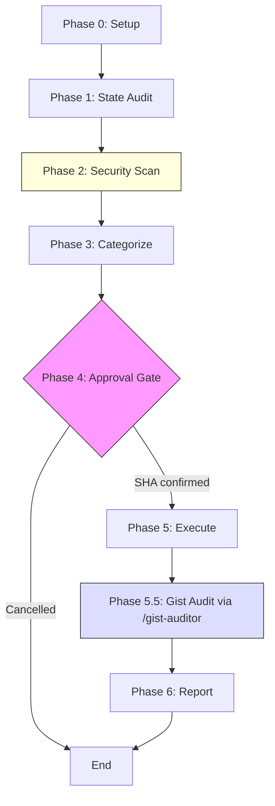

# Repo Sweep v2.3 - Repository Housekeeping

## Overview

Fast, security-aware repository cleanup for daily use. Audits PRs, branches, scaffolding, and security; merges approved PRs; cleans stale branches; delegates gist audit to `/gist-auditor`.

## Prerequisites

- Git repository with remote origin configured
- GitHub CLI (`gh`) authenticated

## Workflow Overview



## Philosophy

- **Safety first**: Flag anything concerning before acting
- **Transparency**: Show exactly what will happen before doing it
- **No surprises**: Failing CI, merge conflicts, or draft PRs require explicit approval
- **SHA confirmation** required for all destructive actions
- **Branch protection**: Automatically bypasses and restores

---

## Instructions

Execute each phase in order. **STOP and report if any phase has blocking issues.**

Phase scripts are in `references/phase-scripts.md`. Use them as templates — adapt variable names to actual values gathered during execution.

---

## PHASE 0: ENVIRONMENT SETUP

**Goal**: Establish context and start timing.

Run the Phase 0 script from `!cat ${CLAUDE_SKILL_DIR}/references/phase-scripts.md` (section: Phase 0). Capture `REPO_NAME`, `DEFAULT_BRANCH`, `SWEEP_START`.

---

## PHASE 1: STATE AUDIT

**Goal**: Gather complete state of PRs, branches, local changes, beads, and scaffolding.

Run each sub-phase script from references/phase-scripts.md:

1. **1.1 Local State** — uncommitted changes, unpushed commits, stashes
2. **1.2 Pull Requests** — `gh pr list` with full details (mergeable, review, checks)
3. **1.3 Branches** — local, remote, merged (cleanup candidates), stale (30+ days)
4. **1.4 Beads State** — open/in-progress beads if configured
5. **1.5 Scaffolding Check** — verify CHANGELOG.md, SECURITY.md, CONTRIBUTING.md, CODE_OF_CONDUCT.md, .gitignore, CLAUDE.md, LICENSE

---

## PHASE 2: SECURITY SCAN (LITE)

**Goal**: Quick security check before merging anything.

1. **2.1 Secrets Scan** — check staged changes for AWS keys, API keys, private keys, .env files
2. **2.2 Dependency Audit** — `npm audit` summary if applicable

**BLOCKING** if secrets detected.

---

## PHASE 3: ANALYSIS & CATEGORIZATION

**Goal**: Categorize all findings into a box-drawn summary.

| Category           | Criteria                                                                      |
| ------------------ | ----------------------------------------------------------------------------- |
| **READY TO MERGE** | `mergeable: MERGEABLE`, `reviewDecision: APPROVED`, checks passing, not draft |
| **NEEDS DECISION** | Pending reviews, running checks, uncommitted changes, stashes                 |
| **BLOCKED**        | Merge conflicts, failing CI, drafts, changes requested, secrets               |
| **CLEANUP**        | Merged branches, stale branches                                               |

Present as box-drawn `SWEEP ANALYSIS` table.

---

## PHASE 4: APPROVAL GATE

**Goal**: Explicit SHA-bound approval before destructive actions.

Use `AskUserQuestion` with current HEAD SHA. User must type first 4 chars to approve. Options: approve all, review each, cancel.

**CRITICAL:** Do not proceed without explicit SHA confirmation.

---

## PHASE 5: EXECUTION

**Goal**: Execute approved actions safely. Scripts in references/phase-scripts.md.

1. **5.1 Commit** uncommitted changes (if approved)
2. **5.2 Push** unpushed commits (with branch protection bypass/restore)
3. **5.3 Merge** approved PRs (squash, with protection bypass/restore)
4. **5.4 Delete** merged branches (local + remote)

---

## PHASE 5.5: GIST AUDIT (REPO-SCOPED)

**Goal**: Audit and fix the current repo's gist(s).

**Delegation**: Call `Skill(gist-auditor)` with args `--repo $REPO_NAME`.

The gist-auditor handles discovery, classification, template enforcement, and remediation — scoped to only gists matching the current repo. Capture result as `GIST_CHECK_RESULT` for Phase 6.

---

## PHASE 6: SWEEP REPORT

**Goal**: Report actions taken, current state, remaining items.

Present box-drawn `SWEEP COMPLETE` table with:

- Actions taken (commits pushed, PRs merged, branches deleted)
- Current state (HEAD, open PRs, local branches)
- External artifacts (gist status)
- Remaining manual items
- Duration

---

## Output

- Console report with box-drawn summary
- Gist audit via `/gist-auditor` (repo-scoped)
- Clean main branch with approved work merged

## Error Recovery

| Situation                 | Recovery                                                        |
| ------------------------- | --------------------------------------------------------------- |
| Merge failed mid-way      | `gh pr view NUMBER --json state` to check                       |
| Protection restore failed | Backup at `/tmp/branch-protection-sweep-*.json`                 |
| Stuck state               | Re-run `/repo-sweep` — it re-audits and skips completed actions |

## Safety Guarantees

- Never force-push to main/default
- Never delete unmerged branches without approval
- Never merge PRs with failing required checks
- Always show actions before executing
- SHA confirmation required for destructive actions

## Resources

- [GitHub CLI Reference](https://cli.github.com/manual/)
- [Keep a Changelog](https://keepachangelog.com)
- [Semantic Versioning](https://semver.org)

## Examples

### Clean Sweep

```
/sweep → discovers 1 approved PR + 1 merged branch
→ user approves (SHA: abc1)
→ PR merged, branch deleted
→ Duration: 12s
```

### With Concerns

```
/sweep → 1 approved PR, 1 pending review, 1 with conflicts
→ merges approved PR, skips pending, reports conflict
→ Duration: 8s
```

---

## Quick Reference

| Phase            | Purpose                      | Blocking?        |
| ---------------- | ---------------------------- | ---------------- |
| 0. Setup         | Repository info, timing      | No               |
| 1. State Audit   | PRs, branches, local changes | No               |
| 2. Security Scan | Quick secrets/vuln check     | Yes (if secrets) |
| 3. Analysis      | Categorize safe/blocked      | No               |
| 4. Approval Gate | SHA confirmation             | Yes              |
| 5. Execution     | Merge, delete, push          | N/A              |
| 5.5 Gist Audit   | Via /gist-auditor --repo     | No               |
| 6. Report        | Summary, metrics             | No               |
