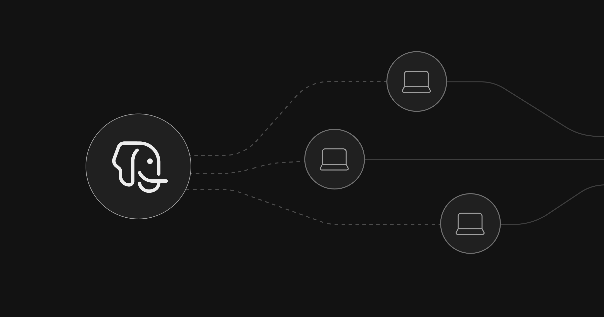

# Supabase Agent Skills

Agent Skills to help developers using AI agents with Supabase. Agent Skills are
folders of instructions, scripts, and resources that agents can discover and use
to do things more accurately and efficiently. Compatible with 18+ AI agents
including Claude Code, GitHub Copilot, Cursor, Cline, and many others.

The skills in this repo follow the [Agent Skills](https://agentskills.io/)
format.

## Installation

See the [Supabase AI Skills documentation](https://supabase.com/docs/guides/getting-started/ai-skills)
for detailed installation instructions.

### Install all skills

```bash
npx skills add supabase/agent-skills
```

### Install a specific skill

```bash
npx skills add supabase/agent-skills --skill supabase
npx skills add supabase/agent-skills --skill supabase-postgres-best-practices
```

### Claude Code Plugin

You can also install the skills as Claude Code plugins:

```bash
# 1. Install supabase/agent-skill marketplace
claude plugin marketplace add supabase/agent-skills

# 2. Install the plugin that you want 
claude plugin install supabase@supabase-agent-skills
claude plugin install postgres-best-practices@supabase-agent-skills
```

## Available Skills

<details>
<summary><strong>supabase</strong></summary>

Comprehensive Supabase development skill covering all Supabase products and
integrations.

**Use when:**

- Working with any Supabase product (Database, Auth, Edge Functions, Realtime,
  Storage, Vectors, Cron, Queues)
- Using client libraries and SSR integrations (supabase-js, @supabase/ssr) in
  Next.js, React, SvelteKit, Astro, Remix
- Troubleshooting auth issues (login, logout, sessions, JWT, cookies, getSession,
  getUser, getClaims, RLS)
- Using the Supabase CLI or MCP server
- Working with schema changes, migrations, security audits, or Postgres extensions
  (pg_graphql, pg_cron, pg_vector)

</details>

<details>
<summary><strong>supabase-postgres-best-practices</strong></summary>

Postgres performance optimization guidelines from Supabase. Contains references
across 8 categories, prioritized by impact.

**Use when:**

- Writing SQL queries or designing schemas
- Implementing indexes or query optimization
- Reviewing database performance issues
- Configuring connection pooling or scaling
- Working with Row-Level Security (RLS)

**Categories covered:**

- Query Performance (Critical)
- Connection Management (Critical)
- Schema Design (High)
- Concurrency & Locking (Medium-High)
- Security & RLS (Critical)
- Data Access Patterns (Medium)
- Monitoring & Diagnostics (Low-Medium)
- Advanced Features (Low)

</details>

## Usage

Skills are automatically available once installed. The agent will use them when
relevant tasks are detected.

**Examples:**

```
Optimize this Postgres query
```

```
Review my schema for performance issues
```

```
Help me set up Supabase Auth with Next.js
```

```
Help me add proper indexes to this table
```

## Skill Structure

Each skill follows the [Agent Skills Open Standard](https://agentskills.io/):

- `SKILL.md` - Required skill manifest with frontmatter (name, description, metadata)
- `references/` - (Optional) Reference files for detailed documentation

## `.well-known` discovery

Each release uploads a `dist/index.json` alongside the skill tarballs. This index conforms to the [agent-skills `.well-known` URI spec](https://github.com/agentskills/agentskills/pull/254) (schema v0.2.0) and is consumed by `supabase.com` to serve skills at `https://supabase.com/.well-known/agent-skills/`.

The release artifacts are built by `scripts/build-release.ts` and triggered by [Release Please](https://github.com/googleapis/release-please) on every semver release.

### Migrating to the official GitHub Action

[`jonathanhefner/agentskills-build-for-well-known`](https://github.com/jonathanhefner/agentskills-build-for-well-known) is intended to be transferred to the `agentskills` org and published to the GitHub Marketplace. When that happens, `scripts/build-release.ts` and the `pnpm build:release` step in `release-please.yml` can be replaced with the Action directly:

```yaml
- name: Build release artifacts
  uses: agentskills/build-for-well-known@v1   # replaces pnpm build:release
  with:
    skills-dir: skills
    output-dir: dist
```

Everything else — the Release Please trigger, the upload step, the supabase-plugin dispatch — stays exactly the same. The script and the Action produce identical output, so it is a drop-in swap.
