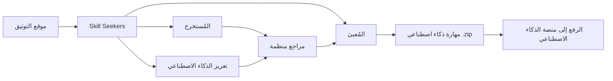

<p align="center">
  
</p>

# Skill Seekers

[English](README.md) | [简体中文](README.zh-CN.md) | [日本語](README.ja.md) | [한국어](README.ko.md) | [Español](README.es.md) | [Français](README.fr.md) | [Deutsch](README.de.md) | [Português](README.pt-BR.md) | [Türkçe](README.tr.md) | العربية | [हिन्दी](README.hi.md) | [Русский](README.ru.md)

> ⚠️ **إشعار الترجمة الآلية**
>
> تمت ترجمة هذا المستند تلقائيًا بواسطة الذكاء الاصطناعي. على الرغم من حرصنا على جودة الترجمة، قد تتضمن تعبيرات غير دقيقة.

[](https://github.com/yusufkaraaslan/Skill_Seekers/releases)
[](https://opensource.org/licenses/MIT)
[](https://www.python.org/downloads/)
[](https://modelcontextprotocol.io)
[](tests/)
[](https://github.com/users/yusufkaraaslan/projects/2)
[](https://pypi.org/project/skill-seekers/)
[](https://pypi.org/project/skill-seekers/)
[](https://pypi.org/project/skill-seekers/)
[](https://pepy.tech/projects/skill-seekers)
<a href="https://trendshift.io/repositories/18329" target="_blank"></a>
[](https://skillseekersweb.com/)
[](https://x.com/_yUSyUS_)
[](https://github.com/yusufkaraaslan/Skill_Seekers)

**🧠 طبقة البيانات لأنظمة الذكاء الاصطناعي.** يحوّل Skill Seekers مواقع التوثيق ومستودعات GitHub وملفات PDF والفيديوهات ودفاتر Jupyter والويكي و18 نوعًا من المصادر إلى أصول معرفية منظمة — جاهزة لتشغيل مهارات الذكاء الاصطناعي (Claude وGemini وOpenAI) وخطوط أنابيب RAG (مثل LangChain وLlamaIndex وPinecone) ومساعدات البرمجة بالذكاء الاصطناعي (مثل Cursor وWindsurf وCline) في دقائق بدلاً من ساعات.

> 🌐 **[زيارة SkillSeekersWeb.com](https://skillseekersweb.com/)** - تصفح أكثر من 24 إعدادًا مسبقًا، وشارك إعداداتك، واطّلع على التوثيق الكامل!

> 📋 **[عرض خارطة الطريق والمهام](https://github.com/users/yusufkaraaslan/projects/2)** - 134 مهمة عبر 10 فئات، اختر أيًا منها للمساهمة!

## 🌐 المنظومة

Skill Seekers هو مشروع متعدد المستودعات. إليك أين يوجد كل شيء:

| المستودع | الوصف | الروابط |
|----------|-------|---------|
| **[Skill_Seekers](https://github.com/yusufkaraaslan/Skill_Seekers)** | CLI الأساسي وخادم MCP (هذا المستودع) | [PyPI](https://pypi.org/project/skill-seekers/) |
| **[skillseekersweb](https://github.com/yusufkaraaslan/skillseekersweb)** | الموقع والتوثيق | [الموقع](https://skillseekersweb.com/) |
| **[skill-seekers-configs](https://github.com/yusufkaraaslan/skill-seekers-configs)** | مستودع إعدادات المجتمع | |
| **[skill-seekers-action](https://github.com/yusufkaraaslan/skill-seekers-action)** | GitHub Action لـ CI/CD | |
| **[skill-seekers-plugin](https://github.com/yusufkaraaslan/skill-seekers-plugin)** | إضافة Claude Code | |
| **[homebrew-skill-seekers](https://github.com/yusufkaraaslan/homebrew-skill-seekers)** | Homebrew tap لـ macOS | |

> **تريد المساهمة؟** مستودعات الموقع والإعدادات هي نقاط بداية رائعة للمساهمين الجدد!

## 🧠 طبقة البيانات لأنظمة الذكاء الاصطناعي

**Skill Seekers هو طبقة المعالجة المسبقة العامة** التي تقع بين التوثيق الخام وجميع أنظمة الذكاء الاصطناعي التي تستهلكه. سواء كنت تبني مهارات Claude أو خط أنابيب RAG باستخدام LangChain أو ملف `.cursorrules` لـ Cursor — فإن تحضير البيانات متطابق. تقوم بذلك مرة واحدة وتصدّر إلى جميع المنصات المستهدفة.

```bash
# أمر واحد → أصل معرفي منظم
skill-seekers create https://docs.react.dev/
# أو: skill-seekers create facebook/react
# أو: skill-seekers create ./my-project

# التصدير إلى أي نظام ذكاء اصطناعي
skill-seekers package output/react --target claude      # → مهارة Claude AI (ZIP)
skill-seekers package output/react --target langchain   # → LangChain Documents
skill-seekers package output/react --target llama-index # → LlamaIndex TextNodes
skill-seekers package output/react --target cursor      # → .cursorrules
skill-seekers package output/react --target ibm-bob     # → مجلد مهارة IBM Bob
```

### المخرجات التي يتم بناؤها

| المخرج | الهدف | ما يشغّله |
|--------|-------|----------|
| **مهارة Claude** (ZIP + YAML) | `--target claude` | Claude Code وClaude API |
| **مهارة Gemini** (tar.gz) | `--target gemini` | Google Gemini |
| **OpenAI / Custom GPT** (ZIP) | `--target openai` | GPT-4o والمساعدات المخصصة |
| **LangChain Documents** | `--target langchain` | سلاسل الأسئلة والأجوبة والوكلاء والمسترجعات |
| **LlamaIndex TextNodes** | `--target llama-index` | محركات الاستعلام ومحركات المحادثة |
| **Haystack Documents** | `--target haystack` | خطوط أنابيب RAG للمؤسسات |
| **Pinecone جاهز** (Markdown) | `--target markdown` | رفع المتجهات |
| **ChromaDB / FAISS / Qdrant** | `--target chroma/faiss/qdrant` | قواعد بيانات المتجهات المحلية |
| **مهارة IBM Bob** (مجلد) | `--target ibm-bob` | مهارات IBM Bob على مستوى المشروع/العام |
| **Cursor** `.cursorrules` | `--target markdown` → نسخ SKILL.md | ملف `.cursorrules` في Cursor IDE |
| **Windsurf / Cline / Continue** | `--target claude` → نسخ | VS Code وIntelliJ وVim |

### لماذا هذا مهم

- ⚡ **أسرع بنسبة 99%** — أيام من التحضير اليدوي → 15–45 دقيقة
- 🎯 **جودة مهارات الذكاء الاصطناعي** — ملفات SKILL.md بأكثر من 500 سطر تتضمن أمثلة وأنماط وأدلة
- 📊 **تقسيم جاهز لـ RAG** — تقسيم ذكي يحافظ على كتل الكود ويصون السياق
- 🎬 **الفيديو** — استخراج الكود والنصوص والمعرفة المنظمة من يوتيوب والفيديوهات المحلية
- 🔄 **متعدد المصادر** — دمج 18 نوعًا من المصادر (توثيق وGitHub وPDF وفيديو ودفاتر Jupyter وويكي والمزيد) في أصل معرفي واحد
- 🌐 **تحضير واحد لكل الأهداف** — تصدير نفس الأصل إلى 21 منصة دون إعادة الاستخراج
- ✅ **مُختبر بإحكام** — أكثر من 3,700 اختبارًا و24 إعدادًا مسبقًا للأطر البرمجية، جاهز للإنتاج

## 🚀 البدء السريع (3 أوامر)

```bash
# 1. التثبيت
pip install skill-seekers

# 2. إنشاء مهارة من أي مصدر
skill-seekers create https://docs.django.com/

# 3. التعبئة لمنصة الذكاء الاصطناعي الخاصة بك
skill-seekers package output/django --target claude
```

**هذا كل شيء!** أصبح لديك الآن `output/django-claude.zip` جاهزًا للاستخدام.

```bash
# استخدام وكيل ذكاء اصطناعي مختلف للتعزيز (الافتراضي: claude)
skill-seekers create https://docs.django.com/ --agent kimi
skill-seekers create https://docs.django.com/ --agent codex
skill-seekers create https://docs.django.com/ --agent-cmd "my-custom-agent run"
```

### 🛰️ مسح المشروع المدعوم بالذكاء الاصطناعي (جديد)

وجّه أمر `scan` إلى أي مشروع وسيقرأ وكيل الذكاء الاصطناعي ملفات التعريف وREADME وDockerfile/CI وعينات من استيرادات الكود المصدري — ثم يُصدر إعدادًا واحدًا لكل إطار برمجي مكتشف بالإضافة إلى `<project>-codebase.json` لكودك الخاص. يثبّت الإصدار المكتشف بحيث يبلّغ إعادة التشغيل عن ترقيات الإصدار:

```bash
skill-seekers scan ./my-react-app --out ./configs/scanned/
# → react.json, vite.json, tailwind.json, jest.json, my-react-app-codebase.json

# ثم ابنِ أيًا منها
skill-seekers create ./configs/scanned/react.json
```

إذا لم يكن للاكتشاف إعداد مسبق موجود، يولّد الذكاء الاصطناعي إعدادًا جديدًا؛ وعند الخروج يمكنك اختياريًا نشره في [سجل المجتمع](https://github.com/yusufkaraaslan/skill-seekers-configs).

### مصادر أخرى (18 نوعًا مدعومًا)

```bash
# مستودع GitHub
skill-seekers create facebook/react

# مشروع محلي
skill-seekers create ./my-project

# مستند PDF
skill-seekers create manual.pdf

# مستند Word
skill-seekers create report.docx

# كتاب إلكتروني EPUB
skill-seekers create book.epub

# دفتر Jupyter
skill-seekers create notebook.ipynb

# مواصفات OpenAPI
skill-seekers create openapi.yaml

# عرض PowerPoint
skill-seekers create presentation.pptx

# مستند AsciiDoc
skill-seekers create guide.adoc

# ملف HTML محلي (يُكتشف تلقائيًا حسب الامتداد)
skill-seekers create page.html

# مجلد كامل من ملفات HTML (يُكتشف تلقائيًا للمجلدات التي يغلب عليها HTML)
skill-seekers create ./mirror_output/site/

# فرض وضع HTML على مجلد مختلط/مليء بالكود
skill-seekers create ./repo/ --html-path ./repo/docs/build/html/

# خلاصة RSS/Atom
skill-seekers create feed.rss

# صفحة Man
skill-seekers create curl.1

# الفيديو (YouTube أو Vimeo أو ملف محلي — يتطلب skill-seekers[video])
skill-seekers create --video-url https://www.youtube.com/watch?v=... --name mytutorial
# أول مرة؟ تثبيت تلقائي للمكونات المرئية المتوافقة مع GPU:
skill-seekers create --setup

# ويكي Confluence
skill-seekers create --space-key TEAM --name wiki

# صفحات Notion
skill-seekers create --database-id ... --name docs

# تصدير محادثات Slack/Discord
skill-seekers create --chat-export-path ./slack-export --name team-chat
```

### التصدير إلى كل مكان

```bash
# التعبئة لعدة منصات
for platform in claude gemini openai langchain; do
  skill-seekers package output/django --target $platform
done
```

## ما هو Skill Seekers؟

Skill Seekers هو **طبقة البيانات لأنظمة الذكاء الاصطناعي** التي تحوّل 18 نوعًا من المصادر — مواقع التوثيق ومستودعات GitHub وملفات PDF والفيديوهات ودفاتر Jupyter ومستندات Word/EPUB/AsciiDoc ومواصفات OpenAPI وعروض PowerPoint وخلاصات RSS وصفحات Man وويكي Confluence وصفحات Notion ومحادثات Slack/Discord والمزيد — إلى أصول معرفية منظمة لكل منصة ذكاء اصطناعي:

| حالة الاستخدام | ما تحصل عليه | أمثلة |
|---------------|-------------|-------|
| **مهارات الذكاء الاصطناعي** | ملف SKILL.md شامل + مراجع | Claude Code وGemini وGPT |
| **خطوط أنابيب RAG** | مستندات مقسمة مع بيانات وصفية غنية | LangChain وLlamaIndex وHaystack |
| **قواعد بيانات المتجهات** | بيانات مُنسقة مسبقًا جاهزة للرفع | Pinecone وChroma وWeaviate وFAISS |
| **مساعدات البرمجة بالذكاء الاصطناعي** | ملفات سياق يقرأها الذكاء الاصطناعي في بيئة التطوير تلقائيًا | Cursor وWindsurf وCline وContinue.dev |

## 📚 التوثيق

| أريد أن... | اقرأ هذا |
|--------------|-----------|
| **أبدأ بسرعة** | [البدء السريع](docs/getting-started/02-quick-start.md) - 3 أوامر لأول مهارة |
| **أفهم المفاهيم** | [المفاهيم الأساسية](docs/user-guide/01-core-concepts.md) - كيف يعمل |
| **أستخرج المصادر** | [دليل الاستخراج](docs/user-guide/02-scraping.md) - جميع أنواع المصادر |
| **أعزز المهارات** | [دليل التعزيز](docs/user-guide/03-enhancement.md) - التعزيز بالذكاء الاصطناعي |
| **أصدّر المهارات** | [دليل التعبئة](docs/user-guide/04-packaging.md) - التصدير للمنصات |
| **أبحث عن الأوامر** | [مرجع CLI](docs/reference/CLI_REFERENCE.md) - جميع الأوامر العشرين |
| **أقوم بالإعداد** | [تنسيق الإعداد](docs/reference/CONFIG_FORMAT.md) - مواصفات JSON |
| **أحل المشاكل** | [استكشاف الأخطاء](docs/user-guide/06-troubleshooting.md) - المشاكل الشائعة |

**التوثيق الكامل:** [docs/README.md](docs/README.md)

بدلاً من قضاء أيام في المعالجة اليدوية المسبقة، يقوم Skill Seekers بـ:

1. **الاستيعاب** — التوثيق ومستودعات GitHub وقواعد الكود المحلية وملفات PDF والفيديوهات ودفاتر Jupyter والويكي وأكثر من 10 أنواع أخرى من المصادر
2. **التحليل** — تحليل AST العميق واكتشاف الأنماط واستخراج واجهات API
3. **الهيكلة** — ملفات مرجعية مُصنفة مع بيانات وصفية
4. **التعزيز** — توليد SKILL.md مدعوم بالذكاء الاصطناعي (Claude أو Gemini أو محلي)
5. **التصدير** — 16 تنسيقًا خاصًا بكل منصة من أصل واحد

## لماذا تستخدم Skill Seekers؟

### لبنّائي مهارات الذكاء الاصطناعي (Claude وGemini وOpenAI)

- 🎯 **مهارات بجودة إنتاجية** — ملفات SKILL.md بأكثر من 500 سطر تتضمن أمثلة كود وأنماط وأدلة
- 🔄 **سير عمل التعزيز** — تطبيق `security-focus` أو `architecture-comprehensive` أو إعدادات YAML مخصصة
- 🎮 **أي مجال** — محركات الألعاب (Godot وUnity) والأطر البرمجية (React وDjango) والأدوات الداخلية
- 🔧 **الفرق** — دمج التوثيق الداخلي + الكود في مصدر حقيقة واحد
- 📚 **جودة عالية** — معززة بالذكاء الاصطناعي مع أمثلة ومرجع سريع ودليل تنقل

### لبنّائي RAG ومهندسي الذكاء الاصطناعي

- 🤖 **بيانات جاهزة لـ RAG** — مستندات LangChain `Documents` مُقسمة مسبقًا وLlamaIndex `TextNodes` وHaystack `Documents`
- 🚀 **أسرع بنسبة 99%** — أيام من المعالجة المسبقة → 15–45 دقيقة
- 📊 **بيانات وصفية ذكية** — فئات ومصادر وأنواع → دقة استرجاع أعلى
- 🔄 **متعدد المصادر** — دمج التوثيق + GitHub + PDF + الفيديو في خط أنابيب واحد
- 🌐 **مستقل عن المنصة** — التصدير إلى أي قاعدة بيانات متجهات أو إطار عمل دون إعادة الاستخراج

### لمستخدمي مساعدات البرمجة بالذكاء الاصطناعي

- 💻 **Cursor / Windsurf / Cline** — توليد `.cursorrules` / `.windsurfrules` / `.clinerules` تلقائيًا
- 🎯 **سياق دائم** — الذكاء الاصطناعي "يعرف" أطرك البرمجية دون تكرار التوجيهات
- 📚 **محدّث دائمًا** — تحديث السياق في دقائق عند تغير التوثيق

## الميزات الرئيسية

### 🌐 استخراج التوثيق
- ✅ **اكتشاف ذكي لمواقع SPA** - اكتشاف ثلاثي الطبقات لمواقع JavaScript SPA (sitemap.xml → llms.txt → عرض المتصفح بدون واجهة)
- ✅ **دعم llms.txt** - اكتشاف واستخدام ملفات التوثيق الجاهزة لنماذج اللغة تلقائيًا (أسرع 10 مرات)
- ✅ **مُستخرج عام** - يعمل مع أي موقع توثيق
- ✅ **تصنيف ذكي** - تنظيم المحتوى حسب الموضوع تلقائيًا
- ✅ **اكتشاف لغة الكود** - التعرف على Python وJavaScript وC++ وGDScript وغيرها
- ✅ **أكثر من 24 إعدادًا مسبقًا جاهزًا** - Godot وReact وVue وDjango وFastAPI والمزيد

### 📄 دعم PDF
- ✅ **استخراج PDF الأساسي** - استخراج النصوص والكود والصور من ملفات PDF
- ✅ **OCR للمستندات الممسوحة** - استخراج النص من المستندات الممسوحة ضوئيًا
- ✅ **ملفات PDF المحمية بكلمة مرور** - التعامل مع ملفات PDF المشفرة
- ✅ **استخراج الجداول** - استخراج الجداول المعقدة
- ✅ **المعالجة المتوازية** - أسرع 3 مرات لملفات PDF الكبيرة
- ✅ **التخزين المؤقت الذكي** - أسرع 50% عند إعادة التشغيل

### 🎬 استخراج الفيديو
- ✅ **YouTube والفيديوهات المحلية** - استخراج النصوص والكود والمعرفة المنظمة من الفيديوهات
- ✅ **تحليل الإطارات المرئية** - استخراج OCR من محررات الكود والطرفيات والشرائح والمخططات
- ✅ **اكتشاف GPU تلقائي** - تثبيت إصدار PyTorch الصحيح تلقائيًا (CUDA/ROCm/MPS/CPU)
- ✅ **تعزيز بالذكاء الاصطناعي** - مرحلتان: تنظيف مخرجات OCR + توليد SKILL.md مصقول
- ✅ **قص زمني** - استخراج أقسام محددة باستخدام `--start-time` و`--end-time`
- ✅ **دعم قوائم التشغيل** - معالجة جميع فيديوهات قائمة تشغيل YouTube دفعة واحدة
- ✅ **احتياطي Vision API** - استخدام Claude Vision لإطارات OCR منخفضة الثقة

### 🐙 تحليل مستودعات GitHub
- ✅ **تحليل كود عميق** - تحليل AST لـ Python وJavaScript وTypeScript وJava وC++ وGo
- ✅ **استخراج واجهات API** - الدوال والأصناف والتوابع مع المعاملات والأنواع
- ✅ **بيانات المستودع الوصفية** - README وشجرة الملفات وتوزيع اللغات والنجوم/التفريعات
- ✅ **GitHub Issues وPR** - جلب المشكلات المفتوحة/المغلقة مع التصنيفات والمراحل
- ✅ **CHANGELOG والإصدارات** - استخراج سجل الإصدارات تلقائيًا
- ✅ **اكتشاف التعارضات** - مقارنة واجهات API الموثقة مع التنفيذ الفعلي للكود
- ✅ **تكامل MCP** - لغة طبيعية: "استخرج مستودع GitHub facebook/react"

### 🔄 الاستخراج الموحد متعدد المصادر
- ✅ **دمج مصادر متعددة** - خلط التوثيق + GitHub + PDF في مهارة واحدة
- ✅ **اكتشاف التعارضات** - اكتشاف التناقضات بين التوثيق والكود تلقائيًا
- ✅ **دمج ذكي** - حل التعارضات قائم على القواعد أو مدعوم بالذكاء الاصطناعي
- ✅ **تقارير شفافة** - مقارنة جنبًا إلى جنب مع تحذيرات ⚠️
- ✅ **تحليل فجوات التوثيق** - تحديد التوثيق القديم والميزات غير الموثقة
- ✅ **مصدر حقيقة واحد** - مهارة واحدة تعرض كلاً من النية (التوثيق) والواقع (الكود)
- ✅ **التوافق مع الإصدارات السابقة** - إعدادات المصدر الواحد القديمة تعمل بشكل طبيعي

### 🤖 دعم منصات LLM المتعددة
- ✅ **12 منصة LLM** - Claude AI وGoogle Gemini وOpenAI ChatGPT وMiniMax AI وMarkdown العام وOpenCode وKimi (Moonshot AI) وDeepSeek AI وQwen (Alibaba) وOpenRouter وTogether AI وFireworks AI
- ✅ **استخراج عام** - نفس التوثيق يعمل لجميع المنصات
- ✅ **تعبئة خاصة بكل منصة** - تنسيقات محسّنة لكل نموذج لغوي
- ✅ **تصدير بأمر واحد** - علامة `--target` لاختيار المنصة
- ✅ **تبعيات اختيارية** - تثبيت ما تحتاجه فقط
- ✅ **توافق 100% مع الإصدارات السابقة** - سير عمل Claude الحالي لا يتغير

| المنصة | التنسيق | الرفع | التعزيز | API Key | نقطة نهاية مخصصة |
|--------|---------|-------|---------|---------|-----------------|
| **Claude AI** | ZIP + YAML | ✅ تلقائي | ✅ نعم | ANTHROPIC_API_KEY | ANTHROPIC_BASE_URL |
| **Google Gemini** | tar.gz | ✅ تلقائي | ✅ نعم | GOOGLE_API_KEY | - |
| **OpenAI ChatGPT** | ZIP + Vector Store | ✅ تلقائي | ✅ نعم | OPENAI_API_KEY | - |
| **MiniMax AI** | ZIP + Knowledge Files | ✅ تلقائي | ✅ نعم | MINIMAX_API_KEY | - |
| **Markdown العام** | ZIP | ❌ يدوي | ❌ لا | - | - |

```bash
# Claude (الافتراضي - لا حاجة لتغييرات!)
skill-seekers package output/react/
skill-seekers upload react.zip

# Google Gemini
pip install skill-seekers[gemini]
skill-seekers package output/react/ --target gemini
skill-seekers upload react-gemini.tar.gz --target gemini

# OpenAI ChatGPT
pip install skill-seekers[openai]
skill-seekers package output/react/ --target openai
skill-seekers upload react-openai.zip --target openai

# MiniMax AI
pip install skill-seekers[minimax]
skill-seekers package output/react/ --target minimax
skill-seekers upload react-minimax.zip --target minimax

# Markdown العام (تصدير عام)
skill-seekers package output/react/ --target markdown
# استخدم ملفات Markdown مباشرة في أي نموذج لغوي
```

<details>
<summary>🔧 <strong>استخدم مزوّد الذكاء الاصطناعي الخاص بك (نقاط نهاية متوافقة مع OpenAI + اشتراكات، بدون رصيد Anthropic)</strong></summary>

خطوة **التعزيز** الاختيارية بالذكاء الاصطناعي (المستخدمة في `create` و`scan` و`enhance`) **لا** تتطلب مفتاح Anthropic. لديك ثلاث طرق لتشغيلها:

**1. استخدم اشتراكًا تدفع ثمنه بالفعل — بدون رصيد API على الإطلاق (وضع الوكيل المحلي LOCAL)**

يمكن لـ Skill Seekers استدعاء واجهة سطر أوامر لوكيل برمجة سجّلت الدخول إليه بالفعل، بحيث يعمل التعزيز على خطتك الحالية بدلاً من رموز API المدفوعة حسب الاستخدام:

```bash
skill-seekers create <source> --agent codex     # OpenAI Codex CLI → اشتراكك في ChatGPT Plus
skill-seekers create <source> --agent claude    # Claude Code      → اشتراكك في Claude Pro/Max
```

الوكلاء المدعومون: `claude` و`codex` و`copilot` و`opencode` و`kimi` و`custom`
(اجمع بين `--agent custom` و`--agent-cmd "<your-cli> ..."` لتشغيل أي أداة أخرى).

**2. أي مزوّد متوافق مع OpenAI (OpenRouter وGroq وCerebras وMistral وNVIDIA NIM وغيرها)**

كل هؤلاء يوفرون نقطة نهاية `/v1` متوافقة مع OpenAI. وجّه Skill Seekers إلى أحدها بثلاثة متغيرات بيئة — فهو يكتشف `OPENAI_API_KEY`، وتحترم مكتبة OpenAI SDK متغير `OPENAI_BASE_URL` تلقائيًا:

```bash
export OPENAI_API_KEY="<your provider key>"
export OPENAI_BASE_URL="https://openrouter.ai/api/v1"   # نقطة نهاية المزوّد (انظر الجدول)
export OPENAI_MODEL="<a model that provider offers>"     # مطلوب — النموذج الافتراضي gpt-4o غير موجود لدى المزوّدين الآخرين
skill-seekers create <source>
```

| المزوّد      | `OPENAI_BASE_URL`                          |
|--------------|--------------------------------------------|
| OpenRouter   | `https://openrouter.ai/api/v1`             |
| Groq         | `https://api.groq.com/openai/v1`           |
| Cerebras     | `https://api.cerebras.ai/v1`               |
| Mistral      | `https://api.mistral.ai/v1`                |
| NVIDIA NIM   | `https://integrate.api.nvidia.com/v1`      |

> يختار اكتشاف المزوّد **أول** متغير بيئة لمفتاح API يجده (`ANTHROPIC_API_KEY` ← `GOOGLE_API_KEY` ← `OPENAI_API_KEY` ← `MOONSHOT_API_KEY`). عيّن `SKILL_SEEKER_PROVIDER` لفرض مزوّد محدد، أو تأكد من أن المفاتيح ذات الأولوية الأعلى غير معيّنة.

**3. نقاط النهاية المتوافقة مع Claude (مثل GLM والوسطاء)**

```bash
export ANTHROPIC_API_KEY="your-key"
export ANTHROPIC_BASE_URL="https://your-claude-compatible-endpoint/v1"
```

كما يتوفر دعم أصلي لـ Google Gemini (`GOOGLE_API_KEY`) وKimi/Moonshot (`MOONSHOT_API_KEY`). انظر **[مرجع متغيرات البيئة](docs/reference/ENVIRONMENT_VARIABLES.md#llm-provider-selection)** للقائمة الكاملة، بما في ذلك تجاوزات النماذج لكل مزوّد.

</details>

**التثبيت:**
```bash
# تثبيت دعم Gemini
pip install skill-seekers[gemini]

# تثبيت دعم OpenAI
pip install skill-seekers[openai]

# تثبيت دعم MiniMax
pip install skill-seekers[minimax]

# تثبيت جميع منصات LLM
pip install skill-seekers[all-llms]
```

### 🔗 تكامل أطر RAG

- ✅ **LangChain Documents** - تصدير مباشر بتنسيق `Document` مع `page_content` + بيانات وصفية
  - مناسب لـ: سلاسل الأسئلة والأجوبة والمسترجعات ومخازن المتجهات والوكلاء
  - مثال: [خط أنابيب LangChain RAG](examples/langchain-rag-pipeline/)
  - دليل: [تكامل LangChain](docs/integrations/LANGCHAIN.md)

- ✅ **LlamaIndex TextNodes** - تصدير بتنسيق `TextNode` مع معرّفات فريدة + تضمينات
  - مناسب لـ: محركات الاستعلام ومحركات المحادثة وسياق التخزين
  - مثال: [محرك استعلام LlamaIndex](examples/llama-index-query-engine/)
  - دليل: [تكامل LlamaIndex](docs/integrations/LLAMA_INDEX.md)

- ✅ **تنسيق Pinecone الجاهز** - محسّن لرفع البيانات إلى قواعد بيانات المتجهات
  - مناسب لـ: البحث المتجهي الإنتاجي والبحث الدلالي والبحث الهجين
  - مثال: [رفع Pinecone](examples/pinecone-upsert/)
  - دليل: [تكامل Pinecone](docs/integrations/PINECONE.md)

**تصدير سريع:**
```bash
# LangChain Documents (JSON)
skill-seekers package output/django --target langchain
# → output/django-langchain.json

# LlamaIndex TextNodes (JSON)
skill-seekers package output/django --target llama-index
# → output/django-llama-index.json

# Markdown (عام)
skill-seekers package output/django --target markdown
# → output/django-markdown/SKILL.md + references/
```

**دليل خط أنابيب RAG الكامل:** [توثيق خطوط أنابيب RAG](docs/integrations/RAG_PIPELINES.md)

---

### 🧠 تكامل مساعدات البرمجة بالذكاء الاصطناعي

تحويل توثيق أي إطار برمجي إلى سياق برمجي خبير لأكثر من 4 مساعدات ذكاء اصطناعي:

- ✅ **Cursor IDE** - توليد `.cursorrules` لاقتراحات الكود المدعومة بالذكاء الاصطناعي
  - مناسب لـ: توليد كود خاص بالإطار البرمجي وأنماط متسقة
  - يعمل مع: Cursor IDE (نسخة معدلة من VS Code)
  - دليل: [تكامل Cursor](docs/integrations/CURSOR.md)
  - مثال: [مهارة Cursor React](examples/cursor-react-skill/)

- ✅ **Windsurf** - تخصيص سياق مساعد Windsurf AI باستخدام `.windsurfrules`
  - مناسب لـ: مساعدة الذكاء الاصطناعي المدمجة في بيئة التطوير والبرمجة التدفقية
  - يعمل مع: Windsurf IDE من Codeium
  - دليل: [تكامل Windsurf](docs/integrations/WINDSURF.md)
  - مثال: [سياق Windsurf FastAPI](examples/windsurf-fastapi-context/)

- ✅ **Cline (VS Code)** - موجهات النظام + MCP لوكيل VS Code
  - مناسب لـ: توليد الكود الوكيلي في VS Code
  - يعمل مع: إضافة Cline لـ VS Code
  - دليل: [تكامل Cline](docs/integrations/CLINE.md)
  - مثال: [مساعد Cline Django](examples/cline-django-assistant/)

- ✅ **Continue.dev** - خوادم سياق مستقلة عن بيئة التطوير
  - مناسب لـ: بيئات تطوير متعددة (VS Code وJetBrains وVim) ومزودي LLM مخصصين
  - يعمل مع: أي بيئة تطوير تحتوي على إضافة Continue.dev
  - دليل: [تكامل Continue](docs/integrations/CONTINUE_DEV.md)
  - مثال: [سياق Continue العام](examples/continue-dev-universal/)

**تصدير سريع (لأدوات البرمجة بالذكاء الاصطناعي):**
```bash
# لأي مساعد برمجة بالذكاء الاصطناعي (Cursor وWindsurf وCline وContinue.dev)
skill-seekers create --config configs/django.json
skill-seekers package output/django --target claude  # أو --target markdown

# نسخ إلى مشروعك (مثال لـ Cursor)
cp output/django-claude/SKILL.md my-project/.cursorrules

# أو لـ Windsurf
cp output/django-claude/SKILL.md my-project/.windsurf/rules/django.md

# أو لـ Cline
cp output/django-claude/SKILL.md my-project/.clinerules

# أو لـ Continue.dev (خادم HTTP)
python examples/continue-dev-universal/context_server.py
# قم بالإعداد في ~/.continue/config.json
```

**مركز التكامل:** [جميع تكاملات أنظمة الذكاء الاصطناعي](docs/integrations/INTEGRATIONS.md)

---

### 🌊 بنية GitHub ثلاثية التدفقات
- ✅ **تحليل ثلاثي التدفقات** - تقسيم مستودعات GitHub إلى تدفقات الكود والتوثيق والرؤى
- ✅ **محلل قاعدة كود موحد** - يعمل مع عناوين URL الخاصة بـ GitHub والمسارات المحلية
- ✅ **C3.x كعمق تحليل** - اختر 'basic' (1–2 دقيقة) أو 'c3x' (20–60 دقيقة)
- ✅ **توليد موجّه مُحسّن** - بيانات GitHub الوصفية وبداية سريعة من README والمشاكل الشائعة
- ✅ **تكامل المشكلات** - المشاكل والحلول الأكثر شيوعًا من GitHub Issues
- ✅ **كلمات مفتاحية ذكية للتوجيه** - أوزان تصنيفات GitHub مضاعفة لاكتشاف أفضل للمواضيع

**شرح التدفقات الثلاثة:**
- **التدفق 1: الكود** - تحليل C3.x العميق (أنماط وأمثلة وأدلة وإعدادات وبنية معمارية)
- **التدفق 2: التوثيق** - توثيق المستودع (README وCONTRIBUTING وdocs/*.md)
- **التدفق 3: الرؤى** - المعرفة المجتمعية (المشكلات والتصنيفات والنجوم والتفريعات)

```python
from skill_seekers.cli.unified_codebase_analyzer import UnifiedCodebaseAnalyzer

# تحليل مستودع GitHub بالتدفقات الثلاثة
analyzer = UnifiedCodebaseAnalyzer()
result = analyzer.analyze(
    source="https://github.com/facebook/react",
    depth="c3x",  # أو "basic" للتحليل السريع
    fetch_github_metadata=True
)

# الوصول إلى تدفق الكود (تحليل C3.x)
print(f"أنماط التصميم: {len(result.code_analysis['c3_1_patterns'])}")
print(f"أمثلة الاختبارات: {result.code_analysis['c3_2_examples_count']}")

# الوصول إلى تدفق التوثيق (توثيق المستودع)
print(f"README: {result.github_docs['readme'][:100]}")

# الوصول إلى تدفق الرؤى (بيانات GitHub الوصفية)
print(f"النجوم: {result.github_insights['metadata']['stars']}")
print(f"المشاكل الشائعة: {len(result.github_insights['common_problems'])}")
```

**التوثيق الكامل**: [ملخص تنفيذ التدفقات الثلاثة](docs/archive/historical/IMPLEMENTATION_SUMMARY_THREE_STREAM.md)

### 🔐 إدارة حدود المعدل الذكية والإعدادات
- ✅ **نظام إعداد متعدد الرموز** - إدارة حسابات GitHub متعددة (شخصي وعمل ومفتوح المصدر)
  - تخزين آمن للإعدادات في `~/.config/skill-seekers/config.json` (صلاحيات 600)
  - استراتيجيات حد المعدل لكل ملف تعريف: `prompt` و`wait` و`switch` و`fail`
  - مهلة قابلة للتخصيص لكل ملف تعريف (الافتراضي: 30 دقيقة، تمنع الانتظار غير المحدود)
  - سلسلة احتياطية ذكية: معامل CLI → متغير بيئة → ملف إعداد → موجه
  - إدارة مفاتيح API لـ Claude وGemini وOpenAI
- ✅ **معالج إعداد تفاعلي** - واجهة طرفية جميلة للإعداد السهل
  - تكامل المتصفح لإنشاء الرموز (يفتح GitHub وغيره تلقائيًا)
  - التحقق من صحة الرموز واختبار الاتصال
  - عرض مرئي للحالة مع ترميز لوني
- ✅ **معالج حدود المعدل الذكي** - لا مزيد من الانتظار غير المحدود!
  - تحذير مسبق بشأن حدود المعدل (60/ساعة مقابل 5000/ساعة)
  - اكتشاف فوري من استجابات GitHub API
  - مؤقتات عد تنازلي مباشرة مع التقدم
  - تبديل تلقائي للملفات التعريفية عند بلوغ حد المعدل
  - أربع استراتيجيات: prompt (استفسار) وwait (عد تنازلي) وswitch (تبديل) وfail (إيقاف)
- ✅ **الاستئناف** - متابعة المهام المتوقفة
  - حفظ تلقائي للتقدم بفواصل قابلة للتخصيص (الافتراضي: 60 ثانية)
  - عرض جميع المهام القابلة للاستئناف مع تفاصيل التقدم
  - تنظيف تلقائي للمهام القديمة (الافتراضي: 7 أيام)
- ✅ **دعم CI/CD** - وضع غير تفاعلي للأتمتة
  - علامة `--non-interactive` للفشل السريع بدون موجهات
  - علامة `--profile` لاختيار حساب GitHub محدد
  - رسائل خطأ واضحة لسجلات خطوط الأنابيب

**إعداد سريع:**
```bash
# إعداد لمرة واحدة (5 دقائق)
skill-seekers config --github

# استخدام ملف تعريف محدد للمستودعات الخاصة
skill-seekers create mycompany/private-repo --profile work

# وضع CI/CD (فشل سريع، بدون موجهات)
skill-seekers create owner/repo --non-interactive

# استئناف مهمة متوقفة
skill-seekers resume --list
skill-seekers resume github_react_20260117_143022
```

**شرح استراتيجيات حد المعدل:**
- **prompt** (الافتراضي) - السؤال عما يجب فعله عند بلوغ حد المعدل (انتظار أو تبديل أو إعداد رمز أو إلغاء)
- **wait** - انتظار تلقائي مع عد تنازلي (يحترم المهلة)
- **switch** - تجربة الملف التعريفي المتاح التالي تلقائيًا (لإعدادات الحسابات المتعددة)
- **fail** - فشل فوري مع خطأ واضح (مثالي لـ CI/CD)

### 🎯 مهارة Bootstrap - الاستضافة الذاتية

توليد skill-seekers نفسه كمهارة لاستخدامها داخل وكيل الذكاء الاصطناعي الخاص بك (Claude Code وKimi وCodex وغيرها):

```bash
# توليد المهارة
./scripts/bootstrap_skill.sh

# التثبيت في Claude Code
cp -r output/skill-seekers ~/.claude/skills/
```

**ما تحصل عليه:**
- ✅ **توثيق كامل للمهارة** - جميع أوامر CLI وأنماط الاستخدام
- ✅ **مرجع أوامر CLI** - كل أداة وخياراتها موثقة
- ✅ **أمثلة البدء السريع** - سير العمل الشائعة وأفضل الممارسات
- ✅ **توثيق API مولّد تلقائيًا** - تحليل الكود والأنماط والأمثلة

### 🔐 مستودعات الإعدادات الخاصة
- ✅ **مصادر إعداد مبنية على Git** - جلب الإعدادات من مستودعات Git خاصة/فرقية
- ✅ **إدارة متعددة المصادر** - تسجيل عدد غير محدود من مستودعات GitHub وGitLab وBitbucket
- ✅ **تعاون الفرق** - مشاركة الإعدادات المخصصة بين فرق من 3–5 أشخاص
- ✅ **دعم المؤسسات** - التوسع إلى أكثر من 500 مطور مع حل قائم على الأولوية
- ✅ **مصادقة آمنة** - رموز متغيرات البيئة (GITHUB_TOKEN وGITLAB_TOKEN)
- ✅ **تخزين مؤقت ذكي** - استنساخ مرة واحدة وسحب التحديثات تلقائيًا
- ✅ **وضع عدم الاتصال** - العمل بالإعدادات المخزنة مؤقتًا دون اتصال

### 🤖 تحليل قاعدة الكود (C3.x)

**C3.4: استخراج أنماط الإعداد (مع تعزيز الذكاء الاصطناعي)**
- ✅ **9 تنسيقات إعداد** - JSON وYAML وTOML وENV وINI وPython وJavaScript وDockerfile وDocker Compose
- ✅ **7 أنواع أنماط** - قاعدة بيانات وAPI وتسجيل وذاكرة مؤقتة وبريد إلكتروني ومصادقة وإعدادات الخادم
- ✅ **تعزيز بالذكاء الاصطناعي** - تحليل ذكاء اصطناعي اختياري بوضعين (API + LOCAL)
  - يشرح ما يفعله كل إعداد
  - يقترح أفضل الممارسات والتحسينات
  - **تحليل أمني** - اكتشاف المفاتيح المضمنة في الكود وبيانات الاعتماد المكشوفة
- ✅ **توثيق تلقائي** - توليد توثيق JSON + Markdown لجميع الإعدادات
- ✅ **تكامل MCP** - أداة `extract_config_patterns` مع دعم التعزيز

**C3.3: أدلة إرشادية معززة بالذكاء الاصطناعي**
- ✅ **تعزيز شامل بالذكاء الاصطناعي** - تحويل الأدلة الأساسية إلى دروس احترافية
- ✅ **5 تحسينات تلقائية** - وصف الخطوات واستكشاف الأخطاء والمتطلبات المسبقة والخطوات التالية وحالات الاستخدام
- ✅ **دعم الوضعين** - وضع API (واجهة Claude) أو وضع LOCAL (Claude Code CLI)
- ✅ **بدون تكلفة في الوضع المحلي** - تعزيز مجاني باستخدام خطة Claude Code Max
- ✅ **تحول في الجودة** - قوالب من 75 سطرًا → أدلة شاملة بأكثر من 500 سطر

**الاستخدام:**
```bash
# تحليل سريع (1–2 دقيقة، الميزات الأساسية فقط)
skill-seekers scan tests/ --quick

# تحليل شامل (مع الذكاء الاصطناعي، 20–60 دقيقة)
skill-seekers scan tests/ --comprehensive

# مع تعزيز الذكاء الاصطناعي
skill-seekers scan tests/ --enhance
```

**التوثيق الكامل:** [docs/features/HOW_TO_GUIDES.md](docs/features/HOW_TO_GUIDES.md#ai-enhancement-new)

### 🔄 إعدادات سير عمل التعزيز المسبقة

خطوط أنابيب تعزيز قابلة لإعادة الاستخدام مُعرّفة بـ YAML تتحكم في كيفية تحويل الذكاء الاصطناعي لتوثيقك الخام إلى مهارة مصقولة.

- ✅ **5 إعدادات مسبقة مُضمّنة** — `default` و`minimal` و`security-focus` و`architecture-comprehensive` و`api-documentation`
- ✅ **إعدادات مخصصة** — إضافة سير عمل مخصص إلى `~/.config/skill-seekers/workflows/`
- ✅ **سلسلة سير عمل متعددة** — ربط اثنين أو أكثر من سير العمل في أمر واحد
- ✅ **إدارة كاملة عبر CLI** — عرض ونسخ وإضافة وحذف والتحقق من سير العمل

```bash
# تطبيق سير عمل واحد
skill-seekers create ./my-project --enhance-workflow security-focus

# ربط عدة أسلوب عمل (تُطبق بالترتيب)
skill-seekers create ./my-project \
  --enhance-workflow security-focus \
  --enhance-workflow minimal

# إدارة الإعدادات المسبقة
skill-seekers workflows list                          # عرض الكل (مُضمّنة + مخصصة)
skill-seekers workflows show security-focus           # عرض محتوى YAML
skill-seekers workflows copy security-focus           # نسخ إلى مجلد المستخدم للتعديل
skill-seekers workflows add ./my-workflow.yaml        # تثبيت إعداد مخصص
skill-seekers workflows remove my-workflow            # حذف إعداد مخصص
skill-seekers workflows validate security-focus       # التحقق من بنية الإعداد

# نسخ عدة إعدادات دفعة واحدة
skill-seekers workflows copy security-focus minimal api-documentation

# إضافة عدة ملفات دفعة واحدة
skill-seekers workflows add ./wf-a.yaml ./wf-b.yaml

# حذف عدة إعدادات دفعة واحدة
skill-seekers workflows remove my-wf-a my-wf-b
```

**تنسيق إعداد YAML المسبق:**
```yaml
name: security-focus
description: "مراجعة أمنية: الثغرات والمصادقة ومعالجة البيانات"
version: "1.0"
stages:
  - name: vulnerabilities
    type: custom
    prompt: "مراجعة OWASP Top 10 والثغرات الأمنية الشائعة..."
  - name: auth-review
    type: custom
    prompt: "فحص أنماط المصادقة والتفويض..."
    uses_history: true
```

### ⚡ الأداء والتوسع
- ✅ **الوضع غير المتزامن** - استخراج أسرع 2–3 مرات مع async/await (استخدم علامة `--async`)
- ✅ **دعم التوثيق الكبير** - معالجة أكثر من 10 آلاف–40 ألف صفحة بالتقسيم الذكي
- ✅ **مهارات الموجّه/المحور** - توجيه ذكي إلى مهارات فرعية متخصصة
- ✅ **استخراج متوازٍ** - معالجة عدة مهارات في وقت واحد
- ✅ **نقاط التفتيش/الاستئناف** - لا فقدان للتقدم في عمليات الاستخراج الطويلة
- ✅ **نظام التخزين المؤقت** - استخراج مرة واحدة وإعادة البناء فورًا

### 🤖 إنشاء المهارات المستقلة عن الوكيل
- ✅ **دعم وكلاء متعددين** - توليد مهارات لـ Claude وKimi وCodex وCopilot وOpenCode أو أي وكيل مخصص عبر علامة `--agent`
- ✅ **أوامر وكيل مخصصة** - استخدم `--agent-cmd` لتحديد أمر CLI لوكيل مخصص للتعزيز
- ✅ **علامات عامة** - `--agent` و`--agent-cmd` متاحتان في جميع الأوامر (create وscrape وgithub وpdf وغيرها)

### 📦 خط أنابيب السوق
- ✅ **النشر في السوق** - نشر المهارات في مستودعات سوق إضافات Claude Code
- ✅ **خط أنابيب شامل** - من مصدر التوثيق إلى إدخال منشور في السوق

### ✅ ضمان الجودة
- ✅ **اختبار كامل** - أكثر من 3,700 اختبارًا بتغطية شاملة

---

## 📦 التثبيت

```bash
# التثبيت الأساسي (استخراج التوثيق وتحليل GitHub وPDF والتعبئة)
pip install skill-seekers

# مع دعم جميع منصات LLM
pip install skill-seekers[all-llms]

# مع خادم MCP
pip install skill-seekers[mcp]

# كل شيء
pip install skill-seekers[all]
```

**تحتاج مساعدة في الاختيار؟** شغّل معالج الإعداد:
```bash
skill-seekers-setup
```

### خيارات التثبيت

| أمر التثبيت | الميزات |
|------------|---------|
| `pip install skill-seekers` | الاستخراج وتحليل GitHub وPDF وجميع المنصات |
| `pip install skill-seekers[gemini]` | + دعم Google Gemini |
| `pip install skill-seekers[openai]` | + دعم OpenAI ChatGPT |
| `pip install skill-seekers[all-llms]` | + جميع منصات LLM |
| `pip install skill-seekers[mcp]` | + خادم MCP لـ Claude Code وCursor وغيرهما |
| `pip install skill-seekers[video]` | + استخراج نصوص وبيانات YouTube/Vimeo |
| `pip install skill-seekers[video-full]` | + نسخ Whisper + استخراج الإطارات المرئية |
| `pip install skill-seekers[jupyter]` | + دعم دفاتر Jupyter |
| `pip install skill-seekers[pptx]` | + دعم PowerPoint |
| `pip install skill-seekers[confluence]` | + دعم ويكي Confluence |
| `pip install skill-seekers[notion]` | + دعم صفحات Notion |
| `pip install skill-seekers[rss]` | + دعم خلاصات RSS/Atom |
| `pip install skill-seekers[chat]` | + دعم تصدير محادثات Slack/Discord |
| `pip install skill-seekers[asciidoc]` | + دعم مستندات AsciiDoc |
| `pip install skill-seekers[all]` | تفعيل كل شيء |

> **المكونات المرئية للفيديو (مدركة لـ GPU):** بعد تثبيت `skill-seekers[video-full]`، شغّل
> `skill-seekers create --setup` لاكتشاف GPU تلقائيًا وتثبيت إصدار PyTorch
> الصحيح + easyocr. هذه هي الطريقة الموصى بها لتثبيت مكونات الاستخراج المرئي.

---

## 🚀 سير عمل التثبيت بأمر واحد

**أسرع طريقة من الإعداد إلى المهارة المرفوعة — أتمتة كاملة:**

```bash
# تثبيت مهارة React من الإعدادات الرسمية (رفع تلقائي إلى Claude)
skill-seekers install --config react

# التثبيت من ملف إعداد محلي
skill-seekers install --config configs/custom.json

# التثبيت بدون رفع (تعبئة فقط)
skill-seekers install --config django --no-upload

# معاينة سير العمل بدون تنفيذ
skill-seekers install --config react --dry-run
```

**الوقت:** 20–45 دقيقة إجمالاً | **الجودة:** جاهز للإنتاج (9/10) | **التكلفة:** مجاني

**المراحل المنفذة:**
```
📥 المرحلة 1: جلب الإعداد (إذا تم توفير اسم إعداد)
📖 المرحلة 2: استخراج التوثيق
✨ المرحلة 3: تعزيز بالذكاء الاصطناعي (إلزامي - لا يمكن تخطيه)
📦 المرحلة 4: تعبئة المهارة
☁️  المرحلة 5: الرفع إلى Claude (اختياري، يتطلب API Key)
```

**المتطلبات:**
- متغير البيئة ANTHROPIC_API_KEY (للرفع التلقائي)
- خطة Claude Code Max (للتعزيز المحلي بالذكاء الاصطناعي)، أو استخدم `--agent` لاختيار وكيل ذكاء اصطناعي مختلف

---

## 📊 مصفوفة الميزات

يدعم Skill Seekers **12 منصة LLM** و**8 أهداف RAG/متجهات** و**18 نوعًا من المصادر** مع تكافؤ كامل في الميزات عبر جميع الأهداف.

**المنصات:** Claude AI وGoogle Gemini وOpenAI ChatGPT وMiniMax AI وMarkdown العام وOpenCode وKimi (Moonshot AI) وDeepSeek AI وQwen (Alibaba) وOpenRouter وTogether AI وFireworks AI
**أنواع المصادر:** مواقع التوثيق ومستودعات GitHub وPDF وWord (.docx) وEPUB والفيديو وقواعد الكود المحلية ودفاتر Jupyter وHTML المحلي وOpenAPI/Swagger وAsciiDoc وPowerPoint (.pptx) وخلاصات RSS/Atom وصفحات Man وويكي Confluence وصفحات Notion ومحادثات Slack/Discord

انظر [مصفوفة الميزات الكاملة](docs/reference/FEATURE_MATRIX.md) لدعم المنصات والميزات بالتفصيل.

### مقارنة سريعة بين المنصات

| الميزة | Claude | Gemini | OpenAI | MiniMax | Markdown |
|--------|--------|--------|--------|---------|----------|
| التنسيق | ZIP + YAML | tar.gz | ZIP + Vector | ZIP + Knowledge | ZIP |
| الرفع | ✅ API | ✅ API | ✅ API | ✅ API | ❌ يدوي |
| التعزيز | ✅ Sonnet 4 | ✅ 2.0 Flash | ✅ GPT-4o | ✅ M3 | ❌ لا يوجد |
| جميع أوضاع المهارات | ✅ | ✅ | ✅ | ✅ | ✅ |

---

## أمثلة الاستخدام

### استخراج التوثيق

```bash
# استخراج موقع توثيق
skill-seekers create --config configs/react.json

# استخراج سريع (بدون إعداد)
skill-seekers create https://react.dev --name react

# الوضع غير المتزامن (أسرع 3 مرات)
skill-seekers create --config configs/godot.json --async --workers 8

# استخدام وكيل ذكاء اصطناعي محدد للتعزيز
skill-seekers create --config configs/react.json --agent kimi
```

### استخراج PDF

```bash
# استخراج PDF أساسي
skill-seekers create --pdf docs/manual.pdf --name myskill

# ميزات متقدمة
skill-seekers create --pdf docs/manual.pdf --name myskill \
    --extract-tables \        # استخراج الجداول
    --parallel \              # معالجة متوازية سريعة
    --workers 8               # استخدام 8 أنوية CPU

# ملفات PDF الممسوحة ضوئيًا (يتطلب: pip install pytesseract Pillow)
skill-seekers create --pdf docs/scanned.pdf --name myskill --ocr
```

### استخراج الفيديو

```bash
# تثبيت دعم الفيديو
pip install skill-seekers[video]        # النصوص + البيانات الوصفية
pip install skill-seekers[video-full]   # + نسخ Whisper + استخراج الإطارات المرئية

# اكتشاف GPU تلقائي وتثبيت المكونات المرئية (PyTorch + easyocr)
skill-seekers create --setup

# الاستخراج من فيديو YouTube
skill-seekers create --video-url https://www.youtube.com/watch?v=dQw4w9WgXcQ --name mytutorial

# الاستخراج من قائمة تشغيل YouTube
skill-seekers create --video-playlist https://www.youtube.com/playlist?list=... --name myplaylist

# الاستخراج من ملف فيديو محلي
skill-seekers create --video-file recording.mp4 --name myrecording

# الاستخراج مع تحليل الإطارات المرئية (يتطلب مكونات video-full)
skill-seekers create --video-url https://www.youtube.com/watch?v=... --name mytutorial --visual

# مع تعزيز الذكاء الاصطناعي (تنظيف OCR + توليد SKILL.md مصقول)
skill-seekers create --video-url https://www.youtube.com/watch?v=... --visual --enhance-level 2

# قص مقطع محدد من الفيديو (يدعم الثواني وMM:SS وHH:MM:SS)
skill-seekers create --video-url https://www.youtube.com/watch?v=... --start-time 1:30 --end-time 5:00

# استخدام Vision API لإطارات OCR منخفضة الثقة (يتطلب ANTHROPIC_API_KEY)
skill-seekers create --video-url https://www.youtube.com/watch?v=... --visual --vision-ocr

# إعادة بناء المهارة من بيانات مستخرجة سابقًا (تخطي التنزيل)
skill-seekers create --from-json output/mytutorial/video_data/extracted_data.json --name mytutorial
```

> **الدليل الكامل:** انظر [docs/VIDEO_GUIDE.md](docs/VIDEO_GUIDE.md) لمرجع CLI الكامل
> وتفاصيل خط الأنابيب المرئي وخيارات تعزيز الذكاء الاصطناعي واستكشاف الأخطاء.

### تحليل مستودعات GitHub

```bash
# استخراج المستودع الأساسي
skill-seekers create facebook/react

# مع المصادقة (حدود معدل أعلى)
export GITHUB_TOKEN=ghp_your_token_here
skill-seekers create facebook/react

# تخصيص ما يتم تضمينه
skill-seekers create django/django \
    --include-issues \        # استخراج GitHub Issues
    --max-issues 100 \        # تحديد عدد المشكلات
    --include-changelog       # استخراج CHANGELOG.md
```

### الاستخراج الموحد متعدد المصادر

**دمج التوثيق + GitHub + PDF في مهارة موحدة واحدة مع اكتشاف التعارضات:**

```bash
# استخدام الإعدادات الموحدة الموجودة
skill-seekers create --config configs/react_unified.json
skill-seekers create --config configs/django_unified.json

# أو إنشاء إعداد موحد
cat > configs/myframework_unified.json << 'EOF'
{
  "name": "myframework",
  "merge_mode": "rule-based",
  "sources": [
    {
      "type": "documentation",
      "base_url": "https://docs.myframework.com/",
      "max_pages": 200
    },
    {
      "type": "github",
      "repo": "owner/myframework",
      "code_analysis_depth": "surface"
    }
  ]
}
EOF

skill-seekers create --config configs/myframework_unified.json
```

**اكتشاف التعارضات يجد تلقائيًا:**
- 🔴 **مفقود في الكود** (عالي): موثق ولكن غير منفّذ
- 🟡 **مفقود في التوثيق** (متوسط): منفّذ ولكن غير موثق
- ⚠️ **عدم تطابق التوقيع**: معاملات/أنواع مختلفة
- ℹ️ **عدم تطابق الوصف**: شروحات مختلفة

**الدليل الكامل:** انظر [docs/features/UNIFIED_SCRAPING.md](docs/features/UNIFIED_SCRAPING.md).

### مستودعات الإعدادات الخاصة

**مشاركة الإعدادات المخصصة عبر الفرق باستخدام مستودعات Git خاصة:**

```bash
# الخيار 1: استخدام أدوات MCP (موصى به)
# تسجيل مستودع الفريق الخاص
add_config_source(
    name="team",
    git_url="https://github.com/mycompany/skill-configs.git",
    token_env="GITHUB_TOKEN"
)

# جلب الإعداد من مستودع الفريق
fetch_config(source="team", config_name="internal-api")
```

**المنصات المدعومة:**
- GitHub (`GITHUB_TOKEN`) وGitLab (`GITLAB_TOKEN`) وGitea (`GITEA_TOKEN`) وBitbucket (`BITBUCKET_TOKEN`)

**الدليل الكامل:** انظر [docs/reference/GIT_CONFIG_SOURCES.md](docs/reference/GIT_CONFIG_SOURCES.md).

## كيف يعمل



0. **اكتشاف llms.txt** - التحقق أولاً من llms-full.txt وllms.txt وllms-small.txt (جزء من الاكتشاف الذكي لمواقع SPA)
1. **الاستخراج**: سحب جميع الصفحات من التوثيق
2. **التصنيف**: تنظيم المحتوى حسب المواضيع (API وأدلة ودروس وغيرها)
3. **التعزيز**: يحلل الذكاء الاصطناعي التوثيق وينشئ SKILL.md شاملاً مع أمثلة (يدعم وكلاء متعددين عبر `--agent`)
4. **التعبئة**: تجميع كل شيء في ملف `.zip` جاهز للمنصة

## البنية المعمارية

يتكون النظام من **8 وحدات أساسية** و**5 وحدات مساعدة** (حوالي 200 صنف إجمالاً):


| الوحدة | الغرض | الأصناف الرئيسية |
|--------|-------|-----------------|
| **CLICore** | مُوزّع أوامر بأسلوب Git | `CLIDispatcher` و`SourceDetector` و`CreateCommand` |
| **Scrapers** | مستخرجات 18 نوعًا من المصادر | `DocToSkillConverter` و`DocumentSkillBuilder` (طبقة بناء مشتركة) و`UnifiedScraper` |
| **Adaptors** | أكثر من 20 تنسيق منصة إخراج | `SkillAdaptor` (ABC) و`ClaudeAdaptor` و`LangChainAdaptor` |
| **Analysis** | خط أنابيب تحليل قاعدة الكود C3.x | `UnifiedCodebaseAnalyzer` و`PatternRecognizer` و10 كاشفات GoF |
| **Enhancement** | تحسين المهارات بالذكاء الاصطناعي عبر `AgentClient` | `AgentClient` و`AIEnhancer` و`UnifiedEnhancer` و`WorkflowEngine` |
| **Packaging** | تعبئة المهارات ورفعها وتثبيتها | `PackageSkill` و`InstallAgent` |
| **MCP** | خادم FastMCP (40 أداة) | `SkillSeekerMCPServer` و10 وحدات أدوات |
| **Sync** | اكتشاف تغييرات التوثيق | `ChangeDetector` و`SyncMonitor` و`Notifier` |

الوحدات المساعدة: **Parsers** (28 مُحلل CLI) و**Storage** (S3/GCS/Azure) و**Embedding** (متجهات متعددة المزودين) و**Benchmark** (الأداء) و**Utilities** (16 مساعدًا مشتركًا).

مخططات UML الكاملة: **[docs/UML_ARCHITECTURE.md](docs/UML_ARCHITECTURE.md)** | مشروع StarUML: `docs/UML/skill_seekers.mdj` | مرجع HTML API: `docs/UML/html/`

## 📋 المتطلبات المسبقة

**قبل البدء، تأكد من توفر:**

1. **Python 3.10 أو أحدث** - [تنزيل](https://www.python.org/downloads/) | التحقق: `python3 --version`
2. **Git** - [تنزيل](https://git-scm.com/) | التحقق: `git --version`
3. **15–30 دقيقة** للإعداد الأولي

**مستخدم جديد؟** → **[ابدأ من هنا: دليل البدء السريع المُحكم](BULLETPROOF_QUICKSTART.md)** 🎯

---

## 📤 رفع المهارات إلى Claude

بعد تعبئة المهارة، تحتاج إلى رفعها إلى Claude:

### الخيار 1: الرفع التلقائي (عبر API)

```bash
# تعيين API Key (مرة واحدة)
export ANTHROPIC_API_KEY=sk-ant-...

# التعبئة والرفع تلقائيًا
skill-seekers package output/react/ --upload

# أو رفع ملف .zip موجود
skill-seekers upload output/react.zip
```

### الخيار 2: الرفع اليدوي (بدون API Key)

```bash
# تعبئة المهارة
skill-seekers package output/react/
# → ينشئ output/react.zip

# ثم ارفع يدويًا:
# - اذهب إلى https://claude.ai/skills
# - انقر "رفع المهارة"
# - اختر output/react.zip
```

### الخيار 3: MCP (Claude Code)

```
في Claude Code، اطلب ببساطة:
"عبّئ وارفع مهارة React"
```

---

## 🤖 التثبيت في وكلاء الذكاء الاصطناعي

يمكن لـ Skill Seekers تثبيت المهارات تلقائيًا في 19 وكيل برمجة بالذكاء الاصطناعي.

```bash
# التثبيت في وكيل محدد
skill-seekers install-agent output/react/ --agent cursor

# التثبيت في IBM Bob (محلي على مستوى المشروع .bob/skills/)
skill-seekers install-agent output/react/ --agent bob

# التثبيت في جميع الوكلاء دفعة واحدة
skill-seekers install-agent output/react/ --agent all

# المعاينة بدون تثبيت
skill-seekers install-agent output/react/ --agent cursor --dry-run
```

### الوكلاء المدعومون

| الوكيل | المسار | النوع |
|--------|--------|-------|
| **Claude Code** | `~/.claude/skills/` | عام |
| **Cursor** | `.cursor/skills/` | مشروع |
| **VS Code / Copilot** | `.github/skills/` | مشروع |
| **Amp** | `~/.amp/skills/` | عام |
| **Goose** | `~/.config/goose/skills/` | عام |
| **OpenCode** | `~/.opencode/skills/` | عام |
| **Windsurf** | `~/.windsurf/skills/` | عام |
| **Roo Code** | `.roo/skills/` | مشروع |
| **Cline** | `.cline/skills/` | مشروع |
| **Aider** | `~/.aider/skills/` | عام |
| **Bolt** | `.bolt/skills/` | مشروع |
| **Kilo Code** | `.kilo/skills/` | مشروع |
| **Continue** | `~/.continue/skills/` | عام |
| **Kimi Code** | `~/.kimi/skills/` | عام |
| **IBM Bob** | `.bob/skills/` | مشروع |

---

## 🔌 تكامل MCP (40 أداة)

يأتي Skill Seekers مع خادم MCP للاستخدام من Claude Code وCursor وWindsurf وVS Code + Cline أو IntelliJ IDEA.

```bash
# وضع stdio (Claude Code وVS Code + Cline)
python -m skill_seekers.mcp.server_fastmcp

# وضع HTTP (Cursor وWindsurf وIntelliJ)
python -m skill_seekers.mcp.server_fastmcp --transport http --port 8765

# إعداد تلقائي لجميع الوكلاء دفعة واحدة
./setup_mcp.sh
```

**جميع الأدوات الأربعين المتاحة:**
- **أساسية (9):** `list_configs` و`generate_config` و`validate_config` و`estimate_pages` و`scrape_docs` و`package_skill` و`upload_skill` و`enhance_skill` و`install_skill`
- **موسعة (10):** `scrape_github` و`scrape_pdf` و`unified_scrape` و`merge_sources` و`detect_conflicts` و`add_config_source` و`fetch_config` و`list_config_sources` و`remove_config_source` و`split_config`
- **قواعد بيانات المتجهات (4):** `export_to_chroma` و`export_to_weaviate` و`export_to_faiss` و`export_to_qdrant`
- **السحابة (3):** `cloud_upload` و`cloud_download` و`cloud_list`

**الدليل الكامل:** [docs/guides/MCP_SETUP.md](docs/guides/MCP_SETUP.md)

---

## ⚙️ الإعدادات

### الإعدادات المسبقة المتاحة (أكثر من 24)

```bash
# عرض جميع الإعدادات المسبقة
# skill-seekers list-configs  # غير متاح في v3.7.0
```

| الفئة | الإعدادات المسبقة |
|-------|-----------------|
| **أطر الويب** | `react` و`vue` و`angular` و`svelte` و`nextjs` |
| **Python** | `django` و`flask` و`fastapi` و`sqlalchemy` و`pytest` |
| **تطوير الألعاب** | `godot` و`pygame` و`unity` |
| **الأدوات وDevOps** | `docker` و`kubernetes` و`terraform` و`ansible` |
| **موحدة (توثيق + GitHub)** | `react-unified` و`vue-unified` و`nextjs-unified` والمزيد |

### إنشاء إعدادك الخاص

```bash
# الخيار 1: تفاعلي
skill-seekers create --interactive

# الخيار 2: نسخ وتعديل إعداد مسبق
cp configs/react.json configs/myframework.json
nano configs/myframework.json
skill-seekers create --config configs/myframework.json
```

### بنية ملف الإعداد

```json
{
  "name": "myframework",
  "description": "متى تستخدم هذه المهارة",
  "base_url": "https://docs.myframework.com/",
  "selectors": {
    "main_content": "article",
    "title": "h1",
    "code_blocks": "pre code"
  },
  "url_patterns": {
    "include": ["/docs", "/guide"],
    "exclude": ["/blog", "/about"]
  },
  "categories": {
    "getting_started": ["intro", "quickstart"],
    "api": ["api", "reference"]
  },
  "rate_limit": 0.5,
  "max_pages": 500
}
```

### مكان تخزين الإعدادات

تبحث الأداة بالترتيب التالي:
1. المسار الدقيق المُقدّم
2. `./configs/` (المجلد الحالي)
3. `~/.config/skill-seekers/configs/` (مجلد إعدادات المستخدم)
4. واجهة SkillSeekersWeb.com (الإعدادات المسبقة)

---

## 📊 ما يتم إنشاؤه

```
output/
├── godot_data/              # البيانات الخام المستخرجة
│   ├── pages/              # ملفات JSON (واحد لكل صفحة)
│   └── summary.json        # نظرة عامة
│
└── godot/                   # المهارة
    ├── SKILL.md            # معزز بأمثلة حقيقية
    ├── references/         # توثيق مُصنّف
    │   ├── index.md
    │   ├── getting_started.md
    │   ├── scripting.md
    │   └── ...
    ├── scripts/            # فارغ (أضف نصوصك البرمجية)
    └── assets/             # فارغ (أضف مواردك)
```

---

## 🐛 استكشاف الأخطاء وإصلاحها

### لم يتم استخراج أي محتوى؟
- تحقق من مُحدد `main_content`
- جرّب: `article` أو `main` أو `div[role="main"]`

### البيانات موجودة لكن لا تُستخدم؟
```bash
# فرض إعادة الاستخراج
rm -rf output/myframework_data/
skill-seekers create --config configs/myframework.json
```

### التصنيفات غير جيدة؟
عدّل قسم `categories` في الإعداد بكلمات مفتاحية أفضل.

### تريد تحديث التوثيق؟
```bash
# حذف البيانات القديمة وإعادة الاستخراج
rm -rf output/godot_data/
skill-seekers create --config configs/godot.json
```

### التعزيز لا يعمل؟
```bash
# التحقق من تعيين API Key
echo $ANTHROPIC_API_KEY

# جرّب الوضع المحلي (يستخدم Claude Code Max، لا يحتاج API Key)
skill-seekers enhance output/react/ --mode LOCAL

# مراقبة حالة التعزيز في الخلفية
skill-seekers enhance-status output/react/ --watch
```

### مشاكل حدود معدل GitHub؟
```bash
# تعيين GitHub Token (5000 طلب/ساعة مقابل 60 طلب/ساعة بدون مصادقة)
export GITHUB_TOKEN=ghp_your_token_here

# أو إعداد ملفات تعريف متعددة
skill-seekers config --github
```

---

## 📈 الأداء

| المهمة | الوقت | ملاحظات |
|--------|-------|---------|
| الاستخراج (متزامن) | 15–45 دقيقة | المرة الأولى فقط، قائم على الخيوط |
| الاستخراج (غير متزامن) | 5–15 دقيقة | أسرع 2–3 مرات مع علامة `--async` |
| البناء | 1–3 دقائق | إعادة بناء سريعة من التخزين المؤقت |
| إعادة البناء | أقل من دقيقة | مع `--skip-scrape` |
| التعزيز (محلي) | 30–60 ثانية | يستخدم Claude Code Max |
| التعزيز (API) | 20–40 ثانية | يتطلب API Key |
| الفيديو (النصوص) | 1–3 دقائق | YouTube/محلي، النصوص فقط |
| الفيديو (مرئي) | 5–15 دقيقة | + استخراج إطارات OCR |
| التعبئة | 5–10 ثوانٍ | إنشاء ملف .zip النهائي |

---

## 🆕 الجديد في v3.6.0

### الإعدادات المسبقة لسير العمل
تحكم في عمق التحليل باستخدام `--preset`:

```bash
skill-seekers create https://docs.react.dev/ --preset quick       # سريع، سطحي
skill-seekers create https://docs.react.dev/ --preset standard    # متوازن (الافتراضي)
skill-seekers create https://docs.react.dev/ --preset comprehensive  # عميق وشامل
```

### أعلام دورة الحياة
```bash
skill-seekers create https://docs.react.dev/ --dry-run    # معاينة بدون استخراج
skill-seekers create https://docs.react.dev/ --fresh      # تجاهل ذاكرة التخزين المؤقت، إعادة استخراج كاملة
skill-seekers create https://docs.react.dev/ --resume     # استئناف المهمة المقاطعة
skill-seekers create https://docs.react.dev/ --skip-scrape # إعادة تعبئة الناتج الموجود
```

### فحص الصحة والأدوات المساعدة
```bash
skill-seekers doctor                    # تشخيص التثبيت والبيئة
skill-seekers sync-config               # كشف انحراف التكوين
skill-seekers stream <source>           # الاستهلاك المتدفق للمستندات الكبيرة
skill-seekers update output/react/      # التحديث التزايدي
skill-seekers multilang <source>        # إنشاء مهارات متعددة اللغات
skill-seekers quality output/react/     # تقرير الجودة (أضف --threshold 7 لفرض حد أدنى: رمز خروج غير صفري عند أقل من 7/10)
```

### خيارات تقسيم RAG (التعبئة)
```bash
skill-seekers package output/react/ --chunk-for-rag --chunk-tokens 512 --chunk-overlap-tokens 50
```

### النشر في السوق
```bash
skill-seekers package output/react/ --marketplace --marketplace-category frontend
```

### تبعيات اختيارية إضافية
| الإضافة | التثبيت | الغرض |
|---------|---------|-------|
| `browser` | `pip install "skill-seekers[browser]"` | Playwright بدون واجهة لمواقع SPA |
| `embedding` | `pip install "skill-seekers[embedding]"` | دعم خادم التضمينات |
| `s3` / `gcs` / `azure` | `pip install "skill-seekers[s3]"` وغيرها | الرفع إلى التخزين السحابي |
| `rag-upload` | `pip install "skill-seekers[rag-upload]"` | تبعيات الرفع المجمعة لقواعد بيانات المتجهات |

---

## 📚 التوثيق

### أدلة البدء
- **[BULLETPROOF_QUICKSTART.md](BULLETPROOF_QUICKSTART.md)** - 🎯 **ابدأ من هنا إذا كنت جديدًا!**
- **[QUICKSTART.md](docs/archive/legacy/QUICKSTART.md)** - بدء سريع للمستخدمين ذوي الخبرة
- **[TROUBLESHOOTING.md](TROUBLESHOOTING.md)** - المشاكل الشائعة وحلولها
- **[docs/archive/legacy/QUICK_REFERENCE.md](docs/archive/legacy/QUICK_REFERENCE.md)** - ورقة مرجعية سريعة

### البنية المعمارية
- **[docs/UML_ARCHITECTURE.md](docs/UML_ARCHITECTURE.md)** - نظرة عامة على بنية UML مع 14 مخططًا
- **[docs/UML/exports/](docs/UML/exports/)** - تصديرات مخططات PNG (نظرة عامة على الحزم + 13 مخطط أصناف)
- **[docs/UML/html/](docs/UML/html/index.html/index.html)** - مرجع HTML API كامل (جميع الأصناف والعمليات والسمات)
- **[docs/UML/skill_seekers.mdj](docs/UML/skill_seekers.mdj)** - ملف مشروع StarUML (افتحه باستخدام [StarUML](https://staruml.io/))

### الأدلة
- **[docs/reference/LARGE_DOCUMENTATION.md](docs/reference/LARGE_DOCUMENTATION.md)** - معالجة أكثر من 10 آلاف–40 ألف صفحة
- **[docs/features/ENHANCEMENT_MODES.md](docs/features/ENHANCEMENT_MODES.md)** - دليل أوضاع التعزيز بالذكاء الاصطناعي
- **[docs/guides/MCP_SETUP.md](docs/guides/MCP_SETUP.md)** - إعداد تكامل MCP
- **[docs/features/UNIFIED_SCRAPING.md](docs/features/UNIFIED_SCRAPING.md)** - الاستخراج متعدد المصادر
- **[docs/VIDEO_GUIDE.md](docs/VIDEO_GUIDE.md)** - الدليل الكامل لاستخراج الفيديو

### أدلة التكامل
- **[docs/integrations/LANGCHAIN.md](docs/integrations/LANGCHAIN.md)** - LangChain RAG
- **[docs/integrations/CURSOR.md](docs/integrations/CURSOR.md)** - Cursor IDE
- **[docs/integrations/WINDSURF.md](docs/integrations/WINDSURF.md)** - Windsurf IDE
- **[docs/integrations/CLINE.md](docs/integrations/CLINE.md)** - Cline (VS Code)
- **[docs/integrations/RAG_PIPELINES.md](docs/integrations/RAG_PIPELINES.md)** - جميع خطوط أنابيب RAG

---

## 📝 الرخصة

رخصة MIT - انظر ملف [LICENSE](LICENSE) للتفاصيل

---

بناء مهارات سعيد! 🚀

---

## 🔒 الأمان

[](https://mseep.ai/app/yusufkaraaslan-skill-seekers)

---

## 💛 الرعاة

<p align="center">
  <a href="https://www.atlascloud.ai/?utm_source=github&utm_medium=link&utm_campaign=skill_seekers">
    
  </a>
</p>

[Atlas Cloud](https://www.atlascloud.ai/?utm_source=github&utm_medium=link&utm_campaign=skill_seekers) — منصة استدلال ذكاء اصطناعي كاملة الوسائط ومتوافقة مع OpenAI. يدعمها Skill Seekers كهدف للتعبئة/التعزيز عبر `--target atlas` مع `ATLAS_API_KEY`.
