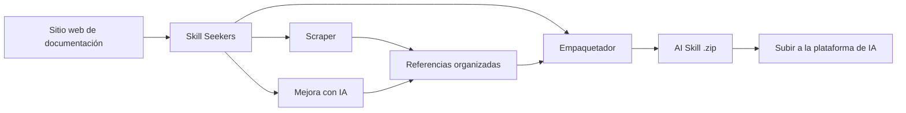

<p align="center">
  
</p>

# Skill Seekers

[English](README.md) | [简体中文](README.zh-CN.md) | [日本語](README.ja.md) | [한국어](README.ko.md) | Español | [Français](README.fr.md) | [Deutsch](README.de.md) | [Português](README.pt-BR.md) | [Türkçe](README.tr.md) | [العربية](README.ar.md) | [हिन्दी](README.hi.md) | [Русский](README.ru.md)

> ⚠️ **Aviso de traducción automática**
>
> Este documento ha sido traducido automáticamente por IA. Aunque nos esforzamos por garantizar la calidad, pueden existir expresiones inexactas.
>
> ¡Ayúdanos a mejorar la traducción a través de [GitHub Issue #260](https://github.com/yusufkaraaslan/Skill_Seekers/issues/260)! Tu retroalimentación es muy valiosa para nosotros.

[](https://github.com/yusufkaraaslan/Skill_Seekers/releases)
[](https://opensource.org/licenses/MIT)
[](https://www.python.org/downloads/)
[](https://modelcontextprotocol.io)
[](tests/)
[](https://github.com/users/yusufkaraaslan/projects/2)
[](https://pypi.org/project/skill-seekers/)
[](https://pypi.org/project/skill-seekers/)
[](https://pypi.org/project/skill-seekers/)
[](https://pepy.tech/projects/skill-seekers)
<a href="https://trendshift.io/repositories/18329" target="_blank"></a>
[](https://skillseekersweb.com/)
[](https://x.com/_yUSyUS_)
[](https://github.com/yusufkaraaslan/Skill_Seekers)

**🧠 La capa de datos para sistemas de IA.** Skill Seekers convierte sitios de documentación, repositorios de GitHub, PDFs, videos, notebooks, wikis y más de 10 tipos de fuentes adicionales en activos de conocimiento estructurado, listos para potenciar AI Skills (Claude, Gemini, OpenAI), pipelines RAG (LangChain, LlamaIndex, Pinecone) y asistentes de programación con IA (Cursor, Windsurf, Cline) en minutos, no en horas.

> 🌐 **[Visita SkillSeekersWeb.com](https://skillseekersweb.com/)** - ¡Explora más de 24 configuraciones predefinidas, comparte tus configuraciones y accede a la documentación completa!

> 📋 **[Ver hoja de ruta y tareas de desarrollo](https://github.com/users/yusufkaraaslan/projects/2)** - ¡134 tareas en 10 categorías, elige cualquiera para contribuir!

## 🌐 Ecosistema

Skill Seekers es un proyecto multi-repositorio. Aquí es donde vive todo:

| Repositorio | Descripción | Enlaces |
|------------|-------------|---------|
| **[Skill_Seekers](https://github.com/yusufkaraaslan/Skill_Seekers)** | CLI principal y servidor MCP (este repo) | [PyPI](https://pypi.org/project/skill-seekers/) |
| **[skillseekersweb](https://github.com/yusufkaraaslan/skillseekersweb)** | Sitio web y documentación | [Web](https://skillseekersweb.com/) |
| **[skill-seekers-configs](https://github.com/yusufkaraaslan/skill-seekers-configs)** | Repositorio de configuraciones comunitarias | |
| **[skill-seekers-action](https://github.com/yusufkaraaslan/skill-seekers-action)** | GitHub Action para CI/CD | |
| **[skill-seekers-plugin](https://github.com/yusufkaraaslan/skill-seekers-plugin)** | Plugin para Claude Code | |
| **[homebrew-skill-seekers](https://github.com/yusufkaraaslan/homebrew-skill-seekers)** | Homebrew tap para macOS | |

> **¿Quieres contribuir?** ¡Los repos del sitio web y configuraciones son excelentes puntos de partida para nuevos colaboradores!

## 🧠 La capa de datos para sistemas de IA

**Skill Seekers es la capa universal de preprocesamiento** que se ubica entre la documentación sin procesar y cada sistema de IA que la consume. Ya sea que estés construyendo Claude Skills, un pipeline RAG con LangChain o un archivo `.cursorrules` para Cursor, la preparación de datos es idéntica. Lo haces una vez y exportas a todos los destinos.

```bash
# Un comando → activo de conocimiento estructurado
skill-seekers create https://docs.react.dev/
# o: skill-seekers create facebook/react
# o: skill-seekers create ./my-project

# Exportar a cualquier sistema de IA
skill-seekers package output/react --target claude      # → Claude AI Skill (ZIP)
skill-seekers package output/react --target langchain   # → LangChain Documents
skill-seekers package output/react --target llama-index # → LlamaIndex TextNodes
skill-seekers package output/react --target cursor      # → .cursorrules
skill-seekers package output/react --target ibm-bob     # → Directorio de skill IBM Bob
```

### Lo que se genera

| Salida | Destino | Para qué sirve |
|--------|---------|-----------------|
| **Claude Skill** (ZIP + YAML) | `--target claude` | Claude Code, Claude API |
| **Gemini Skill** (tar.gz) | `--target gemini` | Google Gemini |
| **OpenAI / Custom GPT** (ZIP) | `--target openai` | GPT-4o, asistentes personalizados |
| **LangChain Documents** | `--target langchain` | Cadenas QA, agentes, recuperadores |
| **LlamaIndex TextNodes** | `--target llama-index` | Motores de consulta, motores de chat |
| **Haystack Documents** | `--target haystack` | Pipelines RAG empresariales |
| **Pinecone-ready** (Markdown) | `--target markdown` | Carga de vectores |
| **ChromaDB / FAISS / Qdrant** | `--target chroma/faiss/qdrant` | Bases de datos vectoriales locales |
| **IBM Bob Skill** (directorio) | `--target ibm-bob` | Skills de proyecto/globales de IBM Bob |
| **Cursor** `.cursorrules` | `--target markdown` → copiar SKILL.md | `.cursorrules` del IDE Cursor |
| **Windsurf / Cline / Continue** | `--target claude` → copiar | VS Code, IntelliJ, Vim |

### Por qué es importante

- ⚡ **99% más rápido** — Días de preparación manual → 15–45 minutos
- 🎯 **Calidad de AI Skill** — Archivos SKILL.md de más de 500 líneas con ejemplos, patrones y guías
- 📊 **Fragmentos listos para RAG** — Fragmentación inteligente que preserva bloques de código y mantiene el contexto
- 🎬 **Videos** — Extrae código, transcripciones y conocimiento estructurado de YouTube y videos locales
- 🔄 **Multi-fuente** — Combina 18 tipos de fuentes (docs, GitHub, PDFs, videos, notebooks, wikis y más) en un solo activo de conocimiento
- 🌐 **Una preparación, todos los destinos** — Exporta el mismo activo a 21 plataformas sin volver a extraer
- ✅ **Probado en producción** — Más de 3.700 tests, más de 24 presets de frameworks, listo para producción

## 🚀 Inicio rápido (3 comandos)

```bash
# 1. Instalar
pip install skill-seekers

# 2. Crear skill desde cualquier fuente
skill-seekers create https://docs.django.com/

# 3. Empaquetar para tu plataforma de IA
skill-seekers package output/django --target claude
```

**¡Eso es todo!** Ahora tienes `output/django-claude.zip` listo para usar.

```bash
# Usar un agente de IA diferente para la mejora (predeterminado: claude)
skill-seekers create https://docs.django.com/ --agent kimi
skill-seekers create https://docs.django.com/ --agent codex
skill-seekers create https://docs.django.com/ --agent-cmd "my-custom-agent run"
```

### 🛰️ Escaneo de proyecto con IA (nuevo)

Apunta `scan` a cualquier proyecto y un agente de IA lee sus manifiestos, README,
Dockerfile/CI e imports muestreados del código fuente — luego genera una configuración
por framework detectado más un `<project>-codebase.json` para tu propio código. Fija la
versión detectada, de modo que volver a ejecutarlo reporta los cambios de versión:

```bash
skill-seekers scan ./my-react-app --out ./configs/scanned/
# → react.json, vite.json, tailwind.json, jest.json, my-react-app-codebase.json

# Luego construye cualquiera de ellas
skill-seekers create ./configs/scanned/react.json
```

Si una detección no tiene un preset existente, la IA genera una configuración nueva;
al salir puedes publicarla opcionalmente en el [registro comunitario](https://github.com/yusufkaraaslan/skill-seekers-configs).

### Otras fuentes (18 soportadas)

```bash
# Repositorio de GitHub
skill-seekers create facebook/react

# Proyecto local
skill-seekers create ./my-project

# Documento PDF
skill-seekers create manual.pdf

# Documento Word
skill-seekers create report.docx

# Libro electrónico EPUB
skill-seekers create book.epub

# Jupyter Notebook
skill-seekers create notebook.ipynb

# Especificación OpenAPI
skill-seekers create openapi.yaml

# Presentación PowerPoint
skill-seekers create presentation.pptx

# Documento AsciiDoc
skill-seekers create guide.adoc

# Archivo HTML local (auto-detectado por la extensión)
skill-seekers create page.html

# Directorio completo de archivos HTML (auto-detectado para directorios predominantemente HTML)
skill-seekers create ./mirror_output/site/

# Forzar modo HTML en un directorio mixto/con mucho código
skill-seekers create ./repo/ --html-path ./repo/docs/build/html/

# Feed RSS/Atom
skill-seekers create feed.rss

# Página de manual
skill-seekers create curl.1

# Video (YouTube, Vimeo o archivo local — requiere skill-seekers[video])
skill-seekers create --video-url https://www.youtube.com/watch?v=... --name mytutorial
# ¿Primera vez? Instala automáticamente las dependencias visuales con detección de GPU:
skill-seekers create --setup

# Wiki de Confluence
skill-seekers create --space-key TEAM --name wiki

# Páginas de Notion
skill-seekers create --database-id ... --name docs

# Exportación de chat de Slack/Discord
skill-seekers create --chat-export-path ./slack-export --name team-chat
```

### Exportar a todas partes

```bash
# Empaquetar para múltiples plataformas
for platform in claude gemini openai langchain; do
  skill-seekers package output/django --target $platform
done
```

## ¿Qué es Skill Seekers?

Skill Seekers es la **capa de datos para sistemas de IA**. Transforma 18 tipos de fuentes —sitios web de documentación, repositorios de GitHub, PDFs, videos, Jupyter Notebooks, documentos Word/EPUB/AsciiDoc, especificaciones OpenAPI, presentaciones PowerPoint, feeds RSS, páginas de manual, wikis de Confluence, páginas de Notion, exportaciones de Slack/Discord y más— en activos de conocimiento estructurado para cualquier destino de IA:

| Caso de uso | Lo que obtienes | Ejemplos |
|-------------|-----------------|----------|
| **AI Skills** | SKILL.md completo + referencias | Claude Code, Gemini, GPT |
| **Pipelines RAG** | Documentos fragmentados con metadatos enriquecidos | LangChain, LlamaIndex, Haystack |
| **Bases de datos vectoriales** | Datos pre-formateados listos para carga | Pinecone, Chroma, Weaviate, FAISS |
| **Asistentes de programación con IA** | Archivos de contexto que tu IDE IA lee automáticamente | Cursor, Windsurf, Cline, Continue.dev |

## 📚 Documentación

| Quiero... | Lee esto |
|-----------|----------|
| **Empezar rápidamente** | [Inicio rápido](docs/getting-started/02-quick-start.md) - 3 comandos hasta tu primer skill |
| **Entender los conceptos** | [Conceptos fundamentales](docs/user-guide/01-core-concepts.md) - Cómo funciona |
| **Extraer fuentes** | [Guía de extracción](docs/user-guide/02-scraping.md) - Todos los tipos de fuentes |
| **Mejorar skills** | [Guía de mejora](docs/user-guide/03-enhancement.md) - Mejora con IA |
| **Exportar skills** | [Guía de empaquetado](docs/user-guide/04-packaging.md) - Exportación a plataformas |
| **Consultar comandos** | [Referencia CLI](docs/reference/CLI_REFERENCE.md) - Los 20 comandos |
| **Configurar** | [Formato de configuración](docs/reference/CONFIG_FORMAT.md) - Especificación JSON |
| **Resolver problemas** | [Solución de problemas](docs/user-guide/06-troubleshooting.md) - Problemas comunes |

**Documentación completa:** [docs/README.md](docs/README.md)

En lugar de pasar días en preprocesamiento manual, Skill Seekers:

1. **Ingesta** — documentación, repositorios de GitHub, bases de código locales, PDFs, videos, notebooks, wikis y más de 10 tipos de fuentes adicionales
2. **Analiza** — análisis profundo AST, detección de patrones, extracción de APIs
3. **Estructura** — archivos de referencia categorizados con metadatos
4. **Mejora** — generación de SKILL.md potenciada por IA (Claude, Gemini o local)
5. **Exporta** — 16 formatos específicos por plataforma desde un solo activo

## ¿Por qué usar Skill Seekers?

### Para constructores de AI Skills (Claude, Gemini, OpenAI)

- 🎯 **Skills de nivel producción** — Archivos SKILL.md de más de 500 líneas con ejemplos de código, patrones y guías
- 🔄 **Flujos de mejora** — Aplica presets como `security-focus`, `architecture-comprehensive` o YAML personalizados
- 🎮 **Cualquier dominio** — Motores de juegos (Godot, Unity), frameworks (React, Django), herramientas internas
- 🔧 **Equipos** — Combina documentación interna + código en una única fuente de verdad
- 📚 **Calidad** — Mejorado con IA, incluye ejemplos, referencia rápida y guía de navegación

### Para constructores de RAG e ingenieros de IA

- 🤖 **Datos listos para RAG** — `Documents` de LangChain, `TextNodes` de LlamaIndex y `Documents` de Haystack pre-fragmentados
- 🚀 **99% más rápido** — Días de preprocesamiento → 15–45 minutos
- 📊 **Metadatos inteligentes** — Categorías, fuentes, tipos → mayor precisión en la recuperación
- 🔄 **Multi-fuente** — Combina docs + GitHub + PDFs + videos en un solo pipeline
- 🌐 **Agnóstico de plataforma** — Exporta a cualquier base de datos vectorial o framework sin volver a extraer

### Para usuarios de asistentes de programación con IA

- 💻 **Cursor / Windsurf / Cline** — Genera `.cursorrules` / `.windsurfrules` / `.clinerules` automáticamente
- 🎯 **Contexto persistente** — La IA "conoce" tus frameworks sin necesidad de repetir prompts
- 📚 **Siempre actualizado** — Actualiza el contexto en minutos cuando cambia la documentación

## Funcionalidades clave

### 🌐 Extracción de documentación
- ✅ **Descubrimiento SPA inteligente** - Descubrimiento en tres capas para sitios SPA con JavaScript (sitemap.xml → llms.txt → renderizado con navegador headless)
- ✅ **Soporte para llms.txt** - Detecta y usa automáticamente archivos de documentación optimizados para LLM (10 veces más rápido)
- ✅ **Scraper universal** - Funciona con CUALQUIER sitio web de documentación
- ✅ **Categorización inteligente** - Organiza automáticamente el contenido por tema
- ✅ **Detección de lenguajes de código** - Reconoce Python, JavaScript, C++, GDScript, etc.
- ✅ **Más de 24 presets listos para usar** - Godot, React, Vue, Django, FastAPI y más

### 📄 Soporte para PDF
- ✅ **Extracción básica de PDF** - Extrae texto, código e imágenes de archivos PDF
- ✅ **OCR para PDFs escaneados** - Extrae texto de documentos escaneados
- ✅ **PDFs protegidos con contraseña** - Maneja PDFs cifrados
- ✅ **Extracción de tablas** - Extrae tablas complejas de PDFs
- ✅ **Procesamiento en paralelo** - 3 veces más rápido para PDFs grandes
- ✅ **Caché inteligente** - 50% más rápido en ejecuciones posteriores

### 🎬 Extracción de video
- ✅ **YouTube y videos locales** - Extrae transcripciones, código en pantalla y conocimiento estructurado de videos
- ✅ **Análisis visual de fotogramas** - Extracción OCR de editores de código, terminales, diapositivas y diagramas
- ✅ **Detección automática de GPU** - Instala automáticamente la compilación correcta de PyTorch (CUDA/ROCm/MPS/CPU)
- ✅ **Mejora con IA** - Dos pasadas: limpieza de artefactos OCR + generación de SKILL.md pulido
- ✅ **Recorte temporal** - Extrae secciones específicas con `--start-time` y `--end-time`
- ✅ **Soporte para listas de reproducción** - Procesa por lotes todos los videos de una lista de reproducción de YouTube
- ✅ **Respaldo con Vision API** - Usa Claude Vision para fotogramas OCR de baja confianza

### 🐙 Análisis de repositorios de GitHub
- ✅ **Análisis profundo de código** - Análisis AST para Python, JavaScript, TypeScript, Java, C++, Go
- ✅ **Extracción de APIs** - Funciones, clases, métodos con parámetros y tipos
- ✅ **Metadatos del repositorio** - README, árbol de archivos, desglose de lenguajes, estrellas/forks
- ✅ **GitHub Issues y PRs** - Obtiene issues abiertos/cerrados con etiquetas e hitos
- ✅ **CHANGELOG y releases** - Extrae automáticamente el historial de versiones
- ✅ **Detección de conflictos** - Compara APIs documentadas vs. implementación real del código
- ✅ **Integración MCP** - Lenguaje natural: "Extrae el repositorio de GitHub facebook/react"

### 🔄 Extracción unificada multi-fuente
- ✅ **Combina múltiples fuentes** - Mezcla documentación + GitHub + PDF en un solo skill
- ✅ **Detección de conflictos** - Encuentra automáticamente discrepancias entre docs y código
- ✅ **Fusión inteligente** - Resolución de conflictos basada en reglas o potenciada por IA
- ✅ **Informes transparentes** - Comparación lado a lado con advertencias ⚠️
- ✅ **Análisis de brechas en documentación** - Identifica docs obsoletos y funcionalidades no documentadas
- ✅ **Fuente única de verdad** - Un solo skill que muestra tanto la intención (docs) como la realidad (código)
- ✅ **Compatible con versiones anteriores** - Las configuraciones de fuente única legacy siguen funcionando

### 🤖 Soporte para múltiples plataformas LLM
- ✅ **12 plataformas LLM** - Claude AI, Google Gemini, OpenAI ChatGPT, MiniMax AI, Markdown genérico, OpenCode, Kimi (Moonshot AI), DeepSeek AI, Qwen (Alibaba), OpenRouter, Together AI, Fireworks AI
- ✅ **Extracción universal** - La misma documentación funciona para todas las plataformas
- ✅ **Empaquetado específico por plataforma** - Formatos optimizados para cada LLM
- ✅ **Exportación con un solo comando** - El flag `--target` selecciona la plataforma
- ✅ **Dependencias opcionales** - Instala solo lo que necesitas
- ✅ **100% compatible con versiones anteriores** - Los flujos de trabajo existentes de Claude no cambian

| Plataforma | Formato | Carga | Mejora | API Key | Endpoint personalizado |
|------------|---------|-------|--------|---------|------------------------|
| **Claude AI** | ZIP + YAML | ✅ Automática | ✅ Sí | ANTHROPIC_API_KEY | ANTHROPIC_BASE_URL |
| **Google Gemini** | tar.gz | ✅ Automática | ✅ Sí | GOOGLE_API_KEY | - |
| **OpenAI ChatGPT** | ZIP + Vector Store | ✅ Automática | ✅ Sí | OPENAI_API_KEY | - |
| **MiniMax AI** | ZIP + Knowledge Files | ✅ Automática | ✅ Sí | MINIMAX_API_KEY | - |
| **Markdown genérico** | ZIP | ❌ Manual | ❌ No | - | - |

```bash
# Claude (predeterminado - ¡sin cambios necesarios!)
skill-seekers package output/react/
skill-seekers upload react.zip

# Google Gemini
pip install skill-seekers[gemini]
skill-seekers package output/react/ --target gemini
skill-seekers upload react-gemini.tar.gz --target gemini

# OpenAI ChatGPT
pip install skill-seekers[openai]
skill-seekers package output/react/ --target openai
skill-seekers upload react-openai.zip --target openai

# MiniMax AI
pip install skill-seekers[minimax]
skill-seekers package output/react/ --target minimax
skill-seekers upload react-minimax.zip --target minimax

# Markdown genérico (exportación universal)
skill-seekers package output/react/ --target markdown
# Usa los archivos markdown directamente en cualquier LLM
```

<details>
<summary>🔧 <strong>Usa tu propio proveedor de IA (endpoints compatibles con OpenAI + suscripciones, sin necesidad de créditos de Anthropic)</strong></summary>

El paso opcional de **mejora** con IA (usado por `create`, `scan` y `enhance`) **no** requiere una clave de Anthropic. Tienes tres formas de alimentarlo:

**1. Usa una suscripción que ya pagas — sin créditos de API (modo agente LOCAL)**

Skill Seekers puede delegar en una CLI de agente de programación en la que ya tienes sesión iniciada, de modo que la mejora se ejecuta con tu plan existente en lugar de tokens de API medidos:

```bash
skill-seekers create <source> --agent codex     # CLI de OpenAI Codex → tu ChatGPT Plus
skill-seekers create <source> --agent claude    # Claude Code         → tu Claude Pro/Max
```

Agentes soportados: `claude`, `codex`, `copilot`, `opencode`, `kimi` y `custom`
(combina `--agent custom` con `--agent-cmd "<your-cli> ..."` para usar cualquier otra herramienta).

**2. Cualquier proveedor compatible con OpenAI (OpenRouter, Groq, Cerebras, Mistral, NVIDIA NIM, …)**

Todos ellos exponen un endpoint `/v1` compatible con OpenAI. Apunta Skill Seekers a uno de ellos con tres variables de entorno — detecta `OPENAI_API_KEY`, y el SDK de OpenAI respeta `OPENAI_BASE_URL` automáticamente:

```bash
export OPENAI_API_KEY="<your provider key>"
export OPENAI_BASE_URL="https://openrouter.ai/api/v1"   # endpoint del proveedor (ver tabla)
export OPENAI_MODEL="<a model that provider offers>"     # requerido — el predeterminado gpt-4o no existirá en otros proveedores
skill-seekers create <source>
```

| Proveedor    | `OPENAI_BASE_URL`                          |
|--------------|--------------------------------------------|
| OpenRouter   | `https://openrouter.ai/api/v1`             |
| Groq         | `https://api.groq.com/openai/v1`           |
| Cerebras     | `https://api.cerebras.ai/v1`               |
| Mistral      | `https://api.mistral.ai/v1`                |
| NVIDIA NIM   | `https://integrate.api.nvidia.com/v1`      |

> La detección de proveedor elige la **primera** variable de entorno de API key que encuentra (`ANTHROPIC_API_KEY` → `GOOGLE_API_KEY` → `OPENAI_API_KEY` → `MOONSHOT_API_KEY`). Configura `SKILL_SEEKER_PROVIDER` para forzar un proveedor específico, o asegúrate de que las claves de mayor prioridad no estén definidas.

**3. Endpoints compatibles con Claude (ej. GLM, proxies)**

```bash
export ANTHROPIC_API_KEY="your-key"
export ANTHROPIC_BASE_URL="https://your-claude-compatible-endpoint/v1"
```

Google Gemini (`GOOGLE_API_KEY`) y Kimi/Moonshot (`MOONSHOT_API_KEY`) también están soportados de forma nativa. Consulta la **[Referencia de variables de entorno](docs/reference/ENVIRONMENT_VARIABLES.md#llm-provider-selection)** para la lista completa, incluidas las sobrescrituras de modelo por proveedor.

</details>

**Instalación:**
```bash
# Instalar con soporte para Gemini
pip install skill-seekers[gemini]

# Instalar con soporte para OpenAI
pip install skill-seekers[openai]

# Instalar con soporte para MiniMax
pip install skill-seekers[minimax]

# Instalar con todas las plataformas LLM
pip install skill-seekers[all-llms]
```

### 🔗 Integraciones con frameworks RAG

- ✅ **LangChain Documents** - Exportación directa al formato `Document` con `page_content` + metadatos
  - Ideal para: cadenas QA, recuperadores, almacenes de vectores, agentes
  - Ejemplo: [Pipeline RAG con LangChain](examples/langchain-rag-pipeline/)
  - Guía: [Integración con LangChain](docs/integrations/LANGCHAIN.md)

- ✅ **LlamaIndex TextNodes** - Exportación al formato `TextNode` con IDs únicos + embeddings
  - Ideal para: motores de consulta, motores de chat, contexto de almacenamiento
  - Ejemplo: [Motor de consulta LlamaIndex](examples/llama-index-query-engine/)
  - Guía: [Integración con LlamaIndex](docs/integrations/LLAMA_INDEX.md)

- ✅ **Formato listo para Pinecone** - Optimizado para carga en bases de datos vectoriales
  - Ideal para: búsqueda vectorial en producción, búsqueda semántica, búsqueda híbrida
  - Ejemplo: [Carga en Pinecone](examples/pinecone-upsert/)
  - Guía: [Integración con Pinecone](docs/integrations/PINECONE.md)

**Exportación rápida:**
```bash
# LangChain Documents (JSON)
skill-seekers package output/django --target langchain
# → output/django-langchain.json

# LlamaIndex TextNodes (JSON)
skill-seekers package output/django --target llama-index
# → output/django-llama-index.json

# Markdown (universal)
skill-seekers package output/django --target markdown
# → output/django-markdown/SKILL.md + references/
```

**Guía completa de pipelines RAG:** [Documentación de pipelines RAG](docs/integrations/RAG_PIPELINES.md)

---

### 🧠 Integraciones con asistentes de programación con IA

Transforma cualquier documentación de framework en contexto experto de programación para más de 4 asistentes de IA:

- ✅ **Cursor IDE** - Genera `.cursorrules` para sugerencias de código potenciadas por IA
  - Ideal para: generación de código específica por framework, patrones consistentes
  - Funciona con: Cursor IDE (fork de VS Code)
  - Guía: [Integración con Cursor](docs/integrations/CURSOR.md)
  - Ejemplo: [Skill de React para Cursor](examples/cursor-react-skill/)

- ✅ **Windsurf** - Personaliza el contexto del asistente IA de Windsurf con `.windsurfrules`
  - Ideal para: asistencia IA nativa del IDE, programación basada en flujos
  - Funciona con: Windsurf IDE de Codeium
  - Guía: [Integración con Windsurf](docs/integrations/WINDSURF.md)
  - Ejemplo: [Contexto FastAPI para Windsurf](examples/windsurf-fastapi-context/)

- ✅ **Cline (VS Code)** - Prompts de sistema + MCP para el agente de VS Code
  - Ideal para: generación de código agéntica en VS Code
  - Funciona con: extensión Cline para VS Code
  - Guía: [Integración con Cline](docs/integrations/CLINE.md)
  - Ejemplo: [Asistente Django para Cline](examples/cline-django-assistant/)

- ✅ **Continue.dev** - Servidores de contexto para IA independiente del IDE
  - Ideal para: entornos multi-IDE (VS Code, JetBrains, Vim), proveedores LLM personalizados
  - Funciona con: cualquier IDE con el plugin Continue.dev
  - Guía: [Integración con Continue](docs/integrations/CONTINUE_DEV.md)
  - Ejemplo: [Contexto universal de Continue](examples/continue-dev-universal/)

**Exportación rápida para herramientas de programación con IA:**
```bash
# Para cualquier asistente de programación con IA (Cursor, Windsurf, Cline, Continue.dev)
skill-seekers create --config configs/django.json
skill-seekers package output/django --target claude  # o --target markdown

# Copiar a tu proyecto (ejemplo para Cursor)
cp output/django-claude/SKILL.md my-project/.cursorrules

# O para Windsurf
cp output/django-claude/SKILL.md my-project/.windsurf/rules/django.md

# O para Cline
cp output/django-claude/SKILL.md my-project/.clinerules

# O para Continue.dev (servidor HTTP)
python examples/continue-dev-universal/context_server.py
# Configurar en ~/.continue/config.json
```

**Centro de integraciones:** [Todas las integraciones con sistemas de IA](docs/integrations/INTEGRATIONS.md)

---

### 🌊 Arquitectura de tres flujos para GitHub
- ✅ **Análisis de triple flujo** - Divide los repos de GitHub en flujos de Código, Documentación e Insights
- ✅ **Analizador de código unificado** - Funciona con URLs de GitHub Y rutas locales
- ✅ **C3.x como profundidad de análisis** - Elige entre 'basic' (1–2 min) o 'c3x' (20–60 min)
- ✅ **Generación mejorada del router** - Metadatos de GitHub, inicio rápido del README, problemas comunes
- ✅ **Integración de issues** - Problemas principales y soluciones desde GitHub Issues
- ✅ **Palabras clave de enrutamiento inteligente** - Etiquetas de GitHub con peso 2x para mejor detección de temas

**Los tres flujos explicados:**
- **Flujo 1: Código** - Análisis profundo C3.x (patrones, ejemplos, guías, configuraciones, arquitectura)
- **Flujo 2: Documentación** - Documentación del repositorio (README, CONTRIBUTING, docs/*.md)
- **Flujo 3: Insights** - Conocimiento de la comunidad (issues, etiquetas, estrellas, forks)

```python
from skill_seekers.cli.unified_codebase_analyzer import UnifiedCodebaseAnalyzer

# Analizar repositorio de GitHub con los tres flujos
analyzer = UnifiedCodebaseAnalyzer()
result = analyzer.analyze(
    source="https://github.com/facebook/react",
    depth="c3x",  # o "basic" para análisis rápido
    fetch_github_metadata=True
)

# Acceder al flujo de código (análisis C3.x)
print(f"Design patterns: {len(result.code_analysis['c3_1_patterns'])}")
print(f"Test examples: {result.code_analysis['c3_2_examples_count']}")

# Acceder al flujo de documentación (docs del repositorio)
print(f"README: {result.github_docs['readme'][:100]}")

# Acceder al flujo de insights (metadatos de GitHub)
print(f"Stars: {result.github_insights['metadata']['stars']}")
print(f"Common issues: {len(result.github_insights['common_problems'])}")
```

**Documentación completa**: [Resumen de implementación de tres flujos](docs/archive/historical/IMPLEMENTATION_SUMMARY_THREE_STREAM.md)

### 🔐 Gestión inteligente de límites de tasa y configuración
- ✅ **Sistema de configuración multi-token** - Gestiona múltiples cuentas de GitHub (personal, trabajo, OSS)
  - Almacenamiento seguro de configuración en `~/.config/skill-seekers/config.json` (permisos 600)
  - Estrategias de límite de tasa por perfil: `prompt`, `wait`, `switch`, `fail`
  - Timeout configurable por perfil (predeterminado: 30 min, evita esperas indefinidas)
  - Cadena inteligente de respaldo: argumento CLI → variable de entorno → archivo de configuración → prompt
  - Gestión de API keys para Claude, Gemini, OpenAI
- ✅ **Asistente de configuración interactivo** - Interfaz de terminal atractiva para fácil configuración
  - Integración con navegador para creación de tokens (abre automáticamente GitHub, etc.)
  - Validación de tokens y pruebas de conexión
  - Visualización de estado con códigos de color
- ✅ **Manejador inteligente de límites de tasa** - ¡No más esperas indefinidas!
  - Advertencia anticipada sobre límites de tasa (60/hora vs 5000/hora)
  - Detección en tiempo real desde las respuestas de la API de GitHub
  - Temporizadores de cuenta regresiva en vivo con progreso
  - Cambio automático de perfil cuando se alcanza el límite
  - Cuatro estrategias: prompt (preguntar), wait (cuenta regresiva), switch (cambiar a otro), fail (abortar)
- ✅ **Capacidad de reanudación** - Continúa trabajos interrumpidos
  - Auto-guardado de progreso en intervalos configurables (predeterminado: 60 seg)
  - Lista todos los trabajos reanudables con detalles de progreso
  - Limpieza automática de trabajos antiguos (predeterminado: 7 días)
- ✅ **Soporte CI/CD** - Modo no interactivo para automatización
  - Flag `--non-interactive` que falla rápidamente sin prompts
  - Flag `--profile` para seleccionar una cuenta de GitHub específica
  - Mensajes de error claros para logs de pipelines

**Configuración rápida:**
```bash
# Configuración única (5 minutos)
skill-seekers config --github

# Usar perfil específico para repos privados
skill-seekers create mycompany/private-repo --profile work

# Modo CI/CD (fallo rápido, sin prompts)
skill-seekers create owner/repo --non-interactive

# Reanudar trabajo interrumpido
skill-seekers resume --list
skill-seekers resume github_react_20260117_143022
```

**Estrategias de límite de tasa explicadas:**
- **prompt** (predeterminado) - Pregunta qué hacer cuando se alcanza el límite (esperar, cambiar, configurar token, cancelar)
- **wait** - Espera automáticamente con temporizador de cuenta regresiva (respeta el timeout)
- **switch** - Intenta automáticamente el siguiente perfil disponible (para configuraciones multi-cuenta)
- **fail** - Falla inmediatamente con error claro (perfecto para CI/CD)

### 🎯 Skill Bootstrap - Auto-alojamiento

Genera skill-seekers como un skill para usarlo dentro de tu agente de IA (Claude Code, Kimi, Codex, etc.):

```bash
# Generar el skill
./scripts/bootstrap_skill.sh

# Instalar en Claude Code
cp -r output/skill-seekers ~/.claude/skills/
```

**Lo que obtienes:**
- ✅ **Documentación completa del skill** - Todos los comandos CLI y patrones de uso
- ✅ **Referencia de comandos CLI** - Cada herramienta y sus opciones documentadas
- ✅ **Ejemplos de inicio rápido** - Flujos de trabajo comunes y mejores prácticas
- ✅ **Documentación de API auto-generada** - Análisis de código, patrones y ejemplos

### 🔐 Repositorios de configuración privados
- ✅ **Fuentes de configuración basadas en Git** - Obtén configuraciones desde repositorios git privados/de equipo
- ✅ **Gestión multi-fuente** - Registra repositorios ilimitados de GitHub, GitLab, Bitbucket
- ✅ **Colaboración en equipo** - Comparte configuraciones personalizadas entre equipos de 3–5 personas
- ✅ **Soporte empresarial** - Escala a más de 500 desarrolladores con resolución basada en prioridad
- ✅ **Autenticación segura** - Tokens como variables de entorno (GITHUB_TOKEN, GITLAB_TOKEN)
- ✅ **Caché inteligente** - Clona una vez, obtiene actualizaciones automáticamente
- ✅ **Modo offline** - Trabaja con configuraciones en caché cuando no hay conexión

### 🤖 Análisis de código (C3.x)

**C3.4: Extracción de patrones de configuración con mejora por IA**
- ✅ **9 formatos de configuración** - JSON, YAML, TOML, ENV, INI, Python, JavaScript, Dockerfile, Docker Compose
- ✅ **7 tipos de patrones** - Configuraciones de base de datos, API, logging, caché, correo, autenticación, servidor
- ✅ **Mejora con IA** - Análisis IA opcional en modo dual (API + LOCAL)
  - Explica qué hace cada configuración
  - Sugiere mejores prácticas y mejoras
  - **Análisis de seguridad** - Encuentra secretos codificados y credenciales expuestas
- ✅ **Auto-documentación** - Genera documentación JSON + Markdown de todas las configuraciones
- ✅ **Integración MCP** - Herramienta `extract_config_patterns` con soporte de mejora

**C3.3: Guías prácticas mejoradas con IA**
- ✅ **Mejora integral con IA** - Transforma guías básicas en tutoriales profesionales
- ✅ **5 mejoras automáticas** - Descripciones de pasos, solución de problemas, prerrequisitos, siguientes pasos, casos de uso
- ✅ **Soporte de modo dual** - Modo API (Claude API) o modo LOCAL (Claude Code CLI)
- ✅ **Sin costos con modo LOCAL** - Mejora GRATUITA usando tu plan Claude Code Max
- ✅ **Transformación de calidad** - Plantillas de 75 líneas → guías completas de más de 500 líneas

**Uso:**
```bash
# Análisis rápido (1–2 min, solo funciones básicas)
skill-seekers scan tests/ --quick

# Análisis completo con IA (20–60 min, todas las funciones)
skill-seekers scan tests/ --comprehensive

# Con mejora por IA
skill-seekers scan tests/ --enhance
```

**Documentación completa:** [docs/features/HOW_TO_GUIDES.md](docs/features/HOW_TO_GUIDES.md#ai-enhancement-new)

### 🔄 Presets de flujo de trabajo de mejora

Pipelines de mejora reutilizables definidos en YAML que controlan cómo la IA transforma tu documentación sin procesar en un skill pulido.

- ✅ **5 presets incluidos** — `default`, `minimal`, `security-focus`, `architecture-comprehensive`, `api-documentation`
- ✅ **Presets definidos por el usuario** — añade flujos personalizados a `~/.config/skill-seekers/workflows/`
- ✅ **Múltiples flujos de trabajo** — encadena dos o más flujos en un solo comando
- ✅ **CLI completamente gestionado** — lista, inspecciona, copia, añade, elimina y valida flujos de trabajo

```bash
# Aplicar un solo flujo de trabajo
skill-seekers create ./my-project --enhance-workflow security-focus

# Encadenar múltiples flujos de trabajo (se aplican en orden)
skill-seekers create ./my-project \
  --enhance-workflow security-focus \
  --enhance-workflow minimal

# Gestionar presets
skill-seekers workflows list                          # Listar todos (incluidos + usuario)
skill-seekers workflows show security-focus           # Mostrar contenido YAML
skill-seekers workflows copy security-focus           # Copiar al directorio de usuario para editar
skill-seekers workflows add ./my-workflow.yaml        # Instalar un preset personalizado
skill-seekers workflows remove my-workflow            # Eliminar un preset de usuario
skill-seekers workflows validate security-focus       # Validar estructura del preset

# Copiar varios a la vez
skill-seekers workflows copy security-focus minimal api-documentation

# Añadir varios archivos a la vez
skill-seekers workflows add ./wf-a.yaml ./wf-b.yaml

# Eliminar varios a la vez
skill-seekers workflows remove my-wf-a my-wf-b
```

**Formato de preset YAML:**
```yaml
name: security-focus
description: "Security-focused review: vulnerabilities, auth, data handling"
version: "1.0"
stages:
  - name: vulnerabilities
    type: custom
    prompt: "Review for OWASP top 10 and common security vulnerabilities..."
  - name: auth-review
    type: custom
    prompt: "Examine authentication and authorisation patterns..."
    uses_history: true
```

### ⚡ Rendimiento y escalabilidad
- ✅ **Modo asíncrono** - Extracción 2–3x más rápida con async/await (usa el flag `--async`)
- ✅ **Soporte para documentación grande** - Maneja documentos de 10K–40K+ páginas con división inteligente
- ✅ **Skills Router/Hub** - Enrutamiento inteligente hacia sub-skills especializados
- ✅ **Extracción en paralelo** - Procesa múltiples skills simultáneamente
- ✅ **Checkpoint/Reanudación** - Nunca pierdas progreso en extracciones largas
- ✅ **Sistema de caché** - Extrae una vez, reconstruye instantáneamente

### 🤖 Generación de skills agnóstica al agente
- ✅ **Soporte multi-agente** - Genera skills para Claude, Kimi, Codex, Copilot, OpenCode o cualquier agente personalizado mediante el flag `--agent`
- ✅ **Comandos de agente personalizados** - Usa `--agent-cmd` para especificar un comando CLI de agente personalizado para la mejora
- ✅ **Flags universales** - `--agent` y `--agent-cmd` disponibles en todos los comandos (create, scrape, github, pdf, etc.)

### 📦 Pipeline de Marketplace
- ✅ **Publicar en el marketplace** - Publica skills en repositorios del marketplace de plugins de Claude Code
- ✅ **Pipeline de extremo a extremo** - Desde la fuente de documentación hasta la entrada publicada en el marketplace

### ✅ Garantía de calidad
- ✅ **Completamente probado** - Más de 3.700 tests con cobertura completa

---

## 📦 Instalación

```bash
# Instalación básica (extracción de documentación, análisis de GitHub, PDF, empaquetado)
pip install skill-seekers

# Con soporte para todas las plataformas LLM
pip install skill-seekers[all-llms]

# Con servidor MCP
pip install skill-seekers[mcp]

# Todo incluido
pip install skill-seekers[all]
```

**¿Necesitas ayuda para elegir?** Ejecuta el asistente de configuración:
```bash
skill-seekers-setup
```

### Opciones de instalación

| Instalación | Funcionalidades |
|-------------|-----------------|
| `pip install skill-seekers` | Extracción, análisis de GitHub, PDF, todas las plataformas |
| `pip install skill-seekers[gemini]` | + Soporte para Google Gemini |
| `pip install skill-seekers[openai]` | + Soporte para OpenAI ChatGPT |
| `pip install skill-seekers[all-llms]` | + Todas las plataformas LLM |
| `pip install skill-seekers[mcp]` | + Servidor MCP para Claude Code, Cursor, etc. |
| `pip install skill-seekers[video]` | + Extracción de transcripciones y metadatos de YouTube/Vimeo |
| `pip install skill-seekers[video-full]` | + Transcripción Whisper y extracción visual de fotogramas |
| `pip install skill-seekers[jupyter]` | + Soporte para Jupyter Notebook |
| `pip install skill-seekers[pptx]` | + Soporte para PowerPoint |
| `pip install skill-seekers[confluence]` | + Soporte para wiki de Confluence |
| `pip install skill-seekers[notion]` | + Soporte para páginas de Notion |
| `pip install skill-seekers[rss]` | + Soporte para feeds RSS/Atom |
| `pip install skill-seekers[chat]` | + Soporte para exportación de chat de Slack/Discord |
| `pip install skill-seekers[asciidoc]` | + Soporte para documentos AsciiDoc |
| `pip install skill-seekers[all]` | Todo habilitado |

> **Dependencias visuales para video (detección de GPU):** Después de instalar `skill-seekers[video-full]`, ejecuta
> `skill-seekers create --setup` para detectar automáticamente tu GPU e instalar la variante correcta de PyTorch
> + easyocr. Esta es la forma recomendada de instalar las dependencias de extracción visual.

---

## 🚀 Flujo de trabajo de instalación con un solo comando

**La forma más rápida de ir desde la configuración hasta el skill subido - automatización completa:**

```bash
# Instalar skill de React desde las configuraciones oficiales (se sube automáticamente a Claude)
skill-seekers install --config react

# Instalar desde archivo de configuración local
skill-seekers install --config configs/custom.json

# Instalar sin subir (solo empaquetar)
skill-seekers install --config django --no-upload

# Previsualizar flujo de trabajo sin ejecutar
skill-seekers install --config react --dry-run
```

**Tiempo:** 20–45 minutos en total | **Calidad:** Listo para producción (9/10) | **Costo:** Gratis

**Fases ejecutadas:**
```
📥 FASE 1: Obtener configuración (si se proporciona nombre de configuración)
📖 FASE 2: Extraer documentación
✨ FASE 3: Mejora con IA (OBLIGATORIA - sin opción de omitir)
📦 FASE 4: Empaquetar skill
☁️  FASE 5: Subir a Claude (opcional, requiere API key)
```

**Requisitos:**
- Variable de entorno ANTHROPIC_API_KEY (para subida automática)
- Plan Claude Code Max (para mejora local con IA), o usa `--agent` para seleccionar un agente de IA diferente

---

## 📊 Matriz de funcionalidades

Skill Seekers soporta **12 plataformas LLM**, **8 destinos RAG/vectoriales**, **18 tipos de fuentes** y paridad total de funcionalidades en todos los destinos.

**Plataformas:** Claude AI, Google Gemini, OpenAI ChatGPT, MiniMax AI, Markdown genérico, OpenCode, Kimi (Moonshot AI), DeepSeek AI, Qwen (Alibaba), OpenRouter, Together AI, Fireworks AI
**Tipos de fuentes:** Sitios web de documentación, repos de GitHub, PDFs, Word (.docx), EPUB, Video, Bases de código locales, Jupyter Notebooks, HTML local, OpenAPI/Swagger, AsciiDoc, PowerPoint (.pptx), feeds RSS/Atom, páginas de manual, wikis de Confluence, páginas de Notion, exportaciones de chat de Slack/Discord

Consulta la [Matriz completa de funcionalidades](docs/reference/FEATURE_MATRIX.md) para información detallada de soporte por plataforma y funcionalidad.

### Comparación rápida de plataformas

| Funcionalidad | Claude | Gemini | OpenAI | MiniMax | Markdown |
|---------------|--------|--------|--------|---------|----------|
| Formato | ZIP + YAML | tar.gz | ZIP + Vector | ZIP + Knowledge | ZIP |
| Carga | ✅ API | ✅ API | ✅ API | ✅ API | ❌ Manual |
| Mejora | ✅ Sonnet 4 | ✅ 2.0 Flash | ✅ GPT-4o | ✅ M3 | ❌ Ninguna |
| Todos los modos de skill | ✅ | ✅ | ✅ | ✅ | ✅ |

---

## Ejemplos de uso

### Extracción de documentación

```bash
# Extraer sitio web de documentación
skill-seekers create --config configs/react.json

# Extracción rápida sin configuración
skill-seekers create https://react.dev --name react

# Con modo asíncrono (3x más rápido)
skill-seekers create --config configs/godot.json --async --workers 8

# Usar un agente de IA específico para la mejora
skill-seekers create --config configs/react.json --agent kimi
```

### Extracción de PDF

```bash
# Extracción básica de PDF
skill-seekers create --pdf docs/manual.pdf --name myskill

# Funciones avanzadas
skill-seekers create --pdf docs/manual.pdf --name myskill \
    --extract-tables \        # Extraer tablas
    --parallel \              # Procesamiento paralelo rápido
    --workers 8               # Usar 8 núcleos de CPU

# PDFs escaneados (requiere: pip install pytesseract Pillow)
skill-seekers create --pdf docs/scanned.pdf --name myskill --ocr
```

### Extracción de video

```bash
# Instalar soporte para video
pip install skill-seekers[video]        # Transcripciones + metadatos
pip install skill-seekers[video-full]   # + Whisper + extracción visual de fotogramas

# Detectar GPU automáticamente e instalar dependencias visuales (PyTorch + easyocr)
skill-seekers create --setup

# Extraer de video de YouTube
skill-seekers create --video-url https://www.youtube.com/watch?v=dQw4w9WgXcQ --name mytutorial

# Extraer de una lista de reproducción de YouTube
skill-seekers create --video-playlist https://www.youtube.com/playlist?list=... --name myplaylist

# Extraer de un archivo de video local
skill-seekers create --video-file recording.mp4 --name myrecording

# Extraer con análisis visual de fotogramas (requiere dependencias video-full)
skill-seekers create --video-url https://www.youtube.com/watch?v=... --name mytutorial --visual

# Con mejora por IA (limpia OCR + genera SKILL.md pulido)
skill-seekers create --video-url https://www.youtube.com/watch?v=... --visual --enhance-level 2

# Recortar una sección específica de un video (soporta segundos, MM:SS, HH:MM:SS)
skill-seekers create --video-url https://www.youtube.com/watch?v=... --start-time 1:30 --end-time 5:00

# Usar Vision API para fotogramas OCR de baja confianza (requiere ANTHROPIC_API_KEY)
skill-seekers create --video-url https://www.youtube.com/watch?v=... --visual --vision-ocr

# Reconstruir skill desde datos previamente extraídos (saltar descarga)
skill-seekers create --from-json output/mytutorial/video_data/extracted_data.json --name mytutorial
```

> **Guía completa:** Consulta [docs/VIDEO_GUIDE.md](docs/VIDEO_GUIDE.md) para la referencia CLI completa,
> detalles del pipeline visual, opciones de mejora con IA y solución de problemas.

### Análisis de repositorios de GitHub

```bash
# Extracción básica de repositorio
skill-seekers create facebook/react

# Con autenticación (límites de tasa más altos)
export GITHUB_TOKEN=ghp_your_token_here
skill-seekers create facebook/react

# Personalizar qué incluir
skill-seekers create django/django \
    --include-issues \        # Extraer GitHub Issues
    --max-issues 100 \        # Limitar cantidad de issues
    --include-changelog       # Extraer CHANGELOG.md
```

### Extracción unificada multi-fuente

**Combina documentación + GitHub + PDF en un solo skill unificado con detección de conflictos:**

```bash
# Usar configuraciones unificadas existentes
skill-seekers create --config configs/react_unified.json
skill-seekers create --config configs/django_unified.json

# O crear configuración unificada
cat > configs/myframework_unified.json << 'EOF'
{
  "name": "myframework",
  "merge_mode": "rule-based",
  "sources": [
    {
      "type": "documentation",
      "base_url": "https://docs.myframework.com/",
      "max_pages": 200
    },
    {
      "type": "github",
      "repo": "owner/myframework",
      "code_analysis_depth": "surface"
    }
  ]
}
EOF

skill-seekers create --config configs/myframework_unified.json
```

**La detección de conflictos encuentra automáticamente:**
- 🔴 **Falta en el código** (alto): Documentado pero no implementado
- 🟡 **Falta en la documentación** (medio): Implementado pero no documentado
- ⚠️ **Discrepancia de firma**: Parámetros/tipos diferentes
- ℹ️ **Discrepancia de descripción**: Explicaciones diferentes

**Guía completa:** Consulta [docs/features/UNIFIED_SCRAPING.md](docs/features/UNIFIED_SCRAPING.md) para documentación completa.

### Repositorios de configuración privados

**Comparte configuraciones personalizadas entre equipos usando repositorios git privados:**

```bash
# Opción 1: Usando herramientas MCP (recomendado)
# Registrar el repo privado de tu equipo
add_config_source(
    name="team",
    git_url="https://github.com/mycompany/skill-configs.git",
    token_env="GITHUB_TOKEN"
)

# Obtener configuración del repo del equipo
fetch_config(source="team", config_name="internal-api")
```

**Plataformas soportadas:**
- GitHub (`GITHUB_TOKEN`), GitLab (`GITLAB_TOKEN`), Gitea (`GITEA_TOKEN`), Bitbucket (`BITBUCKET_TOKEN`)

**Guía completa:** Consulta [docs/reference/GIT_CONFIG_SOURCES.md](docs/reference/GIT_CONFIG_SOURCES.md) para documentación completa.

## Cómo funciona



0. **Detectar llms.txt** - Primero verifica llms-full.txt, llms.txt, llms-small.txt (parte del descubrimiento SPA inteligente)
1. **Extraer**: Extrae todas las páginas de la documentación
2. **Categorizar**: Organiza el contenido en temas (API, guías, tutoriales, etc.)
3. **Mejorar**: La IA analiza los docs y crea un SKILL.md completo con ejemplos (soporta múltiples agentes mediante `--agent`)
4. **Empaquetar**: Agrupa todo en un archivo `.zip` listo para la plataforma

## Arquitectura

El sistema está organizado en **8 módulos principales** y **5 módulos de utilidades** (~200 clases en total):


| Módulo | Propósito | Clases clave |
|--------|-----------|--------------|
| **CLICore** | Despachador de comandos al estilo Git | `CLIDispatcher`, `SourceDetector`, `CreateCommand` |
| **Scrapers** | 18 extractores por tipo de fuente | `DocToSkillConverter`, `DocumentSkillBuilder` (capa de construcción compartida), `UnifiedScraper` |
| **Adaptors** | 20+ formatos de plataformas de salida | `SkillAdaptor` (ABC), `ClaudeAdaptor`, `LangChainAdaptor` |
| **Analysis** | Pipeline de análisis de código C3.x | `UnifiedCodebaseAnalyzer`, `PatternRecognizer`, 10 detectores GoF |
| **Enhancement** | Mejora de skills con IA mediante `AgentClient` | `AgentClient`, `AIEnhancer`, `UnifiedEnhancer`, `WorkflowEngine` |
| **Packaging** | Empaquetar, subir e instalar skills | `PackageSkill`, `InstallAgent` |
| **MCP** | Servidor FastMCP (40 herramientas) | `SkillSeekerMCPServer`, 10 módulos de herramientas |
| **Sync** | Detección de cambios en la documentación | `ChangeDetector`, `SyncMonitor`, `Notifier` |

Módulos de utilidades: **Parsers** (28 parsers CLI), **Storage** (S3/GCS/Azure), **Embedding** (vectores multi-proveedor), **Benchmark** (rendimiento), **Utilities** (16 helpers compartidos).

Diagramas UML completos: **[docs/UML_ARCHITECTURE.md](docs/UML_ARCHITECTURE.md)** | Proyecto StarUML: `docs/UML/skill_seekers.mdj` | Referencia API en HTML: `docs/UML/html/`

## 📋 Prerrequisitos

**Antes de empezar, asegúrate de tener:**

1. **Python 3.10 o superior** - [Descargar](https://www.python.org/downloads/) | Verificar: `python3 --version`
2. **Git** - [Descargar](https://git-scm.com/) | Verificar: `git --version`
3. **15–30 minutos** para la configuración inicial

**¿Primera vez?** → **[Empieza aquí: Guía de inicio rápido a prueba de fallos](BULLETPROOF_QUICKSTART.md)** 🎯

---

## 📤 Subir skills a Claude

Una vez empaquetado tu skill, necesitas subirlo a Claude:

### Opción 1: Subida automática (basada en API)

```bash
# Configurar tu API key (una sola vez)
export ANTHROPIC_API_KEY=sk-ant-...

# Empaquetar y subir automáticamente
skill-seekers package output/react/ --upload

# O subir un .zip existente
skill-seekers upload output/react.zip
```

### Opción 2: Subida manual (sin API Key)

```bash
# Empaquetar skill
skill-seekers package output/react/
# → Crea output/react.zip

# Luego subir manualmente:
# - Ve a https://claude.ai/skills
# - Haz clic en "Upload Skill"
# - Selecciona output/react.zip
```

### Opción 3: MCP (Claude Code)

```
En Claude Code, simplemente pide:
"Empaqueta y sube el skill de React"
```

---

## 🤖 Instalación en agentes de IA

Skill Seekers puede instalar automáticamente skills en 19 agentes de programación con IA.

```bash
# Instalar en un agente específico
skill-seekers install-agent output/react/ --agent cursor

# Instalar en IBM Bob (local al proyecto: .bob/skills/)
skill-seekers install-agent output/react/ --agent bob

# Instalar en todos los agentes a la vez
skill-seekers install-agent output/react/ --agent all

# Previsualizar sin instalar
skill-seekers install-agent output/react/ --agent cursor --dry-run
```

### Agentes soportados

| Agente | Ruta | Tipo |
|--------|------|------|
| **Claude Code** | `~/.claude/skills/` | Global |
| **Cursor** | `.cursor/skills/` | Proyecto |
| **VS Code / Copilot** | `.github/skills/` | Proyecto |
| **Amp** | `~/.amp/skills/` | Global |
| **Goose** | `~/.config/goose/skills/` | Global |
| **OpenCode** | `~/.opencode/skills/` | Global |
| **Windsurf** | `~/.windsurf/skills/` | Global |
| **Roo Code** | `.roo/skills/` | Proyecto |
| **Cline** | `.cline/skills/` | Proyecto |
| **Aider** | `~/.aider/skills/` | Global |
| **Bolt** | `.bolt/skills/` | Proyecto |
| **Kilo Code** | `.kilo/skills/` | Proyecto |
| **Continue** | `~/.continue/skills/` | Global |
| **Kimi Code** | `~/.kimi/skills/` | Global |
| **IBM Bob** | `.bob/skills/` | Proyecto |

---

## 🔌 Integración MCP (40 herramientas)

Skill Seekers incluye un servidor MCP para usar desde Claude Code, Cursor, Windsurf, VS Code + Cline o IntelliJ IDEA.

```bash
# Modo stdio (Claude Code, VS Code + Cline)
python -m skill_seekers.mcp.server_fastmcp

# Modo HTTP (Cursor, Windsurf, IntelliJ)
python -m skill_seekers.mcp.server_fastmcp --transport http --port 8765

# Auto-configurar todos los agentes a la vez
./setup_mcp.sh
```

**Las 40 herramientas disponibles:**
- **Core (9):** `list_configs`, `generate_config`, `validate_config`, `estimate_pages`, `scrape_docs`, `package_skill`, `upload_skill`, `enhance_skill`, `install_skill`
- **Extendidas (10):** `scrape_github`, `scrape_pdf`, `unified_scrape`, `merge_sources`, `detect_conflicts`, `add_config_source`, `fetch_config`, `list_config_sources`, `remove_config_source`, `split_config`
- **Bases de datos vectoriales (4):** `export_to_chroma`, `export_to_weaviate`, `export_to_faiss`, `export_to_qdrant`
- **Nube (3):** `cloud_upload`, `cloud_download`, `cloud_list`

**Guía completa:** [docs/guides/MCP_SETUP.md](docs/guides/MCP_SETUP.md)

---

## ⚙️ Configuración

### Presets disponibles (más de 24)

```bash
# Listar todos los presets
# skill-seekers list-configs  # No disponible en v3.7.0
```

| Categoría | Presets |
|-----------|---------|
| **Frameworks Web** | `react`, `vue`, `angular`, `svelte`, `nextjs` |
| **Python** | `django`, `flask`, `fastapi`, `sqlalchemy`, `pytest` |
| **Desarrollo de juegos** | `godot`, `pygame`, `unity` |
| **Herramientas y DevOps** | `docker`, `kubernetes`, `terraform`, `ansible` |
| **Unificados (Docs + GitHub)** | `react-unified`, `vue-unified`, `nextjs-unified` y más |

### Crear tu propia configuración

```bash
# Opción 1: Interactivo
skill-seekers create --interactive

# Opción 2: Copiar y editar un preset
cp configs/react.json configs/myframework.json
nano configs/myframework.json
skill-seekers create --config configs/myframework.json
```

### Estructura del archivo de configuración

```json
{
  "name": "myframework",
  "description": "When to use this skill",
  "base_url": "https://docs.myframework.com/",
  "selectors": {
    "main_content": "article",
    "title": "h1",
    "code_blocks": "pre code"
  },
  "url_patterns": {
    "include": ["/docs", "/guide"],
    "exclude": ["/blog", "/about"]
  },
  "categories": {
    "getting_started": ["intro", "quickstart"],
    "api": ["api", "reference"]
  },
  "rate_limit": 0.5,
  "max_pages": 500
}
```

### Dónde almacenar las configuraciones

La herramienta busca en este orden:
1. Ruta exacta proporcionada
2. `./configs/` (directorio actual)
3. `~/.config/skill-seekers/configs/` (directorio de configuración del usuario)
4. API de SkillSeekersWeb.com (configuraciones predefinidas)

---

## 📊 Lo que se crea

```
output/
├── godot_data/              # Datos sin procesar extraídos
│   ├── pages/              # Archivos JSON (uno por página)
│   └── summary.json        # Resumen general
│
└── godot/                   # El skill
    ├── SKILL.md            # Mejorado con ejemplos reales
    ├── references/         # Docs categorizados
    │   ├── index.md
    │   ├── getting_started.md
    │   ├── scripting.md
    │   └── ...
    ├── scripts/            # Vacío (añade los tuyos)
    └── assets/             # Vacío (añade los tuyos)
```

---

## 🐛 Solución de problemas

### ¿No se extrajo contenido?
- Verifica tu selector `main_content`
- Prueba con: `article`, `main`, `div[role="main"]`

### ¿Los datos existen pero no se usan?
```bash
# Forzar re-extracción
rm -rf output/myframework_data/
skill-seekers create --config configs/myframework.json
```

### ¿Categorías incorrectas?
Edita la sección `categories` de la configuración con mejores palabras clave.

### ¿Quieres actualizar la documentación?
```bash
# Eliminar datos antiguos y volver a extraer
rm -rf output/godot_data/
skill-seekers create --config configs/godot.json
```

### ¿La mejora no funciona?
```bash
# Verificar si la API key está configurada
echo $ANTHROPIC_API_KEY

# Probar modo LOCAL (usa Claude Code Max, no requiere API key)
skill-seekers enhance output/react/ --mode LOCAL

# Monitorear el estado de mejora en segundo plano
skill-seekers enhance-status output/react/ --watch
```

### ¿Problemas con límite de tasa de GitHub?
```bash
# Configurar un token de GitHub (5000 req/hora vs 60/hora anónimo)
export GITHUB_TOKEN=ghp_your_token_here

# O configurar múltiples perfiles
skill-seekers config --github
```

---

## 📈 Rendimiento

| Tarea | Tiempo | Notas |
|-------|--------|-------|
| Extracción (síncrona) | 15–45 min | Solo la primera vez, basado en hilos |
| Extracción (asíncrona) | 5–15 min | 2–3x más rápido con el flag `--async` |
| Construcción | 1–3 min | Reconstrucción rápida desde caché |
| Reconstrucción | <1 min | Con `--skip-scrape` |
| Mejora (LOCAL) | 30–60 seg | Usa Claude Code Max |
| Mejora (API) | 20–40 seg | Requiere API key |
| Video (transcripción) | 1–3 min | YouTube/local, solo transcripción |
| Video (visual) | 5–15 min | + Extracción de fotogramas OCR |
| Empaquetado | 5–10 seg | Creación del .zip final |

---

## 🆕 Novedades en v3.6.0

### Presets de flujo de trabajo
Controla la profundidad del análisis con `--preset`:

```bash
skill-seekers create https://docs.react.dev/ --preset quick      # Rápido, superficial
skill-seekers create https://docs.react.dev/ --preset standard   # Equilibrado (predeterminado)
skill-seekers create https://docs.react.dev/ --preset comprehensive # Profundo, exhaustivo
```

### Banderas de ciclo de vida
```bash
skill-seekers create https://docs.react.dev/ --dry-run    # Vista previa sin extracción
skill-seekers create https://docs.react.dev/ --fresh      # Ignorar caché, re-extracción completa
skill-seekers create https://docs.react.dev/ --resume     # Reanudar trabajo interrumpido
skill-seekers create https://docs.react.dev/ --skip-scrape # Reempaquetar salida existente
```

### Health Check y utilidades
```bash
skill-seekers doctor                    # Diagnosticar instalación y entorno
skill-seekers sync-config               # Detectar desviación de configuración
skill-seekers stream <source>           # Ingesta por streaming para documentación grande
skill-seekers update output/react/      # Actualización incremental
skill-seekers multilang <source>        # Generación de skills multilingüe
skill-seekers quality output/react/     # Informe de calidad (añade --threshold 7 para bloquear: salida distinta de cero por debajo de 7/10)
```

### Opciones de RAG Chunking (package)
```bash
skill-seekers package output/react/ --chunk-for-rag --chunk-tokens 512 --chunk-overlap-tokens 50
```

### Publicación en el marketplace
```bash
skill-seekers package output/react/ --marketplace --marketplace-category frontend
```

### Dependencias opcionales adicionales
| Extra | Instalación | Propósito |
|-------|-------------|-----------|
| `browser` | `pip install "skill-seekers[browser]"` | Playwright headless para sitios SPA |
| `embedding` | `pip install "skill-seekers[embedding]"` | Soporte de servidor de embeddings |
| `s3` / `gcs` / `azure` | `pip install "skill-seekers[s3]"` etc. | Subida a almacenamiento en la nube |
| `rag-upload` | `pip install "skill-seekers[rag-upload]"` | Dependencias combinadas de subida a bases de datos vectoriales |

---

## 📚 Documentación

### Primeros pasos
- **[BULLETPROOF_QUICKSTART.md](BULLETPROOF_QUICKSTART.md)** - 🎯 **¡EMPIEZA AQUÍ si eres nuevo!**
- **[QUICKSTART.md](docs/archive/legacy/QUICKSTART.md)** - Inicio rápido para usuarios experimentados
- **[TROUBLESHOOTING.md](TROUBLESHOOTING.md)** - Problemas comunes y soluciones
- **[docs/archive/legacy/QUICK_REFERENCE.md](docs/archive/legacy/QUICK_REFERENCE.md)** - Hoja de referencia rápida

### Arquitectura
- **[docs/UML_ARCHITECTURE.md](docs/UML_ARCHITECTURE.md)** - Vista general de la arquitectura UML con 14 diagramas
- **[docs/UML/exports/](docs/UML/exports/)** - Exportaciones de diagramas en PNG (vista general de paquetes + 13 diagramas de clases)
- **[docs/UML/html/](docs/UML/html/index.html/index.html)** - Referencia API completa en HTML (todas las clases, operaciones, atributos)
- **[docs/UML/skill_seekers.mdj](docs/UML/skill_seekers.mdj)** - Archivo de proyecto StarUML (abrir con [StarUML](https://staruml.io/))

### Guías
- **[docs/reference/LARGE_DOCUMENTATION.md](docs/reference/LARGE_DOCUMENTATION.md)** - Manejar documentos de 10K–40K+ páginas
- **[docs/features/ENHANCEMENT_MODES.md](docs/features/ENHANCEMENT_MODES.md)** - Guía de modos de mejora con IA
- **[docs/guides/MCP_SETUP.md](docs/guides/MCP_SETUP.md)** - Configuración de integración MCP
- **[docs/features/UNIFIED_SCRAPING.md](docs/features/UNIFIED_SCRAPING.md)** - Extracción multi-fuente
- **[docs/VIDEO_GUIDE.md](docs/VIDEO_GUIDE.md)** - Guía de extracción de video

### Guías de integración
- **[docs/integrations/LANGCHAIN.md](docs/integrations/LANGCHAIN.md)** - LangChain RAG
- **[docs/integrations/CURSOR.md](docs/integrations/CURSOR.md)** - Cursor IDE
- **[docs/integrations/WINDSURF.md](docs/integrations/WINDSURF.md)** - Windsurf IDE
- **[docs/integrations/CLINE.md](docs/integrations/CLINE.md)** - Cline (VS Code)
- **[docs/integrations/RAG_PIPELINES.md](docs/integrations/RAG_PIPELINES.md)** - Todos los pipelines RAG

---

## 📝 Licencia

Licencia MIT - consulta el archivo [LICENSE](LICENSE) para más detalles

---

¡Feliz construcción de skills! 🚀

---

## 🔒 Seguridad

[](https://mseep.ai/app/yusufkaraaslan-skill-seekers)

---

## 💛 Patrocinadores

<p align="center">
  <a href="https://www.atlascloud.ai/?utm_source=github&utm_medium=link&utm_campaign=skill_seekers">
    
  </a>
</p>

[Atlas Cloud](https://www.atlascloud.ai/?utm_source=github&utm_medium=link&utm_campaign=skill_seekers) — una plataforma de inferencia de IA full-modal compatible con OpenAI. Skill Seekers la soporta como destino de empaquetado/mejora mediante `--target atlas` con `ATLAS_API_KEY`.
