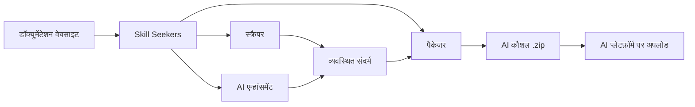

<p align="center">
  
</p>

# Skill Seekers

[English](README.md) | [简体中文](README.zh-CN.md) | [日本語](README.ja.md) | [한국어](README.ko.md) | [Español](README.es.md) | [Français](README.fr.md) | [Deutsch](README.de.md) | [Português](README.pt-BR.md) | [Türkçe](README.tr.md) | [العربية](README.ar.md) | हिन्दी | [Русский](README.ru.md)

> ⚠️ **मशीन अनुवाद सूचना**
>
> यह दस्तावेज़ AI द्वारा स्वचालित रूप से अनुवादित किया गया है। हम गुणवत्ता सुनिश्चित करने का प्रयास करते हैं, लेकिन अशुद्ध अभिव्यक्तियाँ हो सकती हैं।
>
> अनुवाद सुधारने में मदद करने के लिए [GitHub Issue #260](https://github.com/yusufkaraaslan/Skill_Seekers/issues/260) पर सम्पर्क करें! आपकी प्रतिक्रिया हमारे लिए बहुत मूल्यवान है।

[](https://github.com/yusufkaraaslan/Skill_Seekers/releases)
[](https://opensource.org/licenses/MIT)
[](https://www.python.org/downloads/)
[](https://modelcontextprotocol.io)
[](tests/)
[](https://github.com/users/yusufkaraaslan/projects/2)
[](https://pypi.org/project/skill-seekers/)
[](https://pypi.org/project/skill-seekers/)
[](https://pypi.org/project/skill-seekers/)
[](https://pepy.tech/projects/skill-seekers)
<a href="https://trendshift.io/repositories/18329" target="_blank"></a>
[](https://skillseekersweb.com/)
[](https://x.com/_yUSyUS_)
[](https://github.com/yusufkaraaslan/Skill_Seekers)

**🧠 AI सिस्टम के लिए डेटा लेयर।** Skill Seekers डॉक्यूमेंटेशन वेबसाइटों, GitHub रिपॉज़िटरी, PDF, वीडियो, Jupyter नोटबुक, विकी और 10+ अन्य स्रोत प्रकारों को संरचित ज्ञान संपत्ति में बदलता है—जो मिनटों में AI कौशल (Claude, Gemini, OpenAI), RAG पाइपलाइन (LangChain, LlamaIndex, Pinecone) और AI कोडिंग सहायकों (Cursor, Windsurf, Cline) को शक्ति प्रदान कर सकती हैं।

> 🌐 **[SkillSeekersWeb.com पर जाएँ](https://skillseekersweb.com/)** - 24+ प्रीसेट कॉन्फ़िगरेशन ब्राउज़ करें, अपने कॉन्फ़िग साझा करें और पूर्ण दस्तावेज़ देखें!

> 📋 **[विकास रोडमैप और कार्य देखें](https://github.com/users/yusufkaraaslan/projects/2)** - 10 श्रेणियों में 134 कार्य, किसी भी में योगदान करें!

## 🌐 इकोसिस्टम

Skill Seekers एक मल्टी-रिपॉजिटरी प्रोजेक्ट है। यहां सब कुछ मौजूद है:

| रिपॉजिटरी | विवरण | लिंक |
|-----------|--------|------|
| **[Skill_Seekers](https://github.com/yusufkaraaslan/Skill_Seekers)** | कोर CLI और MCP सर्वर (यह रिपो) | [PyPI](https://pypi.org/project/skill-seekers/) |
| **[skillseekersweb](https://github.com/yusufkaraaslan/skillseekersweb)** | वेबसाइट और डॉक्यूमेंटेशन | [साइट](https://skillseekersweb.com/) |
| **[skill-seekers-configs](https://github.com/yusufkaraaslan/skill-seekers-configs)** | सामुदायिक कॉन्फिग रिपॉजिटरी | |
| **[skill-seekers-action](https://github.com/yusufkaraaslan/skill-seekers-action)** | GitHub Action CI/CD | |
| **[skill-seekers-plugin](https://github.com/yusufkaraaslan/skill-seekers-plugin)** | Claude Code प्लगइन | |
| **[homebrew-skill-seekers](https://github.com/yusufkaraaslan/homebrew-skill-seekers)** | macOS के लिए Homebrew tap | |

> **योगदान करना चाहते हैं?** वेबसाइट और कॉन्फिग रिपॉजिटरी नए योगदानकर्ताओं के लिए बेहतरीन शुरुआती बिंदु हैं!

## 🧠 AI सिस्टम के लिए डेटा लेयर

**Skill Seekers एक सार्वभौमिक प्रीप्रोसेसिंग लेयर है** जो कच्चे दस्तावेज़ों और उनका उपयोग करने वाले सभी AI सिस्टम के बीच स्थित है। चाहे आप Claude कौशल, LangChain RAG पाइपलाइन, या Cursor `.cursorrules` फ़ाइल बना रहे हों—डेटा तैयारी पूरी तरह समान है। बस एक बार करें, और सभी लक्ष्यों पर निर्यात करें।

```bash
# एक कमांड → संरचित ज्ञान संपत्ति
skill-seekers create https://docs.react.dev/
# या: skill-seekers create facebook/react
# या: skill-seekers create ./my-project

# किसी भी AI सिस्टम पर निर्यात करें
skill-seekers package output/react --target claude      # → Claude AI कौशल (ZIP)
skill-seekers package output/react --target langchain   # → LangChain Documents
skill-seekers package output/react --target llama-index # → LlamaIndex TextNodes
skill-seekers package output/react --target cursor      # → .cursorrules
skill-seekers package output/react --target ibm-bob     # → IBM Bob कौशल डायरेक्टरी
```

### निर्मित आउटपुट

| आउटपुट | लक्ष्य | उपयोग |
|---------|--------|-------|
| **Claude कौशल** (ZIP + YAML) | `--target claude` | Claude Code, Claude API |
| **Gemini कौशल** (tar.gz) | `--target gemini` | Google Gemini |
| **OpenAI / Custom GPT** (ZIP) | `--target openai` | GPT-4o, कस्टम सहायक |
| **LangChain Documents** | `--target langchain` | QA चेन, एजेंट, रिट्रीवर |
| **LlamaIndex TextNodes** | `--target llama-index` | क्वेरी इंजन, चैट इंजन |
| **Haystack Documents** | `--target haystack` | एंटरप्राइज़ RAG पाइपलाइन |
| **Pinecone-तैयार** (Markdown) | `--target markdown` | वेक्टर अपसर्ट |
| **ChromaDB / FAISS / Qdrant** | `--target chroma/faiss/qdrant` | स्थानीय वेक्टर DB |
| **IBM Bob कौशल** (डायरेक्टरी) | `--target ibm-bob` | IBM Bob प्रोजेक्ट/वैश्विक कौशल |
| **Cursor** `.cursorrules` | `--target markdown` → SKILL.md कॉपी करें | Cursor IDE `.cursorrules` |
| **Windsurf / Cline / Continue** | `--target claude` → कॉपी | VS Code, IntelliJ, Vim |

### यह क्यों महत्वपूर्ण है

- ⚡ **99% तेज़** — दिनों की मैन्युअल डेटा तैयारी → 15–45 मिनट
- 🎯 **AI कौशल गुणवत्ता** — 500+ पंक्तियों की SKILL.md फ़ाइलें जिसमें उदाहरण, पैटर्न और मार्गदर्शिकाएँ हैं
- 📊 **RAG-तैयार चंक** — स्मार्ट चंकिंग जो कोड ब्लॉक को सुरक्षित रखती है और संदर्भ बनाए रखती है
- 🎬 **वीडियो** — YouTube और स्थानीय वीडियो से कोड, ट्रांसक्रिप्ट और संरचित ज्ञान निकालें
- 🔄 **बहु-स्रोत** — 18 स्रोत प्रकारों (डॉक्स, GitHub, PDF, वीडियो, नोटबुक, विकी आदि) को एक ज्ञान संपत्ति में मिलाएँ
- 🌐 **एक बार तैयारी, हर लक्ष्य** — बिना दोबारा स्क्रैप किए 21 प्लेटफ़ॉर्म पर निर्यात करें
- ✅ **युद्ध-परीक्षित** — 3,700+ परीक्षण, 24+ फ़्रेमवर्क प्रीसेट, प्रोडक्शन-तैयार

## 🚀 त्वरित शुरुआत (3 कमांड)

```bash
# 1. इंस्टॉल करें
pip install skill-seekers

# 2. किसी भी स्रोत से कौशल बनाएँ
skill-seekers create https://docs.django.com/

# 3. अपने AI प्लेटफ़ॉर्म के लिए पैकेज करें
skill-seekers package output/django --target claude
```

**बस इतना ही!** अब आपके पास `output/django-claude.zip` उपयोग के लिए तैयार है।

```bash
# एन्हांसमेंट के लिए एक अलग AI एजेंट का उपयोग करें (डिफ़ॉल्ट: claude)
skill-seekers create https://docs.django.com/ --agent kimi
skill-seekers create https://docs.django.com/ --agent codex
skill-seekers create https://docs.django.com/ --agent-cmd "my-custom-agent run"
```

### 🛰️ AI-संचालित प्रोजेक्ट स्कैन (नया)

`scan` को किसी भी प्रोजेक्ट पर चलाएँ — एक AI एजेंट उसके मैनिफ़ेस्ट, README,
Dockerfile/CI और सैंपल किए गए स्रोत इम्पोर्ट पढ़ता है — फिर प्रत्येक पहचाने गए
फ़्रेमवर्क के लिए एक कॉन्फ़िग और आपके अपने कोड के लिए एक `<project>-codebase.json`
जनरेट करता है। पहचाना गया संस्करण पिन किया जाता है ताकि दोबारा चलाने पर
संस्करण परिवर्तन रिपोर्ट हों:

```bash
skill-seekers scan ./my-react-app --out ./configs/scanned/
# → react.json, vite.json, tailwind.json, jest.json, my-react-app-codebase.json

# फिर इनमें से कोई भी बनाएँ
skill-seekers create ./configs/scanned/react.json
```

यदि किसी पहचान के लिए कोई मौजूदा प्रीसेट नहीं है, तो AI एक नया कॉन्फ़िग जनरेट
करता है; समाप्ति पर आप इसे वैकल्पिक रूप से [सामुदायिक रजिस्ट्री](https://github.com/yusufkaraaslan/skill-seekers-configs) में प्रकाशित कर सकते हैं।

### अन्य स्रोत (18 समर्थित)

```bash
# GitHub रिपॉज़िटरी
skill-seekers create facebook/react

# स्थानीय प्रोजेक्ट
skill-seekers create ./my-project

# PDF दस्तावेज़
skill-seekers create manual.pdf

# Word दस्तावेज़
skill-seekers create report.docx

# EPUB ई-बुक
skill-seekers create book.epub

# Jupyter Notebook
skill-seekers create notebook.ipynb

# OpenAPI spec
skill-seekers create openapi.yaml

# PowerPoint प्रस्तुति
skill-seekers create presentation.pptx

# AsciiDoc दस्तावेज़
skill-seekers create guide.adoc

# स्थानीय HTML फ़ाइल (एक्सटेंशन से स्वचालित पहचान)
skill-seekers create page.html

# HTML फ़ाइलों की पूरी डायरेक्टरी (HTML-प्रधान डायरेक्टरी के लिए स्वचालित पहचान)
skill-seekers create ./mirror_output/site/

# मिश्रित/कोड-प्रधान डायरेक्टरी पर HTML मोड बाध्य करें
skill-seekers create ./repo/ --html-path ./repo/docs/build/html/

# RSS/Atom फ़ीड
skill-seekers create feed.rss

# Man पेज
skill-seekers create curl.1

# वीडियो (YouTube, Vimeo, या स्थानीय फ़ाइल — skill-seekers[video] आवश्यक)
skill-seekers create --video-url https://www.youtube.com/watch?v=... --name mytutorial
# पहली बार? GPU-सक्षम विज़ुअल डिपेंडेंसी स्वचालित रूप से इंस्टॉल करें:
skill-seekers create --setup

# Confluence विकी
skill-seekers create --space-key TEAM --name wiki

# Notion पेज
skill-seekers create --database-id ... --name docs

# Slack/Discord चैट एक्सपोर्ट
skill-seekers create --chat-export-path ./slack-export --name team-chat
```

### हर जगह निर्यात करें

```bash
# एकाधिक प्लेटफ़ॉर्म के लिए पैकेज करें
for platform in claude gemini openai langchain; do
  skill-seekers package output/django --target $platform
done
```

## Skill Seekers क्या है?

Skill Seekers **AI सिस्टम के लिए डेटा लेयर** है। यह 18 स्रोत प्रकारों—डॉक्यूमेंटेशन वेबसाइट, GitHub रिपॉज़िटरी, PDF, वीडियो, Jupyter Notebook, Word/EPUB/AsciiDoc दस्तावेज़, OpenAPI/Swagger स्पेक, PowerPoint प्रस्तुतियाँ, RSS/Atom फ़ीड, Man पेज, Confluence विकी, Notion पेज, Slack/Discord एक्सपोर्ट आदि—को हर AI लक्ष्य के लिए संरचित ज्ञान संपत्ति में बदलता है:

| उपयोग | आप क्या प्राप्त करते हैं | उदाहरण |
|-------|------------------------|--------|
| **AI कौशल** | व्यापक SKILL.md + संदर्भ | Claude Code, Gemini, GPT |
| **RAG पाइपलाइन** | समृद्ध मेटाडेटा के साथ चंक किए गए दस्तावेज़ | LangChain, LlamaIndex, Haystack |
| **वेक्टर डेटाबेस** | अपसर्ट के लिए तैयार प्री-फ़ॉर्मेटेड डेटा | Pinecone, Chroma, Weaviate, FAISS |
| **AI कोडिंग सहायक** | संदर्भ फ़ाइलें जो आपका IDE AI स्वचालित रूप से पढ़ता है | Cursor, Windsurf, Cline, Continue.dev |

## 📚 दस्तावेज़ीकरण

| मैं चाहता/चाहती हूँ... | यह पढ़ें |
|------------------------|---------|
| **जल्दी शुरू करना** | [त्वरित शुरुआत](docs/getting-started/02-quick-start.md) - पहले कौशल तक 3 कमांड |
| **अवधारणाएँ समझना** | [मूल अवधारणाएँ](docs/user-guide/01-core-concepts.md) - यह कैसे काम करता है |
| **स्रोत स्क्रैप करना** | [स्क्रैपिंग गाइड](docs/user-guide/02-scraping.md) - सभी स्रोत प्रकार |
| **कौशल बढ़ाना** | [एन्हांसमेंट गाइड](docs/user-guide/03-enhancement.md) - AI एन्हांसमेंट |
| **कौशल निर्यात करना** | [पैकेजिंग गाइड](docs/user-guide/04-packaging.md) - प्लेटफ़ॉर्म निर्यात |
| **कमांड देखना** | [CLI संदर्भ](docs/reference/CLI_REFERENCE.md) - सभी 20 कमांड |
| **कॉन्फ़िगर करना** | [कॉन्फ़िग प्रारूप](docs/reference/CONFIG_FORMAT.md) - JSON विनिर्देश |
| **समस्या हल करना** | [समस्या निवारण](docs/user-guide/06-troubleshooting.md) - सामान्य समस्याएँ |

**पूर्ण दस्तावेज़ीकरण:** [docs/README.md](docs/README.md)

दिनों की मैन्युअल प्रीप्रोसेसिंग के बजाय, Skill Seekers:

1. **संग्रह करता है** — डॉक्स, GitHub रिपो, स्थानीय कोडबेस, PDF, वीडियो, नोटबुक, विकी और 10+ अन्य स्रोत प्रकार
2. **विश्लेषण करता है** — गहन AST पार्सिंग, पैटर्न पहचान, API निष्कर्षण
3. **संरचित करता है** — मेटाडेटा के साथ वर्गीकृत संदर्भ फ़ाइलें
4. **बढ़ाता है** — AI-संचालित SKILL.md निर्माण (Claude, Gemini, या स्थानीय)
5. **निर्यात करता है** — एक संपत्ति से 16 प्लेटफ़ॉर्म-विशिष्ट प्रारूप

## Skill Seekers का उपयोग क्यों करें?

### AI कौशल निर्माताओं के लिए (Claude, Gemini, OpenAI)

- 🎯 **प्रोडक्शन-ग्रेड कौशल** — 500+ पंक्तियों की SKILL.md फ़ाइलें जिनमें कोड उदाहरण, पैटर्न और मार्गदर्शिकाएँ हैं
- 🔄 **एन्हांसमेंट वर्कफ़्लो** — `security-focus`, `architecture-comprehensive`, या कस्टम YAML प्रीसेट लागू करें
- 🎮 **कोई भी डोमेन** — गेम इंजन (Godot, Unity), फ़्रेमवर्क (React, Django), आंतरिक उपकरण
- 🔧 **टीमें** — आंतरिक डॉक्स + कोड को एकल सत्य स्रोत में मिलाएँ
- 📚 **गुणवत्ता** — उदाहरण, त्वरित संदर्भ और नेविगेशन मार्गदर्शन के साथ AI-संवर्धित

### RAG निर्माताओं और AI इंजीनियरों के लिए

- 🤖 **RAG-तैयार डेटा** — प्री-चंक किए गए LangChain `Documents`, LlamaIndex `TextNodes`, Haystack `Documents`
- 🚀 **99% तेज़** — दिनों की प्रीप्रोसेसिंग → 15–45 मिनट
- 📊 **स्मार्ट मेटाडेटा** — श्रेणियाँ, स्रोत, प्रकार → बेहतर पुनर्प्राप्ति सटीकता
- 🔄 **बहु-स्रोत** — एक पाइपलाइन में डॉक्स + GitHub + PDF + वीडियो मिलाएँ
- 🌐 **प्लेटफ़ॉर्म-अज्ञेयवादी** — बिना दोबारा स्क्रैप किए किसी भी वेक्टर DB या फ़्रेमवर्क में निर्यात करें

### AI कोडिंग सहायक उपयोगकर्ताओं के लिए

- 💻 **Cursor / Windsurf / Cline** — स्वचालित रूप से `.cursorrules` / `.windsurfrules` / `.clinerules` जनरेट करें
- 🎯 **स्थायी संदर्भ** — AI आपके फ़्रेमवर्क को "जानता" है, बार-बार प्रॉम्प्ट देने की आवश्यकता नहीं
- 📚 **हमेशा अद्यतित** — डॉक्स बदलने पर मिनटों में संदर्भ अपडेट करें

## मुख्य विशेषताएँ

### 🌐 डॉक्यूमेंटेशन स्क्रैपिंग
- ✅ **स्मार्ट SPA खोज** - JavaScript SPA साइटों के लिए तीन-परत खोज (sitemap.xml → llms.txt → हेडलेस ब्राउज़र रेंडरिंग)
- ✅ **llms.txt समर्थन** - LLM-तैयार दस्तावेज़ फ़ाइलों को स्वचालित रूप से पहचानता और उपयोग करता है (10 गुना तेज़)
- ✅ **सार्वभौमिक स्क्रैपर** - किसी भी डॉक्यूमेंटेशन वेबसाइट के साथ काम करता है
- ✅ **स्मार्ट वर्गीकरण** - सामग्री को विषय के अनुसार स्वचालित रूप से व्यवस्थित करता है
- ✅ **कोड भाषा पहचान** - Python, JavaScript, C++, GDScript आदि को पहचानता है
- ✅ **24+ तैयार प्रीसेट** - Godot, React, Vue, Django, FastAPI और अधिक

### 📄 PDF समर्थन
- ✅ **बुनियादी PDF निष्कर्षण** - PDF फ़ाइलों से टेक्स्ट, कोड और छवियाँ निकालें
- ✅ **स्कैन किए गए PDF के लिए OCR** - स्कैन किए गए दस्तावेज़ों से टेक्स्ट निकालें
- ✅ **पासवर्ड-सुरक्षित PDF** - एन्क्रिप्टेड PDF को संभालें
- ✅ **तालिका निष्कर्षण** - PDF से जटिल तालिकाएँ निकालें
- ✅ **समानांतर प्रसंस्करण** - बड़ी PDF के लिए 3 गुना तेज़
- ✅ **बुद्धिमान कैशिंग** - दोबारा चलाने पर 50% तेज़

### 🎬 वीडियो निष्कर्षण
- ✅ **YouTube और स्थानीय वीडियो** - वीडियो से ट्रांसक्रिप्ट, ऑन-स्क्रीन कोड और संरचित ज्ञान निकालें
- ✅ **विज़ुअल फ़्रेम विश्लेषण** - कोड एडिटर, टर्मिनल, स्लाइड और आरेखों से OCR निष्कर्षण
- ✅ **GPU स्वचालित पहचान** - सही PyTorch बिल्ड स्वचालित रूप से इंस्टॉल करता है (CUDA/ROCm/MPS/CPU)
- ✅ **AI एन्हांसमेंट** - दो-चरण: OCR आर्टिफ़ैक्ट साफ़ करें + पॉलिश SKILL.md जनरेट करें
- ✅ **समय क्लिपिंग** - `--start-time` और `--end-time` के साथ विशिष्ट खंड निकालें
- ✅ **प्लेलिस्ट समर्थन** - YouTube प्लेलिस्ट में सभी वीडियो को बैच में प्रोसेस करें
- ✅ **Vision API फ़ॉलबैक** - कम-विश्वसनीय OCR फ़्रेम के लिए Claude Vision का उपयोग करें

### 🐙 GitHub रिपॉज़िटरी विश्लेषण
- ✅ **गहन कोड विश्लेषण** - Python, JavaScript, TypeScript, Java, C++, Go के लिए AST पार्सिंग
- ✅ **API निष्कर्षण** - फ़ंक्शन, क्लासेस, मेथड्स जिनमें पैरामीटर और टाइप शामिल हैं
- ✅ **रिपॉज़िटरी मेटाडेटा** - README, फ़ाइल ट्री, भाषा ब्रेकडाउन, स्टार्स/फ़ोर्क्स
- ✅ **GitHub Issues और PR** - लेबल और माइलस्टोन के साथ खुले/बंद issues प्राप्त करें
- ✅ **CHANGELOG और रिलीज़** - संस्करण इतिहास स्वचालित रूप से निकालें
- ✅ **विरोध पहचान** - दस्तावेज़ीकृत API बनाम वास्तविक कोड कार्यान्वयन की तुलना करें
- ✅ **MCP एकीकरण** - प्राकृतिक भाषा: "GitHub रिपो facebook/react स्क्रैप करें"

### 🔄 एकीकृत बहु-स्रोत स्क्रैपिंग
- ✅ **एकाधिक स्रोत मिलाएँ** - एक कौशल में डॉक्यूमेंटेशन + GitHub + PDF मिश्रित करें
- ✅ **विरोध पहचान** - डॉक्स और कोड के बीच विसंगतियों को स्वचालित रूप से खोजें
- ✅ **बुद्धिमान विलय** - नियम-आधारित या AI-संचालित विरोध समाधान
- ✅ **पारदर्शी रिपोर्टिंग** - ⚠️ चेतावनियों के साथ साथ-साथ तुलना
- ✅ **दस्तावेज़ अंतराल विश्लेषण** - पुराने डॉक्स और अनदस्तावेज़ीकृत सुविधाओं की पहचान
- ✅ **एकल सत्य स्रोत** - एक कौशल जो इरादा (डॉक्स) और वास्तविकता (कोड) दोनों दिखाता है
- ✅ **पश्चगामी संगत** - पुराने एकल-स्रोत कॉन्फ़िग अभी भी काम करते हैं

### 🤖 बहु-LLM प्लेटफ़ॉर्म समर्थन
- ✅ **12 LLM प्लेटफ़ॉर्म** - Claude AI, Google Gemini, OpenAI ChatGPT, MiniMax AI, जेनेरिक Markdown, OpenCode, Kimi (Moonshot AI), DeepSeek AI, Qwen (Alibaba), OpenRouter, Together AI, Fireworks AI
- ✅ **सार्वभौमिक स्क्रैपिंग** - समान दस्तावेज़ सभी प्लेटफ़ॉर्म के लिए काम करते हैं
- ✅ **प्लेटफ़ॉर्म-विशिष्ट पैकेजिंग** - प्रत्येक LLM के लिए अनुकूलित प्रारूप
- ✅ **एक-कमांड निर्यात** - `--target` फ़्लैग प्लेटफ़ॉर्म चुनता है
- ✅ **वैकल्पिक डिपेंडेंसी** - केवल वही इंस्टॉल करें जो आपको चाहिए
- ✅ **100% पश्चगामी संगत** - मौजूदा Claude वर्कफ़्लो अपरिवर्तित

| प्लेटफ़ॉर्म | प्रारूप | अपलोड | एन्हांसमेंट | API Key | कस्टम एंडपॉइंट |
|------------|---------|-------|-------------|---------|----------------|
| **Claude AI** | ZIP + YAML | ✅ स्वचालित | ✅ हाँ | ANTHROPIC_API_KEY | ANTHROPIC_BASE_URL |
| **Google Gemini** | tar.gz | ✅ स्वचालित | ✅ हाँ | GOOGLE_API_KEY | - |
| **OpenAI ChatGPT** | ZIP + Vector Store | ✅ स्वचालित | ✅ हाँ | OPENAI_API_KEY | - |
| **MiniMax AI** | ZIP + Knowledge Files | ✅ स्वचालित | ✅ हाँ | MINIMAX_API_KEY | - |
| **जेनेरिक Markdown** | ZIP | ❌ मैन्युअल | ❌ नहीं | - | - |

```bash
# Claude (डिफ़ॉल्ट - कोई बदलाव आवश्यक नहीं!)
skill-seekers package output/react/
skill-seekers upload react.zip

# Google Gemini
pip install skill-seekers[gemini]
skill-seekers package output/react/ --target gemini
skill-seekers upload react-gemini.tar.gz --target gemini

# OpenAI ChatGPT
pip install skill-seekers[openai]
skill-seekers package output/react/ --target openai
skill-seekers upload react-openai.zip --target openai

# MiniMax AI
pip install skill-seekers[minimax]
skill-seekers package output/react/ --target minimax
skill-seekers upload react-minimax.zip --target minimax

# जेनेरिक Markdown (सार्वभौमिक निर्यात)
skill-seekers package output/react/ --target markdown
# Markdown फ़ाइलों का किसी भी LLM में सीधे उपयोग करें
```

<details>
<summary>🔧 <strong>अपने स्वयं के AI प्रदाता का उपयोग करें (OpenAI-संगत एंडपॉइंट + सब्सक्रिप्शन, Anthropic क्रेडिट आवश्यक नहीं)</strong></summary>

वैकल्पिक AI **एन्हांसमेंट** चरण (`create`, `scan` और `enhance` द्वारा उपयोग किया जाता है) के लिए Anthropic key **आवश्यक नहीं** है। इसे चलाने के तीन तरीके हैं:

**1. वह सब्सक्रिप्शन उपयोग करें जिसके लिए आप पहले से भुगतान करते हैं — कोई API क्रेडिट नहीं (LOCAL एजेंट मोड)**

Skill Seekers उस कोडिंग-एजेंट CLI को कॉल कर सकता है जिसमें आप पहले से लॉग इन हैं, ताकि एन्हांसमेंट मीटर्ड API टोकन के बजाय आपके मौजूदा प्लान पर चले:

```bash
skill-seekers create <source> --agent codex     # OpenAI Codex CLI → आपका ChatGPT Plus
skill-seekers create <source> --agent claude    # Claude Code      → आपका Claude Pro/Max
```

समर्थित एजेंट: `claude`, `codex`, `copilot`, `opencode`, `kimi` और `custom`
(किसी अन्य टूल को चलाने के लिए `--agent custom` को `--agent-cmd "<your-cli> ..."` के साथ जोड़ें)।

**2. कोई भी OpenAI-संगत प्रदाता (OpenRouter, Groq, Cerebras, Mistral, NVIDIA NIM, …)**

ये सभी एक OpenAI-संगत `/v1` एंडपॉइंट प्रदान करते हैं। तीन पर्यावरण चर के साथ Skill Seekers को किसी एक पर पॉइंट करें — यह `OPENAI_API_KEY` का पता लगाता है, और OpenAI SDK स्वचालित रूप से `OPENAI_BASE_URL` का सम्मान करता है:

```bash
export OPENAI_API_KEY="<your provider key>"
export OPENAI_BASE_URL="https://openrouter.ai/api/v1"   # प्रदाता एंडपॉइंट (तालिका देखें)
export OPENAI_MODEL="<a model that provider offers>"     # आवश्यक — डिफ़ॉल्ट gpt-4o अन्य जगह मौजूद नहीं होगा
skill-seekers create <source>
```

| प्रदाता      | `OPENAI_BASE_URL`                          |
|--------------|--------------------------------------------|
| OpenRouter   | `https://openrouter.ai/api/v1`             |
| Groq         | `https://api.groq.com/openai/v1`           |
| Cerebras     | `https://api.cerebras.ai/v1`               |
| Mistral      | `https://api.mistral.ai/v1`                |
| NVIDIA NIM   | `https://integrate.api.nvidia.com/v1`      |

> प्रदाता पहचान **पहले** मिलने वाले API-key पर्यावरण चर को चुनती है (`ANTHROPIC_API_KEY` → `GOOGLE_API_KEY` → `OPENAI_API_KEY` → `MOONSHOT_API_KEY`)। किसी विशिष्ट प्रदाता को बाध्य करने के लिए `SKILL_SEEKER_PROVIDER` सेट करें, या सुनिश्चित करें कि उच्च-प्राथमिकता वाली keys अनसेट हैं।

**3. Claude-संगत एंडपॉइंट (जैसे GLM, प्रॉक्सी)**

```bash
export ANTHROPIC_API_KEY="your-key"
export ANTHROPIC_BASE_URL="https://your-claude-compatible-endpoint/v1"
```

Google Gemini (`GOOGLE_API_KEY`) और Kimi/Moonshot (`MOONSHOT_API_KEY`) भी नेटिव रूप से समर्थित हैं। प्रति-प्रदाता मॉडल ओवरराइड सहित पूरी सूची के लिए **[पर्यावरण चर संदर्भ](docs/reference/ENVIRONMENT_VARIABLES.md#llm-provider-selection)** देखें।

</details>

**इंस्टॉलेशन:**
```bash
# Gemini समर्थन के साथ इंस्टॉल करें
pip install skill-seekers[gemini]

# OpenAI समर्थन के साथ इंस्टॉल करें
pip install skill-seekers[openai]

# MiniMax समर्थन के साथ इंस्टॉल करें
pip install skill-seekers[minimax]

# सभी LLM प्लेटफ़ॉर्म के साथ इंस्टॉल करें
pip install skill-seekers[all-llms]
```

### 🔗 RAG फ़्रेमवर्क एकीकरण

- ✅ **LangChain Documents** - `page_content` + मेटाडेटा के साथ सीधे `Document` प्रारूप में निर्यात
  - इसके लिए उपयुक्त: QA चेन, रिट्रीवर, वेक्टर स्टोर, एजेंट
  - उदाहरण: [LangChain RAG पाइपलाइन](examples/langchain-rag-pipeline/)
  - गाइड: [LangChain एकीकरण](docs/integrations/LANGCHAIN.md)

- ✅ **LlamaIndex TextNodes** - अद्वितीय ID + एम्बेडिंग के साथ `TextNode` प्रारूप में निर्यात
  - इसके लिए उपयुक्त: क्वेरी इंजन, चैट इंजन, स्टोरेज संदर्भ
  - उदाहरण: [LlamaIndex क्वेरी इंजन](examples/llama-index-query-engine/)
  - गाइड: [LlamaIndex एकीकरण](docs/integrations/LLAMA_INDEX.md)

- ✅ **Pinecone-तैयार प्रारूप** - वेक्टर डेटाबेस अपसर्ट के लिए अनुकूलित
  - इसके लिए उपयुक्त: प्रोडक्शन वेक्टर सर्च, सिमेंटिक सर्च, हाइब्रिड सर्च
  - उदाहरण: [Pinecone अपसर्ट](examples/pinecone-upsert/)
  - गाइड: [Pinecone एकीकरण](docs/integrations/PINECONE.md)

**त्वरित निर्यात:**
```bash
# LangChain Documents (JSON)
skill-seekers package output/django --target langchain
# → output/django-langchain.json

# LlamaIndex TextNodes (JSON)
skill-seekers package output/django --target llama-index
# → output/django-llama-index.json

# Markdown (सार्वभौमिक)
skill-seekers package output/django --target markdown
# → output/django-markdown/SKILL.md + references/
```

**पूर्ण RAG पाइपलाइन गाइड:** [RAG पाइपलाइन दस्तावेज़ीकरण](docs/integrations/RAG_PIPELINES.md)

---

### 🧠 AI कोडिंग सहायक एकीकरण

किसी भी फ़्रेमवर्क दस्तावेज़ को 4+ AI सहायकों के लिए विशेषज्ञ कोडिंग संदर्भ में बदलें:

- ✅ **Cursor IDE** - AI-संचालित कोड सुझावों के लिए `.cursorrules` जनरेट करें
  - इसके लिए उपयुक्त: फ़्रेमवर्क-विशिष्ट कोड जनरेशन, सुसंगत पैटर्न
  - गाइड: [Cursor एकीकरण](docs/integrations/CURSOR.md)
  - उदाहरण: [Cursor React कौशल](examples/cursor-react-skill/)

- ✅ **Windsurf** - `.windsurfrules` के साथ Windsurf AI सहायक संदर्भ कस्टमाइज़ करें
  - इसके लिए उपयुक्त: IDE-नेटिव AI सहायता, फ़्लो-आधारित कोडिंग
  - गाइड: [Windsurf एकीकरण](docs/integrations/WINDSURF.md)
  - उदाहरण: [Windsurf FastAPI संदर्भ](examples/windsurf-fastapi-context/)

- ✅ **Cline (VS Code)** - VS Code एजेंट के लिए सिस्टम प्रॉम्प्ट + MCP
  - इसके लिए उपयुक्त: VS Code में एजेंटिक कोड जनरेशन
  - गाइड: [Cline एकीकरण](docs/integrations/CLINE.md)
  - उदाहरण: [Cline Django सहायक](examples/cline-django-assistant/)

- ✅ **Continue.dev** - IDE-अज्ञेयवादी AI के लिए संदर्भ सर्वर
  - इसके लिए उपयुक्त: बहु-IDE वातावरण (VS Code, JetBrains, Vim), कस्टम LLM प्रदाता
  - गाइड: [Continue एकीकरण](docs/integrations/CONTINUE_DEV.md)
  - उदाहरण: [Continue सार्वभौमिक संदर्भ](examples/continue-dev-universal/)

**AI कोडिंग टूल के लिए त्वरित निर्यात:**
```bash
# किसी भी AI कोडिंग सहायक के लिए (Cursor, Windsurf, Cline, Continue.dev)
skill-seekers create --config configs/django.json
skill-seekers package output/django --target claude  # या --target markdown

# अपने प्रोजेक्ट में कॉपी करें (Cursor के लिए उदाहरण)
cp output/django-claude/SKILL.md my-project/.cursorrules

# या Windsurf के लिए
cp output/django-claude/SKILL.md my-project/.windsurf/rules/django.md

# या Cline के लिए
cp output/django-claude/SKILL.md my-project/.clinerules

# या Continue.dev के लिए (HTTP सर्वर)
python examples/continue-dev-universal/context_server.py
# ~/.continue/config.json में कॉन्फ़िगर करें
```

**एकीकरण हब:** [सभी AI सिस्टम एकीकरण](docs/integrations/INTEGRATIONS.md)

---

### 🌊 तीन-धारा GitHub आर्किटेक्चर
- ✅ **तीन-धारा विश्लेषण** - GitHub रिपो को कोड, डॉक्स और अंतर्दृष्टि धाराओं में विभाजित करें
- ✅ **एकीकृत कोडबेस विश्लेषक** - GitHub URL और स्थानीय पथ दोनों के साथ काम करता है
- ✅ **C3.x विश्लेषण गहराई** - 'basic' (1-2 मिनट) या 'c3x' (20-60 मिनट) विश्लेषण चुनें
- ✅ **संवर्धित राउटर जनरेशन** - GitHub मेटाडेटा, README त्वरित शुरुआत, सामान्य समस्याएँ
- ✅ **Issue एकीकरण** - GitHub issues से शीर्ष समस्याएँ और समाधान
- ✅ **स्मार्ट राउटिंग कीवर्ड** - बेहतर विषय पहचान के लिए GitHub लेबल 2x भारित

**तीन धाराएँ विस्तार से:**
- **धारा 1: कोड** - गहन C3.x विश्लेषण (पैटर्न, उदाहरण, गाइड, कॉन्फ़िग, आर्किटेक्चर)
- **धारा 2: डॉक्स** - रिपॉज़िटरी दस्तावेज़ीकरण (README, CONTRIBUTING, docs/*.md)
- **धारा 3: अंतर्दृष्टि** - सामुदायिक ज्ञान (issues, लेबल, stars, forks)

```python
from skill_seekers.cli.unified_codebase_analyzer import UnifiedCodebaseAnalyzer

# तीनों धाराओं के साथ GitHub रिपो का विश्लेषण करें
analyzer = UnifiedCodebaseAnalyzer()
result = analyzer.analyze(
    source="https://github.com/facebook/react",
    depth="c3x",  # या "basic" त्वरित विश्लेषण के लिए
    fetch_github_metadata=True
)

# कोड धारा (C3.x विश्लेषण) तक पहुँचें
print(f"डिज़ाइन पैटर्न: {len(result.code_analysis['c3_1_patterns'])}")
print(f"टेस्ट उदाहरण: {result.code_analysis['c3_2_examples_count']}")

# डॉक्स धारा (रिपॉज़िटरी डॉक्स) तक पहुँचें
print(f"README: {result.github_docs['readme'][:100]}")

# अंतर्दृष्टि धारा (GitHub मेटाडेटा) तक पहुँचें
print(f"Stars: {result.github_insights['metadata']['stars']}")
print(f"सामान्य समस्याएँ: {len(result.github_insights['common_problems'])}")
```

**पूर्ण दस्तावेज़ीकरण**: [तीन-धारा कार्यान्वयन सारांश](docs/archive/historical/IMPLEMENTATION_SUMMARY_THREE_STREAM.md)

### 🔐 स्मार्ट दर सीमा प्रबंधन और कॉन्फ़िगरेशन
- ✅ **बहु-टोकन कॉन्फ़िगरेशन सिस्टम** - एकाधिक GitHub खातों का प्रबंधन (व्यक्तिगत, कार्य, OSS)
  - `~/.config/skill-seekers/config.json` पर सुरक्षित कॉन्फ़िग भंडारण (600 अनुमतियाँ)
  - प्रति-प्रोफ़ाइल दर सीमा रणनीतियाँ: `prompt`, `wait`, `switch`, `fail`
  - प्रति प्रोफ़ाइल कॉन्फ़िगर करने योग्य टाइमआउट (डिफ़ॉल्ट: 30 मिनट, अनिश्चित प्रतीक्षा रोकता है)
  - स्मार्ट फ़ॉलबैक श्रृंखला: CLI तर्क → पर्यावरण चर → कॉन्फ़िग फ़ाइल → प्रॉम्प्ट
  - Claude, Gemini, OpenAI के लिए API key प्रबंधन
- ✅ **इंटरैक्टिव कॉन्फ़िगरेशन विज़ार्ड** - आसान सेटअप के लिए सुंदर टर्मिनल UI
  - टोकन निर्माण के लिए ब्राउज़र एकीकरण (GitHub आदि स्वचालित खोलता है)
  - टोकन मान्यकरण और कनेक्शन परीक्षण
  - रंग कोडिंग के साथ विज़ुअल स्टेटस प्रदर्शन
- ✅ **बुद्धिमान दर सीमा हैंडलर** - अब अनिश्चित प्रतीक्षा नहीं!
  - दर सीमाओं के बारे में पूर्व चेतावनी (60/घंटा बनाम 5000/घंटा)
  - GitHub API प्रतिक्रियाओं से रीयल-टाइम पहचान
  - प्रगति के साथ लाइव उलटी गिनती टाइमर
  - दर सीमित होने पर स्वचालित प्रोफ़ाइल स्विचिंग
  - चार रणनीतियाँ: prompt (पूछें), wait (उलटी गिनती), switch (दूसरा प्रयास), fail (रद्द)
- ✅ **पुनः शुरू करने की क्षमता** - बाधित कार्यों को जारी रखें
  - कॉन्फ़िगर करने योग्य अंतराल पर प्रगति स्वचालित सहेजें (डिफ़ॉल्ट: 60 सेकंड)
  - प्रगति विवरण के साथ सभी पुनः शुरू करने योग्य कार्यों की सूची
  - पुराने कार्यों की स्वचालित सफ़ाई (डिफ़ॉल्ट: 7 दिन)
- ✅ **CI/CD समर्थन** - ऑटोमेशन के लिए नॉन-इंटरैक्टिव मोड
  - `--non-interactive` फ़्लैग प्रॉम्प्ट के बिना तेज़ विफलता
  - `--profile` फ़्लैग विशिष्ट GitHub खाता चुनने के लिए
  - पाइपलाइन लॉग के लिए स्पष्ट त्रुटि संदेश

**त्वरित सेटअप:**
```bash
# एक बार का कॉन्फ़िगरेशन (5 मिनट)
skill-seekers config --github

# निजी रिपो के लिए विशिष्ट प्रोफ़ाइल उपयोग करें
skill-seekers create mycompany/private-repo --profile work

# CI/CD मोड (तेज़ विफलता, कोई प्रॉम्प्ट नहीं)
skill-seekers create owner/repo --non-interactive

# बाधित कार्य पुनः शुरू करें
skill-seekers resume --list
skill-seekers resume github_react_20260117_143022
```

**दर सीमा रणनीतियाँ विस्तार से:**
- **prompt** (डिफ़ॉल्ट) - दर सीमित होने पर पूछें कि क्या करना है (प्रतीक्षा, स्विच, टोकन सेटअप, रद्द)
- **wait** - उलटी गिनती टाइमर के साथ स्वचालित प्रतीक्षा (टाइमआउट का सम्मान करता है)
- **switch** - स्वचालित रूप से अगला उपलब्ध प्रोफ़ाइल आज़माएँ (बहु-खाता सेटअप के लिए)
- **fail** - स्पष्ट त्रुटि के साथ तुरंत विफल (CI/CD के लिए बिल्कुल सही)

### 🎯 Bootstrap कौशल - स्व-होस्टिंग

Skill Seekers को अपने AI एजेंट (Claude Code, Kimi, Codex आदि) में उपयोग के लिए एक कौशल के रूप में जनरेट करें:

```bash
# कौशल जनरेट करें
./scripts/bootstrap_skill.sh

# Claude Code में इंस्टॉल करें
cp -r output/skill-seekers ~/.claude/skills/
```

**आपको क्या मिलता है:**
- ✅ **पूर्ण कौशल दस्तावेज़ीकरण** - सभी CLI कमांड और उपयोग पैटर्न
- ✅ **CLI कमांड संदर्भ** - प्रत्येक टूल और उसके विकल्प दस्तावेज़ीकृत
- ✅ **त्वरित शुरुआत उदाहरण** - सामान्य वर्कफ़्लो और सर्वोत्तम अभ्यास
- ✅ **स्वचालित-जनरेटेड API डॉक्स** - कोड विश्लेषण, पैटर्न और उदाहरण

### 🔐 निजी कॉन्फ़िग रिपॉज़िटरी
- ✅ **Git-आधारित कॉन्फ़िग स्रोत** - निजी/टीम Git रिपॉज़िटरी से कॉन्फ़िग प्राप्त करें
- ✅ **बहु-स्रोत प्रबंधन** - असीमित GitHub, GitLab, Bitbucket रिपो पंजीकृत करें
- ✅ **टीम सहयोग** - 3-5 व्यक्ति टीमों में कस्टम कॉन्फ़िग साझा करें
- ✅ **एंटरप्राइज़ समर्थन** - प्राथमिकता-आधारित समाधान के साथ 500+ डेवलपर तक स्केल करें
- ✅ **सुरक्षित प्रमाणीकरण** - पर्यावरण चर टोकन (GITHUB_TOKEN, GITLAB_TOKEN)
- ✅ **बुद्धिमान कैशिंग** - एक बार क्लोन करें, अपडेट स्वचालित रूप से प्राप्त करें
- ✅ **ऑफ़लाइन मोड** - ऑफ़लाइन होने पर कैश किए गए कॉन्फ़िग के साथ काम करें

### 🤖 कोडबेस विश्लेषण (C3.x)

**C3.4: AI एन्हांसमेंट के साथ कॉन्फ़िगरेशन पैटर्न निष्कर्षण**
- ✅ **9 कॉन्फ़िग प्रारूप** - JSON, YAML, TOML, ENV, INI, Python, JavaScript, Dockerfile, Docker Compose
- ✅ **7 पैटर्न प्रकार** - डेटाबेस, API, लॉगिंग, कैश, ईमेल, प्रमाणीकरण, सर्वर कॉन्फ़िगरेशन
- ✅ **AI एन्हांसमेंट** - वैकल्पिक दोहरे-मोड AI विश्लेषण (API + LOCAL)
  - प्रत्येक कॉन्फ़िग क्या करता है समझाता है
  - सर्वोत्तम अभ्यास और सुधार सुझाता है
  - **सुरक्षा विश्लेषण** - हार्डकोडेड रहस्य, उजागर क्रेडेंशियल खोजता है
- ✅ **स्वचालित दस्तावेज़ीकरण** - सभी कॉन्फ़िग का JSON + Markdown दस्तावेज़ीकरण जनरेट करता है
- ✅ **MCP एकीकरण** - एन्हांसमेंट समर्थन के साथ `extract_config_patterns` टूल

**C3.3: AI-संवर्धित कैसे-करें मार्गदर्शिकाएँ**
- ✅ **व्यापक AI एन्हांसमेंट** - बुनियादी गाइड को पेशेवर ट्यूटोरियल में बदलता है
- ✅ **5 स्वचालित सुधार** - चरण विवरण, समस्या निवारण, पूर्वापेक्षाएँ, अगले कदम, उपयोग मामले
- ✅ **दोहरे-मोड समर्थन** - API मोड (Claude API) या LOCAL मोड (Claude Code CLI)
- ✅ **LOCAL मोड में शून्य लागत** - अपने Claude Code Max प्लान का उपयोग करके मुफ़्त एन्हांसमेंट
- ✅ **गुणवत्ता परिवर्तन** - 75-पंक्ति टेम्पलेट → 500+ पंक्ति व्यापक मार्गदर्शिकाएँ

**उपयोग:**
```bash
# त्वरित विश्लेषण (1-2 मिनट, केवल बुनियादी सुविधाएँ)
skill-seekers scan tests/ --quick

# AI के साथ व्यापक विश्लेषण (20-60 मिनट, सभी सुविधाएँ)
skill-seekers scan tests/ --comprehensive

# AI एन्हांसमेंट के साथ
skill-seekers scan tests/ --enhance
```

**पूर्ण दस्तावेज़ीकरण:** [docs/features/HOW_TO_GUIDES.md](docs/features/HOW_TO_GUIDES.md#ai-enhancement-new)

### 🔄 एन्हांसमेंट वर्कफ़्लो प्रीसेट

पुन: प्रयोज्य YAML-परिभाषित एन्हांसमेंट पाइपलाइन जो नियंत्रित करती हैं कि AI कच्चे दस्तावेज़ को पॉलिश किए गए कौशल में कैसे बदलता है।

- ✅ **5 बंडल प्रीसेट** — `default`, `minimal`, `security-focus`, `architecture-comprehensive`, `api-documentation`
- ✅ **उपयोगकर्ता-परिभाषित प्रीसेट** — `~/.config/skill-seekers/workflows/` में कस्टम वर्कफ़्लो जोड़ें
- ✅ **एकाधिक वर्कफ़्लो** — एक कमांड में दो या अधिक वर्कफ़्लो चेन करें
- ✅ **पूर्ण प्रबंधित CLI** — वर्कफ़्लो को सूचीबद्ध, निरीक्षण, कॉपी, जोड़ें, हटाएँ और मान्य करें

```bash
# एकल वर्कफ़्लो लागू करें
skill-seekers create ./my-project --enhance-workflow security-focus

# एकाधिक वर्कफ़्लो चेन करें (क्रम में लागू)
skill-seekers create ./my-project \
  --enhance-workflow security-focus \
  --enhance-workflow minimal

# प्रीसेट प्रबंधन
skill-seekers workflows list                          # सभी सूचीबद्ध करें (बंडल + उपयोगकर्ता)
skill-seekers workflows show security-focus           # YAML सामग्री प्रिंट करें
skill-seekers workflows copy security-focus           # संपादन के लिए उपयोगकर्ता डायरेक्टरी में कॉपी करें
skill-seekers workflows add ./my-workflow.yaml        # कस्टम प्रीसेट इंस्टॉल करें
skill-seekers workflows remove my-workflow            # उपयोगकर्ता प्रीसेट हटाएँ
skill-seekers workflows validate security-focus       # प्रीसेट संरचना मान्य करें

# एक साथ कई कॉपी करें
skill-seekers workflows copy security-focus minimal api-documentation

# एक साथ कई फ़ाइलें जोड़ें
skill-seekers workflows add ./wf-a.yaml ./wf-b.yaml

# एक साथ कई हटाएँ
skill-seekers workflows remove my-wf-a my-wf-b
```

**YAML प्रीसेट प्रारूप:**
```yaml
name: security-focus
description: "सुरक्षा-केंद्रित समीक्षा: कमज़ोरियाँ, प्रमाणीकरण, डेटा हैंडलिंग"
version: "1.0"
stages:
  - name: vulnerabilities
    type: custom
    prompt: "OWASP शीर्ष 10 और सामान्य सुरक्षा कमज़ोरियों की समीक्षा करें..."
  - name: auth-review
    type: custom
    prompt: "प्रमाणीकरण और प्राधिकरण पैटर्न की जाँच करें..."
    uses_history: true
```

### ⚡ प्रदर्शन और स्केल
- ✅ **एसिंक मोड** - async/await के साथ 2-3 गुना तेज़ स्क्रैपिंग (`--async` फ़्लैग का उपयोग करें)
- ✅ **बड़े दस्तावेज़ समर्थन** - बुद्धिमान विभाजन के साथ 10K-40K+ पेज के दस्तावेज़ संभालें
- ✅ **राउटर/हब कौशल** - विशेष उप-कौशल तक बुद्धिमान रूटिंग
- ✅ **समानांतर स्क्रैपिंग** - एक साथ कई कौशल प्रोसेस करें
- ✅ **चेकपॉइंट/पुनः शुरू** - लंबी स्क्रैप में कभी प्रगति न खोएँ
- ✅ **कैशिंग सिस्टम** - एक बार स्क्रैप करें, तुरंत पुनर्निर्माण करें

### 🤖 एजेंट-अज्ञेय कौशल जनरेशन
- ✅ **बहु-एजेंट समर्थन** - `--agent` फ़्लैग के माध्यम से Claude, Kimi, Codex, Copilot, OpenCode या किसी भी कस्टम एजेंट के लिए कौशल जनरेट करें
- ✅ **कस्टम एजेंट कमांड** - एन्हांसमेंट के लिए कस्टम एजेंट CLI कमांड निर्दिष्ट करने हेतु `--agent-cmd` का उपयोग करें
- ✅ **सार्वभौमिक फ़्लैग** - `--agent` और `--agent-cmd` सभी कमांड पर उपलब्ध (create, scrape, github, pdf आदि)

### 📦 मार्केटप्लेस पाइपलाइन
- ✅ **मार्केटप्लेस में प्रकाशित करें** - Claude Code प्लगइन मार्केटप्लेस रिपो में कौशल प्रकाशित करें
- ✅ **एंड-टू-एंड पाइपलाइन** - दस्तावेज़ स्रोत से प्रकाशित मार्केटप्लेस प्रविष्टि तक

### ✅ गुणवत्ता आश्वासन
- ✅ **पूर्ण परीक्षित** - 3,700+ परीक्षण व्यापक कवरेज के साथ

---

## 📦 इंस्टॉलेशन

```bash
# बुनियादी इंस्टॉल (डॉक्यूमेंटेशन स्क्रैपिंग, GitHub विश्लेषण, PDF, पैकेजिंग)
pip install skill-seekers

# सभी LLM प्लेटफ़ॉर्म समर्थन के साथ
pip install skill-seekers[all-llms]

# MCP सर्वर के साथ
pip install skill-seekers[mcp]

# सब कुछ
pip install skill-seekers[all]
```

**चुनने में मदद चाहिए?** सेटअप विज़ार्ड चलाएँ:
```bash
skill-seekers-setup
```

### इंस्टॉलेशन विकल्प

| इंस्टॉल कमांड | विशेषताएँ |
|---------------|----------|
| `pip install skill-seekers` | स्क्रैपिंग, GitHub विश्लेषण, PDF, सभी प्लेटफ़ॉर्म |
| `pip install skill-seekers[gemini]` | + Google Gemini समर्थन |
| `pip install skill-seekers[openai]` | + OpenAI ChatGPT समर्थन |
| `pip install skill-seekers[all-llms]` | + सभी LLM प्लेटफ़ॉर्म |
| `pip install skill-seekers[mcp]` | + MCP सर्वर |
| `pip install skill-seekers[video]` | + YouTube/Vimeo ट्रांसक्रिप्ट और मेटाडेटा निष्कर्षण |
| `pip install skill-seekers[video-full]` | + Whisper ट्रांसक्रिप्शन और विज़ुअल फ़्रेम निष्कर्षण |
| `pip install skill-seekers[jupyter]` | + Jupyter Notebook समर्थन |
| `pip install skill-seekers[pptx]` | + PowerPoint समर्थन |
| `pip install skill-seekers[confluence]` | + Confluence विकी समर्थन |
| `pip install skill-seekers[notion]` | + Notion पेज समर्थन |
| `pip install skill-seekers[rss]` | + RSS/Atom फ़ीड समर्थन |
| `pip install skill-seekers[chat]` | + Slack/Discord चैट एक्सपोर्ट समर्थन |
| `pip install skill-seekers[asciidoc]` | + AsciiDoc दस्तावेज़ समर्थन |
| `pip install skill-seekers[all]` | सब कुछ सक्षम |

> **वीडियो विज़ुअल डिपेंडेंसी (GPU-सक्षम):** `skill-seekers[video-full]` इंस्टॉल करने के बाद,
> `skill-seekers create --setup` चलाएँ ताकि आपका GPU स्वचालित रूप से पहचाना जा सके और सही PyTorch
> संस्करण + easyocr इंस्टॉल किया जा सके। यह विज़ुअल निष्कर्षण डिपेंडेंसी इंस्टॉल करने का अनुशंसित तरीका है।

---

## 🚀 एक-कमांड इंस्टॉल वर्कफ़्लो

**कॉन्फ़िग से अपलोडेड कौशल तक का सबसे तेज़ तरीका — पूर्ण ऑटोमेशन:**

```bash
# आधिकारिक कॉन्फ़िग से React कौशल इंस्टॉल करें (Claude पर स्वचालित अपलोड)
skill-seekers install --config react

# स्थानीय कॉन्फ़िग फ़ाइल से इंस्टॉल करें
skill-seekers install --config configs/custom.json

# अपलोड किए बिना इंस्टॉल करें (केवल पैकेज)
skill-seekers install --config django --no-upload

# बिना निष्पादन किए वर्कफ़्लो का पूर्वावलोकन करें
skill-seekers install --config react --dry-run
```

**समय:** कुल 20-45 मिनट | **गुणवत्ता:** प्रोडक्शन-तैयार (9/10) | **लागत:** मुफ़्त

**निष्पादित चरण:**
```
📥 चरण 1: कॉन्फ़िग प्राप्त करें (यदि कॉन्फ़िग नाम दिया गया हो)
📖 चरण 2: दस्तावेज़ स्क्रैप करें
✨ चरण 3: AI एन्हांसमेंट (अनिवार्य - छोड़ने का विकल्प नहीं)
📦 चरण 4: कौशल पैकेज करें
☁️  चरण 5: Claude पर अपलोड करें (वैकल्पिक, API key आवश्यक)
```

**आवश्यकताएँ:**
- ANTHROPIC_API_KEY पर्यावरण चर (स्वचालित अपलोड के लिए)
- Claude Code Max प्लान (स्थानीय AI एन्हांसमेंट के लिए), या अलग AI एजेंट चुनने के लिए `--agent` का उपयोग करें

---

## 📊 फ़ीचर मैट्रिक्स

Skill Seekers **12 LLM प्लेटफ़ॉर्म**, **8 RAG/वेक्टर लक्ष्य**, **18 स्रोत प्रकार** और सभी लक्ष्यों पर पूर्ण फ़ीचर समानता का समर्थन करता है।

**प्लेटफ़ॉर्म:** Claude AI, Google Gemini, OpenAI ChatGPT, MiniMax AI, जेनेरिक Markdown, OpenCode, Kimi, DeepSeek, Qwen, OpenRouter, Together AI, Fireworks AI
**स्रोत प्रकार:** डॉक्यूमेंटेशन वेबसाइट, GitHub रिपो, PDF, Word (.docx), EPUB, वीडियो, स्थानीय कोडबेस, Jupyter Notebook, स्थानीय HTML, OpenAPI/Swagger, AsciiDoc, PowerPoint (.pptx), RSS/Atom फ़ीड, Man पेज, Confluence विकी, Notion पेज, Slack/Discord चैट एक्सपोर्ट

विस्तृत प्लेटफ़ॉर्म और फ़ीचर समर्थन के लिए [पूर्ण फ़ीचर मैट्रिक्स](docs/reference/FEATURE_MATRIX.md) देखें।

### त्वरित प्लेटफ़ॉर्म तुलना

| विशेषता | Claude | Gemini | OpenAI | MiniMax | Markdown |
|---------|--------|--------|--------|---------|----------|
| प्रारूप | ZIP + YAML | tar.gz | ZIP + Vector | ZIP + Knowledge | ZIP |
| अपलोड | ✅ API | ✅ API | ✅ API | ✅ API | ❌ मैन्युअल |
| एन्हांसमेंट | ✅ Sonnet 4 | ✅ 2.0 Flash | ✅ GPT-4o | ✅ M3 | ❌ कोई नहीं |
| सभी कौशल मोड | ✅ | ✅ | ✅ | ✅ | ✅ |

---

## उपयोग उदाहरण

### डॉक्यूमेंटेशन स्क्रैपिंग

```bash
# डॉक्यूमेंटेशन वेबसाइट स्क्रैप करें
skill-seekers create --config configs/react.json

# बिना कॉन्फ़िग के त्वरित स्क्रैप
skill-seekers create https://react.dev --name react

# एसिंक मोड के साथ (3 गुना तेज़)
skill-seekers create --config configs/godot.json --async --workers 8

# एन्हांसमेंट के लिए एक विशिष्ट AI एजेंट का उपयोग करें
skill-seekers create --config configs/react.json --agent kimi
```

### PDF निष्कर्षण

```bash
# बुनियादी PDF निष्कर्षण
skill-seekers create --pdf docs/manual.pdf --name myskill

# उन्नत सुविधाएँ
skill-seekers create --pdf docs/manual.pdf --name myskill \
    --extract-tables \        # तालिकाएँ निकालें
    --parallel \              # तेज़ समानांतर प्रसंस्करण
    --workers 8               # 8 CPU कोर उपयोग करें

# स्कैन किए गए PDF (आवश्यक: pip install pytesseract Pillow)
skill-seekers create --pdf docs/scanned.pdf --name myskill --ocr
```

### वीडियो निष्कर्षण

```bash
# वीडियो समर्थन इंस्टॉल करें
pip install skill-seekers[video]        # ट्रांसक्रिप्ट + मेटाडेटा
pip install skill-seekers[video-full]   # + Whisper ट्रांसक्रिप्शन + विज़ुअल फ़्रेम निष्कर्षण

# GPU स्वचालित पहचान और विज़ुअल डिपेंडेंसी इंस्टॉल (PyTorch + easyocr)
skill-seekers create --setup

# YouTube वीडियो से निकालें
skill-seekers create --video-url https://www.youtube.com/watch?v=dQw4w9WgXcQ --name mytutorial

# YouTube प्लेलिस्ट से निकालें
skill-seekers create --video-playlist https://www.youtube.com/playlist?list=... --name myplaylist

# स्थानीय वीडियो फ़ाइल से निकालें
skill-seekers create --video-file recording.mp4 --name myrecording

# विज़ुअल फ़्रेम विश्लेषण के साथ निकालें (video-full डिपेंडेंसी आवश्यक)
skill-seekers create --video-url https://www.youtube.com/watch?v=... --name mytutorial --visual

# AI एन्हांसमेंट के साथ (OCR साफ़ करें + पॉलिश SKILL.md जनरेट करें)
skill-seekers create --video-url https://www.youtube.com/watch?v=... --visual --enhance-level 2

# वीडियो का विशिष्ट भाग क्लिप करें (सेकंड, MM:SS, HH:MM:SS समर्थित)
skill-seekers create --video-url https://www.youtube.com/watch?v=... --start-time 1:30 --end-time 5:00

# कम-विश्वसनीय OCR फ़्रेम के लिए Vision API उपयोग करें (ANTHROPIC_API_KEY आवश्यक)
skill-seekers create --video-url https://www.youtube.com/watch?v=... --visual --vision-ocr

# पहले से निकाले गए डेटा से कौशल पुनर्निर्माण करें (डाउनलोड छोड़ें)
skill-seekers create --from-json output/mytutorial/video_data/extracted_data.json --name mytutorial
```

> **पूर्ण गाइड:** पूर्ण CLI संदर्भ, विज़ुअल पाइपलाइन विवरण, AI एन्हांसमेंट विकल्प
> और समस्या निवारण के लिए [docs/VIDEO_GUIDE.md](docs/VIDEO_GUIDE.md) देखें।

### GitHub रिपॉज़िटरी विश्लेषण

```bash
# बुनियादी रिपॉज़िटरी स्क्रैपिंग
skill-seekers create facebook/react

# प्रमाणीकरण के साथ (उच्च दर सीमा)
export GITHUB_TOKEN=ghp_your_token_here
skill-seekers create facebook/react

# शामिल सामग्री कस्टमाइज़ करें
skill-seekers create django/django \
    --include-issues \        # GitHub Issues निकालें
    --max-issues 100 \        # issue संख्या सीमित करें
    --include-changelog       # CHANGELOG.md निकालें
```

### एकीकृत बहु-स्रोत स्क्रैपिंग

**विरोध पहचान के साथ डॉक्यूमेंटेशन + GitHub + PDF को एक एकीकृत कौशल में मिलाएँ:**

```bash
# मौजूदा एकीकृत कॉन्फ़िग का उपयोग करें
skill-seekers create --config configs/react_unified.json
skill-seekers create --config configs/django_unified.json

# या एकीकृत कॉन्फ़िग बनाएँ
cat > configs/myframework_unified.json << 'EOF'
{
  "name": "myframework",
  "merge_mode": "rule-based",
  "sources": [
    {
      "type": "documentation",
      "base_url": "https://docs.myframework.com/",
      "max_pages": 200
    },
    {
      "type": "github",
      "repo": "owner/myframework",
      "code_analysis_depth": "surface"
    }
  ]
}
EOF

skill-seekers create --config configs/myframework_unified.json
```

**विरोध पहचान स्वचालित रूप से खोजती है:**
- 🔴 **कोड में अनुपस्थित** (उच्च): दस्तावेज़ीकृत लेकिन कार्यान्वित नहीं
- 🟡 **डॉक्स में अनुपस्थित** (मध्यम): कार्यान्वित लेकिन दस्तावेज़ीकृत नहीं
- ⚠️ **हस्ताक्षर बेमेल**: भिन्न पैरामीटर/टाइप
- ℹ️ **विवरण बेमेल**: भिन्न स्पष्टीकरण

**पूर्ण गाइड:** [docs/features/UNIFIED_SCRAPING.md](docs/features/UNIFIED_SCRAPING.md) देखें।

### निजी कॉन्फ़िग रिपॉज़िटरी

**निजी Git रिपॉज़िटरी का उपयोग करके टीमों में कस्टम कॉन्फ़िग साझा करें:**

```bash
# विकल्प 1: MCP टूल का उपयोग (अनुशंसित)
# अपनी टीम की निजी रिपो पंजीकृत करें
add_config_source(
    name="team",
    git_url="https://github.com/mycompany/skill-configs.git",
    token_env="GITHUB_TOKEN"
)

# टीम रिपो से कॉन्फ़िग प्राप्त करें
fetch_config(source="team", config_name="internal-api")
```

**समर्थित प्लेटफ़ॉर्म:**
- GitHub (`GITHUB_TOKEN`), GitLab (`GITLAB_TOKEN`), Gitea (`GITEA_TOKEN`), Bitbucket (`BITBUCKET_TOKEN`)

**पूर्ण गाइड:** [docs/reference/GIT_CONFIG_SOURCES.md](docs/reference/GIT_CONFIG_SOURCES.md) देखें।

## यह कैसे काम करता है



0. **llms.txt पहचान** - पहले llms-full.txt, llms.txt, llms-small.txt की जाँच करता है (स्मार्ट SPA खोज का हिस्सा)
1. **स्क्रैप**: दस्तावेज़ीकरण से सभी पेज निकालता है
2. **वर्गीकरण**: सामग्री को विषयों में व्यवस्थित करता है (API, गाइड, ट्यूटोरियल आदि)
3. **एन्हांस**: AI दस्तावेज़ का विश्लेषण करता है और उदाहरणों के साथ व्यापक SKILL.md बनाता है (`--agent` के माध्यम से कई एजेंट समर्थित)
4. **पैकेज**: सब कुछ प्लेटफ़ॉर्म-तैयार `.zip` फ़ाइल में बंडल करता है

## वास्तुकला

सिस्टम **8 कोर मॉड्यूल** और **5 यूटिलिटी मॉड्यूल** में व्यवस्थित है (कुल ~200 क्लासेस):


| मॉड्यूल | उद्देश्य | मुख्य क्लासेस |
|---------|---------|---------------|
| **CLICore** | Git-शैली कमांड डिस्पैचर | `CLIDispatcher`, `SourceDetector`, `CreateCommand` |
| **Scrapers** | 18 स्रोत-प्रकार एक्सट्रैक्टर | `DocToSkillConverter`, `DocumentSkillBuilder` (साझा बिल्ड लेयर), `UnifiedScraper` |
| **Adaptors** | 20+ आउटपुट प्लेटफ़ॉर्म प्रारूप | `SkillAdaptor` (ABC), `ClaudeAdaptor`, `LangChainAdaptor` |
| **Analysis** | C3.x कोडबेस विश्लेषण पाइपलाइन | `UnifiedCodebaseAnalyzer`, `PatternRecognizer`, 10 GoF डिटेक्टर |
| **Enhancement** | `AgentClient` के माध्यम से AI-संचालित कौशल सुधार | `AgentClient`, `AIEnhancer`, `UnifiedEnhancer`, `WorkflowEngine` |
| **Packaging** | कौशल पैकेज, अपलोड, इंस्टॉल करें | `PackageSkill`, `InstallAgent` |
| **MCP** | FastMCP सर्वर (40 टूल) | `SkillSeekerMCPServer`, 10 टूल मॉड्यूल |
| **Sync** | दस्तावेज़ परिवर्तन पहचान | `ChangeDetector`, `SyncMonitor`, `Notifier` |

यूटिलिटी मॉड्यूल: **Parsers** (28 CLI पार्सर), **Storage** (S3/GCS/Azure), **Embedding** (बहु-प्रदाता वेक्टर), **Benchmark** (प्रदर्शन), **Utilities** (16 साझा हेल्पर)।

पूर्ण UML आरेख: **[docs/UML_ARCHITECTURE.md](docs/UML_ARCHITECTURE.md)** | StarUML प्रोजेक्ट: `docs/UML/skill_seekers.mdj` | HTML API संदर्भ: `docs/UML/html/`

## 📋 पूर्वापेक्षाएँ

**शुरू करने से पहले, सुनिश्चित करें कि आपके पास है:**

1. **Python 3.10 या उच्चतर** - [डाउनलोड](https://www.python.org/downloads/) | जाँचें: `python3 --version`
2. **Git** - [डाउनलोड](https://git-scm.com/) | जाँचें: `git --version`
3. **15-30 मिनट** पहली बार सेटअप के लिए

**पहली बार?** → **[यहाँ से शुरू करें: बुलेटप्रूफ़ त्वरित शुरुआत गाइड](BULLETPROOF_QUICKSTART.md)** 🎯

---

## 📤 Claude पर कौशल अपलोड करना

आपका कौशल पैकेज हो जाने के बाद, इसे Claude पर अपलोड करना होगा:

### विकल्प 1: स्वचालित अपलोड (API-आधारित)

```bash
# अपनी API key सेट करें (एक बार)
export ANTHROPIC_API_KEY=sk-ant-...

# पैकेज करें और स्वचालित अपलोड करें
skill-seekers package output/react/ --upload

# या मौजूदा .zip अपलोड करें
skill-seekers upload output/react.zip
```

### विकल्प 2: मैन्युअल अपलोड (API Key के बिना)

```bash
# कौशल पैकेज करें
skill-seekers package output/react/
# → output/react.zip बनाता है

# फिर मैन्युअल रूप से अपलोड करें:
# - https://claude.ai/skills पर जाएँ
# - "Upload Skill" पर क्लिक करें
# - output/react.zip चुनें
```

### विकल्प 3: MCP (Claude Code)

```
Claude Code में, बस पूछें:
"React कौशल पैकेज और अपलोड करें"
```

---

## 🤖 AI एजेंट में इंस्टॉल करना

Skill Seekers स्वचालित रूप से 19 AI कोडिंग एजेंट में कौशल इंस्टॉल कर सकता है।

```bash
# विशिष्ट एजेंट में इंस्टॉल करें
skill-seekers install-agent output/react/ --agent cursor

# IBM Bob में इंस्टॉल करें (प्रोजेक्ट-स्थानीय .bob/skills/)
skill-seekers install-agent output/react/ --agent bob

# सभी एजेंट में एक साथ इंस्टॉल करें
skill-seekers install-agent output/react/ --agent all

# इंस्टॉल किए बिना पूर्वावलोकन करें
skill-seekers install-agent output/react/ --agent cursor --dry-run
```

### समर्थित एजेंट

| एजेंट | पथ | प्रकार |
|-------|-----|--------|
| **Claude Code** | `~/.claude/skills/` | वैश्विक |
| **Cursor** | `.cursor/skills/` | प्रोजेक्ट |
| **VS Code / Copilot** | `.github/skills/` | प्रोजेक्ट |
| **Amp** | `~/.amp/skills/` | वैश्विक |
| **Goose** | `~/.config/goose/skills/` | वैश्विक |
| **OpenCode** | `~/.opencode/skills/` | वैश्विक |
| **Windsurf** | `~/.windsurf/skills/` | वैश्विक |
| **Roo Code** | `.roo/skills/` | प्रोजेक्ट |
| **Cline** | `.cline/skills/` | प्रोजेक्ट |
| **Aider** | `~/.aider/skills/` | वैश्विक |
| **Bolt** | `.bolt/skills/` | प्रोजेक्ट |
| **Kilo Code** | `.kilo/skills/` | प्रोजेक्ट |
| **Continue** | `~/.continue/skills/` | वैश्विक |
| **Kimi Code** | `~/.kimi/skills/` | वैश्विक |
| **IBM Bob** | `.bob/skills/` | प्रोजेक्ट |

---

## 🔌 MCP एकीकरण (40 टूल)

Skill Seekers Claude Code, Cursor, Windsurf, VS Code + Cline, या IntelliJ IDEA से उपयोग के लिए MCP सर्वर प्रदान करता है।

```bash
# stdio मोड (Claude Code, VS Code + Cline)
python -m skill_seekers.mcp.server_fastmcp

# HTTP मोड (Cursor, Windsurf, IntelliJ)
python -m skill_seekers.mcp.server_fastmcp --transport http --port 8765

# सभी एजेंट को एक साथ स्वचालित कॉन्फ़िगर करें
./setup_mcp.sh
```

**सभी 40 टूल उपलब्ध:**
- **मूल (9):** `list_configs`, `generate_config`, `validate_config`, `estimate_pages`, `scrape_docs`, `package_skill`, `upload_skill`, `enhance_skill`, `install_skill`
- **विस्तारित (10):** `scrape_github`, `scrape_pdf`, `unified_scrape`, `merge_sources`, `detect_conflicts`, `add_config_source`, `fetch_config`, `list_config_sources`, `remove_config_source`, `split_config`
- **वेक्टर DB (4):** `export_to_chroma`, `export_to_weaviate`, `export_to_faiss`, `export_to_qdrant`
- **क्लाउड (3):** `cloud_upload`, `cloud_download`, `cloud_list`

**पूर्ण गाइड:** [docs/guides/MCP_SETUP.md](docs/guides/MCP_SETUP.md)

---

## ⚙️ कॉन्फ़िगरेशन

### उपलब्ध प्रीसेट (24+)

```bash
# सभी प्रीसेट सूचीबद्ध करें
# skill-seekers list-configs  # v3.7.0 में उपलब्ध नहीं
```

| श्रेणी | प्रीसेट |
|--------|---------|
| **वेब फ़्रेमवर्क** | `react`, `vue`, `angular`, `svelte`, `nextjs` |
| **Python** | `django`, `flask`, `fastapi`, `sqlalchemy`, `pytest` |
| **गेम डेवलपमेंट** | `godot`, `pygame`, `unity` |
| **टूल और DevOps** | `docker`, `kubernetes`, `terraform`, `ansible` |
| **एकीकृत (डॉक्स + GitHub)** | `react-unified`, `vue-unified`, `nextjs-unified` और अधिक |

### अपना कॉन्फ़िग बनाएँ

```bash
# विकल्प 1: इंटरैक्टिव
skill-seekers create --interactive

# विकल्प 2: प्रीसेट कॉपी करें और संपादित करें
cp configs/react.json configs/myframework.json
nano configs/myframework.json
skill-seekers create --config configs/myframework.json
```

### कॉन्फ़िग फ़ाइल संरचना

```json
{
  "name": "myframework",
  "description": "इस कौशल का उपयोग कब करें",
  "base_url": "https://docs.myframework.com/",
  "selectors": {
    "main_content": "article",
    "title": "h1",
    "code_blocks": "pre code"
  },
  "url_patterns": {
    "include": ["/docs", "/guide"],
    "exclude": ["/blog", "/about"]
  },
  "categories": {
    "getting_started": ["intro", "quickstart"],
    "api": ["api", "reference"]
  },
  "rate_limit": 0.5,
  "max_pages": 500
}
```

### कॉन्फ़िग कहाँ संग्रहीत करें

टूल इस क्रम में खोजता है:
1. दिए गए सटीक पथ पर
2. `./configs/` (वर्तमान डायरेक्टरी)
3. `~/.config/skill-seekers/configs/` (उपयोगकर्ता कॉन्फ़िग डायरेक्टरी)
4. SkillSeekersWeb.com API (प्रीसेट कॉन्फ़िग)

---

## 📊 क्या बनाया जाता है

```
output/
├── godot_data/              # स्क्रैप किया गया कच्चा डेटा
│   ├── pages/              # JSON फ़ाइलें (प्रति पेज एक)
│   └── summary.json        # अवलोकन
│
└── godot/                   # कौशल
    ├── SKILL.md            # वास्तविक उदाहरणों के साथ संवर्धित
    ├── references/         # वर्गीकृत दस्तावेज़
    │   ├── index.md
    │   ├── getting_started.md
    │   ├── scripting.md
    │   └── ...
    ├── scripts/            # खाली (अपनी स्क्रिप्ट जोड़ें)
    └── assets/             # खाली (अपने संसाधन जोड़ें)
```

---

## 🐛 समस्या निवारण

### कोई सामग्री नहीं निकली?
- अपना `main_content` सिलेक्टर जाँचें
- आज़माएँ: `article`, `main`, `div[role="main"]`

### डेटा है लेकिन उपयोग नहीं हो रहा?
```bash
# बलपूर्वक पुनः स्क्रैप करें
rm -rf output/myframework_data/
skill-seekers create --config configs/myframework.json
```

### श्रेणियाँ अच्छी नहीं हैं?
कॉन्फ़िग में `categories` अनुभाग को बेहतर कीवर्ड के साथ संपादित करें।

### दस्तावेज़ अपडेट करना चाहते हैं?
```bash
# पुराना डेटा हटाएँ और पुनः स्क्रैप करें
rm -rf output/godot_data/
skill-seekers create --config configs/godot.json
```

### एन्हांसमेंट काम नहीं कर रहा?
```bash
# जाँचें कि API key सेट है या नहीं
echo $ANTHROPIC_API_KEY

# इसके बजाय LOCAL मोड आज़माएँ (Claude Code Max उपयोग करता है, API key की आवश्यकता नहीं)
skill-seekers enhance output/react/ --mode LOCAL

# बैकग्राउंड एन्हांसमेंट स्थिति की निगरानी करें
skill-seekers enhance-status output/react/ --watch
```

### GitHub दर सीमा समस्याएँ?
```bash
# GitHub token सेट करें (5000 अनुरोध/घंटा बनाम अनाम 60/घंटा)
export GITHUB_TOKEN=ghp_your_token_here

# या एकाधिक प्रोफ़ाइल कॉन्फ़िगर करें
skill-seekers config --github
```

---

## 📈 प्रदर्शन

| कार्य | समय | टिप्पणियाँ |
|-------|------|-----------|
| स्क्रैपिंग (सिंक) | 15-45 मिनट | केवल पहली बार, थ्रेड-आधारित |
| स्क्रैपिंग (एसिंक) | 5-15 मिनट | `--async` फ़्लैग से 2-3 गुना तेज़ |
| निर्माण | 1-3 मिनट | कैश से तेज़ पुनर्निर्माण |
| पुनर्निर्माण | <1 मिनट | `--skip-scrape` के साथ |
| एन्हांसमेंट (LOCAL) | 30-60 सेकंड | Claude Code Max उपयोग करता है |
| एन्हांसमेंट (API) | 20-40 सेकंड | API key आवश्यक |
| वीडियो (ट्रांसक्रिप्ट) | 1-3 मिनट | YouTube/स्थानीय, केवल ट्रांसक्रिप्ट |
| वीडियो (विज़ुअल) | 5-15 मिनट | + OCR फ़्रेम निष्कर्षण |
| पैकेजिंग | 5-10 सेकंड | अंतिम .zip निर्माण |

---

## 🆕 v3.6.0 में नया

### वर्कफ़्लो प्रीसेट
`--preset` के साथ विश्लेषण की गहराई नियंत्रित करें:

```bash
skill-seekers create https://docs.react.dev/ --preset quick      # तेज़, सतही स्तर
skill-seekers create https://docs.react.dev/ --preset standard   # संतुलित (डिफ़ॉल्ट)
skill-seekers create https://docs.react.dev/ --preset comprehensive # गहन, विस्तृत
```

### लाइफ़साइकिल फ्लैग्स
```bash
skill-seekers create https://docs.react.dev/ --dry-run    # स्क्रैपिंग के बिना पूर्वावलोकन
skill-seekers create https://docs.react.dev/ --fresh      # कैश को अनदेखा करें, पूर्ण पुनः स्क्रैप
skill-seekers create https://docs.react.dev/ --resume     # रुके हुए कार्य को फिर से शुरू करें
skill-seekers create https://docs.react.dev/ --skip-scrape # मौजूदा आउटपुट को पुनः पैकेज करें
```

### स्वास्थ्य जाँच और उपयोगिताएँ
```bash
skill-seekers doctor                    # इंस्टॉलेशन और परिवेश का निदान करें
skill-seekers sync-config               # कॉन्फ़िगरेशन ड्रिफ्ट का पता लगाएँ
skill-seekers stream <source>           # बड़े दस्तावेज़ों के लिए स्ट्रीमिंग इनजेस्टन
skill-seekers update output/react/      # वृद्धिशील अपडेट
skill-seekers multilang <source>        # बहुभाषी कौशल जनरेशन
skill-seekers quality output/react/     # गुणवत्ता रिपोर्ट (गेट के लिए --threshold 7 जोड़ें: 7/10 से नीचे गैर-शून्य निकास कोड)
```

### RAG चंकिंग विकल्प (पैकेजिंग)
```bash
skill-seekers package output/react/ --chunk-for-rag --chunk-tokens 512 --chunk-overlap-tokens 50
```

### मार्केटप्लेस प्रकाशन
```bash
skill-seekers package output/react/ --marketplace --marketplace-category frontend
```

### अतिरिक्त वैकल्पिक डिपेंडेंसी
| एक्स्ट्रा | इंस्टॉल | उद्देश्य |
|----------|---------|---------|
| `browser` | `pip install "skill-seekers[browser]"` | SPA साइटों के लिए हेडलेस Playwright |
| `embedding` | `pip install "skill-seekers[embedding]"` | एम्बेडिंग सर्वर समर्थन |
| `s3` / `gcs` / `azure` | `pip install "skill-seekers[s3]"` आदि | क्लाउड स्टोरेज अपलोड |
| `rag-upload` | `pip install "skill-seekers[rag-upload]"` | संयुक्त वेक्टर DB अपलोड डिपेंडेंसी |

---

## 📚 दस्तावेज़ीकरण

### शुरुआत करना
- **[BULLETPROOF_QUICKSTART.md](BULLETPROOF_QUICKSTART.md)** - 🎯 **नए हैं? यहाँ से शुरू करें!**
- **[QUICKSTART.md](docs/archive/legacy/QUICKSTART.md)** - अनुभवी उपयोगकर्ताओं के लिए त्वरित शुरुआत
- **[TROUBLESHOOTING.md](TROUBLESHOOTING.md)** - सामान्य समस्याएँ और समाधान
- **[docs/archive/legacy/QUICK_REFERENCE.md](docs/archive/legacy/QUICK_REFERENCE.md)** - एक-पेज चीट शीट

### वास्तुकला
- **[docs/UML_ARCHITECTURE.md](docs/UML_ARCHITECTURE.md)** - 14 आरेखों के साथ UML वास्तुकला अवलोकन
- **[docs/UML/exports/](docs/UML/exports/)** - PNG आरेख निर्यात (पैकेज अवलोकन + 13 क्लास आरेख)
- **[docs/UML/html/](docs/UML/html/index.html/index.html)** - पूर्ण HTML API संदर्भ (सभी क्लासेस, ऑपरेशन, एट्रिब्यूट)
- **[docs/UML/skill_seekers.mdj](docs/UML/skill_seekers.mdj)** - StarUML प्रोजेक्ट फ़ाइल ([StarUML](https://staruml.io/) से खोलें)

### मार्गदर्शिकाएँ
- **[docs/reference/LARGE_DOCUMENTATION.md](docs/reference/LARGE_DOCUMENTATION.md)** - 10K-40K+ पेज दस्तावेज़ संभालें
- **[docs/features/ENHANCEMENT_MODES.md](docs/features/ENHANCEMENT_MODES.md)** - AI एन्हांसमेंट मोड गाइड
- **[docs/guides/MCP_SETUP.md](docs/guides/MCP_SETUP.md)** - MCP एकीकरण सेटअप
- **[docs/features/UNIFIED_SCRAPING.md](docs/features/UNIFIED_SCRAPING.md)** - बहु-स्रोत स्क्रैपिंग
- **[docs/VIDEO_GUIDE.md](docs/VIDEO_GUIDE.md)** - वीडियो निष्कर्षण गाइड

### एकीकरण मार्गदर्शिकाएँ
- **[docs/integrations/LANGCHAIN.md](docs/integrations/LANGCHAIN.md)** - LangChain RAG
- **[docs/integrations/CURSOR.md](docs/integrations/CURSOR.md)** - Cursor IDE
- **[docs/integrations/WINDSURF.md](docs/integrations/WINDSURF.md)** - Windsurf IDE
- **[docs/integrations/CLINE.md](docs/integrations/CLINE.md)** - Cline (VS Code)
- **[docs/integrations/RAG_PIPELINES.md](docs/integrations/RAG_PIPELINES.md)** - सभी RAG पाइपलाइन

---

## 📝 लाइसेंस

MIT लाइसेंस - विवरण के लिए [LICENSE](LICENSE) फ़ाइल देखें

---

कौशल निर्माण का आनंद लें! 🚀

---

## 🔒 सुरक्षा

[](https://mseep.ai/app/yusufkaraaslan-skill-seekers)

---

## 💛 प्रायोजक

<p align="center">
  <a href="https://www.atlascloud.ai/?utm_source=github&utm_medium=link&utm_campaign=skill_seekers">
    
  </a>
</p>

[Atlas Cloud](https://www.atlascloud.ai/?utm_source=github&utm_medium=link&utm_campaign=skill_seekers) — एक फुल-मोडल, OpenAI-संगत AI इन्फ़रेंस प्लेटफ़ॉर्म। Skill Seekers इसे `ATLAS_API_KEY` के साथ `--target atlas` के माध्यम से पैकेजिंग/एन्हांसमेंट लक्ष्य के रूप में समर्थन करता है।
