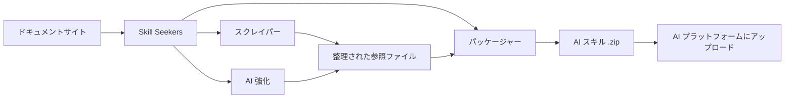
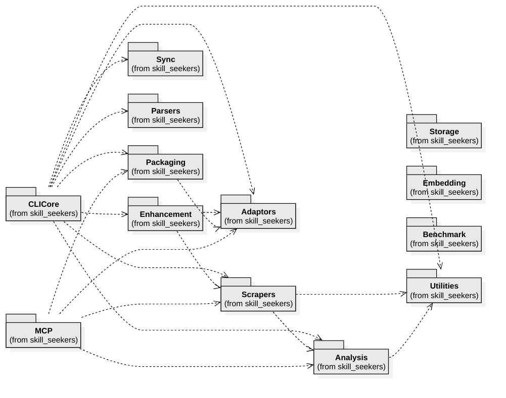

<p align="center">
  
</p>

# Skill Seekers

[English](README.md) | [简体中文](README.zh-CN.md) | 日本語 | [한국어](README.ko.md) | [Español](README.es.md) | [Français](README.fr.md) | [Deutsch](README.de.md) | [Português](README.pt-BR.md) | [Türkçe](README.tr.md) | [العربية](README.ar.md) | [हिन्दी](README.hi.md) | [Русский](README.ru.md)

> ⚠️ **機械翻訳に関する注意**
>
> この文書はAIによって自動翻訳されたものです。翻訳の品質向上に努めていますが、不正確な表現が含まれる場合があります。
>
> 翻訳の改善にご協力いただける方は、[GitHub Issue #260](https://github.com/yusufkaraaslan/Skill_Seekers/issues/260) からフィードバックをお寄せください。

[](https://github.com/yusufkaraaslan/Skill_Seekers/releases)
[](https://opensource.org/licenses/MIT)
[](https://www.python.org/downloads/)
[](https://modelcontextprotocol.io)
[](tests/)
[](https://github.com/users/yusufkaraaslan/projects/2)
[](https://pypi.org/project/skill-seekers/)
[](https://pypi.org/project/skill-seekers/)
[](https://pypi.org/project/skill-seekers/)
[](https://pepy.tech/projects/skill-seekers)
<a href="https://trendshift.io/repositories/18329" target="_blank"></a>
[](https://skillseekersweb.com/)
[](https://x.com/_yUSyUS_)
[](https://github.com/yusufkaraaslan/Skill_Seekers)

**🧠 AI システムのデータレイヤー。** Skill Seekers はドキュメントサイト、GitHub リポジトリ、PDF、動画、ノートブック、Wiki など 18 種類のソースタイプを構造化されたナレッジアセットに変換します。AI スキル（Claude、Gemini、OpenAI）、RAG パイプライン（LangChain、LlamaIndex、Pinecone）、AI コーディングアシスタント（Cursor、Windsurf、Cline）を、数時間ではなく数分で構築できます。

> 🌐 **[SkillSeekersWeb.com にアクセス](https://skillseekersweb.com/)** - 24 以上のプリセット設定を閲覧、設定の共有、完全なドキュメントへのアクセス！

> 📋 **[開発ロードマップとタスクを確認](https://github.com/users/yusufkaraaslan/projects/2)** - 10 カテゴリで 134 タスク、好きなものを選んで貢献できます！

## 🌐 エコシステム

Skill Seekers はマルチリポジトリプロジェクトです。各リポジトリの役割：

| リポジトリ | 説明 | リンク |
|-----------|------|-------|
| **[Skill_Seekers](https://github.com/yusufkaraaslan/Skill_Seekers)** | コア CLI & MCP サーバー（このリポジトリ） | [PyPI](https://pypi.org/project/skill-seekers/) |
| **[skillseekersweb](https://github.com/yusufkaraaslan/skillseekersweb)** | ウェブサイト＆ドキュメント | [サイト](https://skillseekersweb.com/) |
| **[skill-seekers-configs](https://github.com/yusufkaraaslan/skill-seekers-configs)** | コミュニティ設定リポジトリ | |
| **[skill-seekers-action](https://github.com/yusufkaraaslan/skill-seekers-action)** | GitHub Action CI/CD | |
| **[skill-seekers-plugin](https://github.com/yusufkaraaslan/skill-seekers-plugin)** | Claude Code プラグイン | |
| **[homebrew-skill-seekers](https://github.com/yusufkaraaslan/homebrew-skill-seekers)** | macOS Homebrew tap | |

> **貢献したいですか？** ウェブサイトと設定リポジトリは新しい貢献者に最適です！

## 🧠 AI システムのデータレイヤー

**Skill Seekers は汎用的な前処理レイヤー**であり、生のドキュメントとそれを利用するすべての AI システムの間に位置します。Claude スキル、LangChain RAG パイプライン、Cursor の `.cursorrules` ファイルのいずれを構築する場合でも、データの準備作業は同じです。一度実行すれば、すべてのターゲットにエクスポートできます。

```bash
# 1コマンド → 構造化ナレッジアセット
skill-seekers create https://docs.react.dev/
# または: skill-seekers create facebook/react
# または: skill-seekers create ./my-project

# 任意の AI システムにエクスポート
skill-seekers package output/react --target claude      # → Claude AI スキル (ZIP)
skill-seekers package output/react --target langchain   # → LangChain Documents
skill-seekers package output/react --target llama-index # → LlamaIndex TextNodes
skill-seekers package output/react --target cursor      # → .cursorrules
skill-seekers package output/react --target ibm-bob     # → IBM Bob スキルディレクトリ
```

### 生成される出力

| 出力 | ターゲット | 用途 |
|------|-----------|------|
| **Claude スキル** (ZIP + YAML) | `--target claude` | Claude Code、Claude API |
| **Gemini スキル** (tar.gz) | `--target gemini` | Google Gemini |
| **OpenAI / Custom GPT** (ZIP) | `--target openai` | GPT-4o、カスタムアシスタント |
| **LangChain Documents** | `--target langchain` | QA チェーン、エージェント、リトリーバー |
| **LlamaIndex TextNodes** | `--target llama-index` | クエリエンジン、チャットエンジン |
| **Haystack Documents** | `--target haystack` | エンタープライズ RAG パイプライン |
| **Pinecone 対応** (Markdown) | `--target markdown` | ベクトルアップサート |
| **ChromaDB / FAISS / Qdrant** | `--target chroma/faiss/qdrant` | ローカルベクトル DB |
| **IBM Bob スキル**（ディレクトリ） | `--target ibm-bob` | IBM Bob プロジェクト/グローバルスキル |
| **Cursor** `.cursorrules` | `--target markdown` → SKILL.md をコピー | Cursor IDE `.cursorrules` |
| **Windsurf / Cline / Continue** | `--target claude` → コピー | VS Code、IntelliJ、Vim |

### 選ばれる理由

- ⚡ **99% 高速化** — 数日の手作業データ準備 → 15〜45 分
- 🎯 **AI スキル品質** — サンプル、パターン、ガイドを含む 500 行以上の SKILL.md ファイル
- 📊 **RAG 対応チャンク** — コードブロックを保持しコンテキストを維持するスマートチャンキング
- 🎬 **動画** — YouTube やローカル動画からコード、字幕、構造化知識を抽出
- 🔄 **マルチソース** — 18 種類のソースタイプ（ドキュメント、GitHub、PDF、動画、ノートブック、Wiki など）を 1 つのナレッジアセットに統合
- 🌐 **一度の準備で全ターゲット** — 再スクレイピングなしで同じアセットを 21 プラットフォームにエクスポート
- ✅ **実戦テスト済み** — 3,700 以上のテスト、24 以上のフレームワークプリセット、本番運用可能

## 🚀 クイックスタート（3 コマンド）

```bash
# 1. インストール
pip install skill-seekers

# 2. 任意のソースからスキルを作成
skill-seekers create https://docs.django.com/

# 3. AI プラットフォーム向けにパッケージ
skill-seekers package output/django --target claude
```

**これだけです！** `output/django-claude.zip` がすぐに使える状態で生成されます。

```bash
# 強化に別の AI エージェントを使用（デフォルト：claude）
skill-seekers create https://docs.django.com/ --agent kimi
skill-seekers create https://docs.django.com/ --agent codex
skill-seekers create https://docs.django.com/ --agent-cmd "my-custom-agent run"
```

### 🛰️ AI 駆動のプロジェクトスキャン（新機能）

任意のプロジェクトに `scan` を実行すると、AI エージェントがマニフェスト、README、Dockerfile/CI、サンプリングされたソースのインポートを読み取り、検出されたフレームワークごとに 1 つの設定ファイルと、自分のコード用の `<project>-codebase.json` を出力します。検出されたバージョンを記録するため、再実行時にはバージョンアップが報告されます：

```bash
skill-seekers scan ./my-react-app --out ./configs/scanned/
# → react.json, vite.json, tailwind.json, jest.json, my-react-app-codebase.json

# その後、任意のものをビルド
skill-seekers create ./configs/scanned/react.json
```

検出結果に既存のプリセットがない場合は AI が新しい設定を生成します。終了時に [コミュニティレジストリ](https://github.com/yusufkaraaslan/skill-seekers-configs) への公開を任意で選択できます。

### その他のソース（18 種類対応）

```bash
# GitHub リポジトリ
skill-seekers create facebook/react

# ローカルプロジェクト
skill-seekers create ./my-project

# PDF ドキュメント
skill-seekers create manual.pdf

# Word ドキュメント
skill-seekers create report.docx

# EPUB 電子書籍
skill-seekers create book.epub

# Jupyter Notebook
skill-seekers create notebook.ipynb

# OpenAPI 仕様
skill-seekers create openapi.yaml

# PowerPoint プレゼンテーション
skill-seekers create presentation.pptx

# AsciiDoc ドキュメント
skill-seekers create guide.adoc

# ローカル HTML ファイル（拡張子で自動検出）
skill-seekers create page.html

# HTML ファイルのディレクトリ全体（HTML 主体のディレクトリを自動検出）
skill-seekers create ./mirror_output/site/

# コードが混在するディレクトリで HTML モードを強制
skill-seekers create ./repo/ --html-path ./repo/docs/build/html/

# RSS/Atom フィード
skill-seekers create feed.rss

# Man ページ
skill-seekers create curl.1

# 動画（YouTube、Vimeo、またはローカルファイル — skill-seekers[video] が必要）
skill-seekers create --video-url https://www.youtube.com/watch?v=... --name mytutorial
# 初回使用時は GPU 対応のビジュアル依存関係を自動インストール：
skill-seekers create --setup

# Confluence Wiki
skill-seekers create --space-key TEAM --name wiki

# Notion ページ
skill-seekers create --database-id ... --name docs

# Slack/Discord チャットエクスポート
skill-seekers create --chat-export-path ./slack-export --name team-chat
```

### あらゆる場所へエクスポート

```bash
# 複数プラットフォーム向けにパッケージ
for platform in claude gemini openai langchain; do
  skill-seekers package output/django --target $platform
done
```

## Skill Seekers とは？

Skill Seekers は **AI システムのデータレイヤー**であり、18 種類のソースタイプ——ドキュメントサイト、GitHub リポジトリ、PDF、動画、Jupyter Notebook、Word/EPUB/AsciiDoc ドキュメント、OpenAPI 仕様、PowerPoint プレゼンテーション、RSS フィード、Man ページ、Confluence Wiki、Notion ページ、Slack/Discord チャットエクスポートなど——をすべての AI ターゲットに適した構造化ナレッジアセットに変換します：

| ユースケース | 得られるもの | 例 |
|-------------|-------------|-----|
| **AI スキル** | 包括的な SKILL.md + 参照ファイル | Claude Code、Gemini、GPT |
| **RAG パイプライン** | リッチなメタデータ付きチャンクドキュメント | LangChain、LlamaIndex、Haystack |
| **ベクトルデータベース** | アップサート用にフォーマット済みデータ | Pinecone、Chroma、Weaviate、FAISS |
| **AI コーディングアシスタント** | IDE の AI が自動的に読み取るコンテキストファイル | Cursor、Windsurf、Cline、Continue.dev |

## 📚 ドキュメント

| やりたいこと | 読むべきドキュメント |
|--------------|-----------|
| **すぐに始める** | [クイックスタート](docs/getting-started/02-quick-start.md) - 3 コマンドで最初のスキルを作成 |
| **コンセプトを理解する** | [コアコンセプト](docs/user-guide/01-core-concepts.md) - 仕組みの解説 |
| **ソースをスクレイプする** | [スクレイピングガイド](docs/user-guide/02-scraping.md) - すべてのソースタイプ |
| **スキルを強化する** | [強化ガイド](docs/user-guide/03-enhancement.md) - AI 強化 |
| **スキルをエクスポートする** | [パッケージングガイド](docs/user-guide/04-packaging.md) - プラットフォームエクスポート |
| **コマンドを調べる** | [CLI リファレンス](docs/reference/CLI_REFERENCE.md) - 全 20 コマンド |
| **設定する** | [設定フォーマット](docs/reference/CONFIG_FORMAT.md) - JSON 仕様 |
| **問題を解決する** | [トラブルシューティング](docs/user-guide/06-troubleshooting.md) - よくある問題 |

**完全なドキュメント：** [docs/README.md](docs/README.md)

Skill Seekers は数日かかる手動前処理の代わりに以下を行います：

1. **取り込み** — ドキュメント、GitHub リポジトリ、ローカルコードベース、PDF、動画、Jupyter Notebook、Wiki など 10 種類以上のソースタイプ
2. **分析** — 高度な AST 解析、パターン検出、API 抽出
3. **構造化** — メタデータ付きのカテゴリ分類された参照ファイル
4. **強化** — AI 駆動の SKILL.md 生成（Claude、Gemini、またはローカル）
5. **エクスポート** — 1 つのアセットから 16 種類のプラットフォーム専用フォーマットにエクスポート

## なぜ Skill Seekers を使うのか？

### AI スキルビルダー向け（Claude、Gemini、OpenAI）

- 🎯 **本番グレードのスキル** — コード例、パターン、ガイドを含む 500 行以上の SKILL.md ファイル
- 🔄 **強化ワークフロー** — `security-focus`、`architecture-comprehensive` またはカスタム YAML プリセットを適用
- 🎮 **あらゆるドメイン** — ゲームエンジン（Godot、Unity）、フレームワーク（React、Django）、社内ツール
- 🔧 **チーム向け** — 社内ドキュメント + コードを単一の信頼できるソースに統合
- 📚 **高品質** — サンプル、クイックリファレンス、ナビゲーションガイド付きの AI 強化

### RAG ビルダー & AI エンジニア向け

- 🤖 **RAG 対応データ** — 事前チャンク済みの LangChain `Documents`、LlamaIndex `TextNodes`、Haystack `Documents`
- 🚀 **99% 高速化** — 数日の前処理 → 15〜45 分
- 📊 **スマートメタデータ** — カテゴリ、ソース、タイプ → より高い検索精度
- 🔄 **マルチソース** — 1 つのパイプラインでドキュメント + GitHub + PDF + 動画を統合
- 🌐 **プラットフォーム非依存** — 再スクレイピングなしで任意のベクトル DB やフレームワークにエクスポート

### AI コーディングアシスタントユーザー向け

- 💻 **Cursor / Windsurf / Cline** — `.cursorrules` / `.windsurfrules` / `.clinerules` を自動生成
- 🎯 **永続的コンテキスト** — AI がフレームワークを「理解」し、繰り返しのプロンプトが不要に
- 📚 **常に最新** — ドキュメント更新時に数分でコンテキストを更新

## 主要機能

### 🌐 ドキュメントスクレイピング
- ✅ **スマート SPA ディスカバリー** - JavaScript SPA サイト向けの 3 層ディスカバリー（sitemap.xml → llms.txt → ヘッドレスブラウザレンダリング）
- ✅ **llms.txt サポート** - LLM 対応ドキュメントファイルを自動検出し使用（10 倍高速）
- ✅ **汎用スクレイパー** - あらゆるドキュメントサイトに対応
- ✅ **スマート分類** - トピック別にコンテンツを自動整理
- ✅ **コード言語検出** - Python、JavaScript、C++、GDScript などを認識
- ✅ **24 以上のプリセット** - Godot、React、Vue、Django、FastAPI など

### 📄 PDF サポート
- ✅ **基本 PDF 抽出** - PDF からテキスト、コード、画像を抽出
- ✅ **スキャン PDF の OCR** - スキャンドキュメントからテキストを抽出
- ✅ **パスワード保護 PDF** - 暗号化 PDF の処理
- ✅ **テーブル抽出** - 複雑なテーブルの抽出
- ✅ **並列処理** - 大規模 PDF で 3 倍高速
- ✅ **インテリジェントキャッシュ** - 再実行時に 50% 高速

### 🎬 動画抽出
- ✅ **YouTube & ローカル動画** - 動画から字幕、コード、構造化知識を抽出
- ✅ **ビジュアルフレーム分析** - コードエディタ、ターミナル、スライド、図の OCR 抽出
- ✅ **GPU 自動検出** - 正しい PyTorch ビルド（CUDA/ROCm/MPS/CPU）を自動インストール
- ✅ **AI 強化** - 2 パス処理：OCR アーティファクトのクリーンアップ + 洗練された SKILL.md の生成
- ✅ **時間トリミング** - `--start-time` と `--end-time` で特定のセクションを抽出
- ✅ **プレイリストサポート** - YouTube プレイリスト内のすべての動画を一括処理
- ✅ **Vision API フォールバック** - 低信頼度の OCR フレームに Claude Vision を使用

### 🐙 GitHub リポジトリ分析
- ✅ **高度なコード分析** - Python、JavaScript、TypeScript、Java、C++、Go の AST 解析
- ✅ **API 抽出** - 関数、クラス、メソッドのパラメータと型情報
- ✅ **リポジトリメタデータ** - README、ファイルツリー、言語構成、スター/フォーク数
- ✅ **GitHub Issues & PR** - ラベルとマイルストーン付きの Issue を取得
- ✅ **CHANGELOG & リリース** - バージョン履歴を自動抽出
- ✅ **コンフリクト検出** - ドキュメント化された API と実際のコード実装を比較
- ✅ **MCP 統合** - 自然言語で操作：「GitHub リポジトリ facebook/react をスクレイプ」

### 🔄 統合マルチソーススクレイピング
- ✅ **複数ソースの統合** - 1 つのスキルでドキュメント + GitHub + PDF を混合
- ✅ **コンフリクト検出** - ドキュメントとコード間の不一致を自動検出
- ✅ **インテリジェントマージ** - ルールベースまたは AI 駆動のコンフリクト解決
- ✅ **透明なレポート** - ⚠️ 警告付きの並列比較
- ✅ **ドキュメントギャップ分析** - 古いドキュメントや未文書化機能を特定
- ✅ **唯一の信頼できるソース** - 意図（ドキュメント）と現実（コード）の両方を示す 1 つのスキル
- ✅ **後方互換性** - レガシーの単一ソース設定は引き続き動作

### 🤖 マルチ LLM プラットフォームサポート
- ✅ **12 の LLM プラットフォーム** - Claude AI、Google Gemini、OpenAI ChatGPT、MiniMax AI、汎用 Markdown、OpenCode、Kimi（Moonshot AI）、DeepSeek AI、Qwen（Alibaba）、OpenRouter、Together AI、Fireworks AI
- ✅ **汎用スクレイピング** - 同じドキュメントがすべてのプラットフォームで使用可能
- ✅ **プラットフォーム固有のパッケージング** - 各 LLM に最適化されたフォーマット
- ✅ **ワンコマンドエクスポート** - `--target` フラグでプラットフォームを選択
- ✅ **オプション依存関係** - 必要なものだけインストール
- ✅ **100% 後方互換** - 既存の Claude ワークフローは変更不要

| プラットフォーム | フォーマット | アップロード | 強化 | API キー | カスタムエンドポイント |
|----------------|------------|------------|------|---------|-------------------|
| **Claude AI** | ZIP + YAML | ✅ 自動 | ✅ あり | ANTHROPIC_API_KEY | ANTHROPIC_BASE_URL |
| **Google Gemini** | tar.gz | ✅ 自動 | ✅ あり | GOOGLE_API_KEY | - |
| **OpenAI ChatGPT** | ZIP + Vector Store | ✅ 自動 | ✅ あり | OPENAI_API_KEY | - |
| **MiniMax AI** | ZIP + Knowledge Files | ✅ 自動 | ✅ あり | MINIMAX_API_KEY | - |
| **汎用 Markdown** | ZIP | ❌ 手動 | ❌ なし | - | - |

```bash
# Claude（デフォルト — 変更不要！）
skill-seekers package output/react/
skill-seekers upload react.zip

# Google Gemini
pip install skill-seekers[gemini]
skill-seekers package output/react/ --target gemini
skill-seekers upload react-gemini.tar.gz --target gemini

# OpenAI ChatGPT
pip install skill-seekers[openai]
skill-seekers package output/react/ --target openai
skill-seekers upload react-openai.zip --target openai

# MiniMax AI
pip install skill-seekers[minimax]
skill-seekers package output/react/ --target minimax
skill-seekers upload react-minimax.zip --target minimax

# 汎用 Markdown（ユニバーサルエクスポート）
skill-seekers package output/react/ --target markdown
# Markdown ファイルは任意の LLM で直接使用可能
```

<details>
<summary>🔧 <strong>独自の AI プロバイダーを使用（OpenAI 互換エンドポイント + サブスクリプション、Anthropic クレジット不要）</strong></summary>

オプションの AI **強化**ステップ（`create`、`scan`、`enhance` で使用）には Anthropic キーは**不要**です。以下の 3 つの方法で実行できます：

**1. すでに契約しているサブスクリプションを使用 — API クレジット完全不要（LOCAL エージェントモード）**

Skill Seekers はログイン済みのコーディングエージェント CLI を呼び出せるため、従量課金の API トークンではなく既存のプランで強化を実行できます：

```bash
skill-seekers create <source> --agent codex     # OpenAI Codex CLI → ChatGPT Plus プラン
skill-seekers create <source> --agent claude    # Claude Code      → Claude Pro/Max プラン
```

サポートされるエージェント：`claude`、`codex`、`copilot`、`opencode`、`kimi`、`custom`
（`--agent custom` と `--agent-cmd "<your-cli> ..."` を組み合わせれば任意のツールを利用可能）。

**2. 任意の OpenAI 互換プロバイダー（OpenRouter、Groq、Cerebras、Mistral、NVIDIA NIM など）**

これらはすべて OpenAI 互換の `/v1` エンドポイントを公開しています。3 つの環境変数を設定するだけで利用できます — Skill Seekers は `OPENAI_API_KEY` を検出し、OpenAI SDK が `OPENAI_BASE_URL` を自動的に尊重します：

```bash
export OPENAI_API_KEY="<your provider key>"
export OPENAI_BASE_URL="https://openrouter.ai/api/v1"   # プロバイダーのエンドポイント（下表参照）
export OPENAI_MODEL="<a model that provider offers>"     # 必須 — デフォルトの gpt-4o は他のプロバイダーには存在しません
skill-seekers create <source>
```

| プロバイダー | `OPENAI_BASE_URL`                          |
|--------------|--------------------------------------------|
| OpenRouter   | `https://openrouter.ai/api/v1`             |
| Groq         | `https://api.groq.com/openai/v1`           |
| Cerebras     | `https://api.cerebras.ai/v1`               |
| Mistral      | `https://api.mistral.ai/v1`                |
| NVIDIA NIM   | `https://integrate.api.nvidia.com/v1`      |

> プロバイダー検出は、**最初に**見つかった API キー環境変数を採用します（`ANTHROPIC_API_KEY` → `GOOGLE_API_KEY` → `OPENAI_API_KEY` → `MOONSHOT_API_KEY`）。特定のプロバイダーを強制するには `SKILL_SEEKER_PROVIDER` を設定するか、優先度の高いキーが未設定であることを確認してください。

**3. Claude 互換エンドポイント（GLM、プロキシなど）**

```bash
export ANTHROPIC_API_KEY="your-key"
export ANTHROPIC_BASE_URL="https://your-claude-compatible-endpoint/v1"
```

Google Gemini（`GOOGLE_API_KEY`）と Kimi/Moonshot（`MOONSHOT_API_KEY`）もネイティブにサポートされています。プロバイダーごとのモデル上書きを含む完全なリストは **[環境変数リファレンス](docs/reference/ENVIRONMENT_VARIABLES.md#llm-provider-selection)** を参照してください。

</details>

**インストール：**
```bash
# Gemini サポートをインストール
pip install skill-seekers[gemini]

# OpenAI サポートをインストール
pip install skill-seekers[openai]

# MiniMax サポートをインストール
pip install skill-seekers[minimax]

# すべての LLM プラットフォームをインストール
pip install skill-seekers[all-llms]
```

### 🔗 RAG フレームワーク統合

- ✅ **LangChain Documents** - `page_content` + メタデータ付きの `Document` フォーマットに直接エクスポート
  - 最適な用途：QA チェーン、リトリーバー、ベクトルストア、エージェント
  - サンプル：[LangChain RAG パイプライン](examples/langchain-rag-pipeline/)
  - ガイド：[LangChain 統合](docs/integrations/LANGCHAIN.md)

- ✅ **LlamaIndex TextNodes** - ユニーク ID + エンベディング付きの `TextNode` フォーマットにエクスポート
  - 最適な用途：クエリエンジン、チャットエンジン、ストレージコンテキスト
  - サンプル：[LlamaIndex クエリエンジン](examples/llama-index-query-engine/)
  - ガイド：[LlamaIndex 統合](docs/integrations/LLAMA_INDEX.md)

- ✅ **Pinecone 対応フォーマット** - ベクトルデータベースアップサートに最適化
  - 最適な用途：プロダクションベクトル検索、セマンティック検索、ハイブリッド検索
  - サンプル：[Pinecone アップサート](examples/pinecone-upsert/)
  - ガイド：[Pinecone 統合](docs/integrations/PINECONE.md)

**クイックエクスポート：**
```bash
# LangChain Documents（JSON）
skill-seekers package output/django --target langchain
# → output/django-langchain.json

# LlamaIndex TextNodes（JSON）
skill-seekers package output/django --target llama-index
# → output/django-llama-index.json

# Markdown（汎用）
skill-seekers package output/django --target markdown
# → output/django-markdown/SKILL.md + references/
```

**完全な RAG パイプラインガイド：** [RAG パイプラインドキュメント](docs/integrations/RAG_PIPELINES.md)

---

### 🧠 AI コーディングアシスタント統合

任意のフレームワークドキュメントを 4 つ以上の AI アシスタント向けのエキスパートコーディングコンテキストに変換：

- ✅ **Cursor IDE** - AI 駆動のコード提案用に `.cursorrules` を生成
  - 最適な用途：フレームワーク固有のコード生成、一貫したパターン
  - 対応：Cursor IDE（VS Code フォーク）
  - ガイド：[Cursor 統合](docs/integrations/CURSOR.md)
  - サンプル：[Cursor React スキル](examples/cursor-react-skill/)

- ✅ **Windsurf** - `.windsurfrules` で Windsurf AI アシスタントのコンテキストをカスタマイズ
  - 最適な用途：IDE ネイティブの AI 支援、フローベースのコーディング
  - 対応：Codeium 製 Windsurf IDE
  - ガイド：[Windsurf 統合](docs/integrations/WINDSURF.md)
  - サンプル：[Windsurf FastAPI コンテキスト](examples/windsurf-fastapi-context/)

- ✅ **Cline（VS Code）** - VS Code エージェント用のシステムプロンプト + MCP
  - 最適な用途：VS Code でのエージェント型コード生成
  - 対応：VS Code 用 Cline 拡張機能
  - ガイド：[Cline 統合](docs/integrations/CLINE.md)
  - サンプル：[Cline Django アシスタント](examples/cline-django-assistant/)

- ✅ **Continue.dev** - IDE 非依存の AI コンテキストサーバー
  - 最適な用途：マルチ IDE 環境（VS Code、JetBrains、Vim）、カスタム LLM プロバイダー
  - 対応：Continue.dev プラグインを備えた任意の IDE
  - ガイド：[Continue 統合](docs/integrations/CONTINUE_DEV.md)
  - サンプル：[Continue ユニバーサルコンテキスト](examples/continue-dev-universal/)

**AI コーディングツール向けクイックエクスポート：**
```bash
# 任意の AI コーディングアシスタント向け（Cursor、Windsurf、Cline、Continue.dev）
skill-seekers create --config configs/django.json
skill-seekers package output/django --target claude  # または --target markdown

# プロジェクトにコピー（Cursor の場合）
cp output/django-claude/SKILL.md my-project/.cursorrules

# Windsurf の場合
cp output/django-claude/SKILL.md my-project/.windsurf/rules/django.md

# Cline の場合
cp output/django-claude/SKILL.md my-project/.clinerules

# Continue.dev の場合（HTTP サーバー）
python examples/continue-dev-universal/context_server.py
# ~/.continue/config.json で設定
```

**統合ハブ：** [すべての AI システム統合](docs/integrations/INTEGRATIONS.md)

---

### 🌊 3 ストリーム GitHub アーキテクチャ
- ✅ **3 ストリーム分析** - GitHub リポジトリをコード、ドキュメント、インサイトの 3 ストリームに分割
- ✅ **統合コードベースアナライザー** - GitHub URL とローカルパスの両方に対応
- ✅ **C3.x 分析深度** - 「basic」（1〜2 分）または「c3x」（20〜60 分）分析を選択
- ✅ **強化ルーター生成** - GitHub メタデータ、README クイックスタート、よくある問題
- ✅ **Issue 統合** - GitHub Issues からのよくある問題と解決策
- ✅ **スマートルーティングキーワード** - GitHub ラベルの重み付けが 2 倍でトピック検出精度を向上

**3 ストリームの説明：**
- **ストリーム 1：コード** - 高度な C3.x 分析（パターン、サンプル、ガイド、設定、アーキテクチャ）
- **ストリーム 2：ドキュメント** - リポジトリドキュメント（README、CONTRIBUTING、docs/*.md）
- **ストリーム 3：インサイト** - コミュニティ知識（Issues、ラベル、Stars、Forks）

```python
from skill_seekers.cli.unified_codebase_analyzer import UnifiedCodebaseAnalyzer

# 3 ストリームで GitHub リポジトリを分析
analyzer = UnifiedCodebaseAnalyzer()
result = analyzer.analyze(
    source="https://github.com/facebook/react",
    depth="c3x",  # または "basic" でクイック分析
    fetch_github_metadata=True
)

# コードストリームへのアクセス（C3.x 分析）
print(f"デザインパターン: {len(result.code_analysis['c3_1_patterns'])}")
print(f"テストサンプル: {result.code_analysis['c3_2_examples_count']}")

# ドキュメントストリームへのアクセス（リポジトリドキュメント）
print(f"README: {result.github_docs['readme'][:100]}")

# インサイトストリームへのアクセス（GitHub メタデータ）
print(f"Stars: {result.github_insights['metadata']['stars']}")
print(f"よくある問題: {len(result.github_insights['common_problems'])}")
```

**完全なドキュメント**：[3 ストリーム実装サマリー](docs/archive/historical/IMPLEMENTATION_SUMMARY_THREE_STREAM.md)

### 🔐 スマートレート制限管理と設定
- ✅ **マルチトークン設定システム** - 複数の GitHub アカウント（個人、仕事、OSS）を管理
  - セキュアな設定ストレージ `~/.config/skill-seekers/config.json`（パーミッション 600）
  - プロファイルごとのレート制限戦略：`prompt`、`wait`、`switch`、`fail`
  - プロファイルごとのタイムアウト設定（デフォルト：30 分、無期限の待機を防止）
  - スマートフォールバックチェーン：CLI 引数 → 環境変数 → 設定ファイル → プロンプト
  - Claude、Gemini、OpenAI の API キー管理
- ✅ **対話式設定ウィザード** - 美しいターミナル UI で簡単セットアップ
  - トークン作成のためのブラウザ統合（GitHub などを自動で開く）
  - トークンの検証と接続テスト
  - カラーコード付きのビジュアルステータス表示
- ✅ **インテリジェントレート制限ハンドラー** - 無限待ちはもう終わり！
  - レート制限（60 回/時間 vs 5000 回/時間）の事前警告
  - GitHub API レスポンスからのリアルタイム検出
  - 進捗付きのライブカウントダウンタイマー
  - レート制限時の自動プロファイル切り替え
  - 4 つの戦略：prompt（確認）、wait（カウントダウン）、switch（切り替え）、fail（中止）
- ✅ **レジューム機能** - 中断されたジョブの再開
  - 設定可能な間隔での進捗自動保存（デフォルト：60 秒）
  - 再開可能なジョブの一覧表示（進捗詳細付き）
  - 古いジョブの自動クリーンアップ（デフォルト：7 日）
- ✅ **CI/CD サポート** - 自動化向けの非対話モード
  - `--non-interactive` フラグでプロンプトなしの即時失敗
  - `--profile` フラグで特定の GitHub アカウントを選択
  - パイプラインログ向けの明確なエラーメッセージ

**クイックセットアップ：**
```bash
# 初回設定（5 分）
skill-seekers config --github

# プライベートリポジトリ用に特定のプロファイルを使用
skill-seekers create mycompany/private-repo --profile work

# CI/CD モード（即時失敗、プロンプトなし）
skill-seekers create owner/repo --non-interactive

# 中断されたジョブを再開
skill-seekers resume --list
skill-seekers resume github_react_20260117_143022
```

**レート制限戦略の説明：**
- **prompt**（デフォルト）- レート制限時にどうするか確認（待機、切り替え、トークン設定、キャンセル）
- **wait** - カウントダウンタイマー付きで自動待機（タイムアウトを尊重）
- **switch** - 次に利用可能なプロファイルを自動的に試行（マルチアカウント構成向け）
- **fail** - 明確なエラーで即時失敗（CI/CD に最適）

### 🎯 Bootstrap スキル — セルフホスティング

skill-seekers 自体をスキルとして生成し、AI エージェント（Claude Code、Kimi、Codex など）内で使用できます：

```bash
# スキルを生成
./scripts/bootstrap_skill.sh

# Claude Code にインストール
cp -r output/skill-seekers ~/.claude/skills/
```

**得られるもの：**
- ✅ **完全なスキルドキュメント** - すべての CLI コマンドと使用パターン
- ✅ **CLI コマンドリファレンス** - すべてのツールとそのオプションを文書化
- ✅ **クイックスタートサンプル** - 一般的なワークフローとベストプラクティス
- ✅ **自動生成 API ドキュメント** - コード分析、パターン、サンプル

### 🔐 プライベート設定リポジトリ
- ✅ **Git ベースの設定ソース** - プライベート/チーム Git リポジトリから設定を取得
- ✅ **マルチソース管理** - GitHub、GitLab、Bitbucket リポジトリを無制限に登録
- ✅ **チームコラボレーション** - 3〜5 人のチーム間でカスタム設定を共有
- ✅ **エンタープライズサポート** - 優先度ベースの解決で 500 人以上の開発者にスケール
- ✅ **セキュア認証** - 環境変数トークン（GITHUB_TOKEN、GITLAB_TOKEN）
- ✅ **インテリジェントキャッシュ** - 一度クローンすれば、更新は自動的にプル
- ✅ **オフラインモード** - オフライン時はキャッシュされた設定で作業

### 🤖 コードベース分析（C3.x）

**C3.4：AI 強化付き設定パターン抽出**
- ✅ **9 つの設定フォーマット** - JSON、YAML、TOML、ENV、INI、Python、JavaScript、Dockerfile、Docker Compose
- ✅ **7 つのパターンタイプ** - データベース、API、ロギング、キャッシュ、メール、認証、サーバー設定
- ✅ **AI 強化** - オプションのデュアルモード AI 分析（API + LOCAL）
  - 各設定が何をするかを説明
  - ベストプラクティスと改善案を提案
  - **セキュリティ分析** - ハードコードされたシークレットや公開された認証情報を検出
- ✅ **自動ドキュメント生成** - すべての設定の JSON + Markdown ドキュメントを生成
- ✅ **MCP 統合** - 強化サポート付きの `extract_config_patterns` ツール

**C3.3：AI 強化操作ガイド**
- ✅ **包括的な AI 強化** - 基本ガイドをプロフェッショナルなチュートリアルに変換
- ✅ **5 つの自動改善** - ステップ説明、トラブルシューティング、前提条件、次のステップ、ユースケース
- ✅ **デュアルモードサポート** - API モード（Claude API）または LOCAL モード（Claude Code CLI）
- ✅ **LOCAL モードはコスト無料** - Claude Code Max プランで無料強化
- ✅ **品質の変革** - 75 行のテンプレート → 500 行以上の包括的なガイド

**使用方法：**
```bash
# クイック分析（1〜2 分、基本機能のみ）
skill-seekers scan tests/ --quick

# 包括的分析（AI 付き、20〜60 分）
skill-seekers scan tests/ --comprehensive

# AI 強化付き
skill-seekers scan tests/ --enhance
```

**完全なドキュメント：** [docs/features/HOW_TO_GUIDES.md](docs/features/HOW_TO_GUIDES.md#ai-enhancement-new)

### 🔄 強化ワークフロープリセット

再利用可能な YAML 定義の強化パイプラインで、AI が生のドキュメントを洗練されたスキルに変換する方法を制御します。

- ✅ **5 つの組み込みプリセット** — `default`、`minimal`、`security-focus`、`architecture-comprehensive`、`api-documentation`
- ✅ **ユーザー定義プリセット** — `~/.config/skill-seekers/workflows/` にカスタムワークフローを追加
- ✅ **複数ワークフローチェーン** — 1 つのコマンドで 2 つ以上のワークフローをチェーン
- ✅ **完全な CLI 管理** — ワークフローの一覧表示、確認、コピー、追加、削除、検証

```bash
# 単一ワークフローの適用
skill-seekers create ./my-project --enhance-workflow security-focus

# 複数ワークフローのチェーン（順序どおりに適用）
skill-seekers create ./my-project \
  --enhance-workflow security-focus \
  --enhance-workflow minimal

# プリセットの管理
skill-seekers workflows list                          # すべて一覧表示（組み込み + ユーザー）
skill-seekers workflows show security-focus           # YAML 内容を表示
skill-seekers workflows copy security-focus           # 編集用にユーザーディレクトリにコピー
skill-seekers workflows add ./my-workflow.yaml        # カスタムプリセットをインストール
skill-seekers workflows remove my-workflow            # ユーザープリセットを削除
skill-seekers workflows validate security-focus       # プリセット構造を検証

# 複数を同時にコピー
skill-seekers workflows copy security-focus minimal api-documentation

# 複数ファイルを同時に追加
skill-seekers workflows add ./wf-a.yaml ./wf-b.yaml

# 複数を同時に削除
skill-seekers workflows remove my-wf-a my-wf-b
```

**YAML プリセットフォーマット：**
```yaml
name: security-focus
description: "セキュリティ重点レビュー：脆弱性、認証、データ処理"
version: "1.0"
stages:
  - name: vulnerabilities
    type: custom
    prompt: "OWASP Top 10 と一般的なセキュリティ脆弱性をレビュー..."
  - name: auth-review
    type: custom
    prompt: "認証と認可パターンを検査..."
    uses_history: true
```

### ⚡ パフォーマンスとスケール
- ✅ **非同期モード** - async/await で 2〜3 倍高速なスクレイピング（`--async` フラグを使用）
- ✅ **大規模ドキュメントサポート** - インテリジェントな分割で 10K〜40K 以上のページを処理
- ✅ **ルーター/ハブスキル** - 専用サブスキルへのインテリジェントルーティング
- ✅ **並列スクレイピング** - 複数のスキルを同時処理
- ✅ **チェックポイント/レジューム** - 長時間スクレイプでも進捗を失わない
- ✅ **キャッシュシステム** - 一度スクレイプすれば即座にリビルド

### 🤖 エージェント非依存のスキル生成
- ✅ **マルチエージェントサポート** - `--agent` フラグで Claude、Kimi、Codex、Copilot、OpenCode、または任意のカスタムエージェント向けにスキルを生成
- ✅ **カスタムエージェントコマンド** - `--agent-cmd` で強化に使用するカスタムエージェント CLI コマンドを指定
- ✅ **ユニバーサルフラグ** - `--agent` と `--agent-cmd` はすべてのコマンド（create、scrape、github、pdf など）で利用可能

### 📦 マーケットプレイスパイプライン
- ✅ **マーケットプレイスへの公開** - Claude Code プラグインマーケットプレイスリポジトリにスキルを公開
- ✅ **エンドツーエンドパイプライン** - ドキュメントソースから公開済みマーケットプレイスエントリまで

### ✅ 品質保証
- ✅ **完全テスト** - 3,700 以上のテスト、包括的なカバレッジ

---

## 📦 インストール

```bash
# 基本インストール（ドキュメントスクレイピング、GitHub 分析、PDF、パッケージング）
pip install skill-seekers

# すべての LLM プラットフォームサポート付き
pip install skill-seekers[all-llms]

# MCP サーバー付き
pip install skill-seekers[mcp]

# 全機能
pip install skill-seekers[all]
```

**選択に迷ったら？** セットアップウィザードを実行：
```bash
skill-seekers-setup
```

### インストールオプション

| インストールコマンド | 機能 |
|-------------------|------|
| `pip install skill-seekers` | スクレイピング、GitHub 分析、PDF、全プラットフォーム |
| `pip install skill-seekers[gemini]` | + Google Gemini サポート |
| `pip install skill-seekers[openai]` | + OpenAI ChatGPT サポート |
| `pip install skill-seekers[all-llms]` | + すべての LLM プラットフォーム |
| `pip install skill-seekers[mcp]` | + Claude Code や Cursor などの MCP サーバー |
| `pip install skill-seekers[video]` | + YouTube/Vimeo 字幕 & メタデータ抽出 |
| `pip install skill-seekers[video-full]` | + Whisper 文字起こし & ビジュアルフレーム抽出 |
| `pip install skill-seekers[jupyter]` | + Jupyter Notebook サポート |
| `pip install skill-seekers[pptx]` | + PowerPoint サポート |
| `pip install skill-seekers[confluence]` | + Confluence Wiki サポート |
| `pip install skill-seekers[notion]` | + Notion ページサポート |
| `pip install skill-seekers[rss]` | + RSS/Atom フィードサポート |
| `pip install skill-seekers[chat]` | + Slack/Discord チャットエクスポートサポート |
| `pip install skill-seekers[asciidoc]` | + AsciiDoc ドキュメントサポート |
| `pip install skill-seekers[all]` | 全機能 |

> **動画ビジュアル依存関係（GPU 対応）：** `skill-seekers[video-full]` をインストールした後、
> `skill-seekers create --setup` を実行して GPU を自動検出し、正しい PyTorch
> バージョン + easyocr をインストールします。これはビジュアル抽出依存関係のインストールに推奨される方法です。

---

## 🚀 ワンコマンドインストールワークフロー

**設定からスキルアップロードまでの最速の方法——完全自動化：**

```bash
# 公式設定から React スキルをインストール（Claude に自動アップロード）
skill-seekers install --config react

# ローカル設定ファイルからインストール
skill-seekers install --config configs/custom.json

# アップロードなしでインストール（パッケージのみ）
skill-seekers install --config django --no-upload

# 実行せずにワークフローをプレビュー
skill-seekers install --config react --dry-run
```

**所要時間：** 合計 20〜45 分 | **品質：** 本番運用可能（9/10） | **コスト：** 無料

**実行フェーズ：**
```
📥 フェーズ 1：設定の取得（設定名が指定された場合）
📖 フェーズ 2：ドキュメントのスクレイピング
✨ フェーズ 3：AI 強化（必須 — スキップ不可）
📦 フェーズ 4：スキルのパッケージング
☁️  フェーズ 5：Claude にアップロード（オプション、API キーが必要）
```

**要件：**
- ANTHROPIC_API_KEY 環境変数（自動アップロード用）
- Claude Code Max プラン（ローカル AI 強化用）、または `--agent` で別の AI エージェントを選択

---

## 📊 機能マトリックス

Skill Seekers は **12 の LLM プラットフォーム**、**8 つの RAG/ベクトルターゲット**、**18 種類のソースタイプ**をサポートし、すべてのターゲットで完全な機能パリティを提供します。

**プラットフォーム：** Claude AI、Google Gemini、OpenAI ChatGPT、MiniMax AI、汎用 Markdown、OpenCode、Kimi（Moonshot AI）、DeepSeek AI、Qwen（Alibaba）、OpenRouter、Together AI、Fireworks AI
**ソースタイプ：** ドキュメントサイト、GitHub リポジトリ、PDF、Word（.docx）、EPUB、動画、ローカルコードベース、Jupyter Notebook、ローカル HTML、OpenAPI/Swagger、AsciiDoc、PowerPoint（.pptx）、RSS/Atom フィード、Man ページ、Confluence Wiki、Notion ページ、Slack/Discord チャットエクスポート

詳細は [完全な機能マトリックス](docs/reference/FEATURE_MATRIX.md) をご覧ください。

### プラットフォーム簡易比較

| 機能 | Claude | Gemini | OpenAI | MiniMax | Markdown |
|------|--------|--------|--------|--------|----------|
| フォーマット | ZIP + YAML | tar.gz | ZIP + Vector | ZIP + Knowledge | ZIP |
| アップロード | ✅ API | ✅ API | ✅ API | ✅ API | ❌ 手動 |
| 強化 | ✅ Sonnet 4 | ✅ 2.0 Flash | ✅ GPT-4o | ✅ M3 | ❌ なし |
| 全スキルモード | ✅ | ✅ | ✅ | ✅ | ✅ |

---

## 使用例

### ドキュメントスクレイピング

```bash
# ドキュメントサイトをスクレイプ
skill-seekers create --config configs/react.json

# 設定なしでクイックスクレイプ
skill-seekers create https://react.dev --name react

# 非同期モード（3 倍高速）
skill-seekers create --config configs/godot.json --async --workers 8

# 強化に特定の AI エージェントを使用
skill-seekers create --config configs/react.json --agent kimi
```

### PDF 抽出

```bash
# 基本 PDF 抽出
skill-seekers create --pdf docs/manual.pdf --name myskill

# 高度な機能
skill-seekers create --pdf docs/manual.pdf --name myskill \
    --extract-tables \        # テーブル抽出
    --parallel \              # 高速並列処理
    --workers 8               # 8 CPU コアを使用

# スキャン PDF（必要：pip install pytesseract Pillow）
skill-seekers create --pdf docs/scanned.pdf --name myskill --ocr
```

### 動画抽出

```bash
# 動画サポートのインストール
pip install skill-seekers[video]        # 字幕 + メタデータ
pip install skill-seekers[video-full]   # + Whisper 文字起こし + ビジュアルフレーム抽出

# GPU 自動検出とビジュアル依存関係のインストール（PyTorch + easyocr）
skill-seekers create --setup

# YouTube 動画から抽出
skill-seekers create --video-url https://www.youtube.com/watch?v=dQw4w9WgXcQ --name mytutorial

# YouTube プレイリストから抽出
skill-seekers create --video-playlist https://www.youtube.com/playlist?list=... --name myplaylist

# ローカル動画ファイルから抽出
skill-seekers create --video-file recording.mp4 --name myrecording

# ビジュアルフレーム分析付きで抽出（video-full 依存関係が必要）
skill-seekers create --video-url https://www.youtube.com/watch?v=... --name mytutorial --visual

# AI 強化付き（OCR クリーンアップ + 洗練された SKILL.md を生成）
skill-seekers create --video-url https://www.youtube.com/watch?v=... --visual --enhance-level 2

# 動画の特定セクションをトリミング（秒数、MM:SS、HH:MM:SS 形式に対応）
skill-seekers create --video-url https://www.youtube.com/watch?v=... --start-time 1:30 --end-time 5:00

# 低信頼度 OCR フレームに Vision API を使用（ANTHROPIC_API_KEY が必要）
skill-seekers create --video-url https://www.youtube.com/watch?v=... --visual --vision-ocr

# 以前に抽出したデータからスキルを再構築（ダウンロードをスキップ）
skill-seekers create --from-json output/mytutorial/video_data/extracted_data.json --name mytutorial
```

> **完全ガイド：** [docs/VIDEO_GUIDE.md](docs/VIDEO_GUIDE.md) で完全な CLI リファレンス、
> ビジュアルパイプラインの詳細、AI 強化オプション、トラブルシューティングを参照してください。

### GitHub リポジトリ分析

```bash
# 基本リポジトリスクレイピング
skill-seekers create facebook/react

# 認証付き（より高いレート制限）
export GITHUB_TOKEN=ghp_your_token_here
skill-seekers create facebook/react

# 含めるコンテンツのカスタマイズ
skill-seekers create django/django \
    --include-issues \        # GitHub Issues を抽出
    --max-issues 100 \        # Issue 数を制限
    --include-changelog       # CHANGELOG.md を抽出
```

### 統合マルチソーススクレイピング

**ドキュメント + GitHub + PDF をコンフリクト検出付きの統合スキルに統合：**

```bash
# 既存の統合設定を使用
skill-seekers create --config configs/react_unified.json
skill-seekers create --config configs/django_unified.json

# または統合設定を作成
cat > configs/myframework_unified.json << 'EOF'
{
  "name": "myframework",
  "merge_mode": "rule-based",
  "sources": [
    {
      "type": "documentation",
      "base_url": "https://docs.myframework.com/",
      "max_pages": 200
    },
    {
      "type": "github",
      "repo": "owner/myframework",
      "code_analysis_depth": "surface"
    }
  ]
}
EOF

skill-seekers create --config configs/myframework_unified.json
```

**コンフリクト検出が自動的に発見するもの：**
- 🔴 **コードに存在しない**（高）：文書化されているが未実装
- 🟡 **ドキュメントに存在しない**（中）：実装されているが未文書化
- ⚠️ **シグネチャ不一致**：パラメータ/型が異なる
- ℹ️ **説明の不一致**：説明が異なる

**完全ガイド：** [docs/features/UNIFIED_SCRAPING.md](docs/features/UNIFIED_SCRAPING.md) を参照してください。

### プライベート設定リポジトリ

**プライベート Git リポジトリを使用してチーム間でカスタム設定を共有：**

```bash
# オプション 1：MCP ツールを使用（推奨）
# チームのプライベートリポジトリを登録
add_config_source(
    name="team",
    git_url="https://github.com/mycompany/skill-configs.git",
    token_env="GITHUB_TOKEN"
)

# チームリポジトリから設定を取得
fetch_config(source="team", config_name="internal-api")
```

**サポートされるプラットフォーム：**
- GitHub（`GITHUB_TOKEN`）、GitLab（`GITLAB_TOKEN`）、Gitea（`GITEA_TOKEN`）、Bitbucket（`BITBUCKET_TOKEN`）

**完全ガイド：** [docs/reference/GIT_CONFIG_SOURCES.md](docs/reference/GIT_CONFIG_SOURCES.md) を参照してください。

## 仕組み



0. **llms.txt の検出** - llms-full.txt、llms.txt、llms-small.txt を優先チェック（スマート SPA ディスカバリーの一部）
1. **スクレイプ**：ドキュメントからすべてのページを抽出
2. **カテゴリ分類**：コンテンツをトピック別に整理（API、ガイド、チュートリアルなど）
3. **強化**：AI がドキュメントを分析し、サンプル付きの包括的な SKILL.md を作成（`--agent` で複数のエージェントに対応）
4. **パッケージ**：すべてをプラットフォーム対応の `.zip` ファイルにバンドル

## アーキテクチャ

システムは **8 つのコアモジュール**と **5 つのユーティリティモジュール**（合計約 200 クラス）で構成されています：



| モジュール | 目的 | 主要クラス |
|-----------|------|-------------|
| **CLICore** | Git スタイルのコマンドディスパッチャー | `CLIDispatcher`、`SourceDetector`、`CreateCommand` |
| **Scrapers** | 18 種類のソースタイプ抽出器 | `DocToSkillConverter`、`DocumentSkillBuilder`（共有ビルドレイヤー）、`UnifiedScraper` |
| **Adaptors** | 20 以上の出力プラットフォームフォーマット | `SkillAdaptor`（ABC）、`ClaudeAdaptor`、`LangChainAdaptor` |
| **Analysis** | C3.x コードベース分析パイプライン | `UnifiedCodebaseAnalyzer`、`PatternRecognizer`、10 種類の GoF 検出器 |
| **Enhancement** | `AgentClient` による AI 駆動のスキル改善 | `AgentClient`、`AIEnhancer`、`UnifiedEnhancer`、`WorkflowEngine` |
| **Packaging** | スキルのパッケージ、アップロード、インストール | `PackageSkill`、`InstallAgent` |
| **MCP** | FastMCP サーバー（40 ツール） | `SkillSeekerMCPServer`、10 のツールモジュール |
| **Sync** | ドキュメント変更検出 | `ChangeDetector`、`SyncMonitor`、`Notifier` |

ユーティリティモジュール：**Parsers**（28 の CLI パーサー）、**Storage**（S3/GCS/Azure）、**Embedding**（マルチプロバイダーベクトル）、**Benchmark**（パフォーマンス）、**Utilities**（16 の共有ヘルパー）。

完全な UML 図：**[docs/UML_ARCHITECTURE.md](docs/UML_ARCHITECTURE.md)** | StarUML プロジェクト：`docs/UML/skill_seekers.mdj` | HTML API リファレンス：`docs/UML/html/`

## 📋 前提条件

**開始前に以下を確認してください：**

1. **Python 3.10 以上** - [ダウンロード](https://www.python.org/downloads/) | 確認：`python3 --version`
2. **Git** - [ダウンロード](https://git-scm.com/) | 確認：`git --version`
3. **15〜30 分**の初回セットアップ時間

**初めての方は？** → **[こちらから開始：確実なクイックスタートガイド](BULLETPROOF_QUICKSTART.md)** 🎯

---

## 📤 Claude へのスキルアップロード

スキルのパッケージが完了したら、Claude にアップロードする必要があります：

### オプション 1：自動アップロード（API ベース）

```bash
# API キーを設定（一度だけ）
export ANTHROPIC_API_KEY=sk-ant-...

# パッケージと自動アップロード
skill-seekers package output/react/ --upload

# または既存の .zip をアップロード
skill-seekers upload output/react.zip
```

### オプション 2：手動アップロード（API キー不要）

```bash
# スキルをパッケージ
skill-seekers package output/react/
# → output/react.zip が作成されます

# 手動でアップロード：
# - https://claude.ai/skills にアクセス
# - 「スキルをアップロード」をクリック
# - output/react.zip を選択
```

### オプション 3：MCP（Claude Code）

```
Claude Code で直接聞くだけ：
「React スキルをパッケージしてアップロードして」
```

---

## 🤖 AI エージェントへのインストール

Skill Seekers は 19 の AI コーディングエージェントにスキルを自動インストールできます。

```bash
# 特定のエージェントにインストール
skill-seekers install-agent output/react/ --agent cursor

# IBM Bob にインストール（プロジェクトローカルの .bob/skills/）
skill-seekers install-agent output/react/ --agent bob

# すべてのエージェントに一括インストール
skill-seekers install-agent output/react/ --agent all

# インストールせずにプレビュー
skill-seekers install-agent output/react/ --agent cursor --dry-run
```

### サポートされるエージェント

| エージェント | パス | タイプ |
|------------|------|-------|
| **Claude Code** | `~/.claude/skills/` | グローバル |
| **Cursor** | `.cursor/skills/` | プロジェクト |
| **VS Code / Copilot** | `.github/skills/` | プロジェクト |
| **Amp** | `~/.amp/skills/` | グローバル |
| **Goose** | `~/.config/goose/skills/` | グローバル |
| **OpenCode** | `~/.opencode/skills/` | グローバル |
| **Windsurf** | `~/.windsurf/skills/` | グローバル |
| **Roo Code** | `.roo/skills/` | プロジェクト |
| **Cline** | `.cline/skills/` | プロジェクト |
| **Aider** | `~/.aider/skills/` | グローバル |
| **Bolt** | `.bolt/skills/` | プロジェクト |
| **Kilo Code** | `.kilo/skills/` | プロジェクト |
| **Continue** | `~/.continue/skills/` | グローバル |
| **Kimi Code** | `~/.kimi/skills/` | グローバル |
| **IBM Bob** | `.bob/skills/` | プロジェクト |

---

## 🔌 MCP 統合（40 ツール）

Skill Seekers は Claude Code、Cursor、Windsurf、VS Code + Cline、IntelliJ IDEA で使用できる MCP サーバーを提供します。

```bash
# stdio モード（Claude Code、VS Code + Cline）
python -m skill_seekers.mcp.server_fastmcp

# HTTP モード（Cursor、Windsurf、IntelliJ）
python -m skill_seekers.mcp.server_fastmcp --transport http --port 8765

# すべてのエージェントを一括自動設定
./setup_mcp.sh
```

**利用可能な全 40 ツール：**
- **コア（9）：** `list_configs`、`generate_config`、`validate_config`、`estimate_pages`、`scrape_docs`、`package_skill`、`upload_skill`、`enhance_skill`、`install_skill`
- **拡張（10）：** `scrape_github`、`scrape_pdf`、`unified_scrape`、`merge_sources`、`detect_conflicts`、`add_config_source`、`fetch_config`、`list_config_sources`、`remove_config_source`、`split_config`
- **ベクトル DB（4）：** `export_to_chroma`、`export_to_weaviate`、`export_to_faiss`、`export_to_qdrant`
- **クラウド（3）：** `cloud_upload`、`cloud_download`、`cloud_list`

**完全ガイド：** [docs/guides/MCP_SETUP.md](docs/guides/MCP_SETUP.md)

---

## ⚙️ 設定

### 利用可能なプリセット（24 以上）

```bash
# すべてのプリセットを一覧表示
# skill-seekers list-configs  # v3.7.0 では利用不可
```

| カテゴリ | プリセット |
|---------|----------|
| **Web フレームワーク** | `react`、`vue`、`angular`、`svelte`、`nextjs` |
| **Python** | `django`、`flask`、`fastapi`、`sqlalchemy`、`pytest` |
| **ゲーム開発** | `godot`、`pygame`、`unity` |
| **ツール & DevOps** | `docker`、`kubernetes`、`terraform`、`ansible` |
| **統合（ドキュメント + GitHub）** | `react-unified`、`vue-unified`、`nextjs-unified` など |

### 独自の設定を作成

```bash
# オプション 1：対話式
skill-seekers create --interactive

# オプション 2：プリセットをコピーして編集
cp configs/react.json configs/myframework.json
nano configs/myframework.json
skill-seekers create --config configs/myframework.json
```

### 設定ファイルの構造

```json
{
  "name": "myframework",
  "description": "このスキルを使用するタイミング",
  "base_url": "https://docs.myframework.com/",
  "selectors": {
    "main_content": "article",
    "title": "h1",
    "code_blocks": "pre code"
  },
  "url_patterns": {
    "include": ["/docs", "/guide"],
    "exclude": ["/blog", "/about"]
  },
  "categories": {
    "getting_started": ["intro", "quickstart"],
    "api": ["api", "reference"]
  },
  "rate_limit": 0.5,
  "max_pages": 500
}
```

### 設定の保存場所

ツールは以下の順序で検索します：
1. 指定された正確なパス
2. `./configs/`（カレントディレクトリ）
3. `~/.config/skill-seekers/configs/`（ユーザー設定ディレクトリ）
4. SkillSeekersWeb.com API（プリセット設定）

---

## 📊 作成されるもの

```
output/
├── godot_data/              # スクレイプされた生データ
│   ├── pages/              # JSON ファイル（ページごとに 1 つ）
│   └── summary.json        # 概要
│
└── godot/                   # スキルファイル
    ├── SKILL.md            # 実際のサンプル付き強化版
    ├── references/         # カテゴリ分類されたドキュメント
    │   ├── index.md
    │   ├── getting_started.md
    │   ├── scripting.md
    │   └── ...
    ├── scripts/            # 空（独自のスクリプトを追加可能）
    └── assets/             # 空（独自のアセットを追加可能）
```

---

## 🐛 トラブルシューティング

### コンテンツが抽出されない場合
- `main_content` セレクタを確認してください
- 試してみてください：`article`、`main`、`div[role="main"]`

### データはあるのに使用されない場合
```bash
# 強制再スクレイプ
rm -rf output/myframework_data/
skill-seekers create --config configs/myframework.json
```

### カテゴリ分類が不適切な場合
設定の `categories` セクションをより適切なキーワードで編集してください。

### ドキュメントを更新したい場合
```bash
# 古いデータを削除して再スクレイプ
rm -rf output/godot_data/
skill-seekers create --config configs/godot.json
```

### 強化が動作しない場合
```bash
# API キーが設定されているか確認
echo $ANTHROPIC_API_KEY

# LOCAL モードを試す（Claude Code Max を使用、API キー不要）
skill-seekers enhance output/react/ --mode LOCAL

# バックグラウンド強化の状態を監視
skill-seekers enhance-status output/react/ --watch
```

### GitHub レート制限の問題？
```bash
# GitHub トークンを設定（匿名 60 回/時間 → 5000 回/時間）
export GITHUB_TOKEN=ghp_your_token_here

# または複数のプロファイルを設定
skill-seekers config --github
```

---

## 📈 パフォーマンス

| タスク | 時間 | 備考 |
|-------|------|------|
| スクレイピング（同期）| 15〜45 分 | 初回のみ、スレッドベース |
| スクレイピング（非同期）| 5〜15 分 | `--async` フラグで 2〜3 倍高速 |
| ビルド | 1〜3 分 | キャッシュからの高速リビルド |
| リビルド | 1 分未満 | `--skip-scrape` 使用時 |
| 強化（LOCAL）| 30〜60 秒 | Claude Code Max を使用 |
| 強化（API）| 20〜40 秒 | API キーが必要 |
| 動画（字幕）| 1〜3 分 | YouTube/ローカル、字幕のみ |
| 動画（ビジュアル）| 5〜15 分 | + OCR フレーム抽出 |
| パッケージング | 5〜10 秒 | 最終 .zip の作成 |

---

## 🆕 v3.6.0 の新機能

### ワークフロープリセット
`--preset` で分析の深さを制御：

```bash
skill-seekers create https://docs.react.dev/ --preset quick      # 高速、表面レベル
skill-seekers create https://docs.react.dev/ --preset standard   # バランス（デフォルト）
skill-seekers create https://docs.react.dev/ --preset comprehensive # 深く、網羅的
```

### ライフサイクルフラグ
```bash
skill-seekers create https://docs.react.dev/ --dry-run    # スクレイピングなしでプレビュー
skill-seekers create https://docs.react.dev/ --fresh      # キャッシュを無視して完全に再スクレイピング
skill-seekers create https://docs.react.dev/ --resume     # 中断したジョブを再開
skill-seekers create https://docs.react.dev/ --skip-scrape # 既存の出力を再パッケージング
```

### ヘルスチェックとユーティリティ
```bash
skill-seekers doctor                    # インストールと環境の診断
skill-seekers sync-config               # 設定のドリフト検出
skill-seekers stream <source>           # 大規模ドキュメントのストリーミング取り込み
skill-seekers update output/react/      # 増分更新
skill-seekers multilang <source>        # 多言語スキル生成
skill-seekers quality output/react/     # 品質レポート（--threshold 7 でゲート化: 7/10 未満なら非ゼロ終了）
```

### RAG チャンキングオプション（パッケージング）
```bash
skill-seekers package output/react/ --chunk-for-rag --chunk-tokens 512 --chunk-overlap-tokens 50
```

### マーケットプレイス公開
```bash
skill-seekers package output/react/ --marketplace --marketplace-category frontend
```

### 追加のオプション依存関係
| Extra | インストール | 用途 |
|-------|---------|---------|
| `browser` | `pip install "skill-seekers[browser]"` | SPA サイト向けヘッドレス Playwright |
| `embedding` | `pip install "skill-seekers[embedding]"` | エンベディングサーバーサポート |
| `s3` / `gcs` / `azure` | `pip install "skill-seekers[s3]"` など | クラウドストレージアップロード |
| `rag-upload` | `pip install "skill-seekers[rag-upload]"` | ベクトル DB アップロード依存関係一式 |

---

## 📚 ドキュメント

### はじめに
- **[BULLETPROOF_QUICKSTART.md](BULLETPROOF_QUICKSTART.md)** - 🎯 **初めての方はこちらから！**
- **[QUICKSTART.md](docs/archive/legacy/QUICKSTART.md)** - 経験者向けクイックスタート
- **[TROUBLESHOOTING.md](TROUBLESHOOTING.md)** - よくある問題と解決策
- **[docs/archive/legacy/QUICK_REFERENCE.md](docs/archive/legacy/QUICK_REFERENCE.md)** - 1 ページチートシート

### アーキテクチャ
- **[docs/UML_ARCHITECTURE.md](docs/UML_ARCHITECTURE.md)** - 14 の図による UML アーキテクチャ概要
- **[docs/UML/exports/](docs/UML/exports/)** - PNG 図エクスポート（パッケージ概要 + 13 のクラス図）
- **[docs/UML/html/](docs/UML/html/index.html/index.html)** - 完全な HTML API リファレンス（全クラス、操作、属性）
- **[docs/UML/skill_seekers.mdj](docs/UML/skill_seekers.mdj)** - StarUML プロジェクトファイル（[StarUML](https://staruml.io/) で開く）

### ガイド
- **[docs/reference/LARGE_DOCUMENTATION.md](docs/reference/LARGE_DOCUMENTATION.md)** - 10K〜40K 以上のページの処理
- **[docs/features/ENHANCEMENT_MODES.md](docs/features/ENHANCEMENT_MODES.md)** - AI 強化モードガイド
- **[docs/guides/MCP_SETUP.md](docs/guides/MCP_SETUP.md)** - MCP 統合セットアップ
- **[docs/features/UNIFIED_SCRAPING.md](docs/features/UNIFIED_SCRAPING.md)** - マルチソーススクレイピング
- **[docs/VIDEO_GUIDE.md](docs/VIDEO_GUIDE.md)** - 動画抽出完全ガイド

### 統合ガイド
- **[docs/integrations/LANGCHAIN.md](docs/integrations/LANGCHAIN.md)** - LangChain RAG
- **[docs/integrations/CURSOR.md](docs/integrations/CURSOR.md)** - Cursor IDE
- **[docs/integrations/WINDSURF.md](docs/integrations/WINDSURF.md)** - Windsurf IDE
- **[docs/integrations/CLINE.md](docs/integrations/CLINE.md)** - Cline（VS Code）
- **[docs/integrations/RAG_PIPELINES.md](docs/integrations/RAG_PIPELINES.md)** - すべての RAG パイプライン

---

## 📝 ライセンス

MIT ライセンス - 詳細は [LICENSE](LICENSE) ファイルを参照してください

---

スキル構築をお楽しみください！ 🚀

---

## 🔒 セキュリティ

[](https://mseep.ai/app/yusufkaraaslan-skill-seekers)

---

## 💛 スポンサー

<p align="center">
  <a href="https://www.atlascloud.ai/?utm_source=github&utm_medium=link&utm_campaign=skill_seekers">
    
  </a>
</p>

[Atlas Cloud](https://www.atlascloud.ai/?utm_source=github&utm_medium=link&utm_campaign=skill_seekers) — フルモーダルで OpenAI 互換の AI 推論プラットフォーム。Skill Seekers は `--target atlas` と `ATLAS_API_KEY` によるパッケージング/強化ターゲットとしてサポートしています。
