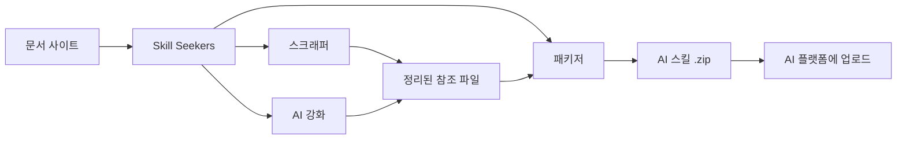

<p align="center">
  
</p>

# Skill Seekers

[English](README.md) | [简体中文](README.zh-CN.md) | [日本語](README.ja.md) | 한국어 | [Español](README.es.md) | [Français](README.fr.md) | [Deutsch](README.de.md) | [Português](README.pt-BR.md) | [Türkçe](README.tr.md) | [العربية](README.ar.md) | [हिन्दी](README.hi.md) | [Русский](README.ru.md)

> ⚠️ **기계 번역 안내**
>
> 이 문서는 AI에 의해 자동 번역되었습니다. 번역 품질 향상을 위해 노력하고 있으나 부정확한 표현이 포함될 수 있습니다.
>
> 번역 개선에 도움을 주시려면 [GitHub Issue #260](https://github.com/yusufkaraaslan/Skill_Seekers/issues/260)에 참여해 주세요! 여러분의 피드백은 매우 소중합니다.

[](https://github.com/yusufkaraaslan/Skill_Seekers/releases)
[](https://opensource.org/licenses/MIT)
[](https://www.python.org/downloads/)
[](https://modelcontextprotocol.io)
[](tests/)
[](https://github.com/users/yusufkaraaslan/projects/2)
[](https://pypi.org/project/skill-seekers/)
[](https://pypi.org/project/skill-seekers/)
[](https://pypi.org/project/skill-seekers/)
[](https://pepy.tech/projects/skill-seekers)
<a href="https://trendshift.io/repositories/18329" target="_blank"></a>
[](https://skillseekersweb.com/)
[](https://x.com/_yUSyUS_)
[](https://github.com/yusufkaraaslan/Skill_Seekers)

**🧠 AI 시스템을 위한 데이터 레이어.** Skill Seekers는 문서 사이트, GitHub 저장소, PDF, 동영상, 노트북, 위키 등 18가지 소스 유형을 구조화된 지식 자산으로 변환합니다. 몇 시간이 아니라 몇 분 만에 AI 스킬(Claude, Gemini, OpenAI), RAG 파이프라인(LangChain, LlamaIndex, Pinecone), AI 코딩 어시스턴트(Cursor, Windsurf, Cline)에 활용할 수 있습니다.

> 🌐 **[SkillSeekersWeb.com 방문하기](https://skillseekersweb.com/)** - 24개 이상의 프리셋 설정을 둘러보고, 설정을 공유하고, 전체 문서에 접근하세요!

> 📋 **[개발 로드맵 및 작업 보기](https://github.com/users/yusufkaraaslan/projects/2)** - 10개 카테고리에 걸친 134개 작업, 원하는 것을 선택하여 기여하세요!

## 🌐 에코시스템

Skill Seekers는 다중 저장소 프로젝트입니다. 각 저장소의 역할:

| 저장소 | 설명 | 링크 |
|--------|------|------|
| **[Skill_Seekers](https://github.com/yusufkaraaslan/Skill_Seekers)** | 핵심 CLI & MCP 서버 (이 저장소) | [PyPI](https://pypi.org/project/skill-seekers/) |
| **[skillseekersweb](https://github.com/yusufkaraaslan/skillseekersweb)** | 웹사이트 & 문서 | [사이트](https://skillseekersweb.com/) |
| **[skill-seekers-configs](https://github.com/yusufkaraaslan/skill-seekers-configs)** | 커뮤니티 설정 저장소 | |
| **[skill-seekers-action](https://github.com/yusufkaraaslan/skill-seekers-action)** | GitHub Action CI/CD | |
| **[skill-seekers-plugin](https://github.com/yusufkaraaslan/skill-seekers-plugin)** | Claude Code 플러그인 | |
| **[homebrew-skill-seekers](https://github.com/yusufkaraaslan/homebrew-skill-seekers)** | macOS Homebrew tap | |

> **기여하고 싶으신가요?** 웹사이트와 설정 저장소는 새 기여자에게 좋은 시작점입니다!

## 🧠 AI 시스템을 위한 데이터 레이어

**Skill Seekers는 범용 전처리 레이어**로, 원시 문서와 이를 활용하는 모든 AI 시스템 사이에 위치합니다. Claude 스킬을 구축하든, LangChain RAG 파이프라인을 만들든, Cursor `.cursorrules` 파일을 작성하든 — 데이터 준비 작업은 동일합니다. 한 번만 수행하면 모든 대상 플랫폼으로 내보낼 수 있습니다.

```bash
# 한 줄 명령 → 구조화된 지식 자산
skill-seekers create https://docs.react.dev/
# 또는: skill-seekers create facebook/react
# 또는: skill-seekers create ./my-project

# 모든 AI 시스템으로 내보내기
skill-seekers package output/react --target claude      # → Claude AI 스킬 (ZIP)
skill-seekers package output/react --target langchain   # → LangChain Documents
skill-seekers package output/react --target llama-index # → LlamaIndex TextNodes
skill-seekers package output/react --target cursor      # → .cursorrules
skill-seekers package output/react --target ibm-bob     # → IBM Bob 스킬 디렉터리
```

### 생성되는 출력물

| 출력 | 대상 | 활용 분야 |
|------|------|----------|
| **Claude 스킬** (ZIP + YAML) | `--target claude` | Claude Code, Claude API |
| **Gemini 스킬** (tar.gz) | `--target gemini` | Google Gemini |
| **OpenAI / Custom GPT** (ZIP) | `--target openai` | GPT-4o, 커스텀 어시스턴트 |
| **LangChain Documents** | `--target langchain` | QA 체인, 에이전트, 리트리버 |
| **LlamaIndex TextNodes** | `--target llama-index` | 쿼리 엔진, 대화 엔진 |
| **Haystack Documents** | `--target haystack` | 엔터프라이즈 RAG 파이프라인 |
| **Pinecone 준비 완료** (Markdown) | `--target markdown` | 벡터 업서트 |
| **ChromaDB / FAISS / Qdrant** | `--target chroma/faiss/qdrant` | 로컬 벡터 데이터베이스 |
| **IBM Bob 스킬** (디렉터리) | `--target ibm-bob` | IBM Bob 프로젝트/전역 스킬 |
| **Cursor** `.cursorrules` | `--target markdown` → SKILL.md 복사 | Cursor IDE `.cursorrules` |
| **Windsurf / Cline / Continue** | `--target claude` → 복사 | VS Code, IntelliJ, Vim |

### Skill Seekers를 선택해야 하는 이유

- ⚡ **99% 더 빠름** — 수일 간의 수동 데이터 준비 → 15–45분
- 🎯 **AI 스킬 품질** — 예제, 패턴, 가이드를 포함한 500줄 이상의 SKILL.md 파일
- 📊 **RAG 준비 완료 청킹** — 코드 블록을 보존하고 컨텍스트를 유지하는 스마트 청킹
- 🎬 **동영상** — YouTube 및 로컬 동영상에서 코드, 자막, 구조화된 지식 추출
- 🔄 **다중 소스** — 18가지 소스 유형(문서, GitHub, PDF, 동영상, 노트북, 위키 등)을 하나의 지식 자산으로 결합
- 🌐 **한 번 준비, 모든 대상으로 내보내기** — 재스크래핑 없이 동일한 자산을 21개 플랫폼으로 내보내기
- ✅ **실전 검증 완료** — 3,700+ 테스트, 24+ 프레임워크 프리셋, 프로덕션 준비 완료

## 🚀 빠른 시작 (3가지 명령어)

```bash
# 1. 설치
pip install skill-seekers

# 2. 모든 소스에서 스킬 생성
skill-seekers create https://docs.django.com/

# 3. AI 플랫폼용으로 패키징
skill-seekers package output/django --target claude
```

**이게 전부입니다!** 바로 사용할 수 있는 `output/django-claude.zip`이 생성됩니다.

```bash
# 강화에 다른 AI 에이전트 사용 (기본값: claude)
skill-seekers create https://docs.django.com/ --agent kimi
skill-seekers create https://docs.django.com/ --agent codex
skill-seekers create https://docs.django.com/ --agent-cmd "my-custom-agent run"
```

### 🛰️ AI 기반 프로젝트 스캔 (신규)

임의의 프로젝트에 `scan`을 실행하면 AI 에이전트가 매니페스트, README, Dockerfile/CI, 샘플링된 소스 import를 읽고 — 감지된 프레임워크별 설정 파일과 자신의 코드를 위한 `<project>-codebase.json`을 생성합니다. 감지된 버전을 고정하므로 재실행 시 버전 변경이 보고됩니다:

```bash
skill-seekers scan ./my-react-app --out ./configs/scanned/
# → react.json, vite.json, tailwind.json, jest.json, my-react-app-codebase.json

# 이후 원하는 것을 빌드
skill-seekers create ./configs/scanned/react.json
```

감지 결과에 기존 프리셋이 없으면 AI가 새 설정을 생성합니다. 종료 시 [커뮤니티 레지스트리](https://github.com/yusufkaraaslan/skill-seekers-configs)에 선택적으로 게시할 수 있습니다.

### 기타 소스 (18가지 지원)

```bash
# GitHub 저장소
skill-seekers create facebook/react

# 로컬 프로젝트
skill-seekers create ./my-project

# PDF 문서
skill-seekers create manual.pdf

# Word 문서
skill-seekers create report.docx

# EPUB 전자책
skill-seekers create book.epub

# Jupyter 노트북
skill-seekers create notebook.ipynb

# OpenAPI 스펙
skill-seekers create openapi.yaml

# PowerPoint 프레젠테이션
skill-seekers create presentation.pptx

# AsciiDoc 문서
skill-seekers create guide.adoc

# 로컬 HTML 파일 (확장자로 자동 감지)
skill-seekers create page.html

# HTML 파일 디렉터리 전체 (HTML 위주 디렉터리 자동 감지)
skill-seekers create ./mirror_output/site/

# 코드가 섞인 디렉터리에서 HTML 모드 강제
skill-seekers create ./repo/ --html-path ./repo/docs/build/html/

# RSS/Atom 피드
skill-seekers create feed.rss

# Man 페이지
skill-seekers create curl.1

# 동영상 (YouTube, Vimeo 또는 로컬 파일 — skill-seekers[video] 필요)
skill-seekers create --video-url https://www.youtube.com/watch?v=... --name mytutorial
# 처음 사용하시나요? GPU 인식 시각 종속성 자동 설치:
skill-seekers create --setup

# Confluence 위키
skill-seekers create --space-key TEAM --name wiki

# Notion 페이지
skill-seekers create --database-id ... --name docs

# Slack/Discord 채팅 내보내기
skill-seekers create --chat-export-path ./slack-export --name team-chat
```

### 어디로든 내보내기

```bash
# 여러 플랫폼용으로 패키징
for platform in claude gemini openai langchain; do
  skill-seekers package output/django --target $platform
done
```

## Skill Seekers란?

Skill Seekers는 **AI 시스템을 위한 데이터 레이어**로, 18가지 소스 유형 — 문서 사이트, GitHub 저장소, PDF, 동영상, Jupyter 노트북, Word/EPUB/AsciiDoc 문서, OpenAPI 스펙, PowerPoint 프레젠테이션, RSS 피드, Man 페이지, Confluence 위키, Notion 페이지, Slack/Discord 내보내기 등 — 을 모든 AI 대상에 적합한 구조화된 지식 자산으로 변환합니다:

| 사용 사례 | 얻을 수 있는 것 | 예시 |
|----------|---------------|------|
| **AI 스킬** | 완전한 SKILL.md + 참조 파일 | Claude Code, Gemini, GPT |
| **RAG 파이프라인** | 풍부한 메타데이터를 포함한 청크 문서 | LangChain, LlamaIndex, Haystack |
| **벡터 데이터베이스** | 업서트 준비 완료된 사전 포맷 데이터 | Pinecone, Chroma, Weaviate, FAISS |
| **AI 코딩 어시스턴트** | IDE AI가 자동으로 읽는 컨텍스트 파일 | Cursor, Windsurf, Cline, Continue.dev |

## 📚 문서

| 원하는 작업 | 읽을 문서 |
|--------------|-----------|
| **빠르게 시작하기** | [빠른 시작](docs/getting-started/02-quick-start.md) - 3가지 명령어로 첫 스킬 만들기 |
| **개념 이해하기** | [핵심 개념](docs/user-guide/01-core-concepts.md) - 작동 원리 |
| **소스 스크래핑** | [스크래핑 가이드](docs/user-guide/02-scraping.md) - 모든 소스 유형 |
| **스킬 강화** | [강화 가이드](docs/user-guide/03-enhancement.md) - AI 강화 |
| **스킬 내보내기** | [패키징 가이드](docs/user-guide/04-packaging.md) - 플랫폼 내보내기 |
| **명령어 찾아보기** | [CLI 레퍼런스](docs/reference/CLI_REFERENCE.md) - 전체 20개 명령어 |
| **설정하기** | [설정 형식](docs/reference/CONFIG_FORMAT.md) - JSON 명세 |
| **문제 해결** | [문제 해결](docs/user-guide/06-troubleshooting.md) - 일반적인 문제 |

**전체 문서:** [docs/README.md](docs/README.md)

Skill Seekers는 수일간의 수동 전처리 작업을 대체합니다:

1. **수집** — 문서, GitHub 저장소, 로컬 코드베이스, PDF, 동영상, 노트북, 위키 등 10가지 이상의 소스 유형
2. **분석** — 심층 AST 파싱, 패턴 감지, API 추출
3. **구조화** — 메타데이터가 포함된 분류된 참조 파일
4. **강화** — AI 기반 SKILL.md 생성 (Claude, Gemini 또는 로컬)
5. **내보내기** — 하나의 자산에서 16개 플랫폼 전용 형식으로 내보내기

## 왜 Skill Seekers를 사용해야 하나요?

### AI 스킬 빌더를 위해 (Claude, Gemini, OpenAI)

- 🎯 **프로덕션급 스킬** — 코드 예제, 패턴, 가이드를 포함한 500줄 이상의 SKILL.md 파일
- 🔄 **강화 워크플로** — `security-focus`, `architecture-comprehensive` 또는 커스텀 YAML 프리셋 적용
- 🎮 **모든 도메인** — 게임 엔진(Godot, Unity), 프레임워크(React, Django), 내부 도구
- 🔧 **팀 협업** — 내부 문서 + 코드를 단일 진실 공급원으로 통합
- 📚 **고품질** — 예제, 빠른 참조, 내비게이션 가이드를 포함한 AI 강화

### RAG 빌더 및 AI 엔지니어를 위해

- 🤖 **RAG 준비 완료 데이터** — 사전 청킹된 LangChain `Documents`, LlamaIndex `TextNodes`, Haystack `Documents`
- 🚀 **99% 더 빠름** — 수일간의 전처리 → 15–45분
- 📊 **스마트 메타데이터** — 카테고리, 소스, 유형 → 더 높은 검색 정확도
- 🔄 **다중 소스** — 하나의 파이프라인에서 문서 + GitHub + PDF + 동영상 결합
- 🌐 **플랫폼 독립적** — 재스크래핑 없이 모든 벡터 DB나 프레임워크로 내보내기

### AI 코딩 어시스턴트 사용자를 위해

- 💻 **Cursor / Windsurf / Cline** — `.cursorrules` / `.windsurfrules` / `.clinerules` 자동 생성
- 🎯 **영구적 컨텍스트** — 반복 프롬프팅 없이 AI가 프레임워크를 "이해"
- 📚 **항상 최신** — 문서 변경 시 몇 분 만에 컨텍스트 업데이트

## 핵심 기능

### 🌐 문서 스크래핑
- ✅ **스마트 SPA 디스커버리** - JavaScript SPA 사이트를 위한 3계층 디스커버리 (sitemap.xml → llms.txt → 헤드리스 브라우저 렌더링)
- ✅ **llms.txt 지원** - LLM 준비 완료 문서 파일 자동 감지 및 사용 (10배 빠름)
- ✅ **범용 스크래퍼** - 모든 문서 사이트에서 작동
- ✅ **스마트 분류** - 주제별 자동 콘텐츠 정리
- ✅ **코드 언어 감지** - Python, JavaScript, C++, GDScript 등 인식
- ✅ **24+ 즉시 사용 가능 프리셋** - Godot, React, Vue, Django, FastAPI 등

### 📄 PDF 지원
- ✅ **기본 PDF 추출** - PDF에서 텍스트, 코드, 이미지 추출
- ✅ **스캔 PDF OCR** - 스캔 문서에서 텍스트 추출
- ✅ **비밀번호 보호 PDF** - 암호화된 PDF 처리
- ✅ **표 추출** - 복잡한 표 추출
- ✅ **병렬 처리** - 대용량 PDF 3배 빠른 처리
- ✅ **지능형 캐싱** - 재실행 시 50% 빠름

### 🎬 동영상 추출
- ✅ **YouTube 및 로컬 동영상** - 동영상에서 자막, 화면 속 코드, 구조화된 지식 추출
- ✅ **시각 프레임 분석** - 코드 편집기, 터미널, 슬라이드, 다이어그램의 OCR 추출
- ✅ **GPU 자동 감지** - 올바른 PyTorch 빌드 자동 설치 (CUDA/ROCm/MPS/CPU)
- ✅ **AI 강화** - 2단계: OCR 정리 + 완성도 높은 SKILL.md 생성
- ✅ **시간 클리핑** - `--start-time`과 `--end-time`으로 특정 구간 추출
- ✅ **재생 목록 지원** - YouTube 재생 목록의 모든 동영상 일괄 처리
- ✅ **Vision API 폴백** - 낮은 신뢰도 OCR 프레임에 Claude Vision 사용

### 🐙 GitHub 저장소 분석
- ✅ **심층 코드 분석** - Python, JavaScript, TypeScript, Java, C++, Go AST 파싱
- ✅ **API 추출** - 함수, 클래스, 메서드의 매개변수 및 타입
- ✅ **저장소 메타데이터** - README, 파일 트리, 언어 통계, 스타/포크 수
- ✅ **GitHub Issues 및 PR** - 라벨과 마일스톤이 포함된 이슈 가져오기
- ✅ **CHANGELOG 및 릴리스** - 버전 히스토리 자동 추출
- ✅ **충돌 감지** - 문서화된 API와 실제 코드 구현 비교
- ✅ **MCP 통합** - 자연어: "GitHub 저장소 facebook/react 스크래핑"

### 🔄 통합 다중 소스 스크래핑
- ✅ **다중 소스 결합** - 하나의 스킬에서 문서 + GitHub + PDF 혼합
- ✅ **충돌 감지** - 문서와 코드 간의 불일치 자동 발견
- ✅ **지능형 병합** - 규칙 기반 또는 AI 기반 충돌 해결
- ✅ **투명한 보고** - ⚠️ 경고가 포함된 나란히 비교
- ✅ **문서 갭 분석** - 오래된 문서와 미문서화 기능 식별
- ✅ **단일 진실 공급원** - 의도(문서)와 현실(코드)을 동시에 보여주는 하나의 스킬
- ✅ **하위 호환** - 레거시 단일 소스 설정 계속 작동

### 🤖 다중 LLM 플랫폼 지원
- ✅ **12개 LLM 플랫폼** - Claude AI, Google Gemini, OpenAI ChatGPT, MiniMax AI, 범용 Markdown, OpenCode, Kimi (Moonshot AI), DeepSeek AI, Qwen (Alibaba), OpenRouter, Together AI, Fireworks AI
- ✅ **범용 스크래핑** - 동일한 문서가 모든 플랫폼에 적용
- ✅ **플랫폼별 패키징** - 각 LLM에 최적화된 형식
- ✅ **원커맨드 내보내기** - `--target` 플래그로 플랫폼 선택
- ✅ **선택적 종속성** - 필요한 것만 설치
- ✅ **100% 하위 호환** - 기존 Claude 워크플로 변경 불필요

| 플랫폼 | 형식 | 업로드 | 강화 | API Key | 커스텀 엔드포인트 |
|--------|------|--------|------|---------|-----------------|
| **Claude AI** | ZIP + YAML | ✅ 자동 | ✅ 예 | ANTHROPIC_API_KEY | ANTHROPIC_BASE_URL |
| **Google Gemini** | tar.gz | ✅ 자동 | ✅ 예 | GOOGLE_API_KEY | - |
| **OpenAI ChatGPT** | ZIP + Vector Store | ✅ 자동 | ✅ 예 | OPENAI_API_KEY | - |
| **MiniMax AI** | ZIP + Knowledge Files | ✅ 자동 | ✅ 예 | MINIMAX_API_KEY | - |
| **범용 Markdown** | ZIP | ❌ 수동 | ❌ 아니오 | - | - |

```bash
# Claude (기본값 - 변경 불필요!)
skill-seekers package output/react/
skill-seekers upload react.zip

# Google Gemini
pip install skill-seekers[gemini]
skill-seekers package output/react/ --target gemini
skill-seekers upload react-gemini.tar.gz --target gemini

# OpenAI ChatGPT
pip install skill-seekers[openai]
skill-seekers package output/react/ --target openai
skill-seekers upload react-openai.zip --target openai

# MiniMax AI
pip install skill-seekers[minimax]
skill-seekers package output/react/ --target minimax
skill-seekers upload react-minimax.zip --target minimax

# 범용 Markdown (범용 내보내기)
skill-seekers package output/react/ --target markdown
# Markdown 파일은 어떤 LLM에서든 직접 사용 가능
```

<details>
<summary>🔧 <strong>자신만의 AI 제공자 사용 (OpenAI 호환 엔드포인트 + 구독, Anthropic 크레딧 불필요)</strong></summary>

선택적 AI **강화** 단계(`create`, `scan`, `enhance`에서 사용)에는 Anthropic 키가 **필요하지 않습니다**. 세 가지 방법으로 실행할 수 있습니다:

**1. 이미 결제 중인 구독 사용 — API 크레딧 전혀 불필요 (LOCAL 에이전트 모드)**

Skill Seekers는 이미 로그인되어 있는 코딩 에이전트 CLI를 호출할 수 있어, 종량제 API 토큰 대신 기존 요금제로 강화를 실행합니다:

```bash
skill-seekers create <source> --agent codex     # OpenAI Codex CLI → ChatGPT Plus 요금제
skill-seekers create <source> --agent claude    # Claude Code      → Claude Pro/Max 요금제
```

지원되는 에이전트: `claude`, `codex`, `copilot`, `opencode`, `kimi`, `custom`
(`--agent custom`을 `--agent-cmd "<your-cli> ..."`와 조합하면 다른 어떤 도구도 사용 가능).

**2. 모든 OpenAI 호환 제공자 (OpenRouter, Groq, Cerebras, Mistral, NVIDIA NIM 등)**

이들은 모두 OpenAI 호환 `/v1` 엔드포인트를 제공합니다. 환경 변수 세 개만 설정하면 됩니다 — Skill Seekers가 `OPENAI_API_KEY`를 감지하고, OpenAI SDK는 `OPENAI_BASE_URL`을 자동으로 인식합니다:

```bash
export OPENAI_API_KEY="<your provider key>"
export OPENAI_BASE_URL="https://openrouter.ai/api/v1"   # 제공자 엔드포인트 (아래 표 참조)
export OPENAI_MODEL="<a model that provider offers>"     # 필수 — 기본값 gpt-4o는 다른 제공자에 존재하지 않습니다
skill-seekers create <source>
```

| 제공자       | `OPENAI_BASE_URL`                          |
|--------------|--------------------------------------------|
| OpenRouter   | `https://openrouter.ai/api/v1`             |
| Groq         | `https://api.groq.com/openai/v1`           |
| Cerebras     | `https://api.cerebras.ai/v1`               |
| Mistral      | `https://api.mistral.ai/v1`                |
| NVIDIA NIM   | `https://integrate.api.nvidia.com/v1`      |

> 제공자 감지는 **첫 번째로** 발견되는 API 키 환경 변수를 선택합니다 (`ANTHROPIC_API_KEY` → `GOOGLE_API_KEY` → `OPENAI_API_KEY` → `MOONSHOT_API_KEY`). 특정 제공자를 강제하려면 `SKILL_SEEKER_PROVIDER`를 설정하거나, 우선순위가 높은 키가 설정되어 있지 않은지 확인하세요.

**3. Claude 호환 엔드포인트 (예: GLM, 프록시)**

```bash
export ANTHROPIC_API_KEY="your-key"
export ANTHROPIC_BASE_URL="https://your-claude-compatible-endpoint/v1"
```

Google Gemini(`GOOGLE_API_KEY`)와 Kimi/Moonshot(`MOONSHOT_API_KEY`)도 기본적으로 지원됩니다. 제공자별 모델 재정의를 포함한 전체 목록은 **[환경 변수 레퍼런스](docs/reference/ENVIRONMENT_VARIABLES.md#llm-provider-selection)**를 참조하세요.

</details>

**설치:**
```bash
# Gemini 지원 설치
pip install skill-seekers[gemini]

# OpenAI 지원 설치
pip install skill-seekers[openai]

# MiniMax 지원 설치
pip install skill-seekers[minimax]

# 모든 LLM 플랫폼 설치
pip install skill-seekers[all-llms]
```

### 🔗 RAG 프레임워크 통합

- ✅ **LangChain Documents** - `page_content` + 메타데이터가 포함된 `Document` 형식으로 직접 내보내기
  - 적합: QA 체인, 리트리버, 벡터 스토어, 에이전트
  - 예제: [LangChain RAG 파이프라인](examples/langchain-rag-pipeline/)
  - 가이드: [LangChain 통합](docs/integrations/LANGCHAIN.md)

- ✅ **LlamaIndex TextNodes** - 고유 ID + 임베딩이 포함된 `TextNode` 형식으로 내보내기
  - 적합: 쿼리 엔진, 대화 엔진, 스토리지 컨텍스트
  - 예제: [LlamaIndex 쿼리 엔진](examples/llama-index-query-engine/)
  - 가이드: [LlamaIndex 통합](docs/integrations/LLAMA_INDEX.md)

- ✅ **Pinecone 준비 완료 형식** - 벡터 데이터베이스 업서트에 최적화
  - 적합: 프로덕션 벡터 검색, 시맨틱 검색, 하이브리드 검색
  - 예제: [Pinecone 업서트](examples/pinecone-upsert/)
  - 가이드: [Pinecone 통합](docs/integrations/PINECONE.md)

**빠른 내보내기:**
```bash
# LangChain Documents (JSON)
skill-seekers package output/django --target langchain
# → output/django-langchain.json

# LlamaIndex TextNodes (JSON)
skill-seekers package output/django --target llama-index
# → output/django-llama-index.json

# Markdown (범용)
skill-seekers package output/django --target markdown
# → output/django-markdown/SKILL.md + references/
```

**전체 RAG 파이프라인 가이드:** [RAG 파이프라인 문서](docs/integrations/RAG_PIPELINES.md)

---

### 🧠 AI 코딩 어시스턴트 통합

모든 프레임워크 문서를 4개 이상의 AI 어시스턴트를 위한 전문 코딩 컨텍스트로 변환합니다:

- ✅ **Cursor IDE** - AI 기반 코드 제안을 위한 `.cursorrules` 생성
  - 적합: 프레임워크별 코드 생성, 일관된 코딩 패턴
  - 지원 도구: Cursor IDE (VS Code 포크)
  - 가이드: [Cursor 통합](docs/integrations/CURSOR.md)
  - 예제: [Cursor React 스킬](examples/cursor-react-skill/)

- ✅ **Windsurf** - `.windsurfrules`로 Windsurf AI 어시스턴트 컨텍스트 커스터마이징
  - 적합: IDE 네이티브 AI 지원, 플로우 기반 코딩
  - 지원 도구: Codeium의 Windsurf IDE
  - 가이드: [Windsurf 통합](docs/integrations/WINDSURF.md)
  - 예제: [Windsurf FastAPI 컨텍스트](examples/windsurf-fastapi-context/)

- ✅ **Cline (VS Code)** - VS Code 에이전트를 위한 시스템 프롬프트 + MCP
  - 적합: VS Code에서의 에이전틱 코드 생성
  - 지원 도구: VS Code용 Cline 확장
  - 가이드: [Cline 통합](docs/integrations/CLINE.md)
  - 예제: [Cline Django 어시스턴트](examples/cline-django-assistant/)

- ✅ **Continue.dev** - IDE에 구애받지 않는 AI 컨텍스트 서버
  - 적합: 멀티 IDE 환경(VS Code, JetBrains, Vim), 커스텀 LLM 제공자
  - 지원 도구: Continue.dev 플러그인이 있는 모든 IDE
  - 가이드: [Continue 통합](docs/integrations/CONTINUE_DEV.md)
  - 예제: [Continue 범용 컨텍스트](examples/continue-dev-universal/)

**AI 코딩 도구를 위한 빠른 내보내기:**
```bash
# 모든 AI 코딩 어시스턴트에 적용 (Cursor, Windsurf, Cline, Continue.dev)
skill-seekers create --config configs/django.json
skill-seekers package output/django --target claude  # 또는 --target markdown

# 프로젝트에 복사 (Cursor 예시)
cp output/django-claude/SKILL.md my-project/.cursorrules

# 또는 Windsurf용
cp output/django-claude/SKILL.md my-project/.windsurf/rules/django.md

# 또는 Cline용
cp output/django-claude/SKILL.md my-project/.clinerules

# 또는 Continue.dev용 (HTTP 서버)
python examples/continue-dev-universal/context_server.py
# ~/.continue/config.json에서 설정
```

**통합 허브:** [모든 AI 시스템 통합](docs/integrations/INTEGRATIONS.md)

---

### 🌊 3-스트림 GitHub 아키텍처
- ✅ **3-스트림 분석** - GitHub 저장소를 코드, 문서, 인사이트 스트림으로 분할
- ✅ **통합 코드베이스 분석기** - GitHub URL과 로컬 경로 모두 지원
- ✅ **C3.x 분석 깊이** - 'basic' (1–2분) 또는 'c3x' (20–60분) 분석 선택
- ✅ **향상된 라우터 생성** - GitHub 메타데이터, README 빠른 시작, 자주 발생하는 문제
- ✅ **Issue 통합** - GitHub Issues의 주요 문제 및 해결책
- ✅ **스마트 라우팅 키워드** - GitHub 라벨 가중치 2배로 주제 감지 향상

**3-스트림 설명:**
- **스트림 1: 코드** - 심층 C3.x 분석 (패턴, 예제, 가이드, 설정, 아키텍처)
- **스트림 2: 문서** - 저장소 문서 (README, CONTRIBUTING, docs/*.md)
- **스트림 3: 인사이트** - 커뮤니티 지식 (Issues, 라벨, Stars, Forks)

```python
from skill_seekers.cli.unified_codebase_analyzer import UnifiedCodebaseAnalyzer

# 3-스트림으로 GitHub 저장소 분석
analyzer = UnifiedCodebaseAnalyzer()
result = analyzer.analyze(
    source="https://github.com/facebook/react",
    depth="c3x",  # 또는 "basic"으로 빠른 분석
    fetch_github_metadata=True
)

# 코드 스트림 접근 (C3.x 분석)
print(f"디자인 패턴: {len(result.code_analysis['c3_1_patterns'])}")
print(f"테스트 예제: {result.code_analysis['c3_2_examples_count']}")

# 문서 스트림 접근 (저장소 문서)
print(f"README: {result.github_docs['readme'][:100]}")

# 인사이트 스트림 접근 (GitHub 메타데이터)
print(f"Stars: {result.github_insights['metadata']['stars']}")
print(f"일반적인 문제: {len(result.github_insights['common_problems'])}")
```

**전체 문서**: [3-스트림 구현 요약](docs/archive/historical/IMPLEMENTATION_SUMMARY_THREE_STREAM.md)

### 🔐 스마트 속도 제한 관리 및 설정
- ✅ **다중 토큰 설정 시스템** - 여러 GitHub 계정 관리 (개인, 업무, 오픈소스)
  - `~/.config/skill-seekers/config.json`에 보안 설정 저장 (권한 600)
  - 프로필별 속도 제한 전략: `prompt`, `wait`, `switch`, `fail`
  - 프로필별 타임아웃 설정 (기본값: 30분, 무한 대기 방지)
  - 스마트 폴백 체인: CLI 인자 → 환경 변수 → 설정 파일 → 프롬프트
  - Claude, Gemini, OpenAI를 위한 API Key 관리
- ✅ **대화형 설정 마법사** - 아름다운 터미널 UI로 쉬운 설정
  - 토큰 생성을 위한 브라우저 통합 (GitHub 등을 자동으로 열기)
  - 토큰 유효성 검사 및 연결 테스트
  - 색상 코드가 적용된 시각적 상태 표시
- ✅ **지능형 속도 제한 핸들러** - 더 이상 무한 대기 없음!
  - 속도 제한(시간당 60회 vs 5000회)에 대한 사전 경고
  - GitHub API 응답에서 실시간 감지
  - 진행 상황이 표시되는 실시간 카운트다운 타이머
  - 속도 제한 시 자동 프로필 전환
  - 4가지 전략: prompt (질문), wait (카운트다운), switch (전환), fail (중단)
- ✅ **중단점 재개** - 중단된 작업 계속하기
  - 설정 가능한 간격으로 진행 상황 자동 저장 (기본값: 60초)
  - 재개 가능한 모든 작업을 진행 상황과 함께 나열
  - 오래된 작업 자동 정리 (기본값: 7일)
- ✅ **CI/CD 지원** - 자동화를 위한 비대화형 모드
  - `--non-interactive` 플래그로 프롬프트 없이 빠른 실패
  - `--profile` 플래그로 특정 GitHub 계정 선택
  - 파이프라인 로그를 위한 명확한 오류 메시지

**빠른 설정:**
```bash
# 일회성 설정 (5분)
skill-seekers config --github

# 프라이빗 저장소에 특정 프로필 사용
skill-seekers create mycompany/private-repo --profile work

# CI/CD 모드 (즉시 실패, 프롬프트 없음)
skill-seekers create owner/repo --non-interactive

# 중단된 작업 재개
skill-seekers resume --list
skill-seekers resume github_react_20260117_143022
```

**속도 제한 전략 설명:**
- **prompt** (기본값) - 속도 제한 시 무엇을 할지 질문 (대기, 전환, 토큰 설정, 취소)
- **wait** - 카운트다운 타이머와 함께 자동 대기 (타임아웃 준수)
- **switch** - 사용 가능한 다음 프로필 자동 시도 (다중 계정 구성용)
- **fail** - 명확한 오류와 함께 즉시 실패 (CI/CD에 최적)

### 🎯 부트스트랩 스킬 - 셀프 호스팅

skill-seekers 자체를 스킬로 생성하여 AI 에이전트(Claude Code, Kimi, Codex 등) 내에서 사용할 수 있습니다:

```bash
# 스킬 생성
./scripts/bootstrap_skill.sh

# Claude Code에 설치
cp -r output/skill-seekers ~/.claude/skills/
```

**얻을 수 있는 것:**
- ✅ **완전한 스킬 문서** - 모든 CLI 명령어와 사용 패턴
- ✅ **CLI 명령어 레퍼런스** - 모든 도구와 옵션 문서화
- ✅ **빠른 시작 예제** - 일반적인 워크플로와 모범 사례
- ✅ **자동 생성 API 문서** - 코드 분석, 패턴, 예제

### 🔐 프라이빗 설정 저장소
- ✅ **Git 기반 설정 소스** - 프라이빗/팀 Git 저장소에서 설정 가져오기
- ✅ **다중 소스 관리** - 무제한 GitHub, GitLab, Bitbucket 저장소 등록
- ✅ **팀 협업** - 3–5인 팀 간 커스텀 설정 공유
- ✅ **엔터프라이즈 지원** - 우선순위 기반 해석으로 500명 이상의 개발자까지 확장
- ✅ **보안 인증** - 환경 변수 토큰 (GITHUB_TOKEN, GITLAB_TOKEN)
- ✅ **지능형 캐싱** - 한 번 클론하면 업데이트는 자동으로 가져오기
- ✅ **오프라인 모드** - 오프라인 시 캐시된 설정으로 작업

### 🤖 코드베이스 분석 (C3.x)

**C3.4: 설정 패턴 추출 (AI 강화 포함)**
- ✅ **9가지 설정 형식** - JSON, YAML, TOML, ENV, INI, Python, JavaScript, Dockerfile, Docker Compose
- ✅ **7가지 패턴 유형** - 데이터베이스, API, 로깅, 캐시, 이메일, 인증, 서버 설정
- ✅ **AI 강화** - 선택적 듀얼 모드 AI 분석 (API + LOCAL)
  - 각 설정이 무엇을 하는지 설명
  - 모범 사례와 개선 사항 제안
  - **보안 분석** - 하드코딩된 시크릿과 노출된 자격 증명 탐지
- ✅ **자동 문서화** - 모든 설정의 JSON + Markdown 문서 생성
- ✅ **MCP 통합** - 강화 지원이 포함된 `extract_config_patterns` 도구

**C3.3: AI 강화 사용 가이드**
- ✅ **종합 AI 강화** - 기본 가이드를 전문 튜토리얼로 변환
- ✅ **5가지 자동 개선** - 단계 설명, 문제 해결, 전제 조건, 다음 단계, 사용 사례
- ✅ **듀얼 모드 지원** - API 모드 (Claude API) 또는 LOCAL 모드 (Claude Code CLI)
- ✅ **LOCAL 모드 무료** - Claude Code Max 플랜으로 무료 강화
- ✅ **품질 변환** - 75줄 템플릿 → 500줄 이상의 종합 가이드

**사용법:**
```bash
# 빠른 분석 (1–2분, 기본 기능만)
skill-seekers scan tests/ --quick

# 종합 분석 (AI 포함, 20–60분)
skill-seekers scan tests/ --comprehensive

# AI 강화 포함
skill-seekers scan tests/ --enhance
```

**전체 문서:** [docs/features/HOW_TO_GUIDES.md](docs/features/HOW_TO_GUIDES.md#ai-enhancement-new)

### 🔄 강화 워크플로 프리셋

AI가 원시 문서를 세련된 스킬로 변환하는 방법을 제어하는 재사용 가능한 YAML 정의 강화 파이프라인입니다.

- ✅ **5개 내장 프리셋** — `default`, `minimal`, `security-focus`, `architecture-comprehensive`, `api-documentation`
- ✅ **사용자 정의 프리셋** — `~/.config/skill-seekers/workflows/`에 커스텀 워크플로 추가
- ✅ **다중 워크플로 체이닝** — 하나의 명령에서 두 개 이상의 워크플로 체이닝
- ✅ **완전한 CLI 관리** — 목록, 조회, 복사, 추가, 삭제, 유효성 검사

```bash
# 단일 워크플로 적용
skill-seekers create ./my-project --enhance-workflow security-focus

# 다중 워크플로 체이닝 (순서대로 적용)
skill-seekers create ./my-project \
  --enhance-workflow security-focus \
  --enhance-workflow minimal

# 프리셋 관리
skill-seekers workflows list                          # 모든 항목 나열 (내장 + 사용자)
skill-seekers workflows show security-focus           # YAML 내용 출력
skill-seekers workflows copy security-focus           # 편집을 위해 사용자 디렉터리에 복사
skill-seekers workflows add ./my-workflow.yaml        # 커스텀 프리셋 설치
skill-seekers workflows remove my-workflow            # 사용자 프리셋 삭제
skill-seekers workflows validate security-focus       # 프리셋 구조 유효성 검사

# 여러 개 동시 복사
skill-seekers workflows copy security-focus minimal api-documentation

# 여러 파일 동시 추가
skill-seekers workflows add ./wf-a.yaml ./wf-b.yaml

# 여러 개 동시 삭제
skill-seekers workflows remove my-wf-a my-wf-b
```

**YAML 프리셋 형식:**
```yaml
name: security-focus
description: "보안 중심 검토: 취약점, 인증, 데이터 처리"
version: "1.0"
stages:
  - name: vulnerabilities
    type: custom
    prompt: "OWASP Top 10 및 일반적인 보안 취약점 검토..."
  - name: auth-review
    type: custom
    prompt: "인증 및 권한 부여 패턴 검사..."
    uses_history: true
```

### ⚡ 성능 및 확장성
- ✅ **비동기 모드** - async/await로 2–3배 빠른 스크래핑 (`--async` 플래그 사용)
- ✅ **대규모 문서 지원** - 지능형 분할로 10K–40K+ 페이지 문서 처리
- ✅ **라우터/허브 스킬** - 전문 서브 스킬로의 지능형 라우팅
- ✅ **병렬 스크래핑** - 여러 스킬 동시 처리
- ✅ **체크포인트/재개** - 장시간 스크래핑에서 진행 상황 손실 방지
- ✅ **캐싱 시스템** - 한 번 스크래핑, 즉시 재구축

### 🤖 에이전트 무관 스킬 생성
- ✅ **다중 에이전트 지원** - `--agent` 플래그로 Claude, Kimi, Codex, Copilot, OpenCode 또는 모든 커스텀 에이전트용 스킬 생성
- ✅ **커스텀 에이전트 명령어** - `--agent-cmd`로 강화에 사용할 커스텀 에이전트 CLI 명령어 지정
- ✅ **범용 플래그** - `--agent`와 `--agent-cmd`는 모든 명령어(create, scrape, github, pdf 등)에서 사용 가능

### 📦 마켓플레이스 파이프라인
- ✅ **마켓플레이스에 게시** - Claude Code 플러그인 마켓플레이스 저장소에 스킬 게시
- ✅ **엔드투엔드 파이프라인** - 문서 소스에서 게시된 마켓플레이스 항목까지

### ✅ 품질 보증
- ✅ **완전한 테스트** - 3,700+ 테스트, 포괄적 커버리지

---

## 📦 설치

```bash
# 기본 설치 (문서 스크래핑, GitHub 분석, PDF, 패키징)
pip install skill-seekers

# 모든 LLM 플랫폼 지원 포함
pip install skill-seekers[all-llms]

# MCP 서버 포함
pip install skill-seekers[mcp]

# 전체 기능
pip install skill-seekers[all]
```

**선택에 도움이 필요하신가요?** 설정 마법사를 실행하세요:
```bash
skill-seekers-setup
```

### 설치 옵션

| 설치 명령 | 기능 |
|----------|------|
| `pip install skill-seekers` | 스크래핑, GitHub 분석, PDF, 모든 플랫폼 |
| `pip install skill-seekers[gemini]` | + Google Gemini 지원 |
| `pip install skill-seekers[openai]` | + OpenAI ChatGPT 지원 |
| `pip install skill-seekers[all-llms]` | + 모든 LLM 플랫폼 |
| `pip install skill-seekers[mcp]` | + Claude Code, Cursor 등을 위한 MCP 서버 |
| `pip install skill-seekers[video]` | + YouTube/Vimeo 자막 및 메타데이터 추출 |
| `pip install skill-seekers[video-full]` | + Whisper 전사 및 시각 프레임 추출 |
| `pip install skill-seekers[jupyter]` | + Jupyter 노트북 지원 |
| `pip install skill-seekers[pptx]` | + PowerPoint 지원 |
| `pip install skill-seekers[confluence]` | + Confluence 위키 지원 |
| `pip install skill-seekers[notion]` | + Notion 페이지 지원 |
| `pip install skill-seekers[rss]` | + RSS/Atom 피드 지원 |
| `pip install skill-seekers[chat]` | + Slack/Discord 채팅 내보내기 지원 |
| `pip install skill-seekers[asciidoc]` | + AsciiDoc 문서 지원 |
| `pip install skill-seekers[all]` | 모든 기능 활성화 |

> **동영상 시각 종속성 (GPU 인식):** `skill-seekers[video-full]` 설치 후,
> `skill-seekers create --setup`을 실행하여 GPU를 자동 감지하고 올바른 PyTorch
> 빌드 + easyocr을 설치하세요. 이것이 시각 추출 종속성 설치의 권장 방법입니다.

---

## 🚀 원커맨드 설치 워크플로

**설정에서 업로드된 스킬까지 가장 빠른 방법 — 완전 자동화:**

```bash
# 공식 설정에서 React 스킬 설치 (Claude에 자동 업로드)
skill-seekers install --config react

# 로컬 설정 파일에서 설치
skill-seekers install --config configs/custom.json

# 업로드 없이 설치 (패키징만)
skill-seekers install --config django --no-upload

# 실행 없이 워크플로 미리보기
skill-seekers install --config react --dry-run
```

**소요 시간:** 총 20–45분 | **품질:** 프로덕션 준비 완료 (9/10) | **비용:** 무료

**실행 단계:**
```
📥 단계 1: 설정 가져오기 (설정 이름이 제공된 경우)
📖 단계 2: 문서 스크래핑
✨ 단계 3: AI 강화 (필수 - 건너뛰기 불가)
📦 단계 4: 스킬 패키징
☁️  단계 5: Claude에 업로드 (선택사항, API Key 필요)
```

**요구 사항:**
- ANTHROPIC_API_KEY 환경 변수 (자동 업로드용)
- Claude Code Max 플랜 (로컬 AI 강화용), 또는 `--agent`로 다른 AI 에이전트 선택

---

## 📊 기능 매트릭스

Skill Seekers는 **12개 LLM 플랫폼**, **8개 RAG/벡터 대상**, **18가지 소스 유형**을 지원하며 모든 대상에서 완전한 기능 동등성을 제공합니다.

**플랫폼:** Claude AI, Google Gemini, OpenAI ChatGPT, MiniMax AI, 범용 Markdown, OpenCode, Kimi (Moonshot AI), DeepSeek AI, Qwen (Alibaba), OpenRouter, Together AI, Fireworks AI
**소스 유형:** 문서 사이트, GitHub 저장소, PDF, Word (.docx), EPUB, 동영상, 로컬 코드베이스, Jupyter 노트북, 로컬 HTML, OpenAPI/Swagger, AsciiDoc, PowerPoint (.pptx), RSS/Atom 피드, Man 페이지, Confluence 위키, Notion 페이지, Slack/Discord 채팅 내보내기

전체 내용은 [전체 기능 매트릭스](docs/reference/FEATURE_MATRIX.md)를 참조하세요.

### 빠른 플랫폼 비교

| 기능 | Claude | Gemini | OpenAI | MiniMax | Markdown |
|------|--------|--------|--------|---------|----------|
| 형식 | ZIP + YAML | tar.gz | ZIP + Vector | ZIP + Knowledge | ZIP |
| 업로드 | ✅ API | ✅ API | ✅ API | ✅ API | ❌ 수동 |
| 강화 | ✅ Sonnet 4 | ✅ 2.0 Flash | ✅ GPT-4o | ✅ M3 | ❌ 없음 |
| 모든 스킬 모드 | ✅ | ✅ | ✅ | ✅ | ✅ |

---

## 사용 예제

### 문서 스크래핑

```bash
# 문서 사이트 스크래핑
skill-seekers create --config configs/react.json

# 설정 없이 빠른 스크래핑
skill-seekers create https://react.dev --name react

# 비동기 모드 (3배 빠름)
skill-seekers create --config configs/godot.json --async --workers 8

# 강화에 특정 AI 에이전트 사용
skill-seekers create --config configs/react.json --agent kimi
```

### PDF 추출

```bash
# 기본 PDF 추출
skill-seekers create --pdf docs/manual.pdf --name myskill

# 고급 기능
skill-seekers create --pdf docs/manual.pdf --name myskill \
    --extract-tables \        # 표 추출
    --parallel \              # 빠른 병렬 처리
    --workers 8               # 8개 CPU 코어 사용

# 스캔 PDF (필요: pip install pytesseract Pillow)
skill-seekers create --pdf docs/scanned.pdf --name myskill --ocr
```

### 동영상 추출

```bash
# 동영상 지원 설치
pip install skill-seekers[video]        # 자막 + 메타데이터
pip install skill-seekers[video-full]   # + Whisper 전사 + 시각 프레임 추출

# GPU 자동 감지 및 시각 종속성 설치 (PyTorch + easyocr)
skill-seekers create --setup

# YouTube 동영상에서 추출
skill-seekers create --video-url https://www.youtube.com/watch?v=dQw4w9WgXcQ --name mytutorial

# YouTube 재생 목록에서 추출
skill-seekers create --video-playlist https://www.youtube.com/playlist?list=... --name myplaylist

# 로컬 동영상 파일에서 추출
skill-seekers create --video-file recording.mp4 --name myrecording

# 시각 프레임 분석으로 추출 (video-full 종속성 필요)
skill-seekers create --video-url https://www.youtube.com/watch?v=... --name mytutorial --visual

# AI 강화 적용 (OCR 정리 + 완성도 높은 SKILL.md 생성)
skill-seekers create --video-url https://www.youtube.com/watch?v=... --visual --enhance-level 2

# 동영상의 특정 구간 클리핑 (초, MM:SS, HH:MM:SS 형식 지원)
skill-seekers create --video-url https://www.youtube.com/watch?v=... --start-time 1:30 --end-time 5:00

# 낮은 신뢰도 OCR 프레임에 Vision API 사용 (ANTHROPIC_API_KEY 필요)
skill-seekers create --video-url https://www.youtube.com/watch?v=... --visual --vision-ocr

# 이전에 추출된 데이터에서 스킬 재구축 (다운로드 건너뛰기)
skill-seekers create --from-json output/mytutorial/video_data/extracted_data.json --name mytutorial
```

> **전체 가이드:** [docs/VIDEO_GUIDE.md](docs/VIDEO_GUIDE.md)에서 전체 CLI 레퍼런스,
> 시각 파이프라인 상세 정보, AI 강화 옵션, 문제 해결을 확인하세요.

### GitHub 저장소 분석

```bash
# 기본 저장소 스크래핑
skill-seekers create facebook/react

# 인증 설정 (더 높은 속도 제한)
export GITHUB_TOKEN=ghp_your_token_here
skill-seekers create facebook/react

# 포함 내용 커스터마이징
skill-seekers create django/django \
    --include-issues \        # GitHub Issues 추출
    --max-issues 100 \        # Issue 수 제한
    --include-changelog       # CHANGELOG.md 추출
```

### 통합 다중 소스 스크래핑

**문서 + GitHub + PDF를 충돌 감지가 포함된 하나의 통합 스킬로 결합:**

```bash
# 기존 통합 설정 사용
skill-seekers create --config configs/react_unified.json
skill-seekers create --config configs/django_unified.json

# 또는 통합 설정 생성
cat > configs/myframework_unified.json << 'EOF'
{
  "name": "myframework",
  "merge_mode": "rule-based",
  "sources": [
    {
      "type": "documentation",
      "base_url": "https://docs.myframework.com/",
      "max_pages": 200
    },
    {
      "type": "github",
      "repo": "owner/myframework",
      "code_analysis_depth": "surface"
    }
  ]
}
EOF

skill-seekers create --config configs/myframework_unified.json
```

**충돌 감지가 자동으로 발견하는 항목:**
- 🔴 **코드에 누락** (높음): 문서화되었으나 미구현
- 🟡 **문서에 누락** (중간): 구현되었으나 미문서화
- ⚠️ **시그니처 불일치**: 매개변수/타입 차이
- ℹ️ **설명 불일치**: 설명 차이

**전체 가이드:** [docs/features/UNIFIED_SCRAPING.md](docs/features/UNIFIED_SCRAPING.md) 참조.

### 프라이빗 설정 저장소

**프라이빗 Git 저장소를 사용하여 팀 간 커스텀 설정 공유:**

```bash
# 옵션 1: MCP 도구 사용 (권장)
# 팀 프라이빗 저장소 등록
add_config_source(
    name="team",
    git_url="https://github.com/mycompany/skill-configs.git",
    token_env="GITHUB_TOKEN"
)

# 팀 저장소에서 설정 가져오기
fetch_config(source="team", config_name="internal-api")
```

**지원 플랫폼:**
- GitHub (`GITHUB_TOKEN`), GitLab (`GITLAB_TOKEN`), Gitea (`GITEA_TOKEN`), Bitbucket (`BITBUCKET_TOKEN`)

**전체 가이드:** [docs/reference/GIT_CONFIG_SOURCES.md](docs/reference/GIT_CONFIG_SOURCES.md) 참조.

## 작동 원리



0. **llms.txt 감지** - llms-full.txt, llms.txt, llms-small.txt를 우선 확인 (스마트 SPA 디스커버리의 일부)
1. **스크래핑**: 문서의 모든 페이지 추출
2. **분류**: 콘텐츠를 주제별로 정리 (API, 가이드, 튜토리얼 등)
3. **강화**: AI가 문서를 분석하고 예제가 포함된 종합적인 SKILL.md 생성 (`--agent`로 여러 에이전트 지원)
4. **패키징**: 모든 내용을 플랫폼 준비 완료된 `.zip` 파일로 번들링

## 아키텍처

시스템은 **8개 핵심 모듈**과 **5개 유틸리티 모듈**(총 약 200개 클래스)로 구성되어 있습니다:


| 모듈 | 목적 | 주요 클래스 |
|------|------|-------------|
| **CLICore** | Git 스타일 명령어 디스패처 | `CLIDispatcher`, `SourceDetector`, `CreateCommand` |
| **Scrapers** | 18가지 소스 유형 추출기 | `DocToSkillConverter`, `DocumentSkillBuilder` (공유 빌드 레이어), `UnifiedScraper` |
| **Adaptors** | 20개 이상의 출력 플랫폼 형식 | `SkillAdaptor` (ABC), `ClaudeAdaptor`, `LangChainAdaptor` |
| **Analysis** | C3.x 코드베이스 분석 파이프라인 | `UnifiedCodebaseAnalyzer`, `PatternRecognizer`, 10가지 GoF 감지기 |
| **Enhancement** | `AgentClient`를 통한 AI 기반 스킬 개선 | `AgentClient`, `AIEnhancer`, `UnifiedEnhancer`, `WorkflowEngine` |
| **Packaging** | 스킬 패키징, 업로드, 설치 | `PackageSkill`, `InstallAgent` |
| **MCP** | FastMCP 서버 (40개 도구) | `SkillSeekerMCPServer`, 10개 도구 모듈 |
| **Sync** | 문서 변경 감지 | `ChangeDetector`, `SyncMonitor`, `Notifier` |

유틸리티 모듈: **Parsers** (28개 CLI 파서), **Storage** (S3/GCS/Azure), **Embedding** (다중 제공자 벡터), **Benchmark** (성능), **Utilities** (16개 공유 헬퍼).

전체 UML 다이어그램: **[docs/UML_ARCHITECTURE.md](docs/UML_ARCHITECTURE.md)** | StarUML 프로젝트: `docs/UML/skill_seekers.mdj` | HTML API 레퍼런스: `docs/UML/html/`

## 📋 사전 요구 사항

**시작하기 전에 다음 사항을 확인하세요:**

1. **Python 3.10 이상** - [다운로드](https://www.python.org/downloads/) | 확인: `python3 --version`
2. **Git** - [다운로드](https://git-scm.com/) | 확인: `git --version`
3. **15–30분** (최초 설정 시간)

**처음 사용하시나요?** → **[여기에서 시작: 확실한 빠른 시작 가이드](BULLETPROOF_QUICKSTART.md)** 🎯

---

## 📤 Claude에 스킬 업로드

스킬이 패키징된 후, Claude에 업로드해야 합니다:

### 옵션 1: 자동 업로드 (API 기반)

```bash
# API Key 설정 (일회성)
export ANTHROPIC_API_KEY=sk-ant-...

# 패키징 후 자동 업로드
skill-seekers package output/react/ --upload

# 또는 기존 .zip 업로드
skill-seekers upload output/react.zip
```

### 옵션 2: 수동 업로드 (API Key 불필요)

```bash
# 스킬 패키징
skill-seekers package output/react/
# → output/react.zip 생성

# 그런 다음 수동으로 업로드:
# - https://claude.ai/skills 방문
# - "스킬 업로드" 클릭
# - output/react.zip 선택
```

### 옵션 3: MCP (Claude Code)

```
Claude Code에서 직접 요청:
"React 스킬을 패키징하고 업로드해 줘"
```

---

## 🤖 AI 에이전트에 설치

Skill Seekers는 19개의 AI 코딩 에이전트에 스킬을 자동으로 설치할 수 있습니다.

```bash
# 특정 에이전트에 설치
skill-seekers install-agent output/react/ --agent cursor

# IBM Bob에 설치 (프로젝트 로컬 .bob/skills/)
skill-seekers install-agent output/react/ --agent bob

# 모든 에이전트에 한 번에 설치
skill-seekers install-agent output/react/ --agent all

# 설치 없이 미리보기
skill-seekers install-agent output/react/ --agent cursor --dry-run
```

### 지원되는 에이전트

| 에이전트 | 경로 | 유형 |
|---------|------|------|
| **Claude Code** | `~/.claude/skills/` | 전역 |
| **Cursor** | `.cursor/skills/` | 프로젝트 |
| **VS Code / Copilot** | `.github/skills/` | 프로젝트 |
| **Amp** | `~/.amp/skills/` | 전역 |
| **Goose** | `~/.config/goose/skills/` | 전역 |
| **OpenCode** | `~/.opencode/skills/` | 전역 |
| **Windsurf** | `~/.windsurf/skills/` | 전역 |
| **Roo Code** | `.roo/skills/` | 프로젝트 |
| **Cline** | `.cline/skills/` | 프로젝트 |
| **Aider** | `~/.aider/skills/` | 전역 |
| **Bolt** | `.bolt/skills/` | 프로젝트 |
| **Kilo Code** | `.kilo/skills/` | 프로젝트 |
| **Continue** | `~/.continue/skills/` | 전역 |
| **Kimi Code** | `~/.kimi/skills/` | 전역 |
| **IBM Bob** | `.bob/skills/` | 프로젝트 |

---

## 🔌 MCP 통합 (40개 도구)

Skill Seekers는 Claude Code, Cursor, Windsurf, VS Code + Cline 또는 IntelliJ IDEA에서 사용할 수 있는 MCP 서버를 제공합니다.

```bash
# stdio 모드 (Claude Code, VS Code + Cline)
python -m skill_seekers.mcp.server_fastmcp

# HTTP 모드 (Cursor, Windsurf, IntelliJ)
python -m skill_seekers.mcp.server_fastmcp --transport http --port 8765

# 모든 에이전트 일괄 자동 설정
./setup_mcp.sh
```

**사용 가능한 전체 40개 도구:**
- **핵심 (9개):** `list_configs`, `generate_config`, `validate_config`, `estimate_pages`, `scrape_docs`, `package_skill`, `upload_skill`, `enhance_skill`, `install_skill`
- **확장 (10개):** `scrape_github`, `scrape_pdf`, `unified_scrape`, `merge_sources`, `detect_conflicts`, `add_config_source`, `fetch_config`, `list_config_sources`, `remove_config_source`, `split_config`
- **벡터 DB (4개):** `export_to_chroma`, `export_to_weaviate`, `export_to_faiss`, `export_to_qdrant`
- **클라우드 (3개):** `cloud_upload`, `cloud_download`, `cloud_list`

**전체 가이드:** [docs/guides/MCP_SETUP.md](docs/guides/MCP_SETUP.md)

---

## ⚙️ 설정

### 사용 가능한 프리셋 (24+)

```bash
# 모든 프리셋 나열
# skill-seekers list-configs  # v3.7.0에서는 사용 불가
```

| 카테고리 | 프리셋 |
|---------|--------|
| **웹 프레임워크** | `react`, `vue`, `angular`, `svelte`, `nextjs` |
| **Python** | `django`, `flask`, `fastapi`, `sqlalchemy`, `pytest` |
| **게임 개발** | `godot`, `pygame`, `unity` |
| **도구 및 DevOps** | `docker`, `kubernetes`, `terraform`, `ansible` |
| **통합 (문서 + GitHub)** | `react-unified`, `vue-unified`, `nextjs-unified` 등 |

### 나만의 설정 만들기

```bash
# 옵션 1: 대화형
skill-seekers create --interactive

# 옵션 2: 프리셋 복사 후 편집
cp configs/react.json configs/myframework.json
nano configs/myframework.json
skill-seekers create --config configs/myframework.json
```

### 설정 파일 구조

```json
{
  "name": "myframework",
  "description": "이 스킬을 사용할 시점",
  "base_url": "https://docs.myframework.com/",
  "selectors": {
    "main_content": "article",
    "title": "h1",
    "code_blocks": "pre code"
  },
  "url_patterns": {
    "include": ["/docs", "/guide"],
    "exclude": ["/blog", "/about"]
  },
  "categories": {
    "getting_started": ["intro", "quickstart"],
    "api": ["api", "reference"]
  },
  "rate_limit": 0.5,
  "max_pages": 500
}
```

### 설정 저장 위치

도구는 다음 순서로 검색합니다:
1. 제공된 정확한 경로
2. `./configs/` (현재 디렉터리)
3. `~/.config/skill-seekers/configs/` (사용자 설정 디렉터리)
4. SkillSeekersWeb.com API (프리셋 설정)

---

## 📊 생성되는 내용

```
output/
├── godot_data/              # 스크래핑된 원시 데이터
│   ├── pages/              # JSON 파일 (페이지당 하나)
│   └── summary.json        # 개요
│
└── godot/                   # 스킬 파일
    ├── SKILL.md            # 실제 예제가 포함된 강화 버전
    ├── references/         # 분류된 문서
    │   ├── index.md
    │   ├── getting_started.md
    │   ├── scripting.md
    │   └── ...
    ├── scripts/            # 비어 있음 (직접 추가 가능)
    └── assets/             # 비어 있음 (직접 추가 가능)
```

---

## 🐛 문제 해결

### 콘텐츠가 추출되지 않나요?
- `main_content` 선택자를 확인하세요
- 시도해 보세요: `article`, `main`, `div[role="main"]`

### 데이터가 있는데 사용되지 않나요?
```bash
# 강제 재스크래핑
rm -rf output/myframework_data/
skill-seekers create --config configs/myframework.json
```

### 분류가 적절하지 않나요?
설정의 `categories` 섹션을 더 적합한 키워드로 편집하세요.

### 문서를 업데이트하고 싶으신가요?
```bash
# 이전 데이터 삭제 후 재스크래핑
rm -rf output/godot_data/
skill-seekers create --config configs/godot.json
```

### 강화가 작동하지 않나요?
```bash
# API Key가 설정되어 있는지 확인
echo $ANTHROPIC_API_KEY

# LOCAL 모드 시도 (Claude Code Max 사용, API Key 불필요)
skill-seekers enhance output/react/ --mode LOCAL

# 백그라운드 강화 상태 모니터링
skill-seekers enhance-status output/react/ --watch
```

### GitHub 속도 제한 문제?
```bash
# GitHub 토큰 설정 (시간당 5000회 vs 익명 60회)
export GITHUB_TOKEN=ghp_your_token_here

# 또는 여러 프로필 설정
skill-seekers config --github
```

---

## 📈 성능

| 작업 | 시간 | 참고 |
|------|------|------|
| 스크래핑 (동기) | 15–45분 | 최초 실행만, 스레드 기반 |
| 스크래핑 (비동기) | 5–15분 | `--async` 플래그로 2–3배 빠름 |
| 빌드 | 1–3분 | 캐시에서 빠른 재구축 |
| 재구축 | <1분 | `--skip-scrape` 사용 |
| 강화 (LOCAL) | 30–60초 | Claude Code Max 사용 |
| 강화 (API) | 20–40초 | API Key 필요 |
| 동영상 (자막) | 1–3분 | YouTube/로컬, 자막만 |
| 동영상 (시각) | 5–15분 | + OCR 프레임 추출 |
| 패키징 | 5–10초 | 최종 .zip 생성 |

---

## 🆕 v3.6.0 신규 기능

### 워크플로우 프리셋
`--preset`으로 분석 깊이 제어:

```bash
skill-seekers create https://docs.react.dev/ --preset quick      # 빠름, 표면 수준
skill-seekers create https://docs.react.dev/ --preset standard   # 균형 (기본값)
skill-seekers create https://docs.react.dev/ --preset comprehensive # 심층, 완전 분석
```

### 라이프사이클 플래그
```bash
skill-seekers create https://docs.react.dev/ --dry-run    # 스크래핑 없이 미리보기
skill-seekers create https://docs.react.dev/ --fresh      # 캐시 무시, 전체 재스크래핑
skill-seekers create https://docs.react.dev/ --resume     # 중단된 작업 재개
skill-seekers create https://docs.react.dev/ --skip-scrape # 기존 출력 재패키징
```

### 상태 확인 및 유틸리티
```bash
skill-seekers doctor                    # 설치 및 환경 진단
skill-seekers sync-config               # 설정 드리프트 감지
skill-seekers stream <source>           # 대용량 문서 스트리밍 수집
skill-seekers update output/react/      # 증분 업데이트
skill-seekers multilang <source>        # 다국어 스킬 생성
skill-seekers quality output/react/     # 품질 리포트 (--threshold 7 추가로 게이트 적용: 7/10 미만이면 0이 아닌 종료 코드)
```

### RAG 청킹 옵션 (패키징)
```bash
skill-seekers package output/react/ --chunk-for-rag --chunk-tokens 512 --chunk-overlap-tokens 50
```

### 마켓플레이스 게시
```bash
skill-seekers package output/react/ --marketplace --marketplace-category frontend
```

### 추가 선택적 종속성
| Extra | 설치 | 용도 |
|-------|------|------|
| `browser` | `pip install "skill-seekers[browser]"` | SPA 사이트를 위한 헤드리스 Playwright |
| `embedding` | `pip install "skill-seekers[embedding]"` | 임베딩 서버 지원 |
| `s3` / `gcs` / `azure` | `pip install "skill-seekers[s3]"` 등 | 클라우드 스토리지 업로드 |
| `rag-upload` | `pip install "skill-seekers[rag-upload]"` | 통합 벡터 DB 업로드 종속성 |

---

## 📚 문서

### 시작 가이드
- **[BULLETPROOF_QUICKSTART.md](BULLETPROOF_QUICKSTART.md)** - 🎯 **신규 사용자는 여기에서 시작!**
- **[QUICKSTART.md](docs/archive/legacy/QUICKSTART.md)** - 경험 있는 사용자를 위한 빠른 시작
- **[TROUBLESHOOTING.md](TROUBLESHOOTING.md)** - 일반적인 문제와 해결 방법
- **[docs/archive/legacy/QUICK_REFERENCE.md](docs/archive/legacy/QUICK_REFERENCE.md)** - 한 페이지 치트 시트

### 아키텍처
- **[docs/UML_ARCHITECTURE.md](docs/UML_ARCHITECTURE.md)** - 14개 다이어그램이 포함된 UML 아키텍처 개요
- **[docs/UML/exports/](docs/UML/exports/)** - PNG 다이어그램 내보내기 (패키지 개요 + 13개 클래스 다이어그램)
- **[docs/UML/html/](docs/UML/html/index.html/index.html)** - 전체 HTML API 레퍼런스 (모든 클래스, 연산, 속성)
- **[docs/UML/skill_seekers.mdj](docs/UML/skill_seekers.mdj)** - StarUML 프로젝트 파일 ([StarUML](https://staruml.io/)로 열기)

### 가이드
- **[docs/reference/LARGE_DOCUMENTATION.md](docs/reference/LARGE_DOCUMENTATION.md)** - 10K–40K+ 페이지 문서 처리
- **[docs/features/ENHANCEMENT_MODES.md](docs/features/ENHANCEMENT_MODES.md)** - AI 강화 모드 가이드
- **[docs/guides/MCP_SETUP.md](docs/guides/MCP_SETUP.md)** - MCP 통합 설정
- **[docs/features/UNIFIED_SCRAPING.md](docs/features/UNIFIED_SCRAPING.md)** - 다중 소스 스크래핑
- **[docs/VIDEO_GUIDE.md](docs/VIDEO_GUIDE.md)** - 동영상 추출 전체 가이드

### 통합 가이드
- **[docs/integrations/LANGCHAIN.md](docs/integrations/LANGCHAIN.md)** - LangChain RAG
- **[docs/integrations/CURSOR.md](docs/integrations/CURSOR.md)** - Cursor IDE
- **[docs/integrations/WINDSURF.md](docs/integrations/WINDSURF.md)** - Windsurf IDE
- **[docs/integrations/CLINE.md](docs/integrations/CLINE.md)** - Cline (VS Code)
- **[docs/integrations/RAG_PIPELINES.md](docs/integrations/RAG_PIPELINES.md)** - 모든 RAG 파이프라인

---

## 📝 라이선스

MIT 라이선스 - 자세한 내용은 [LICENSE](LICENSE) 파일을 참조하세요

---

즐거운 스킬 빌딩 되세요! 🚀

---

## 🔒 보안

[](https://mseep.ai/app/yusufkaraaslan-skill-seekers)

---

## 💛 후원사

<p align="center">
  <a href="https://www.atlascloud.ai/?utm_source=github&utm_medium=link&utm_campaign=skill_seekers">
    
  </a>
</p>

[Atlas Cloud](https://www.atlascloud.ai/?utm_source=github&utm_medium=link&utm_campaign=skill_seekers) — 풀 모달, OpenAI 호환 AI 추론 플랫폼입니다. Skill Seekers는 `--target atlas`와 `ATLAS_API_KEY`를 통해 패키징/강화 대상으로 지원합니다.
