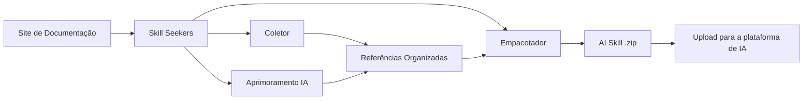

<p align="center">
  
</p>

# Skill Seekers

[English](README.md) | [简体中文](README.zh-CN.md) | [日本語](README.ja.md) | [한국어](README.ko.md) | [Español](README.es.md) | [Français](README.fr.md) | [Deutsch](README.de.md) | Português | [Türkçe](README.tr.md) | [العربية](README.ar.md) | [हिन्दी](README.hi.md) | [Русский](README.ru.md)

> ⚠️ **Aviso de tradução automática**
>
> Este documento foi traduzido automaticamente por IA. Embora nos esforcemos para garantir a qualidade, podem existir expressões imprecisas.
>
> Ajude a melhorar a tradução através do [GitHub Issue #260](https://github.com/yusufkaraaslan/Skill_Seekers/issues/260)! Seu feedback é muito valioso para nós.

[](https://github.com/yusufkaraaslan/Skill_Seekers/releases)
[](https://opensource.org/licenses/MIT)
[](https://www.python.org/downloads/)
[](https://modelcontextprotocol.io)
[](tests/)
[](https://github.com/users/yusufkaraaslan/projects/2)
[](https://pypi.org/project/skill-seekers/)
[](https://pypi.org/project/skill-seekers/)
[](https://pypi.org/project/skill-seekers/)
[](https://pepy.tech/projects/skill-seekers)
<a href="https://trendshift.io/repositories/18329" target="_blank"></a>
[](https://skillseekersweb.com/)
[](https://x.com/_yUSyUS_)
[](https://github.com/yusufkaraaslan/Skill_Seekers)

**🧠 A camada de dados para sistemas de IA.** O Skill Seekers transforma sites de documentação, repositórios GitHub, PDFs, vídeos, Jupyter Notebooks, wikis e mais de 10 outros tipos de fontes em ativos de conhecimento estruturado — prontos para alimentar AI Skills (Claude, Gemini, OpenAI), pipelines RAG (LangChain, LlamaIndex, Pinecone) e assistentes de programação com IA (Cursor, Windsurf, Cline) em minutos, não horas.

> 🌐 **[Visite SkillSeekersWeb.com](https://skillseekersweb.com/)** - Navegue por mais de 24 configurações predefinidas, compartilhe suas configurações e acesse a documentação completa!

> 📋 **[Veja o Roteiro de Desenvolvimento e Tarefas](https://github.com/users/yusufkaraaslan/projects/2)** - 134 tarefas em 10 categorias, escolha qualquer uma para contribuir!

## 🌐 Ecossistema

Skill Seekers é um projeto multi-repositório. Aqui está onde tudo se encontra:

| Repositório | Descrição | Links |
|------------|-----------|-------|
| **[Skill_Seekers](https://github.com/yusufkaraaslan/Skill_Seekers)** | CLI principal e servidor MCP (este repo) | [PyPI](https://pypi.org/project/skill-seekers/) |
| **[skillseekersweb](https://github.com/yusufkaraaslan/skillseekersweb)** | Website e documentação | [Site](https://skillseekersweb.com/) |
| **[skill-seekers-configs](https://github.com/yusufkaraaslan/skill-seekers-configs)** | Repositório de configurações da comunidade | |
| **[skill-seekers-action](https://github.com/yusufkaraaslan/skill-seekers-action)** | GitHub Action para CI/CD | |
| **[skill-seekers-plugin](https://github.com/yusufkaraaslan/skill-seekers-plugin)** | Plugin Claude Code | |
| **[homebrew-skill-seekers](https://github.com/yusufkaraaslan/homebrew-skill-seekers)** | Homebrew tap para macOS | |

> **Quer contribuir?** Os repos do website e configurações são ótimos pontos de partida para novos contribuidores!

## 🧠 A Camada de Dados para Sistemas de IA

**Skill Seekers é a camada universal de pré-processamento** que fica entre a documentação bruta e todo sistema de IA que a consome. Seja para construir Claude Skills, um pipeline RAG com LangChain ou um arquivo `.cursorrules` para o Cursor — a preparação dos dados é idêntica. Faça uma vez e exporte para todos os destinos.

```bash
# Um comando → ativo de conhecimento estruturado
skill-seekers create https://docs.react.dev/
# ou: skill-seekers create facebook/react
# ou: skill-seekers create ./my-project

# Exporte para qualquer sistema de IA
skill-seekers package output/react --target claude      # → Claude AI Skill (ZIP)
skill-seekers package output/react --target langchain   # → LangChain Documents
skill-seekers package output/react --target llama-index # → LlamaIndex TextNodes
skill-seekers package output/react --target cursor      # → .cursorrules
skill-seekers package output/react --target ibm-bob     # → Diretório de skill IBM Bob
```

### O que é gerado

| Saída | Destino | Para que serve |
|-------|---------|----------------|
| **Claude Skill** (ZIP + YAML) | `--target claude` | Claude Code, Claude API |
| **Gemini Skill** (tar.gz) | `--target gemini` | Google Gemini |
| **OpenAI / Custom GPT** (ZIP) | `--target openai` | GPT-4o, assistentes personalizados |
| **LangChain Documents** | `--target langchain` | Cadeias de QA, agentes, recuperadores |
| **LlamaIndex TextNodes** | `--target llama-index` | Motores de consulta, motores de chat |
| **Haystack Documents** | `--target haystack` | Pipelines RAG empresariais |
| **Pinecone-ready** (Markdown) | `--target markdown` | Upload de vetores |
| **ChromaDB / FAISS / Qdrant** | `--target chroma/faiss/qdrant` | Bancos de dados vetoriais locais |
| **IBM Bob Skill** (diretório) | `--target ibm-bob` | Skills de projeto/globais do IBM Bob |
| **Cursor** `.cursorrules` | `--target markdown` → copiar SKILL.md | `.cursorrules` do Cursor IDE |
| **Windsurf / Cline / Continue** | `--target claude` → copiar | VS Code, IntelliJ, Vim |

### Por que isso importa

- ⚡ **99% mais rápido** — Dias de preparação manual de dados → 15–45 minutos
- 🎯 **Qualidade de AI Skill** — Arquivos SKILL.md com mais de 500 linhas com exemplos, padrões e guias
- 📊 **Chunks prontos para RAG** — Chunking inteligente que preserva blocos de código e mantém o contexto
- 🎬 **Vídeos** — Extraia código, transcrições e conhecimento estruturado do YouTube e vídeos locais
- 🔄 **Multi-fonte** — Combine 18 tipos de fontes (docs, GitHub, PDFs, vídeos, notebooks, wikis e mais) em um único ativo de conhecimento
- 🌐 **Uma preparação, todos os destinos** — Exporte o mesmo ativo para 21 plataformas sem precisar recoletá-lo
- ✅ **Testado em batalha** — Mais de 3.700 testes, mais de 24 presets de frameworks, pronto para produção

## 🚀 Início Rápido (3 Comandos)

```bash
# 1. Instalar
pip install skill-seekers

# 2. Criar skill a partir de qualquer fonte
skill-seekers create https://docs.django.com/

# 3. Empacotar para sua plataforma de IA
skill-seekers package output/django --target claude
```

**Pronto!** Agora você tem `output/django-claude.zip` pronto para usar.

```bash
# Use um agente de IA diferente para o aprimoramento (padrão: claude)
skill-seekers create https://docs.django.com/ --agent kimi
skill-seekers create https://docs.django.com/ --agent codex
skill-seekers create https://docs.django.com/ --agent-cmd "my-custom-agent run"
```

### 🛰️ Escaneamento de projeto com IA (novo)

Aponte o `scan` para qualquer projeto e um agente de IA lê seus manifestos, README,
Dockerfile/CI e imports amostrados do código-fonte — então emite uma configuração por
framework detectado mais um `<project>-codebase.json` para o seu próprio código. Fixa a
versão detectada, de modo que reexecutar reporta as mudanças de versão:

```bash
skill-seekers scan ./my-react-app --out ./configs/scanned/
# → react.json, vite.json, tailwind.json, jest.json, my-react-app-codebase.json

# Depois construa qualquer uma delas
skill-seekers create ./configs/scanned/react.json
```

Se uma detecção não tiver um preset existente, a IA gera uma configuração nova;
ao sair, você pode opcionalmente publicá-la de volta no [registro da comunidade](https://github.com/yusufkaraaslan/skill-seekers-configs).

### Outras Fontes (18 Suportadas)

```bash
# Repositório GitHub
skill-seekers create facebook/react

# Projeto local
skill-seekers create ./my-project

# Documento PDF
skill-seekers create manual.pdf

# Documento Word
skill-seekers create report.docx

# E-book EPUB
skill-seekers create book.epub

# Jupyter Notebook
skill-seekers create notebook.ipynb

# Especificação OpenAPI
skill-seekers create openapi.yaml

# Apresentação PowerPoint
skill-seekers create presentation.pptx

# Documento AsciiDoc
skill-seekers create guide.adoc

# Arquivo HTML local (auto-detectado pela extensão)
skill-seekers create page.html

# Diretório inteiro de arquivos HTML (auto-detectado para diretórios predominantemente HTML)
skill-seekers create ./mirror_output/site/

# Forçar modo HTML em um diretório misto/com muito código
skill-seekers create ./repo/ --html-path ./repo/docs/build/html/

# Feed RSS/Atom
skill-seekers create feed.rss

# Man page
skill-seekers create curl.1

# Vídeo (YouTube, Vimeo ou arquivo local — requer skill-seekers[video])
skill-seekers create --video-url https://www.youtube.com/watch?v=... --name mytutorial
# Primeira vez? Instale automaticamente as dependências visuais com detecção de GPU:
skill-seekers create --setup

# Wiki Confluence
skill-seekers create --space-key TEAM --name wiki

# Páginas Notion
skill-seekers create --database-id ... --name docs

# Exportação de chat Slack/Discord
skill-seekers create --chat-export-path ./slack-export --name team-chat
```

### Exporte para Qualquer Lugar

```bash
# Empacote para múltiplas plataformas
for platform in claude gemini openai langchain; do
  skill-seekers package output/django --target $platform
done
```

## O que é o Skill Seekers?

O Skill Seekers é a **camada de dados para sistemas de IA**. Ele transforma 18 tipos de fontes — sites de documentação, repositórios GitHub, PDFs, vídeos, Jupyter Notebooks, documentos Word/EPUB/AsciiDoc, especificações OpenAPI, apresentações PowerPoint, feeds RSS, man pages, wikis Confluence, páginas Notion, exportações Slack/Discord e mais — em ativos de conhecimento estruturado para qualquer destino de IA:

| Caso de Uso | O que você obtém | Exemplos |
|-------------|-----------------|----------|
| **AI Skills** | SKILL.md abrangente + referências | Claude Code, Gemini, GPT |
| **Pipelines RAG** | Documentos fragmentados com metadados ricos | LangChain, LlamaIndex, Haystack |
| **Bancos de Dados Vetoriais** | Dados pré-formatados prontos para upload | Pinecone, Chroma, Weaviate, FAISS |
| **Assistentes de Programação com IA** | Arquivos de contexto que sua IDE lê automaticamente | Cursor, Windsurf, Cline, Continue.dev |

## 📚 Documentação

| Quero... | Leia isto |
|----------|-----------|
| **Começar rapidamente** | [Início Rápido](docs/getting-started/02-quick-start.md) - 3 comandos até a primeira skill |
| **Entender os conceitos** | [Conceitos Fundamentais](docs/user-guide/01-core-concepts.md) - Como funciona |
| **Coletar fontes** | [Guia de Coleta](docs/user-guide/02-scraping.md) - Todos os tipos de fontes |
| **Aprimorar skills** | [Guia de Aprimoramento](docs/user-guide/03-enhancement.md) - Aprimoramento com IA |
| **Exportar skills** | [Guia de Empacotamento](docs/user-guide/04-packaging.md) - Exportação para plataformas |
| **Consultar comandos** | [Referência CLI](docs/reference/CLI_REFERENCE.md) - Todos os 20 comandos |
| **Configurar** | [Formato de Configuração](docs/reference/CONFIG_FORMAT.md) - Especificação JSON |
| **Resolver problemas** | [Solução de Problemas](docs/user-guide/06-troubleshooting.md) - Problemas comuns |

**Documentação completa:** [docs/README.md](docs/README.md)

O Skill Seekers substitui dias de pré-processamento manual com os seguintes passos:

1. **Coleta** — Docs, repositórios GitHub, bases de código locais, PDFs, vídeos, Jupyter Notebooks, wikis e mais de 10 outros tipos de fontes
2. **Análise** — Parsing AST profundo, detecção de padrões, extração de APIs
3. **Estruturação** — Arquivos de referência categorizados com metadados
4. **Aprimoramento** — Geração de SKILL.md com IA (Claude, Gemini ou local)
5. **Exportação** — 16 formatos específicos por plataforma a partir de um único ativo

## Por que Usar o Skill Seekers?

### Para Construtores de AI Skills (Claude, Gemini, OpenAI)

- 🎯 **Skills de nível de produção** — Arquivos SKILL.md com mais de 500 linhas com exemplos de código, padrões e guias
- 🔄 **Workflows de aprimoramento** — Aplique `security-focus`, `architecture-comprehensive` ou presets YAML personalizados
- 🎮 **Qualquer domínio** — Motores de jogos (Godot, Unity), frameworks (React, Django), ferramentas internas
- 🔧 **Equipes** — Combine documentação interna + código em uma única fonte da verdade
- 📚 **Qualidade** — Aprimorado por IA com exemplos, referência rápida e orientação de navegação

### Para Construtores de RAG e Engenheiros de IA

- 🤖 **Dados prontos para RAG** — `Documents` LangChain, `TextNodes` LlamaIndex, `Documents` Haystack pré-fragmentados
- 🚀 **99% mais rápido** — Dias de pré-processamento → 15–45 minutos
- 📊 **Metadados inteligentes** — Categorias, fontes, tipos → melhor precisão de recuperação
- 🔄 **Multi-fonte** — Combine docs + GitHub + PDFs + vídeos em um pipeline
- 🌐 **Agnóstico de plataforma** — Exporte para qualquer banco vetorial ou framework sem recoleta

### Para Usuários de Assistentes de Programação com IA

- 💻 **Cursor / Windsurf / Cline** — Gere `.cursorrules` / `.windsurfrules` / `.clinerules` automaticamente
- 🎯 **Contexto persistente** — A IA "conhece" seus frameworks sem prompts repetidos
- 📚 **Sempre atualizado** — Atualize o contexto em minutos quando a documentação mudar

## Funcionalidades Principais

### 🌐 Coleta de Documentação
- ✅ **Descoberta SPA Inteligente** - Descoberta em três camadas para sites SPA em JavaScript (sitemap.xml → llms.txt → renderização com navegador headless)
- ✅ **Suporte a llms.txt** - Detecta e usa automaticamente arquivos de documentação prontos para LLM (10x mais rápido)
- ✅ **Scraper Universal** - Funciona com QUALQUER site de documentação
- ✅ **Categorização Inteligente** - Organiza conteúdo automaticamente por tópico
- ✅ **Detecção de Linguagem de Código** - Reconhece Python, JavaScript, C++, GDScript, etc.
- ✅ **Mais de 24 Presets Prontos** - Godot, React, Vue, Django, FastAPI e mais

### 📄 Suporte a PDF
- ✅ **Extração Básica de PDF** - Extraia texto, código e imagens de arquivos PDF
- ✅ **OCR para PDFs Digitalizados** - Extraia texto de documentos digitalizados
- ✅ **PDFs Protegidos por Senha** - Processe PDFs criptografados
- ✅ **Extração de Tabelas** - Extraia tabelas complexas de PDFs
- ✅ **Processamento Paralelo** - 3x mais rápido para PDFs grandes
- ✅ **Cache Inteligente** - 50% mais rápido em re-execuções

### 🎬 Extração de Vídeo
- ✅ **YouTube e Vídeos Locais** - Extraia transcrições, código na tela e conhecimento estruturado de vídeos
- ✅ **Análise Visual de Frames** - Extração OCR de editores de código, terminais, slides e diagramas
- ✅ **Detecção Automática de GPU** - Instala automaticamente a versão correta do PyTorch (CUDA/ROCm/MPS/CPU)
- ✅ **Aprimoramento com IA** - Dois passes: limpeza de artefatos OCR + geração de SKILL.md polido
- ✅ **Recorte Temporal** - Extraia seções específicas com `--start-time` e `--end-time`
- ✅ **Suporte a Playlists** - Processe em lote todos os vídeos de uma playlist do YouTube
- ✅ **Fallback com Vision API** - Use Claude Vision para frames OCR de baixa confiança

### 🐙 Análise de Repositórios GitHub
- ✅ **Análise Profunda de Código** - Parsing AST para Python, JavaScript, TypeScript, Java, C++, Go
- ✅ **Extração de API** - Funções, classes, métodos com parâmetros e tipos
- ✅ **Metadados do Repositório** - README, árvore de arquivos, distribuição de linguagens, stars/forks
- ✅ **GitHub Issues e PRs** - Obtenha issues abertas/fechadas com labels e milestones
- ✅ **CHANGELOG e Releases** - Extração automática do histórico de versões
- ✅ **Detecção de Conflitos** - Compare APIs documentadas vs implementação real do código
- ✅ **Integração MCP** - Linguagem natural: "Colete o repositório GitHub facebook/react"

### 🔄 Coleta Unificada Multi-Fonte
- ✅ **Combine Múltiplas Fontes** - Misture documentação + GitHub + PDF em uma skill
- ✅ **Detecção de Conflitos** - Encontra automaticamente discrepâncias entre docs e código
- ✅ **Mesclagem Inteligente** - Resolução de conflitos baseada em regras ou com IA
- ✅ **Relatórios Transparentes** - Comparação lado a lado com avisos ⚠️
- ✅ **Análise de Lacunas na Documentação** - Identifica docs desatualizadas e funcionalidades não documentadas
- ✅ **Fonte Única da Verdade** - Uma skill mostrando tanto a intenção (docs) quanto a realidade (código)
- ✅ **Retrocompatível** - Configurações legadas de fonte única continuam funcionando

### 🤖 Suporte a Múltiplas Plataformas LLM
- ✅ **12 Plataformas LLM** - Claude AI, Google Gemini, OpenAI ChatGPT, MiniMax AI, Markdown Genérico, OpenCode, Kimi (Moonshot AI), DeepSeek AI, Qwen (Alibaba), OpenRouter, Together AI, Fireworks AI
- ✅ **Coleta Universal** - A mesma documentação funciona para todas as plataformas
- ✅ **Empacotamento Específico por Plataforma** - Formatos otimizados para cada LLM
- ✅ **Exportação com Um Comando** - Flag `--target` seleciona a plataforma
- ✅ **Dependências Opcionais** - Instale apenas o que precisa
- ✅ **100% Retrocompatível** - Workflows existentes do Claude permanecem inalterados

| Plataforma | Formato | Upload | Aprimoramento | API Key | Endpoint Personalizado |
|------------|---------|--------|---------------|---------|----------------------|
| **Claude AI** | ZIP + YAML | ✅ Automático | ✅ Sim | ANTHROPIC_API_KEY | ANTHROPIC_BASE_URL |
| **Google Gemini** | tar.gz | ✅ Automático | ✅ Sim | GOOGLE_API_KEY | - |
| **OpenAI ChatGPT** | ZIP + Vector Store | ✅ Automático | ✅ Sim | OPENAI_API_KEY | - |
| **MiniMax AI** | ZIP + Knowledge Files | ✅ Automático | ✅ Sim | MINIMAX_API_KEY | - |
| **Markdown Genérico** | ZIP | ❌ Manual | ❌ Não | - | - |

```bash
# Claude (padrão - sem alterações necessárias!)
skill-seekers package output/react/
skill-seekers upload react.zip

# Google Gemini
pip install skill-seekers[gemini]
skill-seekers package output/react/ --target gemini
skill-seekers upload react-gemini.tar.gz --target gemini

# OpenAI ChatGPT
pip install skill-seekers[openai]
skill-seekers package output/react/ --target openai
skill-seekers upload react-openai.zip --target openai

# MiniMax AI
pip install skill-seekers[minimax]
skill-seekers package output/react/ --target minimax
skill-seekers upload react-minimax.zip --target minimax

# Markdown Genérico (exportação universal)
skill-seekers package output/react/ --target markdown
# Use os arquivos markdown diretamente em qualquer LLM
```

<details>
<summary>🔧 <strong>Use seu próprio provedor de IA (endpoints compatíveis com OpenAI + assinaturas, sem necessidade de créditos da Anthropic)</strong></summary>

A etapa opcional de **aprimoramento** com IA (usada por `create`, `scan` e `enhance`) **não** requer uma chave da Anthropic. Você tem três formas de alimentá-la:

**1. Use uma assinatura que você já paga — sem créditos de API (modo de agente LOCAL)**

O Skill Seekers pode delegar para uma CLI de agente de programação na qual você já está logado, de modo que o aprimoramento roda no seu plano existente em vez de tokens de API cobrados:

```bash
skill-seekers create <source> --agent codex     # CLI OpenAI Codex → seu ChatGPT Plus
skill-seekers create <source> --agent claude    # Claude Code      → seu Claude Pro/Max
```

Agentes suportados: `claude`, `codex`, `copilot`, `opencode`, `kimi` e `custom`
(combine `--agent custom` com `--agent-cmd "<your-cli> ..."` para usar qualquer outra ferramenta).

**2. Qualquer provedor compatível com OpenAI (OpenRouter, Groq, Cerebras, Mistral, NVIDIA NIM, …)**

Todos eles expõem um endpoint `/v1` compatível com OpenAI. Aponte o Skill Seekers para um deles com três variáveis de ambiente — ele detecta `OPENAI_API_KEY`, e o SDK da OpenAI respeita `OPENAI_BASE_URL` automaticamente:

```bash
export OPENAI_API_KEY="<your provider key>"
export OPENAI_BASE_URL="https://openrouter.ai/api/v1"   # endpoint do provedor (veja a tabela)
export OPENAI_MODEL="<a model that provider offers>"     # obrigatório — o padrão gpt-4o não existirá em outros provedores
skill-seekers create <source>
```

| Provedor     | `OPENAI_BASE_URL`                          |
|--------------|--------------------------------------------|
| OpenRouter   | `https://openrouter.ai/api/v1`             |
| Groq         | `https://api.groq.com/openai/v1`           |
| Cerebras     | `https://api.cerebras.ai/v1`               |
| Mistral      | `https://api.mistral.ai/v1`                |
| NVIDIA NIM   | `https://integrate.api.nvidia.com/v1`      |

> A detecção de provedor escolhe a **primeira** variável de ambiente de API key que encontrar (`ANTHROPIC_API_KEY` → `GOOGLE_API_KEY` → `OPENAI_API_KEY` → `MOONSHOT_API_KEY`). Defina `SKILL_SEEKER_PROVIDER` para forçar um provedor específico, ou garanta que as chaves de prioridade mais alta não estejam definidas.

**3. Endpoints compatíveis com Claude (ex.: GLM, proxies)**

```bash
export ANTHROPIC_API_KEY="your-key"
export ANTHROPIC_BASE_URL="https://your-claude-compatible-endpoint/v1"
```

Google Gemini (`GOOGLE_API_KEY`) e Kimi/Moonshot (`MOONSHOT_API_KEY`) também são suportados nativamente. Consulte a **[Referência de Variáveis de Ambiente](docs/reference/ENVIRONMENT_VARIABLES.md#llm-provider-selection)** para a lista completa, incluindo substituições de modelo por provedor.

</details>

**Instalação:**
```bash
# Instalar com suporte ao Gemini
pip install skill-seekers[gemini]

# Instalar com suporte ao OpenAI
pip install skill-seekers[openai]

# Instalar com suporte ao MiniMax
pip install skill-seekers[minimax]

# Instalar com todas as plataformas LLM
pip install skill-seekers[all-llms]
```

### 🔗 Integrações com Frameworks RAG

- ✅ **LangChain Documents** - Exportação direta para formato `Document` com `page_content` + metadados
  - Ideal para: Cadeias de QA, recuperadores, armazenamentos vetoriais, agentes
  - Exemplo: [Pipeline RAG LangChain](examples/langchain-rag-pipeline/)
  - Guia: [Integração LangChain](docs/integrations/LANGCHAIN.md)

- ✅ **LlamaIndex TextNodes** - Exportação para formato `TextNode` com IDs únicos + embeddings
  - Ideal para: Motores de consulta, motores de chat, contexto de armazenamento
  - Exemplo: [Motor de Consulta LlamaIndex](examples/llama-index-query-engine/)
  - Guia: [Integração LlamaIndex](docs/integrations/LLAMA_INDEX.md)

- ✅ **Formato Pinecone-Ready** - Otimizado para upload em bancos de dados vetoriais
  - Ideal para: Busca vetorial em produção, busca semântica, busca híbrida
  - Exemplo: [Upload Pinecone](examples/pinecone-upsert/)
  - Guia: [Integração Pinecone](docs/integrations/PINECONE.md)

**Exportação Rápida:**
```bash
# LangChain Documents (JSON)
skill-seekers package output/django --target langchain
# → output/django-langchain.json

# LlamaIndex TextNodes (JSON)
skill-seekers package output/django --target llama-index
# → output/django-llama-index.json

# Markdown (Universal)
skill-seekers package output/django --target markdown
# → output/django-markdown/SKILL.md + references/
```

**Guia Completo de Pipeline RAG:** [Documentação de Pipelines RAG](docs/integrations/RAG_PIPELINES.md)

---

### 🧠 Integrações com Assistentes de Programação com IA

Transforme qualquer documentação de framework em contexto especializado de programação para mais de 4 assistentes de IA:

- ✅ **Cursor IDE** - Gere `.cursorrules` para sugestões de código com IA
  - Ideal para: Geração de código específica de framework, padrões consistentes
  - Funciona com: Cursor IDE (fork do VS Code)
  - Guia: [Integração Cursor](docs/integrations/CURSOR.md)
  - Exemplo: [Cursor React Skill](examples/cursor-react-skill/)

- ✅ **Windsurf** - Personalize o contexto do assistente de IA do Windsurf com `.windsurfrules`
  - Ideal para: Assistência de IA nativa na IDE, programação baseada em fluxo
  - Funciona com: Windsurf IDE da Codeium
  - Guia: [Integração Windsurf](docs/integrations/WINDSURF.md)
  - Exemplo: [Contexto FastAPI Windsurf](examples/windsurf-fastapi-context/)

- ✅ **Cline (VS Code)** - Prompts de sistema + MCP para agente VS Code
  - Ideal para: Geração de código agentiva no VS Code
  - Funciona com: Extensão Cline para VS Code
  - Guia: [Integração Cline](docs/integrations/CLINE.md)
  - Exemplo: [Assistente Django Cline](examples/cline-django-assistant/)

- ✅ **Continue.dev** - Servidores de contexto para IA agnóstica de IDE
  - Ideal para: Ambientes multi-IDE (VS Code, JetBrains, Vim), provedores de LLM personalizados
  - Funciona com: Qualquer IDE com plugin Continue.dev
  - Guia: [Integração Continue](docs/integrations/CONTINUE_DEV.md)
  - Exemplo: [Contexto Universal Continue](examples/continue-dev-universal/)

**Exportação Rápida para Ferramentas de Programação com IA:**
```bash
# Para qualquer assistente de programação com IA (Cursor, Windsurf, Cline, Continue.dev)
skill-seekers create --config configs/django.json
skill-seekers package output/django --target claude  # ou --target markdown

# Copie para seu projeto (exemplo para Cursor)
cp output/django-claude/SKILL.md my-project/.cursorrules

# Ou para Windsurf
cp output/django-claude/SKILL.md my-project/.windsurf/rules/django.md

# Ou para Cline
cp output/django-claude/SKILL.md my-project/.clinerules

# Ou para Continue.dev (servidor HTTP)
python examples/continue-dev-universal/context_server.py
# Configure em ~/.continue/config.json
```

**Hub de Integrações:** [Todas as Integrações com Sistemas de IA](docs/integrations/INTEGRATIONS.md)

---

### 🌊 Arquitetura GitHub de Três Fluxos
- ✅ **Análise em Três Fluxos** - Divide repositórios GitHub em fluxos de Código, Docs e Insights
- ✅ **Analisador de Codebase Unificado** - Funciona com URLs do GitHub E caminhos locais
- ✅ **C3.x como Profundidade de Análise** - Escolha 'basic' (1-2 min) ou 'c3x' (20-60 min)
- ✅ **Geração Aprimorada de Router** - Metadados do GitHub, quick start do README, problemas comuns
- ✅ **Integração de Issues** - Principais problemas e soluções dos GitHub Issues
- ✅ **Keywords de Roteamento Inteligente** - Labels do GitHub com peso 2x para melhor detecção de tópicos

**Explicação dos Três Fluxos:**
- **Fluxo 1: Código** - Análise profunda C3.x (padrões, exemplos, guias, configs, arquitetura)
- **Fluxo 2: Docs** - Documentação do repositório (README, CONTRIBUTING, docs/*.md)
- **Fluxo 3: Insights** - Conhecimento da comunidade (issues, labels, stars, forks)

```python
from skill_seekers.cli.unified_codebase_analyzer import UnifiedCodebaseAnalyzer

# Analise repositório GitHub com os três fluxos
analyzer = UnifiedCodebaseAnalyzer()
result = analyzer.analyze(
    source="https://github.com/facebook/react",
    depth="c3x",  # ou "basic" para análise rápida
    fetch_github_metadata=True
)

# Acesse o fluxo de código (análise C3.x)
print(f"Design patterns: {len(result.code_analysis['c3_1_patterns'])}")
print(f"Test examples: {result.code_analysis['c3_2_examples_count']}")

# Acesse o fluxo de docs (documentação do repositório)
print(f"README: {result.github_docs['readme'][:100]}")

# Acesse o fluxo de insights (metadados do GitHub)
print(f"Stars: {result.github_insights['metadata']['stars']}")
print(f"Common issues: {len(result.github_insights['common_problems'])}")
```

**Documentação completa**: [Resumo da Implementação de Três Fluxos](docs/archive/historical/IMPLEMENTATION_SUMMARY_THREE_STREAM.md)

### 🔐 Gerenciamento Inteligente de Rate Limit e Configuração
- ✅ **Sistema de Configuração Multi-Token** - Gerencie múltiplas contas GitHub (pessoal, trabalho, OSS)
  - Armazenamento seguro de configurações em `~/.config/skill-seekers/config.json` (permissões 600)
  - Estratégias de rate limit por perfil: `prompt`, `wait`, `switch`, `fail`
  - Timeout configurável por perfil (padrão: 30 min, evita esperas indefinidas)
  - Cadeia de fallback inteligente: Argumento CLI → Variável de ambiente → Arquivo de configuração → Prompt
  - Gerenciamento de API keys para Claude, Gemini, OpenAI
- ✅ **Assistente de Configuração Interativo** - Interface de terminal elegante para fácil configuração
  - Integração com navegador para criação de tokens (abre automaticamente GitHub, etc.)
  - Validação de tokens e teste de conexão
  - Exibição visual de status com código de cores
- ✅ **Gerenciador Inteligente de Rate Limit** - Chega de esperas indefinidas!
  - Aviso prévio sobre rate limits (60/hora vs 5000/hora)
  - Detecção em tempo real das respostas da API do GitHub
  - Contadores regressivos ao vivo com progresso
  - Troca automática de perfil quando limitado
  - Quatro estratégias: prompt (perguntar), wait (contagem regressiva), switch (tentar outro), fail (abortar)
- ✅ **Capacidade de Retomada** - Continue trabalhos interrompidos
  - Salvamento automático de progresso em intervalos configuráveis (padrão: 60 seg)
  - Liste todos os trabalhos retomáveis com detalhes de progresso
  - Limpeza automática de trabalhos antigos (padrão: 7 dias)
- ✅ **Suporte CI/CD** - Modo não interativo para automação
  - Flag `--non-interactive` falha rapidamente sem prompts
  - Flag `--profile` para selecionar conta GitHub específica
  - Mensagens de erro claras para logs de pipeline

**Configuração Rápida:**
```bash
# Configuração única (5 minutos)
skill-seekers config --github

# Use perfil específico para repos privados
skill-seekers create mycompany/private-repo --profile work

# Modo CI/CD (falha rápida, sem prompts)
skill-seekers create owner/repo --non-interactive

# Retomar trabalho interrompido
skill-seekers resume --list
skill-seekers resume github_react_20260117_143022
```

**Estratégias de Rate Limit Explicadas:**
- **prompt** (padrão) - Pergunta o que fazer quando limitado (esperar, trocar, configurar token, cancelar)
- **wait** - Espera automaticamente com contador regressivo (respeita timeout)
- **switch** - Tenta automaticamente o próximo perfil disponível (para configurações multi-conta)
- **fail** - Falha imediatamente com erro claro (ideal para CI/CD)

### 🎯 Bootstrap Skill - Auto-Hospedagem

Gere o skill-seekers como uma skill para uso dentro do seu agente de IA (Claude Code, Kimi, Codex, etc.):

```bash
# Gere a skill
./scripts/bootstrap_skill.sh

# Instale no Claude Code
cp -r output/skill-seekers ~/.claude/skills/
```

**O que você obtém:**
- ✅ **Documentação completa da skill** - Todos os comandos CLI e padrões de uso
- ✅ **Referência de comandos CLI** - Cada ferramenta e suas opções documentadas
- ✅ **Exemplos de início rápido** - Workflows comuns e melhores práticas
- ✅ **Documentação de API auto-gerada** - Análise de código, padrões e exemplos

### 🔐 Repositórios Privados de Configuração
- ✅ **Fontes de Config Baseadas em Git** - Busque configs de repositórios Git privados/de equipe
- ✅ **Gerenciamento Multi-Fonte** - Registre repositórios ilimitados do GitHub, GitLab, Bitbucket
- ✅ **Colaboração em Equipe** - Compartilhe configs personalizadas entre equipes de 3-5 pessoas
- ✅ **Suporte Empresarial** - Escale para mais de 500 desenvolvedores com resolução baseada em prioridade
- ✅ **Autenticação Segura** - Tokens em variáveis de ambiente (GITHUB_TOKEN, GITLAB_TOKEN)
- ✅ **Cache Inteligente** - Clone uma vez, receba atualizações automaticamente
- ✅ **Modo Offline** - Trabalhe com configs em cache quando estiver offline

### 🤖 Análise de Codebase (C3.x)

**C3.4: Extração de Padrões de Configuração com Aprimoramento por IA**
- ✅ **9 Formatos de Config** - JSON, YAML, TOML, ENV, INI, Python, JavaScript, Dockerfile, Docker Compose
- ✅ **7 Tipos de Padrão** - Banco de dados, API, logging, cache, e-mail, autenticação, configurações de servidor
- ✅ **Aprimoramento por IA** - Análise de IA opcional em modo duplo (API + LOCAL)
  - Explica o que cada config faz
  - Sugere melhores práticas e melhorias
  - **Análise de segurança** - Encontra segredos hardcoded, credenciais expostas
- ✅ **Auto-Documentação** - Gera documentação JSON + Markdown de todas as configs
- ✅ **Integração MCP** - Ferramenta `extract_config_patterns` com suporte a aprimoramento

**C3.3: Guias How-To Aprimorados por IA**
- ✅ **Aprimoramento Abrangente por IA** - Transforma guias básicos em tutoriais profissionais
- ✅ **5 Melhorias Automáticas** - Descrições de etapas, troubleshooting, pré-requisitos, próximos passos, casos de uso
- ✅ **Suporte Dual-Mode** - Modo API (Claude API) ou modo LOCAL (Claude Code CLI)
- ✅ **Sem Custo com Modo LOCAL** - Aprimoramento GRATUITO usando seu plano Claude Code Max
- ✅ **Transformação de Qualidade** - Templates de 75 linhas → guias abrangentes de mais de 500 linhas

**Uso:**
```bash
# Análise rápida (1-2 min, apenas funcionalidades básicas)
skill-seekers scan tests/ --quick

# Análise abrangente com IA (20-60 min, todas as funcionalidades)
skill-seekers scan tests/ --comprehensive

# Com aprimoramento por IA
skill-seekers scan tests/ --enhance
```

**Documentação Completa:** [docs/features/HOW_TO_GUIDES.md](docs/features/HOW_TO_GUIDES.md#ai-enhancement-new)

### 🔄 Presets de Workflow de Aprimoramento

Pipelines de aprimoramento reutilizáveis definidos em YAML que controlam como a IA transforma sua documentação bruta em uma skill polida.

- ✅ **5 Presets Incluídos** — `default`, `minimal`, `security-focus`, `architecture-comprehensive`, `api-documentation`
- ✅ **Presets Definidos pelo Usuário** — Adicione workflows personalizados em `~/.config/skill-seekers/workflows/`
- ✅ **Múltiplos Workflows** — Encadeie dois ou mais workflows em um comando
- ✅ **CLI Totalmente Gerenciada** — Liste, inspecione, copie, adicione, remova e valide workflows

```bash
# Aplique um único workflow
skill-seekers create ./my-project --enhance-workflow security-focus

# Encadeie múltiplos workflows (aplicados em ordem)
skill-seekers create ./my-project \
  --enhance-workflow security-focus \
  --enhance-workflow minimal

# Gerencie presets
skill-seekers workflows list                          # Liste todos (incluídos + usuário)
skill-seekers workflows show security-focus           # Exiba conteúdo YAML
skill-seekers workflows copy security-focus           # Copie para diretório do usuário para edição
skill-seekers workflows add ./my-workflow.yaml        # Instale um preset personalizado
skill-seekers workflows remove my-workflow            # Remova um preset do usuário
skill-seekers workflows validate security-focus       # Valide a estrutura do preset

# Copie múltiplos de uma vez
skill-seekers workflows copy security-focus minimal api-documentation

# Adicione múltiplos arquivos de uma vez
skill-seekers workflows add ./wf-a.yaml ./wf-b.yaml

# Remova múltiplos de uma vez
skill-seekers workflows remove my-wf-a my-wf-b
```

**Formato de preset YAML:**
```yaml
name: security-focus
description: "Security-focused review: vulnerabilities, auth, data handling"
version: "1.0"
stages:
  - name: vulnerabilities
    type: custom
    prompt: "Review for OWASP top 10 and common security vulnerabilities..."
  - name: auth-review
    type: custom
    prompt: "Examine authentication and authorisation patterns..."
    uses_history: true
```

### ⚡ Performance e Escalabilidade
- ✅ **Modo Assíncrono** - Coleta 2-3x mais rápida com async/await (use a flag `--async`)
- ✅ **Suporte a Documentações Grandes** - Processe docs de 10K-40K+ páginas com divisão inteligente
- ✅ **Skills Router/Hub** - Roteamento inteligente para sub-skills especializadas
- ✅ **Coleta Paralela** - Processe múltiplas skills simultaneamente
- ✅ **Checkpoint/Retomada** - Nunca perca progresso em coletas longas
- ✅ **Sistema de Cache** - Colete uma vez, reconstrua instantaneamente

### 🤖 Geração de Skills Agnóstica ao Agente
- ✅ **Suporte Multi-Agente** - Gere skills para Claude, Kimi, Codex, Copilot, OpenCode ou qualquer agente personalizado via flag `--agent`
- ✅ **Comandos de Agente Personalizados** - Use `--agent-cmd` para especificar um comando CLI de agente personalizado para o aprimoramento
- ✅ **Flags Universais** - `--agent` e `--agent-cmd` disponíveis em todos os comandos (create, scrape, github, pdf, etc.)

### 📦 Pipeline do Marketplace
- ✅ **Publicação no Marketplace** - Publique skills em repositórios do marketplace de plugins do Claude Code
- ✅ **Pipeline de Ponta a Ponta** - Da fonte de documentação à entrada publicada no marketplace

### ✅ Garantia de Qualidade
- ✅ **Totalmente Testado** - Mais de 3.700 testes com cobertura abrangente

---

## 📦 Instalação

```bash
# Instalação básica (coleta de documentação, análise GitHub, PDF, empacotamento)
pip install skill-seekers

# Com suporte a todas as plataformas LLM
pip install skill-seekers[all-llms]

# Com servidor MCP
pip install skill-seekers[mcp]

# Tudo incluído
pip install skill-seekers[all]
```

**Precisa de ajuda para escolher?** Execute o assistente de configuração:
```bash
skill-seekers-setup
```

### Opções de Instalação

| Instalação | Funcionalidades |
|-----------|----------------|
| `pip install skill-seekers` | Coleta, análise GitHub, PDF, todas as plataformas |
| `pip install skill-seekers[gemini]` | + Suporte ao Google Gemini |
| `pip install skill-seekers[openai]` | + Suporte ao OpenAI ChatGPT |
| `pip install skill-seekers[all-llms]` | + Todas as plataformas LLM |
| `pip install skill-seekers[mcp]` | + Servidor MCP para Claude Code, Cursor, etc. |
| `pip install skill-seekers[video]` | + Extração de transcrições e metadados do YouTube/Vimeo |
| `pip install skill-seekers[video-full]` | + Transcrição Whisper e extração visual de frames |
| `pip install skill-seekers[jupyter]` | + Suporte a Jupyter Notebook |
| `pip install skill-seekers[pptx]` | + Suporte a PowerPoint |
| `pip install skill-seekers[confluence]` | + Suporte a wiki Confluence |
| `pip install skill-seekers[notion]` | + Suporte a páginas Notion |
| `pip install skill-seekers[rss]` | + Suporte a feeds RSS/Atom |
| `pip install skill-seekers[chat]` | + Suporte a exportação de chat Slack/Discord |
| `pip install skill-seekers[asciidoc]` | + Suporte a documentos AsciiDoc |
| `pip install skill-seekers[all]` | Tudo habilitado |

> **Dependências visuais de vídeo (detecção de GPU):** Após instalar `skill-seekers[video-full]`, execute
> `skill-seekers create --setup` para detectar automaticamente sua GPU e instalar a variante
> correta do PyTorch + easyocr. Esta é a forma recomendada de instalar as dependências de extração visual.

---

## 🚀 Workflow de Instalação com Um Comando

**A forma mais rápida de ir da configuração à skill enviada — automação completa:**

```bash
# Instale a skill React a partir das configs oficiais (upload automático para o Claude)
skill-seekers install --config react

# Instale a partir de arquivo de configuração local
skill-seekers install --config configs/custom.json

# Instale sem fazer upload (apenas empacotar)
skill-seekers install --config django --no-upload

# Visualize o workflow sem executar
skill-seekers install --config react --dry-run
```

**Tempo:** 20-45 minutos no total | **Qualidade:** Pronto para produção (9/10) | **Custo:** Gratuito

**Fases executadas:**
```
📥 FASE 1: Buscar Configuração (se nome da config for fornecido)
📖 FASE 2: Coletar Documentação
✨ FASE 3: Aprimoramento com IA (OBRIGATÓRIO - sem opção de pular)
📦 FASE 4: Empacotar Skill
☁️  FASE 5: Upload para o Claude (opcional, requer API key)
```

**Requisitos:**
- Variável de ambiente ANTHROPIC_API_KEY (para upload automático)
- Plano Claude Code Max (para aprimoramento com IA local), ou use `--agent` para selecionar um agente de IA diferente

---

## 📊 Matriz de Funcionalidades

O Skill Seekers suporta **12 plataformas LLM**, **8 destinos RAG/vetoriais**, **18 tipos de fontes** e paridade completa de funcionalidades em todos os destinos.

**Plataformas:** Claude AI, Google Gemini, OpenAI ChatGPT, MiniMax AI, Markdown Genérico, OpenCode, Kimi (Moonshot AI), DeepSeek AI, Qwen (Alibaba), OpenRouter, Together AI, Fireworks AI
**Tipos de Fontes:** Sites de documentação, repositórios GitHub, PDFs, Word (.docx), EPUB, Vídeo, Codebases locais, Jupyter Notebooks, HTML local, OpenAPI/Swagger, AsciiDoc, PowerPoint (.pptx), feeds RSS/Atom, Man pages, wikis Confluence, páginas Notion, exportações de chat Slack/Discord

Consulte a [Matriz Completa de Funcionalidades](docs/reference/FEATURE_MATRIX.md) para suporte detalhado por plataforma e funcionalidade.

### Comparação Rápida de Plataformas

| Funcionalidade | Claude | Gemini | OpenAI | MiniMax | Markdown |
|---------------|--------|--------|--------|---------|----------|
| Formato | ZIP + YAML | tar.gz | ZIP + Vector | ZIP + Knowledge | ZIP |
| Upload | ✅ API | ✅ API | ✅ API | ✅ API | ❌ Manual |
| Aprimoramento | ✅ Sonnet 4 | ✅ 2.0 Flash | ✅ GPT-4o | ✅ M3 | ❌ Nenhum |
| Todos os Modos de Skill | ✅ | ✅ | ✅ | ✅ | ✅ |

---

## Exemplos de Uso

### Coleta de Documentação

```bash
# Coletar site de documentação
skill-seekers create --config configs/react.json

# Coleta rápida sem configuração
skill-seekers create https://react.dev --name react

# Com modo assíncrono (3x mais rápido)
skill-seekers create --config configs/godot.json --async --workers 8

# Use um agente de IA específico para o aprimoramento
skill-seekers create --config configs/react.json --agent kimi
```

### Extração de PDF

```bash
# Extração básica de PDF
skill-seekers create --pdf docs/manual.pdf --name myskill

# Funcionalidades avançadas
skill-seekers create --pdf docs/manual.pdf --name myskill \
    --extract-tables \        # Extrair tabelas
    --parallel \              # Processamento paralelo rápido
    --workers 8               # Usar 8 núcleos de CPU

# PDFs digitalizados (requer: pip install pytesseract Pillow)
skill-seekers create --pdf docs/scanned.pdf --name myskill --ocr
```

### Extração de Vídeo

```bash
# Instalar suporte a vídeo
pip install skill-seekers[video]        # Transcrições + metadados
pip install skill-seekers[video-full]   # + Whisper + extração visual de frames

# Detectar GPU automaticamente e instalar dependências visuais (PyTorch + easyocr)
skill-seekers create --setup

# Extrair de vídeo do YouTube
skill-seekers create --video-url https://www.youtube.com/watch?v=dQw4w9WgXcQ --name mytutorial

# Extrair de uma playlist do YouTube
skill-seekers create --video-playlist https://www.youtube.com/playlist?list=... --name myplaylist

# Extrair de um arquivo de vídeo local
skill-seekers create --video-file recording.mp4 --name myrecording

# Extrair com análise visual de frames (requer dependências video-full)
skill-seekers create --video-url https://www.youtube.com/watch?v=... --name mytutorial --visual

# Com aprimoramento por IA (limpa OCR + gera SKILL.md polido)
skill-seekers create --video-url https://www.youtube.com/watch?v=... --visual --enhance-level 2

# Recortar seção específica de um vídeo (suporta segundos, MM:SS, HH:MM:SS)
skill-seekers create --video-url https://www.youtube.com/watch?v=... --start-time 1:30 --end-time 5:00

# Usar Vision API para frames OCR de baixa confiança (requer ANTHROPIC_API_KEY)
skill-seekers create --video-url https://www.youtube.com/watch?v=... --visual --vision-ocr

# Reconstruir skill a partir de dados previamente extraídos (pular download)
skill-seekers create --from-json output/mytutorial/video_data/extracted_data.json --name mytutorial
```

> **Guia completo:** Consulte [docs/VIDEO_GUIDE.md](docs/VIDEO_GUIDE.md) para referência CLI completa,
> detalhes do pipeline visual, opções de aprimoramento com IA e troubleshooting.

### Análise de Repositórios GitHub

```bash
# Coleta básica de repositório
skill-seekers create facebook/react

# Com autenticação (rate limits mais altos)
export GITHUB_TOKEN=ghp_your_token_here
skill-seekers create facebook/react

# Personalizar o que incluir
skill-seekers create django/django \
    --include-issues \        # Extrair GitHub Issues
    --max-issues 100 \        # Limitar quantidade de issues
    --include-changelog       # Extrair CHANGELOG.md
```

### Coleta Unificada Multi-Fonte

**Combine documentação + GitHub + PDF em uma skill unificada com detecção de conflitos:**

```bash
# Use configs unificadas existentes
skill-seekers create --config configs/react_unified.json
skill-seekers create --config configs/django_unified.json

# Ou crie uma config unificada
cat > configs/myframework_unified.json << 'EOF'
{
  "name": "myframework",
  "merge_mode": "rule-based",
  "sources": [
    {
      "type": "documentation",
      "base_url": "https://docs.myframework.com/",
      "max_pages": 200
    },
    {
      "type": "github",
      "repo": "owner/myframework",
      "code_analysis_depth": "surface"
    }
  ]
}
EOF

skill-seekers create --config configs/myframework_unified.json
```

**A Detecção de Conflitos encontra automaticamente:**
- 🔴 **Ausente no código** (alta): Documentado mas não implementado
- 🟡 **Ausente nos docs** (média): Implementado mas não documentado
- ⚠️ **Assinatura incompatível**: Parâmetros/tipos diferentes
- ℹ️ **Descrição incompatível**: Explicações diferentes

**Guia Completo:** Consulte [docs/features/UNIFIED_SCRAPING.md](docs/features/UNIFIED_SCRAPING.md) para documentação completa.

### Repositórios Privados de Configuração

**Compartilhe configs personalizadas entre equipes usando repositórios Git privados:**

```bash
# Opção 1: Usando ferramentas MCP (recomendado)
# Registre o repositório privado da sua equipe
add_config_source(
    name="team",
    git_url="https://github.com/mycompany/skill-configs.git",
    token_env="GITHUB_TOKEN"
)

# Busque config do repositório da equipe
fetch_config(source="team", config_name="internal-api")
```

**Plataformas Suportadas:**
- GitHub (`GITHUB_TOKEN`), GitLab (`GITLAB_TOKEN`), Gitea (`GITEA_TOKEN`), Bitbucket (`BITBUCKET_TOKEN`)

**Guia Completo:** Consulte [docs/reference/GIT_CONFIG_SOURCES.md](docs/reference/GIT_CONFIG_SOURCES.md) para documentação completa.

## Como Funciona



0. **Detectar llms.txt** - Verifica primeiro por llms-full.txt, llms.txt, llms-small.txt (parte da Descoberta SPA Inteligente)
1. **Coletar**: Extrai todas as páginas da documentação
2. **Categorizar**: Organiza o conteúdo em tópicos (API, guias, tutoriais, etc.)
3. **Aprimorar**: IA analisa os docs e cria SKILL.md abrangente com exemplos (suporta múltiplos agentes via `--agent`)
4. **Empacotar**: Empacota tudo em um arquivo `.zip` pronto para a plataforma

## Arquitetura

O sistema é organizado em **8 módulos principais** e **5 módulos utilitários** (~200 classes no total):


| Módulo | Propósito | Classes principais |
|--------|-----------|--------------------|
| **CLICore** | Despachante de comandos no estilo Git | `CLIDispatcher`, `SourceDetector`, `CreateCommand` |
| **Scrapers** | 18 extratores por tipo de fonte | `DocToSkillConverter`, `DocumentSkillBuilder` (camada de construção compartilhada), `UnifiedScraper` |
| **Adaptors** | 20+ formatos de plataformas de saída | `SkillAdaptor` (ABC), `ClaudeAdaptor`, `LangChainAdaptor` |
| **Analysis** | Pipeline de análise de codebase C3.x | `UnifiedCodebaseAnalyzer`, `PatternRecognizer`, 10 detectores GoF |
| **Enhancement** | Aprimoramento de skills com IA via `AgentClient` | `AgentClient`, `AIEnhancer`, `UnifiedEnhancer`, `WorkflowEngine` |
| **Packaging** | Empacotar, enviar e instalar skills | `PackageSkill`, `InstallAgent` |
| **MCP** | Servidor FastMCP (40 ferramentas) | `SkillSeekerMCPServer`, 10 módulos de ferramentas |
| **Sync** | Detecção de mudanças na documentação | `ChangeDetector`, `SyncMonitor`, `Notifier` |

Módulos utilitários: **Parsers** (28 parsers CLI), **Storage** (S3/GCS/Azure), **Embedding** (vetores multi-provedor), **Benchmark** (performance), **Utilities** (16 helpers compartilhados).

Diagramas UML completos: **[docs/UML_ARCHITECTURE.md](docs/UML_ARCHITECTURE.md)** | Projeto StarUML: `docs/UML/skill_seekers.mdj` | Referência de API em HTML: `docs/UML/html/`

## 📋 Pré-requisitos

**Antes de começar, certifique-se de ter:**

1. **Python 3.10 ou superior** - [Download](https://www.python.org/downloads/) | Verificar: `python3 --version`
2. **Git** - [Download](https://git-scm.com/) | Verificar: `git --version`
3. **15-30 minutos** para a configuração inicial

**Primeira vez?** → **[Comece Aqui: Guia de Início Rápido Infalível](BULLETPROOF_QUICKSTART.md)** 🎯

---

## 📤 Enviando Skills para o Claude

Depois que sua skill estiver empacotada, você precisa enviá-la para o Claude:

### Opção 1: Upload Automático (via API)

```bash
# Configure sua API key (uma única vez)
export ANTHROPIC_API_KEY=sk-ant-...

# Empacote e faça upload automaticamente
skill-seekers package output/react/ --upload

# OU faça upload de um .zip existente
skill-seekers upload output/react.zip
```

### Opção 2: Upload Manual (Sem API Key)

```bash
# Empacote a skill
skill-seekers package output/react/
# → Cria output/react.zip

# Depois faça upload manualmente:
# - Acesse https://claude.ai/skills
# - Clique em "Upload Skill"
# - Selecione output/react.zip
```

### Opção 3: MCP (Claude Code)

```
No Claude Code, basta pedir:
"Empacote e faça upload da skill React"
```

---

## 🤖 Instalando em Agentes de IA

O Skill Seekers pode instalar automaticamente skills em 19 agentes de programação com IA.

```bash
# Instalar em agente específico
skill-seekers install-agent output/react/ --agent cursor

# Instalar no IBM Bob (local ao projeto: .bob/skills/)
skill-seekers install-agent output/react/ --agent bob

# Instalar em todos os agentes de uma vez
skill-seekers install-agent output/react/ --agent all

# Visualizar sem instalar
skill-seekers install-agent output/react/ --agent cursor --dry-run
```

### Agentes Suportados

| Agente | Caminho | Tipo |
|--------|---------|------|
| **Claude Code** | `~/.claude/skills/` | Global |
| **Cursor** | `.cursor/skills/` | Projeto |
| **VS Code / Copilot** | `.github/skills/` | Projeto |
| **Amp** | `~/.amp/skills/` | Global |
| **Goose** | `~/.config/goose/skills/` | Global |
| **OpenCode** | `~/.opencode/skills/` | Global |
| **Windsurf** | `~/.windsurf/skills/` | Global |
| **Roo Code** | `.roo/skills/` | Projeto |
| **Cline** | `.cline/skills/` | Projeto |
| **Aider** | `~/.aider/skills/` | Global |
| **Bolt** | `.bolt/skills/` | Projeto |
| **Kilo Code** | `.kilo/skills/` | Projeto |
| **Continue** | `~/.continue/skills/` | Global |
| **Kimi Code** | `~/.kimi/skills/` | Global |
| **IBM Bob** | `.bob/skills/` | Projeto |

---

## 🔌 Integração MCP (40 Ferramentas)

O Skill Seekers inclui um servidor MCP para uso com Claude Code, Cursor, Windsurf, VS Code + Cline ou IntelliJ IDEA.

```bash
# Modo stdio (Claude Code, VS Code + Cline)
python -m skill_seekers.mcp.server_fastmcp

# Modo HTTP (Cursor, Windsurf, IntelliJ)
python -m skill_seekers.mcp.server_fastmcp --transport http --port 8765

# Configurar automaticamente todos os agentes de uma vez
./setup_mcp.sh
```

**Todas as 40 ferramentas disponíveis:**
- **Núcleo (9):** `list_configs`, `generate_config`, `validate_config`, `estimate_pages`, `scrape_docs`, `package_skill`, `upload_skill`, `enhance_skill`, `install_skill`
- **Estendidas (10):** `scrape_github`, `scrape_pdf`, `unified_scrape`, `merge_sources`, `detect_conflicts`, `add_config_source`, `fetch_config`, `list_config_sources`, `remove_config_source`, `split_config`
- **Bancos Vetoriais (4):** `export_to_chroma`, `export_to_weaviate`, `export_to_faiss`, `export_to_qdrant`
- **Nuvem (3):** `cloud_upload`, `cloud_download`, `cloud_list`

**Guia Completo:** [docs/guides/MCP_SETUP.md](docs/guides/MCP_SETUP.md)

---

## ⚙️ Configuração

### Presets Disponíveis (24+)

```bash
# Listar todos os presets
# skill-seekers list-configs  # Não disponível na v3.7.0
```

| Categoria | Presets |
|-----------|---------|
| **Frameworks Web** | `react`, `vue`, `angular`, `svelte`, `nextjs` |
| **Python** | `django`, `flask`, `fastapi`, `sqlalchemy`, `pytest` |
| **Desenvolvimento de Jogos** | `godot`, `pygame`, `unity` |
| **Ferramentas e DevOps** | `docker`, `kubernetes`, `terraform`, `ansible` |
| **Unificados (Docs + GitHub)** | `react-unified`, `vue-unified`, `nextjs-unified` e mais |

### Criando Sua Própria Configuração

```bash
# Opção 1: Interativo
skill-seekers create --interactive

# Opção 2: Copie e edite um preset
cp configs/react.json configs/myframework.json
nano configs/myframework.json
skill-seekers create --config configs/myframework.json
```

### Estrutura do Arquivo de Configuração

```json
{
  "name": "myframework",
  "description": "When to use this skill",
  "base_url": "https://docs.myframework.com/",
  "selectors": {
    "main_content": "article",
    "title": "h1",
    "code_blocks": "pre code"
  },
  "url_patterns": {
    "include": ["/docs", "/guide"],
    "exclude": ["/blog", "/about"]
  },
  "categories": {
    "getting_started": ["intro", "quickstart"],
    "api": ["api", "reference"]
  },
  "rate_limit": 0.5,
  "max_pages": 500
}
```

### Onde Armazenar Configurações

A ferramenta busca na seguinte ordem:
1. Caminho exato fornecido
2. `./configs/` (diretório atual)
3. `~/.config/skill-seekers/configs/` (diretório de configuração do usuário)
4. API SkillSeekersWeb.com (configurações predefinidas)

---

## 📊 O que é Criado

```
output/
├── godot_data/              # Dados brutos coletados
│   ├── pages/              # Arquivos JSON (um por página)
│   └── summary.json        # Resumo geral
│
└── godot/                   # A skill
    ├── SKILL.md            # Aprimorado com exemplos reais
    ├── references/         # Docs categorizados
    │   ├── index.md
    │   ├── getting_started.md
    │   ├── scripting.md
    │   └── ...
    ├── scripts/            # Vazio (adicione os seus)
    └── assets/             # Vazio (adicione os seus)
```

---

## 🐛 Solução de Problemas

### Nenhum Conteúdo Extraído?
- Verifique seu seletor `main_content`
- Tente: `article`, `main`, `div[role="main"]`

### Dados Existem Mas Não São Usados?
```bash
# Forçar re-coleta
rm -rf output/myframework_data/
skill-seekers create --config configs/myframework.json
```

### Categorias Não Estão Boas?
Edite a seção `categories` da configuração com palavras-chave melhores.

### Quer Atualizar os Docs?
```bash
# Apague dados antigos e recolete
rm -rf output/godot_data/
skill-seekers create --config configs/godot.json
```

### Aprimoramento Não Funciona?
```bash
# Verifique se a API key está configurada
echo $ANTHROPIC_API_KEY

# Tente o modo LOCAL (usa Claude Code Max, sem necessidade de API key)
skill-seekers enhance output/react/ --mode LOCAL

# Monitore o status do aprimoramento em segundo plano
skill-seekers enhance-status output/react/ --watch
```

### Problemas de Rate Limit do GitHub?
```bash
# Configure um token GitHub (5000 req/hora vs 60/hora anônimo)
export GITHUB_TOKEN=ghp_your_token_here

# Ou configure múltiplos perfis
skill-seekers config --github
```

---

## 📈 Performance

| Tarefa | Tempo | Observações |
|--------|-------|-------------|
| Coleta (síncrona) | 15-45 min | Apenas na primeira vez, baseada em threads |
| Coleta (assíncrona) | 5-15 min | 2-3x mais rápida com a flag `--async` |
| Construção | 1-3 min | Reconstrução rápida a partir do cache |
| Reconstrução | <1 min | Com `--skip-scrape` |
| Aprimoramento (LOCAL) | 30-60 seg | Usa Claude Code Max |
| Aprimoramento (API) | 20-40 seg | Requer API key |
| Vídeo (transcrição) | 1-3 min | YouTube/local, apenas transcrição |
| Vídeo (visual) | 5-15 min | + extração OCR de frames |
| Empacotamento | 5-10 seg | Criação final do .zip |

---

## 🆕 Novidades na v3.6.0

### Presets de Workflow
Controle a profundidade da análise com `--preset`:

```bash
skill-seekers create https://docs.react.dev/ --preset quick      # Rápido, superficial
skill-seekers create https://docs.react.dev/ --preset standard   # Equilibrado (padrão)
skill-seekers create https://docs.react.dev/ --preset comprehensive # Profundo, exaustivo
```

### Flags de Ciclo de Vida
```bash
skill-seekers create https://docs.react.dev/ --dry-run    # Pré-visualização sem coleta
skill-seekers create https://docs.react.dev/ --fresh      # Ignorar cache, recoleta completa
skill-seekers create https://docs.react.dev/ --resume     # Retomar trabalho interrompido
skill-seekers create https://docs.react.dev/ --skip-scrape # Reempacotar saída existente
```

### Health Check e Utilitários
```bash
skill-seekers doctor                    # Diagnosticar instalação e ambiente
skill-seekers sync-config               # Detectar divergência de configuração
skill-seekers stream <source>           # Ingestão por streaming para documentações grandes
skill-seekers update output/react/      # Atualização incremental
skill-seekers multilang <source>        # Geração de skills multilíngue
skill-seekers quality output/react/     # Relatório de qualidade (adicione --threshold 7 para bloquear: saída diferente de zero abaixo de 7/10)
```

### Opções de RAG Chunking (package)
```bash
skill-seekers package output/react/ --chunk-for-rag --chunk-tokens 512 --chunk-overlap-tokens 50
```

### Publicação no Marketplace
```bash
skill-seekers package output/react/ --marketplace --marketplace-category frontend
```

### Dependências Opcionais Adicionais
| Extra | Instalação | Propósito |
|-------|------------|-----------|
| `browser` | `pip install "skill-seekers[browser]"` | Playwright headless para sites SPA |
| `embedding` | `pip install "skill-seekers[embedding]"` | Suporte a servidor de embeddings |
| `s3` / `gcs` / `azure` | `pip install "skill-seekers[s3]"` etc. | Upload para armazenamento em nuvem |
| `rag-upload` | `pip install "skill-seekers[rag-upload]"` | Dependências combinadas de upload para bancos vetoriais |

---

## 📚 Documentação

### Primeiros Passos
- **[BULLETPROOF_QUICKSTART.md](BULLETPROOF_QUICKSTART.md)** - 🎯 **COMECE AQUI** se você é novo!
- **[QUICKSTART.md](docs/archive/legacy/QUICKSTART.md)** - Início rápido para usuários experientes
- **[TROUBLESHOOTING.md](TROUBLESHOOTING.md)** - Problemas comuns e soluções
- **[docs/archive/legacy/QUICK_REFERENCE.md](docs/archive/legacy/QUICK_REFERENCE.md)** - Folha de referência rápida

### Arquitetura
- **[docs/UML_ARCHITECTURE.md](docs/UML_ARCHITECTURE.md)** - Visão geral da arquitetura UML com 14 diagramas
- **[docs/UML/exports/](docs/UML/exports/)** - Exportações de diagramas em PNG (visão geral dos pacotes + 13 diagramas de classes)
- **[docs/UML/html/](docs/UML/html/index.html/index.html)** - Referência de API completa em HTML (todas as classes, operações, atributos)
- **[docs/UML/skill_seekers.mdj](docs/UML/skill_seekers.mdj)** - Arquivo de projeto StarUML (abra com [StarUML](https://staruml.io/))

### Guias
- **[docs/reference/LARGE_DOCUMENTATION.md](docs/reference/LARGE_DOCUMENTATION.md)** - Processar docs de 10K-40K+ páginas
- **[docs/features/ENHANCEMENT_MODES.md](docs/features/ENHANCEMENT_MODES.md)** - Guia de modos de aprimoramento com IA
- **[docs/guides/MCP_SETUP.md](docs/guides/MCP_SETUP.md)** - Configuração da integração MCP
- **[docs/features/UNIFIED_SCRAPING.md](docs/features/UNIFIED_SCRAPING.md)** - Coleta multi-fonte
- **[docs/VIDEO_GUIDE.md](docs/VIDEO_GUIDE.md)** - Guia de extração de vídeo

### Guias de Integração
- **[docs/integrations/LANGCHAIN.md](docs/integrations/LANGCHAIN.md)** - LangChain RAG
- **[docs/integrations/CURSOR.md](docs/integrations/CURSOR.md)** - Cursor IDE
- **[docs/integrations/WINDSURF.md](docs/integrations/WINDSURF.md)** - Windsurf IDE
- **[docs/integrations/CLINE.md](docs/integrations/CLINE.md)** - Cline (VS Code)
- **[docs/integrations/RAG_PIPELINES.md](docs/integrations/RAG_PIPELINES.md)** - Todos os pipelines RAG

---

## 📝 Licença

Licença MIT - consulte o arquivo [LICENSE](LICENSE) para detalhes

---

Bom trabalho construindo skills! 🚀

---

## 🔒 Segurança

[](https://mseep.ai/app/yusufkaraaslan-skill-seekers)

---

## 💛 Patrocinadores

<p align="center">
  <a href="https://www.atlascloud.ai/?utm_source=github&utm_medium=link&utm_campaign=skill_seekers">
    
  </a>
</p>

[Atlas Cloud](https://www.atlascloud.ai/?utm_source=github&utm_medium=link&utm_campaign=skill_seekers) — uma plataforma de inferência de IA full-modal compatível com OpenAI. O Skill Seekers a suporta como destino de empacotamento/aprimoramento via `--target atlas` com `ATLAS_API_KEY`.
