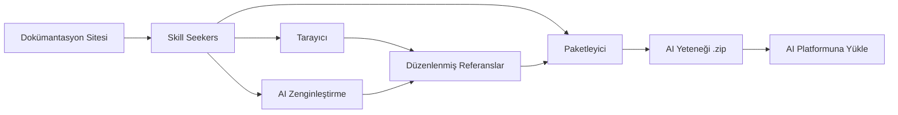

<p align="center">
  
</p>

# Skill Seekers

[English](README.md) | [简体中文](README.zh-CN.md) | [日本語](README.ja.md) | [한국어](README.ko.md) | [Español](README.es.md) | [Français](README.fr.md) | [Deutsch](README.de.md) | [Português](README.pt-BR.md) | Türkçe | [العربية](README.ar.md) | [हिन्दी](README.hi.md) | [Русский](README.ru.md)

> ⚠️ **Makine çevirisi bildirimi**
>
> Bu belge yapay zeka tarafından otomatik olarak çevrilmiştir. Kaliteyi sağlamak için çaba göstermemize rağmen, hatalı ifadeler bulunabilir.
>
> Çeviriyi iyileştirmemize yardımcı olmak için [GitHub Issue #260](https://github.com/yusufkaraaslan/Skill_Seekers/issues/260) üzerinden geri bildirimlerinizi paylaşabilirsiniz!

[](https://github.com/yusufkaraaslan/Skill_Seekers/releases)
[](https://opensource.org/licenses/MIT)
[](https://www.python.org/downloads/)
[](https://modelcontextprotocol.io)
[](tests/)
[](https://github.com/users/yusufkaraaslan/projects/2)
[](https://pypi.org/project/skill-seekers/)
[](https://pypi.org/project/skill-seekers/)
[](https://pypi.org/project/skill-seekers/)
[](https://pepy.tech/projects/skill-seekers)
<a href="https://trendshift.io/repositories/18329" target="_blank"></a>
[](https://skillseekersweb.com/)
[](https://x.com/_yUSyUS_)
[](https://github.com/yusufkaraaslan/Skill_Seekers)

**🧠 Yapay zeka sistemleri için veri katmanı.** Skill Seekers; dokümantasyon sitelerini, GitHub depolarını, PDF'leri, videoları, Jupyter not defterlerini, vikileri ve 10'dan fazla diğer kaynak türünü yapılandırılmış bilgi varlıklarına dönüştürür — AI Yetenekleri (Claude, Gemini, OpenAI), RAG hatları (LangChain, LlamaIndex, Pinecone) ve AI kodlama asistanları (Cursor, Windsurf, Cline) için saatler değil dakikalar içinde hazır hale getirir.

> 🌐 **[SkillSeekersWeb.com'u Ziyaret Edin](https://skillseekersweb.com/)** - 24'ten fazla hazır yapılandırmayı inceleyin, kendi yapılandırmalarınızı paylaşın ve tam dokümantasyona erişin!

> 📋 **[Geliştirme Yol Haritası ve Görevleri Görüntüleyin](https://github.com/users/yusufkaraaslan/projects/2)** - 10 kategoride 134 görev, istediğinizi seçip katkıda bulunun!

## 🌐 Ekosistem

Skill Seekers çoklu depo projesidır. Her şeyin bulunduğu yerler:

| Depo | Açıklama | Bağlantılar |
|------|----------|-------------|
| **[Skill_Seekers](https://github.com/yusufkaraaslan/Skill_Seekers)** | Ana CLI ve MCP sunucusu (bu depo) | [PyPI](https://pypi.org/project/skill-seekers/) |
| **[skillseekersweb](https://github.com/yusufkaraaslan/skillseekersweb)** | Web sitesi ve belgeler | [Site](https://skillseekersweb.com/) |
| **[skill-seekers-configs](https://github.com/yusufkaraaslan/skill-seekers-configs)** | Topluluk yapılandırma deposu | |
| **[skill-seekers-action](https://github.com/yusufkaraaslan/skill-seekers-action)** | GitHub Action CI/CD | |
| **[skill-seekers-plugin](https://github.com/yusufkaraaslan/skill-seekers-plugin)** | Claude Code eklentisi | |
| **[homebrew-skill-seekers](https://github.com/yusufkaraaslan/homebrew-skill-seekers)** | macOS için Homebrew tap | |

> **Katkıda bulunmak ister misiniz?** Web sitesi ve yapılandırma depoları yeni katkıda bulunanlar için harika başlangıç noktalarıdır!

## 🧠 Yapay Zeka Sistemleri İçin Veri Katmanı

**Skill Seekers, evrensel bir ön işleme katmanıdır** ve ham dokümantasyon ile onu tüketen tüm yapay zeka sistemleri arasında yer alır. İster Claude yetenekleri, ister LangChain RAG hattı, ister Cursor `.cursorrules` dosyası oluşturuyor olun — veri hazırlık süreci aynıdır. Bir kez yaparsınız, tüm hedef platformlara dışa aktarırsınız.

```bash
# Tek komut → yapılandırılmış bilgi varlığı
skill-seekers create https://docs.react.dev/
# veya: skill-seekers create facebook/react
# veya: skill-seekers create ./my-project

# Herhangi bir AI sistemine dışa aktar
skill-seekers package output/react --target claude      # → Claude AI Yeteneği (ZIP)
skill-seekers package output/react --target langchain   # → LangChain Documents
skill-seekers package output/react --target llama-index # → LlamaIndex TextNodes
skill-seekers package output/react --target cursor      # → .cursorrules
skill-seekers package output/react --target ibm-bob     # → IBM Bob yetenek dizini
```

### Oluşturulan Çıktılar

| Çıktı | Hedef | Kullanım Alanı |
|-------|-------|---------------|
| **Claude Yeteneği** (ZIP + YAML) | `--target claude` | Claude Code, Claude API |
| **Gemini Yeteneği** (tar.gz) | `--target gemini` | Google Gemini |
| **OpenAI / Custom GPT** (ZIP) | `--target openai` | GPT-4o, özel asistanlar |
| **LangChain Documents** | `--target langchain` | QA zincirleri, ajanlar, alıcılar |
| **LlamaIndex TextNodes** | `--target llama-index` | Sorgu motorları, sohbet motorları |
| **Haystack Documents** | `--target haystack` | Kurumsal RAG hatları |
| **Pinecone-hazır** (Markdown) | `--target markdown` | Vektör yükleme |
| **ChromaDB / FAISS / Qdrant** | `--target chroma/faiss/qdrant` | Yerel vektör veritabanları |
| **IBM Bob Yeteneği** (dizin) | `--target ibm-bob` | IBM Bob proje/global yetenekleri |
| **Cursor** `.cursorrules` | `--target markdown` → SKILL.md'yi kopyala | Cursor IDE `.cursorrules` |
| **Windsurf / Cline / Continue** | `--target claude` → kopyala | VS Code, IntelliJ, Vim |

### Neden Önemli

- ⚡ **%99 daha hızlı** — Günlerce süren manuel veri hazırlığı → 15–45 dakika
- 🎯 **AI Yetenek kalitesi** — Örnekler, desenler ve kılavuzlar içeren 500+ satırlık SKILL.md dosyaları
- 📊 **RAG-hazır parçalar** — Kod bloklarını koruyan ve bağlamı sürdüren akıllı parçalama
- 🎬 **Videolar** — YouTube ve yerel videolardan kod, altyazı ve yapılandırılmış bilgi çıkarma
- 🔄 **Çoklu kaynak** — 18 kaynak türünü (dokümantasyon, GitHub, PDF, video, not defterleri, vikiler ve daha fazlası) tek bir bilgi varlığında birleştirme
- 🌐 **Bir hazırlık, her hedef** — Yeniden tarama yapmadan aynı varlığı 21 platforma dışa aktarma
- ✅ **Savaşta test edilmiş** — 3.700+ test, 24+ çerçeve ön ayarı, üretime hazır

## 🚀 Hızlı Başlangıç (3 Komut)

```bash
# 1. Kurulum
pip install skill-seekers

# 2. Herhangi bir kaynaktan yetenek oluştur
skill-seekers create https://docs.django.com/

# 3. AI platformunuz için paketle
skill-seekers package output/django --target claude
```

**İşte bu kadar!** Artık kullanıma hazır `output/django-claude.zip` dosyanız var.

```bash
# Zenginleştirme için farklı bir AI ajanı kullan (varsayılan: claude)
skill-seekers create https://docs.django.com/ --agent kimi
skill-seekers create https://docs.django.com/ --agent codex
skill-seekers create https://docs.django.com/ --agent-cmd "my-custom-agent run"
```

### 🛰️ AI destekli proje taraması (yeni)

`scan` komutunu herhangi bir projeye yöneltin; bir AI ajanı projenin manifest
dosyalarını, README'sini, Dockerfile/CI dosyalarını ve örneklenmiş kaynak içe
aktarımlarını okur — ardından algılanan her çerçeve için bir yapılandırma ve
kendi kodunuz için bir `<project>-codebase.json` üretir. Algılanan sürümü
sabitler, böylece yeniden çalıştırmalar sürüm artışlarını raporlar:

```bash
skill-seekers scan ./my-react-app --out ./configs/scanned/
# → react.json, vite.json, tailwind.json, jest.json, my-react-app-codebase.json

# Ardından istediğinizi oluşturun
skill-seekers create ./configs/scanned/react.json
```

Bir algılamanın mevcut ön ayarı yoksa AI sıfırdan bir yapılandırma üretir;
çıkışta bunu isteğe bağlı olarak [topluluk kayıt deposuna](https://github.com/yusufkaraaslan/skill-seekers-configs) geri yayınlayabilirsiniz.

### Diğer Kaynaklar (18 Desteklenen)

```bash
# GitHub deposu
skill-seekers create facebook/react

# Yerel proje
skill-seekers create ./my-project

# PDF belgesi
skill-seekers create manual.pdf

# Word belgesi
skill-seekers create report.docx

# EPUB e-kitap
skill-seekers create book.epub

# Jupyter Not Defteri
skill-seekers create notebook.ipynb

# OpenAPI spec
skill-seekers create openapi.yaml

# PowerPoint sunumu
skill-seekers create presentation.pptx

# AsciiDoc belgesi
skill-seekers create guide.adoc

# Yerel HTML dosyası (uzantıdan otomatik algılanır)
skill-seekers create page.html

# HTML dosyalarından oluşan bütün bir dizin (HTML ağırlıklı dizinler için otomatik algılanır)
skill-seekers create ./mirror_output/site/

# Karışık/kod ağırlıklı bir dizinde HTML modunu zorla
skill-seekers create ./repo/ --html-path ./repo/docs/build/html/

# RSS/Atom beslemesi
skill-seekers create feed.rss

# Man sayfası
skill-seekers create curl.1

# Video (YouTube, Vimeo veya yerel dosya — skill-seekers[video] gerektirir)
skill-seekers create --video-url https://www.youtube.com/watch?v=... --name mytutorial
# İlk kez mi? GPU destekli görsel bağımlılıkları otomatik kur:
skill-seekers create --setup

# Confluence vikisi
skill-seekers create --space-key TEAM --name wiki

# Notion sayfaları
skill-seekers create --database-id ... --name docs

# Slack/Discord sohbet dışa aktarımı
skill-seekers create --chat-export-path ./slack-export --name team-chat
```

### Her Yere Dışa Aktar

```bash
# Birden fazla platform için paketle
for platform in claude gemini openai langchain; do
  skill-seekers package output/django --target $platform
done
```

## Skill Seekers Nedir?

Skill Seekers, **yapay zeka sistemleri için veri katmanıdır**. 18 kaynak türünü — dokümantasyon siteleri, GitHub depoları, PDF'ler, videolar, Jupyter Not Defterleri, Word/EPUB/AsciiDoc belgeleri, OpenAPI spesifikasyonları, PowerPoint sunumları, RSS beslemeleri, man sayfaları, Confluence vikileri, Notion sayfaları, Slack/Discord dışa aktarımları ve daha fazlasını — her AI hedefi için yapılandırılmış bilgi varlıklarına dönüştürür:

| Kullanım Alanı | Elde Ettiğiniz | Örnekler |
|----------------|---------------|----------|
| **AI Yetenekleri** | Kapsamlı SKILL.md + referanslar | Claude Code, Gemini, GPT |
| **RAG Hatları** | Zengin meta verili parçalanmış belgeler | LangChain, LlamaIndex, Haystack |
| **Vektör Veritabanları** | Yüklemeye hazır önceden biçimlendirilmiş veri | Pinecone, Chroma, Weaviate, FAISS |
| **AI Kodlama Asistanları** | IDE yapay zekasının otomatik okuduğu bağlam dosyaları | Cursor, Windsurf, Cline, Continue.dev |

Skill Seekers, günlerce süren manuel ön işleme çalışması yerine şunları yapar:

1. **Toplama** — Dokümantasyon, GitHub depoları, yerel kod tabanları, PDF'ler, videolar, Jupyter not defterleri, vikiler ve 10'dan fazla diğer kaynak türü
2. **Analiz** — Derin AST ayrıştırma, desen tespiti, API çıkarma
3. **Yapılandırma** — Meta verili kategorize edilmiş referans dosyaları
4. **Zenginleştirme** — AI destekli SKILL.md oluşturma (Claude, Gemini veya yerel)
5. **Dışa Aktarma** — Tek bir varlıktan 16 platforma özel format

## 📚 Dokümantasyon

| Yapmak istediğim... | Bunu oku |
|---------------------|----------|
| **Hızlıca başlamak** | [Hızlı Başlangıç](docs/getting-started/02-quick-start.md) - İlk yetenek için 3 komut |
| **Kavramları anlamak** | [Temel Kavramlar](docs/user-guide/01-core-concepts.md) - Nasıl çalışır |
| **Kaynak taramak** | [Tarama Kılavuzu](docs/user-guide/02-scraping.md) - Tüm kaynak türleri |
| **Yetenekleri geliştirmek** | [Zenginleştirme Kılavuzu](docs/user-guide/03-enhancement.md) - AI zenginleştirme |
| **Yetenekleri dışa aktarmak** | [Paketleme Kılavuzu](docs/user-guide/04-packaging.md) - Platform dışa aktarımı |
| **Komutları aramak** | [CLI Referansı](docs/reference/CLI_REFERENCE.md) - Tüm 20 komut |
| **Yapılandırma yapmak** | [Yapılandırma Formatı](docs/reference/CONFIG_FORMAT.md) - JSON spesifikasyonu |
| **Sorunları çözmek** | [Sorun Giderme](docs/user-guide/06-troubleshooting.md) - Yaygın sorunlar |

**Tam dokümantasyon:** [docs/README.md](docs/README.md)

## Neden Kullanmalısınız?

### AI Yetenek Oluşturucuları İçin (Claude, Gemini, OpenAI)

- 🎯 **Üretime hazır yetenekler** — Kod örnekleri, desenler ve kılavuzlar içeren 500+ satırlık SKILL.md dosyaları
- 🔄 **Zenginleştirme iş akışları** — `security-focus`, `architecture-comprehensive` veya özel YAML ön ayarları uygulayın
- 🎮 **Her alan** — Oyun motorları (Godot, Unity), çerçeveler (React, Django), dahili araçlar
- 🔧 **Ekipler** — Dahili dokümantasyon + kodu tek bir doğruluk kaynağında birleştirin
- 📚 **Kalite** — Örnekler, hızlı referans ve navigasyon kılavuzu ile AI zenginleştirilmiş

### RAG Geliştiricileri ve AI Mühendisleri İçin

- 🤖 **RAG-hazır veri** — Önceden parçalanmış LangChain `Documents`, LlamaIndex `TextNodes`, Haystack `Documents`
- 🚀 **%99 daha hızlı** — Günlerce süren ön işleme → 15–45 dakika
- 📊 **Akıllı meta veri** — Kategoriler, kaynaklar, türler → daha iyi alma doğruluğu
- 🔄 **Çoklu kaynak** — Tek bir hatta dokümantasyon + GitHub + PDF + video birleştirme
- 🌐 **Platform bağımsız** — Yeniden tarama yapmadan herhangi bir vektör veritabanına veya çerçeveye dışa aktarma

### AI Kodlama Asistanı Kullanıcıları İçin

- 💻 **Cursor / Windsurf / Cline** — Otomatik `.cursorrules` / `.windsurfrules` / `.clinerules` oluşturma
- 🎯 **Kalıcı bağlam** — Tekrarlanan yönlendirme olmadan AI çerçevelerinizi "bilir"
- 📚 **Her zaman güncel** — Dokümantasyon değiştiğinde bağlamı dakikalar içinde güncelleyin

## Temel Özellikler

### 🌐 Dokümantasyon Tarama
- ✅ **Akıllı SPA Keşfi** - JavaScript SPA siteleri için üç katmanlı keşif (sitemap.xml → llms.txt → başsız tarayıcı ile işleme)
- ✅ **llms.txt Desteği** - LLM-hazır dokümantasyon dosyalarını otomatik algılar ve kullanır (10 kat daha hızlı)
- ✅ **Evrensel Tarayıcı** - HERHANGİ bir dokümantasyon sitesiyle çalışır
- ✅ **Akıllı Kategorileme** - İçeriği konuya göre otomatik düzenler
- ✅ **Kod Dili Algılama** - Python, JavaScript, C++, GDScript vb. tanır
- ✅ **24+ Hazır Ön Ayar** - Godot, React, Vue, Django, FastAPI ve daha fazlası

### 📄 PDF Desteği
- ✅ **Temel PDF Çıkarma** - PDF dosyalarından metin, kod ve resim çıkarma
- ✅ **Taranmış PDF'ler İçin OCR** - Taranmış belgelerden metin çıkarma
- ✅ **Parola Korumalı PDF'ler** - Şifrelenmiş PDF'leri işleme
- ✅ **Tablo Çıkarma** - PDF'lerden karmaşık tabloları çıkarma
- ✅ **Paralel İşleme** - Büyük PDF'ler için 3 kat daha hızlı
- ✅ **Akıllı Önbellekleme** - Tekrar çalıştırmalarda %50 daha hızlı

### 🎬 Video Çıkarma
- ✅ **YouTube ve Yerel Videolar** - Videolardan altyazı, kod ve yapılandırılmış bilgi çıkarma
- ✅ **Görsel Kare Analizi** - Kod editörleri, terminaller, slaytlar ve diyagramlardan OCR çıkarma
- ✅ **GPU Otomatik Algılama** - Doğru PyTorch derlemesini otomatik yükleme (CUDA/ROCm/MPS/CPU)
- ✅ **AI Zenginleştirme** - İki aşamalı: OCR yapıtlarını temizleme + gösterişli SKILL.md oluşturma
- ✅ **Zaman Kırpma** - `--start-time` ve `--end-time` ile belirli bölümleri çıkarma
- ✅ **Oynatma Listesi Desteği** - YouTube oynatma listesindeki tüm videoları toplu işleme
- ✅ **Vision API Yedekleme** - Düşük güvenilirlikli OCR kareleri için Claude Vision kullanma

### 🐙 GitHub Deposu Analizi
- ✅ **Derin Kod Analizi** - Python, JavaScript, TypeScript, Java, C++, Go için AST ayrıştırma
- ✅ **API Çıkarma** - Parametreler ve türlerle fonksiyonlar, sınıflar, yöntemler
- ✅ **Depo Meta Verileri** - README, dosya ağacı, dil dağılımı, yıldız/çatal sayıları
- ✅ **GitHub Issues ve PR'ler** - Etiketler ve kilometre taşlarıyla açık/kapalı sorunları getirme
- ✅ **CHANGELOG ve Sürümler** - Sürüm geçmişini otomatik çıkarma
- ✅ **Çakışma Tespiti** - Belgelenmiş API'ler ile gerçek kod uygulamasını karşılaştırma
- ✅ **MCP Entegrasyonu** - Doğal dil: "GitHub deposu facebook/react'i tara"

### 🔄 Birleşik Çoklu Kaynak Tarama
- ✅ **Birden Fazla Kaynağı Birleştirme** - Tek bir yetenekte dokümantasyon + GitHub + PDF karıştırma
- ✅ **Çakışma Tespiti** - Dokümantasyon ile kod arasındaki tutarsızlıkları otomatik bulma
- ✅ **Akıllı Birleştirme** - Kural tabanlı veya AI destekli çakışma çözümleme
- ✅ **Şeffaf Raporlama** - ⚠️ uyarılarıyla yan yana karşılaştırma
- ✅ **Dokümantasyon Boşluk Analizi** - Güncelliğini yitirmiş dokümantasyon ve belgelenmemiş özellikleri belirleme
- ✅ **Tek Doğruluk Kaynağı** - Hem niyet (dokümantasyon) hem de gerçeği (kod) gösteren tek yetenek
- ✅ **Geriye Dönük Uyumluluk** - Eski tek kaynaklı yapılandırmalar çalışmaya devam eder

### 🤖 Çoklu LLM Platform Desteği
- ✅ **12 LLM Platformu** - Claude AI, Google Gemini, OpenAI ChatGPT, MiniMax AI, Genel Markdown, OpenCode, Kimi (Moonshot AI), DeepSeek AI, Qwen (Alibaba), OpenRouter, Together AI, Fireworks AI
- ✅ **Evrensel Tarama** - Aynı dokümantasyon tüm platformlar için çalışır
- ✅ **Platforma Özel Paketleme** - Her LLM için optimize edilmiş formatlar
- ✅ **Tek Komutla Dışa Aktarma** - `--target` bayrağı ile platform seçimi
- ✅ **İsteğe Bağlı Bağımlılıklar** - Yalnızca ihtiyacınız olanı yükleyin
- ✅ **%100 Geriye Dönük Uyumluluk** - Mevcut Claude iş akışları değişmez

| Platform | Format | Yükleme | Zenginleştirme | API Key | Özel Uç Nokta |
|----------|--------|---------|----------------|---------|---------------|
| **Claude AI** | ZIP + YAML | ✅ Otomatik | ✅ Evet | ANTHROPIC_API_KEY | ANTHROPIC_BASE_URL |
| **Google Gemini** | tar.gz | ✅ Otomatik | ✅ Evet | GOOGLE_API_KEY | - |
| **OpenAI ChatGPT** | ZIP + Vector Store | ✅ Otomatik | ✅ Evet | OPENAI_API_KEY | - |
| **MiniMax AI** | ZIP + Knowledge Files | ✅ Otomatik | ✅ Evet | MINIMAX_API_KEY | - |
| **Genel Markdown** | ZIP | ❌ Manuel | ❌ Hayır | - | - |

```bash
# Claude (varsayılan - değişiklik gerekmez!)
skill-seekers package output/react/
skill-seekers upload react.zip

# Google Gemini
pip install skill-seekers[gemini]
skill-seekers package output/react/ --target gemini
skill-seekers upload react-gemini.tar.gz --target gemini

# OpenAI ChatGPT
pip install skill-seekers[openai]
skill-seekers package output/react/ --target openai
skill-seekers upload react-openai.zip --target openai

# MiniMax AI
pip install skill-seekers[minimax]
skill-seekers package output/react/ --target minimax
skill-seekers upload react-minimax.zip --target minimax

# Genel Markdown (evrensel dışa aktarma)
skill-seekers package output/react/ --target markdown
# Markdown dosyalarını doğrudan herhangi bir LLM'de kullanın
```

<details>
<summary>🔧 <strong>Kendi AI sağlayıcınızı kullanın (OpenAI uyumlu uç noktalar + abonelikler, Anthropic kredisi gerekmez)</strong></summary>

İsteğe bağlı AI **zenginleştirme** adımı (`create`, `scan` ve `enhance` tarafından kullanılır) bir Anthropic anahtarı **gerektirmez**. Bunu çalıştırmanın üç yolu vardır:

**1. Zaten ödediğiniz bir aboneliği kullanın — hiç API kredisi gerekmez (LOCAL ajan modu)**

Skill Seekers, halihazırda oturum açtığınız bir kodlama ajanı CLI'sini çağırabilir; böylece zenginleştirme, ölçülen API token'ları yerine mevcut planınız üzerinden çalışır:

```bash
skill-seekers create <source> --agent codex     # OpenAI Codex CLI → ChatGPT Plus planınız
skill-seekers create <source> --agent claude    # Claude Code      → Claude Pro/Max planınız
```

Desteklenen ajanlar: `claude`, `codex`, `copilot`, `opencode`, `kimi` ve `custom`
(başka herhangi bir aracı kullanmak için `--agent custom` ile `--agent-cmd "<your-cli> ..."` birleştirin).

**2. Herhangi bir OpenAI uyumlu sağlayıcı (OpenRouter, Groq, Cerebras, Mistral, NVIDIA NIM, …)**

Bunların tümü OpenAI uyumlu bir `/v1` uç noktası sunar. Skill Seekers'ı üç ortam değişkeniyle birine yönlendirin — `OPENAI_API_KEY` algılanır ve OpenAI SDK'sı `OPENAI_BASE_URL` değişkenini otomatik olarak dikkate alır:

```bash
export OPENAI_API_KEY="<your provider key>"
export OPENAI_BASE_URL="https://openrouter.ai/api/v1"   # sağlayıcı uç noktası (tabloya bakın)
export OPENAI_MODEL="<a model that provider offers>"     # zorunlu — varsayılan gpt-4o başka yerde bulunmaz
skill-seekers create <source>
```

| Sağlayıcı    | `OPENAI_BASE_URL`                          |
|--------------|--------------------------------------------|
| OpenRouter   | `https://openrouter.ai/api/v1`             |
| Groq         | `https://api.groq.com/openai/v1`           |
| Cerebras     | `https://api.cerebras.ai/v1`               |
| Mistral      | `https://api.mistral.ai/v1`                |
| NVIDIA NIM   | `https://integrate.api.nvidia.com/v1`      |

> Sağlayıcı algılama, bulduğu **ilk** API anahtarı ortam değişkenini seçer (`ANTHROPIC_API_KEY` → `GOOGLE_API_KEY` → `OPENAI_API_KEY` → `MOONSHOT_API_KEY`). Belirli bir sağlayıcıyı zorlamak için `SKILL_SEEKER_PROVIDER` ayarlayın veya daha yüksek öncelikli anahtarların tanımsız olduğundan emin olun.

**3. Claude uyumlu uç noktalar (ör. GLM, proxy'ler)**

```bash
export ANTHROPIC_API_KEY="your-key"
export ANTHROPIC_BASE_URL="https://your-claude-compatible-endpoint/v1"
```

Google Gemini (`GOOGLE_API_KEY`) ve Kimi/Moonshot (`MOONSHOT_API_KEY`) da yerel olarak desteklenir. Sağlayıcı başına model geçersiz kılmaları dahil tam liste için **[Ortam Değişkenleri Referansı](docs/reference/ENVIRONMENT_VARIABLES.md#llm-provider-selection)** bölümüne bakın.

</details>

**Kurulum:**
```bash
# Gemini desteği ile kur
pip install skill-seekers[gemini]

# OpenAI desteği ile kur
pip install skill-seekers[openai]

# MiniMax desteği ile kur
pip install skill-seekers[minimax]

# Tüm LLM platformlarını kur
pip install skill-seekers[all-llms]
```

### 🔗 RAG Çerçeve Entegrasyonları

- ✅ **LangChain Documents** - `page_content` + meta veri ile doğrudan `Document` formatına dışa aktarma
  - İçin uygun: QA zincirleri, alıcılar, vektör depoları, ajanlar
  - Örnek: [LangChain RAG Hattı](examples/langchain-rag-pipeline/)
  - Kılavuz: [LangChain Entegrasyonu](docs/integrations/LANGCHAIN.md)

- ✅ **LlamaIndex TextNodes** - Benzersiz ID'ler + gömüler ile `TextNode` formatına dışa aktarma
  - İçin uygun: Sorgu motorları, sohbet motorları, depolama bağlamı
  - Örnek: [LlamaIndex Sorgu Motoru](examples/llama-index-query-engine/)
  - Kılavuz: [LlamaIndex Entegrasyonu](docs/integrations/LLAMA_INDEX.md)

- ✅ **Pinecone-Hazır Format** - Vektör veritabanı yüklemesi için optimize edilmiş
  - İçin uygun: Üretim vektör araması, anlamsal arama, hibrit arama
  - Örnek: [Pinecone Yükleme](examples/pinecone-upsert/)
  - Kılavuz: [Pinecone Entegrasyonu](docs/integrations/PINECONE.md)

**Hızlı Dışa Aktarma:**
```bash
# LangChain Documents (JSON)
skill-seekers package output/django --target langchain
# → output/django-langchain.json

# LlamaIndex TextNodes (JSON)
skill-seekers package output/django --target llama-index
# → output/django-llama-index.json

# Markdown (Evrensel)
skill-seekers package output/django --target markdown
# → output/django-markdown/SKILL.md + references/
```

**Tam RAG Hattı Kılavuzu:** [RAG Hatları Dokümantasyonu](docs/integrations/RAG_PIPELINES.md)

---

### 🧠 AI Kodlama Asistanı Entegrasyonları

Herhangi bir çerçeve dokümantasyonunu 4+ AI asistanı için uzman kodlama bağlamına dönüştürün:

- ✅ **Cursor IDE** - AI destekli kod önerileri için `.cursorrules` oluşturma
  - İçin uygun: Çerçeveye özel kod üretimi, tutarlı desenler
  - Birlikte çalışır: Cursor IDE (VS Code çatalı)
  - Kılavuz: [Cursor Entegrasyonu](docs/integrations/CURSOR.md)
  - Örnek: [Cursor React Yeteneği](examples/cursor-react-skill/)

- ✅ **Windsurf** - `.windsurfrules` ile Windsurf AI asistanı bağlamını özelleştirme
  - İçin uygun: IDE-yerel AI yardımı, akış tabanlı kodlama
  - Birlikte çalışır: Codeium tarafından Windsurf IDE
  - Kılavuz: [Windsurf Entegrasyonu](docs/integrations/WINDSURF.md)
  - Örnek: [Windsurf FastAPI Bağlamı](examples/windsurf-fastapi-context/)

- ✅ **Cline (VS Code)** - VS Code ajanı için sistem yönergeleri + MCP
  - İçin uygun: VS Code'da ajanlı kod üretimi
  - Birlikte çalışır: VS Code için Cline eklentisi
  - Kılavuz: [Cline Entegrasyonu](docs/integrations/CLINE.md)
  - Örnek: [Cline Django Asistanı](examples/cline-django-assistant/)

- ✅ **Continue.dev** - IDE bağımsız AI için bağlam sunucuları
  - İçin uygun: Çoklu IDE ortamları (VS Code, JetBrains, Vim), özel LLM sağlayıcıları
  - Birlikte çalışır: Continue.dev eklentisi bulunan herhangi bir IDE
  - Kılavuz: [Continue Entegrasyonu](docs/integrations/CONTINUE_DEV.md)
  - Örnek: [Continue Evrensel Bağlam](examples/continue-dev-universal/)

**AI Kodlama Araçları İçin Hızlı Dışa Aktarma:**
```bash
# Herhangi bir AI kodlama asistanı için (Cursor, Windsurf, Cline, Continue.dev)
skill-seekers create --config configs/django.json
skill-seekers package output/django --target claude  # veya --target markdown

# Projenize kopyalayın (Cursor örneği)
cp output/django-claude/SKILL.md my-project/.cursorrules

# Veya Windsurf için
cp output/django-claude/SKILL.md my-project/.windsurf/rules/django.md

# Veya Cline için
cp output/django-claude/SKILL.md my-project/.clinerules

# Veya Continue.dev için (HTTP sunucusu)
python examples/continue-dev-universal/context_server.py
# ~/.continue/config.json içinde yapılandırın
```

**Entegrasyon Merkezi:** [Tüm AI Sistemi Entegrasyonları](docs/integrations/INTEGRATIONS.md)

---

### 🌊 Üç Akışlı GitHub Mimarisi
- ✅ **Üçlü Akış Analizi** - GitHub depolarını Kod, Dokümantasyon ve İçgörü akışlarına ayırma
- ✅ **Birleşik Kod Tabanı Analizcisi** - GitHub URL'leri VE yerel yollarla çalışır
- ✅ **C3.x Analiz Derinliği** - 'basic' (1-2 dk) veya 'c3x' (20-60 dk) analiz seçimi
- ✅ **Geliştirilmiş Yönlendirici Oluşturma** - GitHub meta verileri, README hızlı başlangıç, yaygın sorunlar
- ✅ **Issue Entegrasyonu** - GitHub Issues'dan en yaygın sorunlar ve çözümler
- ✅ **Akıllı Yönlendirme Anahtar Kelimeleri** - Daha iyi konu tespiti için GitHub etiketleri 2 kat ağırlıklandırılmış

**Üç Akış Açıklaması:**
- **Akış 1: Kod** - Derin C3.x analizi (desenler, örnekler, kılavuzlar, yapılandırmalar, mimari)
- **Akış 2: Dokümantasyon** - Depo dokümantasyonu (README, CONTRIBUTING, docs/*.md)
- **Akış 3: İçgörüler** - Topluluk bilgisi (issues, etiketler, yıldızlar, çatallar)

```python
from skill_seekers.cli.unified_codebase_analyzer import UnifiedCodebaseAnalyzer

# GitHub deposunu üç akışla analiz et
analyzer = UnifiedCodebaseAnalyzer()
result = analyzer.analyze(
    source="https://github.com/facebook/react",
    depth="c3x",  # veya hızlı analiz için "basic"
    fetch_github_metadata=True
)

# Kod akışına eriş (C3.x analizi)
print(f"Tasarım desenleri: {len(result.code_analysis['c3_1_patterns'])}")
print(f"Test örnekleri: {result.code_analysis['c3_2_examples_count']}")

# Dokümantasyon akışına eriş (depo dokümantasyonu)
print(f"README: {result.github_docs['readme'][:100]}")

# İçgörü akışına eriş (GitHub meta verileri)
print(f"Yıldızlar: {result.github_insights['metadata']['stars']}")
print(f"Yaygın sorunlar: {len(result.github_insights['common_problems'])}")
```

**Tam dokümantasyonu görüntüle**: [Üç Akışlı Uygulama Özeti](docs/archive/historical/IMPLEMENTATION_SUMMARY_THREE_STREAM.md)

### 🔐 Akıllı İstek Hızı Limiti Yönetimi ve Yapılandırma
- ✅ **Çoklu Token Yapılandırma Sistemi** - Birden fazla GitHub hesabını yönetme (kişisel, iş, açık kaynak)
  - `~/.config/skill-seekers/config.json` konumunda güvenli yapılandırma depolama (600 izinleri)
  - Profil başına hız limiti stratejileri: `prompt`, `wait`, `switch`, `fail`
  - Profil başına yapılandırılabilir zaman aşımı (varsayılan: 30 dk, süresiz beklemeyi önler)
  - Akıllı yedekleme zinciri: CLI argümanı → Ortam değişkeni → Yapılandırma dosyası → İstem
  - Claude, Gemini, OpenAI için API anahtarı yönetimi
- ✅ **Etkileşimli Yapılandırma Sihirbazı** - Kolay kurulum için güzel terminal arayüzü
  - Token oluşturma için tarayıcı entegrasyonu (otomatik olarak GitHub vb. açar)
  - Token doğrulama ve bağlantı testi
  - Renk kodlamalı görsel durum göstergesi
- ✅ **Akıllı Hız Limiti İşleyicisi** - Artık süresiz bekleme yok!
  - Hız limitleri hakkında önceden uyarı (60/saat vs 5000/saat)
  - GitHub API yanıtlarından gerçek zamanlı algılama
  - İlerleme ile canlı geri sayım zamanlayıcıları
  - Hız sınırına ulaşıldığında otomatik profil değiştirme
  - Dört strateji: prompt (sor), wait (geri sayım), switch (başkasını dene), fail (iptal et)
- ✅ **Devam Etme Yeteneği** - Kesilen işlere devam etme
  - Yapılandırılabilir aralıklarla otomatik ilerleme kaydetme (varsayılan: 60 sn)
  - İlerleme ayrıntılarıyla tüm devam ettirilebilir işleri listeleme
  - Eski işleri otomatik temizleme (varsayılan: 7 gün)
- ✅ **CI/CD Desteği** - Otomasyon için etkileşimsiz mod
  - `--non-interactive` bayrağı istemler olmadan hızlı başarısızlık
  - `--profile` bayrağı ile belirli GitHub hesabı seçimi
  - Hat günlükleri için açık hata mesajları

**Hızlı Kurulum:**
```bash
# Tek seferlik yapılandırma (5 dakika)
skill-seekers config --github

# Özel depolar için belirli profil kullanma
skill-seekers create mycompany/private-repo --profile work

# CI/CD modu (hızlı başarısızlık, istem yok)
skill-seekers create owner/repo --non-interactive

# Kesilen işe devam etme
skill-seekers resume --list
skill-seekers resume github_react_20260117_143022
```

**Hız Limiti Stratejileri Açıklaması:**
- **prompt** (varsayılan) - Hız sınırına ulaşıldığında ne yapılacağını sor (bekle, değiştir, token kur, iptal)
- **wait** - Geri sayım zamanlayıcısıyla otomatik bekleme (zaman aşımına uyar)
- **switch** - Sonraki kullanılabilir profili otomatik deneme (çoklu hesap kurulumları için)
- **fail** - Açık hata ile hemen başarısız olma (CI/CD için mükemmel)

### 🎯 Bootstrap Yeteneği - Kendi Kendini Barındırma

Skill-seekers'ı AI ajanınız (Claude Code, Kimi, Codex vb.) içinde kullanmak üzere bir yetenek olarak oluşturma:

```bash
# Yeteneği oluştur
./scripts/bootstrap_skill.sh

# Claude Code'a yükle
cp -r output/skill-seekers ~/.claude/skills/
```

**Elde ettikleriniz:**
- ✅ **Tam yetenek dokümantasyonu** - Tüm CLI komutları ve kullanım desenleri
- ✅ **CLI komut referansı** - Her araç ve seçenekleri belgelenmiş
- ✅ **Hızlı başlangıç örnekleri** - Yaygın iş akışları ve en iyi uygulamalar
- ✅ **Otomatik oluşturulan API dokümantasyonu** - Kod analizi, desenler ve örnekler

### 🔐 Özel Yapılandırma Depoları
- ✅ **Git Tabanlı Yapılandırma Kaynakları** - Özel/ekip git depolarından yapılandırma getirme
- ✅ **Çoklu Kaynak Yönetimi** - Sınırsız GitHub, GitLab, Bitbucket deposu kaydetme
- ✅ **Ekip İşbirliği** - 3-5 kişilik ekipler arasında özel yapılandırmaları paylaşma
- ✅ **Kurumsal Destek** - Öncelik tabanlı çözümleme ile 500+ geliştiriciye ölçekleme
- ✅ **Güvenli Kimlik Doğrulama** - Ortam değişkeni token'ları (GITHUB_TOKEN, GITLAB_TOKEN)
- ✅ **Akıllı Önbellekleme** - Bir kez klonla, güncellemeleri otomatik çek
- ✅ **Çevrimdışı Mod** - Çevrimdışıyken önbelleğe alınmış yapılandırmalarla çalışma

### 🤖 Kod Tabanı Analizi (C3.x)

**C3.4: AI Zenginleştirmeli Yapılandırma Deseni Çıkarma**
- ✅ **9 Yapılandırma Formatı** - JSON, YAML, TOML, ENV, INI, Python, JavaScript, Dockerfile, Docker Compose
- ✅ **7 Desen Türü** - Veritabanı, API, günlükleme, önbellek, e-posta, kimlik doğrulama, sunucu yapılandırmaları
- ✅ **AI Zenginleştirme** - İsteğe bağlı çift modlu AI analizi (API + LOCAL)
  - Her yapılandırmanın ne yaptığını açıklar
  - En iyi uygulamaları ve iyileştirmeleri önerir
  - **Güvenlik analizi** - Sabit kodlanmış sırları, açığa çıkmış kimlik bilgilerini bulur
- ✅ **Otomatik Belgeleme** - Tüm yapılandırmaların JSON + Markdown dokümantasyonunu oluşturur
- ✅ **MCP Entegrasyonu** - Zenginleştirme destekli `extract_config_patterns` aracı

**C3.3: AI Zenginleştirilmiş Nasıl Yapılır Kılavuzları**
- ✅ **Kapsamlı AI Zenginleştirme** - Temel kılavuzları profesyonel eğitimlere dönüştürme
- ✅ **5 Otomatik İyileştirme** - Adım açıklamaları, sorun giderme, ön koşullar, sonraki adımlar, kullanım senaryoları
- ✅ **Çift Mod Desteği** - API modu (Claude API) veya LOCAL modu (Claude Code CLI)
- ✅ **LOCAL Moduyla Ücretsiz** - Claude Code Max planınızı kullanarak ÜCRETSİZ zenginleştirme
- ✅ **Kalite Dönüşümü** - 75 satırlık şablonlar → 500+ satırlık kapsamlı kılavuzlar

**Kullanım:**
```bash
# Hızlı analiz (1-2 dk, yalnızca temel özellikler)
skill-seekers scan tests/ --quick

# AI ile kapsamlı analiz (20-60 dk, tüm özellikler)
skill-seekers scan tests/ --comprehensive

# AI zenginleştirme ile
skill-seekers scan tests/ --enhance
```

**Tam Dokümantasyon:** [docs/features/HOW_TO_GUIDES.md](docs/features/HOW_TO_GUIDES.md#ai-enhancement-new)

### 🔄 Zenginleştirme İş Akışı Ön Ayarları

AI'nın ham dokümantasyonunuzu cilalı bir yeteneğe nasıl dönüştüreceğini kontrol eden yeniden kullanılabilir YAML tanımlı zenginleştirme hatları.

- ✅ **5 Yerleşik Ön Ayar** — `default`, `minimal`, `security-focus`, `architecture-comprehensive`, `api-documentation`
- ✅ **Kullanıcı Tanımlı Ön Ayarlar** — `~/.config/skill-seekers/workflows/` dizinine özel iş akışları ekleme
- ✅ **Çoklu İş Akışları** — Tek komutta iki veya daha fazla iş akışını zincirleme
- ✅ **Tam CLI Yönetimi** — İş akışlarını listeleme, inceleme, kopyalama, ekleme, kaldırma ve doğrulama

```bash
# Tek iş akışı uygula
skill-seekers create ./my-project --enhance-workflow security-focus

# Birden fazla iş akışını zincirle (sırayla uygulanır)
skill-seekers create ./my-project \
  --enhance-workflow security-focus \
  --enhance-workflow minimal

# Ön ayarları yönet
skill-seekers workflows list                          # Tümünü listele (yerleşik + kullanıcı)
skill-seekers workflows show security-focus           # YAML içeriğini yazdır
skill-seekers workflows copy security-focus           # Düzenleme için kullanıcı dizinine kopyala
skill-seekers workflows add ./my-workflow.yaml        # Özel ön ayar yükle
skill-seekers workflows remove my-workflow            # Kullanıcı ön ayarını kaldır
skill-seekers workflows validate security-focus       # Ön ayar yapısını doğrula

# Aynı anda birden fazla kopyala
skill-seekers workflows copy security-focus minimal api-documentation

# Aynı anda birden fazla dosya ekle
skill-seekers workflows add ./wf-a.yaml ./wf-b.yaml

# Aynı anda birden fazla kaldır
skill-seekers workflows remove my-wf-a my-wf-b
```

**YAML ön ayar formatı:**
```yaml
name: security-focus
description: "Güvenlik odaklı inceleme: güvenlik açıkları, kimlik doğrulama, veri işleme"
version: "1.0"
stages:
  - name: vulnerabilities
    type: custom
    prompt: "OWASP ilk 10 ve yaygın güvenlik açıklarını inceleyin..."
  - name: auth-review
    type: custom
    prompt: "Kimlik doğrulama ve yetkilendirme desenlerini inceleyin..."
    uses_history: true
```

### ⚡ Performans ve Ölçek
- ✅ **Asenkron Mod** - async/await ile 2-3 kat daha hızlı tarama (`--async` bayrağını kullanın)
- ✅ **Büyük Dokümantasyon Desteği** - Akıllı bölme ile 10K-40K+ sayfalık dokümantasyonu işleme
- ✅ **Yönlendirici/Hub Yetenekleri** - Özelleştirilmiş alt yeteneklere akıllı yönlendirme
- ✅ **Paralel Tarama** - Birden fazla yeteneği aynı anda işleme
- ✅ **Kontrol Noktası/Devam Etme** - Uzun taramalarda hiçbir zaman ilerleme kaybetmeyin
- ✅ **Önbellekleme Sistemi** - Bir kez tara, anında yeniden oluştur

### 🤖 Ajan Bağımsız Yetenek Oluşturma
- ✅ **Çoklu Ajan Desteği** - `--agent` bayrağı ile Claude, Kimi, Codex, Copilot, OpenCode veya herhangi bir özel ajan için yetenek oluşturma
- ✅ **Özel Ajan Komutları** - Zenginleştirme için özel bir ajan CLI komutu belirtmek üzere `--agent-cmd` kullanma
- ✅ **Evrensel Bayraklar** - `--agent` ve `--agent-cmd` tüm komutlarda kullanılabilir (create, scrape, github, pdf vb.)

### 📦 Market Hattı
- ✅ **Markette Yayınlama** - Yetenekleri Claude Code eklenti market depolarında yayınlama
- ✅ **Uçtan Uca Hat** - Dokümantasyon kaynağından yayınlanmış market girdisine kadar

### ✅ Kalite Güvencesi
- ✅ **Tam Test Kapsamı** - 3.700+ test ile kapsamlı kapsam

---

## 📦 Kurulum

```bash
# Temel kurulum (dokümantasyon tarama, GitHub analizi, PDF, paketleme)
pip install skill-seekers

# Tüm LLM platform desteği ile
pip install skill-seekers[all-llms]

# MCP sunucusu ile
pip install skill-seekers[mcp]

# Her şey
pip install skill-seekers[all]
```

**Seçim konusunda yardım mı lazım?** Kurulum sihirbazını çalıştırın:
```bash
skill-seekers-setup
```

### Kurulum Seçenekleri

| Kurulum | Özellikler |
|---------|-----------|
| `pip install skill-seekers` | Tarama, GitHub analizi, PDF, tüm platformlar |
| `pip install skill-seekers[gemini]` | + Google Gemini desteği |
| `pip install skill-seekers[openai]` | + OpenAI ChatGPT desteği |
| `pip install skill-seekers[all-llms]` | + Tüm LLM platformları |
| `pip install skill-seekers[mcp]` | + Claude Code, Cursor vb. için MCP sunucusu |
| `pip install skill-seekers[video]` | + YouTube/Vimeo altyazı ve meta veri çıkarma |
| `pip install skill-seekers[video-full]` | + Whisper transkripsiyonu ve görsel kare çıkarma |
| `pip install skill-seekers[jupyter]` | + Jupyter Not Defteri desteği |
| `pip install skill-seekers[pptx]` | + PowerPoint desteği |
| `pip install skill-seekers[confluence]` | + Confluence viki desteği |
| `pip install skill-seekers[notion]` | + Notion sayfaları desteği |
| `pip install skill-seekers[rss]` | + RSS/Atom besleme desteği |
| `pip install skill-seekers[chat]` | + Slack/Discord sohbet dışa aktarım desteği |
| `pip install skill-seekers[asciidoc]` | + AsciiDoc belge desteği |
| `pip install skill-seekers[all]` | Her şey etkin |

> **Video görsel bağımlılıkları (GPU destekli):** `skill-seekers[video-full]` kurulumundan sonra
> `skill-seekers create --setup` komutunu çalıştırarak GPU'nuzu otomatik algılayın ve doğru PyTorch
> sürümünü + easyocr'ı yükleyin. Bu, görsel çıkarma bağımlılıklarını yüklemenin önerilen yoludur.

---

## 🚀 Tek Komutla Kurulum İş Akışı

**Yapılandırmadan yüklenen yeteneğe en hızlı yol — tam otomasyon:**

```bash
# Resmi yapılandırmalardan React yeteneğini kur (Claude'a otomatik yükle)
skill-seekers install --config react

# Yerel yapılandırma dosyasından kur
skill-seekers install --config configs/custom.json

# Yüklemeden kur (yalnızca paketle)
skill-seekers install --config django --no-upload

# Çalıştırmadan iş akışını önizle
skill-seekers install --config react --dry-run
```

**Süre:** Toplamda 20-45 dakika | **Kalite:** Üretime hazır (9/10) | **Maliyet:** Ücretsiz

**Yürütülen aşamalar:**
```
📥 AŞAMA 1: Yapılandırmayı Getir (yapılandırma adı verilmişse)
📖 AŞAMA 2: Dokümantasyonu Tara
✨ AŞAMA 3: AI Zenginleştirme (ZORUNLU - atlama seçeneği yok)
📦 AŞAMA 4: Yeteneği Paketle
☁️  AŞAMA 5: Claude'a Yükle (isteğe bağlı, API anahtarı gerektirir)
```

**Gereksinimler:**
- ANTHROPIC_API_KEY ortam değişkeni (otomatik yükleme için)
- Claude Code Max planı (yerel AI zenginleştirme için) veya farklı bir AI ajanı seçmek için `--agent` kullanın

---

## 📊 Özellik Matrisi

Skill Seekers **12 LLM platformu**, **8 RAG/vektör hedefi**, **18 kaynak türü** ve tüm hedeflerde tam özellik eşitliğini destekler.

**Platformlar:** Claude AI, Google Gemini, OpenAI ChatGPT, MiniMax AI, Genel Markdown, OpenCode, Kimi, DeepSeek, Qwen, OpenRouter, Together AI, Fireworks AI
**Kaynak Türleri:** Dokümantasyon siteleri, GitHub depoları, PDF'ler, Word (.docx), EPUB, Video, Yerel kod tabanları, Jupyter Not Defterleri, Yerel HTML, OpenAPI/Swagger, AsciiDoc, PowerPoint (.pptx), RSS/Atom beslemeleri, Man sayfaları, Confluence vikileri, Notion sayfaları, Slack/Discord sohbet dışa aktarımları

Ayrıntılı platform ve özellik desteği için [Tam Özellik Matrisi](docs/reference/FEATURE_MATRIX.md) bölümüne bakın.

### Hızlı Platform Karşılaştırması

| Özellik | Claude | Gemini | OpenAI | MiniMax | Markdown |
|---------|--------|--------|--------|---------|----------|
| Format | ZIP + YAML | tar.gz | ZIP + Vector | ZIP + Knowledge | ZIP |
| Yükleme | ✅ API | ✅ API | ✅ API | ✅ API | ❌ Manuel |
| Zenginleştirme | ✅ Sonnet 4 | ✅ 2.0 Flash | ✅ GPT-4o | ✅ M3 | ❌ Yok |
| Tüm Yetenek Modları | ✅ | ✅ | ✅ | ✅ | ✅ |

---

## Kullanım Örnekleri

### Dokümantasyon Tarama

```bash
# Dokümantasyon sitesini tara
skill-seekers create --config configs/react.json

# Yapılandırma olmadan hızlı tarama
skill-seekers create https://react.dev --name react

# Asenkron mod ile (3 kat daha hızlı)
skill-seekers create --config configs/godot.json --async --workers 8

# Zenginleştirme için belirli bir AI ajanı kullan
skill-seekers create --config configs/react.json --agent kimi
```

### PDF Çıkarma

```bash
# Temel PDF çıkarma
skill-seekers create --pdf docs/manual.pdf --name myskill

# Gelişmiş özellikler
skill-seekers create --pdf docs/manual.pdf --name myskill \
    --extract-tables \        # Tabloları çıkar
    --parallel \              # Hızlı paralel işleme
    --workers 8               # 8 CPU çekirdeği kullan

# Taranmış PDF'ler (gerekli: pip install pytesseract Pillow)
skill-seekers create --pdf docs/scanned.pdf --name myskill --ocr
```

### Video Çıkarma

```bash
# Video desteğini kur
pip install skill-seekers[video]        # Altyazılar + meta veri
pip install skill-seekers[video-full]   # + Whisper transkripsiyonu + görsel kare çıkarma

# GPU'yu otomatik algıla ve görsel bağımlılıkları kur (PyTorch + easyocr)
skill-seekers create --setup

# YouTube videosundan çıkar
skill-seekers create --video-url https://www.youtube.com/watch?v=dQw4w9WgXcQ --name mytutorial

# YouTube oynatma listesinden çıkar
skill-seekers create --video-playlist https://www.youtube.com/playlist?list=... --name myplaylist

# Yerel video dosyasından çıkar
skill-seekers create --video-file recording.mp4 --name myrecording

# Görsel kare analizi ile çıkar (video-full bağımlılıkları gerektirir)
skill-seekers create --video-url https://www.youtube.com/watch?v=... --name mytutorial --visual

# AI zenginleştirme ile (OCR'ı temizle + cilalı SKILL.md oluştur)
skill-seekers create --video-url https://www.youtube.com/watch?v=... --visual --enhance-level 2

# Videonun belirli bir bölümünü kırp (saniye, DD:SS, SS:DD:SS destekler)
skill-seekers create --video-url https://www.youtube.com/watch?v=... --start-time 1:30 --end-time 5:00

# Düşük güvenilirlikli OCR kareleri için Vision API kullan (ANTHROPIC_API_KEY gerektirir)
skill-seekers create --video-url https://www.youtube.com/watch?v=... --visual --vision-ocr

# Daha önce çıkarılmış verilerden yeteneği yeniden oluştur (indirmeyi atla)
skill-seekers create --from-json output/mytutorial/video_data/extracted_data.json --name mytutorial
```

> **Tam kılavuz:** Eksiksiz CLI referansı, görsel hat ayrıntıları, AI zenginleştirme seçenekleri
> ve sorun giderme için [docs/VIDEO_GUIDE.md](docs/VIDEO_GUIDE.md) bölümüne bakın.

### GitHub Deposu Analizi

```bash
# Temel depo tarama
skill-seekers create facebook/react

# Kimlik doğrulama ile (daha yüksek hız limitleri)
export GITHUB_TOKEN=ghp_your_token_here
skill-seekers create facebook/react

# Nelerin dahil edileceğini özelleştir
skill-seekers create django/django \
    --include-issues \        # GitHub Issues çıkar
    --max-issues 100 \        # Issue sayısını sınırla
    --include-changelog       # CHANGELOG.md çıkar
```

### Birleşik Çoklu Kaynak Tarama

**Çakışma tespiti ile dokümantasyon + GitHub + PDF'yi tek bir birleşik yeteneğe dönüştürme:**

```bash
# Mevcut birleşik yapılandırmaları kullan
skill-seekers create --config configs/react_unified.json
skill-seekers create --config configs/django_unified.json

# Veya birleşik yapılandırma oluştur
cat > configs/myframework_unified.json << 'EOF'
{
  "name": "myframework",
  "merge_mode": "rule-based",
  "sources": [
    {
      "type": "documentation",
      "base_url": "https://docs.myframework.com/",
      "max_pages": 200
    },
    {
      "type": "github",
      "repo": "owner/myframework",
      "code_analysis_depth": "surface"
    }
  ]
}
EOF

skill-seekers create --config configs/myframework_unified.json
```

**Çakışma Tespiti otomatik olarak şunları bulur:**
- 🔴 **Kodda eksik** (yüksek): Belgelenmiş ama uygulanmamış
- 🟡 **Dokümantasyonda eksik** (orta): Uygulanmış ama belgelenmemiş
- ⚠️ **İmza uyuşmazlığı**: Farklı parametreler/türler
- ℹ️ **Açıklama uyuşmazlığı**: Farklı açıklamalar

**Tam Kılavuz:** Eksiksiz dokümantasyon için [docs/features/UNIFIED_SCRAPING.md](docs/features/UNIFIED_SCRAPING.md) bölümüne bakın.

### Özel Yapılandırma Depoları

**Özel git depoları kullanarak ekipler arasında özel yapılandırmaları paylaşma:**

```bash
# Seçenek 1: MCP araçlarını kullanma (önerilen)
# Ekibinizin özel deposunu kaydedin
add_config_source(
    name="team",
    git_url="https://github.com/mycompany/skill-configs.git",
    token_env="GITHUB_TOKEN"
)

# Ekip deposundan yapılandırma getir
fetch_config(source="team", config_name="internal-api")
```

**Desteklenen Platformlar:**
- GitHub (`GITHUB_TOKEN`), GitLab (`GITLAB_TOKEN`), Gitea (`GITEA_TOKEN`), Bitbucket (`BITBUCKET_TOKEN`)

**Tam Kılavuz:** Eksiksiz dokümantasyon için [docs/reference/GIT_CONFIG_SOURCES.md](docs/reference/GIT_CONFIG_SOURCES.md) bölümüne bakın.

## Nasıl Çalışır



0. **llms.txt Algılama** - Önce llms-full.txt, llms.txt, llms-small.txt kontrol eder (Akıllı SPA Keşfi'nin bir parçası)
1. **Tarama**: Dokümantasyondaki tüm sayfaları çıkarır
2. **Kategorileme**: İçeriği konulara göre düzenler (API, kılavuzlar, eğitimler vb.)
3. **Zenginleştirme**: AI dokümantasyonu analiz eder ve örneklerle kapsamlı SKILL.md oluşturur (`--agent` ile birden fazla ajanı destekler)
4. **Paketleme**: Her şeyi platforma hazır `.zip` dosyasına paketler

## Mimari

Sistem, **8 çekirdek modül** ve **5 yardımcı modül** olarak düzenlenmiştir (toplam ~200 sınıf):


| Modül | Amaç | Anahtar Sınıflar |
|-------|------|------------------|
| **CLICore** | Git tarzı komut dağıtıcısı | `CLIDispatcher`, `SourceDetector`, `CreateCommand` |
| **Scrapers** | 18 kaynak türü çıkarıcısı | `DocToSkillConverter`, `DocumentSkillBuilder` (paylaşılan derleme katmanı), `UnifiedScraper` |
| **Adaptors** | 20+ çıktı platformu formatı | `SkillAdaptor` (ABC), `ClaudeAdaptor`, `LangChainAdaptor` |
| **Analysis** | C3.x kod tabanı analiz hattı | `UnifiedCodebaseAnalyzer`, `PatternRecognizer`, 10 GoF dedektörü |
| **Enhancement** | `AgentClient` üzerinden AI destekli yetenek iyileştirme | `AgentClient`, `AIEnhancer`, `UnifiedEnhancer`, `WorkflowEngine` |
| **Packaging** | Yetenekleri paketleme, yükleme, kurma | `PackageSkill`, `InstallAgent` |
| **MCP** | FastMCP sunucusu (40 araç) | `SkillSeekerMCPServer`, 10 araç modülü |
| **Sync** | Dokümantasyon değişikliği algılama | `ChangeDetector`, `SyncMonitor`, `Notifier` |

Yardımcı modüller: **Parsers** (28 CLI ayrıştırıcısı), **Storage** (S3/GCS/Azure), **Embedding** (çoklu sağlayıcı vektörler), **Benchmark** (performans), **Utilities** (16 paylaşılan yardımcı).

Tam UML diyagramları: **[docs/UML_ARCHITECTURE.md](docs/UML_ARCHITECTURE.md)** | StarUML projesi: `docs/UML/skill_seekers.mdj` | HTML API referansı: `docs/UML/html/`

## 📋 Ön Koşullar

**Başlamadan önce şunlara sahip olduğunuzdan emin olun:**

1. **Python 3.10 veya üstü** - [İndir](https://www.python.org/downloads/) | Kontrol: `python3 --version`
2. **Git** - [İndir](https://git-scm.com/) | Kontrol: `git --version`
3. **İlk kurulum için 15-30 dakika**

**İlk kez mi kullanıyorsunuz?** → **[Buradan Başlayın: Kurşun Geçirmez Hızlı Başlangıç Kılavuzu](BULLETPROOF_QUICKSTART.md)** 🎯

---

## 📤 Yetenekleri Claude'a Yükleme

Yeteneğiniz paketlendikten sonra Claude'a yüklemeniz gerekir:

### Seçenek 1: Otomatik Yükleme (API tabanlı)

```bash
# API anahtarınızı ayarlayın (tek seferlik)
export ANTHROPIC_API_KEY=sk-ant-...

# Otomatik olarak paketle ve yükle
skill-seekers package output/react/ --upload

# VEYA mevcut .zip'i yükle
skill-seekers upload output/react.zip
```

### Seçenek 2: Manuel Yükleme (API Anahtarı Gerekmez)

```bash
# Yeteneği paketle
skill-seekers package output/react/
# → output/react.zip oluşturur

# Sonra manuel olarak yükleyin:
# - https://claude.ai/skills adresine gidin
# - "Upload Skill" düğmesine tıklayın
# - output/react.zip dosyasını seçin
```

### Seçenek 3: MCP (Claude Code)

```
Claude Code'da şunu sorun:
"React yeteneğini paketle ve yükle"
```

---

## 🤖 AI Ajanlara Yükleme

Skill Seekers, yetenekleri 19 AI kodlama ajanına otomatik olarak yükleyebilir.

```bash
# Belirli bir ajana yükle
skill-seekers install-agent output/react/ --agent cursor

# IBM Bob'a yükle (proje yerelinde .bob/skills/)
skill-seekers install-agent output/react/ --agent bob

# Tüm ajanlara aynı anda yükle
skill-seekers install-agent output/react/ --agent all

# Yüklemeden önizle
skill-seekers install-agent output/react/ --agent cursor --dry-run
```

### Desteklenen Ajanlar

| Ajan | Yol | Tür |
|------|-----|-----|
| **Claude Code** | `~/.claude/skills/` | Global |
| **Cursor** | `.cursor/skills/` | Proje |
| **VS Code / Copilot** | `.github/skills/` | Proje |
| **Amp** | `~/.amp/skills/` | Global |
| **Goose** | `~/.config/goose/skills/` | Global |
| **OpenCode** | `~/.opencode/skills/` | Global |
| **Windsurf** | `~/.windsurf/skills/` | Global |
| **Roo Code** | `.roo/skills/` | Proje |
| **Cline** | `.cline/skills/` | Proje |
| **Aider** | `~/.aider/skills/` | Global |
| **Bolt** | `.bolt/skills/` | Proje |
| **Kilo Code** | `.kilo/skills/` | Proje |
| **Continue** | `~/.continue/skills/` | Global |
| **Kimi Code** | `~/.kimi/skills/` | Global |
| **IBM Bob** | `.bob/skills/` | Proje |

---

## 🔌 MCP Entegrasyonu (40 Araç)

Skill Seekers, Claude Code, Cursor, Windsurf, VS Code + Cline veya IntelliJ IDEA'dan kullanılmak üzere bir MCP sunucusu sağlar.

```bash
# stdio modu (Claude Code, VS Code + Cline)
python -m skill_seekers.mcp.server_fastmcp

# HTTP modu (Cursor, Windsurf, IntelliJ)
python -m skill_seekers.mcp.server_fastmcp --transport http --port 8765

# Tüm ajanları aynı anda otomatik yapılandır
./setup_mcp.sh
```

**Mevcut tüm 40 araç:**
- **Çekirdek (9):** `list_configs`, `generate_config`, `validate_config`, `estimate_pages`, `scrape_docs`, `package_skill`, `upload_skill`, `enhance_skill`, `install_skill`
- **Genişletilmiş (10):** `scrape_github`, `scrape_pdf`, `unified_scrape`, `merge_sources`, `detect_conflicts`, `add_config_source`, `fetch_config`, `list_config_sources`, `remove_config_source`, `split_config`
- **Vektör Veritabanı (4):** `export_to_chroma`, `export_to_weaviate`, `export_to_faiss`, `export_to_qdrant`
- **Bulut (3):** `cloud_upload`, `cloud_download`, `cloud_list`

**Tam Kılavuz:** [docs/guides/MCP_SETUP.md](docs/guides/MCP_SETUP.md)

---

## ⚙️ Yapılandırma

### Mevcut Ön Ayarlar (24+)

```bash
# Tüm ön ayarları listele
# skill-seekers list-configs  # v3.7.0'da mevcut değil
```

| Kategori | Ön Ayarlar |
|----------|-----------|
| **Web Çerçeveleri** | `react`, `vue`, `angular`, `svelte`, `nextjs` |
| **Python** | `django`, `flask`, `fastapi`, `sqlalchemy`, `pytest` |
| **Oyun Geliştirme** | `godot`, `pygame`, `unity` |
| **Araçlar ve DevOps** | `docker`, `kubernetes`, `terraform`, `ansible` |
| **Birleşik (Dokümantasyon + GitHub)** | `react-unified`, `vue-unified`, `nextjs-unified` ve daha fazlası |

### Kendi Yapılandırmanızı Oluşturma

```bash
# Seçenek 1: Etkileşimli
skill-seekers create --interactive

# Seçenek 2: Bir ön ayarı kopyalayıp düzenleme
cp configs/react.json configs/myframework.json
nano configs/myframework.json
skill-seekers create --config configs/myframework.json
```

### Yapılandırma Dosyası Yapısı

```json
{
  "name": "myframework",
  "description": "Bu yeteneğin ne zaman kullanılacağı",
  "base_url": "https://docs.myframework.com/",
  "selectors": {
    "main_content": "article",
    "title": "h1",
    "code_blocks": "pre code"
  },
  "url_patterns": {
    "include": ["/docs", "/guide"],
    "exclude": ["/blog", "/about"]
  },
  "categories": {
    "getting_started": ["intro", "quickstart"],
    "api": ["api", "reference"]
  },
  "rate_limit": 0.5,
  "max_pages": 500
}
```

### Yapılandırmaların Aranma Sırası

Araç aşağıdaki sırayla arar:
1. Belirtilen tam yol
2. `./configs/` (mevcut dizin)
3. `~/.config/skill-seekers/configs/` (kullanıcı yapılandırma dizini)
4. SkillSeekersWeb.com API (ön ayar yapılandırmaları)

---

## 📊 Oluşturulan İçerik

```
output/
├── godot_data/              # Taranan ham veriler
│   ├── pages/              # JSON dosyaları (sayfa başına bir tane)
│   └── summary.json        # Genel bakış
│
└── godot/                   # Yetenek
    ├── SKILL.md            # Gerçek örneklerle zenginleştirilmiş
    ├── references/         # Kategorize edilmiş dokümantasyon
    │   ├── index.md
    │   ├── getting_started.md
    │   ├── scripting.md
    │   └── ...
    ├── scripts/            # Boş (kendinizinkini ekleyin)
    └── assets/             # Boş (kendinizinkini ekleyin)
```

---

## 🐛 Sorun Giderme

### İçerik Çıkarılmadı mı?
- `main_content` seçicinizi kontrol edin
- Deneyin: `article`, `main`, `div[role="main"]`

### Veri Var Ama Kullanılmıyor mu?
```bash
# Yeniden taramaya zorla
rm -rf output/myframework_data/
skill-seekers create --config configs/myframework.json
```

### Kategoriler İyi Değil mi?
Yapılandırmadaki `categories` bölümünü daha iyi anahtar kelimelerle düzenleyin.

### Dokümantasyonu Güncellemek mi İstiyorsunuz?
```bash
# Eski verileri sil ve yeniden tara
rm -rf output/godot_data/
skill-seekers create --config configs/godot.json
```

### Zenginleştirme Çalışmıyor mu?
```bash
# API anahtarının ayarlanıp ayarlanmadığını kontrol edin
echo $ANTHROPIC_API_KEY

# Bunun yerine LOCAL modunu deneyin (Claude Code Max kullanır, API anahtarı gerekmez)
skill-seekers enhance output/react/ --mode LOCAL

# Arka plan zenginleştirme durumunu izleyin
skill-seekers enhance-status output/react/ --watch
```

### GitHub Hız Limiti Sorunları mı?
```bash
# GitHub token ayarlayın (anonim 60/saat yerine 5000 istek/saat)
export GITHUB_TOKEN=ghp_your_token_here

# Veya birden fazla profil yapılandırın
skill-seekers config --github
```

---

## 📈 Performans

| Görev | Süre | Notlar |
|-------|------|--------|
| Tarama (senkron) | 15-45 dk | Yalnızca ilk seferinde, iş parçacığı tabanlı |
| Tarama (asenkron) | 5-15 dk | `--async` bayrağı ile 2-3 kat daha hızlı |
| Derleme | 1-3 dk | Önbellekten hızlı yeniden derleme |
| Yeniden derleme | <1 dk | `--skip-scrape` ile |
| Zenginleştirme (LOCAL) | 30-60 sn | Claude Code Max kullanır |
| Zenginleştirme (API) | 20-40 sn | API anahtarı gerektirir |
| Video (altyazı) | 1-3 dk | YouTube/yerel, yalnızca altyazı |
| Video (görsel) | 5-15 dk | + OCR kare çıkarma |
| Paketleme | 5-10 sn | Son .zip oluşturma |

---

## 🆕 v3.6.0'daki Yenilikler

### İş Akışı Ön Ayarları
Analiz derinliğini `--preset` ile kontrol edin:

```bash
skill-seekers create https://docs.react.dev/ --preset quick      # Hızlı, yüzeysel
skill-seekers create https://docs.react.dev/ --preset standard   # Dengeli (varsayılan)
skill-seekers create https://docs.react.dev/ --preset comprehensive # Derin, kapsamlı
```

### Yaşam Döngüsü Bayrakları
```bash
skill-seekers create https://docs.react.dev/ --dry-run    # Tarama olmadan önizleme
skill-seekers create https://docs.react.dev/ --fresh      # Önbelleği yoksay, tam yeniden tarama
skill-seekers create https://docs.react.dev/ --resume     # Kesintiye uğrayan işi sürdür
skill-seekers create https://docs.react.dev/ --skip-scrape # Mevcut çıktıyı yeniden paketle
```

### Sağlık Kontrolü ve Araçlar
```bash
skill-seekers doctor                    # Kurulum ve ortamı teşhis et
skill-seekers sync-config               # Yapılandırma sapmasını algıla
skill-seekers stream <source>           # Büyük dokümanlar için akış alımı
skill-seekers update output/react/      # Artımlı güncelleme
skill-seekers multilang <source>        # Çok dilli yetenek oluşturma
skill-seekers quality output/react/     # Kalite raporu (kapı için --threshold 7 ekleyin: 7/10 altında sıfırdan farklı çıkış kodu)
```

### RAG Parçalama Seçenekleri (paketleme)
```bash
skill-seekers package output/react/ --chunk-for-rag --chunk-tokens 512 --chunk-overlap-tokens 50
```

### Markette Yayınlama
```bash
skill-seekers package output/react/ --marketplace --marketplace-category frontend
```

### Ek İsteğe Bağlı Bağımlılıklar
| Ek Paket | Kurulum | Amaç |
|----------|---------|------|
| `browser` | `pip install "skill-seekers[browser]"` | SPA siteleri için başsız Playwright |
| `embedding` | `pip install "skill-seekers[embedding]"` | Gömme (embedding) sunucu desteği |
| `s3` / `gcs` / `azure` | `pip install "skill-seekers[s3]"` vb. | Bulut depolama yüklemesi |
| `rag-upload` | `pip install "skill-seekers[rag-upload]"` | Birleşik vektör veritabanı yükleme bağımlılıkları |

---

## 📚 Dokümantasyon

### Başlarken
- **[BULLETPROOF_QUICKSTART.md](BULLETPROOF_QUICKSTART.md)** - 🎯 Yeniyseniz **BURADAN BAŞLAYIN!**
- **[QUICKSTART.md](docs/archive/legacy/QUICKSTART.md)** - Deneyimli kullanıcılar için hızlı başlangıç
- **[TROUBLESHOOTING.md](TROUBLESHOOTING.md)** - Yaygın sorunlar ve çözümler
- **[docs/archive/legacy/QUICK_REFERENCE.md](docs/archive/legacy/QUICK_REFERENCE.md)** - Tek sayfalık hızlı referans

### Mimari
- **[docs/UML_ARCHITECTURE.md](docs/UML_ARCHITECTURE.md)** - 14 diyagramlı UML mimari genel bakışı
- **[docs/UML/exports/](docs/UML/exports/)** - PNG diyagram dışa aktarımları (paket genel bakışı + 13 sınıf diyagramı)
- **[docs/UML/html/](docs/UML/html/index.html/index.html)** - Tam HTML API referansı (tüm sınıflar, işlemler, öznitelikler)
- **[docs/UML/skill_seekers.mdj](docs/UML/skill_seekers.mdj)** - StarUML proje dosyası ([StarUML](https://staruml.io/) ile açın)

### Kılavuzlar
- **[docs/reference/LARGE_DOCUMENTATION.md](docs/reference/LARGE_DOCUMENTATION.md)** - 10K-40K+ sayfalık dokümantasyonu işleme
- **[docs/features/ENHANCEMENT_MODES.md](docs/features/ENHANCEMENT_MODES.md)** - AI zenginleştirme modları kılavuzu
- **[docs/guides/MCP_SETUP.md](docs/guides/MCP_SETUP.md)** - MCP entegrasyon kurulumu
- **[docs/features/UNIFIED_SCRAPING.md](docs/features/UNIFIED_SCRAPING.md)** - Çoklu kaynak tarama
- **[docs/VIDEO_GUIDE.md](docs/VIDEO_GUIDE.md)** - Video çıkarma kılavuzu

### Entegrasyon Kılavuzları
- **[docs/integrations/LANGCHAIN.md](docs/integrations/LANGCHAIN.md)** - LangChain RAG
- **[docs/integrations/CURSOR.md](docs/integrations/CURSOR.md)** - Cursor IDE
- **[docs/integrations/WINDSURF.md](docs/integrations/WINDSURF.md)** - Windsurf IDE
- **[docs/integrations/CLINE.md](docs/integrations/CLINE.md)** - Cline (VS Code)
- **[docs/integrations/RAG_PIPELINES.md](docs/integrations/RAG_PIPELINES.md)** - Tüm RAG hatları

---

## 📝 Lisans

MIT Lisansı - ayrıntılar için [LICENSE](LICENSE) dosyasına bakın

---

Keyifli yetenek oluşturmalar! 🚀

---

## 🔒 Güvenlik

[](https://mseep.ai/app/yusufkaraaslan-skill-seekers)

---

## 💛 Sponsorlar

<p align="center">
  <a href="https://www.atlascloud.ai/?utm_source=github&utm_medium=link&utm_campaign=skill_seekers">
    
  </a>
</p>

[Atlas Cloud](https://www.atlascloud.ai/?utm_source=github&utm_medium=link&utm_campaign=skill_seekers) — tam modlu, OpenAI uyumlu bir AI çıkarım platformu. Skill Seekers, `ATLAS_API_KEY` ile `--target atlas` üzerinden paketleme/zenginleştirme hedefi olarak destekler.
