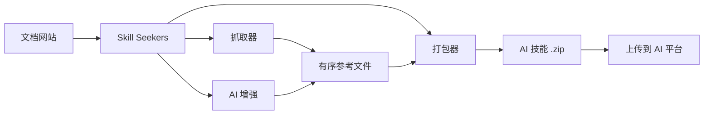

<p align="center">
  
</p>

# Skill Seekers

[English](README.md) | 简体中文 | [日本語](README.ja.md) | [한국어](README.ko.md) | [Español](README.es.md) | [Français](README.fr.md) | [Deutsch](README.de.md) | [Português](README.pt-BR.md) | [Türkçe](README.tr.md) | [العربية](README.ar.md) | [हिन्दी](README.hi.md) | [Русский](README.ru.md)

> ⚠️ **机器翻译声明**
>
> 本文档由 AI 自动翻译生成。虽然我们努力确保翻译质量，但可能存在不准确或不自然的表述。
>
> 欢迎通过 [GitHub Issue #260](https://github.com/yusufkaraaslan/Skill_Seekers/issues/260) 帮助改进翻译！您的反馈对我们非常宝贵。

[](https://github.com/yusufkaraaslan/Skill_Seekers/releases)
[](https://opensource.org/licenses/MIT)
[](https://www.python.org/downloads/)
[](https://modelcontextprotocol.io)
[](tests/)
[](https://github.com/users/yusufkaraaslan/projects/2)
[](https://pypi.org/project/skill-seekers/)
[](https://pypi.org/project/skill-seekers/)
[](https://pypi.org/project/skill-seekers/)
[](https://pepy.tech/projects/skill-seekers)
<a href="https://trendshift.io/repositories/18329" target="_blank"></a>
[](https://skillseekersweb.com/)
[](https://x.com/_yUSyUS_)
[](https://github.com/yusufkaraaslan/Skill_Seekers)

**🧠 AI 系统的数据层。** Skill Seekers 将文档网站、GitHub 仓库、PDF、视频、笔记本、Wiki 等 18 种来源类型转换为结构化知识资产——可在几分钟（而非几小时）内为 AI 技能（Claude、Gemini、OpenAI）、RAG 流水线（LangChain、LlamaIndex、Pinecone）和 AI 编程助手（Cursor、Windsurf、Cline）提供支持。

> 🌐 **[访问 SkillSeekersWeb.com](https://skillseekersweb.com/)** - 浏览 24+ 个预设配置，分享您的配置，访问完整文档！

> 📋 **[查看开发路线图和任务](https://github.com/users/yusufkaraaslan/projects/2)** - 10 个类别的 134 个任务，选择任意一个参与贡献！

## 🌐 生态系统

Skill Seekers 是一个多仓库项目。以下是各部分所在位置：

| 仓库 | 描述 | 链接 |
|------|------|------|
| **[Skill_Seekers](https://github.com/yusufkaraaslan/Skill_Seekers)** | 核心 CLI 和 MCP 服务器（本仓库） | [PyPI](https://pypi.org/project/skill-seekers/) |
| **[skillseekersweb](https://github.com/yusufkaraaslan/skillseekersweb)** | 网站和文档 | [在线](https://skillseekersweb.com/) |
| **[skill-seekers-configs](https://github.com/yusufkaraaslan/skill-seekers-configs)** | 社区配置仓库 | |
| **[skill-seekers-action](https://github.com/yusufkaraaslan/skill-seekers-action)** | GitHub Action CI/CD | |
| **[skill-seekers-plugin](https://github.com/yusufkaraaslan/skill-seekers-plugin)** | Claude Code 插件 | |
| **[homebrew-skill-seekers](https://github.com/yusufkaraaslan/homebrew-skill-seekers)** | macOS Homebrew tap | |

> **想要贡献？** 网站和配置仓库是新贡献者的最佳起点！

## 🧠 AI 系统的数据层

**Skill Seekers 是通用预处理层**，位于原始文档和所有使用它的 AI 系统之间。无论您是在构建 Claude 技能、LangChain RAG 流水线，还是 Cursor `.cursorrules` 文件——数据准备工作完全相同。只需执行一次，即可导出到所有目标平台。

```bash
# 一条命令 → 结构化知识资产
skill-seekers create https://docs.react.dev/
# 或: skill-seekers create facebook/react
# 或: skill-seekers create ./my-project

# 导出到任意 AI 系统
skill-seekers package output/react --target claude      # → Claude AI 技能 (ZIP)
skill-seekers package output/react --target langchain   # → LangChain Documents
skill-seekers package output/react --target llama-index # → LlamaIndex TextNodes
skill-seekers package output/react --target cursor      # → .cursorrules
skill-seekers package output/react --target ibm-bob     # → IBM Bob 技能目录
```

### 可构建的输出

| 输出 | 目标 | 应用场景 |
|------|------|---------|
| **Claude 技能** (ZIP + YAML) | `--target claude` | Claude Code、Claude API |
| **Gemini 技能** (tar.gz) | `--target gemini` | Google Gemini |
| **OpenAI / Custom GPT** (ZIP) | `--target openai` | GPT-4o、自定义助手 |
| **LangChain Documents** | `--target langchain` | QA 链、智能体、检索器 |
| **LlamaIndex TextNodes** | `--target llama-index` | 查询引擎、对话引擎 |
| **Haystack Documents** | `--target haystack` | 企业级 RAG 流水线 |
| **Pinecone 就绪** (Markdown) | `--target markdown` | 向量上传 |
| **ChromaDB / FAISS / Qdrant** | `--target chroma/faiss/qdrant` | 本地向量数据库 |
| **IBM Bob 技能**（目录） | `--target ibm-bob` | IBM Bob 项目/全局技能 |
| **Cursor** `.cursorrules` | `--target markdown` → 复制 SKILL.md | Cursor IDE `.cursorrules` |
| **Windsurf / Cline / Continue** | `--target claude` → 复制 | VS Code、IntelliJ、Vim |

### 为什么选择 Skill Seekers

- ⚡ **快 99%** — 数天的手动数据准备 → 15–45 分钟
- 🎯 **AI 技能质量** — 500+ 行的 SKILL.md 文件，包含示例、模式和指南
- 📊 **RAG 就绪的分块** — 智能分块保留代码块并维护上下文
- 🎬 **视频** — 从 YouTube 和本地视频提取代码、字幕和结构化知识
- 🔄 **多源支持** — 将 18 种来源类型（文档、GitHub、PDF、视频、笔记本、Wiki 等）合并为一个知识资产
- 🌐 **一次准备，导出所有目标** — 无需重新抓取即可将同一资产导出到 21 个平台
- ✅ **久经考验** — 3,700+ 测试，24+ 框架预设，生产就绪

## 🚀 快速开始（3 条命令）

```bash
# 1. 安装
pip install skill-seekers

# 2. 从任意来源创建技能
skill-seekers create https://docs.django.com/

# 3. 为您的 AI 平台打包
skill-seekers package output/django --target claude
```

**就是这么简单！** 您现在已拥有可直接使用的 `output/django-claude.zip`。

```bash
# 使用其他 AI 代理进行增强（默认：claude）
skill-seekers create https://docs.django.com/ --agent kimi
skill-seekers create https://docs.django.com/ --agent codex
skill-seekers create https://docs.django.com/ --agent-cmd "my-custom-agent run"
```

### 🛰️ AI 驱动的项目扫描（新功能）

将 `scan` 指向任意项目，AI 代理会读取其清单文件、README、Dockerfile/CI 和采样的源码导入——然后为每个检测到的框架生成一个配置文件，并为您自己的代码生成 `<project>-codebase.json`。它会固定检测到的版本，因此重新运行时会报告版本升级：

```bash
skill-seekers scan ./my-react-app --out ./configs/scanned/
# → react.json, vite.json, tailwind.json, jest.json, my-react-app-codebase.json

# 然后构建其中任意一个
skill-seekers create ./configs/scanned/react.json
```

如果某个检测结果没有现成预设，AI 会生成全新配置；退出时您可以选择将其发布回 [社区注册表](https://github.com/yusufkaraaslan/skill-seekers-configs)。

### 其他来源（支持 18 种）

```bash
# GitHub 仓库
skill-seekers create facebook/react

# 本地项目
skill-seekers create ./my-project

# PDF 文档
skill-seekers create manual.pdf

# Word 文档
skill-seekers create report.docx

# EPUB 电子书
skill-seekers create book.epub

# Jupyter 笔记本
skill-seekers create notebook.ipynb

# OpenAPI 规范
skill-seekers create openapi.yaml

# PowerPoint 演示文稿
skill-seekers create presentation.pptx

# AsciiDoc 文档
skill-seekers create guide.adoc

# 本地 HTML 文件（根据扩展名自动检测）
skill-seekers create page.html

# 整个 HTML 文件目录（自动检测以 HTML 为主的目录）
skill-seekers create ./mirror_output/site/

# 在代码混杂的目录上强制 HTML 模式
skill-seekers create ./repo/ --html-path ./repo/docs/build/html/

# RSS/Atom 订阅源
skill-seekers create feed.rss

# Man 手册页
skill-seekers create curl.1

# 视频（YouTube、Vimeo 或本地文件 — 需要 skill-seekers[video]）
skill-seekers create --video-url https://www.youtube.com/watch?v=... --name mytutorial
# 首次使用？自动安装 GPU 感知的视觉依赖：
skill-seekers create --setup

# Confluence 维基
skill-seekers create --space-key TEAM --name wiki

# Notion 页面
skill-seekers create --database-id ... --name docs

# Slack/Discord 聊天记录
skill-seekers create --chat-export-path ./slack-export --name team-chat
```

### 导出到任何地方

```bash
# 为多个平台打包
for platform in claude gemini openai langchain; do
  skill-seekers package output/django --target $platform
done
```

## 什么是 Skill Seekers？

Skill Seekers 是 **AI 系统的数据层**，将 18 种来源类型——文档网站、GitHub 仓库、PDF、视频、Jupyter 笔记本、Word/EPUB/AsciiDoc 文档、OpenAPI 规范、PowerPoint 演示文稿、RSS 订阅源、Man 手册页、Confluence 维基、Notion 页面、Slack/Discord 聊天记录等——转换为适用于所有 AI 目标的结构化知识资产：

| 使用场景 | 获得的内容 | 示例 |
|---------|-----------|------|
| **AI 技能** | 完整的 SKILL.md + 参考文件 | Claude Code、Gemini、GPT |
| **RAG 流水线** | 带丰富元数据的分块文档 | LangChain、LlamaIndex、Haystack |
| **向量数据库** | 预格式化的待上传数据 | Pinecone、Chroma、Weaviate、FAISS |
| **AI 编程助手** | IDE AI 自动读取的上下文文件 | Cursor、Windsurf、Cline、Continue.dev |

## 📚 文档

| 我想要... | 阅读此文档 |
|--------------|-----------|
| **快速上手** | [快速开始](docs/getting-started/02-quick-start.md) - 3 条命令构建首个技能 |
| **理解概念** | [核心概念](docs/user-guide/01-core-concepts.md) - 工作原理 |
| **抓取来源** | [抓取指南](docs/user-guide/02-scraping.md) - 所有来源类型 |
| **增强技能** | [增强指南](docs/user-guide/03-enhancement.md) - AI 增强 |
| **导出技能** | [打包指南](docs/user-guide/04-packaging.md) - 平台导出 |
| **查询命令** | [CLI 参考](docs/reference/CLI_REFERENCE.md) - 全部 20 条命令 |
| **进行配置** | [配置格式](docs/reference/CONFIG_FORMAT.md) - JSON 规范 |
| **解决问题** | [故障排除](docs/user-guide/06-troubleshooting.md) - 常见问题 |

**完整文档：** [docs/README.md](docs/README.md)

Skill Seekers 通过以下步骤代替数天的手动预处理工作：

1. **采集** — 文档、GitHub 仓库、本地代码库、PDF、视频、笔记本、Wiki 等 10 种以上来源类型
2. **分析** — 深度 AST 解析、模式检测、API 提取
3. **结构化** — 带元数据的分类参考文件
4. **增强** — AI 驱动的 SKILL.md 生成（Claude、Gemini 或本地）
5. **导出** — 从一个资产导出到 16 种平台专用格式

## 为什么使用 Skill Seekers？

### 面向 AI 技能构建者（Claude、Gemini、OpenAI）

- 🎯 **生产级技能** — 500+ 行的 SKILL.md 文件，包含代码示例、模式和指南
- 🔄 **增强工作流** — 应用 `security-focus`、`architecture-comprehensive` 或自定义 YAML 预设
- 🎮 **任意领域** — 游戏引擎（Godot、Unity）、框架（React、Django）、内部工具
- 🔧 **团队协作** — 将内部文档 + 代码整合为单一事实来源
- 📚 **高质量** — AI 增强，包含示例、快速参考和导航指南

### 面向 RAG 构建者和 AI 工程师

- 🤖 **RAG 就绪数据** — 预分块的 LangChain `Documents`、LlamaIndex `TextNodes`、Haystack `Documents`
- 🚀 **快 99%** — 数天的预处理 → 15–45 分钟
- 📊 **智能元数据** — 类别、来源、类型 → 更高的检索精度
- 🔄 **多源支持** — 在一个流水线中合并文档 + GitHub + PDF + 视频
- 🌐 **平台无关** — 无需重新抓取即可导出到任意向量数据库或框架

### 面向 AI 编程助手用户

- 💻 **Cursor / Windsurf / Cline** — 自动生成 `.cursorrules` / `.windsurfrules` / `.clinerules`
- 🎯 **持久上下文** — AI "了解"您的框架，无需重复提示
- 📚 **始终最新** — 文档更新时可在几分钟内更新上下文

## 核心功能

### 🌐 文档抓取
- ✅ **智能 SPA 发现** - 针对 JavaScript SPA 网站的三层发现机制（sitemap.xml → llms.txt → 无头浏览器渲染）
- ✅ **llms.txt 支持** - 自动检测并使用 LLM 就绪文档文件（快 10 倍）
- ✅ **通用抓取器** - 适用于任意文档网站
- ✅ **智能分类** - 按主题自动组织内容
- ✅ **代码语言检测** - 识别 Python、JavaScript、C++、GDScript 等
- ✅ **24+ 即用预设** - Godot、React、Vue、Django、FastAPI 等

### 📄 PDF 支持
- ✅ **基础 PDF 提取** - 从 PDF 提取文本、代码和图片
- ✅ **扫描件 OCR** - 从扫描文档提取文本
- ✅ **密码保护 PDF** - 处理加密 PDF
- ✅ **表格提取** - 提取复杂表格
- ✅ **并行处理** - 大型 PDF 快 3 倍
- ✅ **智能缓存** - 重复运行快 50%

### 🎬 视频提取
- ✅ **YouTube 和本地视频** - 从视频提取字幕、屏幕代码和结构化知识
- ✅ **视觉帧分析** - OCR 提取代码编辑器、终端、幻灯片和图表内容
- ✅ **GPU 自动检测** - 自动安装正确的 PyTorch 版本（CUDA/ROCm/MPS/CPU）
- ✅ **AI 增强** - 两阶段增强：清理 OCR + 生成精美 SKILL.md
- ✅ **时间裁剪** - 提取视频的特定片段（`--start-time`、`--end-time`）
- ✅ **播放列表支持** - 批量处理 YouTube 播放列表中的所有视频
- ✅ **Vision API 回退** - 对低置信度 OCR 帧使用 Claude Vision

### 🐙 GitHub 仓库分析
- ✅ **深度代码分析** - 支持 Python、JavaScript、TypeScript、Java、C++、Go 的 AST 解析
- ✅ **API 提取** - 函数、类、方法及参数和类型
- ✅ **仓库元数据** - README、文件树、语言统计、星标/分支数
- ✅ **GitHub Issues 和 PR** - 获取带标签和里程碑的开放/已关闭 issues
- ✅ **CHANGELOG 和发布** - 自动提取版本历史
- ✅ **冲突检测** - 对比文档化 API 与实际代码实现
- ✅ **MCP 集成** - 自然语言："抓取 GitHub 仓库 facebook/react"

### 🔄 统一多源抓取
- ✅ **合并多个来源** - 在一个技能中混合文档 + GitHub + PDF
- ✅ **冲突检测** - 自动发现文档与代码之间的差异
- ✅ **智能合并** - 基于规则或 AI 驱动的冲突解决
- ✅ **透明报告** - 带 ⚠️ 警告的并排对比
- ✅ **文档差距分析** - 识别过时文档和未文档化功能
- ✅ **单一事实来源** - 一个技能同时展示意图（文档）和现实（代码）
- ✅ **向后兼容** - 遗留单源配置继续有效

### 🤖 多 LLM 平台支持
- ✅ **12 个 LLM 平台** - Claude AI、Google Gemini、OpenAI ChatGPT、MiniMax AI、通用 Markdown、OpenCode、Kimi（月之暗面）、DeepSeek AI、Qwen（阿里巴巴）、OpenRouter、Together AI、Fireworks AI
- ✅ **通用抓取** - 相同文档适用于所有平台
- ✅ **平台专用打包** - 针对每个 LLM 的优化格式
- ✅ **一键导出** - `--target` 标志选择平台
- ✅ **可选依赖** - 仅安装所需内容
- ✅ **100% 向后兼容** - 现有 Claude 工作流无需更改

| 平台 | 格式 | 上传 | 增强 | API Key | 自定义端点 |
|------|------|------|------|---------|-----------|
| **Claude AI** | ZIP + YAML | ✅ 自动 | ✅ 是 | ANTHROPIC_API_KEY | ANTHROPIC_BASE_URL |
| **Google Gemini** | tar.gz | ✅ 自动 | ✅ 是 | GOOGLE_API_KEY | - |
| **OpenAI ChatGPT** | ZIP + Vector Store | ✅ 自动 | ✅ 是 | OPENAI_API_KEY | - |
| **MiniMax AI** | ZIP + Knowledge Files | ✅ 自动 | ✅ 是 | MINIMAX_API_KEY | - |
| **通用 Markdown** | ZIP | ❌ 手动 | ❌ 否 | - | - |

```bash
# Claude（默认 - 无需更改！）
skill-seekers package output/react/
skill-seekers upload react.zip

# Google Gemini
pip install skill-seekers[gemini]
skill-seekers package output/react/ --target gemini
skill-seekers upload react-gemini.tar.gz --target gemini

# OpenAI ChatGPT
pip install skill-seekers[openai]
skill-seekers package output/react/ --target openai
skill-seekers upload react-openai.zip --target openai

# MiniMax AI
pip install skill-seekers[minimax]
skill-seekers package output/react/ --target minimax
skill-seekers upload react-minimax.zip --target minimax

# 通用 Markdown（通用导出）
skill-seekers package output/react/ --target markdown
# Markdown 文件可直接用于任意 LLM
```

<details>
<summary>🔧 <strong>使用您自己的 AI 提供商（OpenAI 兼容端点 + 订阅计划，无需 Anthropic 额度）</strong></summary>

可选的 AI **增强**步骤（由 `create`、`scan` 和 `enhance` 使用）**不需要** Anthropic 密钥。您有三种方式为其供能：

**1. 使用您已付费的订阅 — 完全无需 API 额度（LOCAL 代理模式）**

Skill Seekers 可以调用您已登录的编程代理 CLI，因此增强会使用您现有的订阅计划而非按量计费的 API token：

```bash
skill-seekers create <source> --agent codex     # OpenAI Codex CLI → 您的 ChatGPT Plus
skill-seekers create <source> --agent claude    # Claude Code      → 您的 Claude Pro/Max
```

支持的代理：`claude`、`codex`、`copilot`、`opencode`、`kimi` 和 `custom`
（将 `--agent custom` 与 `--agent-cmd "<your-cli> ..."` 组合可驱动任意其他工具）。

**2. 任意 OpenAI 兼容提供商（OpenRouter、Groq、Cerebras、Mistral、NVIDIA NIM 等）**

这些提供商都暴露 OpenAI 兼容的 `/v1` 端点。只需三个环境变量即可让 Skill Seekers 指向其中之一——它会检测 `OPENAI_API_KEY`，而 OpenAI SDK 会自动识别 `OPENAI_BASE_URL`：

```bash
export OPENAI_API_KEY="<your provider key>"
export OPENAI_BASE_URL="https://openrouter.ai/api/v1"   # 提供商端点（见下表）
export OPENAI_MODEL="<a model that provider offers>"     # 必填 — 默认的 gpt-4o 在其他提供商处不存在
skill-seekers create <source>
```

| 提供商       | `OPENAI_BASE_URL`                          |
|--------------|--------------------------------------------|
| OpenRouter   | `https://openrouter.ai/api/v1`             |
| Groq         | `https://api.groq.com/openai/v1`           |
| Cerebras     | `https://api.cerebras.ai/v1`               |
| Mistral      | `https://api.mistral.ai/v1`                |
| NVIDIA NIM   | `https://integrate.api.nvidia.com/v1`      |

> 提供商检测会选取**第一个**找到的 API 密钥环境变量（`ANTHROPIC_API_KEY` → `GOOGLE_API_KEY` → `OPENAI_API_KEY` → `MOONSHOT_API_KEY`）。设置 `SKILL_SEEKER_PROVIDER` 可强制指定提供商，或确保优先级更高的密钥未被设置。

**3. Claude 兼容端点（如 GLM、代理服务）**

```bash
export ANTHROPIC_API_KEY="your-key"
export ANTHROPIC_BASE_URL="https://your-claude-compatible-endpoint/v1"
```

Google Gemini（`GOOGLE_API_KEY`）和 Kimi/月之暗面（`MOONSHOT_API_KEY`）也获得原生支持。完整列表（包括每个提供商的模型覆盖设置）请参阅 **[环境变量参考](docs/reference/ENVIRONMENT_VARIABLES.md#llm-provider-selection)**。

</details>

**安装：**
```bash
# 安装 Gemini 支持
pip install skill-seekers[gemini]

# 安装 OpenAI 支持
pip install skill-seekers[openai]

# 安装 MiniMax 支持
pip install skill-seekers[minimax]

# 安装所有 LLM 平台
pip install skill-seekers[all-llms]
```

### 🔗 RAG 框架集成

- ✅ **LangChain Documents** - 直接导出为 `Document` 格式，包含 `page_content` + 元数据
  - 适用于：QA 链、检索器、向量存储、智能体
  - 示例：[LangChain RAG 流水线](examples/langchain-rag-pipeline/)
  - 指南：[LangChain 集成](docs/integrations/LANGCHAIN.md)

- ✅ **LlamaIndex TextNodes** - 导出为带唯一 ID + 嵌入的 `TextNode` 格式
  - 适用于：查询引擎、对话引擎、存储上下文
  - 示例：[LlamaIndex 查询引擎](examples/llama-index-query-engine/)
  - 指南：[LlamaIndex 集成](docs/integrations/LLAMA_INDEX.md)

- ✅ **Pinecone 就绪格式** - 针对向量数据库上传进行优化
  - 适用于：生产级向量搜索、语义搜索、混合搜索
  - 示例：[Pinecone 上传](examples/pinecone-upsert/)
  - 指南：[Pinecone 集成](docs/integrations/PINECONE.md)

**快速导出：**
```bash
# LangChain Documents（JSON）
skill-seekers package output/django --target langchain
# → output/django-langchain.json

# LlamaIndex TextNodes（JSON）
skill-seekers package output/django --target llama-index
# → output/django-llama-index.json

# Markdown（通用）
skill-seekers package output/django --target markdown
# → output/django-markdown/SKILL.md + references/
```

**完整 RAG 流水线指南：** [RAG 流水线文档](docs/integrations/RAG_PIPELINES.md)

---

### 🧠 AI 编程助手集成

将任意框架文档转换为 4+ 种 AI 助手的专家编程上下文：

- ✅ **Cursor IDE** - 为 AI 驱动的代码建议生成 `.cursorrules`
  - 适用于：框架专用代码生成、一致的编码模式
  - 兼容工具：Cursor IDE（VS Code 分支）
  - 指南：[Cursor 集成](docs/integrations/CURSOR.md)
  - 示例：[Cursor React 技能](examples/cursor-react-skill/)

- ✅ **Windsurf** - 使用 `.windsurfrules` 自定义 Windsurf AI 助手上下文
  - 适用于：IDE 原生 AI 辅助、流式编程
  - 兼容工具：Codeium 出品的 Windsurf IDE
  - 指南：[Windsurf 集成](docs/integrations/WINDSURF.md)
  - 示例：[Windsurf FastAPI 上下文](examples/windsurf-fastapi-context/)

- ✅ **Cline（VS Code）** - VS Code 智能体的系统提示 + MCP
  - 适用于：VS Code 中的智能代码生成
  - 兼容工具：VS Code 的 Cline 扩展
  - 指南：[Cline 集成](docs/integrations/CLINE.md)
  - 示例：[Cline Django 助手](examples/cline-django-assistant/)

- ✅ **Continue.dev** - 与 IDE 无关的 AI 上下文服务器
  - 适用于：多 IDE 环境（VS Code、JetBrains、Vim），自定义 LLM 提供商
  - 兼容工具：任何带有 Continue.dev 插件的 IDE
  - 指南：[Continue 集成](docs/integrations/CONTINUE_DEV.md)
  - 示例：[Continue 通用上下文](examples/continue-dev-universal/)

**快速导出（适用于 AI 编程工具）：**
```bash
# 适用于任意 AI 编程助手（Cursor、Windsurf、Cline、Continue.dev）
skill-seekers create --config configs/django.json
skill-seekers package output/django --target claude  # 或 --target markdown

# 复制到项目（以 Cursor 为例）
cp output/django-claude/SKILL.md my-project/.cursorrules

# 或用于 Windsurf
cp output/django-claude/SKILL.md my-project/.windsurf/rules/django.md

# 或用于 Cline
cp output/django-claude/SKILL.md my-project/.clinerules

# 或用于 Continue.dev（HTTP 服务器）
python examples/continue-dev-universal/context_server.py
# 在 ~/.continue/config.json 中配置
```

**集成中心：** [所有 AI 系统集成](docs/integrations/INTEGRATIONS.md)

---

### 🌊 三流 GitHub 架构
- ✅ **三流分析** - 将 GitHub 仓库拆分为代码流、文档流和洞察流
- ✅ **统一代码库分析器** - 同时适用于 GitHub URL 和本地路径
- ✅ **C3.x 分析深度** - 选择"basic"（1–2 分钟）或"c3x"（20–60 分钟）分析
- ✅ **增强路由生成** - GitHub 元数据、README 快速入门、常见问题
- ✅ **Issue 集成** - 来自 GitHub Issues 的常见问题和解决方案
- ✅ **智能路由关键词** - GitHub 标签权重加倍，提升主题检测效果

**三流说明：**
- **流 1：代码** - 深度 C3.x 分析（模式、示例、指南、配置、架构）
- **流 2：文档** - 仓库文档（README、CONTRIBUTING、docs/*.md）
- **流 3：洞察** - 社区知识（Issues、标签、Stars、Forks）

```python
from skill_seekers.cli.unified_codebase_analyzer import UnifiedCodebaseAnalyzer

# 使用三流分析 GitHub 仓库
analyzer = UnifiedCodebaseAnalyzer()
result = analyzer.analyze(
    source="https://github.com/facebook/react",
    depth="c3x",  # 或 "basic" 快速分析
    fetch_github_metadata=True
)

# 访问代码流（C3.x 分析）
print(f"设计模式: {len(result.code_analysis['c3_1_patterns'])}")
print(f"测试示例: {result.code_analysis['c3_2_examples_count']}")

# 访问文档流（仓库文档）
print(f"README: {result.github_docs['readme'][:100]}")

# 访问洞察流（GitHub 元数据）
print(f"Stars: {result.github_insights['metadata']['stars']}")
print(f"常见问题: {len(result.github_insights['common_problems'])}")
```

**完整文档**：[三流实现总结](docs/archive/historical/IMPLEMENTATION_SUMMARY_THREE_STREAM.md)

### 🔐 智能速率限制管理与配置
- ✅ **多 Token 配置系统** - 管理多个 GitHub 账号（个人、工作、开源）
  - 安全配置存储在 `~/.config/skill-seekers/config.json`（权限 600）
  - 每个配置文件的速率限制策略：`prompt`、`wait`、`switch`、`fail`
  - 每个配置文件可设置超时（默认：30 分钟，防止无限等待）
  - 智能回退链：CLI 参数 → 环境变量 → 配置文件 → 提示
  - Claude、Gemini、OpenAI 的 API Key 管理
- ✅ **交互式配置向导** - 美观的终端 UI，轻松设置
  - 浏览器集成辅助创建 token（自动打开 GitHub 等）
  - Token 验证和连接测试
  - 带颜色编码的可视化状态显示
- ✅ **智能速率限制处理器** - 不再无限等待！
  - 关于速率限制的预先警告（60 次/小时 vs 5000 次/小时）
  - 从 GitHub API 响应中实时检测
  - 带进度的实时倒计时
  - 速率受限时自动切换配置文件
  - 四种策略：prompt（询问）、wait（倒计时）、switch（切换）、fail（中止）
- ✅ **断点续传** - 继续中断的任务
  - 按可配置间隔自动保存进度（默认：60 秒）
  - 列出所有可恢复任务及其进度详情
  - 自动清理旧任务（默认：7 天）
- ✅ **CI/CD 支持** - 非交互式自动化模式
  - `--non-interactive` 标志快速失败、无提示
  - `--profile` 标志选择特定 GitHub 账号
  - 适用于流水线日志的清晰错误消息

**快速设置：**
```bash
# 一次性配置（5 分钟）
skill-seekers config --github

# 为私有仓库使用特定配置文件
skill-seekers create mycompany/private-repo --profile work

# CI/CD 模式（快速失败，无提示）
skill-seekers create owner/repo --non-interactive

# 恢复中断的任务
skill-seekers resume --list
skill-seekers resume github_react_20260117_143022
```

**速率限制策略说明：**
- **prompt**（默认）- 速率受限时询问操作（等待、切换、设置 token、取消）
- **wait** - 带倒计时自动等待（遵守超时设置）
- **switch** - 自动尝试下一个可用配置文件（适用于多账号场景）
- **fail** - 立即失败并给出清晰错误（适合 CI/CD）

### 🎯 Bootstrap 技能 - 自托管

将 skill-seekers 自身生成为技能，在您的 AI 代理（Claude Code、Kimi、Codex 等）中使用：

```bash
# 生成技能
./scripts/bootstrap_skill.sh

# 安装到 Claude Code
cp -r output/skill-seekers ~/.claude/skills/
```

**您将获得：**
- ✅ **完整的技能文档** - 所有 CLI 命令和使用模式
- ✅ **CLI 命令参考** - 每个工具及其选项的文档
- ✅ **快速入门示例** - 常见工作流和最佳实践
- ✅ **自动生成的 API 文档** - 代码分析、模式和示例

### 🔐 私有配置仓库
- ✅ **基于 Git 的配置源** - 从私有/团队 Git 仓库获取配置
- ✅ **多源管理** - 注册无限数量的 GitHub、GitLab、Bitbucket 仓库
- ✅ **团队协作** - 在 3–5 人团队间共享自定义配置
- ✅ **企业支持** - 通过基于优先级的解析扩展到 500+ 开发者
- ✅ **安全认证** - 环境变量 token（GITHUB_TOKEN、GITLAB_TOKEN）
- ✅ **智能缓存** - 克隆一次，自动拉取更新
- ✅ **离线模式** - 离线时使用缓存的配置工作

### 🤖 代码库分析（C3.x）

**C3.4：配置模式提取（含 AI 增强）**
- ✅ **9 种配置格式** - JSON、YAML、TOML、ENV、INI、Python、JavaScript、Dockerfile、Docker Compose
- ✅ **7 种模式类型** - 数据库、API、日志、缓存、邮件、认证、服务器配置
- ✅ **AI 增强** - 可选双模式 AI 分析（API + LOCAL）
  - 解释每项配置的作用
  - 建议最佳实践和改进方案
  - **安全分析** - 发现硬编码的密钥和暴露的凭证
- ✅ **自动文档生成** - 为所有配置生成 JSON + Markdown 文档
- ✅ **MCP 集成** - 支持增强的 `extract_config_patterns` 工具

**C3.3：AI 增强操作指南**
- ✅ **全面 AI 增强** - 将基础指南转换为专业教程
- ✅ **5 项自动改进** - 步骤说明、故障排除、前提条件、后续步骤、使用场景
- ✅ **双模式支持** - API 模式（Claude API）或 LOCAL 模式（Claude Code CLI）
- ✅ **LOCAL 模式零成本** - 使用您的 Claude Code Max 计划免费增强
- ✅ **质量蜕变** - 75 行模板 → 500+ 行的完整指南

**使用方法：**
```bash
# 快速分析（1–2 分钟，仅基础功能）
skill-seekers scan tests/ --quick

# 全面分析（含 AI，20–60 分钟）
skill-seekers scan tests/ --comprehensive

# 含 AI 增强
skill-seekers scan tests/ --enhance
```

**完整文档：** [docs/features/HOW_TO_GUIDES.md](docs/features/HOW_TO_GUIDES.md#ai-enhancement-new)

### 🔄 增强工作流预设

可重用的 YAML 定义增强流水线，控制 AI 如何将原始文档转换为精心打磨的技能。

- ✅ **5 个内置预设** — `default`、`minimal`、`security-focus`、`architecture-comprehensive`、`api-documentation`
- ✅ **用户自定义预设** — 将自定义工作流添加到 `~/.config/skill-seekers/workflows/`
- ✅ **多工作流链式** — 在一条命令中链式使用两个或更多工作流
- ✅ **完整 CLI 管理** — 列出、查看、复制、添加、删除和验证工作流

```bash
# 应用单个工作流
skill-seekers create ./my-project --enhance-workflow security-focus

# 链式多个工作流（按顺序应用）
skill-seekers create ./my-project \
  --enhance-workflow security-focus \
  --enhance-workflow minimal

# 管理预设
skill-seekers workflows list                          # 列出所有（内置 + 用户）
skill-seekers workflows show security-focus           # 显示 YAML 内容
skill-seekers workflows copy security-focus           # 复制到用户目录以便编辑
skill-seekers workflows add ./my-workflow.yaml        # 安装自定义预设
skill-seekers workflows remove my-workflow            # 删除用户预设
skill-seekers workflows validate security-focus       # 验证预设结构

# 同时复制多个
skill-seekers workflows copy security-focus minimal api-documentation

# 同时添加多个文件
skill-seekers workflows add ./wf-a.yaml ./wf-b.yaml

# 同时删除多个
skill-seekers workflows remove my-wf-a my-wf-b
```

**YAML 预设格式：**
```yaml
name: security-focus
description: "安全重点审查：漏洞、认证、数据处理"
version: "1.0"
stages:
  - name: vulnerabilities
    type: custom
    prompt: "审查 OWASP Top 10 和常见安全漏洞..."
  - name: auth-review
    type: custom
    prompt: "检查认证和授权模式..."
    uses_history: true
```

### ⚡ 性能与规模
- ✅ **异步模式** - 使用 async/await 抓取速度快 2–3 倍（使用 `--async` 标志）
- ✅ **大型文档支持** - 通过智能拆分处理 10K–40K+ 页文档
- ✅ **路由器/Hub 技能** - 智能路由到专用子技能
- ✅ **并行抓取** - 同时处理多个技能
- ✅ **检查点/续传** - 长时间抓取永不丢失进度
- ✅ **缓存系统** - 抓取一次，即时重建

### 🤖 与代理无关的技能生成
- ✅ **多代理支持** - 通过 `--agent` 标志为 Claude、Kimi、Codex、Copilot、OpenCode 或任意自定义代理生成技能
- ✅ **自定义代理命令** - 使用 `--agent-cmd` 指定用于增强的自定义代理 CLI 命令
- ✅ **通用标志** - `--agent` 和 `--agent-cmd` 在所有命令（create、scrape、github、pdf 等）中均可用

### 📦 市场流水线
- ✅ **发布到市场** - 将技能发布到 Claude Code 插件市场仓库
- ✅ **端到端流水线** - 从文档来源到已发布的市场条目

### ✅ 质量保证
- ✅ **全面测试** - 3,700+ 测试，全面覆盖

---

## 📦 安装

```bash
# 基础安装（文档抓取、GitHub 分析、PDF、打包）
pip install skill-seekers

# 包含所有 LLM 平台支持
pip install skill-seekers[all-llms]

# 包含 MCP 服务器
pip install skill-seekers[mcp]

# 全部功能
pip install skill-seekers[all]
```

**需要帮助选择？** 运行设置向导：
```bash
skill-seekers-setup
```

### 安装选项

| 安装命令 | 功能 |
|---------|------|
| `pip install skill-seekers` | 抓取、GitHub 分析、PDF、所有平台 |
| `pip install skill-seekers[gemini]` | + Google Gemini 支持 |
| `pip install skill-seekers[openai]` | + OpenAI ChatGPT 支持 |
| `pip install skill-seekers[all-llms]` | + 所有 LLM 平台 |
| `pip install skill-seekers[mcp]` | + 适用于 Claude Code、Cursor 等的 MCP 服务器 |
| `pip install skill-seekers[video]` | + YouTube/Vimeo 字幕和元数据提取 |
| `pip install skill-seekers[video-full]` | + Whisper 转录和视觉帧提取 |
| `pip install skill-seekers[jupyter]` | + Jupyter 笔记本支持 |
| `pip install skill-seekers[pptx]` | + PowerPoint 支持 |
| `pip install skill-seekers[confluence]` | + Confluence 维基支持 |
| `pip install skill-seekers[notion]` | + Notion 页面支持 |
| `pip install skill-seekers[rss]` | + RSS/Atom 订阅源支持 |
| `pip install skill-seekers[chat]` | + Slack/Discord 聊天记录支持 |
| `pip install skill-seekers[asciidoc]` | + AsciiDoc 文档支持 |
| `pip install skill-seekers[all]` | 全部功能 |

> **视频视觉依赖（GPU 感知）：** 安装 `skill-seekers[video-full]` 后，运行
> `skill-seekers create --setup` 自动检测您的 GPU 并安装正确的 PyTorch
> 版本 + easyocr。这是安装视觉提取依赖的推荐方式。

---

## 🚀 一键安装工作流

**从配置到上传技能的最快方式——全自动化：**

```bash
# 从官方配置安装 React 技能（自动上传到 Claude）
skill-seekers install --config react

# 从本地配置文件安装
skill-seekers install --config configs/custom.json

# 安装但不上传（仅打包）
skill-seekers install --config django --no-upload

# 预览工作流而不执行
skill-seekers install --config react --dry-run
```

**耗时：** 总计 20–45 分钟 | **质量：** 生产就绪（9/10） | **成本：** 免费

**执行阶段：**
```
📥 阶段 1：获取配置（如果提供配置名称）
📖 阶段 2：抓取文档
✨ 阶段 3：AI 增强（必选 - 不可跳过）
📦 阶段 4：打包技能
☁️  阶段 5：上传到 Claude（可选，需要 API Key）
```

**要求：**
- ANTHROPIC_API_KEY 环境变量（用于自动上传）
- Claude Code Max 计划（用于本地 AI 增强），或使用 `--agent` 选择其他 AI 代理

---

## 📊 功能矩阵

Skill Seekers 支持 **12 个 LLM 平台**、**8 个 RAG/向量目标**、**18 种来源类型**，并在所有目标上实现完全的功能对等。

**平台：** Claude AI、Google Gemini、OpenAI ChatGPT、MiniMax AI、通用 Markdown、OpenCode、Kimi（月之暗面）、DeepSeek AI、Qwen（阿里巴巴）、OpenRouter、Together AI、Fireworks AI
**来源类型：** 文档网站、GitHub 仓库、PDF、Word (.docx)、EPUB、视频、本地代码库、Jupyter 笔记本、本地 HTML、OpenAPI/Swagger、AsciiDoc、PowerPoint (.pptx)、RSS/Atom 订阅源、Man 手册页、Confluence 维基、Notion 页面、Slack/Discord 聊天记录

完整信息请查看 [完整功能矩阵](docs/reference/FEATURE_MATRIX.md)。

### 快速平台对比

| 功能 | Claude | Gemini | OpenAI | MiniMax | Markdown |
|------|--------|--------|--------|---------|----------|
| 格式 | ZIP + YAML | tar.gz | ZIP + Vector | ZIP + Knowledge | ZIP |
| 上传 | ✅ API | ✅ API | ✅ API | ✅ API | ❌ 手动 |
| 增强 | ✅ Sonnet 4 | ✅ 2.0 Flash | ✅ GPT-4o | ✅ M3 | ❌ 无 |
| 所有技能模式 | ✅ | ✅ | ✅ | ✅ | ✅ |

---

## 使用示例

### 文档抓取

```bash
# 抓取文档网站
skill-seekers create --config configs/react.json

# 快速抓取（无需配置）
skill-seekers create https://react.dev --name react

# 异步模式（快 3 倍）
skill-seekers create --config configs/godot.json --async --workers 8

# 使用特定 AI 代理进行增强
skill-seekers create --config configs/react.json --agent kimi
```

### PDF 提取

```bash
# 基础 PDF 提取
skill-seekers create --pdf docs/manual.pdf --name myskill

# 高级功能
skill-seekers create --pdf docs/manual.pdf --name myskill \
    --extract-tables \        # 提取表格
    --parallel \              # 快速并行处理
    --workers 8               # 使用 8 个 CPU 核心

# 扫描 PDF（需要: pip install pytesseract Pillow）
skill-seekers create --pdf docs/scanned.pdf --name myskill --ocr
```

### 视频提取

```bash
# 安装视频支持
pip install skill-seekers[video]        # 字幕 + 元数据
pip install skill-seekers[video-full]   # + Whisper 转录 + 视觉帧提取

# 自动检测 GPU 并安装视觉依赖（PyTorch + easyocr）
skill-seekers create --setup

# 从 YouTube 视频提取
skill-seekers create --video-url https://www.youtube.com/watch?v=dQw4w9WgXcQ --name mytutorial

# 从 YouTube 播放列表提取
skill-seekers create --video-playlist https://www.youtube.com/playlist?list=... --name myplaylist

# 从本地视频文件提取
skill-seekers create --video-file recording.mp4 --name myrecording

# 使用视觉帧分析提取（需要 video-full 依赖）
skill-seekers create --video-url https://www.youtube.com/watch?v=... --name mytutorial --visual

# 使用 AI 增强（清理 OCR + 生成精美 SKILL.md）
skill-seekers create --video-url https://www.youtube.com/watch?v=... --visual --enhance-level 2

# 裁剪视频的特定片段（支持秒数、MM:SS、HH:MM:SS 格式）
skill-seekers create --video-url https://www.youtube.com/watch?v=... --start-time 1:30 --end-time 5:00

# 使用 Vision API 处理低置信度 OCR 帧（需要 ANTHROPIC_API_KEY）
skill-seekers create --video-url https://www.youtube.com/watch?v=... --visual --vision-ocr

# 从之前提取的数据重建技能（跳过下载）
skill-seekers create --from-json output/mytutorial/video_data/extracted_data.json --name mytutorial
```

> **完整指南：** 参见 [docs/VIDEO_GUIDE.md](docs/VIDEO_GUIDE.md) 了解完整 CLI 参考、
> 视觉流水线详情、AI 增强选项和故障排除。

### GitHub 仓库分析

```bash
# 基础仓库抓取
skill-seekers create facebook/react

# 配置认证（更高速率限制）
export GITHUB_TOKEN=ghp_your_token_here
skill-seekers create facebook/react

# 自定义包含内容
skill-seekers create django/django \
    --include-issues \        # 提取 GitHub Issues
    --max-issues 100 \        # 限制 issue 数量
    --include-changelog       # 提取 CHANGELOG.md
```

### 统一多源抓取

**将文档 + GitHub + PDF 合并为一个带冲突检测的统一技能：**

```bash
# 使用现有统一配置
skill-seekers create --config configs/react_unified.json
skill-seekers create --config configs/django_unified.json

# 或创建统一配置
cat > configs/myframework_unified.json << 'EOF'
{
  "name": "myframework",
  "merge_mode": "rule-based",
  "sources": [
    {
      "type": "documentation",
      "base_url": "https://docs.myframework.com/",
      "max_pages": 200
    },
    {
      "type": "github",
      "repo": "owner/myframework",
      "code_analysis_depth": "surface"
    }
  ]
}
EOF

skill-seekers create --config configs/myframework_unified.json
```

**冲突检测自动发现：**
- 🔴 **代码中缺失**（高）：已文档化但未实现
- 🟡 **文档中缺失**（中）：已实现但未文档化
- ⚠️ **签名不匹配**：参数/类型不同
- ℹ️ **描述不匹配**：解释不同

**完整指南：** 参见 [docs/features/UNIFIED_SCRAPING.md](docs/features/UNIFIED_SCRAPING.md)。

### 私有配置仓库

**使用私有 Git 仓库在团队间共享自定义配置：**

```bash
# 选项 1：使用 MCP 工具（推荐）
# 注册团队私有仓库
add_config_source(
    name="team",
    git_url="https://github.com/mycompany/skill-configs.git",
    token_env="GITHUB_TOKEN"
)

# 从团队仓库获取配置
fetch_config(source="team", config_name="internal-api")
```

**支持的平台：**
- GitHub（`GITHUB_TOKEN`）、GitLab（`GITLAB_TOKEN`）、Gitea（`GITEA_TOKEN`）、Bitbucket（`BITBUCKET_TOKEN`）

**完整指南：** 参见 [docs/reference/GIT_CONFIG_SOURCES.md](docs/reference/GIT_CONFIG_SOURCES.md)。

## 工作原理



0. **检测 llms.txt** - 优先检查 llms-full.txt、llms.txt、llms-small.txt（智能 SPA 发现的一部分）
1. **抓取**：提取文档中的所有页面
2. **分类**：将内容组织为主题（API、指南、教程等）
3. **增强**：AI 分析文档并创建包含示例的完整 SKILL.md（通过 `--agent` 支持多种代理）
4. **打包**：将所有内容打包为平台就绪的 `.zip` 文件

## 架构

系统由 **8 个核心模块**和 **5 个工具模块**组成（共约 200 个类）：


| 模块 | 用途 | 关键类 |
|------|------|--------|
| **CLICore** | Git 风格的命令分发器 | `CLIDispatcher`、`SourceDetector`、`CreateCommand` |
| **Scrapers** | 18 种来源类型提取器 | `DocToSkillConverter`、`DocumentSkillBuilder`（共享构建层）、`UnifiedScraper` |
| **Adaptors** | 20+ 输出平台格式 | `SkillAdaptor`（ABC）、`ClaudeAdaptor`、`LangChainAdaptor` |
| **Analysis** | C3.x 代码库分析流水线 | `UnifiedCodebaseAnalyzer`、`PatternRecognizer`、10 个 GoF 检测器 |
| **Enhancement** | 通过 `AgentClient` 实现 AI 驱动的技能改进 | `AgentClient`、`AIEnhancer`、`UnifiedEnhancer`、`WorkflowEngine` |
| **Packaging** | 打包、上传、安装技能 | `PackageSkill`、`InstallAgent` |
| **MCP** | FastMCP 服务器（40 个工具） | `SkillSeekerMCPServer`、10 个工具模块 |
| **Sync** | 文档变更检测 | `ChangeDetector`、`SyncMonitor`、`Notifier` |

工具模块：**Parsers**（28 个 CLI 解析器）、**Storage**（S3/GCS/Azure）、**Embedding**（多提供商向量）、**Benchmark**（性能）、**Utilities**（16 个共享辅助工具）。

完整 UML 图：**[docs/UML_ARCHITECTURE.md](docs/UML_ARCHITECTURE.md)** | StarUML 项目：`docs/UML/skill_seekers.mdj` | HTML API 参考：`docs/UML/html/`

## 📋 前提条件

**开始前，请确保您具备：**

1. **Python 3.10 或更高版本** - [下载](https://www.python.org/downloads/) | 检查：`python3 --version`
2. **Git** - [下载](https://git-scm.com/) | 检查：`git --version`
3. **15–30 分钟**用于首次设置

**首次使用？** → **[从这里开始：防弹快速入门指南](BULLETPROOF_QUICKSTART.md)** 🎯

---

## 📤 上传技能到 Claude

技能打包完成后，需要将其上传到 Claude：

### 选项 1：自动上传（基于 API）

```bash
# 设置 API Key（一次性）
export ANTHROPIC_API_KEY=sk-ant-...

# 打包并自动上传
skill-seekers package output/react/ --upload

# 或上传已有的 .zip
skill-seekers upload output/react.zip
```

### 选项 2：手动上传（无需 API Key）

```bash
# 打包技能
skill-seekers package output/react/
# → 创建 output/react.zip

# 然后手动上传：
# - 访问 https://claude.ai/skills
# - 点击"上传技能"
# - 选择 output/react.zip
```

### 选项 3：MCP（Claude Code）

```
在 Claude Code 中，直接询问：
"打包并上传 React 技能"
```

---

## 🤖 安装到 AI 代理

Skill Seekers 可自动将技能安装到 19 个 AI 编程代理。

```bash
# 安装到特定代理
skill-seekers install-agent output/react/ --agent cursor

# 安装到 IBM Bob（项目本地 .bob/skills/）
skill-seekers install-agent output/react/ --agent bob

# 一次性安装到所有代理
skill-seekers install-agent output/react/ --agent all

# 预览而不安装
skill-seekers install-agent output/react/ --agent cursor --dry-run
```

### 支持的代理

| 代理 | 路径 | 类型 |
|------|------|------|
| **Claude Code** | `~/.claude/skills/` | 全局 |
| **Cursor** | `.cursor/skills/` | 项目 |
| **VS Code / Copilot** | `.github/skills/` | 项目 |
| **Amp** | `~/.amp/skills/` | 全局 |
| **Goose** | `~/.config/goose/skills/` | 全局 |
| **OpenCode** | `~/.opencode/skills/` | 全局 |
| **Windsurf** | `~/.windsurf/skills/` | 全局 |
| **Roo Code** | `.roo/skills/` | 项目 |
| **Cline** | `.cline/skills/` | 项目 |
| **Aider** | `~/.aider/skills/` | 全局 |
| **Bolt** | `.bolt/skills/` | 项目 |
| **Kilo Code** | `.kilo/skills/` | 项目 |
| **Continue** | `~/.continue/skills/` | 全局 |
| **Kimi Code** | `~/.kimi/skills/` | 全局 |
| **IBM Bob** | `.bob/skills/` | 项目 |

---

## 🔌 MCP 集成（40 个工具）

Skill Seekers 提供 MCP 服务器，可在 Claude Code、Cursor、Windsurf、VS Code + Cline 或 IntelliJ IDEA 中使用。

```bash
# stdio 模式（Claude Code、VS Code + Cline）
python -m skill_seekers.mcp.server_fastmcp

# HTTP 模式（Cursor、Windsurf、IntelliJ）
python -m skill_seekers.mcp.server_fastmcp --transport http --port 8765

# 一次性自动配置所有代理
./setup_mcp.sh
```

**全部 40 个可用工具：**
- **核心（9 个）：** `list_configs`、`generate_config`、`validate_config`、`estimate_pages`、`scrape_docs`、`package_skill`、`upload_skill`、`enhance_skill`、`install_skill`
- **扩展（10 个）：** `scrape_github`、`scrape_pdf`、`unified_scrape`、`merge_sources`、`detect_conflicts`、`add_config_source`、`fetch_config`、`list_config_sources`、`remove_config_source`、`split_config`
- **向量数据库（4 个）：** `export_to_chroma`、`export_to_weaviate`、`export_to_faiss`、`export_to_qdrant`
- **云存储（3 个）：** `cloud_upload`、`cloud_download`、`cloud_list`

**完整指南：** [docs/guides/MCP_SETUP.md](docs/guides/MCP_SETUP.md)

---

## ⚙️ 配置

### 可用预设（24+）

```bash
# 列出所有预设
# skill-seekers list-configs  # v3.7.0 中不可用
```

| 类别 | 预设 |
|------|------|
| **Web 框架** | `react`、`vue`、`angular`、`svelte`、`nextjs` |
| **Python** | `django`、`flask`、`fastapi`、`sqlalchemy`、`pytest` |
| **游戏开发** | `godot`、`pygame`、`unity` |
| **工具与 DevOps** | `docker`、`kubernetes`、`terraform`、`ansible` |
| **统一（文档 + GitHub）** | `react-unified`、`vue-unified`、`nextjs-unified` 等 |

### 创建您自己的配置

```bash
# 选项 1：交互式
skill-seekers create --interactive

# 选项 2：复制并编辑预设
cp configs/react.json configs/myframework.json
nano configs/myframework.json
skill-seekers create --config configs/myframework.json
```

### 配置文件结构

```json
{
  "name": "myframework",
  "description": "何时使用此技能",
  "base_url": "https://docs.myframework.com/",
  "selectors": {
    "main_content": "article",
    "title": "h1",
    "code_blocks": "pre code"
  },
  "url_patterns": {
    "include": ["/docs", "/guide"],
    "exclude": ["/blog", "/about"]
  },
  "categories": {
    "getting_started": ["intro", "quickstart"],
    "api": ["api", "reference"]
  },
  "rate_limit": 0.5,
  "max_pages": 500
}
```

### 配置存储位置

工具按以下顺序搜索：
1. 提供的确切路径
2. `./configs/`（当前目录）
3. `~/.config/skill-seekers/configs/`（用户配置目录）
4. SkillSeekersWeb.com API（预设配置）

---

## 📊 创建的内容

```
output/
├── godot_data/              # 抓取的原始数据
│   ├── pages/              # JSON 文件（每页一个）
│   └── summary.json        # 概览
│
└── godot/                   # 技能文件
    ├── SKILL.md            # 含真实示例的增强版
    ├── references/         # 分类文档
    │   ├── index.md
    │   ├── getting_started.md
    │   ├── scripting.md
    │   └── ...
    ├── scripts/            # 空（可添加自己的脚本）
    └── assets/             # 空（可添加自己的资源）
```

---

## 🐛 故障排除

### 未提取到内容？
- 检查您的 `main_content` 选择器
- 尝试：`article`、`main`、`div[role="main"]`

### 数据存在但不使用？
```bash
# 强制重新抓取
rm -rf output/myframework_data/
skill-seekers create --config configs/myframework.json
```

### 分类不理想？
编辑配置中的 `categories` 部分，使用更好的关键词。

### 想要更新文档？
```bash
# 删除旧数据并重新抓取
rm -rf output/godot_data/
skill-seekers create --config configs/godot.json
```

### 增强不工作？
```bash
# 检查 API Key 是否设置
echo $ANTHROPIC_API_KEY

# 尝试 LOCAL 模式（使用 Claude Code Max，无需 API Key）
skill-seekers enhance output/react/ --mode LOCAL

# 监控后台增强状态
skill-seekers enhance-status output/react/ --watch
```

### GitHub 速率限制问题？
```bash
# 设置 GitHub Token（5000 次/小时 vs 匿名 60 次/小时）
export GITHUB_TOKEN=ghp_your_token_here

# 或配置多个配置文件
skill-seekers config --github
```

---

## 📈 性能

| 任务 | 时间 | 备注 |
|------|------|------|
| 抓取（同步）| 15–45 分钟 | 仅首次，基于线程 |
| 抓取（异步）| 5–15 分钟 | `--async` 标志快 2–3 倍 |
| 构建 | 1–3 分钟 | 从缓存快速重建 |
| 重建 | <1 分钟 | 使用 `--skip-scrape` |
| 增强（LOCAL）| 30–60 秒 | 使用 Claude Code Max |
| 增强（API）| 20–40 秒 | 需要 API Key |
| 视频（字幕）| 1–3 分钟 | YouTube/本地，仅字幕 |
| 视频（视觉）| 5–15 分钟 | + OCR 帧提取 |
| 打包 | 5–10 秒 | 最终 .zip 创建 |

---

## 🆕 v3.6.0 新增功能

### 工作流预设
使用 `--preset` 控制分析深度：

```bash
skill-seekers create https://docs.react.dev/ --preset quick      # 快速，浅层分析
skill-seekers create https://docs.react.dev/ --preset standard   # 平衡（默认）
skill-seekers create https://docs.react.dev/ --preset comprehensive # 深度，详尽分析
```

### 生命周期标志
```bash
skill-seekers create https://docs.react.dev/ --dry-run    # 不抓取预览
skill-seekers create https://docs.react.dev/ --fresh      # 忽略缓存，完整重新抓取
skill-seekers create https://docs.react.dev/ --resume     # 恢复中断的任务
skill-seekers create https://docs.react.dev/ --skip-scrape # 重新打包现有输出
```

### 健康检查与工具
```bash
skill-seekers doctor                    # 诊断安装与环境
skill-seekers sync-config               # 配置漂移检测
skill-seekers stream <source>           # 大型文档流式摄取
skill-seekers update output/react/      # 增量更新
skill-seekers multilang <source>        # 多语言技能生成
skill-seekers quality output/react/     # 质量报告（添加 --threshold 7 设置门槛：低于 7/10 时非零退出）
```

### RAG 分块选项（打包）
```bash
skill-seekers package output/react/ --chunk-for-rag --chunk-tokens 512 --chunk-overlap-tokens 50
```

### 市场发布
```bash
skill-seekers package output/react/ --marketplace --marketplace-category frontend
```

### 其他可选依赖
| Extra | 安装 | 用途 |
|-------|------|------|
| `browser` | `pip install "skill-seekers[browser]"` | 适用于 SPA 网站的无头 Playwright |
| `embedding` | `pip install "skill-seekers[embedding]"` | 嵌入服务器支持 |
| `s3` / `gcs` / `azure` | `pip install "skill-seekers[s3]"` 等 | 云存储上传 |
| `rag-upload` | `pip install "skill-seekers[rag-upload]"` | 组合向量数据库上传依赖 |

---

## 📚 文档

### 入门指南
- **[BULLETPROOF_QUICKSTART.md](BULLETPROOF_QUICKSTART.md)** - 🎯 **新用户从这里开始！**
- **[QUICKSTART.md](docs/archive/legacy/QUICKSTART.md)** - 有经验用户的快速入门
- **[TROUBLESHOOTING.md](TROUBLESHOOTING.md)** - 常见问题和解决方案
- **[docs/archive/legacy/QUICK_REFERENCE.md](docs/archive/legacy/QUICK_REFERENCE.md)** - 单页速查表

### 架构
- **[docs/UML_ARCHITECTURE.md](docs/UML_ARCHITECTURE.md)** - 包含 14 张图的 UML 架构概览
- **[docs/UML/exports/](docs/UML/exports/)** - PNG 图导出（包概览 + 13 张类图）
- **[docs/UML/html/](docs/UML/html/index.html/index.html)** - 完整 HTML API 参考（所有类、操作、属性）
- **[docs/UML/skill_seekers.mdj](docs/UML/skill_seekers.mdj)** - StarUML 项目文件（使用 [StarUML](https://staruml.io/) 打开）

### 指南
- **[docs/reference/LARGE_DOCUMENTATION.md](docs/reference/LARGE_DOCUMENTATION.md)** - 处理 10K–40K+ 页文档
- **[docs/features/ENHANCEMENT_MODES.md](docs/features/ENHANCEMENT_MODES.md)** - AI 增强模式指南
- **[docs/guides/MCP_SETUP.md](docs/guides/MCP_SETUP.md)** - MCP 集成设置
- **[docs/features/UNIFIED_SCRAPING.md](docs/features/UNIFIED_SCRAPING.md)** - 多源抓取
- **[docs/VIDEO_GUIDE.md](docs/VIDEO_GUIDE.md)** - 视频提取完整指南

### 集成指南
- **[docs/integrations/LANGCHAIN.md](docs/integrations/LANGCHAIN.md)** - LangChain RAG
- **[docs/integrations/CURSOR.md](docs/integrations/CURSOR.md)** - Cursor IDE
- **[docs/integrations/WINDSURF.md](docs/integrations/WINDSURF.md)** - Windsurf IDE
- **[docs/integrations/CLINE.md](docs/integrations/CLINE.md)** - Cline（VS Code）
- **[docs/integrations/RAG_PIPELINES.md](docs/integrations/RAG_PIPELINES.md)** - 所有 RAG 流水线

---

## 📝 许可证

MIT 许可证 - 详见 [LICENSE](LICENSE) 文件

---

祝您构建技能愉快！ 🚀

---

## 🔒 安全

[](https://mseep.ai/app/yusufkaraaslan-skill-seekers)

---

## 💛 赞助商

<p align="center">
  <a href="https://www.atlascloud.ai/?utm_source=github&utm_medium=link&utm_campaign=skill_seekers">
    
  </a>
</p>

[Atlas Cloud](https://www.atlascloud.ai/?utm_source=github&utm_medium=link&utm_campaign=skill_seekers) — 全模态、OpenAI 兼容的 AI 推理平台。Skill Seekers 通过 `--target atlas`（配置 `ATLAS_API_KEY`）支持将其作为打包/增强目标。
