# Skill Seekers Architecture

> Updated 2026-06-11 | StarUML project: `docs/UML/skill_seekers.mdj`
>
> ⚠️ The PNG exports under `docs/UML/exports/` predate the Grand Unification
> refactor (see `docs/UNIFICATION_PLAN.md`) and are stale where noted below
> (CLICore, Scrapers, Enhancement, MCP Server, Parsers). The text in this file
> is current; regenerate the exports from StarUML when possible.

## Overview

Skill Seekers converts documentation from 18 source types into production-ready formats for 24+ AI platforms. The architecture follows a layered module design with 9 core modules and 5 utility modules. Source-type ingestion is routed through a single `skill-seekers create` command via the `SkillConverter` base class + factory pattern. A separate `skill-seekers scan` command (added in #327) is the AI-driven project knowledge-base bootstrapper that emits one config per detected framework — these configs feed back into `create`.

## Package Diagram

**Core Modules** (upper area):
- **CLICore** -- Git-style command dispatcher, entry point for all `skill-seekers` commands
- **Scan** -- AI-driven project knowledge-base bootstrapper (`scan_command.py` + `signal_collectors.py`); emits one config per detected framework + a `<project>-codebase.json`
- **Scrapers** -- 17 source-type extractors (web, GitHub, PDF, Word, EPUB, video, etc.)
- **Adaptors** -- Strategy+Factory pattern for 20+ output platforms (Claude, Gemini, OpenAI, RAG frameworks)
- **Analysis** -- C3.x codebase analysis pipeline (AST parsing, 10 GoF pattern detectors, guide builders)
- **Enhancement** -- AI-powered skill improvement via `AgentClient` (API mode: Anthropic/Kimi/Gemini/OpenAI + LOCAL mode: Claude Code/Kimi/Codex/Copilot/OpenCode/custom, --enhance-level 0-3)
- **Packaging** -- Package, upload, and install skills to AI agent directories
- **MCP** -- FastMCP server exposing 40 tools via stdio/HTTP transport (includes marketplace and config publishing)
- **Sync** -- Documentation change detection and re-scraping triggers

**Utility Modules** (lower area):
- **Parsers** -- CLI argument parsers (30+ SubcommandParser subclasses)
- **Storage** -- Cloud storage abstraction (S3, GCS, Azure)
- **Embedding** -- Multi-provider vector embedding generation
- **Benchmark** -- Performance measurement framework
- **Utilities** -- Shared helpers (LanguageDetector, RAGChunker, MarkdownCleaner, etc.)

## Core Module Diagrams

### CLICore
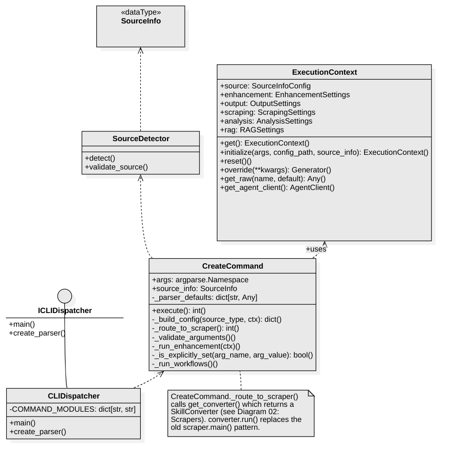

Entry point: `skill-seekers` CLI. `CLIDispatcher` maps subcommands to modules via `COMMAND_MODULES` dict (`scan`/`doctor` use the newer `COMMAND_CLASSES` table — `Cls(args).execute()`). Every command's flags are defined exactly once, in the central `SubcommandParser` classes (`cli/parsers/`); module `main(args=None)` standalone paths build their parser FROM the central class, and a drift-guard test (`tests/test_cli_parsers.py`) pins dests/defaults/option-strings equality. Exit codes are standardized in `cli/exit_codes.py` (0/1/2/130). `CreateCommand` auto-detects source type via `SourceDetector`, initializes `ExecutionContext` singleton (Pydantic model, single source of truth for all config; `override()` is contextvars-based, so concurrent threads/async tasks can't clobber each other), then calls `get_converter()` → `converter.run()`. Enhancement runs centrally in CreateCommand after the converter completes. *(PNG export predates the single-definition parsers + exit codes.)*

### Scrapers
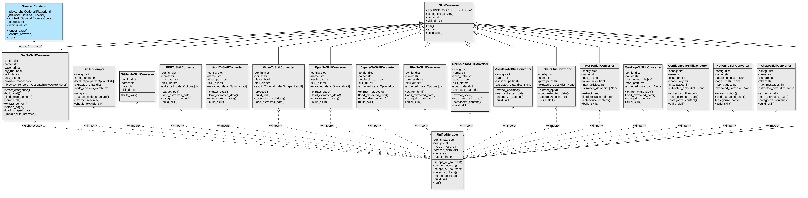

18 converter classes inheriting `SkillConverter` base class (Template Method: `run()` → `extract()` → `build_skill()`). Factory: `get_converter(source_type, config)` via `CONVERTER_REGISTRY`. No `main()` entry points — all routing through `CreateCommand`. The 9 document scrapers (pdf, word, epub, html, pptx, jupyter, man, rss, chat) inherit the intermediate `DocumentSkillBuilder` base (`cli/document_skill_builder.py`), which owns the shared build-side machinery (categorization, reference/index/SKILL.md generation) with class-attr + hook-method variation points; ports are byte-identical, pinned by golden trees (`tests/golden/phase2/`). `UnifiedScraper` (multi-source orchestrator) routes via a class-level `SOURCE_DISPATCH` table with a shared `_scrape_with_converter()` engine for the 13 mechanical source types, and is factory-constructible: `get_converter("config", {"config_path": ...})`. Notable: `GitHubScraper` (3-stream fetcher) + `GitHubToSkillConverter` and `UnifiedSkillBuilder` (builder strategies, deliberately outside the converter hierarchy). *(PNG export predates DocumentSkillBuilder and SOURCE_DISPATCH.)*

### Scan

No UML export yet — pipeline is ~1100 lines across `scan_command.py` and `signal_collectors.py`. Dispatched via the new `COMMAND_CLASSES` table (`main.py`) — `ScanCommand(args).execute()` consumes the parsed argparse namespace directly, no duplicate argparse. Flow:

1. `collect_signals(root)` (`signal_collectors.py`) → `SignalBundle` with **per-kind byte budgets** (24 KB manifest / 6 KB README / 6 KB CI / 28 KB source samples, total 64 KB). Manifests cover ~50 file types; source samples are whole first-2-KB chunks (the AI parses imports — replaced the brittle regex approach in WS4). Source dirs cover web/JS monorepos + Go `cmd/` + Rust `crates/` + plus root-walk for Django/flat-Python.
2. `detect_with_ai(bundle, AgentClient)` (`scan_command.py`) → `list[Detection]`. Single LLM call with a canonical-slug-demanding prompt. JSON extracted via raw parse → markdown fence → bracket-substring fallback. Wraps `client.call` in try/except so auth/network errors don't crash the scan.
3. `_archive_removed(out_dir, removed_slugs)` — when a config disappears from current detections (per `diff_against_existing`), MOVE (not delete) to `out_dir/.archived/<UTC-timestamp>/`. Runs after diff, before fresh writes, so a re-emit with the same name doesn't race the move.
4. `resolve_or_generate_with_status(detection, probe_urls=…)` for each detection (capped at `--max-ai-generations`):
   - **Cache hit:** `out_dir/<slug>.json` exists from a prior scan → re-stamp `metadata.detected_version`, return.
   - **Resolve:** try each candidate from `_canonical_name_candidates` (original → lowercase → hyphenated → suffix-stripped, where suffixes include CJK + European-language terms for engine/framework/library/core → npm-scope-unwrap) via `resolve_config_path` (local repo → user dir → API). Always appends `.json` to the lookup name.
   - **Generate:** `generate_config_with_ai` produces a fresh unified config, validated by `UniSkillConfigValidator` and re-checked against the registry name regex `^[a-zA-Z0-9_-]+$`. With `probe_urls=True`: HEAD-probes `base_url` + GitHub repos; on 4xx/5xx re-prompts the AI with feedback; stamps `metadata._url_unverified` on confirmed-bad URLs.
5. `emit_codebase_config(root, out_dir)` — always writes `<project>-codebase.json` wrapping a `type: local` source.
6. `diff_against_existing(out_dir, detections)` — keyed by filename slug (not internal config name) so re-scans don't churn when the AI returns a display name and the registry has the canonical slug. Reads `metadata.detected_version` with backwards-compat fallback to legacy top-level placement.
7. `maybe_publish(generated, skip_prompt)` — **async-native** (WS11). Opt-in submission via the existing MCP `submit_config_tool`. Pre-checks `GITHUB_TOKEN`. `_find_existing_issue` queries GitHub Search API for an existing open issue with the same config name (idempotency). `_submit_config` retries transient failures (rate limit, 5xx) with 0s/5s/15s backoff and a 30s per-attempt timeout. `_prompt_async` wraps `input()` via `asyncio.to_thread` so the event loop isn't blocked.

The whole pipeline runs inside a single `asyncio.run` at `ScanCommand.execute()` — sync core (file IO, AgentClient, signal collection) inside, async publish at the edge. `--dry-run` previews steps 1-6 (without writing) and skips publish entirely.

All JSON writes use `_atomic_write_json` (temp file + `os.replace`) so SIGINT mid-write can't corrupt a config and silently flip it to "removed" on the next scan. `_safe_size` guards `stat()` so broken symlinks in `src/` don't crash signal collection. `logging.basicConfig` ensures `logger.warning`/`error` reaches the user (silenced by default without it). Exit code 1 when nothing was emitted, so CI shell pipelines detect total-failure scans.

### Adaptors
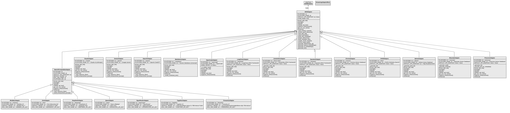

`SkillAdaptor` ABC with 3 abstract methods: `format_skill_md()`, `package()`, `upload()`. Two-level hierarchy: direct subclasses (Claude, Gemini, OpenAI, Markdown, OpenCode, RAG adaptors) and `OpenAICompatibleAdaptor` intermediate (MiniMax, Kimi, DeepSeek, Qwen, OpenRouter, Together, Fireworks).

### Analysis (C3.x Pipeline)
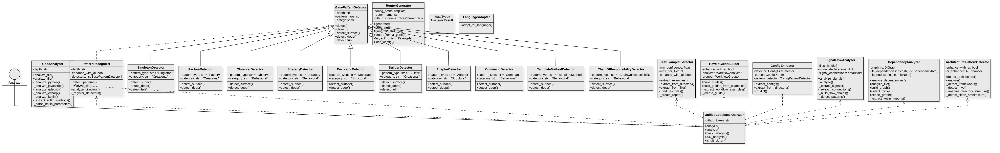

`UnifiedCodebaseAnalyzer` controller orchestrates: `CodeAnalyzer` (AST, 9 languages), `PatternRecognizer` (10 GoF detectors via `BasePatternDetector`), `TestExampleExtractor`, `HowToGuideBuilder`, `ConfigExtractor`, `SignalFlowAnalyzer`, `DependencyAnalyzer`, `ArchitecturalPatternDetector`.

### Enhancement
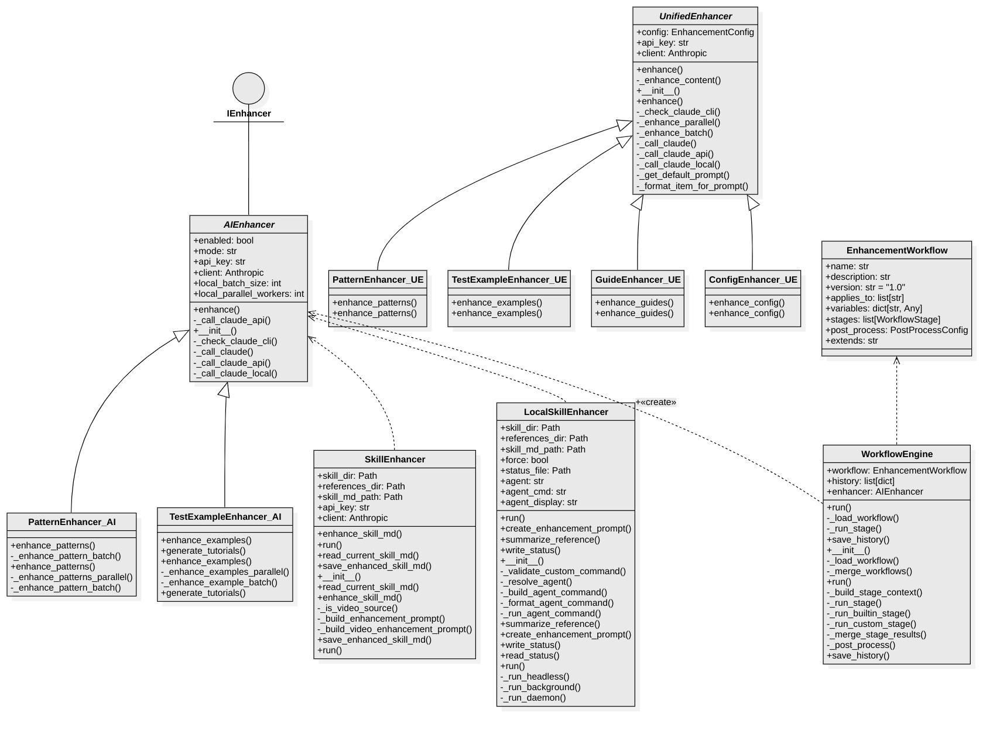

`AgentClient` (`cli/agent_client.py`) is the single AI transport: every API-mode enhancement call routes through it (provider/base_url/model overrides, system prompts, temperature, central truncation gate, timeout policy, error classification). The ordered `API_PROVIDERS` registry in agent_client is the one home for provider/env-var/priority data. SKILL.md enhancement flows through `SkillAdaptor._enhance_skill_md_via_client` (adaptors/base.py) with atomic backup saves — the claude/openai/gemini/openai_compatible adaptors' `enhance()` are thin routing declarations. Two enhancer hierarchies remain for C3.x content: `AIEnhancer` (ai_enhancer.py) and `UnifiedEnhancer` (their duplicated thread pools now share `cli/parallel_batches.py`). `WorkflowEngine` orchestrates multi-stage `EnhancementWorkflow`. LOCAL mode (Claude Code, Kimi Code, Codex, Copilot, OpenCode, custom agents) uses `build_local_agent_command()` and a recursion guard (`SKILL_SEEKER_ENHANCE_ACTIVE`) on every spawn path. *(PNG export predates the AgentClient consolidation.)*

### Packaging
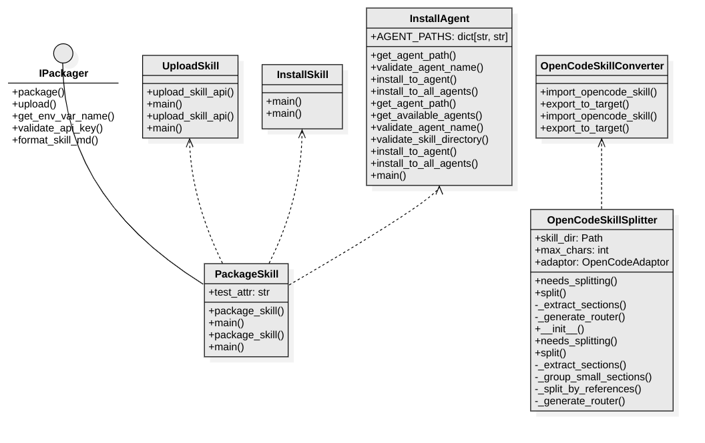

`PackageSkill` delegates to adaptors for format-specific packaging. `UploadSkill` handles platform API uploads. `InstallSkill`/`InstallAgent` install to AI agent directories. `OpenCodeSkillSplitter` handles large file splitting.

### MCP Server

`SkillSeekerMCPServer` (FastMCP) with 40 tools in 10 categories. The MCP layer is a thin adapter over the `skill_seekers.services` package, which now owns the shared domain classes: `SourceManager` (config CRUD), `GitConfigRepo` (community configs), `MarketplacePublisher` (publish skills to marketplace repos), `MarketplaceManager` (marketplace registry CRUD), `ConfigPublisher` (push configs to registered source repos + the only `detect_category` implementation). Back-compat shims remain at the old `mcp.*` paths. `AgentDetector` (environment detection) stays in mcp. Nine former subprocess tools (estimate_pages, detect_patterns, extract_test_examples, extract_config_patterns, build_how_to_guides, split_config, generate_router, package_skill, upload_skill) now run in-process via `run_cli_main()` in `mcp/tools/_common.py`; only LOCAL-agent enhancement stays subprocess by design. *(PNG export predates the services layer.)*

### Sync

`SyncMonitor` controller schedules periodic checks via `ChangeDetector` (SHA-256 hashing, HTTP headers, content diffing). `Notifier` sends alerts when changes are found. Pydantic models: `PageChange`, `ChangeReport`, `SyncConfig`, `SyncState`.

## Utility Module Diagrams

### Parsers
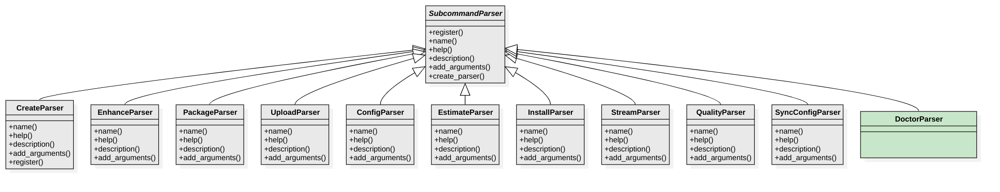

`SubcommandParser` ABC with 18 subclasses — individual scraper parsers removed after Grand Unification (all source types route through `CreateParser`). Remaining: Create, Doctor, Config, Enhance, EnhanceStatus, Package, Upload, Estimate, Install, InstallAgent, TestExamples, Resume, Quality, Workflows, SyncConfig, Stream, Update, Multilang. These central classes are the ONLY place a command's flags are defined — each module's standalone `main(args=None)` builds its parser from the central class, and `TestCentralParserSingleSource` pins the equality.

### Storage
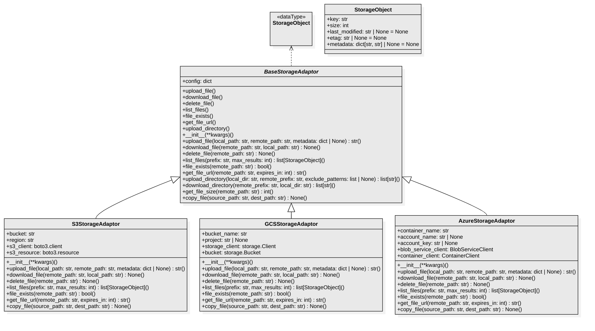

`BaseStorageAdaptor` ABC with `S3StorageAdaptor`, `GCSStorageAdaptor`, `AzureStorageAdaptor`. `StorageObject` dataclass for file metadata.

### Embedding

`EmbeddingGenerator` (multi-provider: OpenAI, Sentence Transformers, Voyage AI). `EmbeddingPipeline` coordinates provider, caching, and cost tracking. `EmbeddingProvider` ABC with OpenAI and Local implementations.

### Benchmark

`BenchmarkRunner` orchestrates `Benchmark` instances. `BenchmarkResult` collects timings/memory/metrics and produces `BenchmarkReport`. Supporting data types: `Metric`, `TimingResult`, `MemoryUsage`, `ComparisonReport`.

### Utilities
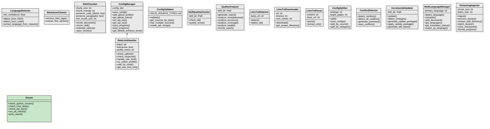

16 shared helper classes: `LanguageDetector`, `MarkdownCleaner`, `RAGChunker`, `RateLimitHandler`, `ConfigManager`, `ConfigValidator`, `SkillQualityChecker`, `QualityAnalyzer`, `LlmsTxtDetector`/`Downloader`/`Parser`, `ConfigSplitter`, `ConflictDetector`, `IncrementalUpdater`, `MultiLanguageManager`, `StreamingIngester`.

## Key Design Patterns

| Pattern | Where | Classes |
|---------|-------|---------|
| Strategy + Factory | Adaptors | `SkillAdaptor` ABC + `get_adaptor()` factory + 20+ implementations |
| Strategy + Factory | Storage | `BaseStorageAdaptor` ABC + S3/GCS/Azure |
| Strategy + Factory | Embedding | `EmbeddingProvider` ABC + OpenAI/Local |
| Template Method + Factory | Scrapers | `SkillConverter` base (+ `DocumentSkillBuilder` intermediate for the 9 document scrapers) + `get_converter()` factory + 18 converter subclasses |
| Singleton | Configuration | `ExecutionContext` Pydantic model — single source of truth for all config; `override()` layers a contextvars-based override over the base singleton (thread/async safe) |
| Command | CLI | `CLIDispatcher` + `COMMAND_MODULES` lazy dispatch (+ `COMMAND_CLASSES` for scan/doctor) |
| Template Method | Pattern Detection | `BasePatternDetector` + 10 GoF detectors |
| Template Method | Parsers | `SubcommandParser` + 18 subclasses |

## Behavioral Diagrams

### Create Pipeline Sequence
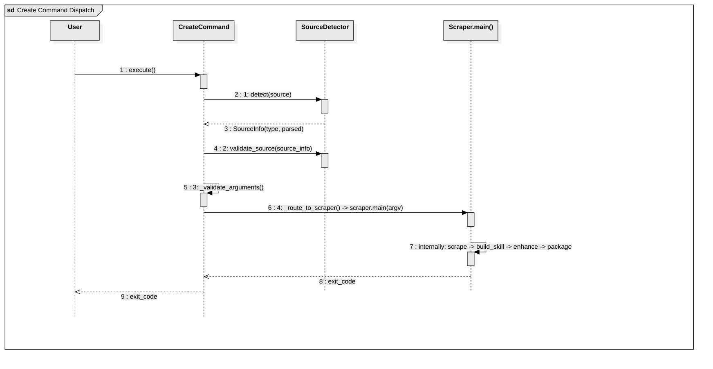

`CreateCommand` is now the pipeline orchestrator. Flow: User → `execute()` → `SourceDetector.detect(source)` → `validate_source()` → `ExecutionContext.initialize()` → `_validate_arguments()` → `get_converter(type, config)` → `converter.run()` (extract + build_skill) → `_run_enhancement(ctx)` → `_run_workflows()`. Enhancement is centralized in CreateCommand, not inside each converter.

### GitHub Unified Flow + C3.x
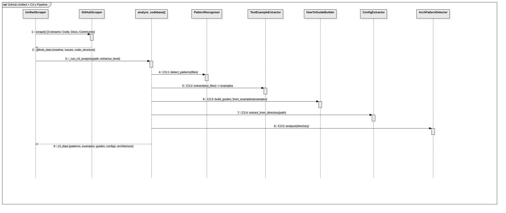

`UnifiedScraper` orchestrates GitHub scraping (3-stream fetch) then delegates to `analyze_codebase(enhance_level)` for C3.x analysis. Shows all 5 C3.x stages: `PatternRecognizer` (C3.1), `TestExampleExtractor` (C3.2), `HowToGuideBuilder` with examples from C3.2 (C3.3), `ConfigExtractor` (C3.4), and `ArchitecturalPatternDetector` (C3.5). Note: `enhance_level` is the sole AI control parameter — `enhance_with_ai`/`ai_mode` are internal to C3.x classes only.

### Source Auto-Detection
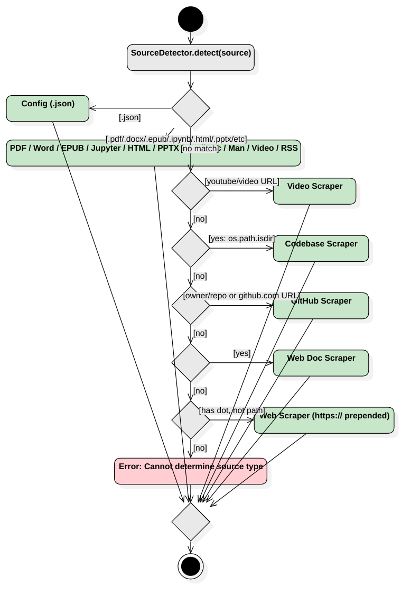

Activity diagram showing `source_detector.py` decision tree in correct code order: file extension first (.json config, .pdf/.docx/.epub/.ipynb/.html/.pptx/etc) → video URL → `os.path.isdir()` (Codebase) → GitHub pattern (owner/repo or github.com URL) → http/https URL (Web) → bare domain inference → error.

### MCP Tool Invocation
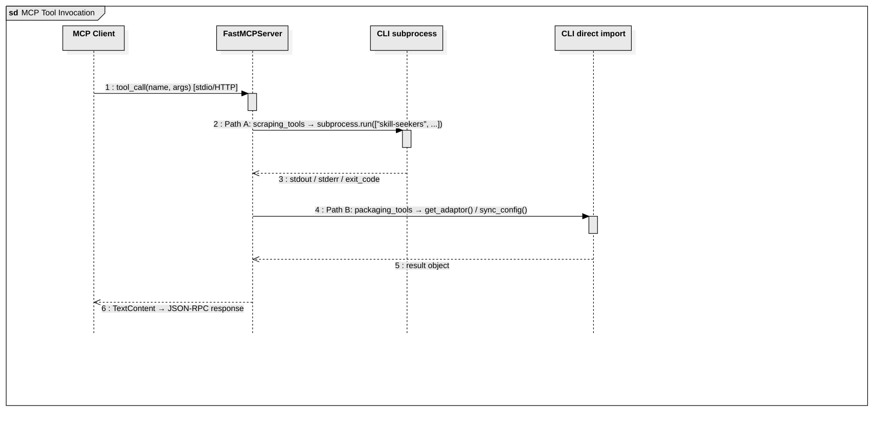

MCP Client (Claude Code/Cursor) → FastMCPServer (stdio/HTTP) with two invocation paths: **Path A** (scraping tools) uses `get_converter(type, config).run()` in-process via `_run_converter()` helper, **Path B** (packaging/analysis/config tools) runs in-process via direct Python imports or `run_cli_main()` (`mcp/tools/_common.py`), which parses argv with the command's real parser. Both return TextContent → JSON-RPC. Only LOCAL-agent enhancement (`enhance_skill`, `install_skill`'s enhance step) spawns subprocesses, by design.

### Enhancement Pipeline
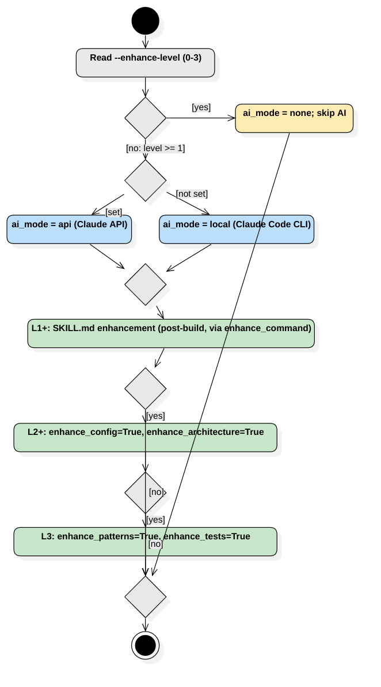

`--enhance-level` decision flow with precise internal variable mapping: Level 0 sets `ai_mode=none`, skips all AI. Level >= 1 selects `ai_mode=api` (if any supported API key set: Anthropic, Moonshot/Kimi, Gemini, OpenAI) or `ai_mode=local` (via `AgentClient` with configurable agent: Claude Code, Kimi, Codex, Copilot, OpenCode, or custom), then SKILL.md enhancement happens post-build via `enhance_command`. Level >= 2 enables `enhance_config=True`, `enhance_architecture=True` inside `analyze_codebase()`. Level 3 adds `enhance_patterns=True`, `enhance_tests=True`.

### Runtime Components
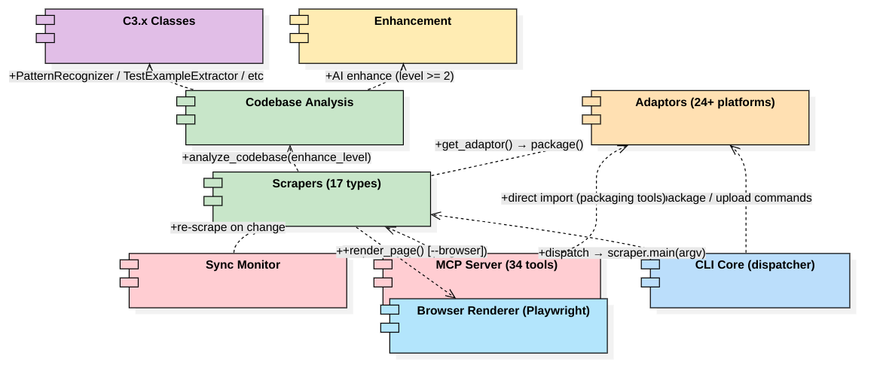

Component diagram with runtime dependencies. Key flows: `CLI Core` dispatches to `Scrapers` via `get_converter()` → `converter.run()` (in-process, no subprocess). `Scrapers` call `Codebase Analysis` via `analyze_codebase(enhance_level)`. `Codebase Analysis` uses `C3.x Classes` internally and `Enhancement` when level ≥ 2. `MCP Server` reaches `Scrapers` via `get_converter()` in-process and `Adaptors` via direct import. `Scrapers` optionally use `Browser Renderer (Playwright)` via `render_page()` when `--browser` flag is set for JavaScript SPA sites.

### Browser Rendering Flow
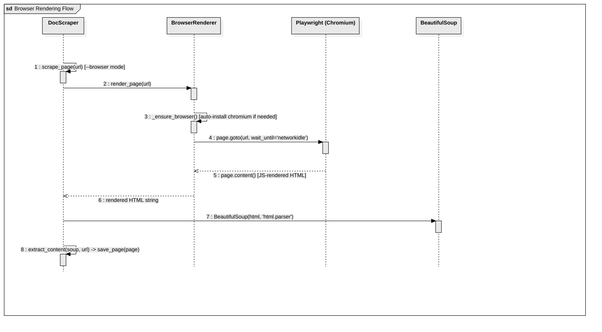

When `--browser` flag is set, `DocScraper.scrape_page()` delegates to `BrowserRenderer.render_page(url)` instead of `requests.get()`. The renderer auto-installs Chromium on first use, navigates with `wait_until='networkidle'` to let JavaScript execute, then returns the fully-rendered HTML. The rest of the pipeline (BeautifulSoup → `extract_content()` → `save_page()`) remains unchanged. Optional dependency: `pip install "skill-seekers[browser]"`.

## File Locations

- **StarUML project**: `docs/UML/skill_seekers.mdj`
- **Diagram exports**: `docs/UML/exports/*.png`
- **Source code**: `src/skill_seekers/`
